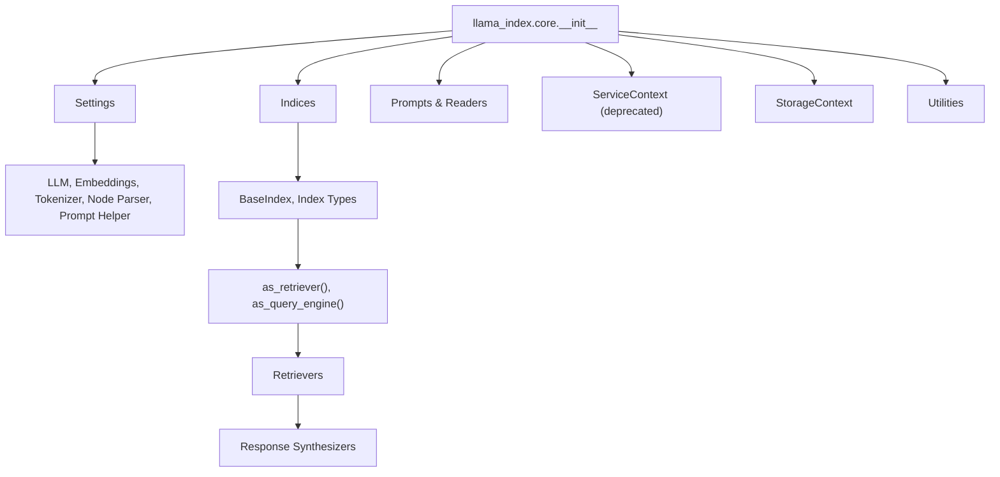
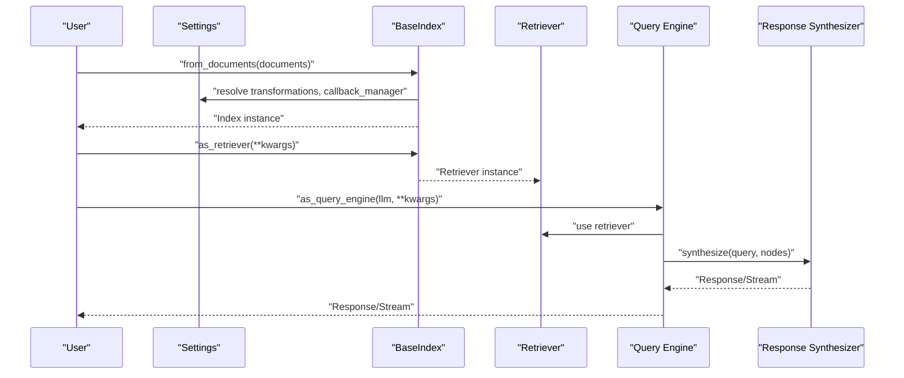
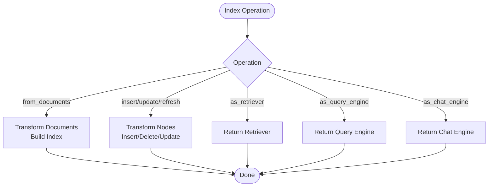
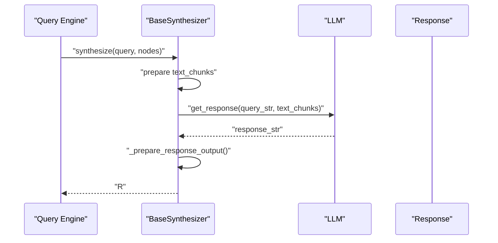
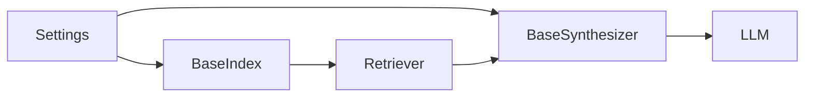

# API Reference

<cite>
**Referenced Files in This Document**
- [__init__.py](file://llama-index-core/llama_index/core/__init__.py)
- [settings.py](file://llama-index-core/llama_index/core/settings.py)
- [service_context.py](file://llama-index-core/llama_index/core/service_context.py)
- [schema.py](file://llama-index-core/llama_index/core/schema.py)
- [base.py](file://llama-index-core/llama_index/core/indices/base.py)
- [__init__.py](file://llama-index-core/llama_index/core/retrievers/__init__.py)
- [base.py](file://llama-index-core/llama_index/core/response_synthesizers/base.py)
</cite>

## Table of Contents
1. [Introduction](#introduction)
2. [Project Structure](#project-structure)
3. [Core Components](#core-components)
4. [Architecture Overview](#architecture-overview)
5. [Detailed Component Analysis](#detailed-component-analysis)
6. [Dependency Analysis](#dependency-analysis)
7. [Performance Considerations](#performance-considerations)
8. [Troubleshooting Guide](#troubleshooting-guide)
9. [Conclusion](#conclusion)
10. [Appendices](#appendices)

## Introduction
This API Reference documents the LlamaIndex framework’s public interfaces organized by functional areas: Settings, Indexing, Retrieval, Query Processing, and Storage. It covers classes, methods, parameters, return values, usage patterns, error handling, and deprecation/migration guidance. The documentation targets both newcomers and advanced users, providing cross-references and practical guidance for building retrieval-augmented systems.

## Project Structure
The core API surface is primarily exposed through the top-level package initializer and supporting modules:
- Top-level exports define the primary public API for indices, prompts, readers, service contexts, settings, and utilities.
- Settings centralizes global defaults for LLM, embeddings, tokenizers, node parsers, and prompt helpers.
- Indices provide the foundational index construction, insertion, deletion, and conversion to retrievers/query engines.
- Retrievers expose index-specific and composite retrieval strategies.
- Response synthesizers encapsulate response generation logic and streaming support.

**Diagram sources**
- [__init__.py](file://llama-index-core/llama_index/core/__init__.py#L1-L162)
- [settings.py](file://llama-index-core/llama_index/core/settings.py#L1-L249)
- [base.py](file://llama-index-core/llama_index/core/indices/base.py#L25-L596)
- [__init__.py](file://llama-index-core/llama_index/core/retrievers/__init__.py#L1-L89)
- [base.py](file://llama-index-core/llama_index/core/response_synthesizers/base.py#L53-L322)

**Section sources**
- [__init__.py](file://llama-index-core/llama_index/core/__init__.py#L1-L162)

## Core Components
This section summarizes the primary public classes and functions exported by the core package.

- Settings
  - Purpose: Centralized configuration for LLM, embeddings, callback manager, tokenizer, node parser, prompt helper, and transformations.
  - Key members: Properties for llm, embed_model, callback_manager, tokenizer, node_parser, prompt_helper, chunk_size, chunk_overlap, transformations.
  - Behavior: Lazy resolution of defaults; setters update internal state; integrates with callback manager and prompt helper.
  - Cross-reference: Used by indices, retrievers, and response synthesizers.

- ServiceContext (Deprecated)
  - Purpose: Legacy container; raises errors instructing migration to Settings or local module injection.
  - Migration: Replace with Settings or pass modules directly to constructors/functions.

- Indices
  - BaseIndex: Abstract base for all index types; handles construction from nodes/documents, insertion/deletion/update/refresh, and conversion to retrievers/query engines/chat engines.
  - Methods: from_documents, insert/ainsert, delete_nodes/adelete_nodes, delete_ref_doc/adelete_ref_doc, update_ref_doc/aupdate_ref_doc, refresh_ref_docs/arefresh_ref_docs, as_retriever, as_query_engine, as_chat_engine.

- Retrievers
  - Public exports include vector, keyword, tree, list, knowledge graph, property graph, SQL, fusion, recursive, router, transform, and auto-merging retrievers.
  - BaseRetriever is the abstract interface.

- Response Synthesizers
  - BaseSynthesizer: Abstract base for response generation; supports synchronous and asynchronous synthesis, streaming, and structured output.
  - Methods: synthesize/asynthesize, get_response/aget_response, callback_manager setter, metadata preparation.

- Schema
  - Defines core data structures: BaseNode, Node, TextNode, MediaResource, NodeRelationship, ObjectType, MetadataMode, RelatedNodeInfo, TransformComponent, BaseComponent.
  - Includes enums and serialization utilities for robust interchange.

**Section sources**
- [settings.py](file://llama-index-core/llama_index/core/settings.py#L17-L249)
- [service_context.py](file://llama-index-core/llama_index/core/service_context.py#L1-L49)
- [base.py](file://llama-index-core/llama_index/core/indices/base.py#L25-L596)
- [__init__.py](file://llama-index-core/llama_index/core/retrievers/__init__.py#L1-L89)
- [base.py](file://llama-index-core/llama_index/core/response_synthesizers/base.py#L53-L322)
- [schema.py](file://llama-index-core/llama_index/core/schema.py#L80-L800)

## Architecture Overview
The LlamaIndex architecture connects data ingestion, indexing, retrieval, and response synthesis through well-defined interfaces and settings-driven defaults.

**Diagram sources**
- [base.py](file://llama-index-core/llama_index/core/indices/base.py#L88-L130)
- [base.py](file://llama-index-core/llama_index/core/indices/base.py#L488-L517)
- [base.py](file://llama-index-core/llama_index/core/response_synthesizers/base.py#L192-L256)

## Detailed Component Analysis

### Settings API
- Class: _Settings (singleton Settings)
- Responsibilities:
  - Manage LLM, embeddings, callback manager, tokenizer, node parser, prompt helper, and transformations.
  - Provide lazy defaults and property-based accessors with validation.
- Key properties and methods:
  - llm: getter/setter; resolves LLMType via resolve_llm.
  - embed_model: getter/setter; resolves EmbedType via resolve_embed_model.
  - callback_manager: getter/setter; creates default CallbackManager if None.
  - tokenizer: getter/setter; supports transformers tokenizer normalization.
  - node_parser/text_splitter: getter/setter; defaults to SentenceSplitter.
  - prompt_helper/context_window/num_output: manage prompt constraints.
  - transformations: getter/setter; defaults to [node_parser].
- Notes:
  - Integrates with global handlers and tokenizers via core module.
  - Raises ValueError when configured node parser lacks chunk_size/chunk_overlap.

Usage pattern:
- Configure Settings.llm, Settings.embed_model, Settings.callback_manager globally.
- Override per-call by passing llm/embed_model to index/query engine constructors.

**Section sources**
- [settings.py](file://llama-index-core/llama_index/core/settings.py#L17-L249)

### Indexing API (BaseIndex)
- Purpose: Construct, update, and query indices; convert to retrievers/query engines/chat engines.
- Construction:
  - from_documents(documents, storage_context, show_progress, callback_manager, transformations, **kwargs)
    - Transforms documents into nodes and builds the index.
- Mutation:
  - insert(document), ainsert(document)
  - insert_nodes(nodes), ainsert_nodes(nodes)
  - delete_nodes(node_ids, delete_from_docstore), adelete_nodes(...)
  - delete_ref_doc(ref_doc_id, delete_from_docstore), adelete_ref_doc(...)
  - update_ref_doc(document), aupdate_ref_doc(document)
  - refresh_ref_docs(documents), arefresh_ref_docs(documents)
- Conversion:
  - as_retriever(**kwargs) -> BaseRetriever
  - as_query_engine(llm=None, **kwargs) -> BaseQueryEngine
  - as_chat_engine(chat_mode, llm=None, **kwargs) -> BaseChatEngine
- Error handling:
  - Constructor validates node types and mutual exclusivity of inputs.
  - Deprecated methods emit warnings and guide to alternatives.

**Diagram sources**
- [base.py](file://llama-index-core/llama_index/core/indices/base.py#L88-L130)
- [base.py](file://llama-index-core/llama_index/core/indices/base.py#L195-L300)
- [base.py](file://llama-index-core/llama_index/core/indices/base.py#L488-L591)

**Section sources**
- [base.py](file://llama-index-core/llama_index/core/indices/base.py#L25-L596)

### Retrieval API
- Exports include:
  - VectorIndexRetriever, VectorIndexAutoRetriever
  - SummaryIndexRetriever, SummaryIndexEmbeddingRetriever, SummaryIndexLLMRetriever
  - KGTableRetriever, KnowledgeGraphRAGRetriever
  - Tree* and List* retrievers
  - Property graph retrievers (BasePGRetriever, PGRetriever, CustomPGRetriever, LLMSynonymRetriever, CypherTemplateRetriever, TextToCypherRetriever, VectorContextRetriever)
  - SQL retrievers (SQLRetriever, NLSQLRetriever, SQLParserMode)
  - Fusion, Recursive, Router, Transform, AutoMerging retrievers
  - BaseRetriever, BaseImageRetriever
- Usage pattern:
  - Obtain retriever via index.as_retriever(**kwargs).
  - Pass retriever to RetrieverQueryEngine or higher-level agents.

**Section sources**
- [__init__.py](file://llama-index-core/llama_index/core/retrievers/__init__.py#L1-L89)

### Response Synthesis API (BaseSynthesizer)
- Purpose: Generate responses from retrieved nodes; support streaming and structured outputs.
- Key methods:
  - synthesize(query, nodes, additional_source_nodes=None, **response_kwargs) -> RESPONSE_TYPE
  - asynthesize(query, nodes, additional_source_nodes=None, **response_kwargs) -> RESPONSE_TYPE
  - get_response(query_str, text_chunks, **response_kwargs)
  - aget_response(query_str, text_chunks, **response_kwargs)
  - callback_manager setter updates LLM callback manager.
- Behavior:
  - Emits instrumentation events and callback events.
  - Handles empty node lists with empty response or empty stream.
  - Converts string responses to PydanticResponse when using StructuredLLM.
- Return types:
  - RESPONSE_TYPE includes str, Generator, AsyncGenerator, Response, StreamingResponse, AsyncStreamingResponse, PydanticResponse.

**Diagram sources**
- [base.py](file://llama-index-core/llama_index/core/response_synthesizers/base.py#L192-L256)

**Section sources**
- [base.py](file://llama-index-core/llama_index/core/response_synthesizers/base.py#L53-L322)

### Schema and Data Structures
- Core classes:
  - BaseComponent, TransformComponent, BaseNode, Node, TextNode, MediaResource
  - NodeRelationship, ObjectType, MetadataMode, RelatedNodeInfo
  - QueryBundle, Document, IndexNode
- Notable behaviors:
  - BaseNode enforces content retrieval and hashing semantics.
  - TextNode supports metadata filtering modes (ALL, EMBED, LLM, NONE).
  - MediaResource supports binary/text/path/url with automatic mimetype inference.
  - Deprecated aliases (e.g., extra_info, node_info) retained for backward compatibility with warnings.

**Section sources**
- [schema.py](file://llama-index-core/llama_index/core/schema.py#L80-L800)

## Dependency Analysis
- Settings drives defaults for LLM, embeddings, tokenizers, node parsers, and prompt helpers.
- Indices depend on Settings for transformations and callback manager; they own storage context and docstore.
- Retrievers are index-specific and often constructed via BaseIndex.as_retriever.
- Response synthesizers depend on LLM and prompt helper; they produce typed responses.

**Diagram sources**
- [settings.py](file://llama-index-core/llama_index/core/settings.py#L17-L249)
- [base.py](file://llama-index-core/llama_index/core/indices/base.py#L25-L130)
- [base.py](file://llama-index-core/llama_index/core/response_synthesizers/base.py#L53-L107)

**Section sources**
- [settings.py](file://llama-index-core/llama_index/core/settings.py#L17-L249)
- [base.py](file://llama-index-core/llama_index/core/indices/base.py#L25-L130)
- [base.py](file://llama-index-core/llama_index/core/response_synthesizers/base.py#L53-L107)

## Performance Considerations
- Chunk sizing and overlap:
  - Configure via Settings.chunk_size and Settings.chunk_overlap when using compatible node parsers.
- Streaming responses:
  - Enable streaming in response synthesizers to reduce latency and memory footprint.
- Callback manager:
  - Attach a lightweight callback manager to minimize overhead; use instrumentation selectively.
- Index selection:
  - Choose appropriate index types (vector, keyword, tree, property graph) based on dataset characteristics and query patterns.

[No sources needed since this section provides general guidance]

## Troubleshooting Guide
- ServiceContext usage:
  - Using ServiceContext raises a ValueError directing migration to Settings or local module injection.
- Deprecated index operations:
  - delete(), update(), refresh() emit warnings; use delete_ref_doc()/update_ref_doc()/refresh_ref_docs() or their async counterparts.
- Node type mismatch:
  - Passing non-Node objects to BaseIndex constructor raises a ValueError; use from_documents() or ensure Node inputs.
- Prompt helper constraints:
  - Setting context_window/num_output requires a prompt_helper; Settings constructs one from LLM metadata when missing.

**Section sources**
- [service_context.py](file://llama-index-core/llama_index/core/service_context.py#L13-L48)
- [base.py](file://llama-index-core/llama_index/core/indices/base.py#L49-L62)
- [base.py](file://llama-index-core/llama_index/core/indices/base.py#L301-L370)

## Conclusion
LlamaIndex’s API centers around Settings for configuration, BaseIndex for ingestion and lifecycle management, retrievers for retrieval strategies, and response synthesizers for coherent answers. The documented interfaces enable flexible, scalable RAG applications with clear migration paths away from deprecated components.

[No sources needed since this section summarizes without analyzing specific files]

## Appendices

### Migration and Compatibility Notes
- ServiceContext is deprecated; migrate to Settings or pass modules directly to constructors/functions.
- Chat modes React/OpenAI are removed; use agent workflows instead.
- Deprecated index methods emit warnings; adopt new methods for insert/delete/update/refresh.

**Section sources**
- [service_context.py](file://llama-index-core/llama_index/core/service_context.py#L13-L48)
- [base.py](file://llama-index-core/llama_index/core/indices/base.py#L539-L591)