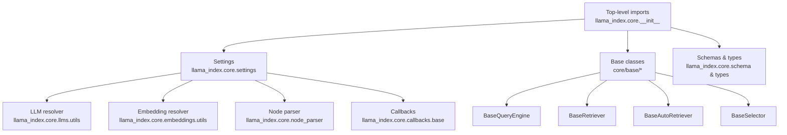
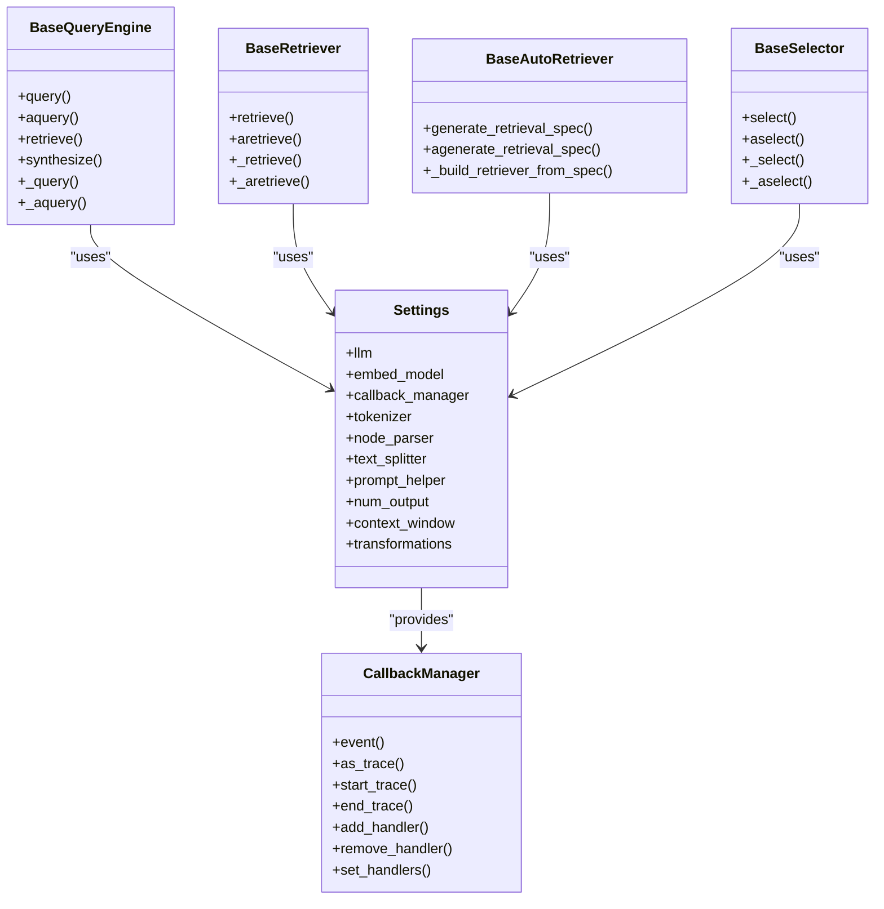
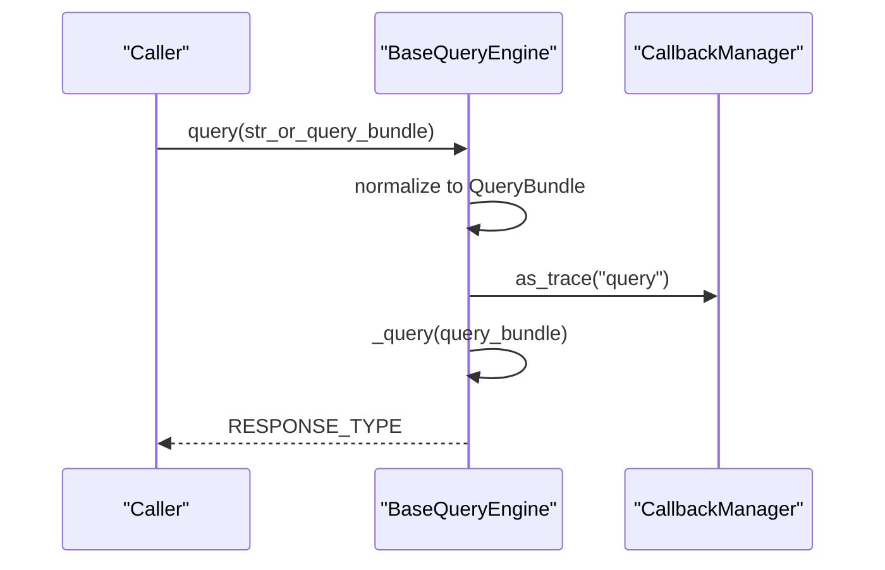
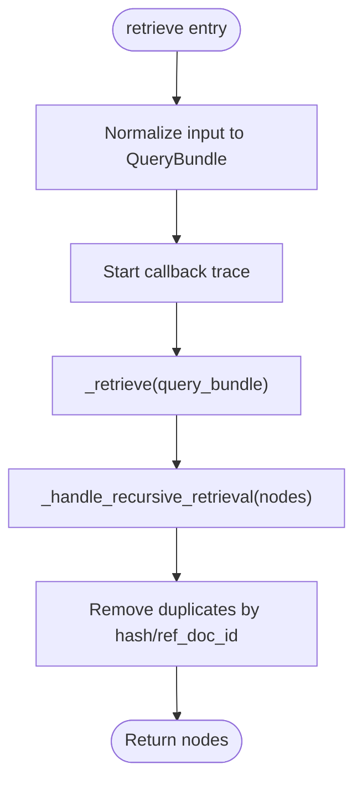
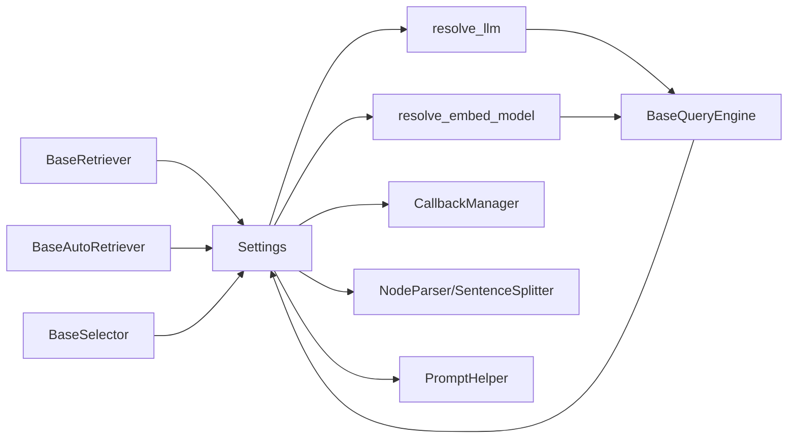

# API Reference

<cite>
**Referenced Files in This Document**
- [llama_index\core\__init__.py](file://llama-index-core/llama_index/core/__init__.py)
- [llama_index\core\settings.py](file://llama-index-core/llama_index/core/settings.py)
- [llama_index\core\service_context.py](file://llama-index-core/llama_index/core/service_context.py)
- [llama_index\core\base\base_query_engine.py](file://llama-index-core/llama_index/core/base/base_query_engine.py)
- [llama_index\core\base\base_retriever.py](file://llama-index-core/llama_index/core/base/base_retriever.py)
- [llama_index\core\base\base_auto_retriever.py](file://llama-index-core/llama_index/core/base/base_auto_retriever.py)
- [llama_index\core\base\base_selector.py](file://llama-index-core/llama_index/core/base/base_selector.py)
- [llama_index\core\types.py](file://llama-index-core/llama_index/core/types.py)
- [llama_index\core\callbacks\base.py](file://llama-index-core/llama_index/core/callbacks/base.py)
- [llama_index\core\embeddings\utils.py](file://llama-index-core/llama_index/core/embeddings/utils.py)
- [llama_index\core\llms\utils.py](file://llama-index-core/llama_index/core/llms/utils.py)
- [llama_index\core\node_parser\__init__.py](file://llama-index-core/llama_index/core/node_parser/__init__.py)
- [llama_index\core\schema.py](file://llama-index-core/llama_index/core/schema.py)
</cite>

## Table of Contents
1. [Introduction](#introduction)
2. [Project Structure](#project-structure)
3. [Core Components](#core-components)
4. [Architecture Overview](#architecture-overview)
5. [Detailed Component Analysis](#detailed-component-analysis)
6. [Dependency Analysis](#dependency-analysis)
7. [Performance Considerations](#performance-considerations)
8. [Troubleshooting Guide](#troubleshooting-guide)
9. [Conclusion](#conclusion)
10. [Appendices](#appendices)

## Introduction
This API reference documents the public interfaces, classes, and methods of LlamaIndex core focused on:
- Settings API and configuration
- Base classes for query engines, retrievers, selectors, and transforms
- Extension points and integration utilities
- Provider resolution helpers for LLMs and embeddings
- Callback and instrumentation integration
- Data schemas and node abstractions

It organizes content by functional areas, provides method-level guidance, and includes cross-references and dependency relationships. Usage examples are provided as code snippet paths to real implementations in the repository.

## Project Structure
The core API surface is primarily exposed via top-level imports and the Settings singleton, with base classes under core/base and configuration utilities under core/settings. Integration points include LLM and embedding resolvers, node parsing utilities, and callback instrumentation.

```mermaid
graph TB
A["Top-level imports<br/>llama_index.core.__init__"] --> B["Settings<br/>llama_index.core.settings"]
B --> C["LLM resolver<br/>llama_index.core.llms.utils"]
B --> D["Embedding resolver<br/>llama_index.core.embeddings.utils"]
B --> E["Node parser<br/>llama_index.core.node_parser"]
B --> F["Callbacks<br/>llama_index.core.callbacks.base"]
A --> G["Base classes<br/>core/base/*"]
G --> G1["BaseQueryEngine"]
G --> G2["BaseRetriever"]
G --> G3["BaseAutoRetriever"]
G --> G4["BaseSelector"]
A --> H["Schemas & types<br/>llama_index.core.schema & types"]
```

**Diagram sources**
- [llama_index\core\__init__.py](file://llama-index-core/llama_index/core/__init__.py#L1-L162)
- [llama_index\core\settings.py](file://llama-index-core/llama_index/core/settings.py#L1-L249)
- [llama_index\core\llms\utils.py](file://llama-index-core/llama_index/core/llms/utils.py#L1-L185)
- [llama_index\core\embeddings\utils.py](file://llama-index-core/llama_index/core/embeddings/utils.py#L1-L141)
- [llama_index\core\node_parser\__init__.py](file://llama-index-core/llama_index/core/node_parser/__init__.py#L1-L73)
- [llama_index\core\callbacks\base.py](file://llama-index-core/llama_index/core/callbacks/base.py#L1-L303)
- [llama_index\core\base\base_query_engine.py](file://llama-index-core/llama_index/core/base/base_query_engine.py#L1-L94)
- [llama_index\core\base\base_retriever.py](file://llama-index-core/llama_index/core/base/base_retriever.py#L1-L275)
- [llama_index\core\base\base_auto_retriever.py](file://llama-index-core/llama_index/core/base/base_auto_retriever.py#L1-L44)
- [llama_index\core\base\base_selector.py](file://llama-index-core/llama_index/core/base/base_selector.py#L1-L104)
- [llama_index\core\schema.py](file://llama-index-core/llama_index/core/schema.py#L1-L800)

**Section sources**
- [llama_index\core\__init__.py](file://llama-index-core/llama_index/core/__init__.py#L1-L162)

## Core Components
This section covers the primary configuration and extension APIs.

- Settings API
  - Purpose: Centralized configuration for LLM, embeddings, callback manager, tokenizer, node parser, prompt helper, and transformations.
  - Key members:
    - Properties: llm, embed_model, callback_manager, tokenizer, node_parser, text_splitter, prompt_helper, num_output, context_window, transformations
    - Aliases: text_splitter -> node_parser
    - Mutators: setters for llm, embed_model, callback_manager, tokenizer, node_parser, prompt_helper, transformations
    - Behavior: Lazy initialization; integrates callback_manager into LLM and embeddings; validates chunk_size/chunk_overlap via node_parser properties.
  - Example snippet paths:
    - [Settings usage](file://llama-index-core/llama_index/core/settings.py#L17-L249)
    - [Top-level import exposing Settings](file://llama-index-core/llama_index/core/__init__.py#L78-L79)

- Deprecated ServiceContext
  - Purpose: Legacy container; superseded by Settings.
  - Guidance: Use Settings instead; raises ValueError on instantiation or from_defaults.
  - Example snippet paths:
    - [Deprecation notice and error](file://llama-index-core/llama_index/core/service_context.py#L1-L49)

- LLM Resolution
  - Purpose: Resolve LLM from string, LLM instance, or LangChain wrapper.
  - Behavior: Supports "default", "local:model_path", and LangChain wrappers; sets callback_manager.
  - Example snippet paths:
    - [resolve_llm](file://llama-index-core/llama_index/core/llms/utils.py#L15-L110)

- Embedding Resolution
  - Purpose: Resolve embedding model from string, LangChain wrapper, or defaults.
  - Behavior: Supports "default", "clip:model_name", "local:model_name", and LangChain wrappers; sets callback_manager.
  - Example snippet paths:
    - [resolve_embed_model](file://llama-index-core/llama_index/core/embeddings/utils.py#L31-L140)

- Callback Manager
  - Purpose: Event-driven tracing and handler orchestration.
  - Key members: event(), as_trace(), start_trace(), end_trace(), add_handler(), remove_handler(), set_handlers().
  - Example snippet paths:
    - [CallbackManager](file://llama-index-core/llama_index/core/callbacks/base.py#L28-L303)

- Node Parser Utilities
  - Purpose: Public exports for node parsing utilities and deprecations.
  - Example snippet paths:
    - [Node parser exports](file://llama-index-core/llama_index/core/node_parser/__init__.py#L1-L73)

- Types and Program Modes
  - Purpose: Shared types for output parsing, pydantic programs, and thread wrappers.
  - Example snippet paths:
    - [Types](file://llama-index-core/llama_index/core/types.py#L1-L177)

**Section sources**
- [llama_index\core\settings.py](file://llama-index-core/llama_index/core/settings.py#L17-L249)
- [llama_index\core\service_context.py](file://llama-index-core/llama_index/core/service_context.py#L1-L49)
- [llama_index\core\llms\utils.py](file://llama-index-core/llama_index/core/llms/utils.py#L15-L110)
- [llama_index\core\embeddings\utils.py](file://llama-index-core/llama_index/core/embeddings/utils.py#L31-L140)
- [llama_index\core\callbacks\base.py](file://llama-index-core/llama_index/core/callbacks/base.py#L28-L303)
- [llama_index\core\node_parser\__init__.py](file://llama-index-core/llama_index/core/node_parser/__init__.py#L1-L73)
- [llama_index\core\types.py](file://llama-index-core/llama_index/core/types.py#L1-L177)

## Architecture Overview
The Settings singleton acts as the central configuration hub. It lazily resolves LLMs and embeddings, injects callback managers, and exposes convenience properties for prompt helper and transformations. Base classes (query engines, retrievers, selectors) integrate with Settings and CallbackManager to provide standardized extension points.

```mermaid
classDiagram
class Settings {
+llm
+embed_model
+callback_manager
+tokenizer
+node_parser
+text_splitter
+prompt_helper
+num_output
+context_window
+transformations
}
class CallbackManager {
+event()
+as_trace()
+start_trace()
+end_trace()
+add_handler()
+remove_handler()
+set_handlers()
}
class BaseQueryEngine {
+query()
+aquery()
+retrieve()
+synthesize()
+_query()
+_aquery()
}
class BaseRetriever {
+retrieve()
+aretrieve()
+_retrieve()
+_aretrieve()
}
class BaseAutoRetriever {
+generate_retrieval_spec()
+agenerate_retrieval_spec()
+_build_retriever_from_spec()
}
class BaseSelector {
+select()
+aselect()
+_select()
+_aselect()
}
Settings --> CallbackManager : "provides"
BaseQueryEngine --> Settings : "uses"
BaseRetriever --> Settings : "uses"
BaseAutoRetriever --> Settings : "uses"
BaseSelector --> Settings : "uses"
```

**Diagram sources**
- [llama_index\core\settings.py](file://llama-index-core/llama_index/core/settings.py#L17-L249)
- [llama_index\core\callbacks\base.py](file://llama-index-core/llama_index/core/callbacks/base.py#L28-L303)
- [llama_index\core\base\base_query_engine.py](file://llama-index-core/llama_index/core/base/base_query_engine.py#L22-L94)
- [llama_index\core\base\base_retriever.py](file://llama-index-core/llama_index/core/base/base_retriever.py#L34-L275)
- [llama_index\core\base\base_auto_retriever.py](file://llama-index-core/llama_index/core/base/base_auto_retriever.py#L9-L44)
- [llama_index\core\base\base_selector.py](file://llama-index-core/llama_index/core/base/base_selector.py#L72-L104)

## Detailed Component Analysis

### Settings API
- Purpose: Global configuration for LLM, embeddings, tokenizer, node parser, prompt helper, and transformations.
- Key behaviors:
  - Lazy initialization of LLM and embeddings; resolves via resolvers when set to "default".
  - Injects callback_manager into LLM and embeddings.
  - Exposes chunk_size and chunk_overlap via node_parser properties with validation.
  - text_splitter is an alias to node_parser.
- Example snippet paths:
  - [Settings class and properties](file://llama-index-core/llama_index/core/settings.py#L17-L249)
  - [Top-level import of Settings](file://llama-index-core/llama_index/core/__init__.py#L78-L79)

**Section sources**
- [llama_index\core\settings.py](file://llama-index-core/llama_index/core/settings.py#L17-L249)
- [llama_index\core\__init__.py](file://llama-index-core/llama_index/core/__init__.py#L78-L79)

### BaseQueryEngine
- Purpose: Abstract interface for query engines with synchronous and asynchronous query methods.
- Key methods:
  - query(str_or_query_bundle) -> RESPONSE_TYPE
  - aquery(str_or_query_bundle) -> RESPONSE_TYPE
  - retrieve(query_bundle) -> List[NodeWithScore] (not implemented by default)
  - synthesize(...) and asynthesize(...) (not implemented by default)
  - _query and _aquery (abstract)
- Instrumentation: Uses dispatcher spans and callback manager tracing.
- Example snippet paths:
  - [BaseQueryEngine](file://llama-index-core/llama_index/core/base/base_query_engine.py#L22-L94)

```mermaid
sequenceDiagram
participant Client as "Caller"
participant Engine as "BaseQueryEngine"
participant CB as "CallbackManager"
Client->>Engine : query(str_or_query_bundle)
Engine->>Engine : normalize to QueryBundle
Engine->>CB : as_trace("query")
Engine->>Engine : _query(query_bundle)
Engine-->>Client : RESPONSE_TYPE
```

**Diagram sources**
- [llama_index\core\base\base_query_engine.py](file://llama-index-core/llama_index/core/base/base_query_engine.py#L38-L48)

**Section sources**
- [llama_index\core\base\base_query_engine.py](file://llama-index-core/llama_index/core/base/base_query_engine.py#L22-L94)

### BaseRetriever
- Purpose: Abstract interface for retrieving nodes with recursive traversal and deduplication.
- Key methods:
  - retrieve(str_or_query_bundle) -> List[NodeWithScore]
  - aretrieve(str_or_query_bundle) -> List[NodeWithScore]
  - _retrieve and _aretrieve (abstract)
  - Internal helpers: _retrieve_from_object, _aretrieve_from_object, _handle_recursive_retrieval, _ahandle_recursive_retrieval
- Instrumentation: Uses dispatcher spans and callback manager tracing.
- Example snippet paths:
  - [BaseRetriever](file://llama-index-core/llama_index/core/base/base_retriever.py#L34-L275)

```mermaid
flowchart TD
Start(["retrieve entry"]) --> Normalize["Normalize input to QueryBundle"]
Normalize --> Trace["Start callback trace"]
Trace --> Call["_retrieve(query_bundle)"]
Call --> Recurse["_handle_recursive_retrieval(nodes)"]
Recurse --> Dedup["Remove duplicates by hash/ref_doc_id"]
Dedup --> End(["Return nodes"])
```

**Diagram sources**
- [llama_index\core\base\base_retriever.py](file://llama-index-core/llama_index/core/base/base_retriever.py#L185-L221)

**Section sources**
- [llama_index\core\base\base_retriever.py](file://llama-index-core/llama_index/core/base/base_retriever.py#L34-L275)

### BaseAutoRetriever
- Purpose: Auto-generated retrieval spec pattern; generates retriever dynamically per query.
- Key methods:
  - generate_retrieval_spec(query_bundle) -> BaseModel
  - agenerate_retrieval_spec(query_bundle) -> BaseModel
  - _build_retriever_from_spec(retrieval_spec) -> Tuple[BaseRetriever, QueryBundle]
  - Overrides _retrieve and _aretrieve to delegate to generated retriever.
- Example snippet paths:
  - [BaseAutoRetriever](file://llama-index-core/llama_index/core/base/base_auto_retriever.py#L9-L44)

**Section sources**
- [llama_index\core\base\base_auto_retriever.py](file://llama-index-core/llama_index/core/base/base_auto_retriever.py#L9-L44)

### BaseSelector
- Purpose: Select among choices (tools, agents) given a query.
- Key methods:
  - select(choices, query) -> SelectorResult (MultiSelection)
  - aselect(choices, query) -> SelectorResult (async)
  - _select and _aselect (abstract)
- Data models:
  - SingleSelection: index, reason
  - MultiSelection: selections List[SingleSelection]; convenience properties inds, reasons
- Example snippet paths:
  - [BaseSelector](file://llama-index-core/llama_index/core/base/base_selector.py#L72-L104)

**Section sources**
- [llama_index\core\base\base_selector.py](file://llama-index-core/llama_index/core/base/base_selector.py#L72-L104)

### Types and Program Modes
- BaseOutputParser: Abstract output parser with parse() and optional format()/format_messages().
- BasePydanticProgram: Abstract LLM-powered function returning a pydantic model; supports sync and async call, streaming stubs.
- PydanticProgramMode: Enum of program modes (default, openai, llm, function, guidance, lm-format-enforcer).
- Thread: Context-aware thread wrapper copying context to target.
- Example snippet paths:
  - [Types](file://llama-index-core/llama_index/core/types.py#L43-L177)

**Section sources**
- [llama_index\core\types.py](file://llama-index-core/llama_index/core/types.py#L43-L177)

### Callback Manager
- Purpose: Event-driven tracing and handler orchestration across LlamaIndex components.
- Key capabilities:
  - Event lifecycle: on_event_start(), on_event_end()
  - Trace lifecycle: start_trace(), end_trace()
  - Context managers: event(), as_trace()
  - Handler management: add_handler(), remove_handler(), set_handlers()
- Example snippet paths:
  - [CallbackManager](file://llama-index-core/llama_index/core/callbacks/base.py#L28-L303)

**Section sources**
- [llama_index\core\callbacks\base.py](file://llama-index-core/llama_index/core/callbacks/base.py#L28-L303)

### LLM and Embedding Resolvers
- LLM Resolution:
  - resolve_llm(llm: Optional[LLMType], callback_manager: Optional[CallbackManager]) -> LLM
  - Supports "default", "local:model_path", and LangChain wrappers; sets callback_manager.
  - Example snippet paths:
    - [resolve_llm](file://llama-index-core/llama_index/core/llms/utils.py#L15-L110)
- Embedding Resolution:
  - resolve_embed_model(embed_model: Optional[EmbedType], callback_manager: Optional[CallbackManager]) -> BaseEmbedding
  - Supports "default", "clip:model_name", "local:model_name", and LangChain wrappers; sets callback_manager.
  - Example snippet paths:
    - [resolve_embed_model](file://llama-index-core/llama_index/core/embeddings/utils.py#L31-L140)

**Section sources**
- [llama_index\core\llms\utils.py](file://llama-index-core/llama_index/core/llms/utils.py#L15-L110)
- [llama_index\core\embeddings\utils.py](file://llama-index-core/llama_index/core/embeddings/utils.py#L31-L140)

### Node Parser Utilities
- Purpose: Public exports for node parsing utilities and deprecations.
- Example snippet paths:
  - [Node parser exports](file://llama-index-core/llama_index/core/node_parser/__init__.py#L1-L73)

**Section sources**
- [llama_index\core\node_parser\__init__.py](file://llama-index-core/llama_index/core/node_parser/__init__.py#L1-L73)

### Schemas and Data Models
- BaseComponent and TransformComponent: Base classes for serializable components and transform pipeline steps.
- Node relationships, object types, metadata modes, and modality enums.
- BaseNode, TextNode, Node, MediaResource: Core node abstractions with hashing and metadata handling.
- QueryBundle and related types: Unified query representation across components.
- Example snippet paths:
  - [Schemas](file://llama-index-core/llama_index/core/schema.py#L80-L800)

**Section sources**
- [llama_index\core\schema.py](file://llama-index-core/llama_index/core/schema.py#L80-L800)

## Dependency Analysis
- Settings depends on:
  - LLM and embedding resolvers
  - CallbackManager
  - NodeParser and SentenceSplitter
  - PromptHelper
  - Tokenizer utilities
- Base classes depend on Settings for defaults and on CallbackManager for instrumentation.
- LLM and embedding resolvers depend on Settings for callback_manager injection.

```mermaid
graph LR
Settings["Settings"] --> LLMRes["resolve_llm"]
Settings --> EmbRes["resolve_embed_model"]
Settings --> CBMgr["CallbackManager"]
Settings --> NP["NodeParser/SentenceSplitter"]
Settings --> PH["PromptHelper"]
QEng["BaseQueryEngine"] --> Settings
Ret["BaseRetriever"] --> Settings
AutoRet["BaseAutoRetriever"] --> Settings
Sel["BaseSelector"] --> Settings
LLMRes --> QEng
EmbRes --> QEng
```

**Diagram sources**
- [llama_index\core\settings.py](file://llama-index-core/llama_index/core/settings.py#L17-L249)
- [llama_index\core\llms\utils.py](file://llama-index-core/llama_index/core/llms/utils.py#L15-L110)
- [llama_index\core\embeddings\utils.py](file://llama-index-core/llama_index/core/embeddings/utils.py#L31-L140)
- [llama_index\core\callbacks\base.py](file://llama-index-core/llama_index/core/callbacks/base.py#L28-L303)
- [llama_index\core\base\base_query_engine.py](file://llama-index-core/llama_index/core/base/base_query_engine.py#L22-L94)
- [llama_index\core\base\base_retriever.py](file://llama-index-core/llama_index/core/base/base_retriever.py#L34-L275)
- [llama_index\core\base\base_auto_retriever.py](file://llama-index-core/llama_index/core/base/base_auto_retriever.py#L9-L44)
- [llama_index\core\base\base_selector.py](file://llama-index-core/llama_index/core/base/base_selector.py#L72-L104)

**Section sources**
- [llama_index\core\settings.py](file://llama-index-core/llama_index/core/settings.py#L17-L249)
- [llama_index\core\callbacks\base.py](file://llama-index-core/llama_index/core/callbacks/base.py#L28-L303)
- [llama_index\core\base\base_query_engine.py](file://llama-index-core/llama_index/core/base/base_query_engine.py#L22-L94)
- [llama_index\core\base\base_retriever.py](file://llama-index-core/llama_index/core/base/base_retriever.py#L34-L275)
- [llama_index\core\base\base_auto_retriever.py](file://llama-index-core/llama_index/core/base/base_auto_retriever.py#L9-L44)
- [llama_index\core\base\base_selector.py](file://llama-index-core/llama_index/core/base/base_selector.py#L72-L104)

## Performance Considerations
- Settings lazy initialization avoids upfront cost; resolvers only instantiate providers when requested.
- CallbackManager traces minimize overhead by deferring handler execution until registered.
- BaseRetriever deduplicates nodes by hash and ref_doc_id to reduce redundant processing.
- Node parsing via SentenceSplitter and other splitters impacts downstream embedding and indexing costs; tune chunk_size and chunk_overlap via Settings.node_parser properties.
- Threading: Use the provided Thread wrapper to preserve context in multi-threaded environments.

[No sources needed since this section provides general guidance]

## Troubleshooting Guide
- ServiceContext is deprecated
  - Symptom: Instantiation or from_defaults raises ValueError.
  - Action: Switch to Settings; see migration link in error message.
  - Example snippet paths:
    - [Deprecation error](file://llama-index-core/llama_index/core/service_context.py#L13-L38)

- LLM resolution failures
  - Symptom: ImportError or ValueError when resolving "default" or "local:*".
  - Action: Install required packages (e.g., llama-index-llms-openai, llama-index-llms-llama-cpp) or specify a valid local path.
  - Example snippet paths:
    - [resolve_llm](file://llama-index-core/llama_index/core/llms/utils.py#L35-L57)

- Embedding resolution failures
  - Symptom: ImportError or ValueError when resolving "default", "clip:*", or "local:*".
  - Action: Install required packages (e.g., llama-index-embeddings-openai, llama-index-embeddings-clip, llama-index-embeddings-huggingface) or use embed_model=None for MockEmbedding.
  - Example snippet paths:
    - [resolve_embed_model](file://llama-index-core/llama_index/core/embeddings/utils.py#L43-L91)

- Callback handler conflicts
  - Symptom: Adding multiple handlers of the same type raises ValueError.
  - Action: Ensure unique handler types or manage via set_handlers().
  - Example snippet paths:
    - [CallbackManager conflict handling](file://llama-index-core/llama_index/core/callbacks/base.py#L64-L74)

- Node parser properties
  - Symptom: Accessing chunk_size or chunk_overlap raises ValueError if node_parser lacks these attributes.
  - Action: Ensure node_parser supports these properties or set a compatible parser (e.g., SentenceSplitter).
  - Example snippet paths:
    - [Chunk size/overlap validation](file://llama-index-core/llama_index/core/settings.py#L154-L183)

**Section sources**
- [llama_index\core\service_context.py](file://llama-index-core/llama_index/core/service_context.py#L13-L38)
- [llama_index\core\llms\utils.py](file://llama-index-core/llama_index/core/llms/utils.py#L35-L57)
- [llama_index\core\embeddings\utils.py](file://llama-index-core/llama_index/core/embeddings/utils.py#L43-L91)
- [llama_index\core\callbacks\base.py](file://llama-index-core/llama_index/core/callbacks/base.py#L64-L74)
- [llama_index\core\settings.py](file://llama-index-core/llama_index/core/settings.py#L154-L183)

## Conclusion
LlamaIndex’s core API centers around a flexible Settings singleton and a set of base classes that standardize extension points for querying, retrieval, selection, and transformations. Integration with LLMs and embeddings is handled via resolvers that support multiple providers and environments. Callback instrumentation enables observability and extensibility. For robust deployments, prefer Settings over the deprecated ServiceContext, configure node parsing appropriately, and leverage the provided resolvers and base classes to build custom integrations.

[No sources needed since this section summarizes without analyzing specific files]

## Appendices
- Migration from ServiceContext to Settings
  - Replace ServiceContext usage with Settings and pass modules directly to local functions or set global defaults via Settings properties.
  - Example snippet paths:
    - [Migration note](file://llama-index-core/llama_index/core/service_context.py#L8-L19)

- Provider resolution quick reference
  - LLM: "default" (OpenAI if available), "local:model_path", LangChain wrapper.
  - Embeddings: "default" (OpenAI if available), "clip:model_name", "local:model_name", LangChain wrapper.
  - Example snippet paths:
    - [LLM resolver](file://llama-index-core/llama_index/core/llms/utils.py#L26-L57)
    - [Embedding resolver](file://llama-index-core/llama_index/core/embeddings/utils.py#L43-L91)

**Section sources**
- [llama_index\core\service_context.py](file://llama-index-core/llama_index/core/service_context.py#L8-L19)
- [llama_index\core\llms\utils.py](file://llama-index-core/llama_index/core/llms/utils.py#L26-L57)
- [llama_index\core\embeddings\utils.py](file://llama-index-core/llama_index/core/embeddings/utils.py#L43-L91)