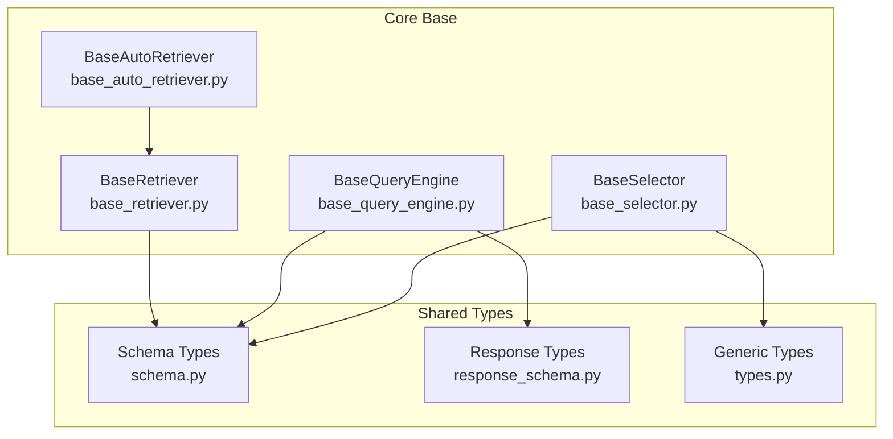
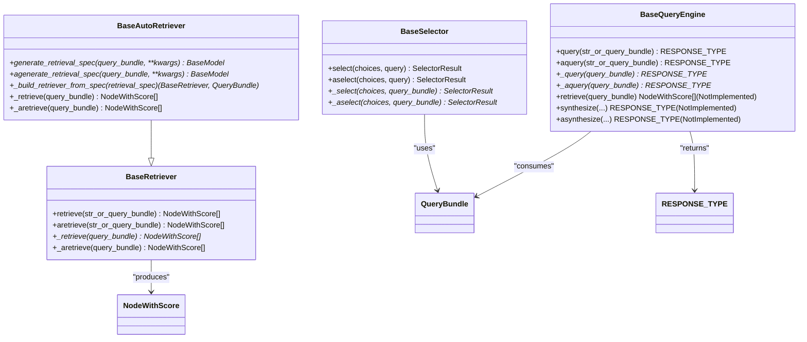
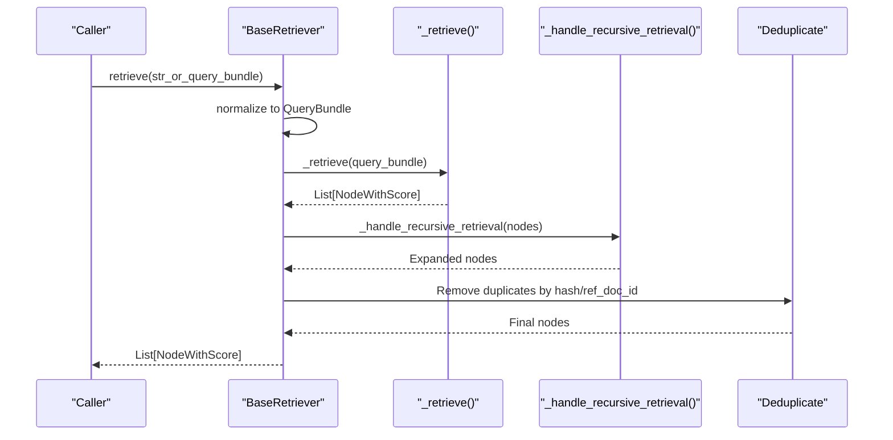
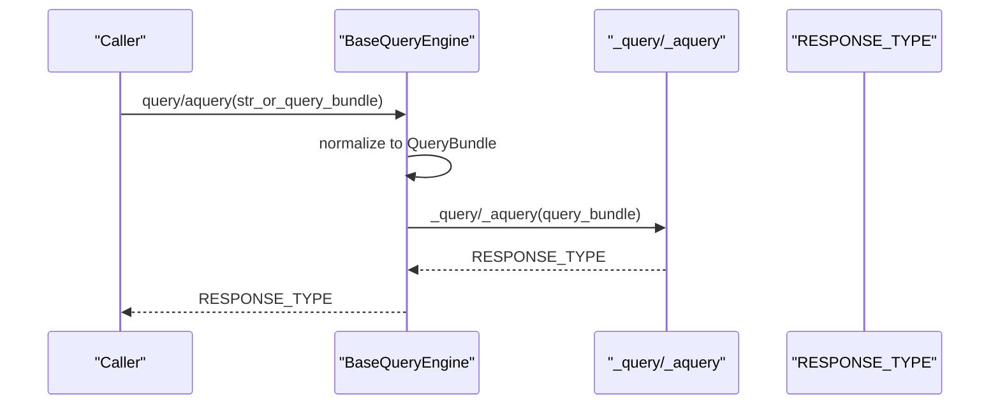
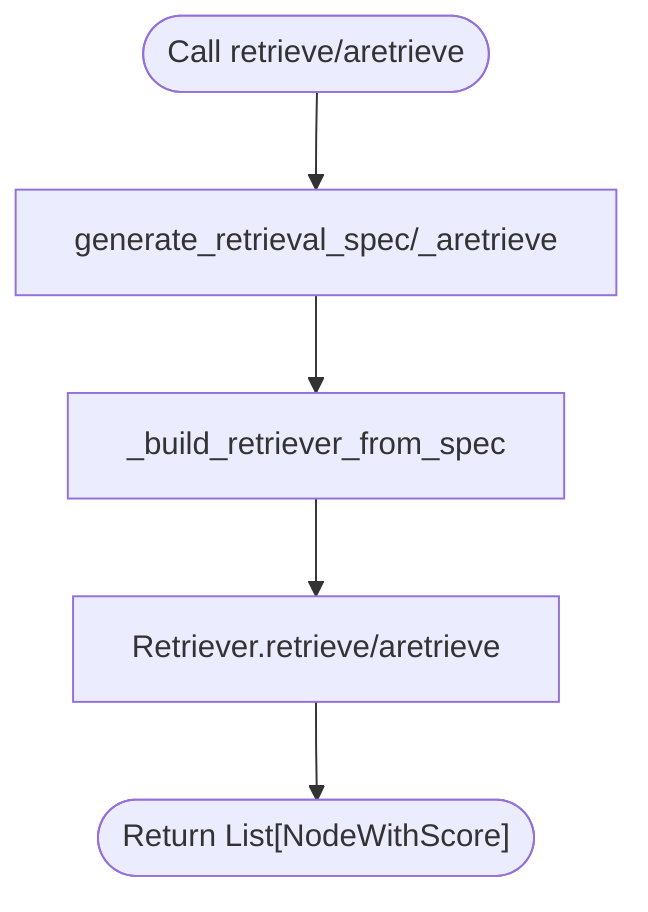
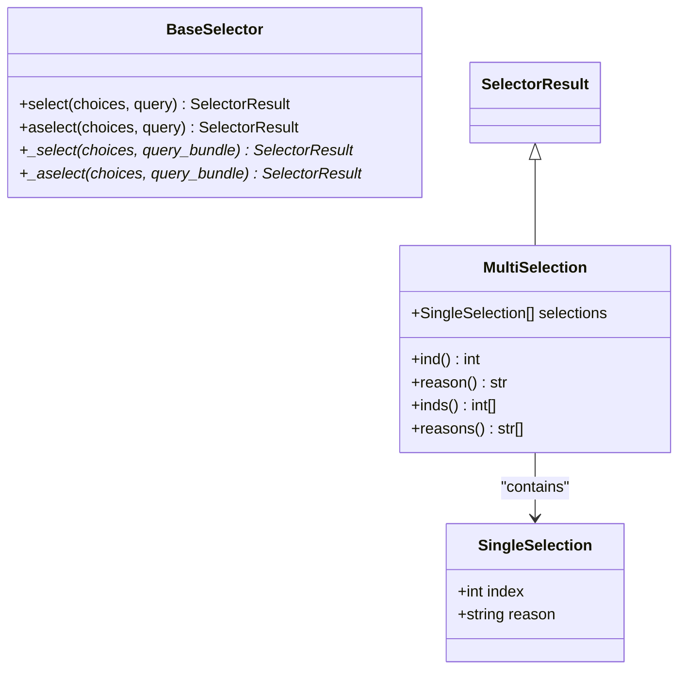
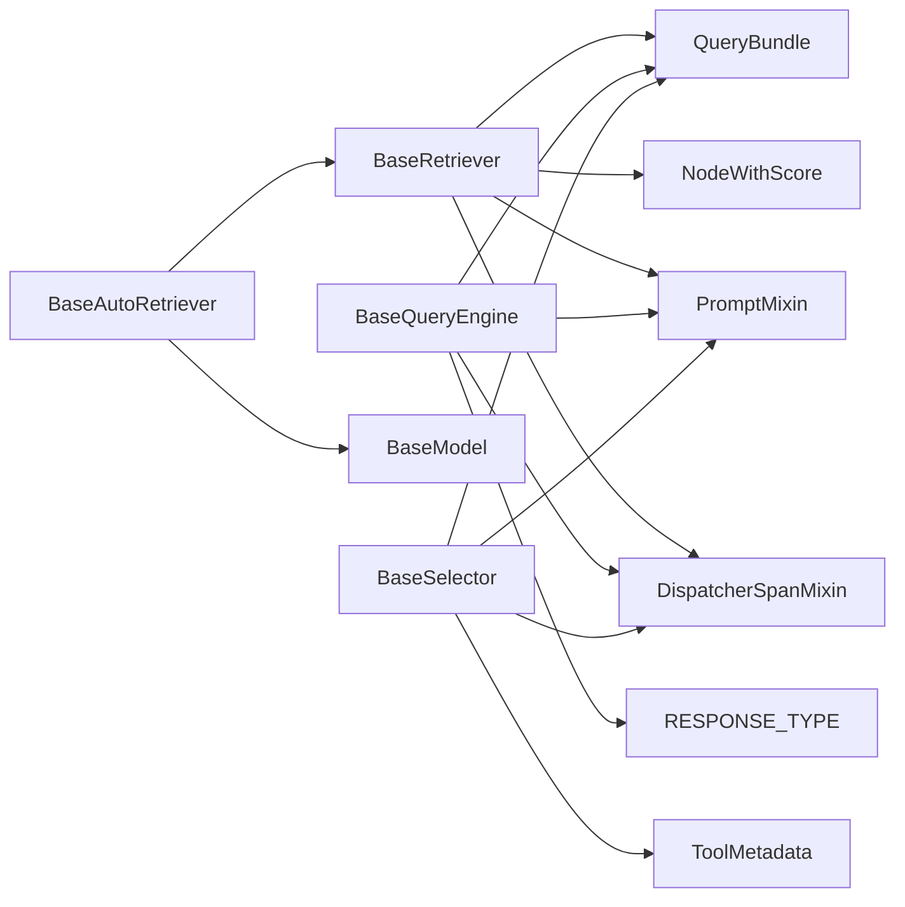

# Base Classes and Interfaces

<cite>
**Referenced Files in This Document**
- [base_retriever.py](file://llama-index-core/llama_index/core/base/base_retriever.py)
- [base_query_engine.py](file://llama-index-core/llama_index/core/base/base_query_engine.py)
- [base_auto_retriever.py](file://llama-index-core/llama_index/core/base/base_auto_retriever.py)
- [base_selector.py](file://llama-index-core/llama_index/core/base/base_selector.py)
- [schema.py](file://llama-index-core/llama_index/core/schema.py)
- [response_schema.py](file://llama-index-core/llama_index/core/base/response/schema.py)
- [types.py](file://llama-index-core/llama_index/core/types.py)
</cite>

## Table of Contents
1. [Introduction](#introduction)
2. [Project Structure](#project-structure)
3. [Core Components](#core-components)
4. [Architecture Overview](#architecture-overview)
5. [Detailed Component Analysis](#detailed-component-analysis)
6. [Dependency Analysis](#dependency-analysis)
7. [Performance Considerations](#performance-considerations)
8. [Troubleshooting Guide](#troubleshooting-guide)
9. [Conclusion](#conclusion)

## Introduction
This document provides comprehensive API documentation for the foundational base classes and interfaces in LlamaIndex core that underpin retrieval, querying, and selection capabilities. It focuses on:
- BaseRetriever: the abstraction for retrieving relevant nodes for a given query
- BaseQueryEngine: the abstraction for answering queries and synthesizing responses
- BaseAutoRetriever: an extension of BaseRetriever that dynamically generates retrieval specifications
- BaseSelector: the abstraction for selecting among choices (tools, agents, or strategies) based on a query

The guide details interface contracts, method signatures, abstract method requirements, inheritance hierarchies, polymorphic behavior, extension patterns, type hints, parameter validation, return value specifications, and practical guidance for building custom components.

## Project Structure
The base classes and related types live under the core base module and schema definitions. The following diagram shows how the primary base classes relate to shared schema and response types.

**Diagram sources**
- [base_retriever.py](file://llama-index-core/llama_index/core/base/base_retriever.py#L34-L275)
- [base_query_engine.py](file://llama-index-core/llama_index/core/base/base_query_engine.py#L22-L94)
- [base_auto_retriever.py](file://llama-index-core/llama_index/core/base/base_auto_retriever.py#L9-L44)
- [base_selector.py](file://llama-index-core/llama_index/core/base/base_selector.py#L72-L104)
- [schema.py](file://llama-index-core/llama_index/core/schema.py#L1-L200)
- [response_schema.py](file://llama-index-core/llama_index/core/base/response/schema.py#L14-L242)
- [types.py](file://llama-index-core/llama_index/core/types.py#L33-L35)

**Section sources**
- [base_retriever.py](file://llama-index-core/llama_index/core/base/base_retriever.py#L1-L275)
- [base_query_engine.py](file://llama-index-core/llama_index/core/base/base_query_engine.py#L1-L94)
- [base_auto_retriever.py](file://llama-index-core/llama_index/core/base/base_auto_retriever.py#L1-L44)
- [base_selector.py](file://llama-index-core/llama_index/core/base/base_selector.py#L1-L104)
- [schema.py](file://llama-index-core/llama_index/core/schema.py#L1-L200)
- [response_schema.py](file://llama-index-core/llama_index/core/base/response/schema.py#L1-L242)
- [types.py](file://llama-index-core/llama_index/core/types.py#L1-L177)

## Core Components
This section documents the four core base abstractions and their roles in the framework.

- BaseRetriever
  - Purpose: Retrieve relevant nodes for a given query string or structured QueryBundle. Supports synchronous and asynchronous retrieval, recursive traversal across nested objects, and instrumentation.
  - Key methods:
    - retrieve(str_or_query_bundle): List[NodeWithScore]
    - aretrieve(str_or_query_bundle): List[NodeWithScore]
    - _retrieve(query_bundle): List[NodeWithScore] (abstract)
    - _aretrieve(query_bundle): List[NodeWithScore] (abstract, defaults to sync)
  - Notable behaviors:
    - Handles recursive retrieval across IndexNode objects via object_map
    - Deduplicates results by node hash and ref_doc_id
    - Emits instrumentation events and integrates with CallbackManager

- BaseQueryEngine
  - Purpose: Answer queries and optionally synthesize responses from retrieved nodes. Provides synchronous and asynchronous query interfaces.
  - Key methods:
    - query(str_or_query_bundle): RESPONSE_TYPE
    - aquery(str_or_query_bundle): RESPONSE_TYPE
    - _query(query_bundle): RESPONSE_TYPE (abstract)
    - _aquery(query_bundle): RESPONSE_TYPE (abstract)
    - retrieve(query_bundle): raises NotImplementedError by default
    - synthesize(...) and asynthesize(...): raise NotImplementedError by default
  - Response types: Union of Response, StreamingResponse, AsyncStreamingResponse, PydanticResponse

- BaseAutoRetriever
  - Purpose: Dynamically generate a retrieval specification per query and build a retriever from it.
  - Key methods:
    - generate_retrieval_spec(query_bundle, **kwargs): BaseModel (abstract)
    - agenerate_retrieval_spec(query_bundle, **kwargs): BaseModel (abstract)
    - _build_retriever_from_spec(retrieval_spec): Tuple[BaseRetriever, QueryBundle] (abstract)
    - _retrieve(query_bundle): List[NodeWithScore] (implemented; delegates to generated retriever)
    - _aretrieve(query_bundle): List[NodeWithScore] (implemented; delegates to generated retriever)

- BaseSelector
  - Purpose: Select among a sequence of choices (strings or ToolMetadata) given a query, returning single or multi-selection results.
  - Key methods:
    - select(choices, query): SelectorResult (MultiSelection)
    - aselect(choices, query): SelectorResult (MultiSelection)
    - _select(choices, query_bundle): SelectorResult (abstract)
    - _aselect(choices, query_bundle): SelectorResult (abstract)
  - Supporting types:
    - SingleSelection: index, reason
    - MultiSelection: selections with convenience properties ind, reason, inds, reasons
    - SelectorResult alias to MultiSelection

**Section sources**
- [base_retriever.py](file://llama-index-core/llama_index/core/base/base_retriever.py#L34-L275)
- [base_query_engine.py](file://llama-index-core/llama_index/core/base/base_query_engine.py#L22-L94)
- [base_auto_retriever.py](file://llama-index-core/llama_index/core/base/base_auto_retriever.py#L9-L44)
- [base_selector.py](file://llama-index-core/llama_index/core/base/base_selector.py#L72-L104)

## Architecture Overview
The base classes integrate with shared schema and response types to form a cohesive retrieval and querying pipeline. The diagram below illustrates the relationships and polymorphic usage.

**Diagram sources**
- [base_retriever.py](file://llama-index-core/llama_index/core/base/base_retriever.py#L34-L275)
- [base_auto_retriever.py](file://llama-index-core/llama_index/core/base/base_auto_retriever.py#L9-L44)
- [base_query_engine.py](file://llama-index-core/llama_index/core/base/base_query_engine.py#L22-L94)
- [base_selector.py](file://llama-index-core/llama_index/core/base/base_selector.py#L72-L104)
- [schema.py](file://llama-index-core/llama_index/core/schema.py#L1-L200)
- [response_schema.py](file://llama-index-core/llama_index/core/base/response/schema.py#L239-L242)

## Detailed Component Analysis

### BaseRetriever
- Role and contract
  - Provides a unified interface to retrieve nodes for a query.
  - Enforces a separation between public API (handling strings and QueryBundle) and internal abstract method (_retrieve).
  - Supports asynchronous retrieval via _aretrieve with a default fallback to synchronous implementation.
- Method signatures and behavior
  - retrieve(str_or_query_bundle): Converts string to QueryBundle and delegates to _retrieve, then applies recursive retrieval and deduplication.
  - aretrieve(str_or_query_bundle): Same pattern for async.
  - _retrieve(query_bundle): Abstract; subclasses implement the actual retrieval logic.
  - _aretrieve(query_bundle): Abstract; defaults to synchronous implementation if not overridden.
- Polymorphic behavior
  - Recursively traverses IndexNode objects using object_map and supports heterogeneous objects (BaseNode, NodeWithScore, BaseRetriever, BaseQueryEngine).
- Extension patterns
  - Subclasses override _retrieve to implement retrieval strategy (e.g., vector similarity, keyword search).
  - For async-only backends, override _aretrieve and keep _retrieve as default.
- Type hints and validation
  - Accepts QueryType (Union[str, QueryBundle]) and returns List[NodeWithScore].
  - Validates object types during recursive retrieval and raises ValueError for unsupported types.
- Error handling
  - Raises ValueError for non-retrievable objects during recursive retrieval.
  - Deduplication uses node hash and ref_doc_id to avoid redundant nodes.
- Performance considerations
  - Recursive retrieval can increase cost; consider limiting depth or filtering early.
  - Deduplication is O(n) with hashing; ensure node hashes are stable.

**Diagram sources**
- [base_retriever.py](file://llama-index-core/llama_index/core/base/base_retriever.py#L185-L221)
- [base_retriever.py](file://llama-index-core/llama_index/core/base/base_retriever.py#L116-L146)

**Section sources**
- [base_retriever.py](file://llama-index-core/llama_index/core/base/base_retriever.py#L34-L275)
- [schema.py](file://llama-index-core/llama_index/core/schema.py#L1-L200)

### BaseQueryEngine
- Role and contract
  - Centralized query answering abstraction with synchronous and asynchronous entry points.
  - Exposes _query and _aquery for subclasses to implement domain-specific logic.
  - By default, retrieve and synthesis methods raise NotImplementedError, encouraging composition with retrievers.
- Method signatures and behavior
  - query/aquery: Normalize input to QueryBundle, call _query/_aquery, and emit instrumentation events.
  - retrieve/synthesize/asynthesize: Not implemented by default; subclasses may override to provide built-in retrieval or synthesis.
- Response types
  - RESPONSE_TYPE unions Response, StreamingResponse, AsyncStreamingResponse, PydanticResponse.
- Extension patterns
  - Compose with BaseRetriever and response synthesizers.
  - Implement retrieval and synthesis logic in _query and _aquery.
- Error handling
  - NotImplementedError for unsupported operations encourages explicit design choices.
- Performance considerations
  - Asynchronous variants enable concurrency; ensure backend APIs support async.

**Diagram sources**
- [base_query_engine.py](file://llama-index-core/llama_index/core/base/base_query_engine.py#L38-L60)
- [response_schema.py](file://llama-index-core/llama_index/core/base/response/schema.py#L239-L242)

**Section sources**
- [base_query_engine.py](file://llama-index-core/llama_index/core/base/base_query_engine.py#L22-L94)
- [response_schema.py](file://llama-index-core/llama_index/core/base/response/schema.py#L14-L242)
- [types.py](file://llama-index-core/llama_index/core/types.py#L33-L35)

### BaseAutoRetriever
- Role and contract
  - Extends BaseRetriever to dynamically generate a retrieval specification per query and build a retriever from it.
  - Encapsulates policy-driven retrieval selection.
- Method signatures and behavior
  - generate_retrieval_spec/agenerate_retrieval_spec: Abstract; produce a BaseModel specifying retrieval configuration.
  - _build_retriever_from_spec: Abstract; constructs a BaseRetriever and returns a refined QueryBundle.
  - _retrieve/_aretrieve: Implemented to delegate to the generated retriever.
- Extension patterns
  - Subclasses define retrieval policies (e.g., routing to different indices, adjusting top_k per query).
  - Combine with BaseSelector to choose among multiple retrieval strategies.
- Error handling
  - Delegates errors from the generated retriever’s retrieve/aretrieve.
- Performance considerations
  - Generation overhead should be minimized; cache or reuse specs when appropriate.

**Diagram sources**
- [base_auto_retriever.py](file://llama-index-core/llama_index/core/base/base_auto_retriever.py#L33-L44)

**Section sources**
- [base_auto_retriever.py](file://llama-index-core/llama_index/core/base/base_auto_retriever.py#L9-L44)
- [base_retriever.py](file://llama-index-core/llama_index/core/base/base_retriever.py#L34-L275)

### BaseSelector
- Role and contract
  - Selects among a sequence of choices (strings or ToolMetadata) given a query, returning a MultiSelection with single or multiple selections.
- Method signatures and behavior
  - select/aselect: Public methods that wrap inputs into ToolMetadata and QueryBundle, then delegate to _select/_aselect.
  - _select/_aselect: Abstract; subclasses implement selection logic (LLM-based, embedding-based, etc.).
- Supporting types
  - SingleSelection: index, reason
  - MultiSelection: selections with convenience properties ind, reason, inds, reasons
  - SelectorResult alias to MultiSelection
- Extension patterns
  - Implement LLM-driven selection or embedding similarity selection.
  - Integrate with BaseQueryEngine or BaseRetriever to choose among strategies.
- Error handling
  - Validates input types and raises ValueError for unexpected types.
- Performance considerations
  - Selection cost scales with number of choices; consider pre-filtering or approximate selection.

**Diagram sources**
- [base_selector.py](file://llama-index-core/llama_index/core/base/base_selector.py#L13-L104)

**Section sources**
- [base_selector.py](file://llama-index-core/llama_index/core/base/base_selector.py#L72-L104)
- [schema.py](file://llama-index-core/llama_index/core/schema.py#L1-L200)
- [types.py](file://llama-index-core/llama_index/core/types.py#L33-L35)

## Dependency Analysis
The base classes depend on shared schema and response types. The following diagram shows key dependencies.

**Diagram sources**
- [base_retriever.py](file://llama-index-core/llama_index/core/base/base_retriever.py#L34-L275)
- [base_query_engine.py](file://llama-index-core/llama_index/core/base/base_query_engine.py#L22-L94)
- [base_auto_retriever.py](file://llama-index-core/llama_index/core/base/base_auto_retriever.py#L9-L44)
- [base_selector.py](file://llama-index-core/llama_index/core/base/base_selector.py#L72-L104)
- [schema.py](file://llama-index-core/llama_index/core/schema.py#L1-L200)
- [response_schema.py](file://llama-index-core/llama_index/core/base/response/schema.py#L239-L242)
- [types.py](file://llama-index-core/llama_index/core/types.py#L33-L35)

**Section sources**
- [base_retriever.py](file://llama-index-core/llama_index/core/base/base_retriever.py#L1-L275)
- [base_query_engine.py](file://llama-index-core/llama_index/core/base/base_query_engine.py#L1-L94)
- [base_auto_retriever.py](file://llama-index-core/llama_index/core/base/base_auto_retriever.py#L1-L44)
- [base_selector.py](file://llama-index-core/llama_index/core/base/base_selector.py#L1-L104)
- [schema.py](file://llama-index-core/llama_index/core/schema.py#L1-L200)
- [response_schema.py](file://llama-index-core/llama_index/core/base/response/schema.py#L1-L242)
- [types.py](file://llama-index-core/llama_index/core/types.py#L1-L177)

## Performance Considerations
- BaseRetriever
  - Recursive retrieval can expand node sets; limit recursion depth or filter early.
  - Deduplication avoids redundant nodes but adds overhead; ensure node identity is stable.
  - Asynchronous retrieval enables concurrency; ensure backend supports async.
- BaseQueryEngine
  - Prefer composing with efficient retrievers and synthesizers.
  - Asynchronous variants improve throughput; ensure downstream components are async-compatible.
- BaseAutoRetriever
  - Minimize generation overhead; cache or reuse retrieval specs when safe.
- BaseSelector
  - Selection cost increases with number of choices; pre-filter or use approximate selection strategies.

## Troubleshooting Guide
- BaseRetriever
  - Symptom: Non-retrievable object encountered during recursive retrieval.
  - Action: Ensure objects in object_map or IndexNode.obj are instances of supported types (BaseNode, NodeWithScore, BaseRetriever, BaseQueryEngine).
- BaseQueryEngine
  - Symptom: retrieve or synthesize not supported.
  - Action: Override retrieve or synthesize in subclasses, or compose with BaseRetriever and a synthesizer.
- BaseAutoRetriever
  - Symptom: Generated retriever fails to retrieve.
  - Action: Validate the generated retrieval spec and the constructed retriever; ensure _build_retriever_from_spec returns a valid retriever.
- BaseSelector
  - Symptom: Unexpected input type for choices or query.
  - Action: Wrap strings into ToolMetadata or ensure query is str or QueryBundle.

**Section sources**
- [base_retriever.py](file://llama-index-core/llama_index/core/base/base_retriever.py#L94-L114)
- [base_query_engine.py](file://llama-index-core/llama_index/core/base/base_query_engine.py#L62-L85)
- [base_auto_retriever.py](file://llama-index-core/llama_index/core/base/base_auto_retriever.py#L33-L44)
- [base_selector.py](file://llama-index-core/llama_index/core/base/base_selector.py#L54-L70)

## Conclusion
The base classes in LlamaIndex core provide a robust foundation for building retrieval, querying, and selection systems. By adhering to the documented contracts—implementing abstract methods, honoring type hints, leveraging shared schema and response types, and following the extension patterns—you can compose flexible, maintainable, and performant RAG components. Use BaseRetriever for retrieval, BaseQueryEngine for answering, BaseAutoRetriever for policy-driven retrieval, and BaseSelector for choice selection, integrating instrumentation and callback management for observability.