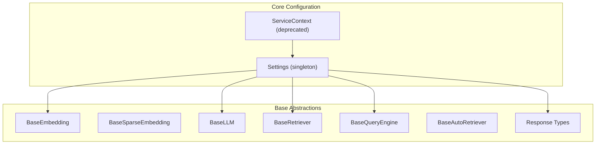
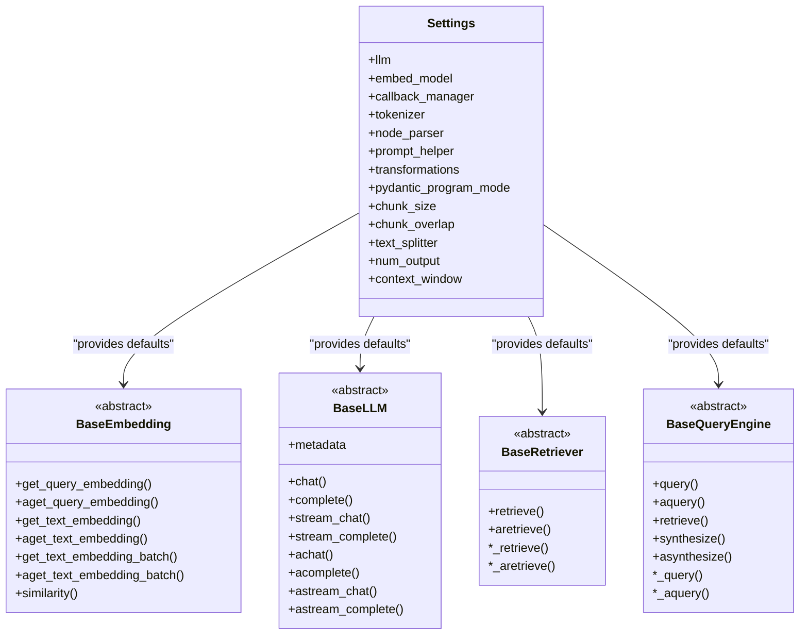
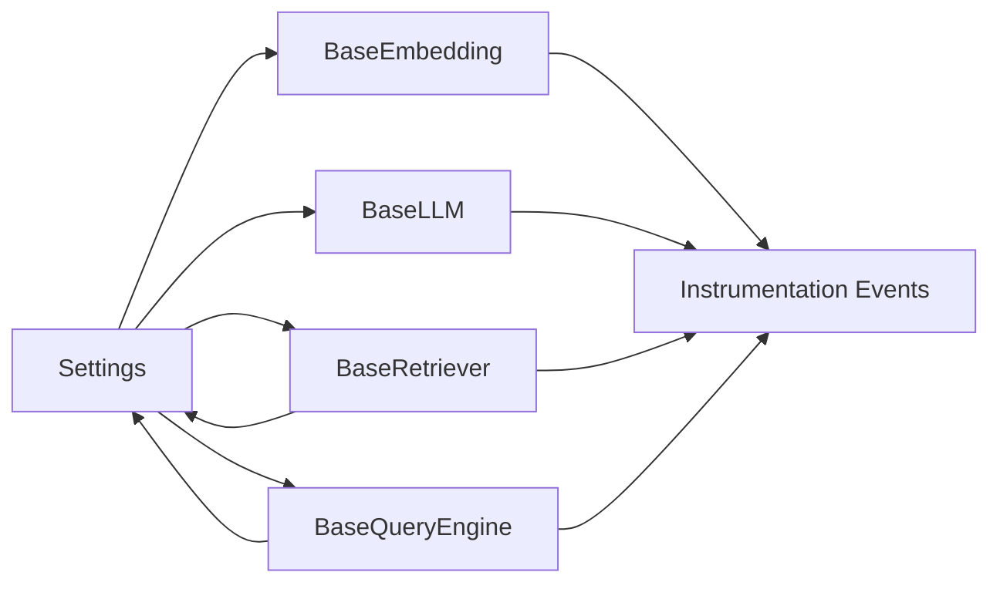

# Core API Classes and Interfaces

<cite>
**Referenced Files in This Document**
- [settings.py](file://llama-index-core/llama_index/core/settings.py)
- [service_context.py](file://llama-index-core/llama_index/core/service_context.py)
- [types.py](file://llama-index-core/llama_index/core/types.py)
- [base.py](file://llama-index-core/llama_index/core/base/embeddings/base.py)
- [base.py](file://llama-index-core/llama_index/core/base/llms/base.py)
- [types.py](file://llama-index-core/llama_index/core/base/llms/types.py)
- [base_auto_retriever.py](file://llama-index-core/llama_index/core/base/base_auto_retriever.py)
- [base_query_engine.py](file://llama-index-core/llama_index/core/base/base_query_engine.py)
- [base_retriever.py](file://llama-index-core/llama_index/core/base/base_retriever.py)
- [schema.py](file://llama-index-core/llama_index/core/base/response/schema.py)
- [base_sparse.py](file://llama-index-core/llama_index/core/base/embeddings/base_sparse.py)
</cite>

## Table of Contents
1. [Introduction](#introduction)
2. [Project Structure](#project-structure)
3. [Core Components](#core-components)
4. [Architecture Overview](#architecture-overview)
5. [Detailed Component Analysis](#detailed-component-analysis)
6. [Dependency Analysis](#dependency-analysis)
7. [Performance Considerations](#performance-considerations)
8. [Troubleshooting Guide](#troubleshooting-guide)
9. [Conclusion](#conclusion)

## Introduction
This document provides comprehensive API documentation for the LlamaIndex core classes and interfaces. It focuses on:
- The Settings singleton and its configuration patterns
- ServiceContext deprecation and migration guidance
- Base abstract classes and interfaces for embeddings, LLMs, retrievers, query engines, and responses
- Class hierarchies, inheritance patterns, and interface contracts
- Method signatures, parameters, return types, and usage examples
- Lifecycle management, thread safety, performance characteristics, and best practices

## Project Structure
The core APIs are primarily located under the llama-index-core module. The most relevant files for this documentation include:
- Settings singleton and configuration management
- Base abstract classes for embeddings, LLMs, retrievers, query engines, and responses
- Supporting types and enums for LLM message formats and response types
- Deprecation notice for ServiceContext

**Diagram sources**
- [settings.py](file://llama-index-core/llama_index/core/settings.py#L17-L249)
- [service_context.py](file://llama-index-core/llama_index/core/service_context.py#L1-L49)
- [base.py](file://llama-index-core/llama_index/core/base/embeddings/base.py#L72-L619)
- [base_sparse.py](file://llama-index-core/llama_index/core/base/embeddings/base_sparse.py#L74-L354)
- [base.py](file://llama-index-core/llama_index/core/base/llms/base.py#L25-L292)
- [base_retriever.py](file://llama-index-core/llama_index/core/base/base_retriever.py#L34-L275)
- [base_query_engine.py](file://llama-index-core/llama_index/core/base/base_query_engine.py#L22-L94)
- [base_auto_retriever.py](file://llama-index-core/llama_index/core/base/base_auto_retriever.py#L9-L44)
- [schema.py](file://llama-index-core/llama_index/core/base/response/schema.py#L14-L242)

**Section sources**
- [settings.py](file://llama-index-core/llama_index/core/settings.py#L1-L249)
- [service_context.py](file://llama-index-core/llama_index/core/service_context.py#L1-L49)

## Core Components
This section summarizes the central building blocks and their roles.

- Settings singleton
  - Provides lazy-initialized access to LLM, embedding model, callback manager, tokenizer, node parser, prompt helper, transformations, and related configuration.
  - Exposes properties for pydantic program mode, chunk size/overlap, and prompt helper context window/outputs.
  - Acts as the primary configuration hub for global defaults.

- BaseEmbedding
  - Defines synchronous and asynchronous embedding interfaces for queries and texts.
  - Supports batching, aggregation, caching, and similarity computation.
  - Integrates instrumentation and callback events.

- BaseSparseEmbedding
  - Similar to BaseEmbedding but for sparse embeddings represented as index-to-weight dictionaries.
  - Includes sparse-specific similarity and aggregation helpers.

- BaseLLM
  - Defines chat, completion, and streaming endpoints for LLMs.
  - Provides metadata and message conversion utilities.
  - Supports both sync and async variants.

- BaseRetriever
  - Retrieves nodes given a query, with recursive retrieval and deduplication.
  - Emits instrumentation events and integrates with callback managers.
  - Supports both sync and async retrieval.

- BaseQueryEngine
  - Orchestrates query execution with instrumentation and callback tracing.
  - Requires subclasses to implement synchronous and asynchronous query methods.

- BaseAutoRetriever
  - Generates retrieval specifications and builds retrievers dynamically from those specs.

- Response Types
  - Standardized response containers for text, streaming, and Pydantic outputs.
  - Provide utilities for formatting and printing sources.

- LLM Types
  - Rich type definitions for messages, blocks (text, image, audio, video, document), chat/completion responses, and metadata.

**Section sources**
- [settings.py](file://llama-index-core/llama_index/core/settings.py#L17-L249)
- [base.py](file://llama-index-core/llama_index/core/base/embeddings/base.py#L72-L619)
- [base_sparse.py](file://llama-index-core/llama_index/core/base/embeddings/base_sparse.py#L74-L354)
- [base.py](file://llama-index-core/llama_index/core/base/llms/base.py#L25-L292)
- [base_retriever.py](file://llama-index-core/llama_index/core/base/base_retriever.py#L34-L275)
- [base_query_engine.py](file://llama-index-core/llama_index/core/base/base_query_engine.py#L22-L94)
- [base_auto_retriever.py](file://llama-index-core/llama_index/core/base/base_auto_retriever.py#L9-L44)
- [schema.py](file://llama-index-core/llama_index/core/base/response/schema.py#L14-L242)
- [types.py](file://llama-index-core/llama_index/core/base/llms/types.py#L39-L747)

## Architecture Overview
The Settings singleton acts as the central configuration provider. It lazily resolves default components and injects callback managers into them. Components like BaseEmbedding and BaseLLM expose properties that delegate to Settings when not explicitly configured.

**Diagram sources**
- [settings.py](file://llama-index-core/llama_index/core/settings.py#L17-L249)
- [base.py](file://llama-index-core/llama_index/core/base/embeddings/base.py#L72-L619)
- [base.py](file://llama-index-core/llama_index/core/base/llms/base.py#L25-L292)
- [base_retriever.py](file://llama-index-core/llama_index/core/base/base_retriever.py#L34-L275)
- [base_query_engine.py](file://llama-index-core/llama_index/core/base/base_query_engine.py#L22-L94)

## Detailed Component Analysis

### Settings Singleton
- Purpose: Global configuration provider with lazy initialization and default resolution.
- Key properties and behaviors:
  - LLM: Lazy-resolved via a resolver; assigns callback manager if present.
  - Embedding model: Lazy-resolved via a resolver; assigns callback manager if present.
  - Callback manager: Lazily instantiated if not provided.
  - Tokenizer: Delegates to global tokenizer or a provided callable; supports Transformers tokenizer adaptation.
  - Node parser: Defaults to a sentence splitter; assigns callback manager if present.
  - Prompt helper: Built from LLM metadata if available; otherwise default.
  - Transformations: Defaults to a list containing the node parser.
  - Chunk size/overlap: Delegates to node parser if available; otherwise raises an error.
  - Pydantic program mode: Delegates to the LLM’s program mode.

- Initialization parameters:
  - No explicit constructor parameters; configuration is set via properties.

- Lifecycle:
  - First access triggers lazy resolution of defaults.
  - Properties can be overridden to customize behavior.

- Usage examples:
  - Configure a global LLM: assign an LLM instance to the llm property.
  - Set a custom callback manager: assign a CallbackManager to callback_manager.
  - Adjust chunk size: set chunk_size after configuring node_parser.

- Thread safety:
  - The Settings singleton itself is a dataclass with no shared mutable state beyond the components it holds. Mutations occur via property setters; ensure thread-safe assignment patterns if modifying concurrently.

- Best practices:
  - Prefer setting components globally via Settings for consistent behavior across modules.
  - Use callback_manager to enable instrumentation and monitoring.
  - Keep node parser and prompt helper aligned to avoid context window mismatches.

**Section sources**
- [settings.py](file://llama-index-core/llama_index/core/settings.py#L17-L249)

### ServiceContext (Deprecated)
- Purpose: Historical container for service-wide configuration.
- Status: Deprecated in favor of Settings and local module injection.
- Migration guidance:
  - Replace usage with Settings for global defaults.
  - Pass modules directly to local functions or constructors for explicit control.

**Section sources**
- [service_context.py](file://llama-index-core/llama_index/core/service_context.py#L1-L49)

### BaseEmbedding
- Purpose: Abstract base for embedding providers.
- Key methods and properties:
  - Synchronous/asynchronous query and text embedding methods.
  - Batch embedding with progress reporting and worker support.
  - Aggregation helpers for multiple queries.
  - Caching support via a key-value store interface.
  - Similarity computation with configurable modes.
  - Integration with instrumentation and callback events.

- Parameters and return types:
  - get_query_embedding/query: string -> embedding
  - get_text_embedding/text: string -> embedding
  - get_text_embedding_batch: list[string] -> list[embedding]
  - aget_* variants: async equivalents
  - similarity: two embeddings -> float

- Usage examples:
  - Compute a single embedding: call get_query_embedding or get_text_embedding.
  - Batch compute embeddings: call get_text_embedding_batch with show_progress.
  - Enable caching: configure embeddings_cache to a KV store.

- Thread safety:
  - Embedding computations are stateless per call; ensure external caches are thread-safe if used.

- Best practices:
  - Tune embed_batch_size and num_workers for throughput.
  - Use caching for repeated embeddings to reduce cost and latency.

**Section sources**
- [base.py](file://llama-index-core/llama_index/core/base/embeddings/base.py#L72-L619)

### BaseSparseEmbedding
- Purpose: Abstract base for sparse embeddings (index-weight pairs).
- Key methods and properties:
  - Synchronous/asynchronous query and text embedding methods.
  - Batch embedding with progress reporting and worker support.
  - Aggregation helpers for multiple queries.
  - Sparse similarity computation optimized for sparse vectors.
  - Instrumentation integration.

- Parameters and return types:
  - get_query_embedding/query: string -> sparse embedding
  - get_text_embedding/text: string -> sparse embedding
  - get_text_embedding_batch: list[string] -> list[sparse embedding]
  - aget_* variants: async equivalents
  - similarity: two sparse embeddings -> float

- Usage examples:
  - Compute sparse embeddings for queries and texts.
  - Aggregate multiple sparse embeddings using mean aggregation.

- Thread safety:
  - Sparse embedding computations are stateless per call.

- Best practices:
  - Use sparse embeddings when working with high-dimensional sparse data.
  - Leverage batch sizes appropriate for the underlying model.

**Section sources**
- [base_sparse.py](file://llama-index-core/llama_index/core/base/embeddings/base_sparse.py#L74-L354)

### BaseLLM
- Purpose: Abstract base for language model providers.
- Key methods and properties:
  - Chat and completion endpoints (sync and async).
  - Streaming variants for both chat and completion.
  - Metadata exposing model capabilities and limits.
  - Message conversion utilities for standardized formats.

- Parameters and return types:
  - chat: sequence of ChatMessage -> ChatResponse
  - complete: string -> CompletionResponse
  - stream_chat/stream_complete: yields ChatResponse/CompletionResponse
  - achat/acomplete/astream_*: async equivalents
  - metadata: LLMMetadata

- Usage examples:
  - Chat with a model: pass a sequence of ChatMessage objects to chat.
  - Stream completion: iterate over stream_complete generator.

- Thread safety:
  - LLM instances should be treated as thread-safe if underlying implementations are safe.

- Best practices:
  - Align prompt formatting with the model’s expected message structure.
  - Use streaming endpoints for long-running generations to improve perceived latency.

**Section sources**
- [base.py](file://llama-index-core/llama_index/core/base/llms/base.py#L25-L292)
- [types.py](file://llama-index-core/llama_index/core/base/llms/types.py#L39-L747)

### BaseRetriever
- Purpose: Abstract base for retrieval components.
- Key methods and properties:
  - retrieve and aretrieve orchestrate retrieval and handle recursive retrieval.
  - Internal hooks for subclassing: _retrieve and _aretrieve.
  - Deduplication logic based on node hash and reference document ID.
  - Instrumentation and callback integration.

- Parameters and return types:
  - retrieve/aretrieve: QueryType -> list[NodeWithScore]

- Usage examples:
  - Retrieve nodes for a query string or QueryBundle.
  - Override _retrieve to implement custom retrieval logic.

- Thread safety:
  - Retrieval is stateless; ensure underlying stores are thread-safe.

- Best practices:
  - Use verbose mode during development to inspect retrieval behavior.
  - Ensure object_map is populated for index nodes requiring object resolution.

**Section sources**
- [base_retriever.py](file://llama-index-core/llama_index/core/base/base_retriever.py#L34-L275)

### BaseQueryEngine
- Purpose: Abstract base for query engines.
- Key methods and properties:
  - query and aquery wrap execution with instrumentation and callback tracing.
  - Requires subclasses to implement _query and _aquery.
  - Optional synthesis and retrieve methods (not implemented by default).

- Parameters and return types:
  - query/aquery: QueryType -> RESPONSE_TYPE

- Usage examples:
  - Implement a custom query engine by overriding _query and _aquery.
  - Use RESPONSE_TYPE union to support both streaming and non-streaming responses.

- Thread safety:
  - Query engines should be designed to be thread-safe if used concurrently.

- Best practices:
  - Encapsulate retrieval and synthesis steps within _query for consistent behavior.
  - Use callback_manager to trace query execution.

**Section sources**
- [base_query_engine.py](file://llama-index-core/llama_index/core/base/base_query_engine.py#L22-L94)

### BaseAutoRetriever
- Purpose: Abstract base for auto-generated retrievers.
- Key methods and properties:
  - generate_retrieval_spec and agenerate_retrieval_spec produce a specification.
  - _build_retriever_from_spec constructs a retriever and returns a new QueryBundle.
  - _retrieve/_aretrieve orchestrate retrieval using the generated spec.

- Parameters and return types:
  - generate_retrieval_spec/agenerate_retrieval_spec: QueryBundle -> BaseModel
  - _build_retriever_from_spec: BaseModel -> tuple[BaseRetriever, QueryBundle]

- Usage examples:
  - Implement dynamic retriever selection based on query semantics.
  - Return a specialized retriever tailored to the query.

- Thread safety:
  - Auto-retrieval logic should be thread-safe.

- Best practices:
  - Keep retrieval specs minimal and deterministic.
  - Validate and sanitize generated specs before constructing retrievers.

**Section sources**
- [base_auto_retriever.py](file://llama-index-core/llama_index/core/base/base_auto_retriever.py#L9-L44)

### Response Types
- Purpose: Unified response containers for different output modes.
- Types:
  - Response: Non-streaming text response with source nodes and metadata.
  - PydanticResponse: Non-streaming structured response with source nodes and metadata.
  - StreamingResponse: Streaming token generator with optional accumulated text.
  - AsyncStreamingResponse: Async streaming token generator with lock-protected accumulation.
  - RESPONSE_TYPE: Union of all response types.

- Parameters and return types:
  - get_response: converts streaming to non-streaming Response
  - print_response_stream/print_async: prints streaming tokens
  - get_formatted_sources: formats source node text

- Usage examples:
  - Print a streaming response incrementally.
  - Convert a PydanticResponse to a standard Response for downstream processing.

- Thread safety:
  - AsyncStreamingResponse uses an asyncio lock to protect shared state.

- Best practices:
  - Use PydanticResponse when expecting structured outputs.
  - Prefer streaming for long responses to improve UX.

**Section sources**
- [schema.py](file://llama-index-core/llama_index/core/base/response/schema.py#L14-L242)

### LLM Types
- Purpose: Shared type definitions for LLM message formats and responses.
- Key types:
  - MessageRole: Enum for roles (system, user, assistant, etc.).
  - Content blocks: TextBlock, ImageBlock, AudioBlock, VideoBlock, DocumentBlock, CachePoint, CitableBlock, CitationBlock, ThinkingBlock, ToolCallBlock.
  - ChatMessage: Message with role and content blocks; backward-compatible content property.
  - Responses: ChatResponse and CompletionResponse with deltas and logprobs.
  - LLMMetadata: Model metadata including context window, output tokens, and capabilities.

- Usage examples:
  - Construct ChatMessage with either a string content or a list of content blocks.
  - Use LLMMetadata to align prompt sizes with model constraints.

- Thread safety:
  - These are data structures; treat as immutable for concurrency.

- Best practices:
  - Use discriminated unions for content blocks to handle multimodal inputs safely.
  - Respect context_window and num_output limits from LLMMetadata.

**Section sources**
- [types.py](file://llama-index-core/llama_index/core/base/llms/types.py#L39-L747)

## Dependency Analysis
This section maps dependencies among core components and highlights coupling and cohesion.

**Diagram sources**
- [settings.py](file://llama-index-core/llama_index/core/settings.py#L17-L249)
- [base.py](file://llama-index-core/llama_index/core/base/embeddings/base.py#L72-L619)
- [base.py](file://llama-index-core/llama_index/core/base/llms/base.py#L25-L292)
- [base_retriever.py](file://llama-index-core/llama_index/core/base/base_retriever.py#L34-L275)
- [base_query_engine.py](file://llama-index-core/llama_index/core/base/base_query_engine.py#L22-L94)

**Section sources**
- [settings.py](file://llama-index-core/llama_index/core/settings.py#L17-L249)
- [base.py](file://llama-index-core/llama_index/core/base/embeddings/base.py#L72-L619)
- [base.py](file://llama-index-core/llama_index/core/base/llms/base.py#L25-L292)
- [base_retriever.py](file://llama-index-core/llama_index/core/base/base_retriever.py#L34-L275)
- [base_query_engine.py](file://llama-index-core/llama_index/core/base/base_query_engine.py#L22-L94)

## Performance Considerations
- Embedding throughput
  - Increase embed_batch_size to reduce overhead.
  - Use num_workers for async embedding batches to leverage concurrency.
  - Enable caching to avoid recomputation.

- Retrieval efficiency
  - Use efficient index backends and tune chunk size/overlap to balance recall and speed.
  - Avoid deep recursion in retrievers unless necessary.

- LLM generation
  - Use streaming endpoints to reduce perceived latency.
  - Respect context_window and num_output to prevent truncation and extra costs.

- Instrumentation and callbacks
  - Enable callback_manager for tracing; monitor overhead in production.

[No sources needed since this section provides general guidance]

## Troubleshooting Guide
- ServiceContext errors
  - Symptom: Instantiating ServiceContext raises a ValueError.
  - Resolution: Migrate to Settings or pass modules directly to functions.

- Missing chunk size/overlap
  - Symptom: Setting chunk_size/chunk_overlap raises an error.
  - Cause: Node parser does not expose these attributes.
  - Resolution: Configure a compatible node parser or set chunk_size/overlap on the parser directly.

- Prompt helper context mismatch
  - Symptom: Unexpected truncation or out-of-range errors.
  - Resolution: Ensure prompt_helper context_window and num_output match the active LLM metadata.

- Embedding cache misconfiguration
  - Symptom: ValueError indicating cache type mismatch.
  - Resolution: Ensure embeddings_cache is a BaseKVStore instance.

- Retrieval recursion issues
  - Symptom: Infinite recursion or missing objects.
  - Resolution: Populate object_map for index nodes and verify object types.

**Section sources**
- [service_context.py](file://llama-index-core/llama_index/core/service_context.py#L13-L48)
- [settings.py](file://llama-index-core/llama_index/core/settings.py#L154-L183)
- [base.py](file://llama-index-core/llama_index/core/base/embeddings/base.py#L100-L110)
- [base_retriever.py](file://llama-index-core/llama_index/core/base/base_retriever.py#L123-L139)

## Conclusion
The LlamaIndex core APIs provide a cohesive framework centered around the Settings singleton, with robust base abstractions for embeddings, LLMs, retrievers, query engines, and responses. By leveraging Settings for global configuration, adhering to the documented interfaces, and following the best practices outlined above, developers can build scalable and maintainable RAG applications. For legacy configurations, migrate away from ServiceContext toward Settings or explicit module injection.