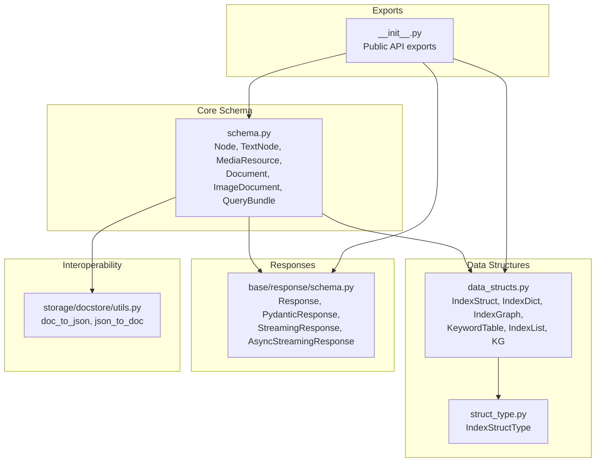
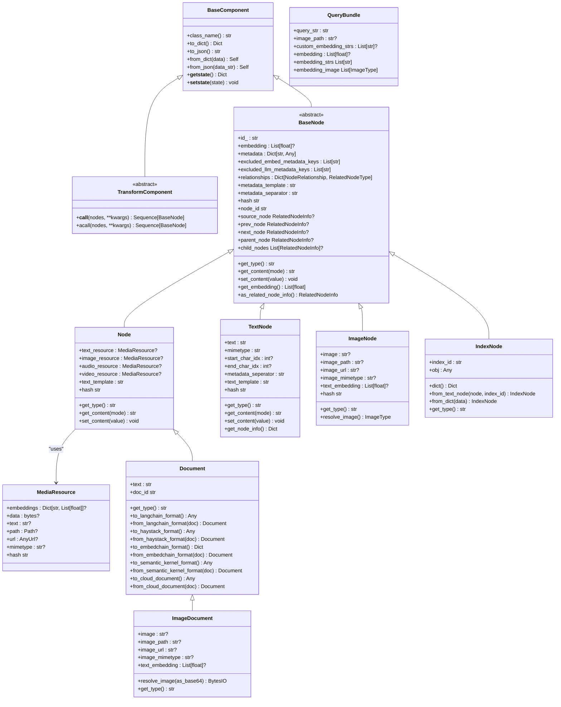
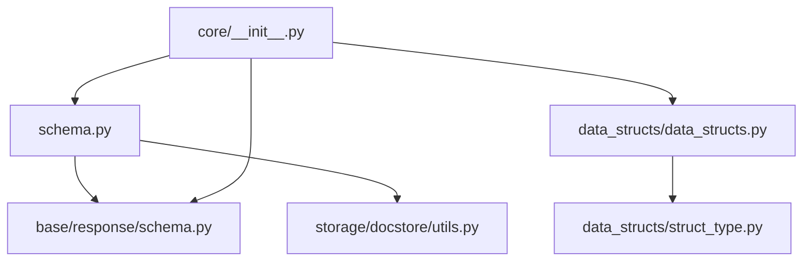

# Schema and Data Models

<cite>
**Referenced Files in This Document**
- [schema.py](file://llama-index-core/llama_index/core/schema.py)
- [types.py](file://llama-index-core/llama_index/core/types.py)
- [data_structs.py](file://llama-index-core/llama_index/core/data_structs/data_structs.py)
- [struct_type.py](file://llama-index-core/llama_index/core/data_structs/struct_type.py)
- [schema.py](file://llama-index-core/llama_index/core/base/response/schema.py)
- [utils.py](file://llama-index-core/llama_index/core/storage/docstore/utils.py)
- [__init__.py](file://llama-index-core/llama_index/core/__init__.py)
</cite>

## Table of Contents
1. [Introduction](#introduction)
2. [Project Structure](#project-structure)
3. [Core Components](#core-components)
4. [Architecture Overview](#architecture-overview)
5. [Detailed Component Analysis](#detailed-component-analysis)
6. [Dependency Analysis](#dependency-analysis)
7. [Performance Considerations](#performance-considerations)
8. [Troubleshooting Guide](#troubleshooting-guide)
9. [Conclusion](#conclusion)

## Introduction
This document provides comprehensive API documentation for LlamaIndex schema and data models. It focuses on core data structures such as Node, TextNode, IndexDict, and related types, detailing field definitions, validation rules, serialization patterns, and interoperability with external systems. It also covers inheritance hierarchies, polymorphic behavior, and practical guidance for extending models and optimizing performance with large datasets.

## Project Structure
The schema and data model APIs are primarily defined in the core module:
- Core schema and node types: [schema.py](file://llama-index-core/llama_index/core/schema.py)
- Supporting types and generators: [types.py](file://llama-index-core/llama_index/core/types.py)
- Index structures and index dictionaries: [data_structs.py](file://llama-index-core/llama_index/core/data_structs/data_structs.py), [struct_type.py](file://llama-index-core/llama_index/core/data_structs/struct_type.py)
- Response models: [schema.py](file://llama-index-core/llama_index/core/base/response/schema.py)
- Interoperability utilities: [utils.py](file://llama-index-core/llama_index/core/storage/docstore/utils.py)
- Top-level exports: [__init__.py](file://llama-index-core/llama_index/core/__init__.py)

**Diagram sources**
- [schema.py](file://llama-index-core/llama_index/core/schema.py#L263-L1408)
- [data_structs.py](file://llama-index-core/llama_index/core/data_structs/data_structs.py#L21-L280)
- [struct_type.py](file://llama-index-core/llama_index/core/data_structs/struct_type.py#L6-L117)
- [schema.py](file://llama-index-core/llama_index/core/base/response/schema.py#L14-L242)
- [utils.py](file://llama-index-core/llama_index/core/storage/docstore/utils.py#L15-L97)
- [__init__.py](file://llama-index-core/llama_index/core/__init__.py#L16-L150)

**Section sources**
- [schema.py](file://llama-index-core/llama_index/core/schema.py#L1-L1408)
- [data_structs.py](file://llama-index-core/llama_index/core/data_structs/data_structs.py#L1-L280)
- [struct_type.py](file://llama-index-core/llama_index/core/data_structs/struct_type.py#L1-L117)
- [schema.py](file://llama-index-core/llama_index/core/base/response/schema.py#L1-L242)
- [utils.py](file://llama-index-core/llama_index/core/storage/docstore/utils.py#L1-L97)
- [__init__.py](file://llama-index-core/llama_index/core/__init__.py#L1-L162)

## Core Components
This section summarizes the primary data structures and their roles.

- BaseComponent and TransformComponent: Base classes providing serialization, deserialization, and pickling support for components.
- BaseNode and derived node types: Node hierarchy including TextNode, Node (multimodal), ImageNode, IndexNode, Document, and ImageDocument.
- MediaResource: Encapsulates media content (text, binary, path, URL) and provides hashing.
- IndexStruct and concrete index structures: IndexDict, IndexGraph, KeywordTable, IndexList, KG, and others.
- Response models: Standardized response containers for streaming and non-streaming scenarios.
- QueryBundle: Encapsulates query text and optional embeddings/images for multimodal queries.

Key characteristics:
- Strong typing with Pydantic models and dataclasses.
- Extensive metadata filtering modes (MetadataMode).
- Relationship modeling via NodeRelationship and RelatedNodeInfo.
- Serialization via JSON and class_name injection for robust deserialization.
- Interoperability helpers for external libraries (LangChain, Haystack, Semantic Kernel, LlamaCloud).

**Section sources**
- [schema.py](file://llama-index-core/llama_index/core/schema.py#L80-L188)
- [schema.py](file://llama-index-core/llama_index/core/schema.py#L263-L1408)
- [data_structs.py](file://llama-index-core/llama_index/core/data_structs/data_structs.py#L21-L280)
- [schema.py](file://llama-index-core/llama_index/core/base/response/schema.py#L14-L242)
- [types.py](file://llama-index-core/llama_index/core/types.py#L1-L177)

## Architecture Overview
The schema layer defines a polymorphic node hierarchy with shared capabilities for content retrieval, metadata handling, embedding access, and hashing. Index structures encapsulate index-specific state and operations, while response models standardize output formats across streaming and non-streaming workflows.

**Diagram sources**
- [schema.py](file://llama-index-core/llama_index/core/schema.py#L80-L188)
- [schema.py](file://llama-index-core/llama_index/core/schema.py#L263-L1408)

**Section sources**
- [schema.py](file://llama-index-core/llama_index/core/schema.py#L80-L188)
- [schema.py](file://llama-index-core/llama_index/core/schema.py#L263-L1408)

## Detailed Component Analysis

### Node and TextNode
- Purpose: Represent textual content with metadata, relationships, and embeddings.
- Fields:
  - id_: Unique identifier.
  - embedding: Optional numeric vector.
  - metadata: Flat dictionary of arbitrary metadata.
  - excluded_embed_metadata_keys/excluded_llm_metadata_keys: Keys filtered for embedding/LLM contexts.
  - relationships: Mapping of NodeRelationship to RelatedNodeInfo or lists.
  - metadata_template/metadata_separator: Formatting controls for metadata rendering.
- Methods:
  - get_content(mode): Renders content with optional metadata inclusion.
  - set_content(value): Updates content.
  - hash: Deterministic hash of node content and metadata.
  - Relationship getters: source_node, prev_node, next_node, parent_node, child_nodes.
  - get_embedding(): Accessor that enforces presence of embedding.
  - as_related_node_info(): Converts to RelatedNodeInfo for relationship modeling.

Validation and behavior:
- MetadataMode controls inclusion of metadata in rendered content.
- Relationship values are validated to enforce single RelatedNodeInfo for singular relations and lists for CHILDREN.

Serialization:
- Uses BaseComponent serialization with class_name injection for robust deserialization.

Extensibility:
- Subclass BaseNode to define custom content types and hashing strategies.

**Section sources**
- [schema.py](file://llama-index-core/llama_index/core/schema.py#L263-L482)
- [schema.py](file://llama-index-core/llama_index/core/schema.py#L691-L798)

### MediaResource
- Purpose: Encapsulates media content and metadata for multimodal nodes.
- Fields:
  - embeddings: Optional multi-vector embeddings keyed by EmbeddingKind.
  - data: Binary content (stored base64-encoded when applicable).
  - text: Plain text representation.
  - path/url: Filesystem path or remote URL.
  - mimetype: Content MIME type.
- Validation:
  - data validator ensures base64 encoding and mimetype inference when missing.
  - mimetype validator guesses type from data or path.
- Serialization:
  - path serializer converts Path to string.
- Hashing:
  - Computes a deterministic hash from available content bits.

Use cases:
- Backed by raw bytes, filesystem path, URL, or text.
- Supports vector embeddings for retrieval.

**Section sources**
- [schema.py](file://llama-index-core/llama_index/core/schema.py#L487-L610)

### Node (Multimodal)
- Purpose: Multimodal node combining text and media resources.
- Fields:
  - text_resource/image_resource/audio_resource/video_resource: MediaResource instances.
  - text_template: Formatting template for content rendering.
- Behavior:
  - get_content(mode): Renders content with metadata according to template.
  - set_content(value): Creates MediaResource with text.
  - hash: Combines metadata and resource hashes.

**Section sources**
- [schema.py](file://llama-index-core/llama_index/core/schema.py#L612-L690)

### TextNode
- Purpose: Lightweight textual node with character indexing and MIME type.
- Fields:
  - text: Content string.
  - mimetype: Content MIME type.
  - start_char_idx/end_char_idx: Character span for extraction context.
  - metadata_seperator: Separator for metadata rendering.
  - text_template: Formatting template for content rendering.
- Behavior:
  - get_content(mode): Renders content with optional metadata.
  - get_metadata_str(mode): Formats metadata per MetadataMode.
  - set_content(value): Updates text.
  - hash: Concatenates text and metadata for hashing.

**Section sources**
- [schema.py](file://llama-index-core/llama_index/core/schema.py#L691-L798)

### ImageNode
- Purpose: Node specialized for images with optional text embedding.
- Fields:
  - image/image_path/image_url/image_mimetype: Image sources.
  - text_embedding: Optional dense embedding for image text.
- Behavior:
  - get_type(): ObjectType.IMAGE.
  - resolve_image(): Resolves image from base64, path, or URL.
  - hash: Combines image identifiers and text.

**Section sources**
- [schema.py](file://llama-index-core/llama_index/core/schema.py#L800-L870)

### IndexNode
- Purpose: Node referencing external objects (indices, engines, retrievers, or other nodes).
- Fields:
  - index_id: Reference identifier.
  - obj: Arbitrary object serialized via doc_to_json/json_to_doc.
- Serialization:
  - dict(): Serializes obj depending on type (BaseNode, BaseModel, or JSON string).
  - from_dict(): Deserializes obj with fallback to TextNode.

**Section sources**
- [schema.py](file://llama-index-core/llama_index/core/schema.py#L872-L948)
- [utils.py](file://llama-index-core/llama_index/core/storage/docstore/utils.py#L15-L97)

### Document and ImageDocument
- Document:
  - Backward-compatible with older fields (doc_id, extra_info, text).
  - Provides conversions to/from external formats (LangChain, Haystack, Semantic Kernel, LlamaCloud).
  - Custom serializer includes text field for compatibility.
- ImageDocument:
  - Wraps Document with image-specific properties and resolution helpers.
  - Validates image accessibility for file paths and URLs.

**Section sources**
- [schema.py](file://llama-index-core/llama_index/core/schema.py#L1012-L1222)
- [schema.py](file://llama-index-core/llama_index/core/schema.py#L1245-L1361)

### QueryBundle
- Purpose: Encapsulates query string(s), optional custom embedding strings, and optional embeddings.
- Fields:
  - query_str: Original query string.
  - image_path: Optional image path for multimodal queries.
  - custom_embedding_strs: Optional override for embedding strings.
  - embedding: Optional precomputed query embedding.
- Properties:
  - embedding_strs: Returns custom embedding strings or defaults to [query_str].
  - embedding_image: Returns image path as a list for retrieval.

**Section sources**
- [schema.py](file://llama-index-core/llama_index/core/schema.py#L1363-L1408)

### IndexStruct and IndexDict
- IndexStruct: Base class for index-specific structures with index_id and optional summary.
- IndexDict: Dictionary-backed index mapping vector store identifiers to node identifiers.
  - add_node(node, text_id?): Adds a node and returns vector store id.
  - delete(doc_id): Removes a node by id.
- Other index structures:
  - IndexGraph: Tree/graph structure with node mappings and children.
  - KeywordTable: Keyword-to-node-id mapping.
  - IndexList: Ordered list of node ids.
  - KG: Keyword-to-node-id mapping plus optional embeddings.

IndexStructType enumerates supported index types and vector store integrations.

**Section sources**
- [data_structs.py](file://llama-index-core/llama_index/core/data_structs/data_structs.py#L21-L280)
- [struct_type.py](file://llama-index-core/llama_index/core/data_structs/struct_type.py#L6-L117)

### Response Models
- Response: Non-streaming response with text, source nodes, and metadata.
- PydanticResponse: Response carrying a Pydantic model with source nodes and metadata.
- StreamingResponse: Streaming response with generator and optional accumulated text.
- AsyncStreamingResponse: Asynchronous streaming variant with locking and async generator.
- RESPONSE_TYPE: Union of all response types.

**Section sources**
- [schema.py](file://llama-index-core/llama_index/core/base/response/schema.py#L14-L242)

### Supporting Types
- TokenGen/TokenAsyncGen: Generators for streaming tokens.
- RESPONSE_TEXT_TYPE: Union of response text types.
- BaseOutputParser: Base class for structured output parsing with formatting hooks.
- BasePydanticProgram: Base class for LLM-powered programs returning Pydantic models.
- PydanticProgramMode: Modes for program execution.
- Thread: Threading wrapper preserving context.

**Section sources**
- [types.py](file://llama-index-core/llama_index/core/types.py#L1-L177)

## Dependency Analysis
The schema layer integrates tightly with data structures and response models, while providing interoperability utilities for external systems.

**Diagram sources**
- [schema.py](file://llama-index-core/llama_index/core/schema.py#L1-L1408)
- [data_structs.py](file://llama-index-core/llama_index/core/data_structs/data_structs.py#L1-L280)
- [struct_type.py](file://llama-index-core/llama_index/core/data_structs/struct_type.py#L1-L117)
- [schema.py](file://llama-index-core/llama_index/core/base/response/schema.py#L1-L242)
- [utils.py](file://llama-index-core/llama_index/core/storage/docstore/utils.py#L1-L97)
- [__init__.py](file://llama-index-core/llama_index/core/__init__.py#L1-L162)

**Section sources**
- [__init__.py](file://llama-index-core/llama_index/core/__init__.py#L16-L150)
- [utils.py](file://llama-index-core/llama_index/core/storage/docstore/utils.py#L15-L97)

## Performance Considerations
- Prefer lightweight nodes for large-scale ingestion:
  - Use TextNode for pure text to minimize overhead.
  - Use MediaResource sparingly; store large binaries externally and reference via path or URL.
- Optimize metadata filtering:
  - Configure excluded_embed_metadata_keys and excluded_llm_metadata_keys to reduce context size.
- Efficient hashing:
  - Leverage node.hash for deduplication; ensure stable content and minimal unnecessary metadata updates.
- Streaming responses:
  - Use StreamingResponse or AsyncStreamingResponse to reduce memory pressure during generation.
- Index selection:
  - Choose IndexDict for simple vector store mappings; use IndexGraph for hierarchical retrieval.
- Serialization:
  - Use BaseComponent serialization to avoid unpickleable attributes; handle large payloads externally when necessary.

[No sources needed since this section provides general guidance]

## Troubleshooting Guide
Common issues and resolutions:
- Missing embedding errors:
  - Call get_embedding() only when embedding is set; initialize embeddings before retrieval.
- Relationship validation:
  - Ensure singular relationships (SOURCE, PREVIOUS, NEXT, PARENT) map to a single RelatedNodeInfo.
  - Child relationships must be a list of RelatedNodeInfo.
- Serialization failures:
  - IndexNode requires serializable obj; fallback to TextNode if deserialization fails.
  - Use doc_to_json/json_to_doc for robust round-tripping of nodes.
- Image validation:
  - ImageDocument validates image accessibility for file paths and URLs; ensure network connectivity and permissions.
- Metadata formatting:
  - Adjust metadata_template and metadata_separator to control rendered metadata inclusion.

**Section sources**
- [schema.py](file://llama-index-core/llama_index/core/schema.py#L463-L473)
- [schema.py](file://llama-index-core/llama_index/core/schema.py#L378-L428)
- [schema.py](file://llama-index-core/llama_index/core/schema.py#L886-L903)
- [utils.py](file://llama-index-core/llama_index/core/storage/docstore/utils.py#L15-L97)
- [schema.py](file://llama-index-core/llama_index/core/schema.py#L1245-L1272)

## Conclusion
LlamaIndex schema and data models provide a robust, extensible foundation for building retrieval-augmented applications. The polymorphic node hierarchy, strong typing, and serialization mechanisms enable efficient handling of diverse content types and seamless integration with external systems. By leveraging metadata filtering, streaming responses, and appropriate index structures, developers can scale reliably and maintain high performance with large datasets.