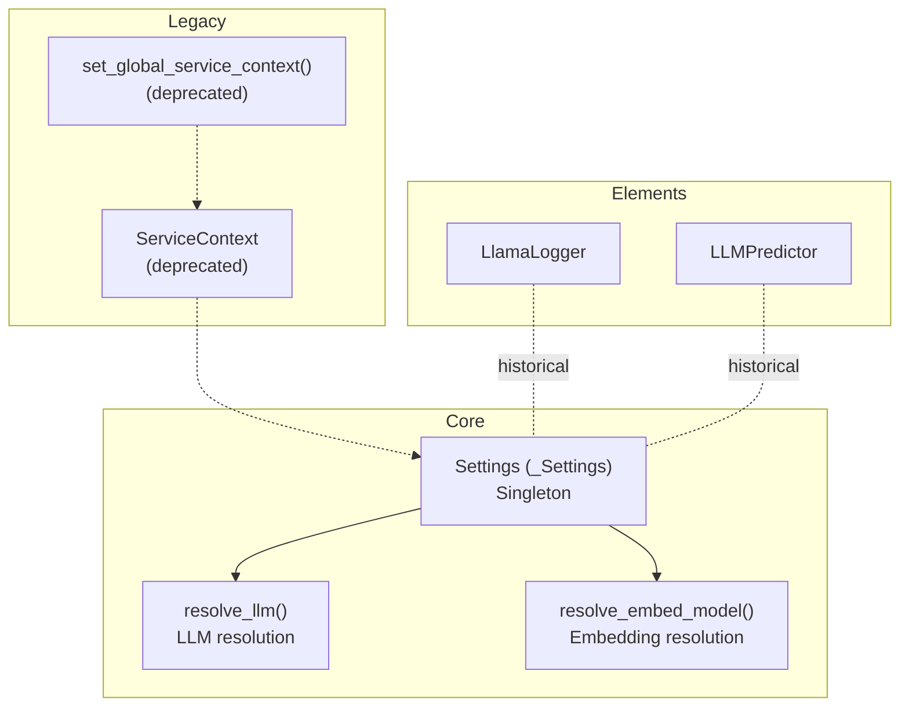
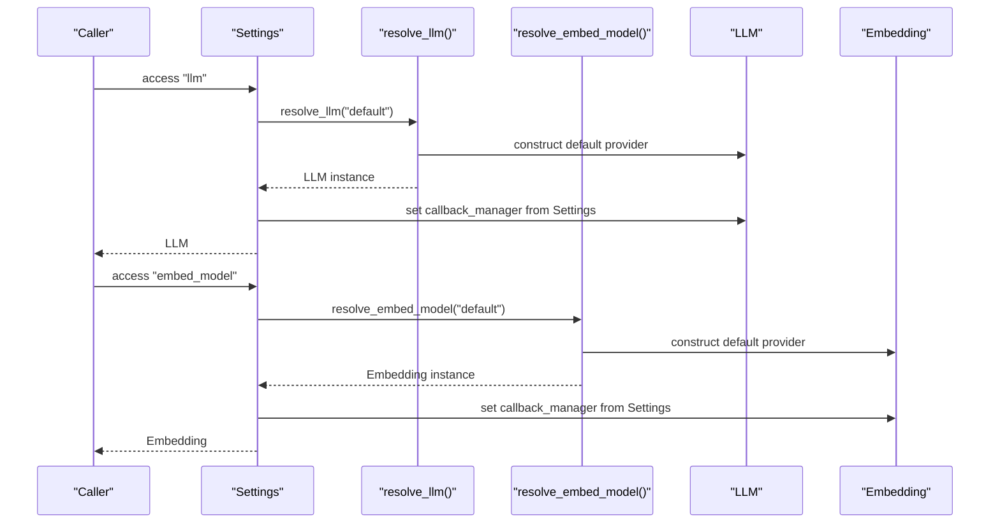
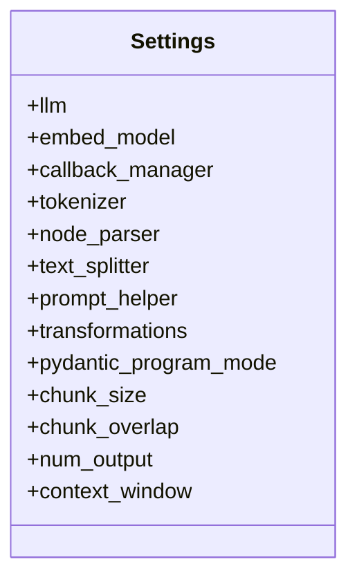
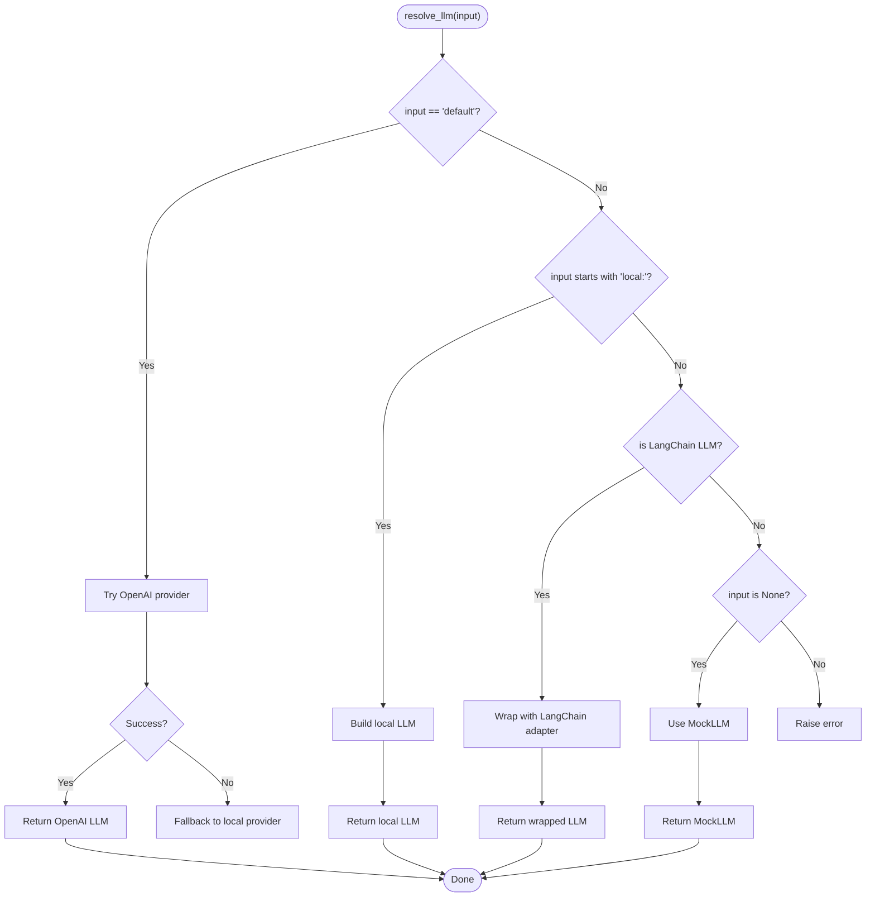
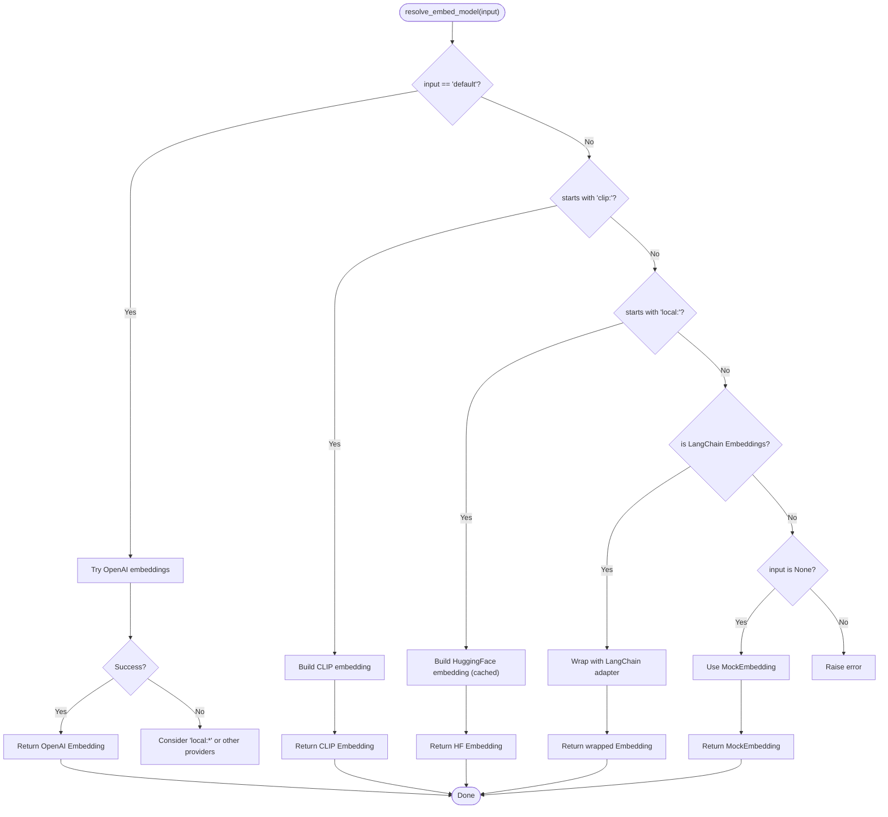
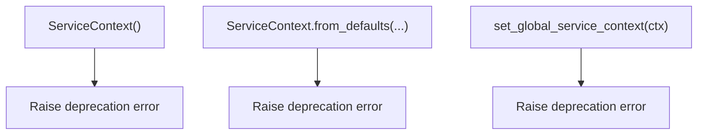
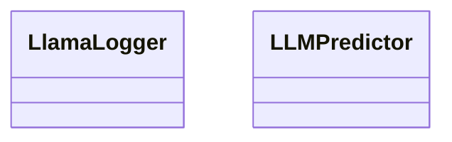
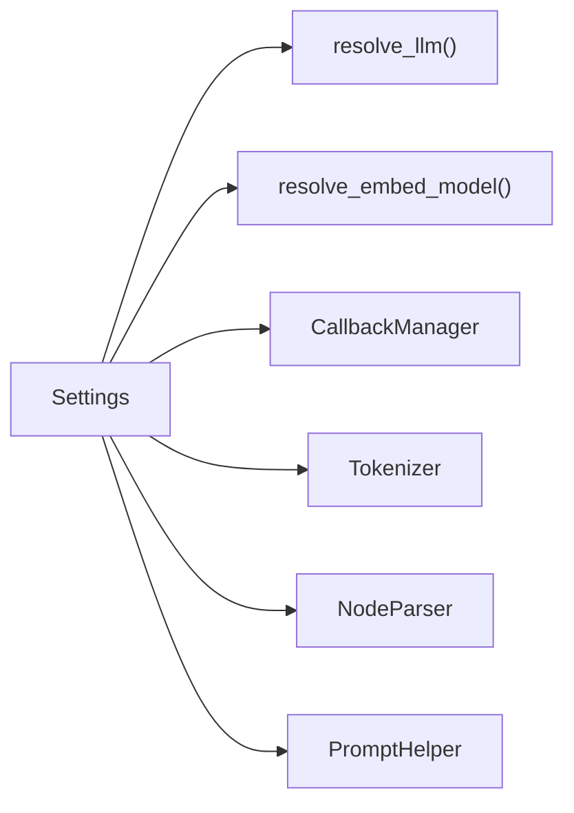

# Service Context and Dependency Injection

<cite>
**Referenced Files in This Document**
- [service_context.py](file://llama-index-core/llama_index/core/service_context.py)
- [settings.py](file://llama-index-core/llama_index/core/settings.py)
- [__init__.py](file://llama-index-core/llama_index/core/__init__.py)
- [utils.py](file://llama-index-core/llama_index/core/llms/utils.py)
- [utils.py](file://llama-index-core/llama_index/core/embeddings/utils.py)
- [llama_logger.py](file://llama-index-core/llama_index/core/service_context_elements/llama_logger.py)
- [llm_predictor.py](file://llama-index-core/llama_index/core/service_context_elements/llm_predictor.py)
</cite>

## Table of Contents
1. [Introduction](#introduction)
2. [Project Structure](#project-structure)
3. [Core Components](#core-components)
4. [Architecture Overview](#architecture-overview)
5. [Detailed Component Analysis](#detailed-component-analysis)
6. [Dependency Analysis](#dependency-analysis)
7. [Performance Considerations](#performance-considerations)
8. [Troubleshooting Guide](#troubleshooting-guide)
9. [Conclusion](#conclusion)

## Introduction
This document explains the LlamaIndex dependency injection system centered around the Settings singleton and related utilities. It consolidates the former ServiceContext role into a modern, lazily initialized, and globally configurable container. You will learn how to initialize and configure components, how dependency resolution works for LLMs and embeddings, and how to override defaults for different deployment scenarios. Thread-safety, lifecycle management, and best practices are also covered.

## Project Structure
The dependency injection system spans several modules:
- Settings singleton and property-based lazy initialization
- LLM and embedding resolution utilities
- Legacy ServiceContext shim and top-level exports
- Service context elements (logger, predictor) for historical completeness

**Diagram sources**
- [settings.py](file://llama-index-core/llama_index/core/settings.py#L17-L248)
- [utils.py](file://llama-index-core/llama_index/core/llms/utils.py#L15-L110)
- [utils.py](file://llama-index-core/llama_index/core/embeddings/utils.py#L31-L140)
- [service_context.py](file://llama-index-core/llama_index/core/service_context.py#L4-L49)
- [llama_logger.py](file://llama-index-core/llama_index/core/service_context_elements/llama_logger.py#L5-L10)
- [llm_predictor.py](file://llama-index-core/llama_index/core/service_context_elements/llm_predictor.py#L18-L70)

**Section sources**
- [settings.py](file://llama-index-core/llama_index/core/settings.py#L17-L248)
- [utils.py](file://llama-index-core/llama_index/core/llms/utils.py#L15-L110)
- [utils.py](file://llama-index-core/llama_index/core/embeddings/utils.py#L31-L140)
- [service_context.py](file://llama-index-core/llama_index/core/service_context.py#L4-L49)
- [__init__.py](file://llama-index-core/llama_index/core/__init__.py#L72-L78)

## Core Components
- Settings singleton: Provides lazy initialization and centralized access to LLM, embeddings, callback manager, tokenizer, node parser, prompt helper, and transformations.
- LLM resolution: Converts string or LangChain inputs into a concrete LLM instance, wiring callback managers and handling defaults.
- Embedding resolution: Converts string or LangChain inputs into a concrete embedding model, wiring callback managers and handling defaults.
- Legacy ServiceContext: Deprecated; raises errors and redirects to Settings or local overrides.

Key behaviors:
- Lazy initialization: Components are created on first access.
- Global callback propagation: When a component is lazily resolved, its callback manager is set from Settings.
- Defaults: “default” strings trigger built-in providers (OpenAI LLM/embeddings), with fallbacks and explicit local options.

**Section sources**
- [settings.py](file://llama-index-core/llama_index/core/settings.py#L17-L248)
- [utils.py](file://llama-index-core/llama_index/core/llms/utils.py#L15-L110)
- [utils.py](file://llama-index-core/llama_index/core/embeddings/utils.py#L31-L140)
- [service_context.py](file://llama-index-core/llama_index/core/service_context.py#L4-L49)

## Architecture Overview
The Settings singleton acts as the central dependency container. It exposes properties for LLM, embeddings, tokenizer, node parser, prompt helper, and transformations. These properties lazily construct default instances and propagate the global callback manager. Utilities resolve LLMs and embeddings from strings or external integrations (LangChain), ensuring consistent wiring.

**Diagram sources**
- [settings.py](file://llama-index-core/llama_index/core/settings.py#L32-L46)
- [settings.py](file://llama-index-core/llama_index/core/settings.py#L60-L74)
- [utils.py](file://llama-index-core/llama_index/core/llms/utils.py#L15-L110)
- [utils.py](file://llama-index-core/llama_index/core/embeddings/utils.py#L31-L140)

## Detailed Component Analysis

### Settings Singleton
The Settings singleton encapsulates:
- LLM property with getter/setter and pydantic program mode delegation
- Embedding model property with getter/setter
- Callback manager property with lazy instantiation
- Tokenizer property with global tokenization support
- Node parser and text splitter aliases with chunk size/overlap accessors
- Prompt helper with context window and output size controls
- Transformations list with node parser as default

Behavior highlights:
- Lazy initialization: Components are constructed on first access.
- Global callback propagation: When a component is lazily resolved, its callback manager is set from Settings.
- Aliases: text_splitter is an alias of node_parser.
- Validation: Accessors for chunk_size/chunk_overlap raise if the configured node parser lacks these attributes.

**Diagram sources**
- [settings.py](file://llama-index-core/llama_index/core/settings.py#L17-L248)

**Section sources**
- [settings.py](file://llama-index-core/llama_index/core/settings.py#L17-L248)

### LLM Resolution Utility
The LLM resolution utility supports:
- “default”: attempts OpenAI, falls back to a local provider if available
- “local:model”: constructs a local LLM (e.g., llama.cpp) with appropriate prompt adapters
- LangChain LLM: wraps a LangChain model via a compatible adapter
- None: returns a mock LLM for disabled scenarios
- Callback manager wiring: ensures the resolved LLM uses the provided or global callback manager

**Diagram sources**
- [utils.py](file://llama-index-core/llama_index/core/llms/utils.py#L15-L110)

**Section sources**
- [utils.py](file://llama-index-core/llama_index/core/llms/utils.py#L15-L110)

### Embedding Resolution Utility
The embedding resolution utility supports:
- “default”: attempts OpenAI embeddings, with guidance to use a local option if unavailable
- “clip:model”: constructs a CLIP-based image-text embedding
- “local:model”: constructs a HuggingFace-based embedding with caching
- LangChain embeddings: wraps via a compatible adapter
- None: returns a minimal mock embedding
- Callback manager wiring: ensures the resolved embedding uses the provided or global callback manager

**Diagram sources**
- [utils.py](file://llama-index-core/llama_index/core/embeddings/utils.py#L31-L140)

**Section sources**
- [utils.py](file://llama-index-core/llama_index/core/embeddings/utils.py#L31-L140)

### Legacy ServiceContext and Global Helpers
ServiceContext is deprecated. Attempts to instantiate it or call its factory methods raise errors and redirect to Settings or local overrides. A global helper exists but is also deprecated.

**Diagram sources**
- [service_context.py](file://llama-index-core/llama_index/core/service_context.py#L13-L49)

**Section sources**
- [service_context.py](file://llama-index-core/llama_index/core/service_context.py#L4-L49)
- [__init__.py](file://llama-index-core/llama_index/core/__init__.py#L72-L78)

### Service Context Elements (Historical)
Historical elements like LlamaLogger and LLMPredictor remain available for compatibility. They are not part of the current dependency injection pipeline but may appear in older configurations.

**Diagram sources**
- [llama_logger.py](file://llama-index-core/llama_index/core/service_context_elements/llama_logger.py#L5-L10)
- [llm_predictor.py](file://llama-index-core/llama_index/core/service_context_elements/llm_predictor.py#L18-L70)

**Section sources**
- [llama_logger.py](file://llama-index-core/llama_index/core/service_context_elements/llama_logger.py#L5-L10)
- [llm_predictor.py](file://llama-index-core/llama_index/core/service_context_elements/llm_predictor.py#L18-L70)

## Dependency Analysis
The Settings singleton depends on:
- LLM resolution utility for constructing default LLMs
- Embedding resolution utility for constructing default embeddings
- Callback manager for propagating global handlers
- Tokenizer utilities for global tokenization
- Node parser and prompt helper for text processing and context management

**Diagram sources**
- [settings.py](file://llama-index-core/llama_index/core/settings.py#L17-L248)
- [utils.py](file://llama-index-core/llama_index/core/llms/utils.py#L15-L110)
- [utils.py](file://llama-index-core/llama_index/core/embeddings/utils.py#L31-L140)

**Section sources**
- [settings.py](file://llama-index-core/llama_index/core/settings.py#L17-L248)

## Performance Considerations
- Lazy initialization reduces startup overhead by constructing components only when accessed.
- Global callback propagation avoids per-component callback setup costs.
- Embedding resolution caches local models to disk, reducing repeated downloads.
- Choose local providers (“local:*”) for offline or constrained environments to avoid network latency.
- Prefer explicit component injection for hot paths to bypass resolution overhead.

[No sources needed since this section provides general guidance]

## Troubleshooting Guide
Common issues and resolutions:
- Import errors for default providers: Install the required packages (e.g., OpenAI LLM/embeddings) or switch to local providers.
- Missing API keys: Ensure environment variables are set; otherwise, use local providers.
- Node parser lacks chunk size/overlap: Configure a node parser that supports these attributes or set them explicitly.
- Disabled LLM/embeddings: Explicitly passing None yields mock components; provide a valid configuration.

**Section sources**
- [utils.py](file://llama-index-core/llama_index/core/llms/utils.py#L44-L57)
- [utils.py](file://llama-index-core/llama_index/core/embeddings/utils.py#L60-L77)
- [settings.py](file://llama-index-core/llama_index/core/settings.py#L154-L183)

## Conclusion
LlamaIndex’s dependency injection system centers on the Settings singleton, which lazily initializes and wires LLMs, embeddings, tokenizers, parsers, and helpers. The legacy ServiceContext is deprecated and should be replaced by Settings or local overrides. By leveraging the provided utilities and properties, you can customize components, manage lifecycles, and optimize performance across diverse deployment scenarios.