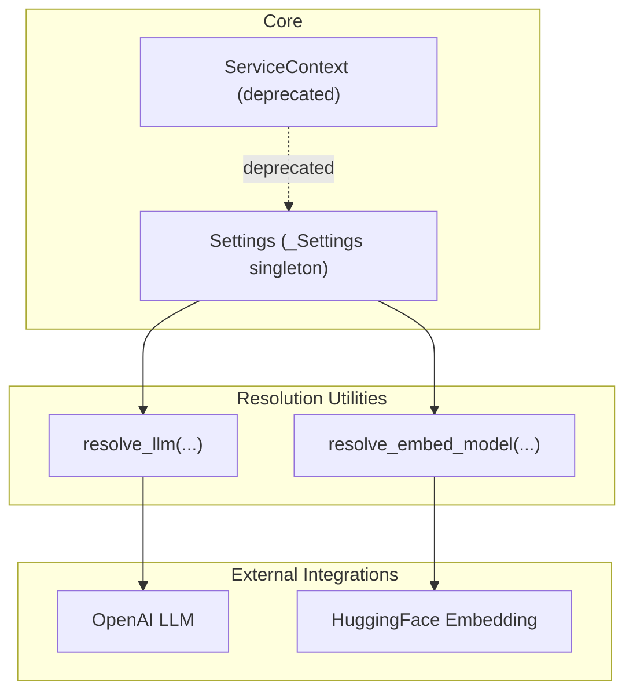
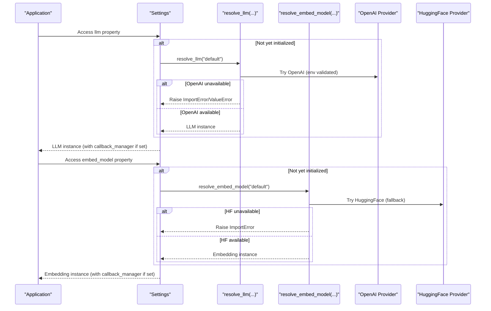
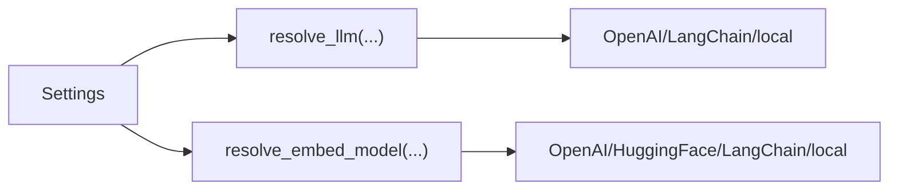

# Settings and Configuration Management

<cite>
**Referenced Files in This Document**
- [settings.py](file://llama-index-core/llama_index/core/settings.py)
- [service_context.py](file://llama-index-core/llama_index/core/service_context.py)
- [utils.py](file://llama-index-core/llama_index/core/llms/utils.py)
- [utils.py](file://llama-index-core/llama_index/core/embeddings/utils.py)
- [settings.mdx](file://docs/src/content/docs/framework/module_guides/supporting_modules/settings.mdx)
- [service_context_migration.md](file://docs/src/content/docs/framework/module_guides/supporting_modules/service_context_migration.md)
- [embeddings.md](file://docs/src/content/docs/framework/module_guides/models/embeddings.md)
</cite>

## Table of Contents
1. [Introduction](#introduction)
2. [Project Structure](#project-structure)
3. [Core Components](#core-components)
4. [Architecture Overview](#architecture-overview)
5. [Detailed Component Analysis](#detailed-component-analysis)
6. [Dependency Analysis](#dependency-analysis)
7. [Performance Considerations](#performance-considerations)
8. [Troubleshooting Guide](#troubleshooting-guide)
9. [Conclusion](#conclusion)
10. [Appendices](#appendices)

## Introduction
This document describes the LlamaIndex Settings and configuration management system. It focuses on the Settings singleton pattern, global configuration properties, and environment variable handling. It documents LLM and embedding model configuration, service context defaults, method signatures for settings modification, validation rules, type checking, and precedence. It also covers thread-safety considerations, hot-reloading behavior, and best practices for production deployments, along with migration guidance from the deprecated ServiceContext.

## Project Structure
The configuration system centers around a single Settings object that lazily initializes and exposes global defaults for LLM, embeddings, tokenization, parsing, prompt helpers, and transformations. Resolution utilities translate string identifiers and environment variables into concrete instances.

**Diagram sources**
- [settings.py](file://llama-index-core/llama_index/core/settings.py#L17-L248)
- [utils.py](file://llama-index-core/llama_index/core/llms/utils.py#L15-L110)
- [utils.py](file://llama-index-core/llama_index/core/embeddings/utils.py#L31-L140)

**Section sources**
- [settings.py](file://llama-index-core/llama_index/core/settings.py#L17-L248)
- [service_context.py](file://llama-index-core/llama_index/core/service_context.py#L4-L48)

## Core Components
- Settings singleton: A single global configuration object that lazily instantiates LLM, embeddings, tokenizer, node parser, prompt helper, and transformations. Properties automatically attach a global callback manager when present.
- LLM resolution: Converts string identifiers and LangChain models into concrete LLM instances, with environment-driven fallbacks and validation.
- Embedding resolution: Converts string identifiers and LangChain embeddings into concrete embedding models, with environment-driven fallbacks and validation.
- ServiceContext deprecation: Legacy container is deprecated in favor of Settings and local per-module configuration.

Key responsibilities:
- Provide global defaults for indexing and querying workflows.
- Resolve providers based on environment variables and string specifiers.
- Enforce validation and error messaging for missing credentials or packages.
- Support optional callback manager propagation to resolved components.

**Section sources**
- [settings.py](file://llama-index-core/llama_index/core/settings.py#L17-L248)
- [utils.py](file://llama-index-core/llama_index/core/llms/utils.py#L15-L110)
- [utils.py](file://llama-index-core/llama_index/core/embeddings/utils.py#L31-L140)
- [service_context.py](file://llama-index-core/llama_index/core/service_context.py#L4-L48)

## Architecture Overview
The Settings object acts as a central hub for defaults. When a property is accessed, it either returns a pre-set value or resolves a default provider. LLM and embedding resolution utilities encapsulate environment checks and provider selection.

**Diagram sources**
- [settings.py](file://llama-index-core/llama_index/core/settings.py#L32-L74)
- [utils.py](file://llama-index-core/llama_index/core/llms/utils.py#L15-L110)
- [utils.py](file://llama-index-core/llama_index/core/embeddings/utils.py#L31-L140)

## Detailed Component Analysis

### Settings singleton and properties
- LLM property
  - Getter: Lazily resolves default LLM provider if unset; attaches global callback manager if present.
  - Setter: Accepts a provider identifier or instance; resolves via LLM resolution utility.
  - Related property: pydantic_program_mode mirrors the LLM’s mode.
- Embedding model property
  - Getter: Lazily resolves default embedding provider if unset; attaches global callback manager if present.
  - Setter: Accepts a provider identifier or instance; resolves via embedding resolution utility.
- Callback manager property
  - Getter: Creates a default manager if none exists.
  - Setter: Assigns a provided manager.
- Tokenizer property
  - Getter: Returns a global tokenizer if set; otherwise falls back to a default tokenizer.
  - Setter: Accepts a callable; optionally wraps a HuggingFace tokenizer to encode without special tokens.
- Node parser and text splitter aliases
  - Node parser getter: Defaults to a sentence splitter if unset; propagates callback manager if present.
  - Chunk size and overlap getters/setters: Proxy to node parser if supported; otherwise raise an error.
  - Text splitter alias: Same as node parser for convenience.
- Prompt helper and prompt tuning
  - Prompt helper getter: Builds a helper from LLM metadata if available; otherwise uses defaults.
  - num_output and context_window setters: Delegates to prompt helper.
- Transformations
  - Getter: Defaults to a list containing the node parser if unset.
  - Setter: Allows overriding the transformation pipeline.

Thread-safety note:
- The Settings object stores mutable state (e.g., callback manager, node parser). While property access is idempotent, mutating shared mutable objects concurrently can lead to race conditions. Use a lock or avoid concurrent modifications in multi-threaded environments.

Hot-reloading note:
- Changing Settings after components are resolved does not retroactively update those components. New components created afterward will reflect the updated Settings. For dynamic reconfiguration, recreate dependent components or reinitialize the application.

Validation and type checking:
- LLM setter accepts a union type that includes string specifiers and LangChain models; resolution validates environment and raises explicit errors if providers are missing or misconfigured.
- Embedding setter similarly validates environment and raises explicit errors if providers are missing or misconfigured.
- Node parser chunk size/overlap setters validate presence of attributes and raise errors if unsupported.

Precedence:
- Explicitly set properties take precedence over defaults.
- Environment-driven resolution occurs during default resolution (e.g., OpenAI availability and API key validation).
- Global callback manager is attached to newly resolved components if present.

Examples:
- Programmatic configuration: Set LLM and embedding models globally; override node parser and prompt helper as needed.
- Environment-based setup: Configure providers via environment variables recognized by resolution utilities.
- Local configuration: Pass specific modules directly to interfaces for per-call overrides.

**Section sources**
- [settings.py](file://llama-index-core/llama_index/core/settings.py#L17-L248)

### LLM resolution and environment handling
- Default provider selection:
  - If “default” is requested, the resolver attempts OpenAI; if unavailable, it falls back to a local provider or raises an ImportError.
- String specifiers:
  - Local models are identified by a “local:” prefix; the resolver constructs a local LLM with appropriate prompt adapters.
- LangChain integration:
  - LangChain models are wrapped into a compatible LLM wrapper if available.
- Validation:
  - API keys and environment variables are validated during resolution; missing or invalid credentials produce explicit errors.
- Testing mode:
  - When a testing environment flag is detected, a mock LLM is returned.

**Section sources**
- [utils.py](file://llama-index-core/llama_index/core/llms/utils.py#L15-L110)

### Embedding model resolution and environment handling
- Default provider selection:
  - If “default” is requested, the resolver attempts OpenAI embeddings; if unavailable, it falls back to a local provider or raises an ImportError.
- String specifiers:
  - Local models are identified by a “local:” prefix; the resolver constructs a local embedding model with caching support.
- LangChain integration:
  - LangChain embeddings are wrapped into a compatible embedding wrapper if available.
- Validation:
  - API keys and environment variables are validated during resolution; missing or invalid credentials produce explicit errors.
- Image embeddings:
  - Specialized specifiers enable CLIP-based image embeddings.
- Testing mode:
  - When a testing environment flag is detected, a mock embedding is returned.

**Section sources**
- [utils.py](file://llama-index-core/llama_index/core/embeddings/utils.py#L31-L140)

### Migration from ServiceContext to Settings
- ServiceContext is deprecated and raises errors on instantiation or default creation.
- Settings replaces ServiceContext by offering a global singleton with lazy defaults and explicit setters.
- Migration involves moving global defaults to Settings and passing local overrides directly to interfaces.

**Section sources**
- [service_context.py](file://llama-index-core/llama_index/core/service_context.py#L4-L48)
- [service_context_migration.md](file://docs/src/content/docs/framework/module_guides/supporting_modules/service_context_migration.md#L1-L79)

## Dependency Analysis
Settings depends on resolution utilities to instantiate LLMs and embeddings. These utilities depend on environment variables and optional external packages. The diagram below shows the primary dependency chain.

**Diagram sources**
- [settings.py](file://llama-index-core/llama_index/core/settings.py#L17-L248)
- [utils.py](file://llama-index-core/llama_index/core/llms/utils.py#L15-L110)
- [utils.py](file://llama-index-core/llama_index/core/embeddings/utils.py#L31-L140)

**Section sources**
- [settings.py](file://llama-index-core/llama_index/core/settings.py#L17-L248)
- [utils.py](file://llama-index-core/llama_index/core/llms/utils.py#L15-L110)
- [utils.py](file://llama-index-core/llama_index/core/embeddings/utils.py#L31-L140)

## Performance Considerations
- Lazy initialization: Providers are only created when accessed, reducing startup overhead and memory footprint.
- Callback propagation: Attaching a callback manager avoids repeated setup for each component.
- Local vs. remote providers: Local embeddings and LLMs reduce network latency but may require more local compute resources.
- Caching: Embedding utilities leverage a cache directory for local models to improve performance on repeated loads.

[No sources needed since this section provides general guidance]

## Troubleshooting Guide
Common issues and resolutions:
- Missing provider packages:
  - Errors indicate which optional package is missing; install the required integration package.
- Invalid or missing API keys:
  - Validation routines raise explicit errors when credentials are absent or invalid; configure environment variables accordingly.
- Unsupported node parser attributes:
  - Setting chunk size or overlap on parsers that lack these attributes raises an error; ensure the node parser supports these properties.
- Deprecated ServiceContext usage:
  - Instantiation or default creation raises an error; migrate to Settings or pass modules directly to interfaces.

**Section sources**
- [utils.py](file://llama-index-core/llama_index/core/llms/utils.py#L44-L57)
- [utils.py](file://llama-index-core/llama_index/core/embeddings/utils.py#L61-L77)
- [settings.py](file://llama-index-core/llama_index/core/settings.py#L159-L183)
- [service_context.py](file://llama-index-core/llama_index/core/service_context.py#L13-L38)

## Conclusion
The Settings singleton provides a concise, lazy, and extensible configuration mechanism for LlamaIndex applications. It centralizes defaults while allowing explicit overrides and local configuration. Resolution utilities encapsulate environment-aware provider selection and validation, ensuring robust behavior across diverse deployment scenarios. Migrate away from ServiceContext to leverage Settings’ improved ergonomics and performance characteristics.

[No sources needed since this section summarizes without analyzing specific files]

## Appendices

### API Reference: Settings properties and methods
- LLM
  - Property: llm -> LLM
  - Setter: llm(llm: LLMType) -> None
  - Related property: pydantic_program_mode -> PydanticProgramMode
- Embedding model
  - Property: embed_model -> BaseEmbedding
  - Setter: embed_model(embed_model: EmbedType) -> None
- Callback manager
  - Property: callback_manager -> CallbackManager
  - Setter: callback_manager(callback_manager: CallbackManager) -> None
- Tokenizer
  - Property: tokenizer -> Callable[[str], List[Any]]
  - Setter: tokenizer(tokenizer: Callable[[str], List[Any]]) -> None
- Node parser and text splitter
  - Property: node_parser -> NodeParser
  - Setter: node_parser(node_parser: NodeParser) -> None
  - Alias: text_splitter -> NodeParser
- Prompt helper and prompt tuning
  - Property: prompt_helper -> PromptHelper
  - Setter: prompt_helper(prompt_helper: PromptHelper) -> None
  - Property: num_output -> int
  - Setter: num_output(num_output: int) -> None
  - Property: context_window -> int
  - Setter: context_window(context_window: int) -> None
- Transformations
  - Property: transformations -> List[TransformComponent]
  - Setter: transformations(transformations: List[TransformComponent]) -> None

Notes:
- All setters accept provider identifiers or instances; resolution utilities handle conversion.
- Accessing properties triggers lazy initialization when values are unset.
- Validation errors are raised during resolution if environment prerequisites are not met.

**Section sources**
- [settings.py](file://llama-index-core/llama_index/core/settings.py#L32-L244)

### Examples and usage patterns
- Programmatic configuration: Set global defaults on Settings; pass local overrides to interfaces.
- Environment-based setup: Configure providers via environment variables recognized by resolution utilities.
- Migration from ServiceContext: Replace global context with Settings and pass modules directly to interfaces.

**Section sources**
- [settings.mdx](file://docs/src/content/docs/framework/module_guides/supporting_modules/settings.mdx#L1-L38)
- [service_context_migration.md](file://docs/src/content/docs/framework/module_guides/supporting_modules/service_context_migration.md#L28-L79)
- [embeddings.md](file://docs/src/content/docs/framework/module_guides/models/embeddings.md#L25-L66)