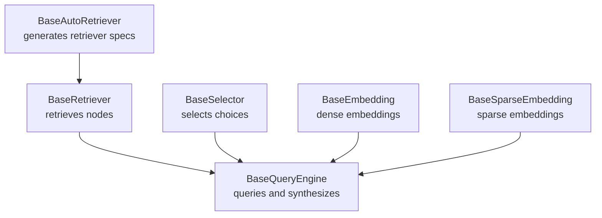
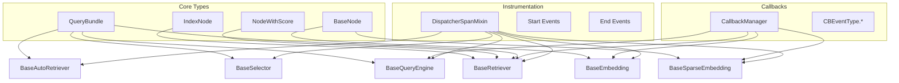
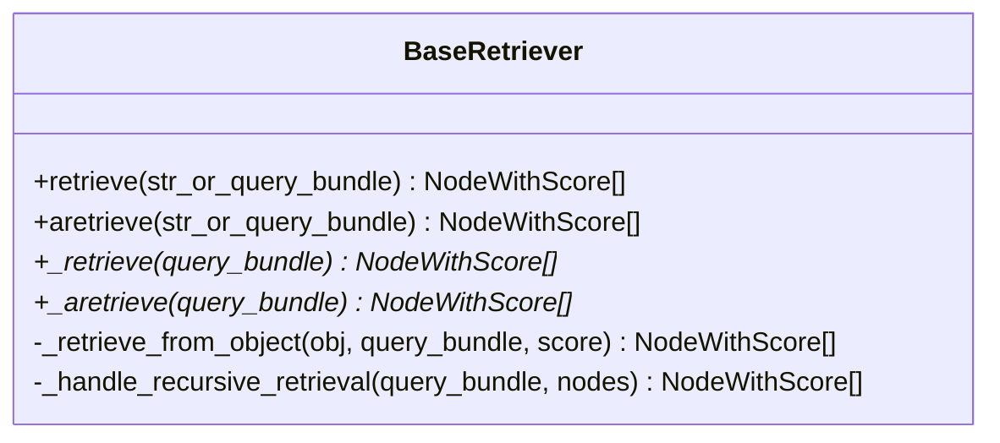
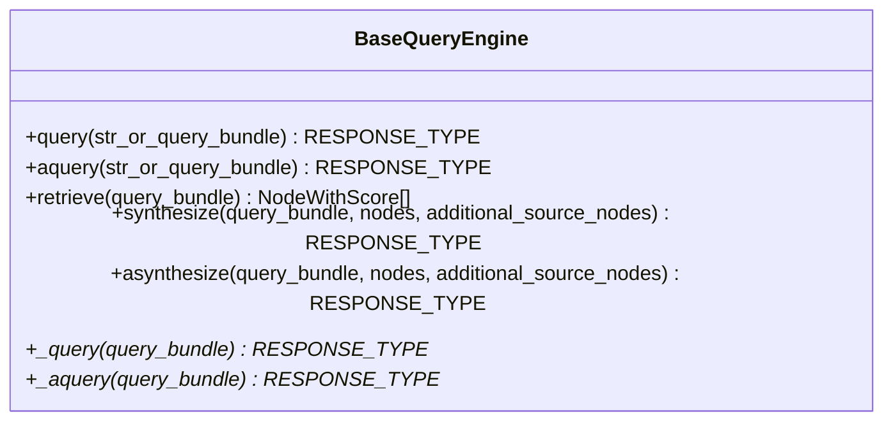
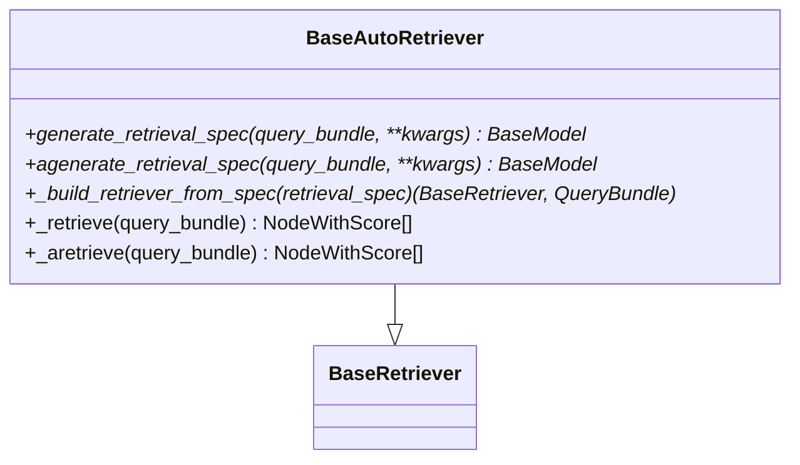
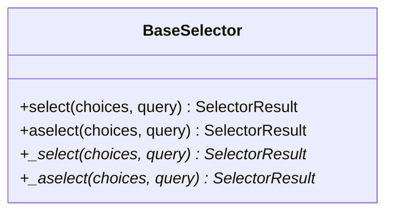
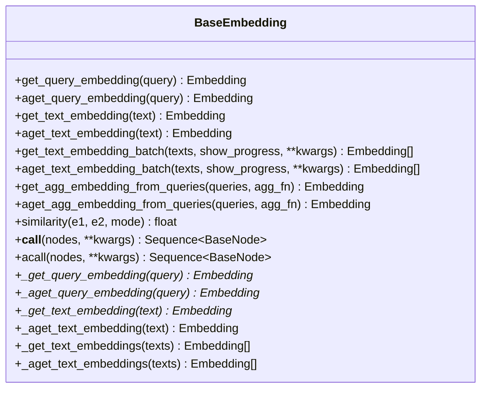
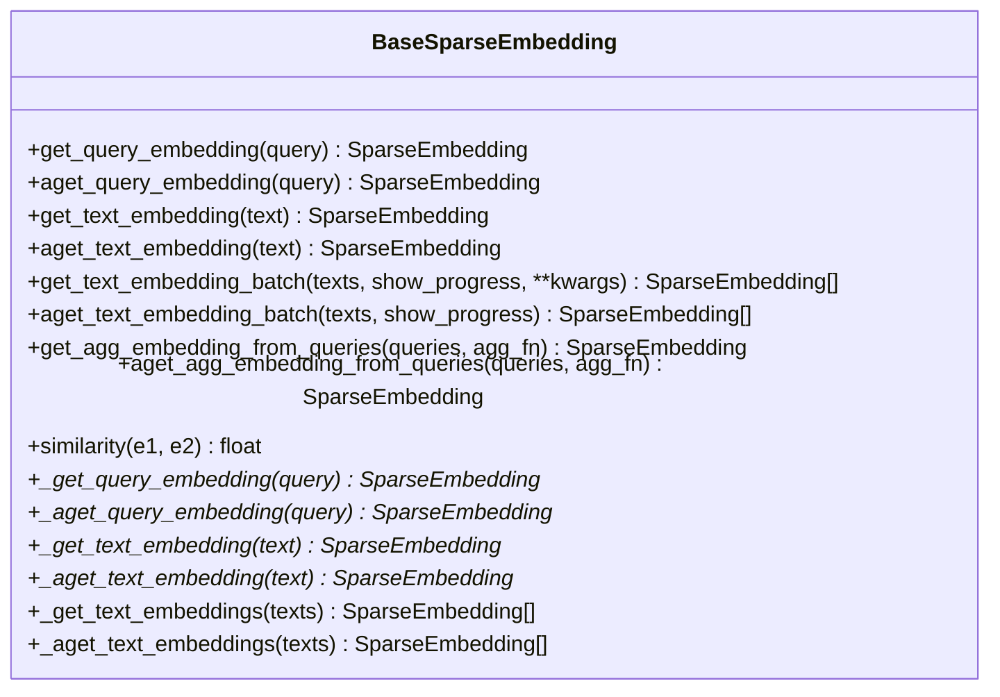
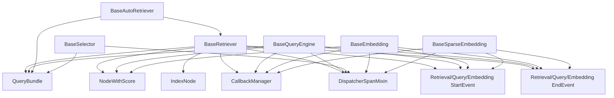

# Base Classes and Interfaces

<cite>
**Referenced Files in This Document**
- [base_retriever.py](file://llama-index-core/llama_index/core/base/base_retriever.py)
- [base_query_engine.py](file://llama-index-core/llama_index/core/base/base_query_engine.py)
- [base_auto_retriever.py](file://llama-index-core/llama_index/core/base/base_auto_retriever.py)
- [base_selector.py](file://llama-index-core/llama_index/core/base/base_selector.py)
- [base.py](file://llama-index-core/llama_index/core/base/embeddings/base.py)
- [base_sparse.py](file://llama-index-core/llama_index/core/base/embeddings/base_sparse.py)
</cite>

## Table of Contents
1. [Introduction](#introduction)
2. [Project Structure](#project-structure)
3. [Core Components](#core-components)
4. [Architecture Overview](#architecture-overview)
5. [Detailed Component Analysis](#detailed-component-analysis)
6. [Dependency Analysis](#dependency-analysis)
7. [Performance Considerations](#performance-considerations)
8. [Troubleshooting Guide](#troubleshooting-guide)
9. [Conclusion](#conclusion)

## Introduction
This document provides comprehensive API documentation for the foundational abstract base classes in LlamaIndex core. It focuses on:
- BaseRetriever: abstract interface for retrieving nodes given a query
- BaseQueryEngine: abstract interface for querying and synthesizing responses
- BaseAutoRetriever: abstract interface for generating retriever specs and dynamically building retrievers
- BaseSelector: abstract interface for selecting among choices based on a query
- BaseEmbedding and BaseSparseEmbedding: abstract interfaces for computing dense and sparse embeddings

It explains method signatures, abstract methods, implementation requirements, parameter specifications, return value expectations, callback patterns, error handling conventions, and integration points with the broader framework. Guidance is also provided on proper inheritance patterns and maintaining compatibility with framework extensions.

## Project Structure
The base classes are located under the core base module and related embedding modules. The following diagram shows the relationship between the base classes and their primary roles in the framework.

**Diagram sources**
- [base_retriever.py](file://llama-index-core/llama_index/core/base/base_retriever.py#L34-L275)
- [base_query_engine.py](file://llama-index-core/llama_index/core/base/base_query_engine.py#L22-L94)
- [base_auto_retriever.py](file://llama-index-core/llama_index/core/base/base_auto_retriever.py#L9-L44)
- [base_selector.py](file://llama-index-core/llama_index/core/base/base_selector.py#L72-L104)
- [base.py](file://llama-index-core/llama_index/core/base/embeddings/base.py#L72-L619)
- [base_sparse.py](file://llama-index-core/llama_index/core/base/embeddings/base_sparse.py#L74-L354)

**Section sources**
- [base_retriever.py](file://llama-index-core/llama_index/core/base/base_retriever.py#L1-L275)
- [base_query_engine.py](file://llama-index-core/llama_index/core/base/base_query_engine.py#L1-L94)
- [base_auto_retriever.py](file://llama-index-core/llama_index/core/base/base_auto_retriever.py#L1-L44)
- [base_selector.py](file://llama-index-core/llama_index/core/base/base_selector.py#L1-L104)
- [base.py](file://llama-index-core/llama_index/core/base/embeddings/base.py#L1-L619)
- [base_sparse.py](file://llama-index-core/llama_index/core/base/embeddings/base_sparse.py#L1-L354)

## Core Components
This section summarizes the responsibilities and key APIs of each base class.

- BaseRetriever
  - Purpose: Retrieve nodes given a query string or a structured QueryBundle. Provides synchronous and asynchronous retrieval, recursive retrieval across objects, and instrumentation via callback manager and dispatcher spans.
  - Key methods:
    - retrieve(str_or_query_bundle): List[NodeWithScore]
    - aretrieve(str_or_query_bundle): List[NodeWithScore]
    - _retrieve(query_bundle): List[NodeWithScore] (abstract)
    - _aretrieve(query_bundle): List[NodeWithScore] (abstract, default fallback provided)
  - Integration points: CallbackManager, instrumentation events, recursive retrieval across IndexNode objects and mapped objects.

- BaseQueryEngine
  - Purpose: Perform queries and optionally synthesize responses from nodes. Provides synchronous and asynchronous query and synthesis methods with instrumentation.
  - Key methods:
    - query(str_or_query_bundle): RESPONSE_TYPE
    - aquery(str_or_query_bundle): RESPONSE_TYPE
    - retrieve(query_bundle): List[NodeWithScore] (not implemented by default)
    - synthesize(...): RESPONSE_TYPE (not implemented by default)
    - asynthesize(...): RESPONSE_TYPE (not implemented by default)
    - _query(query_bundle): RESPONSE_TYPE (abstract)
    - _aquery(query_bundle): RESPONSE_TYPE (abstract)

- BaseAutoRetriever
  - Purpose: Dynamically generate a retrieval specification from a query, build a retriever from that spec, and delegate retrieval.
  - Key methods:
    - generate_retrieval_spec(query_bundle, **kwargs): BaseModel (abstract)
    - agenerate_retrieval_spec(query_bundle, **kwargs): BaseModel (abstract)
    - _build_retriever_from_spec(retrieval_spec): Tuple[BaseRetriever, QueryBundle] (abstract)
    - _retrieve(query_bundle): List[NodeWithScore] (implemented)
    - _aretrieve(query_bundle): List[NodeWithScore] (implemented)

- BaseSelector
  - Purpose: Select one or multiple choices given a query, wrapping inputs into QueryBundle and ToolMetadata.
  - Key methods:
    - select(choices, query): SelectorResult (MultiSelection)
    - aselect(choices, query): SelectorResult (MultiSelection)
    - _select(choices, query): SelectorResult (abstract)
    - _aselect(choices, query): SelectorResult (abstract)

- BaseEmbedding
  - Purpose: Compute dense embeddings for queries and texts, with optional caching, batching, and aggregation helpers. Supports synchronous and asynchronous operations.
  - Key methods:
    - get_query_embedding(query): Embedding
    - aget_query_embedding(query): Embedding
    - get_text_embedding(text): Embedding
    - aget_text_embedding(text): Embedding
    - get_text_embedding_batch(texts, show_progress, **kwargs): List[Embedding]
    - aget_text_embedding_batch(texts, show_progress, **kwargs): List[Embedding]
    - get_agg_embedding_from_queries(queries, agg_fn): Embedding
    - aget_agg_embedding_from_queries(queries, agg_fn): Embedding
    - similarity(embedding1, embedding2, mode): float
    - __call__(nodes, **kwargs): Sequence[BaseNode] (adds computed embeddings)
    - acall(nodes, **kwargs): Sequence[BaseNode] (async)
    - _get_query_embedding(query): Embedding (abstract)
    - _aget_query_embedding(query): Embedding (abstract)
    - _get_text_embedding(text): Embedding (abstract)
    - _aget_text_embedding(text): Embedding (optional override)
    - _get_text_embeddings(texts): List[Embedding] (optional override)
    - _aget_text_embeddings(texts): List[Embedding] (optional override)

- BaseSparseEmbedding
  - Purpose: Compute sparse embeddings (indexed by token ids) with similar patterns to BaseEmbedding but specialized for sparse vectors.
  - Key methods:
    - get_query_embedding(query): SparseEmbedding
    - aget_query_embedding(query): SparseEmbedding
    - get_text_embedding(text): SparseEmbedding
    - aget_text_embedding(text): SparseEmbedding
    - get_text_embedding_batch(texts, show_progress, **kwargs): List[SparseEmbedding]
    - aget_text_embedding_batch(texts, show_progress): List[SparseEmbedding]
    - get_agg_embedding_from_queries(queries, agg_fn): SparseEmbedding
    - aget_agg_embedding_from_queries(queries, agg_fn): SparseEmbedding
    - similarity(embedding1, embedding2): float
    - _get_query_embedding(query): SparseEmbedding (abstract)
    - _aget_query_embedding(query): SparseEmbedding (abstract)
    - _get_text_embedding(text): SparseEmbedding (abstract)
    - _aget_text_embedding(text): SparseEmbedding (abstract)
    - _get_text_embeddings(texts): List[SparseEmbedding] (optional override)
    - _aget_text_embeddings(texts): List[SparseEmbedding] (optional override)

**Section sources**
- [base_retriever.py](file://llama-index-core/llama_index/core/base/base_retriever.py#L34-L275)
- [base_query_engine.py](file://llama-index-core/llama_index/core/base/base_query_engine.py#L22-L94)
- [base_auto_retriever.py](file://llama-index-core/llama_index/core/base/base_auto_retriever.py#L9-L44)
- [base_selector.py](file://llama-index-core/llama_index/core/base/base_selector.py#L72-L104)
- [base.py](file://llama-index-core/llama_index/core/base/embeddings/base.py#L72-L619)
- [base_sparse.py](file://llama-index-core/llama_index/core/base/embeddings/base_sparse.py#L74-L354)

## Architecture Overview
The following diagram illustrates how the base classes integrate with instrumentation, callbacks, and the broader framework.

**Diagram sources**
- [base_retriever.py](file://llama-index-core/llama_index/core/base/base_retriever.py#L34-L275)
- [base_query_engine.py](file://llama-index-core/llama_index/core/base/base_query_engine.py#L22-L94)
- [base_auto_retriever.py](file://llama-index-core/llama_index/core/base/base_auto_retriever.py#L9-L44)
- [base_selector.py](file://llama_index-core/llama_index/core/base/base_selector.py#L72-L104)
- [base.py](file://llama-index-core/llama_index/core/base/embeddings/base.py#L72-L619)
- [base_sparse.py](file://llama-index-core/llama_index/core/base/embeddings/base_sparse.py#L74-L354)

## Detailed Component Analysis

### BaseRetriever
- Responsibilities
  - Accept a query string or QueryBundle and return a ranked list of NodeWithScore.
  - Support recursive retrieval across IndexNode objects using an internal object_map.
  - Emit instrumentation events and integrate with CallbackManager.
  - Provide both sync and async retrieval entry points.

- Method Signatures and Contracts
  - retrieve(str_or_query_bundle: QueryType) -> List[NodeWithScore]
    - Converts string to QueryBundle if needed, emits retrieval start/end events, runs _retrieve, applies deduplication, and returns results.
  - aretrieve(str_or_query_bundle: QueryType) -> List[NodeWithScore]
    - Async variant of retrieve with equivalent behavior.
  - _retrieve(query_bundle: QueryBundle) -> List[NodeWithScore] (abstract)
    - Implementations must return the actual nodes for the given query.
  - _aretrieve(query_bundle: QueryBundle) -> List[NodeWithScore] (abstract, default fallback provided)
    - Optional override for truly async implementations.

- Implementation Requirements
  - Override _retrieve to implement retrieval logic.
  - Optionally override _aretrieve for native async support.
  - Use callback_manager and dispatcher for instrumentation.
  - Respect recursive retrieval semantics for IndexNode objects.

- Example Inheritance Pattern
  - Create a subclass that implements _retrieve to fetch nodes from a vector store or index.
  - Optionally override _aretrieve for async retrieval.
  - Ensure deterministic ordering and de-duplication of results.

- Integration Points
  - CallbackManager for tracing and event emission.
  - DispatcherSpanMixin for span-based instrumentation.
  - Recursive retrieval across objects via IndexNode and object_map.

**Diagram sources**
- [base_retriever.py](file://llama-index-core/llama_index/core/base/base_retriever.py#L34-L275)

**Section sources**
- [base_retriever.py](file://llama-index-core/llama_index/core/base/base_retriever.py#L34-L275)

### BaseQueryEngine
- Responsibilities
  - Provide a unified query interface that returns a response type.
  - Optionally support retrieve and synthesize operations (not implemented by default).
  - Emit instrumentation events and integrate with CallbackManager.

- Method Signatures and Contracts
  - query(str_or_query_bundle: QueryType) -> RESPONSE_TYPE
  - aquery(str_or_query_bundle: QueryType) -> RESPONSE_TYPE
  - retrieve(query_bundle: QueryBundle) -> List[NodeWithScore] (raises NotImplementedError by default)
  - synthesize(...) -> RESPONSE_TYPE (raises NotImplementedError by default)
  - asynthesize(...) -> RESPONSE_TYPE (raises NotImplementedError by default)
  - _query(query_bundle: QueryBundle) -> RESPONSE_TYPE (abstract)
  - _aquery(query_bundle: QueryBundle) -> RESPONSE_TYPE (abstract)

- Implementation Requirements
  - Override _query and _aquery to implement the query logic.
  - If supporting retrieval or synthesis, override the respective methods.

- Example Inheritance Pattern
  - Implement _query to produce a response from a retriever and synthesizer pipeline.
  - Optionally implement retrieve and synthesize for specialized engines.

**Diagram sources**
- [base_query_engine.py](file://llama-index-core/llama_index/core/base/base_query_engine.py#L22-L94)

**Section sources**
- [base_query_engine.py](file://llama-index-core/llama_index/core/base/base_query_engine.py#L22-L94)

### BaseAutoRetriever
- Responsibilities
  - Generate a retrieval specification from a QueryBundle.
  - Build a retriever from that spec and delegate retrieval.
  - Provide both sync and async generation and retrieval.

- Method Signatures and Contracts
  - generate_retrieval_spec(query_bundle: QueryBundle, **kwargs) -> BaseModel (abstract)
  - agenerate_retrieval_spec(query_bundle: QueryBundle, **kwargs) -> BaseModel (abstract)
  - _build_retriever_from_spec(retrieval_spec: BaseModel) -> Tuple[BaseRetriever, QueryBundle] (abstract)
  - _retrieve(query_bundle: QueryBundle) -> List[NodeWithScore] (implemented)
  - _aretrieve(query_bundle: QueryBundle) -> List[NodeWithScore] (implemented)

- Implementation Requirements
  - Implement generate_retrieval_spec and _build_retriever_from_spec.
  - Ensure the returned QueryBundle is compatible with the built retriever.

- Example Inheritance Pattern
  - Use a Pydantic model to represent the retrieval spec.
  - Build a concrete BaseRetriever instance per query and reuse it.

**Diagram sources**
- [base_auto_retriever.py](file://llama-index-core/llama_index/core/base/base_auto_retriever.py#L9-L44)
- [base_retriever.py](file://llama-index-core/llama_index/core/base/base_retriever.py#L34-L275)

**Section sources**
- [base_auto_retriever.py](file://llama-index-core/llama_index/core/base/base_auto_retriever.py#L9-L44)

### BaseSelector
- Responsibilities
  - Select one or multiple choices given a query.
  - Normalize inputs to ToolMetadata and QueryBundle.
  - Provide both sync and async selection.

- Method Signatures and Contracts
  - select(choices: Sequence[MetadataType], query: QueryType) -> SelectorResult
  - aselect(choices: Sequence[MetadataType], query: QueryType) -> SelectorResult
  - _select(choices: Sequence[ToolMetadata], query: QueryBundle) -> SelectorResult (abstract)
  - _aselect(choices: Sequence[ToolMetadata], query: QueryBundle) -> SelectorResult (abstract)

- Implementation Requirements
  - Implement _select and _aselect to return a SelectorResult (MultiSelection).
  - Ensure the result exposes indices and reasons consistently.

- Example Inheritance Pattern
  - Implement LLM-based selection by prompting with choices and query.
  - Return SingleSelection entries within MultiSelection.

**Diagram sources**
- [base_selector.py](file://llama-index-core/llama_index/core/base/base_selector.py#L72-L104)

**Section sources**
- [base_selector.py](file://llama-index-core/llama_index/core/base/base_selector.py#L72-L104)

### BaseEmbedding
- Responsibilities
  - Compute dense embeddings for queries and texts.
  - Support batching, caching, aggregation, and similarity computation.
  - Integrate with instrumentation and callbacks.

- Method Signatures and Contracts
  - get_query_embedding(query: str) -> Embedding
  - aget_query_embedding(query: str) -> Embedding
  - get_text_embedding(text: str) -> Embedding
  - aget_text_embedding(text: str) -> Embedding
  - get_text_embedding_batch(texts: List[str], show_progress: bool, **kwargs) -> List[Embedding]
  - aget_text_embedding_batch(texts: List[str], show_progress: bool, **kwargs) -> List[Embedding]
  - get_agg_embedding_from_queries(queries: List[str], agg_fn) -> Embedding
  - aget_agg_embedding_from_queries(queries: List[str], agg_fn) -> Embedding
  - similarity(embedding1: Embedding, embedding2: Embedding, mode: SimilarityMode) -> float
  - __call__(nodes: Sequence[BaseNode], **kwargs) -> Sequence[BaseNode]
  - acall(nodes: Sequence[BaseNode], **kwargs) -> Sequence[BaseNode]
  - _get_query_embedding(query: str) -> Embedding (abstract)
  - _aget_query_embedding(query: str) -> Embedding (abstract)
  - _get_text_embedding(text: str) -> Embedding (abstract)
  - _aget_text_embedding(text: str) -> Embedding (optional)
  - _get_text_embeddings(texts: List[str]) -> List[Embedding] (optional)
  - _aget_text_embeddings(texts: List[str]) -> List[Embedding] (optional)

- Implementation Requirements
  - Implement the abstract embedding methods.
  - Optionally implement batch and async variants for performance.
  - Configure embed_batch_size and optional embeddings_cache for caching.

- Example Inheritance Pattern
  - Wrap an external embedding provider and implement the abstract methods.
  - Use similarity modes appropriately for downstream retrieval.

**Diagram sources**
- [base.py](file://llama-index-core/llama_index/core/base/embeddings/base.py#L72-L619)

**Section sources**
- [base.py](file://llama-index-core/llama_index/core/base/embeddings/base.py#L72-L619)

### BaseSparseEmbedding
- Responsibilities
  - Compute sparse embeddings represented as token-id to weight mappings.
  - Provide similar APIs to BaseEmbedding with sparse-specific optimizations.

- Method Signatures and Contracts
  - get_query_embedding(query: str) -> SparseEmbedding
  - aget_query_embedding(query: str) -> SparseEmbedding
  - get_text_embedding(text: str) -> SparseEmbedding
  - aget_text_embedding(text: str) -> SparseEmbedding
  - get_text_embedding_batch(texts: List[str], show_progress, **kwargs) -> List[SparseEmbedding]
  - aget_text_embedding_batch(texts: List[str], show_progress) -> List[SparseEmbedding]
  - get_agg_embedding_from_queries(queries: List[str], agg_fn) -> SparseEmbedding
  - aget_agg_embedding_from_queries(queries: List[str], agg_fn) -> SparseEmbedding
  - similarity(embedding1: SparseEmbedding, embedding2: SparseEmbedding) -> float
  - _get_query_embedding(query: str) -> SparseEmbedding (abstract)
  - _aget_query_embedding(query: str) -> SparseEmbedding (abstract)
  - _get_text_embedding(text: str) -> SparseEmbedding (abstract)
  - _aget_text_embedding(text: str) -> SparseEmbedding (abstract)
  - _get_text_embeddings(texts: List[str]) -> List[SparseEmbedding] (optional)
  - _aget_text_embeddings(texts: List[str]) -> List[SparseEmbedding] (optional)

- Implementation Requirements
  - Implement abstract methods for sparse embedding computation.
  - Use sparse_similarity for efficient similarity scoring.

- Example Inheritance Pattern
  - Implement sparse embedding providers (e.g., BM25-style or tokenizers with idf weighting).
  - Aggregate multiple sparse embeddings using mean_agg.

**Diagram sources**
- [base_sparse.py](file://llama-index-core/llama_index/core/base/embeddings/base_sparse.py#L74-L354)

**Section sources**
- [base_sparse.py](file://llama-index-core/llama_index/core/base/embeddings/base_sparse.py#L74-L354)

## Dependency Analysis
The base classes depend on shared framework components for instrumentation, callbacks, and schema types. The following diagram highlights key dependencies.

**Diagram sources**
- [base_retriever.py](file://llama-index-core/llama_index/core/base/base_retriever.py#L34-L275)
- [base_query_engine.py](file://llama-index-core/llama_index/core/base/base_query_engine.py#L22-L94)
- [base_auto_retriever.py](file://llama-index-core/llama_index/core/base/base_auto_retriever.py#L9-L44)
- [base_selector.py](file://llama-index-core/llama_index/core/base/base_selector.py#L72-L104)
- [base.py](file://llama-index-core/llama_index/core/base/embeddings/base.py#L72-L619)
- [base_sparse.py](file://llama-index-core/llama_index/core/base/embeddings/base_sparse.py#L74-L354)

**Section sources**
- [base_retriever.py](file://llama-index-core/llama_index/core/base/base_retriever.py#L34-L275)
- [base_query_engine.py](file://llama-index-core/llama_index/core/base/base_query_engine.py#L22-L94)
- [base_auto_retriever.py](file://llama-index-core/llama_index/core/base/base_auto_retriever.py#L9-L44)
- [base_selector.py](file://llama-index-core/llama_index/core/base/base_selector.py#L72-L104)
- [base.py](file://llama-index-core/llama_index/core/base/embeddings/base.py#L72-L619)
- [base_sparse.py](file://llama-index-core/llama_index/core/base/embeddings/base_sparse.py#L74-L354)

## Performance Considerations
- Batch Embeddings
  - Use get_text_embedding_batch and aget_text_embedding_batch to reduce overhead.
  - Tune embed_batch_size according to provider limits and latency targets.
- Async Execution
  - Prefer async methods (_aretrieve, aquery, aget_*_embedding*) for I/O-bound workloads.
  - Utilize num_workers for parallelism in async embedding batches.
- Caching
  - Enable embeddings_cache to avoid recomputation for repeated texts/queries.
  - Ensure cache backend implements BaseKVStore for type safety.
- Deduplication
  - BaseRetriever automatically deduplicates by node hash and ref_doc_id during recursive retrieval.
- Similarity Computation
  - Choose appropriate SimilarityMode for dense embeddings to match downstream scoring.

[No sources needed since this section provides general guidance]

## Troubleshooting Guide
- Instrumentation and Callbacks
  - Ensure callback_manager is initialized; BaseRetriever checks and defaults to Settings.callback_manager if missing.
  - Verify that instrumentation events are emitted around retrieve/query operations.
- Recursive Retrieval
  - When using IndexNode, ensure object_map is populated or objects are passed to constructor so retrieval can traverse nested components.
- NotImplementedError
  - BaseQueryEngine raises NotImplementedError for retrieve/synthesize/asynthesize if not overridden; implement these methods if needed.
- Type Validation
  - BaseEmbedding validates embeddings_cache type; ensure it is a BaseKVStore instance.
- Async Behavior
  - If _aretrieve/_aquery or _aget_*_embedding are not overridden, they fall back to sync implementations.

**Section sources**
- [base_retriever.py](file://llama-index-core/llama_index/core/base/base_retriever.py#L52-L56)
- [base_query_engine.py](file://llama-index-core/llama_index/core/base/base_query_engine.py#L62-L85)
- [base.py](file://llama-index-core/llama_index/core/base/embeddings/base.py#L100-L110)

## Conclusion
These base classes define the core extension points for retrieval, querying, selection, and embedding in LlamaIndex. By adhering to the documented method signatures, abstract contracts, and integration patterns, developers can implement robust, instrumented, and performant components that seamlessly integrate with the broader framework. Proper inheritance, method overriding, and attention to callback and instrumentation patterns are essential for compatibility and maintainability.