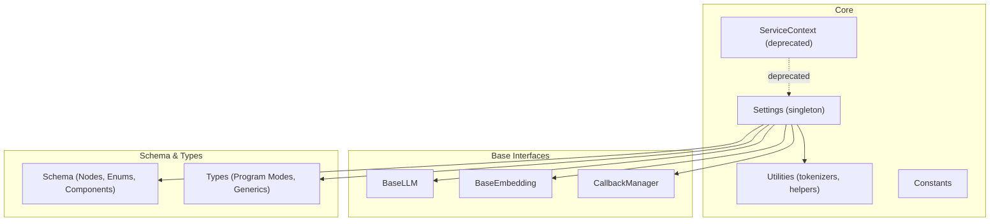
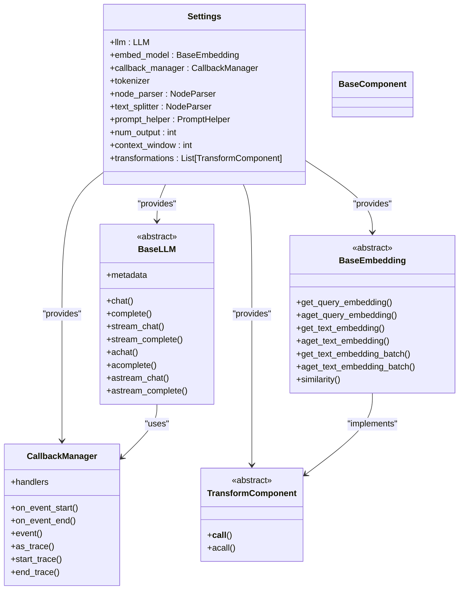
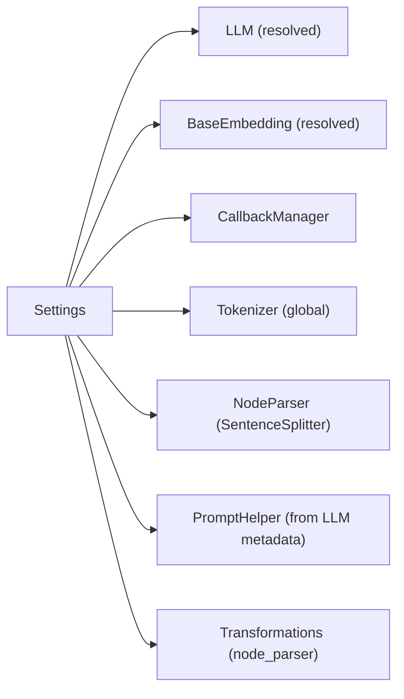

# Core API

<cite>
**Referenced Files in This Document**
- [settings.py](file://llama-index-core/llama_index/core/settings.py)
- [service_context.py](file://llama-index-core/llama_index/core/service_context.py)
- [schema.py](file://llama-index-core/llama_index/core/schema.py)
- [types.py](file://llama-index-core/llama_index/core/types.py)
- [base.py (LLM)](file://llama-index-core/llama_index/core/base/llms/base.py)
- [base.py (Embedding)](file://llama-index-core/llama_index/core/base/embeddings/base.py)
- [base.py (Callbacks)](file://llama-index-core/llama_index/core/callbacks/base.py)
- [utils.py](file://llama-index-core/llama_index/core/utils.py)
- [__init__.py](file://llama-index-core/llama_index/core/__init__.py)
- [constants.py](file://llama-index-core/llama_index/core/constants.py)
- [test_utils.py](file://llama-index-core/tests/test_utils.py)
</cite>

## Table of Contents
1. [Introduction](#introduction)
2. [Project Structure](#project-structure)
3. [Core Components](#core-components)
4. [Architecture Overview](#architecture-overview)
5. [Detailed Component Analysis](#detailed-component-analysis)
6. [Dependency Analysis](#dependency-analysis)
7. [Performance Considerations](#performance-considerations)
8. [Troubleshooting Guide](#troubleshooting-guide)
9. [Conclusion](#conclusion)
10. [Appendices](#appendices)

## Introduction
This document provides comprehensive API documentation for the LlamaIndex Core API with a focus on the central Settings system, configuration management, and global state handling. It explains how to configure LLMs, embeddings, callbacks, and related utilities globally and per-module, outlines the core schema definitions and type annotations, and describes the foundational base classes and interfaces. Practical examples demonstrate programmatic setup, configuration contexts, and access patterns for core utilities.

## Project Structure
The Core API resides under the core module and exposes:
- A singleton Settings object for global configuration
- Base classes for LLMs and embeddings
- Schema and type definitions for nodes, components, and program modes
- Callback infrastructure for tracing and instrumentation
- Utilities for tokenization and global helpers

**Diagram sources**
- [settings.py](file://llama-index-core/llama_index/core/settings.py#L17-L248)
- [service_context.py](file://llama-index-core/llama_index/core/service_context.py#L4-L49)
- [base.py (LLM)](file://llama-index-core/llama_index/core/base/llms/base.py#L25-L292)
- [base.py (Embedding)](file://llama-index-core/llama_index/core/base/embeddings/base.py#L72-L619)
- [base.py (Callbacks)](file://llama-index-core/llama_index/core/callbacks/base.py#L28-L303)
- [schema.py](file://llama-index-core/llama_index/core/schema.py#L80-L800)
- [types.py](file://llama-index-core/llama_index/core/types.py#L103-L177)
- [utils.py](file://llama-index-core/llama_index/core/utils.py#L128-L173)
- [constants.py](file://llama-index-core/llama_index/core/constants.py#L1-L37)

**Section sources**
- [settings.py](file://llama-index-core/llama_index/core/settings.py#L17-L248)
- [service_context.py](file://llama-index-core/llama_index/core/service_context.py#L4-L49)
- [__init__.py](file://llama-index-core/llama_index/core/__init__.py#L72-L162)

## Core Components
- Settings: Central singleton for global configuration of LLMs, embeddings, callbacks, tokenizer, node parser, prompt helper, and transformations.
- BaseLLM: Abstract interface for language models with synchronous, streaming, and async endpoints.
- BaseEmbedding: Abstract interface for embeddings with batch and caching support.
- CallbackManager: Event-driven tracing and instrumentation with context-aware stacks.
- Schema: BaseComponent, TransformComponent, enums (NodeRelationship, ObjectType, MetadataMode), and node types (BaseNode, Node, TextNode).
- Types: Program modes (PydanticProgramMode), output parsers, and threading helpers.
- Utilities: Global tokenizer helpers and NLTK-backed global helper.

Key responsibilities:
- Settings encapsulates lazy initialization and propagation of callback managers to configured modules.
- Base classes define contracts for pluggable integrations.
- Schema and types unify data structures and enumerations across the framework.
- Callbacks enable tracing and observability across operations.

**Section sources**
- [settings.py](file://llama-index-core/llama_index/core/settings.py#L17-L248)
- [base.py (LLM)](file://llama-index-core/llama_index/core/base/llms/base.py#L25-L292)
- [base.py (Embedding)](file://llama-index-core/llama_index/core/base/embeddings/base.py#L72-L619)
- [base.py (Callbacks)](file://llama-index-core/llama_index/core/callbacks/base.py#L28-L303)
- [schema.py](file://llama-index-core/llama_index/core/schema.py#L80-L800)
- [types.py](file://llama-index-core/llama_index/core/types.py#L103-L177)
- [utils.py](file://llama-index-core/llama_index/core/utils.py#L128-L173)

## Architecture Overview
The Settings singleton acts as the central orchestrator. It lazily resolves default modules (LLM, embeddings, node parser) and propagates a shared CallbackManager when present. It also exposes convenience properties for prompt helper tuning and transformations.

**Diagram sources**
- [settings.py](file://llama-index-core/llama_index/core/settings.py#L17-L248)
- [base.py (LLM)](file://llama-index-core/llama_index/core/base/llms/base.py#L25-L292)
- [base.py (Embedding)](file://llama-index-core/llama_index/core/base/embeddings/base.py#L72-L619)
- [base.py (Callbacks)](file://llama-index-core/llama_index/core/callbacks/base.py#L28-L303)
- [schema.py](file://llama-index-core/llama_index/core/schema.py#L190-L204)

## Detailed Component Analysis

### Settings API
The Settings singleton exposes properties and setters to configure:
- LLM: get/set via resolved LLM instances; propagates callback manager to the LLM.
- Embedding model: get/set via resolved embedding instances; propagates callback manager to the embedding.
- Callback manager: lazily created if none is set; used to propagate to LLM and embedding.
- Tokenizer: global callable; supports transformers PreTrainedTokenizerBase conversion.
- Node parser/text splitter: defaults to SentenceSplitter; supports chunk_size/chunk_overlap when available.
- Prompt helper: derived from LLM metadata when available; allows tuning num_output and context_window.
- Transformations: defaults to a list containing the node parser.

Behavior highlights:
- Lazy resolution: modules are constructed on first access.
- Callback propagation: when a callback manager is set, it is attached to LLM and embedding instances.
- Error handling: chunk_size/chunk_overlap raise ValueError if the node parser lacks these attributes.

Example usage patterns:
- Programmatic setup: assign Settings.llm, Settings.embed_model, Settings.callback_manager, Settings.tokenizer, Settings.node_parser, and tune Settings.num_output and Settings.context_window.
- Context management: pass modules directly to local APIs for isolated configuration.

**Section sources**
- [settings.py](file://llama-index-core/llama_index/core/settings.py#L17-L248)

### BaseLLM Interface
Defines the contract for language models:
- Properties and methods for chat and completion (sync, streaming, async).
- Message conversion for text-only content.
- Metadata exposure via LLMMetadata.

Usage:
- Implementations plug into Settings.llm.
- Streaming and async variants enable efficient long-form generation.

**Section sources**
- [base.py (LLM)](file://llama-index-core/llama_index/core/base/llms/base.py#L25-L292)

### BaseEmbedding Interface
Defines the contract for embeddings:
- Query and text embedding methods (sync and async).
- Batch embedding with progress and worker support.
- Similarity computation and caching via KVStore.
- TransformComponent integration to annotate nodes with embeddings.

Usage:
- Implementations plug into Settings.embed_model.
- Supports batching, caching, and async execution.

**Section sources**
- [base.py (Embedding)](file://llama-index-core/llama_index/core/base/embeddings/base.py#L72-L619)

### CallbackManager
Provides event-driven tracing:
- Manages handlers and event lifecycle.
- Maintains trace stacks and trace maps for hierarchical tracing.
- Context managers for event and trace lifecycles.
- Integrates with Settings.callback_manager.

Patterns:
- Use Settings.callback_manager to share instrumentation across modules.
- Handlers receive start/end events with payloads for observability.

**Section sources**
- [base.py (Callbacks)](file://llama-index-core/llama_index/core/callbacks/base.py#L28-L303)

### Schema and Data Types
Core schema definitions:
- BaseComponent and TransformComponent: base classes for serializable components and transform pipelines.
- Enums: NodeRelationship, ObjectType, Modality, MetadataMode.
- Nodes: BaseNode, Node, TextNode with metadata handling and hashing.
- MediaResource: unified representation for text/audio/image/video with hashing and validation.

Type annotations and generics:
- RESPONSE_TEXT_TYPE unions for response handling.
- PydanticProgramMode enumeration for structured output modes.
- Thread wrapper for context-preserving execution.

**Section sources**
- [schema.py](file://llama-index-core/llama_index/core/schema.py#L80-L800)
- [types.py](file://llama-index-core/llama_index/core/types.py#L103-L177)

### Utilities and Global State
Global tokenizer:
- get_tokenizer(): resolves a tokenizer, optionally using tiktoken.
- set_global_tokenizer(): sets a global callable or transformers tokenizer adapter.

GlobalsHelper:
- Asynchronous NLTK data loading and caching for stopwords and tokenizers.

Constants:
- Defaults for context windows, outputs, chunk sizes, overlaps, and embedding dimensions.

**Section sources**
- [utils.py](file://llama-index-core/llama_index/core/utils.py#L128-L173)
- [constants.py](file://llama-index-core/llama_index/core/constants.py#L1-L37)

### Deprecated ServiceContext
ServiceContext is deprecated in favor of Settings and local module injection. Attempting to instantiate or set a global service context raises a ValueError with migration guidance.

**Section sources**
- [service_context.py](file://llama-index-core/llama_index/core/service_context.py#L4-L49)

## Dependency Analysis
Settings depends on:
- LLM and embedding resolvers to construct default instances.
- CallbackManager for instrumentation propagation.
- Tokenizer utilities for global encoding.
- Node parser utilities for chunking configuration.
- PromptHelper construction from LLM metadata.

**Diagram sources**
- [settings.py](file://llama-index-core/llama_index/core/settings.py#L17-L248)

**Section sources**
- [settings.py](file://llama-index-core/llama_index/core/settings.py#L17-L248)

## Performance Considerations
- Embedding batching: adjust embed_batch_size to balance throughput and latency.
- Async embedding: leverage aget_text_embedding_batch with num_workers for concurrency.
- Caching: enable embeddings_cache to avoid recomputation.
- Chunk sizing: tune chunk_size and chunk_overlap for node parsers to optimize retrieval quality and cost.
- Tokenizer selection: choose an appropriate tokenizer for accurate token counting and prompt limits.

[No sources needed since this section provides general guidance]

## Troubleshooting Guide
Common issues and resolutions:
- Missing tiktoken: get_tokenizer requires tiktoken; install and ensure environment variables are set appropriately.
- NLTK downloads: GlobalsHelper handles NLTK data asynchronously; ensure network access or pre-provision caches.
- Callback handler conflicts: CallbackManager prevents duplicate handler types; ensure unique handler classes.
- Node parser attributes: chunk_size and chunk_overlap require a compatible node parser; otherwise, a ValueError is raised.
- Deprecated ServiceContext: Do not use ServiceContext; migrate to Settings or local module injection.

Validation references:
- Tokenizer behavior validated in tests.
- Retry and backoff utilities tested for sync and async functions.

**Section sources**
- [utils.py](file://llama-index-core/llama_index/core/utils.py#L128-L173)
- [test_utils.py](file://llama-index-core/tests/test_utils.py#L24-L200)
- [service_context.py](file://llama-index-core/llama_index/core/service_context.py#L4-L49)

## Conclusion
The LlamaIndex Core API centers on the Settings singleton for global configuration and state management. Its base interfaces (BaseLLM, BaseEmbedding) and schema/types unify data structures and behaviors across modules. CallbackManager enables robust observability, while utilities provide global tokenization and helper capabilities. For modern usage, prefer Settings and local module injection over the deprecated ServiceContext.

[No sources needed since this section summarizes without analyzing specific files]

## Appendices

### API Reference: Settings Methods and Properties
- llm: get/set LLM instance; propagates callback manager to LLM.
- embed_model: get/set embedding model; propagates callback manager to embedding.
- callback_manager: get/set CallbackManager; lazily created if unset.
- tokenizer: get/set global tokenizer; adapts transformers tokenizer if provided.
- node_parser/text_splitter: get/set NodeParser; defaults to SentenceSplitter.
- chunk_size/chunk_overlap: get/set node parser chunking parameters; raises ValueError if unsupported.
- prompt_helper/num_output/context_window: get/set prompt helper tuning; derived from LLM metadata when available.
- transformations: get/set list of TransformComponent; defaults to [node_parser].

Error handling patterns:
- ValueError raised when node parser lacks chunk_size or chunk_overlap.
- Migration guidance when using deprecated ServiceContext.

**Section sources**
- [settings.py](file://llama-index-core/llama_index/core/settings.py#L17-L248)

### Example Workflows

#### Programmatic Setup
- Configure LLM and embeddings via Settings.llm and Settings.embed_model.
- Attach a CallbackManager via Settings.callback_manager to enable tracing.
- Set tokenizer via Settings.tokenizer for consistent tokenization.
- Tune prompt helper via Settings.num_output and Settings.context_window.
- Define transformations via Settings.transformations.

#### Managing Configuration Contexts
- For isolated configurations, pass modules directly to local APIs rather than relying on global Settings.
- Use CallbackManager’s context managers to trace scoped operations.

#### Accessing Core Utilities
- Retrieve a tokenizer via get_tokenizer and set it globally via set_global_tokenizer.
- Leverage GlobalsHelper for NLTK-backed utilities when needed.

**Section sources**
- [settings.py](file://llama-index-core/llama_index/core/settings.py#L17-L248)
- [utils.py](file://llama-index-core/llama_index/core/utils.py#L128-L173)
- [base.py (Callbacks)](file://llama-index-core/llama_index/core/callbacks/base.py#L156-L212)