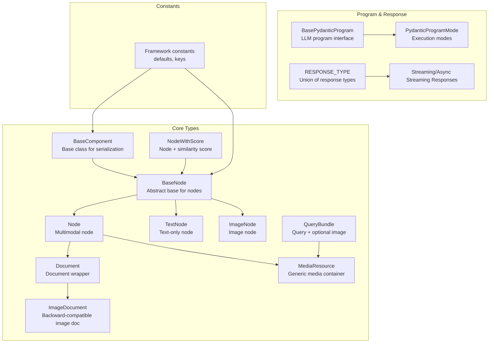
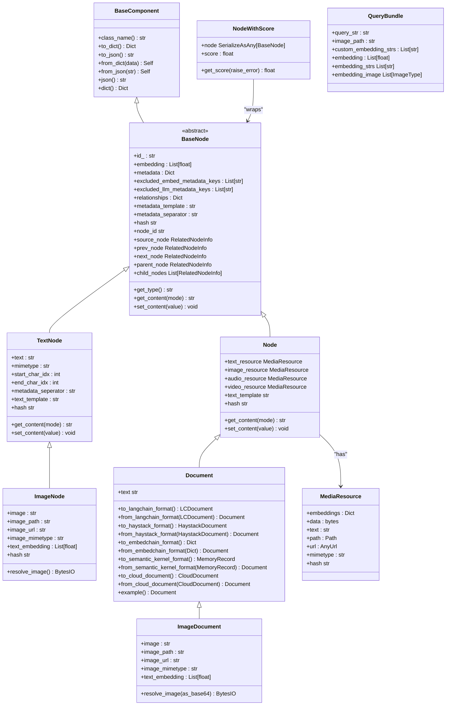
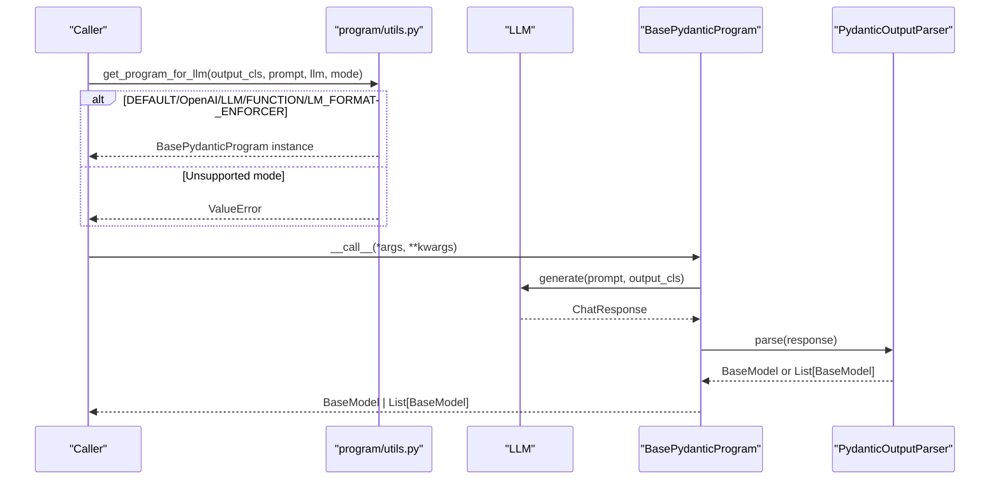
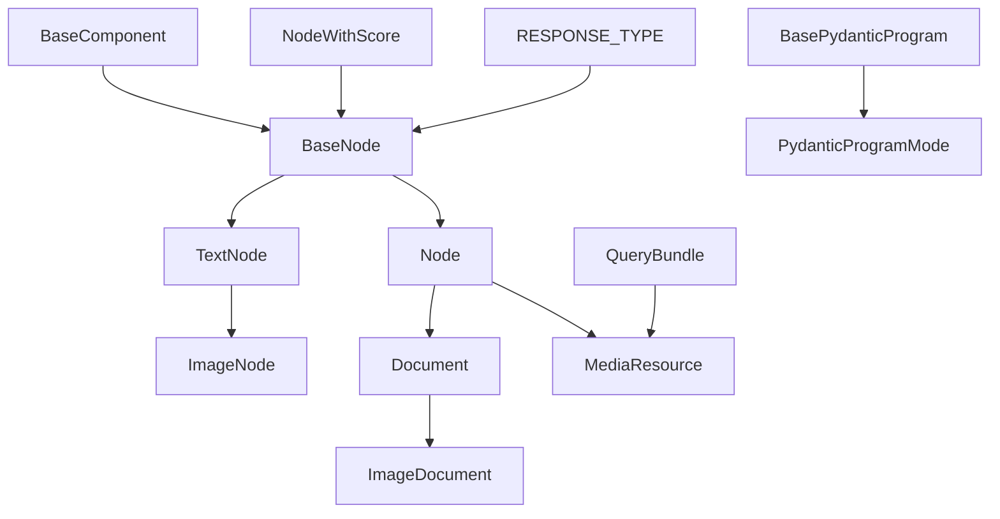

# Schema and Types

<cite>
**Referenced Files in This Document**
- [schema.py](file://llama-index-core/llama_index/core/schema.py)
- [types.py](file://llama-index-core/llama_index/core/types.py)
- [constants.py](file://llama-index-core/llama_index/core/constants.py)
- [response/schema.py](file://llama-index-core/llama_index/core/base/response/schema.py)
- [program/utils.py](file://llama-index-core/llama_index/core/program/utils.py)
- [__init__.py](file://llama-index-core/llama_index/core/program/__init__.py)
</cite>

## Table of Contents
1. [Introduction](#introduction)
2. [Project Structure](#project-structure)
3. [Core Components](#core-components)
4. [Architecture Overview](#architecture-overview)
5. [Detailed Component Analysis](#detailed-component-analysis)
6. [Dependency Analysis](#dependency-analysis)
7. [Performance Considerations](#performance-considerations)
8. [Troubleshooting Guide](#troubleshooting-guide)
9. [Conclusion](#conclusion)
10. [Appendices](#appendices)

## Introduction
This document provides comprehensive API documentation for LlamaIndex core schema definitions and type system. It focuses on fundamental data structures such as Document, Node, BaseNode, ImageDocument, and related types, along with the type system for LLM programs, response types, and component interfaces. It also covers constants, serialization formats, validation rules, and type conversion utilities. The goal is to help developers understand the core types, their relationships, and how to extend and use them effectively.

## Project Structure
The core schema and type system resides primarily under the core module:
- Schema definitions and node/document types: [schema.py](file://llama-index-core/llama_index/core/schema.py)
- Program interfaces and response types: [types.py](file://llama-index-core/llama_index/core/types.py), [response/schema.py](file://llama-index-core/llama_index/core/base/response/schema.py), [program/utils.py](file://llama-index-core/llama_index/core/program/utils.py)
- Framework-wide constants: [constants.py](file://llama-index-core/llama_index/core/constants.py)

**Diagram sources**
- [schema.py](file://llama-index-core/llama_index/core/schema.py#L80-L188)
- [schema.py](file://llama-index-core/llama_index/core/schema.py#L263-L482)
- [schema.py](file://llama-index-core/llama_index/core/schema.py#L612-L689)
- [schema.py](file://llama-index-core/llama_index/core/schema.py#L691-L798)
- [schema.py](file://llama-index-core/llama_index/core/schema.py#L800-L870)
- [schema.py](file://llama-index-core/llama_index/core/schema.py#L1012-L1221)
- [schema.py](file://llama-index-core/llama_index/core/schema.py#L1245-L1361)
- [schema.py](file://llama-index-core/llama_index/core/schema.py#L1363-L1408)
- [types.py](file://llama-index-core/llama_index/core/types.py#L103-L135)
- [types.py](file://llama-index-core/llama_index/core/types.py#L137-L146)
- [response/schema.py](file://llama-index-core/llama_index/core/base/response/schema.py#L14-L242)
- [program/utils.py](file://llama-index-core/llama_index/core/program/utils.py#L58-L136)
- [constants.py](file://llama-index-core/llama_index/core/constants.py#L1-L37)

**Section sources**
- [schema.py](file://llama-index-core/llama_index/core/schema.py#L1-L1408)
- [types.py](file://llama-index-core/llama_index/core/types.py#L1-L177)
- [response/schema.py](file://llama-index-core/llama_index/core/base/response/schema.py#L1-L242)
- [program/utils.py](file://llama-index-core/llama_index/core/program/utils.py#L1-L296)
- [constants.py](file://llama-index-core/llama_index/core/constants.py#L1-L37)

## Core Components
This section outlines the primary types and their roles in the schema and type system.

- BaseComponent
  - Purpose: Provides serialization hooks and helpers for robust serialization/deserialization across components.
  - Key capabilities: JSON/model dump wrappers, class name injection, pickle-safe state handling, from_dict/from_json helpers.
  - Typical usage: All core components inherit from this to ensure consistent serialization behavior.

- BaseNode
  - Purpose: Abstract base for all node types. Defines shared fields and behaviors for content retrieval, metadata handling, relationships, and hashing.
  - Key fields: id_, embedding, metadata, excluded embed/llm metadata keys, relationships, templates, separators.
  - Key methods: get_content, set_content, get_metadata_str, hash property, relationship helpers (source, prev, next, parent, children).

- Node
  - Purpose: Multimodal node supporting text, image, audio, video resources via MediaResource.
  - Key fields: text_resource, image_resource, audio_resource, video_resource, text_template.
  - Key methods: get_content, set_content, hash computation combining metadata and resource hashes.

- TextNode
  - Purpose: Text-only node with backward compatibility support for legacy fields.
  - Key fields: text, mimetype, start/end char indices, metadata separator, text_template.
  - Key methods: get_content, set_content, hash computation.

- ImageNode
  - Purpose: Node specialized for images with convenience accessors for image data, path, URL, and mimetype.
  - Key fields: image, image_path, image_url, image_mimetype, text_embedding.
  - Key methods: resolve_image, hash computation.

- Document
  - Purpose: Document wrapper around Node, with backward compatibility for legacy fields (doc_id, extra_info, text).
  - Key methods: conversions to/from external formats (LangChain, Haystack, EmbedChain, Semantic Kernel, LlamaCloud), example factory, serialization customization.

- ImageDocument
  - Purpose: Backward-compatible wrapper around Document for images, validating and normalizing image inputs.
  - Key properties: image, image_path, image_url, image_mimetype, text_embedding, resolve_image.

- MediaResource
  - Purpose: Generic container for media content supporting raw bytes, filesystem path, URL, and text/mimetype inference.
  - Key validations: data encoding normalization, mimetype inference, hash generation.

- NodeWithScore
  - Purpose: Wrapper for BaseNode with an associated similarity score, delegating most node operations.

- QueryBundle
  - Purpose: Encapsulates a query string and optional image path/embedding strings for retrieval and similarity tasks.

- Enums and Constants
  - NodeRelationship: SOURCE, PREVIOUS, NEXT, PARENT, CHILD
  - ObjectType: TEXT, IMAGE, INDEX, DOCUMENT, MULTIMODAL
  - Modality: TEXT, IMAGE, AUDIO, VIDEO
  - MetadataMode: ALL, EMBED, LLM, NONE
  - Program modes: PydanticProgramMode (DEFAULT, OPENAI, LLM, FUNCTION, GUIDANCE, LM_FORMAT_ENFORCER)
  - Framework constants: defaults for temperature, context windows, chunk sizes, similarity top-k, embedding dimensions, and store keys.

**Section sources**
- [schema.py](file://llama-index-core/llama_index/core/schema.py#L80-L188)
- [schema.py](file://llama-index-core/llama_index/core/schema.py#L263-L482)
- [schema.py](file://llama-index-core/llama_index/core/schema.py#L612-L689)
- [schema.py](file://llama-index-core/llama_index/core/schema.py#L691-L798)
- [schema.py](file://llama-index-core/llama_index/core/schema.py#L800-L870)
- [schema.py](file://llama-index-core/llama_index/core/schema.py#L1012-L1221)
- [schema.py](file://llama-index-core/llama_index/core/schema.py#L1245-L1361)
- [schema.py](file://llama-index-core/llama_index/core/schema.py#L1363-L1408)
- [types.py](file://llama-index-core/llama_index/core/types.py#L137-L146)
- [constants.py](file://llama-index-core/llama_index/core/constants.py#L1-L37)

## Architecture Overview
The schema and type system centers around BaseComponent and BaseNode, with concrete implementations for text, images, multimodal nodes, and documents. Programs and responses integrate with these types to orchestrate LLM-driven workflows.

**Diagram sources**
- [schema.py](file://llama-index-core/llama_index/core/schema.py#L80-L188)
- [schema.py](file://llama-index-core/llama_index/core/schema.py#L263-L482)
- [schema.py](file://llama-index-core/llama_index/core/schema.py#L612-L689)
- [schema.py](file://llama-index-core/llama_index/core/schema.py#L691-L798)
- [schema.py](file://llama-index-core/llama_index/core/schema.py#L800-L870)
- [schema.py](file://llama-index-core/llama_index/core/schema.py#L1012-L1221)
- [schema.py](file://llama-index-core/llama_index/core/schema.py#L1245-L1361)
- [schema.py](file://llama-index-core/llama_index/core/schema.py#L1363-L1408)

## Detailed Component Analysis

### BaseComponent and Serialization
- Responsibilities: Ensures consistent serialization/deserialization across components, injects class names into JSON schema, and provides model dump/JSON helpers.
- Serialization hooks: Custom model serializer adds class_name; from_dict/from_json strip class_name and construct instances.
- Pickle safety: __getstate__/__setstate__ handle unpickleable attributes gracefully.

Usage patterns:
- Extend BaseComponent for any serializable component.
- Use to_dict/to_json for persistence and transport.
- Use from_dict/from_json for reconstruction.

**Section sources**
- [schema.py](file://llama-index-core/llama_index/core/schema.py#L80-L188)

### BaseNode and Node Relationships
- Responsibilities: Defines the contract for retrievable nodes, including content retrieval, metadata formatting, and relationships to other nodes.
- Relationships: SOURCE, PREVIOUS, NEXT, PARENT, CHILD; helpers expose typed accessors.
- Metadata modes: ALL, EMBED, LLM, NONE control inclusion of metadata in content rendering.

Key behaviors:
- get_content respects MetadataMode and templates.
- get_metadata_str filters metadata based on mode and excluded keys.
- hash computation aggregates node-specific identifiers.

**Section sources**
- [schema.py](file://llama-index-core/llama_index/core/schema.py#L263-L482)

### Node (Multimodal)
- Responsibilities: Extends BaseNode to support multiple modalities via MediaResource.
- Content composition: Uses text_template to combine text_resource and metadata.
- Hash: Combines metadata and hashes of available resources.

**Section sources**
- [schema.py](file://llama-index-core/llama_index/core/schema.py#L612-L689)

### TextNode
- Responsibilities: Text-only specialization with backward compatibility for legacy fields.
- Compatibility: Normalizes constructor inputs and exposes node_info via deprecated property.

**Section sources**
- [schema.py](file://llama-index-core/llama_index/core/schema.py#L691-L798)

### ImageNode
- Responsibilities: Image-focused node with convenience accessors for image data, path, URL, and mimetype.
- Resolution: resolve_image supports base64, path, and URL sources.

**Section sources**
- [schema.py](file://llama-index-core/llama_index/core/schema.py#L800-L870)

### Document and ImageDocument
- Document:
  - Backward compatibility: Handles doc_id, extra_info, and text fields.
  - Conversions: to/from external formats (LangChain, Haystack, EmbedChain, Semantic Kernel, LlamaCloud).
  - Example factory: example returns a sample Document.
- ImageDocument:
  - Validation: Validates image path/url accessibility and normalizes image inputs.
  - Properties: Provide typed access to image and text embedding.

**Section sources**
- [schema.py](file://llama-index-core/llama_index/core/schema.py#L1012-L1221)
- [schema.py](file://llama-index-core/llama_index/core/schema.py#L1245-L1361)

### MediaResource
- Responsibilities: Generic media container supporting raw bytes, path, URL, and text/mimetype inference.
- Validation: Ensures data is base64-encoded, infers mimetype from data/path, and serializes path to string.
- Hash: Deterministic hash based on available content.

**Section sources**
- [schema.py](file://llama-index-core/llama_index/core/schema.py#L487-L610)

### NodeWithScore
- Responsibilities: Wraps a BaseNode with a similarity score and delegates most operations to the underlying node.
- Accessors: Exposes node_id, id_, text, metadata, embedding, and content retrieval methods.

**Section sources**
- [schema.py](file://llama-index-core/llama_index/core/schema.py#L950-L1008)

### QueryBundle
- Responsibilities: Encapsulates a query string and optional image path/embedding strings.
- Helpers: embedding_strs and embedding_image compute derived values for similarity tasks.

**Section sources**
- [schema.py](file://llama-index-core/llama_index/core/schema.py#L1363-L1408)

### LLM Program Interfaces and Response Types
- BasePydanticProgram:
  - Abstract interface for LLM-powered functions returning Pydantic models.
  - Methods: __call__, acall, stream_call, astream_call (defaults raise NotSupported).
- PydanticProgramMode:
  - Modes for program execution: DEFAULT, OPENAI, LLM, FUNCTION, GUIDANCE, LM_FORMAT_ENFORCER.
- Program utilities:
  - get_program_for_llm selects appropriate program based on LLM metadata and mode.
  - process_streaming_objects parses streaming responses into structured objects, with flexible mode and repair logic.
- Response types:
  - Response: Non-streaming text response with optional source nodes and metadata.
  - PydanticResponse: Non-streaming structured response with optional source nodes and metadata.
  - StreamingResponse: Streaming text response with generator and optional precomputed text.
  - AsyncStreamingResponse: Async streaming text response with async generator and optional precomputed text.
  - RESPONSE_TYPE: Union of all response types.

**Diagram sources**
- [program/utils.py](file://llama-index-core/llama_index/core/program/utils.py#L58-L136)
- [types.py](file://llama-index-core/llama_index/core/types.py#L103-L135)

**Section sources**
- [types.py](file://llama-index-core/llama_index/core/types.py#L103-L135)
- [types.py](file://llama-index-core/llama_index/core/types.py#L137-L146)
- [program/utils.py](file://llama-index-core/llama_index/core/program/utils.py#L58-L136)
- [response/schema.py](file://llama-index-core/llama_index/core/base/response/schema.py#L14-L242)

## Dependency Analysis
The core types are loosely coupled and rely on shared abstractions:
- BaseComponent provides serialization hooks used by BaseNode and other components.
- BaseNode defines the contract for nodes; Node/TextNode/ImageNode specialize it.
- Document/ImageDocument wrap Node for document-centric workflows.
- MediaResource is a shared dependency for multimodal content.
- Program utilities depend on LLM metadata and program modes to select appropriate execution strategies.
- Response types are independent data carriers used across query and retrieval flows.

**Diagram sources**
- [schema.py](file://llama-index-core/llama_index/core/schema.py#L80-L188)
- [schema.py](file://llama-index-core/llama_index/core/schema.py#L263-L482)
- [schema.py](file://llama-index-core/llama_index/core/schema.py#L612-L689)
- [schema.py](file://llama-index-core/llama_index/core/schema.py#L691-L798)
- [schema.py](file://llama-index-core/llama_index/core/schema.py#L800-L870)
- [schema.py](file://llama-index-core/llama_index/core/schema.py#L1012-L1221)
- [schema.py](file://llama-index-core/llama_index/core/schema.py#L1245-L1361)
- [schema.py](file://llama-index-core/llama_index/core/schema.py#L1363-L1408)
- [types.py](file://llama-index-core/llama_index/core/types.py#L103-L135)
- [response/schema.py](file://llama-index-core/llama_index/core/base/response/schema.py#L239-L242)

**Section sources**
- [schema.py](file://llama-index-core/llama_index/core/schema.py#L1-L1408)
- [types.py](file://llama-index-core/llama_index/core/types.py#L1-L177)
- [response/schema.py](file://llama-index-core/llama_index/core/base/response/schema.py#L1-L242)

## Performance Considerations
- Hash computation:
  - BaseNode and derived types compute deterministic hashes based on content and metadata. Prefer caching hashed values when repeatedly accessed.
- MediaResource:
  - Hashing involves cryptographic operations; cache results when reusing the same resource across nodes.
- Serialization:
  - BaseComponent’s pickle handling removes unpickleable attributes; avoid storing non-serializable references to minimize warnings and overhead.
- Streaming responses:
  - StreamingResponse and AsyncStreamingResponse accumulate tokens; precompute response_txt when needed to avoid repeated iteration.

[No sources needed since this section provides general guidance]

## Troubleshooting Guide
Common issues and resolutions:
- Unpickleable attributes:
  - Symptom: Warnings during pickle/unpickle.
  - Resolution: Store only pickle-safe types; BaseComponent handles removal of unpickleable attributes automatically.
- Missing or invalid image:
  - Symptom: resolve_image raises ValueError.
  - Resolution: Ensure image, image_path, or image_url is set; validate image_path accessibility and image_url reachability.
- Serialization mismatch:
  - Symptom: from_dict fails or produces unexpected types.
  - Resolution: Ensure class_name is preserved or omitted when reconstructing; use from_dict/from_json consistently.
- Streaming parsing failures:
  - Symptom: process_streaming_objects returns blank or partial objects.
  - Resolution: Enable flexible_mode; ensure tool_calls extraction is supported by the LLM; validate JSON repair logic.

**Section sources**
- [schema.py](file://llama-index-core/llama_index/core/schema.py#L123-L153)
- [schema.py](file://llama-index-core/llama_index/core/schema.py#L843-L859)
- [program/utils.py](file://llama-index-core/llama_index/core/program/utils.py#L165-L263)

## Conclusion
The LlamaIndex core schema and type system provides a robust foundation for building multimodal, document-centric applications. BaseComponent and BaseNode define consistent serialization and node contracts, while Node, TextNode, ImageNode, Document, and ImageDocument offer specialized behaviors for diverse content types. The program and response type systems integrate seamlessly with these core types to support structured LLM workflows and streaming responses. Constants centralize framework-wide defaults and keys, ensuring consistency across components.

[No sources needed since this section summarizes without analyzing specific files]

## Appendices

### Type Annotations and Interfaces Summary
- BaseNode.get_content(metadata_mode: MetadataMode) -> str
- BaseNode.set_content(value: Any) -> None
- BaseNode.hash property -> str
- Node.get_content(metadata_mode: MetadataMode = MetadataMode.NONE) -> str
- TextNode.get_content(metadata_mode: MetadataMode = MetadataMode.NONE) -> str
- ImageNode.resolve_image() -> BytesIO
- Document.to_langchain_format() -> LCDocument
- Document.to_haystack_format() -> HaystackDocument
- Document.to_embedchain_format() -> Dict[str, Any]
- Document.to_semantic_kernel_format() -> MemoryRecord
- Document.to_cloud_document() -> CloudDocument
- ImageDocument.resolve_image(as_base64: bool = False) -> BytesIO
- QueryBundle.embedding_strs property -> List[str]
- QueryBundle.embedding_image property -> List[ImageType]

**Section sources**
- [schema.py](file://llama-index-core/llama_index/core/schema.py#L326-L356)
- [schema.py](file://llama-index-core/llama_index/core/schema.py#L642-L666)
- [schema.py](file://llama-index-core/llama_index/core/schema.py#L745-L781)
- [schema.py](file://llama-index-core/llama_index/core/schema.py#L843-L859)
- [schema.py](file://llama-index-core/llama_index/core/schema.py#L1107-L1122)
- [schema.py](file://llama-index-core/llama_index/core/schema.py#L1123-L1137)
- [schema.py](file://llama-index-core/llama_index/core/schema.py#L1138-L1153)
- [schema.py](file://llama-index-core/llama_index/core/schema.py#L1154-L1175)
- [schema.py](file://llama-index-core/llama_index/core/schema.py#L1197-L1221)
- [schema.py](file://llama-index-core/llama_index/core/schema.py#L1385-L1401)

### Extending Core Types
- To add a new node type:
  - Subclass BaseNode and implement get_type, get_content, set_content, and hash.
  - Use BaseComponent for serialization hooks.
- To add a new document wrapper:
  - Subclass Node or Document and implement conversions to/from external formats.
  - Preserve backward compatibility for legacy fields.
- To extend program interfaces:
  - Implement BasePydanticProgram or use get_program_for_llm to select an appropriate program mode.

**Section sources**
- [schema.py](file://llama-index-core/llama_index/core/schema.py#L263-L329)
- [schema.py](file://llama-index-core/llama_index/core/schema.py#L1012-L1070)
- [types.py](file://llama-index-core/llama_index/core/types.py#L103-L135)
- [program/utils.py](file://llama-index-core/llama_index/core/program/utils.py#L58-L136)