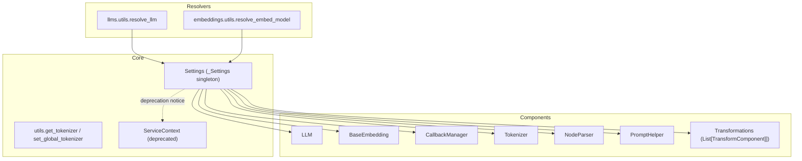
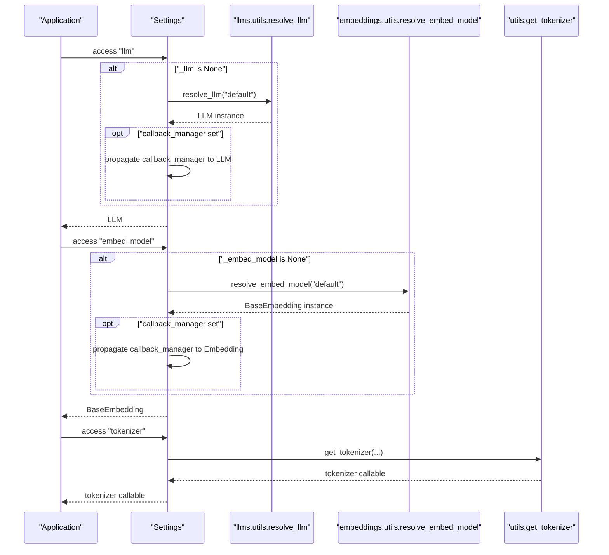
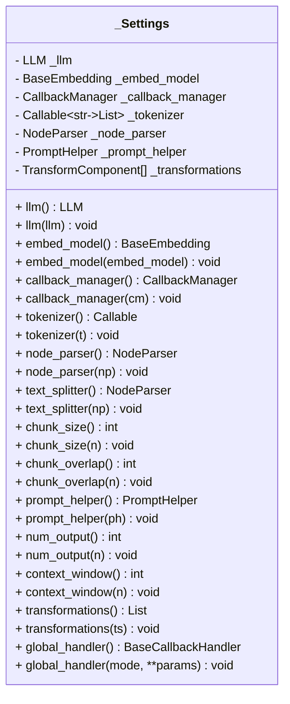
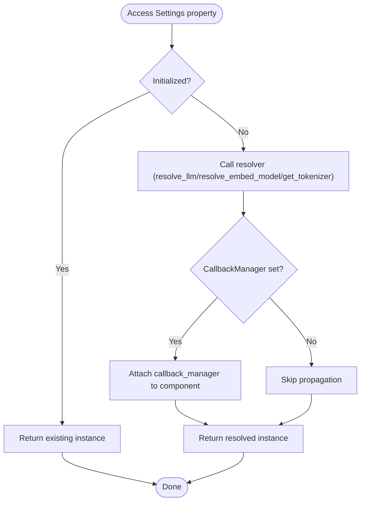
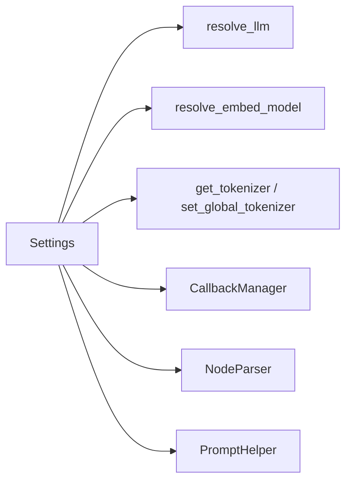

# Settings and Configuration

<cite>
**Referenced Files in This Document**
- [settings.py](file://llama-index-core/llama_index/core/settings.py)
- [service_context.py](file://llama-index-core/llama_index/core/service_context.py)
- [utils.py](file://llama-index-core/llama_index/core/utils.py)
- [llms_utils.py](file://llama-index-core/llama_index/core/llms/utils.py)
- [embeddings_utils.py](file://llama-index-core/llama_index/core/embeddings/utils.py)
- [__init__.py](file://llama-index-core/llama_index/core/__init__.py)
- [app.py](file://examples/fastapi_rag_ollama/app.py)
</cite>

## Table of Contents
1. [Introduction](#introduction)
2. [Project Structure](#project-structure)
3. [Core Components](#core-components)
4. [Architecture Overview](#architecture-overview)
5. [Detailed Component Analysis](#detailed-component-analysis)
6. [Dependency Analysis](#dependency-analysis)
7. [Performance Considerations](#performance-considerations)
8. [Troubleshooting Guide](#troubleshooting-guide)
9. [Conclusion](#conclusion)
10. [Appendices](#appendices)

## Introduction
This document provides comprehensive API documentation for the LlamaIndex Settings system, focusing on centralized configuration via the Settings singleton. It explains how Settings lazily initializes core components (LLM, embeddings, callback manager, tokenizer, node parser, prompt helper, and transformations), how to override defaults programmatically and via environment variables, and how Settings relates to ServiceContext. It also covers configuration precedence, parameter specifications, type hints, error handling patterns, and best practices for production deployments.

## Project Structure
The Settings system lives in the core module and integrates with several subsystems:
- Centralized configuration: Settings singleton
- Lazy resolution of LLM and embeddings
- Global tokenizer and callback manager
- Prompt helper and node parser integration
- Deprecation of ServiceContext in favor of Settings

**Diagram sources**
- [settings.py](file://llama-index-core/llama_index/core/settings.py#L17-L249)
- [utils.py](file://llama-index-core/llama_index/core/utils.py#L128-L173)
- [llms_utils.py](file://llama-index-core/llama_index/core/llms/utils.py#L15-L110)
- [embeddings_utils.py](file://llama-index-core/llama_index/core/embeddings/utils.py#L31-L140)
- [service_context.py](file://llama-index-core/llama_index/core/service_context.py#L4-L49)

**Section sources**
- [settings.py](file://llama-index-core/llama_index/core/settings.py#L17-L249)
- [service_context.py](file://llama-index-core/llama_index/core/service_context.py#L4-L49)
- [utils.py](file://llama-index-core/llama_index/core/utils.py#L128-L173)
- [llms_utils.py](file://llama-index-core/llama_index/core/llms/utils.py#L15-L110)
- [embeddings_utils.py](file://llama-index-core/llama_index/core/embeddings/utils.py#L31-L140)
- [__init__.py](file://llama-index-core/llama_index/core/__init__.py#L77-L162)

## Core Components
- Settings singleton: Provides lazy-initialized properties for LLM, embed_model, callback_manager, tokenizer, node_parser, prompt_helper, transformations, and convenience aliases (e.g., text_splitter). It ensures callback_manager is propagated to components when available.
- Resolvers: resolve_llm and resolve_embed_model encapsulate environment-driven defaults and error handling, integrating with Settings for callback propagation.
- Global tokenizer utilities: get_tokenizer and set_global_tokenizer manage a global tokenizer registry and fallback to tiktoken when available.
- ServiceContext deprecation: ServiceContext is deprecated and raises errors on instantiation or default construction.

Key responsibilities:
- Centralize configuration for LLM, embeddings, parsing, prompting, and tokenization.
- Enforce lazy initialization to avoid unnecessary imports or resource usage.
- Provide clear precedence: explicit setters override resolvers; resolvers fall back to environment variables and defaults.

**Section sources**
- [settings.py](file://llama-index-core/llama_index/core/settings.py#L17-L249)
- [llms_utils.py](file://llama-index-core/llama_index/core/llms/utils.py#L15-L110)
- [embeddings_utils.py](file://llama-index-core/llama_index/core/embeddings/utils.py#L31-L140)
- [utils.py](file://llama-index-core/llama_index/core/utils.py#L128-L173)
- [service_context.py](file://llama-index-core/llama_index/core/service_context.py#L4-L49)

## Architecture Overview
The Settings singleton acts as a central hub. When a property is accessed:
- If uninitialized, it resolves a default via resolvers (e.g., resolve_llm, resolve_embed_model).
- If a global callback_manager is configured, it is attached to the resolved component.
- Tokenizer resolution consults a global registry and falls back to tiktoken.

**Diagram sources**
- [settings.py](file://llama-index-core/llama_index/core/settings.py#L32-L47)
- [settings.py](file://llama-index-core/llama_index/core/settings.py#L60-L74)
- [settings.py](file://llama-index-core/llama_index/core/settings.py#L108-L117)
- [llms_utils.py](file://llama-index-core/llama_index/core/llms/utils.py#L15-L110)
- [embeddings_utils.py](file://llama-index-core/llama_index/core/embeddings/utils.py#L31-L140)
- [utils.py](file://llama-index-core/llama_index/core/utils.py#L143-L172)

## Detailed Component Analysis

### Settings Singleton
The Settings singleton exposes typed properties with lazy initialization and optional callback propagation. It stores internal fields for each component and provides setters to override defaults.

- LLM
  - Getter: lazily resolves default via resolve_llm("default"); propagates callback_manager if set.
  - Setter: accepts LLMType and resolves via resolve_llm.
  - Related property: pydantic_program_mode mirrors/updates underlying LLM’s mode.

- Embedding Model
  - Getter: lazily resolves default via resolve_embed_model("default"); propagates callback_manager if set.
  - Setter: accepts EmbedType and resolves via resolve_embed_model.

- Callback Manager
  - Getter: lazily creates a default CallbackManager if none is set.
  - Setter: assigns a provided CallbackManager.

- Tokenizer
  - Getter: returns a global tokenizer if set; otherwise resolves via get_tokenizer.
  - Setter: accepts either a callable or a transformers tokenizer and sets globally.

- Node Parser and Text Splitter
  - Getter: defaults to SentenceSplitter if unset; propagates callback_manager if set.
  - Setters: accept a NodeParser instance; text_splitter is an alias to node_parser.

- Chunk Size and Overlap
  - Properties delegate to node_parser if supported; otherwise raise an error.

- Prompt Helper
  - Getter: constructs from LLM metadata if available; otherwise uses a default PromptHelper.
  - Setters: assign a provided PromptHelper.
  - Convenience properties: num_output and context_window delegate to prompt_helper.

- Transformations
  - Getter: defaults to a list containing node_parser; supports custom lists.
  - Setter: replaces the transformations list.

- Global Handler (Deprecated)
  - Properties remain for backward compatibility but are marked deprecated.

**Diagram sources**
- [settings.py](file://llama-index-core/llama_index/core/settings.py#L17-L249)

**Section sources**
- [settings.py](file://llama-index-core/llama_index/core/settings.py#L17-L249)

### Lazy Initialization Pattern
- LLM and Embedding: On first access, resolve_llm and resolve_embed_model are called with "default". These resolvers:
  - Respect environment variables (e.g., IS_TESTING) to choose lightweight mocks.
  - Attempt to load popular providers (OpenAI, HuggingFace, CLIP) and propagate callback_manager from Settings.
  - Raise informative ImportError or ValueError messages when required packages are missing or credentials are invalid.
- Node Parser: Defaults to SentenceSplitter if unset.
- Prompt Helper: Constructed from LLM metadata if available; otherwise default constructor.
- Callback Manager: Lazily created if not explicitly set.
- Tokenizer: Uses a global registry; if unset, resolves via get_tokenizer and caches the result.

**Diagram sources**
- [settings.py](file://llama-index-core/llama_index/core/settings.py#L32-L47)
- [settings.py](file://llama-index-core/llama_index/core/settings.py#L60-L74)
- [settings.py](file://llama-index-core/llama_index/core/settings.py#L95-L99)
- [settings.py](file://llama-index-core/llama_index/core/settings.py#L108-L117)
- [llms_utils.py](file://llama-index-core/llama_index/core/llms/utils.py#L15-L110)
- [embeddings_utils.py](file://llama-index-core/llama_index/core/embeddings/utils.py#L31-L140)
- [utils.py](file://llama-index-core/llama_index/core/utils.py#L143-L172)

**Section sources**
- [settings.py](file://llama-index-core/llama_index/core/settings.py#L17-L249)
- [llms_utils.py](file://llama-index-core/llama_index/core/llms/utils.py#L15-L110)
- [embeddings_utils.py](file://llama-index-core/llama_index/core/embeddings/utils.py#L31-L140)
- [utils.py](file://llama-index-core/llama_index/core/utils.py#L128-L173)

### Programmatic Configuration Examples
- Set LLM explicitly:
  - Assign an LLM instance or LLMType to Settings.llm.
- Set Embedding explicitly:
  - Assign an EmbedType to Settings.embed_model.
- Configure Callback Manager:
  - Assign a CallbackManager to Settings.callback_manager.
- Override Tokenizer:
  - Assign a callable or transformers tokenizer to Settings.tokenizer.
- Customize Node Parser:
  - Assign a NodeParser to Settings.node_parser; adjust chunk_size and chunk_overlap if supported.
- Adjust Prompt Helper:
  - Assign a PromptHelper to Settings.prompt_helper; or set num_output and context_window.
- Define Transformations:
  - Assign a list of TransformComponent to Settings.transformations.

These assignments override lazy defaults and are effective immediately for subsequent accesses.

**Section sources**
- [settings.py](file://llama-index-core/llama_index/core/settings.py#L32-L47)
- [settings.py](file://llama-index-core/llama_index/core/settings.py#L60-L74)
- [settings.py](file://llama-index-core/llama_index/core/settings.py#L95-L104)
- [settings.py](file://llama-index-core/llama_index/core/settings.py#L108-L133)
- [settings.py](file://llama-index-core/llama_index/core/settings.py#L137-L151)
- [settings.py](file://llama-index-core/llama_index/core/settings.py#L154-L183)
- [settings.py](file://llama-index-core/llama_index/core/settings.py#L198-L230)
- [settings.py](file://llama-index-core/llama_index/core/settings.py#L234-L244)

### Environment Variable Usage
- Testing mode:
  - IS_TESTING: When true, resolve_llm and resolve_embed_model return lightweight mocks (MockLLM, MockEmbedding) and attach Settings.callback_manager.
- Provider credentials:
  - OpenAI: OPENAI_API_KEY is validated during resolution; missing or invalid keys trigger informative errors.
- Tokenizer caching:
  - TIKTOKEN_CACHE_DIR: Managed internally by get_tokenizer to cache tiktoken encodings.

Examples of environment-driven behavior are handled inside resolve_llm and resolve_embed_model.

**Section sources**
- [llms_utils.py](file://llama-index-core/llama_index/core/llms/utils.py#L26-L33)
- [llms_utils.py](file://llama-index-core/llama_index/core/llms/utils.py#L48-L57)
- [embeddings_utils.py](file://llama-index-core/llama_index/core/embeddings/utils.py#L44-L47)
- [embeddings_utils.py](file://llama-index-core/llama_index/core/embeddings/utils.py#L65-L77)
- [utils.py](file://llama-index-core/llama_index/core/utils.py#L157-L169)

### Context-Specific Settings
- Global defaults via Settings apply across the process.
- For per-operation overrides, pass explicit components to local APIs (e.g., passing a specific LLM or NodeParser to a function) rather than relying solely on Settings.
- For FastAPI or server contexts, configure Settings at startup and reuse across requests.

Example usage appears in the FastAPI RAG Ollama example, where Settings is imported and used to configure the pipeline.

**Section sources**
- [app.py](file://examples/fastapi_rag_ollama/app.py#L1-L20)

### Relationship Between Settings and ServiceContext
- ServiceContext is deprecated and raises errors on instantiation or default construction. The recommended migration is to use Settings or pass modules directly to local APIs.
- Public exports still expose ServiceContext and related helpers for backward compatibility, but they are documented as deprecated.

**Section sources**
- [service_context.py](file://llama-index-core/llama_index/core/service_context.py#L4-L49)
- [__init__.py](file://llama-index-core/llama_index/core/__init__.py#L72-L75)
- [__init__.py](file://llama-index-core/llama_index/core/__init__.py#L145-L148)

### Configuration Precedence
- Explicit setters take precedence over lazy defaults.
- Lazy defaults are resolved via resolvers:
  - resolve_llm("default") and resolve_embed_model("default") choose providers based on environment and availability.
- Callback manager propagation:
  - If a callback_manager is set on Settings, it is attached to LLM, embeddings, and node parser upon first access.
- Tokenizer:
  - Global tokenizer set via Settings.tokenizer takes effect immediately.

**Section sources**
- [settings.py](file://llama-index-core/llama_index/core/settings.py#L32-L47)
- [settings.py](file://llama-index-core/llama_index/core/settings.py#L60-L74)
- [settings.py](file://llama-index-core/llama_index/core/settings.py#L95-L99)
- [settings.py](file://llama-index-core/llama_index/core/settings.py#L108-L133)
- [llms_utils.py](file://llama-index-core/llama_index/core/llms/utils.py#L106-L108)
- [embeddings_utils.py](file://llama-index-core/llama_index/core/embeddings/utils.py#L138-L139)

### Parameter Specifications and Type Hints
- LLM
  - Getter returns LLM; setter accepts LLMType (Union[str, LLM, BaseLanguageModel]).
- Embedding
  - Getter returns BaseEmbedding; setter accepts EmbedType (Union[BaseEmbedding, LCEmbeddings, str]).
- Callback Manager
  - Getter returns CallbackManager; setter accepts CallbackManager.
- Tokenizer
  - Getter returns Callable[[str], List[Any]]; setter accepts either a callable or a transformers tokenizer.
- Node Parser
  - Getter returns NodeParser; setter accepts NodeParser.
  - chunk_size and chunk_overlap are integers; they require the underlying node_parser to support these attributes.
- Prompt Helper
  - Getter returns PromptHelper; setter accepts PromptHelper.
  - num_output and context_window are integers.
- Transformations
  - Getter returns List[TransformComponent]; setter accepts List[TransformComponent].

**Section sources**
- [settings.py](file://llama-index-core/llama_index/core/settings.py#L12-L14)
- [settings.py](file://llama-index-core/llama_index/core/settings.py#L32-L56)
- [settings.py](file://llama-index-core/llama_index/core/settings.py#L60-L74)
- [settings.py](file://llama-index-core/llama_index/core/settings.py#L95-L104)
- [settings.py](file://llama-index-core/llama_index/core/settings.py#L108-L133)
- [settings.py](file://llama-index-core/llama_index/core/settings.py#L137-L183)
- [settings.py](file://llama-index-core/llama_index/core/settings.py#L198-L230)
- [settings.py](file://llama-index-core/llama_index/core/settings.py#L234-L244)

### Error Handling Patterns
- Missing provider packages:
  - resolve_llm and resolve_embed_model raise ImportError with guidance to install required packages.
- Invalid credentials:
  - Validation routines raise ValueError with actionable messages; recommend checking environment variables.
- Unsupported attributes:
  - Accessing chunk_size or chunk_overlap on unsupported node parsers raises ValueError.
- Deprecated APIs:
  - ServiceContext raises ValueError on instantiation or default construction.

**Section sources**
- [llms_utils.py](file://llama-index-core/llama_index/core/llms/utils.py#L44-L57)
- [llms_utils.py](file://llama-index-core/llama_index/core/llms/utils.py#L82-L85)
- [embeddings_utils.py](file://llama-index-core/llama_index/core/embeddings/utils.py#L61-L77)
- [embeddings_utils.py](file://llama-index-core/llama_index/core/embeddings/utils.py#L113-L117)
- [settings.py](file://llama-index-core/llama_index/core/settings.py#L159-L159)
- [settings.py](file://llama-index-core/llama_index/core/settings.py#L182-L183)
- [service_context.py](file://llama-index-core/llama_index/core/service_context.py#L14-L19)

## Dependency Analysis
Settings depends on:
- LLM and embedding resolvers for default creation
- Global tokenizer utilities for tokenization
- CallbackManager for instrumentation and tracing

**Diagram sources**
- [settings.py](file://llama-index-core/llama_index/core/settings.py#L17-L249)
- [llms_utils.py](file://llama-index-core/llama_index/core/llms/utils.py#L15-L110)
- [embeddings_utils.py](file://llama-index-core/llama_index/core/embeddings/utils.py#L31-L140)
- [utils.py](file://llama-index-core/llama_index/core/utils.py#L128-L173)

**Section sources**
- [settings.py](file://llama-index-core/llama_index/core/settings.py#L17-L249)
- [llms_utils.py](file://llama-index-core/llama_index/core/llms/utils.py#L15-L110)
- [embeddings_utils.py](file://llama-index-core/llama_index/core/embeddings/utils.py#L31-L140)
- [utils.py](file://llama-index-core/llama_index/core/utils.py#L128-L173)

## Performance Considerations
- Lazy initialization avoids loading heavy providers until needed.
- Reuse Settings across operations to minimize repeated resolution overhead.
- Prefer explicit component assignment for hot paths to bypass resolver checks.
- For tokenization-heavy workloads, ensure a global tokenizer is set once to avoid repeated tiktoken initialization.

[No sources needed since this section provides general guidance]

## Troubleshooting Guide
- Cannot import provider:
  - Install the required package indicated by ImportError from resolvers.
- Invalid API key:
  - Verify environment variables (e.g., OPENAI_API_KEY) and retry.
- Missing tiktoken:
  - Install tiktoken; Settings uses it internally for tokenization.
- Node parser lacks chunk_size/chunk_overlap:
  - Ensure the configured node parser supports these attributes or adjust the parser type.
- ServiceContext errors:
  - Migrate to Settings or pass components directly to APIs.

**Section sources**
- [llms_utils.py](file://llama-index-core/llama_index/core/llms/utils.py#L44-L57)
- [embeddings_utils.py](file://llama-index-core/llama_index/core/embeddings/utils.py#L61-L77)
- [utils.py](file://llama-index-core/llama_index/core/utils.py#L147-L153)
- [settings.py](file://llama-index-core/llama_index/core/settings.py#L159-L159)
- [settings.py](file://llama-index-core/llama_index/core/settings.py#L182-L183)
- [service_context.py](file://llama-index-core/llama_index/core/service_context.py#L14-L19)

## Conclusion
Settings provides a centralized, lazily initialized configuration hub for LlamaIndex. By overriding defaults via explicit setters and leveraging environment variables, applications can tailor LLMs, embeddings, tokenization, parsing, and prompting to their needs. For production, prefer explicit component assignment, ensure proper credential configuration, and migrate away from deprecated ServiceContext.

[No sources needed since this section summarizes without analyzing specific files]

## Appendices

### Best Practices for Production Deployments
- Configure Settings at application startup with explicit components for reliability.
- Use environment variables for credentials and provider selection.
- Attach a persistent CallbackManager to capture metrics and traces.
- Pin provider versions and handle ImportError gracefully in deployment environments.
- Validate provider availability early in bootstrapping.

[No sources needed since this section provides general guidance]