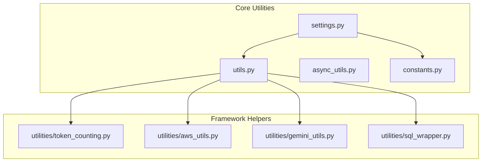
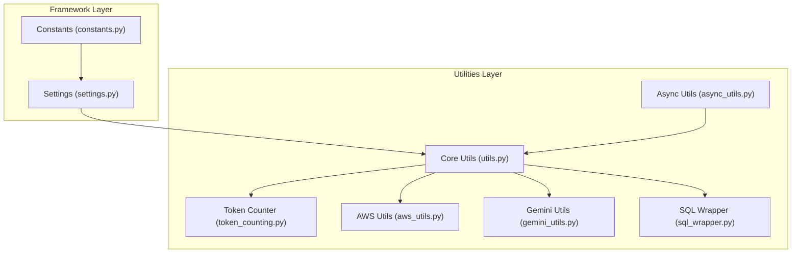
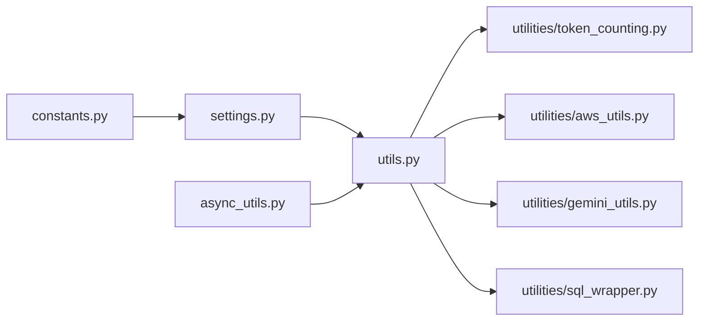

# Utilities and Helpers

<cite>
**Referenced Files in This Document**
- [utils.py](file://llama-index-core/llama_index/core/utils.py)
- [async_utils.py](file://llama-index-core/llama_index/core/async_utils.py)
- [constants.py](file://llama-index-core/llama_index/core/constants.py)
- [settings.py](file://llama-index-core/llama_index/core/settings.py)
- [token_counting.py](file://llama-index-core/llama_index/core/utilities/token_counting.py)
- [aws_utils.py](file://llama-index-core/llama_index/core/utilities/aws_utils.py)
- [gemini_utils.py](file://llama-index-core/llama_index/core/utilities/gemini_utils.py)
- [sql_wrapper.py](file://llama-index-core/llama_index/core/utilities/sql_wrapper.py)
- [test_utils.py](file://llama-index-core/tests/test_utils.py)
- [test_async_utils.py](file://llama-index-core/tests/test_async_utils.py)
</cite>

## Table of Contents
1. [Introduction](#introduction)
2. [Project Structure](#project-structure)
3. [Core Components](#core-components)
4. [Architecture Overview](#architecture-overview)
5. [Detailed Component Analysis](#detailed-component-analysis)
6. [Dependency Analysis](#dependency-analysis)
7. [Performance Considerations](#performance-considerations)
8. [Troubleshooting Guide](#troubleshooting-guide)
9. [Conclusion](#conclusion)
10. [Appendices](#appendices)

## Introduction
This document provides comprehensive API documentation for LlamaIndex utility functions and helper modules. It focuses on:
- Token counting helpers for text and chat messages
- Async utilities for concurrent operations, batching, and async/await patterns
- Environment detection and configuration defaults
- Framework-wide helper functions for caching, printing, device inference, and more
- Integration patterns and best practices for extending utility functionality

The goal is to enable developers to leverage these utilities effectively in custom implementations, optimize performance, and integrate seamlessly with core framework components.

## Project Structure
The utilities and helpers are primarily located under the core module and a dedicated utilities package:
- Core utilities: [utils.py](file://llama-index-core/llama_index/core/utils.py)
- Async utilities: [async_utils.py](file://llama-index-core/llama_index/core/async_utils.py)
- Constants and defaults: [constants.py](file://llama-index-core/llama_index/core/constants.py)
- Settings and framework-wide configuration: [settings.py](file://llama-index-core/llama_index/core/settings.py)
- Additional framework-wide helpers: [token_counting.py](file://llama-index-core/llama_index/core/utilities/token_counting.py), [aws_utils.py](file://llama-index-core/llama_index/core/utilities/aws_utils.py), [gemini_utils.py](file://llama-index-core/llama_index/core/utilities/gemini_utils.py), [sql_wrapper.py](file://llama-index-core/llama_index/core/utilities/sql_wrapper.py)
- Tests validating usage patterns: [test_utils.py](file://llama-index-core/tests/test_utils.py), [test_async_utils.py](file://llama-index-core/tests/test_async_utils.py)

**Diagram sources**
- [utils.py](file://llama-index-core/llama_index/core/utils.py#L1-L705)
- [async_utils.py](file://llama-index-core/llama_index/core/async_utils.py#L1-L175)
- [constants.py](file://llama-index-core/llama_index/core/constants.py#L1-L37)
- [settings.py](file://llama-index-core/llama_index/core/settings.py#L1-L249)
- [token_counting.py](file://llama-index-core/llama_index/core/utilities/token_counting.py#L1-L104)
- [aws_utils.py](file://llama-index-core/llama_index/core/utilities/aws_utils.py#L1-L53)
- [gemini_utils.py](file://llama-index-core/llama_index/core/utilities/gemini_utils.py#L1-L66)
- [sql_wrapper.py](file://llama-index-core/llama_index/core/utilities/sql_wrapper.py#L1-L249)

**Section sources**
- [utils.py](file://llama-index-core/llama_index/core/utils.py#L1-L705)
- [async_utils.py](file://llama-index-core/llama_index/core/async_utils.py#L1-L175)
- [constants.py](file://llama-index-core/llama_index/core/constants.py#L1-L37)
- [settings.py](file://llama-index-core/llama_index/core/settings.py#L1-L249)
- [token_counting.py](file://llama-index-core/llama_index/core/utilities/token_counting.py#L1-L104)
- [aws_utils.py](file://llama-index-core/llama_index/core/utilities/aws_utils.py#L1-L53)
- [gemini_utils.py](file://llama-index-core/llama_index/core/utilities/gemini_utils.py#L1-L66)
- [sql_wrapper.py](file://llama-index-core/llama_index/core/utilities/sql_wrapper.py#L1-L249)

## Core Components
This section summarizes the primary utility categories and their responsibilities.

- Token counting and tokenizer management
  - Global tokenizer registry and retrieval
  - Token counting helpers for text and chat messages
- Async concurrency and batching
  - Event loop handling, progress-aware execution, and worker pools
  - Batch processing with configurable sizes and verbosity
- Environment and configuration helpers
  - Cache directory resolution with environment override
  - Device inference for PyTorch-compatible hardware
  - Color mapping and console printing utilities
- Framework-wide settings and defaults
  - Centralized settings provider with lazy initialization
  - Default constants for context windows, chunk sizes, and similarity top-k

Key APIs:
- Tokenizer management: [get_tokenizer](file://llama-index-core/llama_index/core/utils.py#L143-L172), [set_global_tokenizer](file://llama-index-core/llama_index/core/utils.py#L134-L141)
- Token counting: [TokenCounter](file://llama-index-core/llama_index/core/utilities/token_counting.py#L10-L104)
- Async utilities: [asyncio_run](file://llama-index-core/llama_index/core/async_utils.py#L25-L66), [run_async_tasks](file://llama-index-core/llama_index/core/async_utils.py#L68-L100), [batch_gather](file://llama-index-core/llama_index/core/async_utils.py#L108-L118), [run_jobs](file://llama-index-core/llama_index/core/async_utils.py#L137-L174)
- Environment helpers: [get_cache_dir](file://llama-index-core/llama_index/core/utils.py#L424-L438), [infer_torch_device](file://llama-index-core/llama_index/core/utils.py#L571-L583), [print_text](file://llama-index-core/llama_index/core/utils.py#L552-L568)
- Settings and defaults: [Settings](file://llama-index-core/llama_index/core/settings.py#L248-L248), [DEFAULT_* constants](file://llama-index-core/llama_index/core/constants.py#L3-L36)

**Section sources**
- [utils.py](file://llama-index-core/llama_index/core/utils.py#L134-L172)
- [token_counting.py](file://llama-index-core/llama_index/core/utilities/token_counting.py#L10-L104)
- [async_utils.py](file://llama-index-core/llama_index/core/async_utils.py#L25-L174)
- [constants.py](file://llama-index-core/llama_index/core/constants.py#L3-L36)
- [settings.py](file://llama-index-core/llama_index/core/settings.py#L17-L248)

## Architecture Overview
The utilities layer integrates with the core framework via shared abstractions and centralized configuration. Token counting relies on a global tokenizer registry, async utilities coordinate event loops and progress bars, and settings provide defaults and lazy-initialized components.

**Diagram sources**
- [settings.py](file://llama-index-core/llama_index/core/settings.py#L17-L248)
- [constants.py](file://llama-index-core/llama_index/core/constants.py#L3-L36)
- [utils.py](file://llama-index-core/llama_index/core/utils.py#L1-L705)
- [async_utils.py](file://llama-index-core/llama_index/core/async_utils.py#L1-L175)
- [token_counting.py](file://llama-index-core/llama_index/core/utilities/token_counting.py#L1-L104)
- [aws_utils.py](file://llama-index-core/llama_index/core/utilities/aws_utils.py#L1-L53)
- [gemini_utils.py](file://llama-index-core/llama_index/core/utilities/gemini_utils.py#L1-L66)
- [sql_wrapper.py](file://llama-index-core/llama_index/core/utilities/sql_wrapper.py#L1-L249)

## Detailed Component Analysis

### Token Counting Helpers
Token counting enables accurate estimation of token usage for prompts and messages, crucial for context window management and cost control.

- TokenCounter
  - Provides token counts for strings and OpenAI-style chat messages
  - Handles function/tool calls and role-specific adjustments
  - Integrates with the global tokenizer via [get_tokenizer](file://llama-index-core/llama_index/core/utils.py#L143-L172)
- Tokenizer management
  - Global tokenizer registry via [set_global_tokenizer](file://llama-index-core/llama_index/core/utils.py#L134-L141)
  - Lazy initialization and caching of tokenizer instances
  - Fallback to tiktoken with environment-controlled cache directory

Usage patterns:
- Estimate tokens in a list of chat messages using [estimate_tokens_in_messages](file://llama-index-core/llama_index/core/utilities/token_counting.py#L35-L85)
- Count tokens for arbitrary strings using [get_string_tokens](file://llama-index-core/llama_index/core/utilities/token_counting.py#L22-L33)
- Configure a custom tokenizer via [set_global_tokenizer](file://llama-index-core/llama_index/core/utils.py#L134-L141)

Best practices:
- Prefer [TokenCounter](file://llama-index-core/llama_index/core/utilities/token_counting.py#L10-L104) for chat-based prompts to account for role overhead and tool/function call tokens
- Reuse the global tokenizer to avoid repeated initialization costs

**Section sources**
- [token_counting.py](file://llama-index-core/llama_index/core/utilities/token_counting.py#L10-L104)
- [utils.py](file://llama-index-core/llama_index/core/utils.py#L134-L172)

### Async Utilities
Async utilities streamline concurrent execution, progress reporting, and controlled concurrency for scalable workflows.

- Event loop handling
  - [asyncio_run](file://llama-index-core/llama_index/core/async_utils.py#L25-L66) detects and handles nested or already-running loops, copying context variables when needed
- Task orchestration
  - [run_async_tasks](file://llama-index-core/llama_index/core/async_utils.py#L68-L100) executes a list of coroutines with optional progress bars
  - [run_jobs](file://llama-index-core/llama_index/core/async_utils.py#L137-L174) limits concurrency via semaphores and supports progress display
- Batching
  - [batch_gather](file://llama-index-core/llama_index/core/async_utils.py#L108-L118) processes tasks in batches with optional verbosity
  - [chunks](file://llama-index-core/llama_index/core/async_utils.py#L103-L105) groups iterables into fixed-size chunks

Usage patterns:
- Execute many coroutines concurrently with bounded workers using [run_jobs](file://llama-index-core/llama_index/core/async_utils.py#L137-L174)
- Wrap synchronous functions into async variants using [add_sync_version](file://llama-index-core/llama_index/core/utils.py#L441-L457) and access the sync attribute

Performance tips:
- Tune worker count in [run_jobs](file://llama-index-core/llama_index/core/async_utils.py#L137-L174) to match resource constraints
- Use [batch_gather](file://llama-index-core/llama_index/core/async_utils.py#L108-L118) to limit peak memory during large-scale processing

**Section sources**
- [async_utils.py](file://llama-index-core/llama_index/core/async_utils.py#L25-L174)
- [utils.py](file://llama-index-core/llama_index/core/utils.py#L441-L457)

### Environment Detection and Configuration Defaults
Environment helpers centralize cache location, device inference, and colorized output.

- Cache directory
  - [get_cache_dir](file://llama-index-core/llama_index/core/utils.py#L424-L438) resolves a platform-appropriate cache directory with environment override
- Device inference
  - [infer_torch_device](file://llama-index-core/llama_index/core/utils.py#L571-L583) selects CUDA/MPS/CPU based on availability
- Color mapping and printing
  - [get_color_mapping](file://llama-index-core/llama_index/core/utils.py#L505-L527), [print_text](file://llama-index-core/llama_index/core/utils.py#L552-L568), [_get_colored_text](file://llama-index-core/llama_index/core/utils.py#L530-L549)
- Framework defaults
  - [constants.py](file://llama-index-core/llama_index/core/constants.py#L3-L36) defines default context windows, chunk sizes, similarity top-k, and pipeline/cloud constants

Integration guidelines:
- Use [get_cache_dir](file://llama-index-core/llama_index/core/utils.py#L424-L438) to store artifacts and model caches consistently across platforms
- Leverage [infer_torch_device](file://llama-index-core/llama_index/core/utils.py#L571-L583) to configure device-specific components

**Section sources**
- [utils.py](file://llama-index-core/llama_index/core/utils.py#L424-L583)
- [constants.py](file://llama-index-core/llama_index/core/constants.py#L3-L36)

### Framework-Wide Helper Functions
Additional helpers provide specialized functionality for external integrations and data handling.

- AWS service client
  - [get_aws_service_client](file://llama-index-core/llama_index/core/utilities/aws_utils.py#L7-L52) constructs a boto3 client with retries and timeouts
- Gemini role mapping and message merging
  - [merge_neighboring_same_role_messages](file://llama-index-core/llama_index/core/utilities/gemini_utils.py#L29-L65) merges adjacent messages to satisfy Gemini’s role constraints
- SQL wrapper
  - [SQLDatabase](file://llama-index-core/llama_index/core/utilities/sql_wrapper.py#L10-L249) wraps SQLAlchemy for schema introspection, table info, inserts, and safe SQL execution

Usage patterns:
- Build AWS clients with robust retry/backoff using [get_aws_service_client](file://llama-index-core/llama_index/core/utilities/aws_utils.py#L7-L52)
- Normalize chat roles for Gemini using [merge_neighboring_same_role_messages](file://llama-index-core/llama_index/core/utilities/gemini_utils.py#L29-L65)
- Interact with SQL databases safely via [SQLDatabase](file://llama-index-core/llama_index/core/utilities/sql_wrapper.py#L10-L249)

**Section sources**
- [aws_utils.py](file://llama-index-core/llama_index/core/utilities/aws_utils.py#L7-L52)
- [gemini_utils.py](file://llama-index-core/llama_index/core/utilities/gemini_utils.py#L29-L65)
- [sql_wrapper.py](file://llama-index-core/llama_index/core/utilities/sql_wrapper.py#L10-L249)

### Settings and Configuration Defaults
Centralized settings manage LLMs, embeddings, callbacks, tokenizers, parsers, and prompt helpers with lazy initialization.

- Settings
  - [Settings](file://llama-index-core/llama_index/core/settings.py#L17-L248) exposes properties for llm, embed_model, callback_manager, tokenizer, node_parser, prompt_helper, and transformations
  - Provides setters for overriding defaults and aligning with configured components
- Defaults
  - [constants.py](file://llama-index-core/llama_index/core/constants.py#L3-L36) defines sensible defaults for context windows, chunk sizes, and similarity parameters

Integration guidelines:
- Access and modify settings via [Settings](file://llama-index-core/llama_index/core/settings.py#L17-L248) to ensure consistent behavior across components
- Use defaults from [constants.py](file://llama-index-core/llama_index/core/constants.py#L3-L36) when initializing components

**Section sources**
- [settings.py](file://llama-index-core/llama_index/core/settings.py#L17-L248)
- [constants.py](file://llama-index-core/llama_index/core/constants.py#L3-L36)

## Dependency Analysis
Utilities depend on core framework abstractions and each other to form a cohesive helper layer.

**Diagram sources**
- [utils.py](file://llama-index-core/llama_index/core/utils.py#L1-L705)
- [async_utils.py](file://llama-index-core/llama_index/core/async_utils.py#L1-L175)
- [token_counting.py](file://llama-index-core/llama_index/core/utilities/token_counting.py#L1-L104)
- [aws_utils.py](file://llama-index-core/llama_index/core/utilities/aws_utils.py#L1-L53)
- [gemini_utils.py](file://llama-index-core/llama_index/core/utilities/gemini_utils.py#L1-L66)
- [sql_wrapper.py](file://llama-index-core/llama_index/core/utilities/sql_wrapper.py#L1-L249)
- [settings.py](file://llama-index-core/llama_index/core/settings.py#L1-L249)
- [constants.py](file://llama-index-core/llama_index/core/constants.py#L1-L37)

**Section sources**
- [utils.py](file://llama-index-core/llama_index/core/utils.py#L1-L705)
- [async_utils.py](file://llama-index-core/llama_index/core/async_utils.py#L1-L175)
- [token_counting.py](file://llama-index-core/llama_index/core/utilities/token_counting.py#L1-L104)
- [aws_utils.py](file://llama-index-core/llama_index/core/utilities/aws_utils.py#L1-L53)
- [gemini_utils.py](file://llama-index-core/llama_index/core/utilities/gemini_utils.py#L1-L66)
- [sql_wrapper.py](file://llama-index-core/llama_index/core/utilities/sql_wrapper.py#L1-L249)
- [settings.py](file://llama-index-core/llama_index/core/settings.py#L1-L249)
- [constants.py](file://llama-index-core/llama_index/core/constants.py#L1-L37)

## Performance Considerations
- Token counting
  - Reuse the global tokenizer to avoid repeated initialization overhead
  - Use [TokenCounter](file://llama-index-core/llama_index/core/utilities/token_counting.py#L10-L104) for chat messages to include role and tool/function overhead
- Async execution
  - Limit concurrency with [run_jobs](file://llama-index-core/llama_index/core/async_utils.py#L137-L174) to prevent resource contention
  - Use [batch_gather](file://llama-index-core/llama_index/core/async_utils.py#L108-L118) to process large task lists without unbounded memory growth
  - Enable progress bars in Jupyter via [run_async_tasks](file://llama-index-core/llama_index/core/async_utils.py#L68-L100) for visibility
- Caching and environment
  - Store caches in a platform-appropriate directory using [get_cache_dir](file://llama-index-core/llama_index/core/utils.py#L424-L438)
  - Infer device efficiently with [infer_torch_device](file://llama-index-core/llama_index/core/utils.py#L571-L583)

[No sources needed since this section provides general guidance]

## Troubleshooting Guide
Common issues and resolutions:

- Nested async loops
  - Symptom: RuntimeError indicating nested async
  - Resolution: Apply [nest_asyncio](file://llama-index-core/llama_index/core/async_utils.py#L82-L82) when needed; otherwise use async entry methods
  - Reference: [asyncio_run](file://llama-index-core/llama_index/core/async_utils.py#L25-L66)
- Progress bars in notebooks
  - Symptom: Progress display fails or conflicts with existing loop
  - Resolution: Use [run_async_tasks](file://llama-index-core/llama_index/core/async_utils.py#L68-L100) which applies [nest_asyncio](file://llama-index-core/llama_index/core/async_utils.py#L82-L82) and falls back gracefully
- Tokenizer not installed
  - Symptom: ImportError when retrieving tokenizer
  - Resolution: Install tiktoken or set a compatible tokenizer via [set_global_tokenizer](file://llama-index-core/llama_index/core/utils.py#L134-L141)
- AWS credential errors
  - Symptom: ValueError when constructing client
  - Resolution: Verify credentials and regions; see [get_aws_service_client](file://llama-index-core/llama_index/core/utilities/aws_utils.py#L7-L52)
- SQL execution errors
  - Symptom: ProgrammingError or OperationalError on invalid SQL
  - Resolution: Validate SQL statements; see [run_sql](file://llama-index-core/llama_index/core/utilities/sql_wrapper.py#L215-L248)

Validation references:
- Async behavior and contextvar propagation: [test_async_utils.py](file://llama-index-core/tests/test_async_utils.py#L1-L40)
- Retry decorators and backoff: [test_utils.py](file://llama-index-core/tests/test_utils.py#L58-L156)
- Cache directory behavior: [test_utils.py](file://llama-index-core/tests/test_utils.py#L254-L310)

**Section sources**
- [async_utils.py](file://llama-index-core/llama_index/core/async_utils.py#L25-L100)
- [utils.py](file://llama-index-core/llama_index/core/utils.py#L134-L172)
- [aws_utils.py](file://llama-index-core/llama_index/core/utilities/aws_utils.py#L7-L52)
- [sql_wrapper.py](file://llama-index-core/llama_index/core/utilities/sql_wrapper.py#L215-L248)
- [test_async_utils.py](file://llama-index-core/tests/test_async_utils.py#L1-L40)
- [test_utils.py](file://llama-index-core/tests/test_utils.py#L58-L156)
- [test_utils.py](file://llama-index-core/tests/test_utils.py#L254-L310)

## Conclusion
The utilities and helpers provide a robust foundation for token counting, async execution, environment detection, and framework-wide configuration in LlamaIndex. By leveraging the global tokenizer, async orchestration utilities, and centralized settings, developers can build scalable, maintainable applications that integrate seamlessly with core components. Following the best practices and troubleshooting guidance ensures reliable performance and predictable behavior across diverse deployment environments.

[No sources needed since this section summarizes without analyzing specific files]

## Appendices

### API Reference: Token Counting
- [TokenCounter](file://llama-index-core/llama_index/core/utilities/token_counting.py#L10-L104)
  - [get_string_tokens](file://llama-index-core/llama_index/core/utilities/token_counting.py#L22-L33)
  - [estimate_tokens_in_messages](file://llama-index-core/llama_index/core/utilities/token_counting.py#L35-L85)
  - [estimate_tokens_in_tools](file://llama-index-core/llama_index/core/utilities/token_counting.py#L87-L104)

**Section sources**
- [token_counting.py](file://llama-index-core/llama_index/core/utilities/token_counting.py#L10-L104)

### API Reference: Async Utilities
- [asyncio_run](file://llama-index-core/llama_index/core/async_utils.py#L25-L66)
- [run_async_tasks](file://llama-index-core/llama_index/core/async_utils.py#L68-L100)
- [batch_gather](file://llama-index-core/llama_index/core/async_utils.py#L108-L118)
- [run_jobs](file://llama-index-core/llama_index/core/async_utils.py#L137-L174)

**Section sources**
- [async_utils.py](file://llama-index-core/llama_index/core/async_utils.py#L25-L174)

### API Reference: Environment and Configuration
- [get_tokenizer](file://llama-index-core/llama_index/core/utils.py#L143-L172)
- [set_global_tokenizer](file://llama-index-core/llama_index/core/utils.py#L134-L141)
- [get_cache_dir](file://llama-index-core/llama_index/core/utils.py#L424-L438)
- [infer_torch_device](file://llama-index-core/llama_index/core/utils.py#L571-L583)
- [get_color_mapping](file://llama-index-core/llama_index/core/utils.py#L505-L527)
- [print_text](file://llama-index-core/llama_index/core/utils.py#L552-L568)

**Section sources**
- [utils.py](file://llama-index-core/llama_index/core/utils.py#L134-L172)
- [utils.py](file://llama-index-core/llama_index/core/utils.py#L424-L583)

### API Reference: Framework Helpers
- [get_aws_service_client](file://llama-index-core/llama_index/core/utilities/aws_utils.py#L7-L52)
- [merge_neighboring_same_role_messages](file://llama-index-core/llama_index/core/utilities/gemini_utils.py#L29-L65)
- [SQLDatabase](file://llama-index-core/llama_index/core/utilities/sql_wrapper.py#L10-L249)

**Section sources**
- [aws_utils.py](file://llama-index-core/llama_index/core/utilities/aws_utils.py#L7-L52)
- [gemini_utils.py](file://llama-index-core/llama_index/core/utilities/gemini_utils.py#L29-L65)
- [sql_wrapper.py](file://llama-index-core/llama_index/core/utilities/sql_wrapper.py#L10-L249)

### API Reference: Settings and Defaults
- [Settings](file://llama-index-core/llama_index/core/settings.py#L17-L248)
- [DEFAULT_* constants](file://llama-index-core/llama_index/core/constants.py#L3-L36)

**Section sources**
- [settings.py](file://llama-index-core/llama_index/core/settings.py#L17-L248)
- [constants.py](file://llama-index-core/llama_index/core/constants.py#L3-L36)