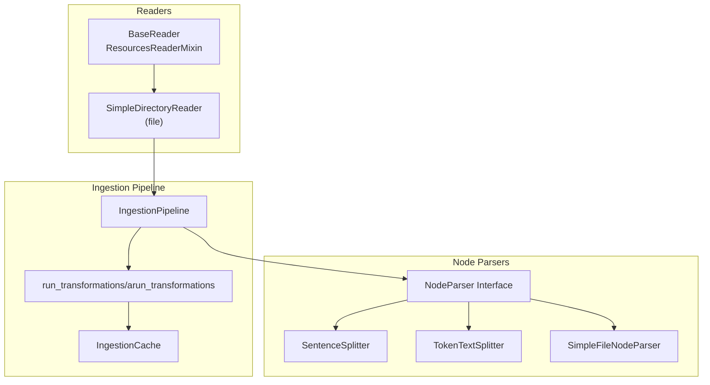
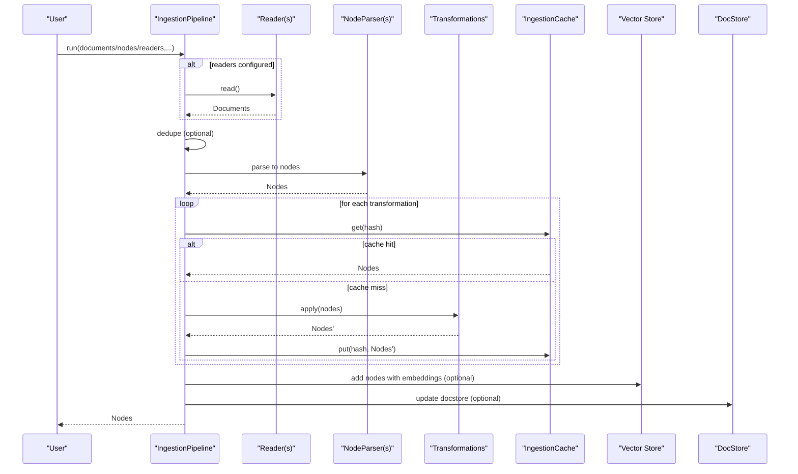
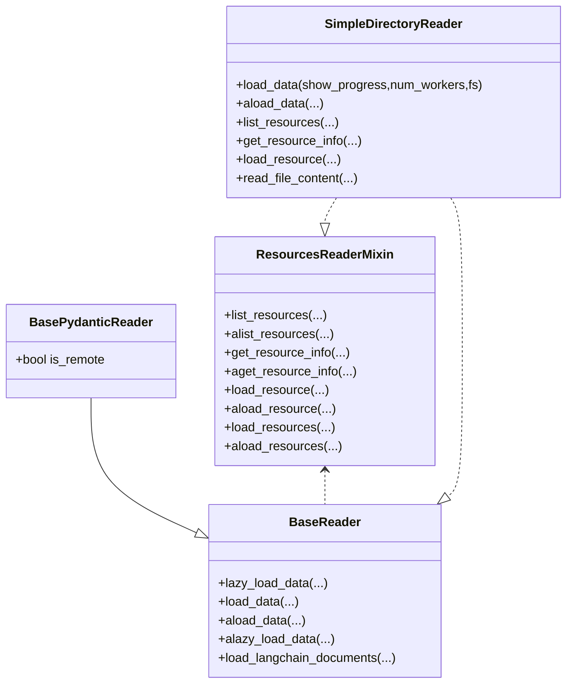
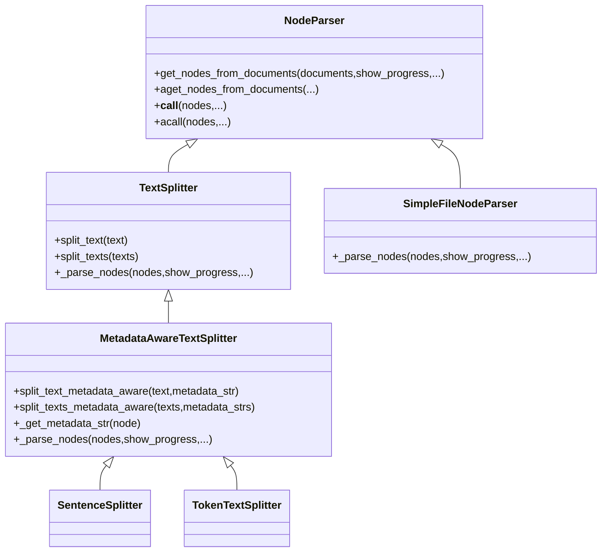
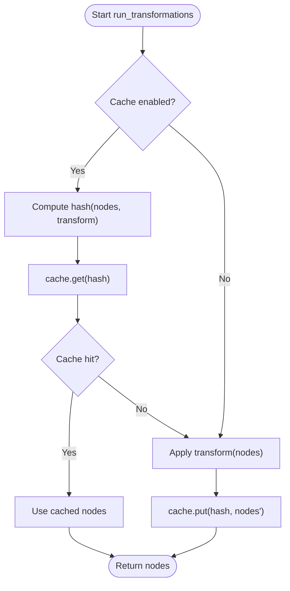
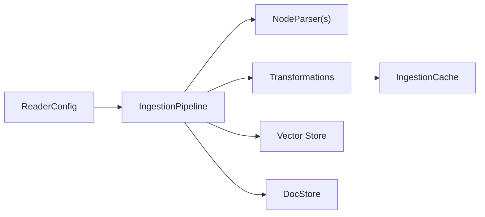

# Data Ingestion API

<cite>
**Referenced Files in This Document**
- [pipeline.py](file://llama-index-core/llama_index/core/ingestion/pipeline.py)
- [cache.py](file://llama-index-core/llama_index/core/ingestion/cache.py)
- [transformations.py](file://llama-index-core/llama_index/core/ingestion/transformations.py)
- [base.py](file://llama-index-core/llama_index/core/readers/base.py)
- [file/base.py](file://llama-index-core/llama_index/core/readers/file/base.py)
- [interface.py](file://llama-index-core/llama_index/core/node_parser/interface.py)
- [sentence.py](file://llama-index-core/llama_index/core/node_parser/text/sentence.py)
- [token.py](file://llama-index-core/llama_index/core/node_parser/text/token.py)
- [simple_file.py](file://llama-index-core/llama_index/core/node_parser/file/simple_file.py)
- [__init__.py](file://llama-index-core/llama_index/core/ingestion/__init__.py)
</cite>

## Table of Contents
1. [Introduction](#introduction)
2. [Project Structure](#project-structure)
3. [Core Components](#core-components)
4. [Architecture Overview](#architecture-overview)
5. [Detailed Component Analysis](#detailed-component-analysis)
6. [Dependency Analysis](#dependency-analysis)
7. [Performance Considerations](#performance-considerations)
8. [Troubleshooting Guide](#troubleshooting-guide)
9. [Conclusion](#conclusion)
10. [Appendices](#appendices)

## Introduction
This document provides comprehensive API documentation for the Data Ingestion system. It covers the Reader interface and built-in reader implementations for files, databases, web, and APIs; the NodeParser system for converting raw data into structured nodes; the IngestionPipeline for orchestrating data processing workflows; transformation APIs; caching mechanisms; and batch processing capabilities. It also includes guidance for implementing custom readers, parsers, and ingestion pipelines, along with configuration options, performance tuning parameters, and error handling strategies.

## Project Structure
The ingestion system is centered around three pillars:
- Readers: Abstractions and implementations for loading data from diverse sources (files, databases, web, APIs).
- NodeParsers: Components that convert raw documents into structured nodes with metadata and relationships.
- IngestionPipeline: Orchestrates reading, parsing, transformations, caching, and persistence.

**Diagram sources**
- [pipeline.py](file://llama-index-core/llama_index/core/ingestion/pipeline.py#L193-L779)
- [cache.py](file://llama-index-core/llama_index/core/ingestion/cache.py#L17-L79)
- [transformations.py](file://llama-index-core/llama_index/core/ingestion/transformations.py#L1-L379)
- [base.py](file://llama-index-core/llama_index/core/readers/base.py#L19-L250)
- [file/base.py](file://llama-index-core/llama_index/core/readers/file/base.py#L208-L800)
- [interface.py](file://llama-index-core/llama_index/core/node_parser/interface.py#L50-L278)
- [sentence.py](file://llama-index-core/llama_index/core/node_parser/text/sentence.py#L34-L332)
- [token.py](file://llama-index-core/llama_index/core/node_parser/text/token.py#L22-L242)
- [simple_file.py](file://llama-index-core/llama_index/core/node_parser/file/simple_file.py#L22-L102)

**Section sources**
- [__init__.py](file://llama-index-core/llama_index/core/ingestion/__init__.py#L1-L16)
- [pipeline.py](file://llama-index-core/llama_index/core/ingestion/pipeline.py#L193-L779)
- [cache.py](file://llama-index-core/llama_index/core/ingestion/cache.py#L17-L79)
- [transformations.py](file://llama-index-core/llama_index/core/ingestion/transformations.py#L1-L379)
- [base.py](file://llama-index-core/llama_index/core/readers/base.py#L19-L250)
- [file/base.py](file://llama-index-core/llama_index/core/readers/file/base.py#L208-L800)
- [interface.py](file://llama-index-core/llama_index/core/node_parser/interface.py#L50-L278)
- [sentence.py](file://llama-index-core/llama_index/core/node_parser/text/sentence.py#L34-L332)
- [token.py](file://llama-index-core/llama_index/core/node_parser/text/token.py#L22-L242)
- [simple_file.py](file://llama-index-core/llama_index/core/node_parser/file/simple_file.py#L22-L102)

## Core Components
- Reader interface and implementations:
  - BaseReader and BasePydanticReader define synchronous and asynchronous loading APIs.
  - ResourcesReaderMixin adds resource listing and metadata retrieval capabilities.
  - SimpleDirectoryReader loads files from directories or lists, supports custom file extractors and remote filesystems.
- NodeParser interface and implementations:
  - NodeParser defines the contract for converting documents into nodes.
  - SentenceSplitter and TokenTextSplitter implement token-aware splitting with overlap and metadata awareness.
  - SimpleFileNodeParser routes documents to appropriate parsers based on file extension.
- IngestionPipeline orchestration:
  - IngestionPipeline coordinates readers, node parsers, transformations, caching, and persistence.
  - run_transformations and arun_transformations execute transformations with optional caching and batching.
  - IngestionCache persists and retrieves cached transformation results.

**Section sources**
- [base.py](file://llama-index-core/llama_index/core/readers/base.py#L19-L250)
- [file/base.py](file://llama-index-core/llama_index/core/readers/file/base.py#L208-L800)
- [interface.py](file://llama-index-core/llama_index/core/node_parser/interface.py#L50-L278)
- [sentence.py](file://llama-index-core/llama_index/core/node_parser/text/sentence.py#L34-L332)
- [token.py](file://llama-index-core/llama_index/core/node_parser/text/token.py#L22-L242)
- [simple_file.py](file://llama-index-core/llama_index/core/node_parser/file/simple_file.py#L22-L102)
- [pipeline.py](file://llama-index-core/llama_index/core/ingestion/pipeline.py#L71-L144)
- [cache.py](file://llama-index-core/llama_index/core/ingestion/cache.py#L17-L79)

## Architecture Overview
The ingestion pipeline follows a staged workflow:
- Inputs: Documents, Nodes, or ReaderConfig instances.
- Deduplication: Optional docstore-based deduplication with configurable strategies.
- Transformations: Sequential execution of TransformComponents (parsers, embeddings).
- Caching: Optional caching keyed by node content and transformation signature.
- Persistence: Optional saving of cache and docstore state.

**Diagram sources**
- [pipeline.py](file://llama-index-core/llama_index/core/ingestion/pipeline.py#L467-L575)
- [pipeline.py](file://llama-index-core/llama_index/core/ingestion/pipeline.py#L656-L778)
- [pipeline.py](file://llama-index-core/llama_index/core/ingestion/pipeline.py#L71-L144)
- [cache.py](file://llama-index-core/llama_index/core/ingestion/cache.py#L27-L46)

## Detailed Component Analysis

### Reader Interface and Implementations
- BaseReader and BasePydanticReader:
  - Provide load_data, aload_data, lazy_load_data, and async variants.
  - BasePydanticReader adds serialization support and a flag for remote vs local sources.
- ResourcesReaderMixin:
  - Adds list_resources, get_resource_info, and async counterparts.
  - Enables resource-aware readers to enumerate and describe accessible resources.
- SimpleDirectoryReader (file):
  - Loads files from directories or explicit file lists.
  - Supports custom file extractors, metadata functions, encoding, error handling, and remote filesystems via fsspec.
  - Parallel loading via multiprocessing with worker limits and progress reporting.
  - Resource listing and metadata retrieval for files.

**Diagram sources**
- [base.py](file://llama-index-core/llama_index/core/readers/base.py#L19-L250)
- [file/base.py](file://llama-index-core/llama_index/core/readers/file/base.py#L208-L800)

**Section sources**
- [base.py](file://llama-index-core/llama_index/core/readers/base.py#L19-L250)
- [file/base.py](file://llama-index-core/llama_index/core/readers/file/base.py#L208-L800)

### NodeParser Interface and Implementations
- NodeParser interface:
  - Defines get_nodes_from_documents and async variant.
  - Handles metadata inclusion, previous/next relationships, and ID generation.
  - Provides post-processing to enrich nodes with source relationships and character indices.
- TextSplitter and MetadataAwareTextSplitter:
  - SentenceSplitter: Prefers sentence boundaries with configurable overlap and paragraph separators.
  - TokenTextSplitter: Token-aware splitting with configurable separators and overlap.
- SimpleFileNodeParser:
  - Routes documents to appropriate parsers based on file extension (.md, .html, .json).
  - Falls back to building nodes from raw content when no specific parser is available.

**Diagram sources**
- [interface.py](file://llama-index-core/llama_index/core/node_parser/interface.py#L50-L278)
- [sentence.py](file://llama-index-core/llama_index/core/node_parser/text/sentence.py#L34-L332)
- [token.py](file://llama-index-core/llama_index/core/node_parser/text/token.py#L22-L242)
- [simple_file.py](file://llama-index-core/llama_index/core/node_parser/file/simple_file.py#L22-L102)

**Section sources**
- [interface.py](file://llama-index-core/llama_index/core/node_parser/interface.py#L50-L278)
- [sentence.py](file://llama-index-core/llama_index/core/node_parser/text/sentence.py#L34-L332)
- [token.py](file://llama-index-core/llama_index/core/node_parser/text/token.py#L22-L242)
- [simple_file.py](file://llama-index-core/llama_index/core/node_parser/file/simple_file.py#L22-L102)

### IngestionPipeline and Transformations
- IngestionPipeline:
  - Accepts transformations (e.g., parsers, embeddings), optional readers, vector store, docstore, and cache.
  - run and arun orchestrate preparation, deduplication, transformation execution, and persistence.
  - Supports batch processing via multiprocessing and process pool executors for async-friendly wrappers.
  - Provides default transformations (SentenceSplitter + embedding model).
- run_transformations and arun_transformations:
  - Execute a sequence of TransformComponents on nodes.
  - Optional caching keyed by node content and transformation signature.
  - in_place controls whether transformations mutate input nodes.
- IngestionCache:
  - Stores sequences of nodes under a key and collection.
  - Supports persistence for simple caches and loading from persisted paths.

**Diagram sources**
- [pipeline.py](file://llama-index-core/llama_index/core/ingestion/pipeline.py#L71-L144)
- [cache.py](file://llama-index-core/llama_index/core/ingestion/cache.py#L27-L46)

**Section sources**
- [pipeline.py](file://llama-index-core/llama_index/core/ingestion/pipeline.py#L193-L779)
- [pipeline.py](file://llama-index-core/llama_index/core/ingestion/pipeline.py#L71-L144)
- [cache.py](file://llama-index-core/llama_index/core/ingestion/cache.py#L17-L79)
- [transformations.py](file://llama-index-core/llama_index/core/ingestion/transformations.py#L1-L379)

### Built-in Readers Catalog
- File readers:
  - SimpleDirectoryReader supports directories and explicit file lists, automatic selection of specialized readers by extension, and remote filesystems.
- Database and web readers:
  - The integrations directory contains numerous reader packages for databases, web APIs, and cloud services. These are external to the core and extend the ecosystem.
- String iterable readers:
  - StringIterableReader and JSONReader enable ingestion from in-memory data structures.

Note: Specific reader implementations live in separate packages under llama-index-integrations/readers. Consult their respective packages for detailed configuration and usage.

**Section sources**
- [file/base.py](file://llama-index-core/llama_index/core/readers/file/base.py#L208-L800)
- [base.py](file://llama-index-core/llama_index/core/readers/base.py#L223-L250)

### NodeParser Categories and Configurable Transformations
- Transformation categories:
  - NODE_PARSER: Converts documents to nodes.
  - EMBEDDING: Applies embeddings to nodes.
- ConfigurableTransformations:
  - Enumerates available transformations (e.g., Sentence Splitter, Token Text Splitter, HTML/Markdown/JSON parsers, and multiple embedding providers).
  - Provides a mechanism to build configured transformations from components.

**Section sources**
- [transformations.py](file://llama-index-core/llama_index/core/ingestion/transformations.py#L27-L379)

## Dependency Analysis
- Reader-to-Pipeline:
  - ReaderConfig encapsulates a reader instance and arguments, enabling flexible composition in the pipeline.
- Parser-to-Pipeline:
  - NodeParser instances are invoked by the pipeline’s run_transformations routine.
- Cache-to-Pipeline:
  - IngestionCache is integrated into run_transformations to avoid recomputation.
- Vector Store and DocStore:
  - Optional integration for storing embeddings and managing document deduplication.

**Diagram sources**
- [base.py](file://llama-index-core/llama_index/core/readers/base.py#L223-L250)
- [pipeline.py](file://llama-index-core/llama_index/core/ingestion/pipeline.py#L193-L779)
- [cache.py](file://llama-index-core/llama_index/core/ingestion/cache.py#L17-L79)

**Section sources**
- [base.py](file://llama-index-core/llama_index/core/readers/base.py#L223-L250)
- [pipeline.py](file://llama-index-core/llama_index/core/ingestion/pipeline.py#L193-L779)
- [cache.py](file://llama-index-core/llama_index/core/ingestion/cache.py#L17-L79)

## Performance Considerations
- Parallelism:
  - IngestionPipeline supports multiprocessing for batch processing nodes. Worker count is capped by CPU count.
  - SimpleDirectoryReader supports parallel file loading with worker limits.
- Chunking and Overlap:
  - SentenceSplitter and TokenTextSplitter balance chunk sizes with metadata-aware adjustments to prevent small residual chunks.
- Caching:
  - IngestionCache avoids recomputation of identical transformations on the same node sets. Use cache collections to isolate runs.
- Deduplication:
  - Docstore strategies minimize redundant processing and storage when vector store is present.

[No sources needed since this section provides general guidance]

## Troubleshooting Guide
- Empty directories or no files found:
  - SimpleDirectoryReader raises an error if no files match filters; verify input_dir, required_exts, and exclusion patterns.
- Large metadata impacting chunk size:
  - MetadataAwareTextSplitter adjusts effective chunk size; increase chunk_size or reduce metadata to avoid small residual chunks.
- Parallel worker limits:
  - Exceeding CPU count triggers a warning; adjust num_workers accordingly.
- Cache persistence:
  - Only SimpleCache supports persistence; ensure cache type matches expectations when loading from disk.

**Section sources**
- [file/base.py](file://llama-index-core/llama_index/core/readers/file/base.py#L424-L430)
- [sentence.py](file://llama-index-core/llama_index/core/node_parser/text/sentence.py#L156-L174)
- [token.py](file://llama-index-core/llama_index/core/node_parser/text/token.py#L117-L136)
- [pipeline.py](file://llama-index-core/llama_index/core/ingestion/pipeline.py#L532-L537)
- [cache.py](file://llama-index-core/llama_index/core/ingestion/cache.py#L55-L62)

## Conclusion
The Data Ingestion system offers a modular, extensible framework for reading diverse data sources, parsing into structured nodes, applying transformations with caching, and persisting state. IngestionPipeline orchestrates these steps with optional deduplication and parallel processing. NodeParser implementations provide robust text chunking strategies, while Reader abstractions enable ingestion from files, databases, web, and APIs. Custom components can be integrated via TransformComponent and Reader interfaces.

[No sources needed since this section summarizes without analyzing specific files]

## Appendices

### API Reference Index
- IngestionPipeline: [pipeline.py](file://llama-index-core/llama_index/core/ingestion/pipeline.py#L193-L779)
- run_transformations/arun_transformations: [pipeline.py](file://llama-index-core/llama_index/core/ingestion/pipeline.py#L71-L144)
- IngestionCache: [cache.py](file://llama-index-core/llama_index/core/ingestion/cache.py#L17-L79)
- BaseReader/BasePydanticReader/ResourcesReaderMixin: [base.py](file://llama-index-core/llama_index/core/readers/base.py#L19-L250)
- SimpleDirectoryReader: [file/base.py](file://llama-index-core/llama_index/core/readers/file/base.py#L208-L800)
- NodeParser interface: [interface.py](file://llama-index-core/llama_index/core/node_parser/interface.py#L50-L278)
- SentenceSplitter: [sentence.py](file://llama-index-core/llama_index/core/node_parser/text/sentence.py#L34-L332)
- TokenTextSplitter: [token.py](file://llama-index-core/llama_index/core/node_parser/text/token.py#L22-L242)
- SimpleFileNodeParser: [simple_file.py](file://llama-index-core/llama_index/core/node_parser/file/simple_file.py#L22-L102)
- ConfigurableTransformations: [transformations.py](file://llama-index-core/llama_index/core/ingestion/transformations.py#L118-L379)