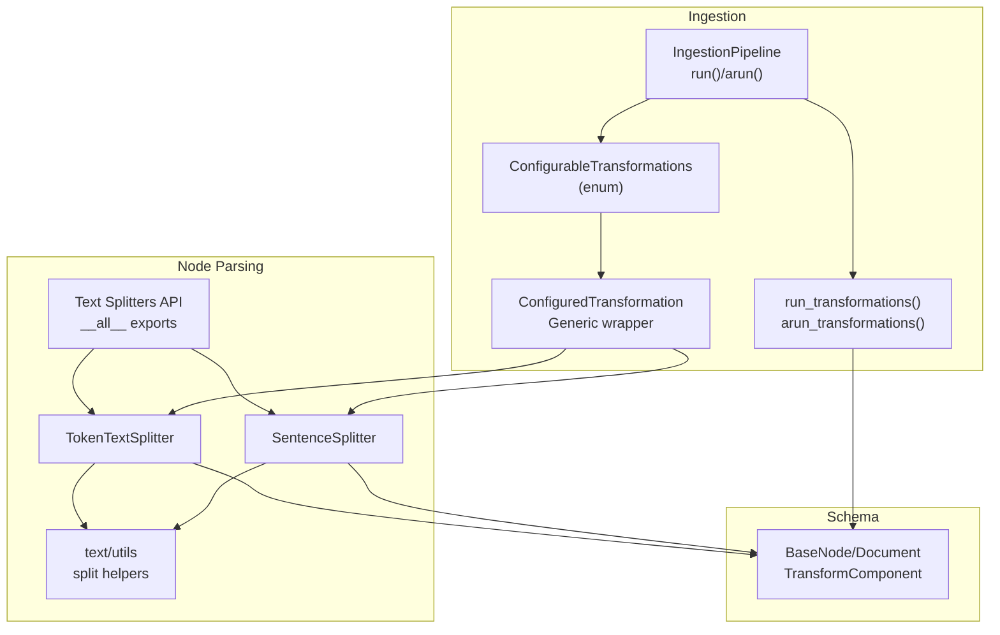
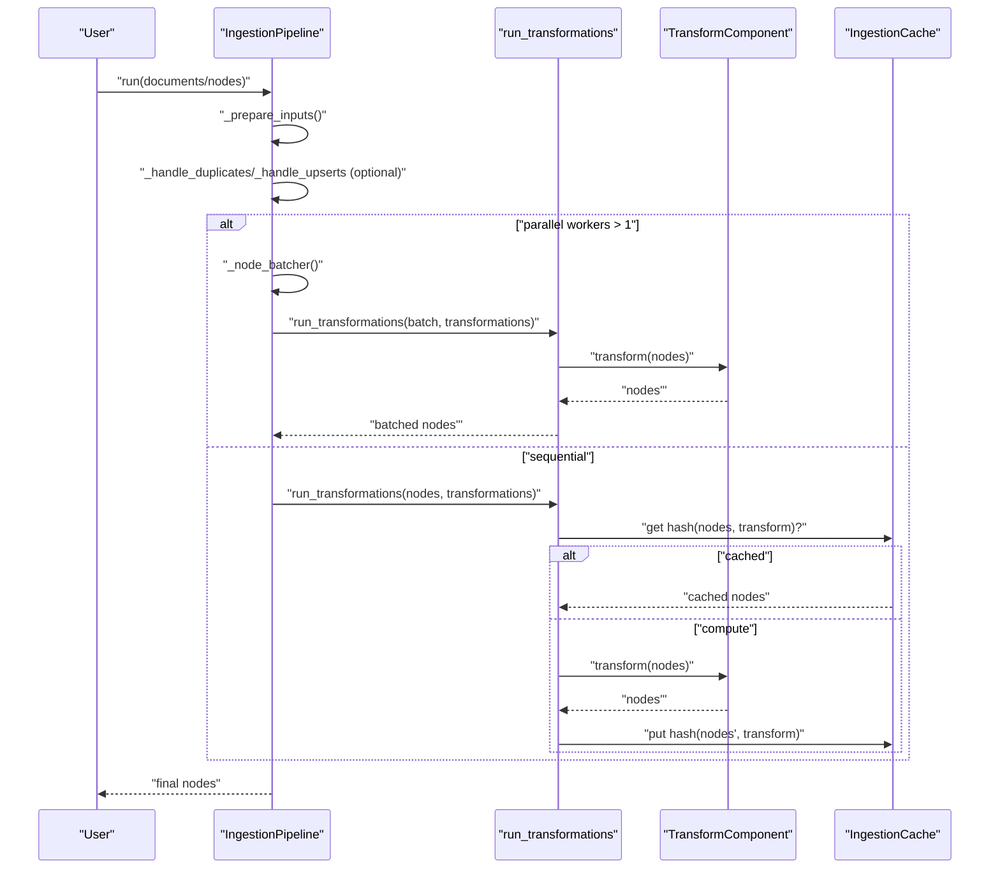
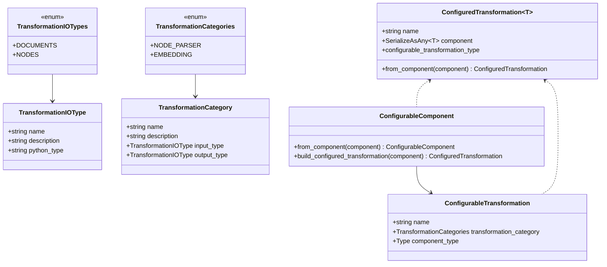
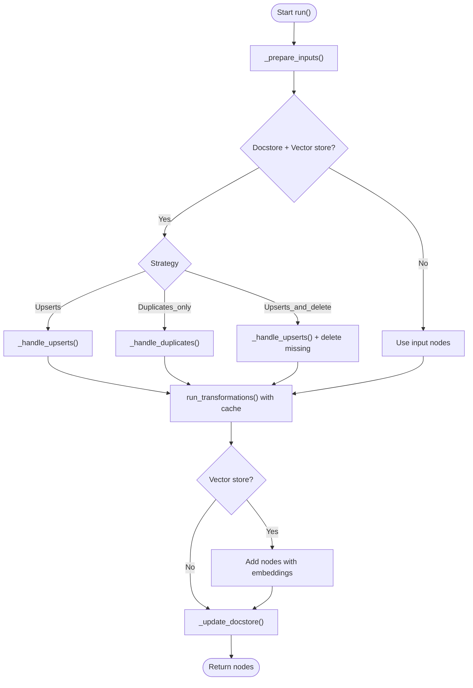
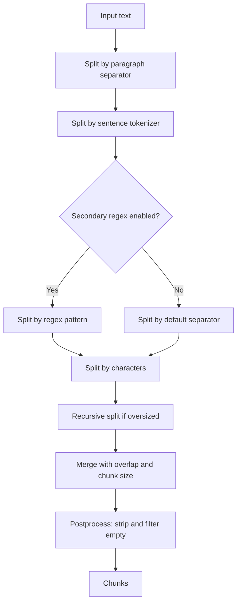
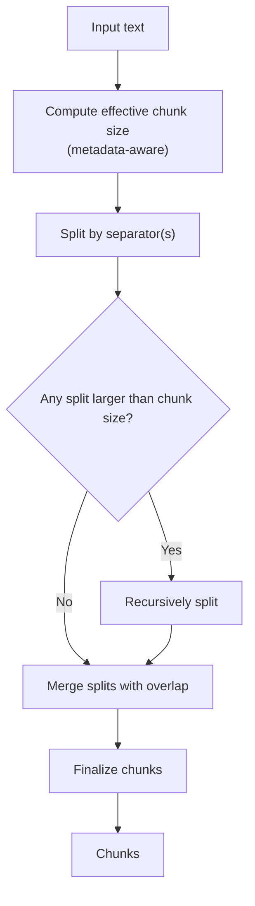
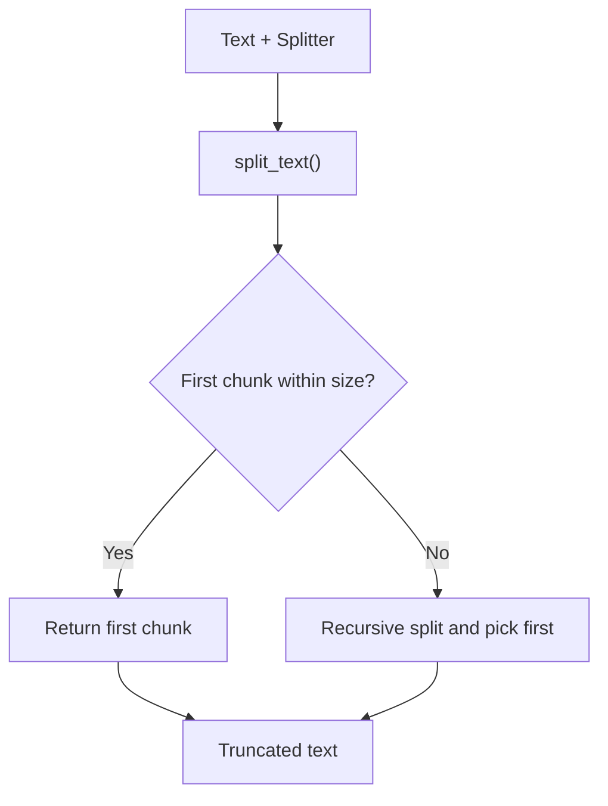
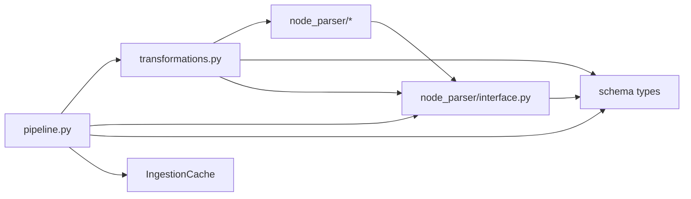

# Data Transformations

<cite>
**Referenced Files in This Document**
- [transformations.py](file://llama-index-core/llama_index/core/ingestion/transformations.py)
- [pipeline.py](file://llama-index-core/llama_index/core/ingestion/pipeline.py)
- [text/__init__.py](file://llama-index-core/llama_index/core/node_parser/text/__init__.py)
- [sentence.py](file://llama-index-core/llama_index/core/node_parser/text/sentence.py)
- [token.py](file://llama-index-core/llama_index/core/node_parser/text/token.py)
- [utils.py](file://llama-index-core/llama_index/core/node_parser/text/utils.py)
- [interface.py](file://llama-index-core/llama_index/core/node_parser/interface.py)
- [test_transformations.py](file://llama-index-core/tests/ingestion/test_transformations.py)
</cite>

## Table of Contents
1. [Introduction](#introduction)
2. [Project Structure](#project-structure)
3. [Core Components](#core-components)
4. [Architecture Overview](#architecture-overview)
5. [Detailed Component Analysis](#detailed-component-analysis)
6. [Dependency Analysis](#dependency-analysis)
7. [Performance Considerations](#performance-considerations)
8. [Troubleshooting Guide](#troubleshooting-guide)
9. [Conclusion](#conclusion)
10. [Appendices](#appendices)

## Introduction
This document describes the data transformation utilities used in the ingestion pipeline for preparing and processing data. It focuses on:
- Transformation functions and classes for parsing documents into nodes and embedding nodes
- Text splitting algorithms (sentence-aware, token-aware, and others)
- Node manipulation utilities and data formatting helpers
- Transformation chaining mechanisms and how transformations are applied during ingestion
- Guidance for developing and integrating custom transformations
- Performance optimization techniques, memory management, and debugging strategies
- Selection guidelines for transformations based on data types and use cases

## Project Structure
The transformation system centers around:
- Ingestion pipeline orchestration and caching
- Configurable transformation registry and typed IO categories
- Node parser implementations for text splitting and structured data
- Utilities for text manipulation and chunking

**Diagram sources**
- [pipeline.py](file://llama-index-core/llama_index/core/ingestion/pipeline.py#L467-L575)
- [transformations.py](file://llama-index-core/llama_index/core/ingestion/transformations.py#L118-L342)
- [text/__init__.py](file://llama-index-core/llama_index/core/node_parser/text/__init__.py#L17-L26)
- [sentence.py](file://llama-index-core/llama_index/core/node_parser/text/sentence.py#L34-L154)
- [token.py](file://llama-index-core/llama_index/core/node_parser/text/token.py#L22-L115)
- [utils.py](file://llama-index-core/llama_index/core/node_parser/text/utils.py#L10-L124)

**Section sources**
- [pipeline.py](file://llama-index-core/llama_index/core/ingestion/pipeline.py#L193-L358)
- [transformations.py](file://llama-index-core/llama_index/core/ingestion/transformations.py#L27-L116)
- [text/__init__.py](file://llama-index-core/llama_index/core/node_parser/text/__init__.py#L17-L26)

## Core Components
- Configurable transformation registry
  - Defines transformation categories (NodeParser, Embedding) and typed IO (Documents → Nodes)
  - Builds an enum of supported transformations dynamically, including node parsers and embedding providers
  - Provides a generic wrapper to attach a component instance to a configured transformation

- Ingestion pipeline
  - Orchestrates reading inputs, deduplication via docstore/vector store, transformation chaining, and persistence
  - Supports synchronous and asynchronous transformation execution
  - Implements caching keyed by node content and transformation config to avoid recomputation

- Text splitting algorithms
  - SentenceSplitter: prefers sentence boundaries and paragraph separators, merges with overlap-aware logic
  - TokenTextSplitter: token-aware splitting with metadata-aware sizing and fallback splitting strategies
  - Utilities: helpers for truncation, separator-preserving split, regex-based split, and sentence tokenization

**Section sources**
- [transformations.py](file://llama-index-core/llama_index/core/ingestion/transformations.py#L27-L116)
- [transformations.py](file://llama-index-core/llama_index/core/ingestion/transformations.py#L118-L342)
- [pipeline.py](file://llama-index-core/llama_index/core/ingestion/pipeline.py#L71-L143)
- [sentence.py](file://llama-index-core/llama_index/core/node_parser/text/sentence.py#L34-L154)
- [token.py](file://llama-index-core/llama_index/core/node_parser/text/token.py#L22-L115)
- [utils.py](file://llama-index-core/llama_index/core/node_parser/text/utils.py#L10-L124)

## Architecture Overview
The ingestion pipeline applies a chain of transformations to documents or nodes. Each transformation is a callable implementing the TransformComponent protocol. The pipeline supports:
- Sequential execution with optional in-place updates
- Caching keyed by node content and transformation configuration
- Asynchronous execution paths for IO-bound steps
- Parallel processing via process pools for CPU-bound transformations
- Deduplication against a document store and optional vector store

**Diagram sources**
- [pipeline.py](file://llama-index-core/llama_index/core/ingestion/pipeline.py#L467-L575)
- [pipeline.py](file://llama-index-core/llama_index/core/ingestion/pipeline.py#L71-L143)
- [pipeline.py](file://llama-index-core/llama_index/core/ingestion/pipeline.py#L57-L68)

## Detailed Component Analysis

### Transformation Registry and Chaining
- Transformation categories and IO types define the contract for transformations
- ConfigurableTransformations enumerates supported components (node parsers and embeddings) and builds an enum keyed by component type
- ConfiguredTransformation wraps a component instance and exposes a typed interface for use in pipelines

**Diagram sources**
- [transformations.py](file://llama-index-core/llama_index/core/ingestion/transformations.py#L27-L116)
- [transformations.py](file://llama-index-core/llama_index/core/ingestion/transformations.py#L118-L342)
- [transformations.py](file://llama-index-core/llama_index/core/ingestion/transformations.py#L347-L379)

**Section sources**
- [transformations.py](file://llama-index-core/llama_index/core/ingestion/transformations.py#L27-L116)
- [transformations.py](file://llama-index-core/llama_index/core/ingestion/transformations.py#L118-L342)
- [transformations.py](file://llama-index-core/llama_index/core/ingestion/transformations.py#L347-L379)

### Ingestion Pipeline Execution
- run_transformations/arun_transformations apply a sequence of TransformComponent instances to nodes
- Caching uses a deterministic hash of node content and transformation config
- IngestionPipeline orchestrates inputs, deduplication, transformation, and persistence

**Diagram sources**
- [pipeline.py](file://llama-index-core/llama_index/core/ingestion/pipeline.py#L467-L575)
- [pipeline.py](file://llama-index-core/llama_index/core/ingestion/pipeline.py#L71-L143)
- [pipeline.py](file://llama-index-core/llama_index/core/ingestion/pipeline.py#L382-L464)

**Section sources**
- [pipeline.py](file://llama-index-core/llama_index/core/ingestion/pipeline.py#L71-L143)
- [pipeline.py](file://llama-index-core/llama_index/core/ingestion/pipeline.py#L467-L575)

### Text Splitting Algorithms

#### SentenceSplitter
- Prefers sentence boundaries and paragraph separators
- Uses a chunking tokenizer and optional regex fallback
- Merges splits with overlap-aware logic and post-processing to strip whitespace-only chunks

**Diagram sources**
- [sentence.py](file://llama-index-core/llama_index/core/node_parser/text/sentence.py#L179-L331)

**Section sources**
- [sentence.py](file://llama-index-core/llama_index/core/node_parser/text/sentence.py#L34-L154)
- [sentence.py](file://llama-index-core/llama_index/core/node_parser/text/sentence.py#L179-L331)

#### TokenTextSplitter
- Token-aware splitting with configurable chunk size and overlap
- Reserves space for metadata when computing effective chunk size
- Fallback splitting strategies: separator, backup separators, character-level split
- Merges splits into chunks with overlap handling

**Diagram sources**
- [token.py](file://llama-index-core/llama_index/core/node_parser/text/token.py#L117-L157)
- [token.py](file://llama-index-core/llama_index/core/node_parser/text/token.py#L159-L241)

**Section sources**
- [token.py](file://llama-index-core/llama_index/core/node_parser/text/token.py#L22-L115)
- [token.py](file://llama-index-core/llama_index/core/node_parser/text/token.py#L117-L241)

#### Node Manipulation Utilities
- Truncation helper to produce the first chunk within size limits
- Separator-preserving split and regex-based phrase splitting
- Sentence tokenizer integration for robust sentence segmentation

**Diagram sources**
- [utils.py](file://llama-index-core/llama_index/core/node_parser/text/utils.py#L10-L23)

**Section sources**
- [utils.py](file://llama-index-core/llama_index/core/node_parser/text/utils.py#L10-L124)

### Node Parser API Surface
- Exposes constructors for major splitters (SentenceSplitter, TokenTextSplitter, CodeSplitter, etc.) under a single namespace
- Enables consistent import and usage across the ingestion pipeline

**Section sources**
- [text/__init__.py](file://llama-index-core/llama_index/core/node_parser/text/__init__.py#L17-L26)

## Dependency Analysis
- Transformations depend on:
  - Node parser implementations (SentenceSplitter, TokenTextSplitter, etc.)
  - Schema types (BaseNode, Document, TransformComponent)
  - Interface contracts (TextSplitter, MetadataAwareTextSplitter)
- Pipeline depends on:
  - TransformComponent protocol for applying transformations
  - IngestionCache for memoization
  - Docstore and Vector store abstractions for deduplication and storage

**Diagram sources**
- [transformations.py](file://llama-index-core/llama_index/core/ingestion/transformations.py#L14-L24)
- [pipeline.py](file://llama-index-core/llama_index/core/ingestion/pipeline.py#L20-L40)
- [interface.py](file://llama-index-core/llama_index/core/node_parser/interface.py)

**Section sources**
- [transformations.py](file://llama-index-core/llama_index/core/ingestion/transformations.py#L14-L24)
- [pipeline.py](file://llama-index-core/llama_index/core/ingestion/pipeline.py#L20-L40)

## Performance Considerations
- Caching
  - Deterministic hashing of node content plus transformation config prevents redundant computation
  - Cache collections enable isolation across runs or datasets

- Parallelism
  - Multiprocessing batches for CPU-bound transformations
  - Async variants for IO-bound transformations

- Chunk sizing and overlap
  - Choose chunk sizes aligned with downstream embedding/token limits
  - Adjust overlap to balance recall and redundancy

- Memory management
  - Prefer in-place transformations when safe
  - Batch nodes for parallel processing to limit per-worker memory footprint
  - Use streaming reads for large inputs

- Token-aware splitting
  - Reserve space for metadata to avoid oversized chunks
  - Use fallback strategies to prevent deep recursion

[No sources needed since this section provides general guidance]

## Troubleshooting Guide
- Symptom: Unexpected recomputation
  - Cause: Transformation config changed or node content differs
  - Action: Verify cache keys and ensure stable transformation configs

- Symptom: Empty or whitespace-only chunks
  - Cause: Aggressive sentence boundary splitting or whitespace stripping
  - Action: Adjust paragraph separators or postprocessing filters

- Symptom: Slow ingestion
  - Cause: Large chunk sizes, deep recursion, or lack of parallelism
  - Action: Reduce chunk size, increase overlap moderately, enable parallel workers

- Debugging
  - Inspect transformation chaining by stepping through run_transformations
  - Enable callback events for chunking to observe intermediate splits
  - Validate deduplication strategy against docstore/vector store

**Section sources**
- [pipeline.py](file://llama-index-core/llama_index/core/ingestion/pipeline.py#L57-L68)
- [pipeline.py](file://llama-index-core/llama_index/core/ingestion/pipeline.py#L71-L143)
- [sentence.py](file://llama-index-core/llama_index/core/node_parser/text/sentence.py#L304-L315)
- [token.py](file://llama-index-core/llama_index/core/node_parser/text/token.py#L117-L136)

## Conclusion
The ingestion transformation system provides a flexible, extensible framework for parsing, splitting, and embedding data. By leveraging the configurable transformation registry, caching, and parallel execution, you can scale ingestion to large datasets while maintaining reproducibility and performance. Selecting appropriate text splitters and chunk sizes, combined with careful memory and deduplication strategies, ensures robust pipelines across diverse data types and use cases.

[No sources needed since this section summarizes without analyzing specific files]

## Appendices

### How to Develop and Integrate a Custom Transformation
- Implement a TransformComponent-compatible class that accepts a sequence of nodes and returns transformed nodes
- Register it as a configurable transformation using the registry builder
- Instantiate and include it in the pipeline’s transformation list

**Section sources**
- [transformations.py](file://llama-index-core/llama_index/core/ingestion/transformations.py#L118-L342)
- [pipeline.py](file://llama-index-core/llama_index/core/ingestion/pipeline.py#L252-L254)

### Example Workflows
- Typical ingestion pipeline with sentence splitting and embeddings
- Async ingestion for IO-bound transformations
- Parallel ingestion for CPU-bound transformations

**Section sources**
- [pipeline.py](file://llama-index-core/llama_index/core/ingestion/pipeline.py#L225-L239)
- [pipeline.py](file://llama-index-core/llama_index/core/ingestion/pipeline.py#L577-L778)

### Tests and Validation
- Unit tests validate transformation registration and behavior
- Use tests as references for expected inputs and outputs

**Section sources**
- [test_transformations.py](file://llama-index-core/tests/ingestion/test_transformations.py)