# Ingestion Pipeline

<cite>
**Referenced Files in This Document**
- [pipeline.py](file://llama-index-core/llama_index/core/ingestion/pipeline.py)
- [api_utils.py](file://llama-index-core/llama_index/core/ingestion/api_utils.py)
- [cache.py](file://llama-index-core/llama_index/core/ingestion/cache.py)
- [data_sources.py](file://llama-index-core/llama_index/core/ingestion/data_sources.py)
- [transformations.py](file://llama-index-core/llama_index/core/ingestion/transformations.py)
- [data_sinks.py](file://llama-index-core/llama_index/core/ingestion/data_sinks.py)
- [advanced_ingestion_pipeline.ipynb](file://docs/examples/ingestion/advanced_ingestion_pipeline.ipynb)
- [parallel_execution_ingestion_pipeline.ipynb](file://docs/examples/ingestion/parallel_execution_ingestion_pipeline.ipynb)
- [ray_ingestion_pipeline.ipynb](file://docs/examples/ingestion/ray_ingestion_pipeline.ipynb)
</cite>

## Table of Contents
1. [Introduction](#introduction)
2. [Project Structure](#project-structure)
3. [Core Components](#core-components)
4. [Architecture Overview](#architecture-overview)
5. [Detailed Component Analysis](#detailed-component-analysis)
6. [Dependency Analysis](#dependency-analysis)
7. [Performance Considerations](#performance-considerations)
8. [Troubleshooting Guide](#troubleshooting-guide)
9. [Conclusion](#conclusion)
10. [Appendices](#appendices)

## Introduction
This document provides comprehensive API documentation for the IngestionPipeline system. It explains how to orchestrate end-to-end data ingestion workflows using the Pipeline class, covering data sources, transformations, caching, and data sinks. It also documents API utilities for constructing, executing, and monitoring pipelines, along with examples for building custom ingestion pipelines, leveraging caching for performance, batching and parallel execution, error handling strategies, configuration, scaling, and integration with external systems.

## Project Structure
The ingestion subsystem resides under the core ingestion module and includes:
- Pipeline orchestration and execution
- Caching utilities
- Data sources enumeration and configuration
- Transformation categories and configuration
- Data sinks enumeration and configuration
- API utilities for platform clients

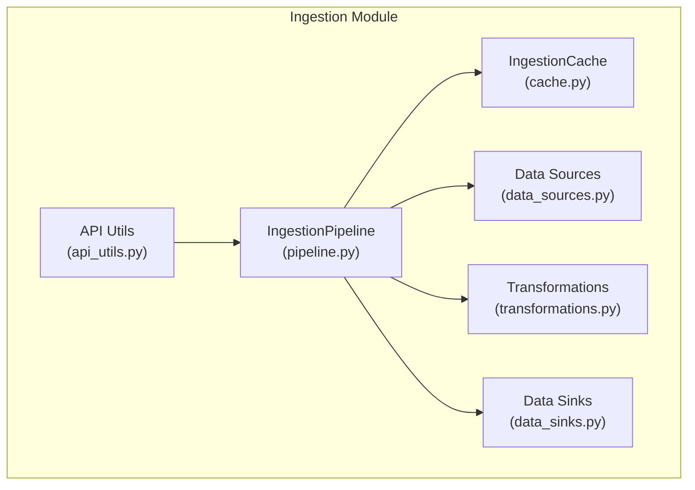

**Diagram sources**
- [pipeline.py](file://llama-index-core/llama_index/core/ingestion/pipeline.py#L193-L779)
- [cache.py](file://llama-index-core/llama_index/core/ingestion/cache.py#L17-L79)
- [data_sources.py](file://llama-index-core/llama_index/core/ingestion/data_sources.py#L15-L475)
- [transformations.py](file://llama-index-core/llama_index/core/ingestion/transformations.py#L77-L379)
- [data_sinks.py](file://llama-index-core/llama_index/core/ingestion/data_sinks.py#L12-L181)
- [api_utils.py](file://llama-index-core/llama_index/core/ingestion/api_utils.py#L14-L50)

**Section sources**
- [pipeline.py](file://llama-index-core/llama_index/core/ingestion/pipeline.py#L193-L779)
- [cache.py](file://llama-index-core/llama_index/core/ingestion/cache.py#L17-L79)
- [data_sources.py](file://llama-index-core/llama_index/core/ingestion/data_sources.py#L15-L475)
- [transformations.py](file://llama-index-core/llama_index/core/ingestion/transformations.py#L77-L379)
- [data_sinks.py](file://llama-index-core/llama_index/core/ingestion/data_sinks.py#L12-L181)
- [api_utils.py](file://llama-index-core/llama_index/core/ingestion/api_utils.py#L14-L50)

## Core Components
- IngestionPipeline: Orchestrates ingestion from data sources through transformations to sinks, with caching and de-duplication support.
- IngestionCache: Stores transformation outputs keyed by input nodes and transformation signature to avoid recomputation.
- Data Sources: Enumerates and configures supported readers and document groups.
- Transformations: Enumerates and configures supported transformation categories (e.g., node parsing, embeddings).
- Data Sinks: Enumerates and configures supported vector stores.
- API Utilities: Provides platform clients for external integrations.

**Section sources**
- [pipeline.py](file://llama-index-core/llama_index/core/ingestion/pipeline.py#L193-L779)
- [cache.py](file://llama-index-core/llama_index/core/ingestion/cache.py#L17-L79)
- [data_sources.py](file://llama-index-core/llama_index/core/ingestion/data_sources.py#L15-L475)
- [transformations.py](file://llama-index-core/llama_index/core/ingestion/transformations.py#L77-L379)
- [data_sinks.py](file://llama-index-core/llama_index/core/ingestion/data_sinks.py#L12-L181)
- [api_utils.py](file://llama-index-core/llama_index/core/ingestion/api_utils.py#L14-L50)

## Architecture Overview
The ingestion pipeline follows a staged workflow:
- Prepare inputs from documents, nodes, and configured readers
- De-duplicate via document store strategies (when available)
- Apply transformations with optional caching
- Persist nodes to vector store and/or document store
- Support both synchronous and asynchronous execution

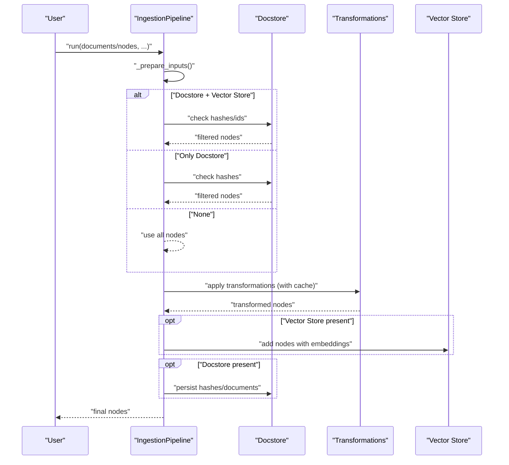

**Diagram sources**
- [pipeline.py](file://llama-index-core/llama_index/core/ingestion/pipeline.py#L467-L575)
- [pipeline.py](file://llama-index-core/llama_index/core/ingestion/pipeline.py#L382-L464)

**Section sources**
- [pipeline.py](file://llama-index-core/llama_index/core/ingestion/pipeline.py#L467-L575)
- [pipeline.py](file://llama-index-core/llama_index/core/ingestion/pipeline.py#L382-L464)

## Detailed Component Analysis

### IngestionPipeline
The Pipeline class orchestrates ingestion with the following responsibilities:
- Construction with defaults for transformations and cache
- Input preparation from documents, nodes, and readers
- De-duplication strategies against a document store
- Transformation execution with optional caching and batching
- Vector store persistence and document store updates
- Synchronous and asynchronous execution modes
- Persistence and loading of cache and document store

Key behaviors:
- Default transformations include sentence splitting and embedding model from settings
- Supports three de-dup strategies: upserts, duplicates_only, upserts_and_delete
- Parallel execution via process pools with batch splitting
- Async variants mirror sync logic with async document store and vector store operations

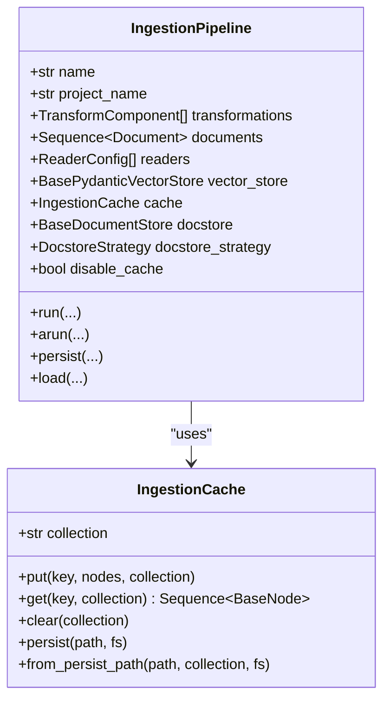

**Diagram sources**
- [pipeline.py](file://llama-index-core/llama_index/core/ingestion/pipeline.py#L193-L303)
- [cache.py](file://llama-index-core/llama_index/core/ingestion/cache.py#L17-L79)

**Section sources**
- [pipeline.py](file://llama-index-core/llama_index/core/ingestion/pipeline.py#L193-L303)
- [pipeline.py](file://llama-index-core/llama_index/core/ingestion/pipeline.py#L467-L575)
- [pipeline.py](file://llama-index-core/llama_index/core/ingestion/pipeline.py#L656-L779)

### Data Sources
The data sources module enumerates supported readers and document types, enabling configuration of inputs for the pipeline:
- Readers: web, RSS, Google Docs, GCS, S3, SharePoint, OneDrive, Slack, Discord, Twitter, Wikipedia, YouTube transcripts, Elasticsearch, and more
- Document groups and basic document/text node inputs
- Configurable data source builder ensures compatibility and naming

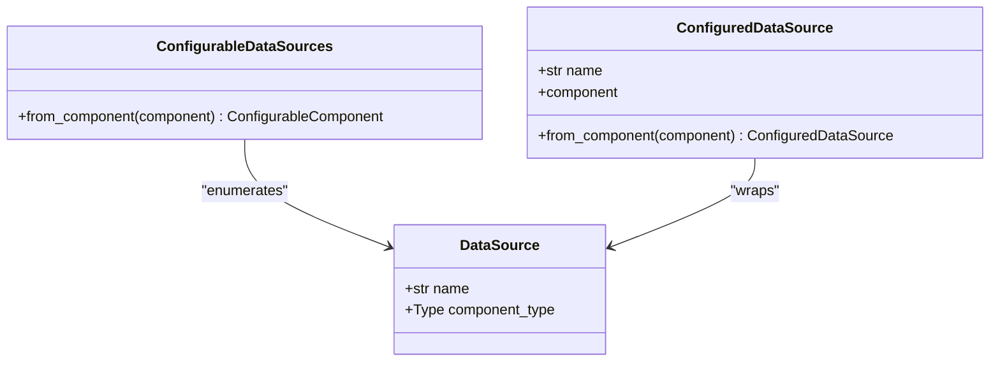

**Diagram sources**
- [data_sources.py](file://llama-index-core/llama_index/core/ingestion/data_sources.py#L89-L438)
- [data_sources.py](file://llama-index-core/llama_index/core/ingestion/data_sources.py#L443-L475)

**Section sources**
- [data_sources.py](file://llama-index-core/llama_index/core/ingestion/data_sources.py#L89-L438)
- [data_sources.py](file://llama-index-core/llama_index/core/ingestion/data_sources.py#L443-L475)

### Transformations
The transformations module defines transformation categories and builds an enumeration of supported components:
- Categories: NodeParser (input: Documents, output: Nodes), Embedding (input/output: Nodes)
- Supported node parsers: code, sentence-aware, token-aware, HTML, Markdown, JSON, SimpleFile, MarkdownElement
- Supported embeddings: OpenAI, Azure OpenAI, Cohere, Bedrock, HuggingFace API, Gemini, MistralAI

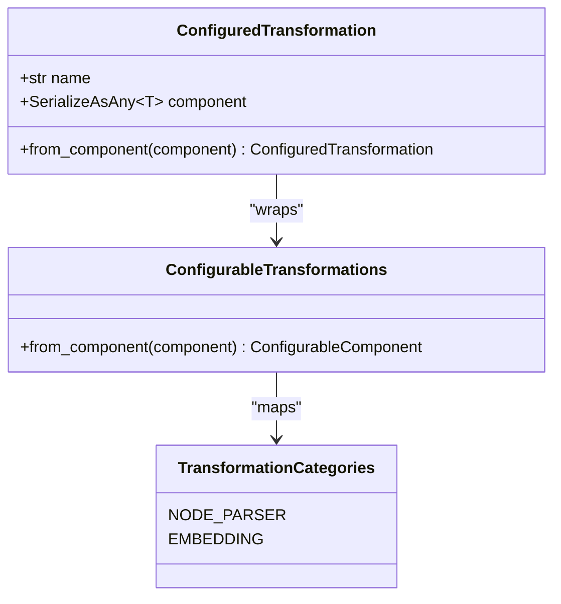

**Diagram sources**
- [transformations.py](file://llama-index-core/llama_index/core/ingestion/transformations.py#L118-L342)
- [transformations.py](file://llama-index-core/llama_index/core/ingestion/transformations.py#L347-L379)

**Section sources**
- [transformations.py](file://llama-index-core/llama_index/core/ingestion/transformations.py#L118-L342)
- [transformations.py](file://llama-index-core/llama_index/core/ingestion/transformations.py#L347-L379)

### Data Sinks
The data sinks module enumerates supported vector stores for persistence:
- Chroma, Pinecone, PostgreSQL (PGVector), Qdrant, Weaviate
- Configurable sink builder validates compatibility and naming

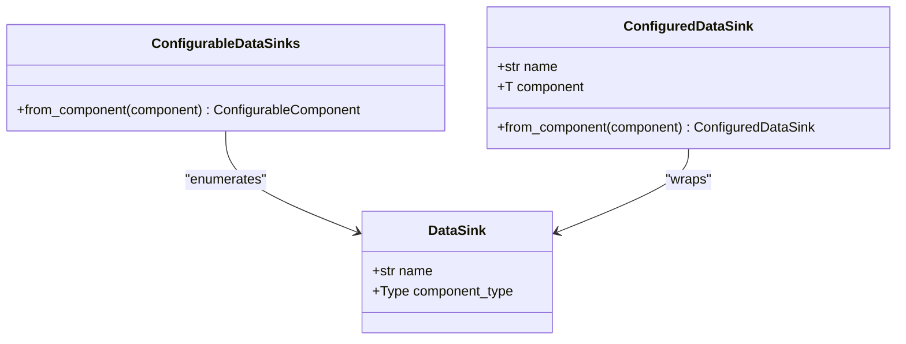

**Diagram sources**
- [data_sinks.py](file://llama-index-core/llama_index/core/ingestion/data_sinks.py#L52-L147)
- [data_sinks.py](file://llama-index-core/llama_index/core/ingestion/data_sinks.py#L153-L181)

**Section sources**
- [data_sinks.py](file://llama-index-core/llama_index/core/ingestion/data_sinks.py#L52-L147)
- [data_sinks.py](file://llama-index-core/llama_index/core/ingestion/data_sinks.py#L153-L181)

### API Utilities
The API utilities provide platform clients for external integrations:
- Synchronous and asynchronous clients for LlamaCloud
- Environment-based configuration via base URLs and API keys

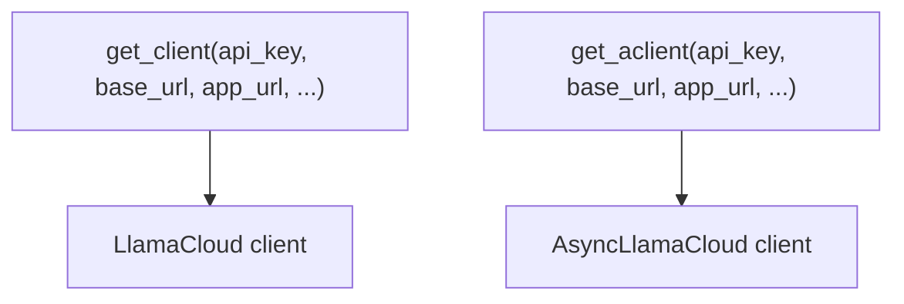

**Diagram sources**
- [api_utils.py](file://llama-index-core/llama_index/core/ingestion/api_utils.py#L14-L50)

**Section sources**
- [api_utils.py](file://llama-index-core/llama_index/core/ingestion/api_utils.py#L14-L50)

### Caching Mechanisms
The caching system optimizes repeated transformations by storing node sequences keyed by a deterministic hash of input nodes and transformation configuration:
- Keys derived from node content and transformation dict (with unstable values removed)
- Collections enable logical separation of caches
- Persistence supported for simple key-value stores

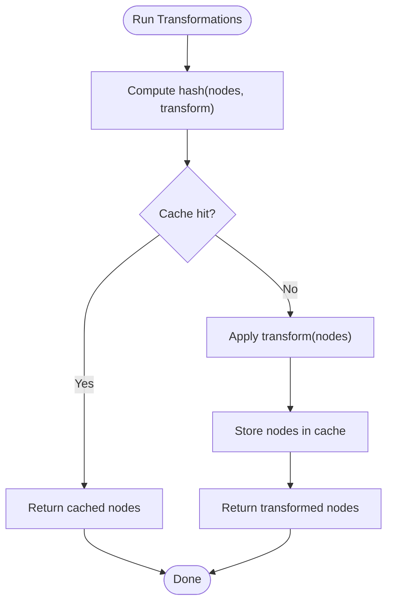

**Diagram sources**
- [pipeline.py](file://llama-index-core/llama_index/core/ingestion/pipeline.py#L57-L105)
- [cache.py](file://llama-index-core/llama_index/core/ingestion/cache.py#L27-L46)

**Section sources**
- [pipeline.py](file://llama-index-core/llama_index/core/ingestion/pipeline.py#L57-L105)
- [cache.py](file://llama-index-core/llama_index/core/ingestion/cache.py#L27-L46)

### Batch Processing and Parallel Execution
The pipeline supports batch processing and parallel execution:
- Batch splitting divides nodes into worker-sized chunks
- Multiprocessing pool executes transformations per batch
- Async variant uses ProcessPoolExecutor with event loop integration
- Parallel workers capped by CPU count with warnings when exceeded

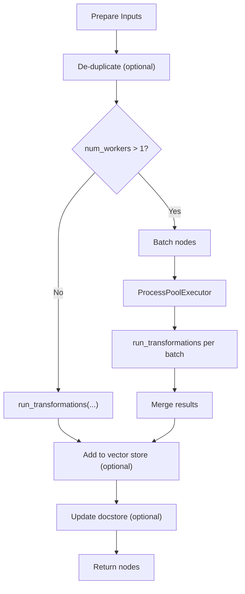

**Diagram sources**
- [pipeline.py](file://llama-index-core/llama_index/core/ingestion/pipeline.py#L530-L575)
- [pipeline.py](file://llama-index-core/llama_index/core/ingestion/pipeline.py#L726-L779)

**Section sources**
- [pipeline.py](file://llama-index-core/llama_index/core/ingestion/pipeline.py#L530-L575)
- [pipeline.py](file://llama-index-core/llama_index/core/ingestion/pipeline.py#L726-L779)

### Error Handling Strategies
- Validation of docstore strategy when vector store is absent switches to duplicates_only
- Safe deletion of references and documents during upserts
- Graceful handling of missing persistent paths for docstore loading
- Warnings for exceeding CPU limits when setting parallel workers

**Section sources**
- [pipeline.py](file://llama-index-core/llama_index/core/ingestion/pipeline.py#L513-L528)
- [pipeline.py](file://llama-index-core/llama_index/core/ingestion/pipeline.py#L426-L438)
- [pipeline.py](file://llama-index-core/llama_index/core/ingestion/pipeline.py#L533-L537)
- [pipeline.py](file://llama-index-core/llama_index/core/ingestion/pipeline.py#L728-L733)

### Examples and Usage Patterns
- Advanced ingestion pipeline with Redis cache, vector store, and custom transformation
- Parallel execution with multiple workers and performance profiling
- Distributed ingestion with Ray for large-scale transformations

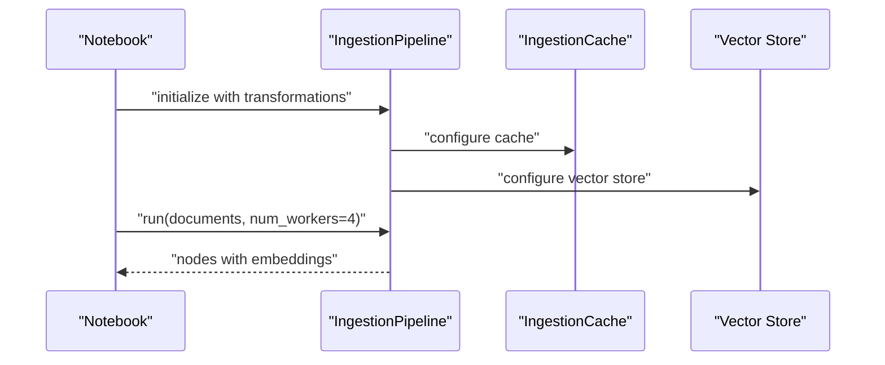

**Diagram sources**
- [advanced_ingestion_pipeline.ipynb](file://docs/examples/ingestion/advanced_ingestion_pipeline.ipynb#L182-L194)
- [parallel_execution_ingestion_pipeline.ipynb](file://docs/examples/ingestion/parallel_execution_ingestion_pipeline.ipynb#L176-L177)
- [ray_ingestion_pipeline.ipynb](file://docs/examples/ingestion/ray_ingestion_pipeline.ipynb#L165-L168)

**Section sources**
- [advanced_ingestion_pipeline.ipynb](file://docs/examples/ingestion/advanced_ingestion_pipeline.ipynb#L182-L194)
- [parallel_execution_ingestion_pipeline.ipynb](file://docs/examples/ingestion/parallel_execution_ingestion_pipeline.ipynb#L176-L177)
- [ray_ingestion_pipeline.ipynb](file://docs/examples/ingestion/ray_ingestion_pipeline.ipynb#L165-L168)

## Dependency Analysis
The ingestion pipeline integrates several subsystems:
- Schema and settings for nodes, documents, and embedding models
- Storage and vector store abstractions for persistence
- Instrumentation for tracing spans
- Reader configs for flexible data ingestion

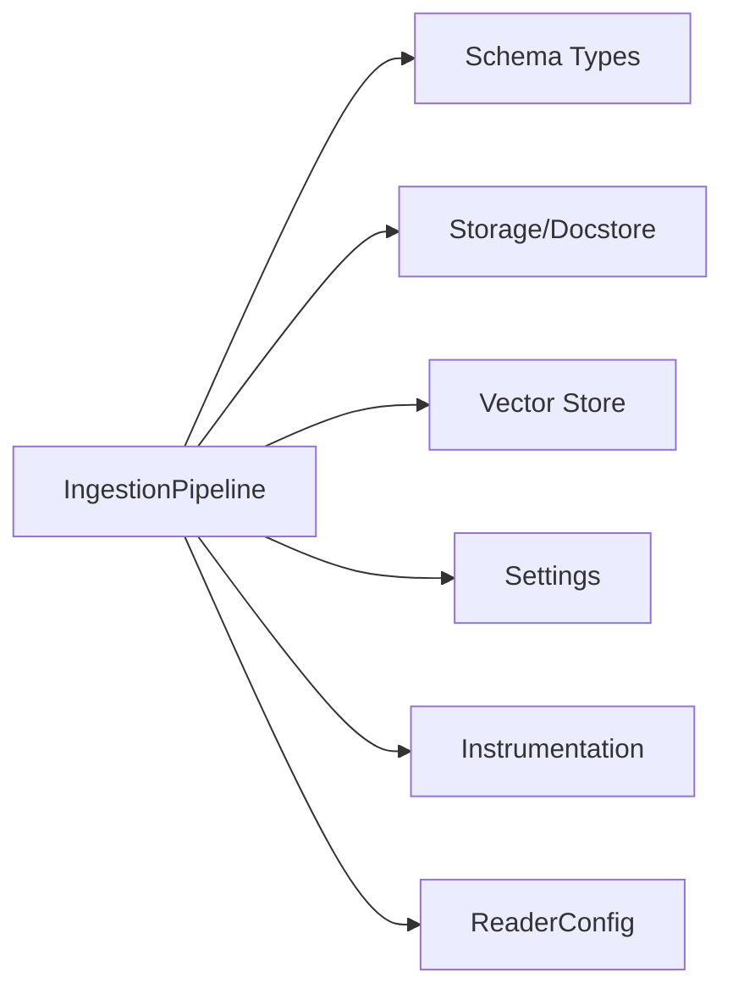

**Diagram sources**
- [pipeline.py](file://llama-index-core/llama_index/core/ingestion/pipeline.py#L26-L41)

**Section sources**
- [pipeline.py](file://llama-index-core/llama_index/core/ingestion/pipeline.py#L26-L41)

## Performance Considerations
- Enable caching to avoid recomputation of identical transformations on the same nodes
- Use parallel execution with num_workers tuned to CPU cores for throughput
- Prefer batching to reduce overhead in transformation calls
- Choose appropriate vector store and docstore backends for scale
- Monitor progress bars and logs for bottlenecks

[No sources needed since this section provides general guidance]

## Troubleshooting Guide
- If de-duplication does not behave as expected, verify docstore strategy and presence of vector store
- When encountering cache misses unexpectedly, confirm transformation configuration stability and cache collection names
- For parallel execution hangs, ensure cluster resources meet actor requirements and adjust worker counts
- If persistent paths are missing, verify cache and docstore persistence locations and filesystem permissions

**Section sources**
- [pipeline.py](file://llama-index-core/llama_index/core/ingestion/pipeline.py#L513-L528)
- [pipeline.py](file://llama-index-core/llama_index/core/ingestion/pipeline.py#L533-L537)
- [pipeline.py](file://llama-index-core/llama_index/core/ingestion/pipeline.py#L728-L733)

## Conclusion
The IngestionPipeline system offers a robust, extensible framework for orchestrating data ingestion workflows. By combining configurable data sources, transformation categories, caching, and data sinks, it supports efficient, scalable, and maintainable ingestion pipelines. Users can customize transformations, integrate external systems via API utilities, and optimize performance through caching and parallel execution.

[No sources needed since this section summarizes without analyzing specific files]

## Appendices

### API Reference Highlights
- IngestionPipeline
  - Constructor parameters: name, project_name, transformations, readers, documents, vector_store, cache, docstore, docstore_strategy, disable_cache
  - Methods: run, arun, persist, load
- IngestionCache
  - Methods: put, get, clear, persist, from_persist_path
- Data Sources
  - Enumerations and builders for readers and document groups
- Transformations
  - Enumerations and builders for node parsers and embeddings
- Data Sinks
  - Enumerations and builders for vector stores
- API Utilities
  - get_client, get_aclient for platform integration

**Section sources**
- [pipeline.py](file://llama-index-core/llama_index/core/ingestion/pipeline.py#L276-L303)
- [pipeline.py](file://llama-index-core/llama_index/core/ingestion/pipeline.py#L467-L575)
- [pipeline.py](file://llama-index-core/llama_index/core/ingestion/pipeline.py#L656-L779)
- [cache.py](file://llama-index-core/llama_index/core/ingestion/cache.py#L27-L79)
- [data_sources.py](file://llama-index-core/llama_index/core/ingestion/data_sources.py#L89-L438)
- [transformations.py](file://llama-index-core/llama_index/core/ingestion/transformations.py#L118-L342)
- [data_sinks.py](file://llama-index-core/llama_index/core/ingestion/data_sinks.py#L52-L147)
- [api_utils.py](file://llama-index-core/llama_index/core/ingestion/api_utils.py#L14-L50)