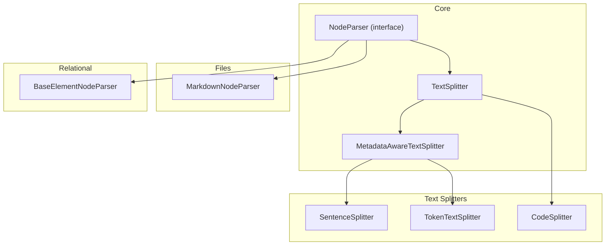
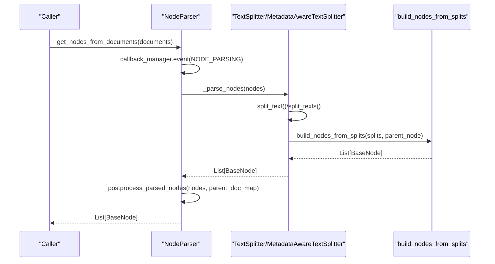
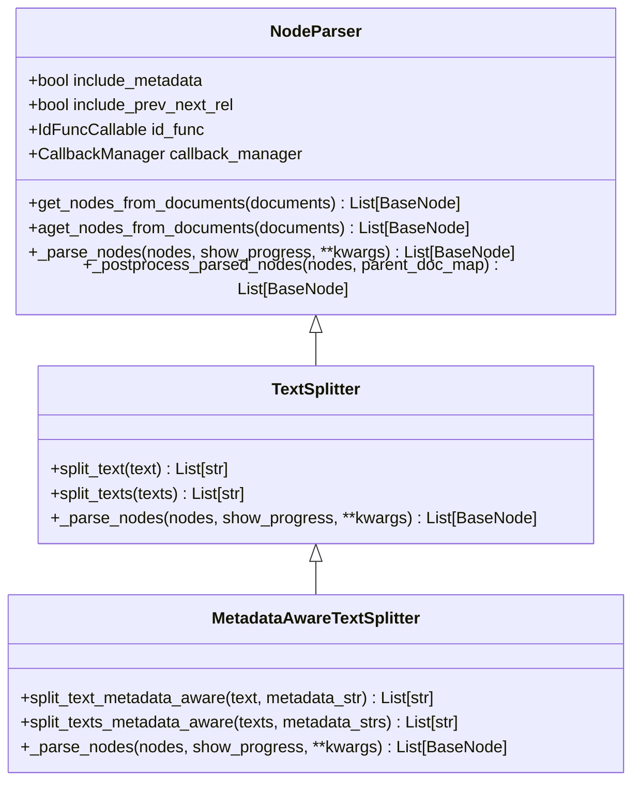
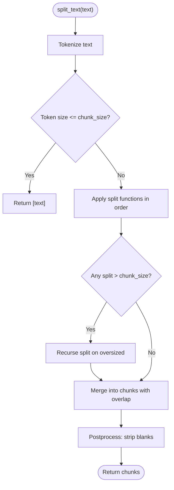
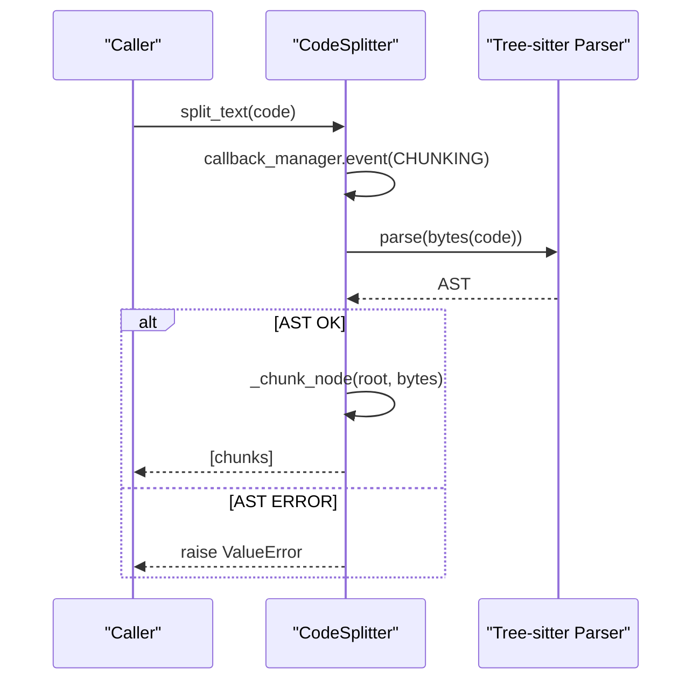
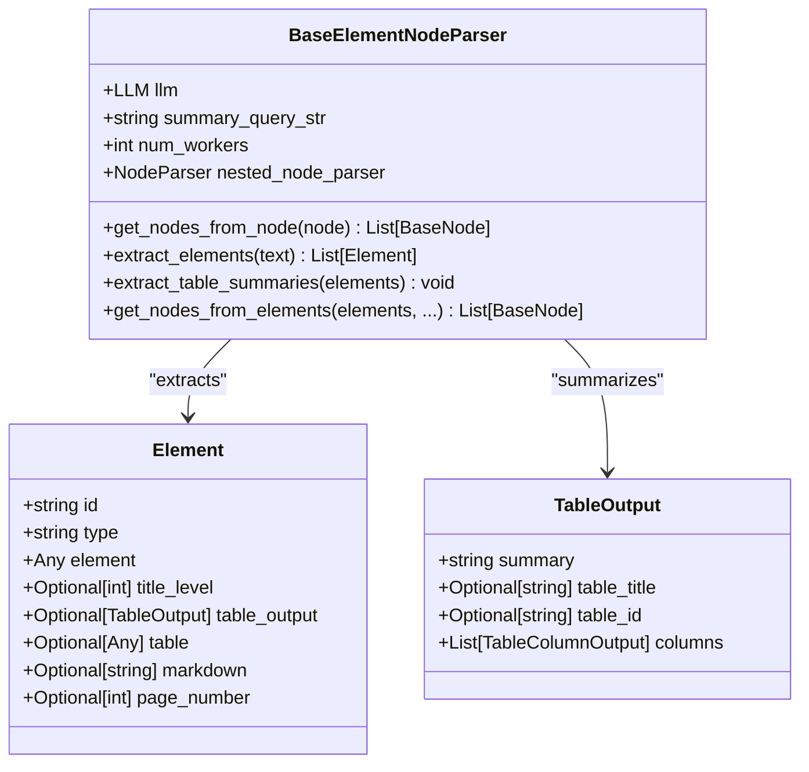
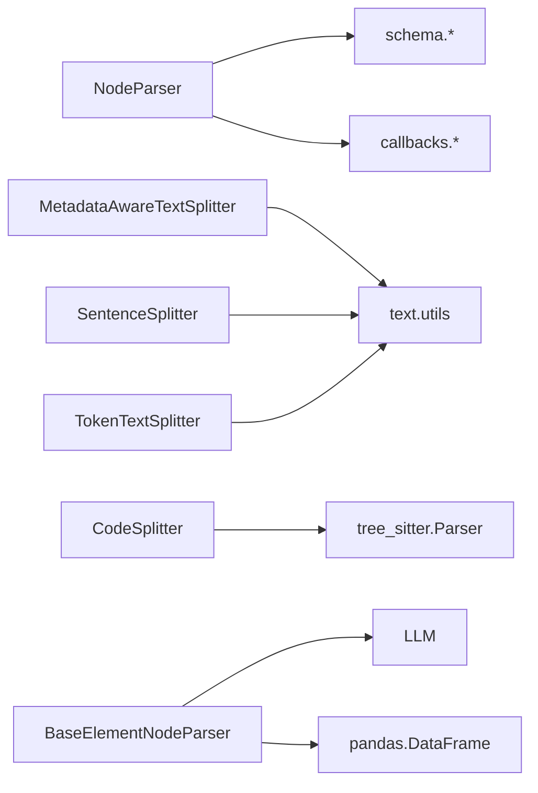

# Node Parsers

<cite>
**Referenced Files in This Document**
- [interface.py](file://llama-index-core/llama_index/core/node_parser/interface.py)
- [sentence.py](file://llama-index-core/llama_index/core/node_parser/text/sentence.py)
- [token.py](file://llama-index-core/llama_index/core/node_parser/text/token.py)
- [code.py](file://llama-index-core/llama_index/core/node_parser/text/code.py)
- [markdown.py](file://llama-index-core/llama_index/core/node_parser/file/markdown.py)
- [base_element.py](file://llama-index-core/llama_index/core/node_parser/relational/base_element.py)
- [utils.py](file://llama-index-core/llama_index/core/node_parser/text/utils.py)
- [__init__.py](file://llama-index-core/llama_index/core/node_parser/__init__.py)
- [test_node_parser.py](file://llama-index-core/tests/node_parser/test_node_parser.py)
</cite>

## Table of Contents
1. [Introduction](#introduction)
2. [Project Structure](#project-structure)
3. [Core Components](#core-components)
4. [Architecture Overview](#architecture-overview)
5. [Detailed Component Analysis](#detailed-component-analysis)
6. [Dependency Analysis](#dependency-analysis)
7. [Performance Considerations](#performance-considerations)
8. [Troubleshooting Guide](#troubleshooting-guide)
9. [Conclusion](#conclusion)
10. [Appendices](#appendices)

## Introduction
This document provides comprehensive API documentation for the Node Parser system in LlamaIndex. It focuses on the BaseNodeParser interface and its parse() method for converting raw text and structured content into structured nodes. It details built-in parser implementations, configuration options, chunking strategies, and metadata preservation. It also covers specialized parsers for files and relational data, guidance for building custom parsers and chaining them, performance characteristics, memory usage patterns, and optimization techniques.

## Project Structure
The Node Parser module is organized by domain:
- Core interface and base classes for parsing
- Text splitters for natural language and code
- File-specific parsers for Markdown, HTML, JSON, and simple files
- Relational parsers for extracting and structuring tables and text elements
- Utilities supporting text splitting and chunking

**Diagram sources**
- [interface.py](file://llama-index-core/llama_index/core/node_parser/interface.py#L50-L278)
- [sentence.py](file://llama-index-core/llama_index/core/node_parser/text/sentence.py#L34-L332)
- [token.py](file://llama-index-core/llama_index/core/node_parser/text/token.py#L22-L242)
- [code.py](file://llama-index-core/llama_index/core/node_parser/text/code.py#L19-L266)
- [markdown.py](file://llama-index-core/llama_index/core/node_parser/file/markdown.py#L14-L142)
- [base_element.py](file://llama-index-core/llama_index/core/node_parser/relational/base_element.py#L71-L512)

**Section sources**
- [__init__.py](file://llama-index-core/llama_index/core/node_parser/__init__.py#L1-L73)

## Core Components
- BaseNodeParser interface
  - Provides the primary parse workflow via get_nodes_from_documents() and its async counterpart.
  - Manages metadata inclusion, previous/next node relationships, and node ID generation.
  - Implements post-processing to enrich nodes with source relationships, character indices, and merged metadata.
- TextSplitter and MetadataAwareTextSplitter
  - TextSplitter defines split_text() and split_texts(), and implements _parse_nodes() to produce nodes from text splits.
  - MetadataAwareTextSplitter extends TextSplitter to reserve space for metadata when computing effective chunk size.

Key responsibilities:
- Convert raw content into structured nodes
- Preserve and merge metadata from parent documents and nodes
- Establish intra-document relationships (previous/next) when applicable
- Support asynchronous parsing for scalability

**Section sources**
- [interface.py](file://llama-index-core/llama_index/core/node_parser/interface.py#L50-L278)

## Architecture Overview
The parsing pipeline follows a consistent flow:
- Documents enter via get_nodes_from_documents()
- NodeParser delegates to _parse_nodes() to produce raw nodes
- _postprocess_parsed_nodes() enriches nodes with metadata, relationships, and character offsets
- CallbackManager emits events for chunking and node parsing

**Diagram sources**
- [interface.py](file://llama-index-core/llama_index/core/node_parser/interface.py#L157-L207)
- [interface.py](file://llama-index-core/llama_index/core/node_parser/interface.py#L218-L230)
- [interface.py](file://llama-index-core/llama_index/core/node_parser/interface.py#L84-L155)

## Detailed Component Analysis

### BaseNodeParser Interface
- Fields and behavior
  - include_metadata: controls merging of parent metadata into child nodes
  - include_prev_next_rel: toggles creation of PREVIOUS/NEXT relationships
  - id_func: function to generate node IDs
  - callback_manager: integrates with the global callback system
- Methods
  - get_nodes_from_documents(): orchestrates parsing and post-processing
  - _parse_nodes(): abstract method implemented by concrete parsers
  - _postprocess_parsed_nodes(): enriches nodes with source relationships, char indices, and merged metadata
  - Async variants: aget_nodes_from_documents() and acall()

**Diagram sources**
- [interface.py](file://llama-index-core/llama_index/core/node_parser/interface.py#L50-L278)

**Section sources**
- [interface.py](file://llama-index-core/llama_index/core/node_parser/interface.py#L50-L207)

### SentenceSplitter
- Purpose: sentence-aware chunking with overlap, preferring complete sentences and paragraphs.
- Key configuration
  - chunk_size: target token count per chunk
  - chunk_overlap: token overlap between adjacent chunks
  - separator: default word separator
  - paragraph_separator: paragraph delimiter
  - secondary_chunking_regex: fallback regex for phrase-level splitting
  - tokenizer and chunking_tokenizer_fn: tokenization functions
- Behavior
  - Uses a hierarchy of splitting strategies: paragraph → sentence tokenizer → regex → word → char
  - Merges splits into chunks respecting token budgets and overlap
  - Metadata-aware variant reserves space for metadata when computing effective chunk size

**Diagram sources**
- [sentence.py](file://llama-index-core/llama_index/core/node_parser/text/sentence.py#L176-L332)

**Section sources**
- [sentence.py](file://llama-index-core/llama_index/core/node_parser/text/sentence.py#L34-L332)
- [utils.py](file://llama-index-core/llama_index/core/node_parser/text/utils.py#L43-L125)

### TokenTextSplitter
- Purpose: token-based chunking with configurable separators and overlap.
- Key configuration
  - chunk_size, chunk_overlap
  - separator and backup_separators
  - keep_whitespaces: preserve leading/trailing whitespace when false
  - tokenizer
- Behavior
  - Splits by primary and backup separators, then by characters
  - Merges splits into chunks with overlap handling
  - Metadata-aware variant reserves space for metadata formatting

**Section sources**
- [token.py](file://llama-index-core/llama_index/core/node_parser/text/token.py#L22-L242)

### CodeSplitter
- Purpose: AST-based code chunking using Tree-sitter for language-specific structure preservation.
- Key configuration
  - language: programming language identifier
  - chunk_lines: lines per chunk
  - chunk_lines_overlap: overlapping lines between chunks
  - max_chars: maximum characters per chunk
  - count_mode: "char" or "token" sizing
  - max_tokens: token budget when count_mode="token"
  - parser: Tree-sitter parser instance
- Behavior
  - Parses code into an AST and traverses nodes to form chunks respecting size limits
  - Falls back to recursive chunking for oversized subtrees

**Diagram sources**
- [code.py](file://llama-index-core/llama_index/core/node_parser/text/code.py#L225-L266)

**Section sources**
- [code.py](file://llama-index-core/llama_index/core/node_parser/text/code.py#L19-L266)

### MarkdownNodeParser
- Purpose: header-based splitting for Markdown documents.
- Key configuration
  - header_path_separator: separator for header path metadata
- Behavior
  - Iterates lines, tracks header stack, and accumulates content per header level
  - Skips code blocks to avoid misinterpreting headers
  - Builds nodes with header_path metadata indicating the path to the section

**Section sources**
- [markdown.py](file://llama-index-core/llama_index/core/node_parser/file/markdown.py#L14-L142)

### BaseElementNodeParser (Relational)
- Purpose: extract and structure elements (tables and text) from documents, optionally summarize tables, and produce both TextNode and IndexNode pairs.
- Key configuration
  - llm: LLM for table summarization
  - summary_query_str: prompt for summarization
  - num_workers: concurrency for async jobs
  - nested_node_parser: fallback parser for text elements
- Behavior
  - Extracts elements from text
  - Summarizes tables asynchronously and assigns TableOutput to table elements
  - Builds IndexNode for table summaries and TextNode for serialized table content
  - Buffers text elements and applies nested_node_parser when present
  - Produces base nodes and objects mapping for downstream indexing

**Diagram sources**
- [base_element.py](file://llama-index-core/llama_index/core/node_parser/relational/base_element.py#L71-L512)

**Section sources**
- [base_element.py](file://llama-index-core/llama_index/core/node_parser/relational/base_element.py#L71-L512)

### Implementing Custom Node Parsers
To implement a custom parser:
- Subclass NodeParser or TextSplitter/MetadataAwareTextSplitter depending on your needs
- Implement _parse_nodes() to convert nodes into a list of BaseNode
- Optionally override get_nodes_from_documents() if you need custom pre/post processing
- Respect include_metadata, include_prev_next_rel, and id_func
- Use callback_manager to emit CHUNKING and NODE_PARSING events for observability

Guidelines:
- Use build_nodes_from_splits() to construct nodes from text splits
- Preserve parent document relationships and metadata when include_metadata is enabled
- Enforce chunk size constraints and overlap semantics appropriate to your domain
- Consider async support via _aparse_nodes() and aget_nodes_from_documents()

**Section sources**
- [interface.py](file://llama-index-core/llama_index/core/node_parser/interface.py#L50-L207)
- [interface.py](file://llama-index-core/llama_index/core/node_parser/interface.py#L218-L230)

### Combining Parsers in Chains
Common chaining patterns:
- Relational extraction first, then text chunking
  - Use BaseElementNodeParser to extract tables and text elements
  - Set nested_node_parser to a text splitter (e.g., SentenceSplitter) for text elements
- File parsing then chunking
  - Use MarkdownNodeParser to split Markdown into sections
  - Apply TokenTextSplitter or SentenceSplitter for further chunking
- Multi-pass chunking
  - Apply a coarse splitter (e.g., paragraph-level) followed by a fine splitter (e.g., sentence-level)

Best practices:
- Ensure metadata propagation by keeping include_metadata=True
- Configure chunk_overlap to maintain continuity across boundaries
- Use async variants for throughput when processing large corpora

**Section sources**
- [markdown.py](file://llama-index-core/llama_index/core/node_parser/file/markdown.py#L14-L142)
- [base_element.py](file://llama-index-core/llama_index/core/node_parser/relational/base_element.py#L362-L501)
- [sentence.py](file://llama-index-core/llama_index/core/node_parser/text/sentence.py#L34-L332)
- [token.py](file://llama-index-core/llama_index/core/node_parser/text/token.py#L22-L242)

## Dependency Analysis
- Internal dependencies
  - NodeParser depends on schema types (BaseNode, TextNode, Document), metadata modes, and relationship enums
  - TextSplitters depend on tokenization utilities and splitting helpers
  - Relational parser depends on LLM, SummaryIndex, and pandas for table serialization
- External dependencies
  - CodeSplitter depends on Tree-sitter and tree-sitter-language-pack
  - SentenceSplitter relies on NLTK punkt tokenizer via global helper

**Diagram sources**
- [interface.py](file://llama-index-core/llama_index/core/node_parser/interface.py#L19-L26)
- [sentence.py](file://llama-index-core/llama_index/core/node_parser/text/sentence.py#L14-L20)
- [token.py](file://llama-index-core/llama_index/core/node_parser/text/token.py#L10-L14)
- [code.py](file://llama-index-core/llama_index/core/node_parser/text/code.py#L93-L134)
- [base_element.py](file://llama-index-core/llama_index/core/node_parser/relational/base_element.py#L14-L24)

**Section sources**
- [__init__.py](file://llama-index-core/llama_index/core/node_parser/__init__.py#L1-L73)

## Performance Considerations
- Tokenization overhead
  - SentenceSplitter and TokenTextSplitter compute token lengths frequently; choose efficient tokenizers
  - Metadata-aware variants subtract metadata length from chunk size; ensure chunk_size accommodates metadata
- Memory usage patterns
  - Large documents are split into intermediate lists of splits and chunks; consider streaming or batching for very large inputs
  - Relational parser buffers text elements and serializes tables; manage nested_node_parser and chunk sizes accordingly
- Concurrency
  - BaseElementNodeParser supports async table summarization via run_jobs; tune num_workers for throughput
- Chunking strategies
  - Overlap improves continuity but increases node count; adjust chunk_overlap to balance recall and index size
  - CodeSplitter’s AST traversal is linear in the number of nodes; ensure language packs are installed for supported languages

[No sources needed since this section provides general guidance]

## Troubleshooting Guide
Common issues and resolutions:
- Metadata too large for chunk size
  - Increase chunk_size or reduce metadata; metadata-aware splitters will raise explicit errors/warnings when effective chunk size becomes too small
- Single split exceeds chunk size
  - SentenceSplitter raises an error for oversize tokens; consider reducing chunk_size or using a different splitter
- Code parsing failures
  - CodeSplitter raises ValueError if the AST indicates parsing errors; verify language support and install tree-sitter-language-pack
- Missing Tree-sitter parser
  - CodeSplitter requires a valid Parser; ensure parser initialization succeeds or pass a custom parser
- Empty nodes after parsing
  - BaseElementNodeParser filters empty nodes; verify nested_node_parser and element extraction logic

**Section sources**
- [sentence.py](file://llama-index-core/llama_index/core/node_parser/text/sentence.py#L156-L174)
- [token.py](file://llama-index-core/llama_index/core/node_parser/text/token.py#L117-L136)
- [code.py](file://llama-index-core/llama_index/core/node_parser/text/code.py#L114-L134)
- [code.py](file://llama-index-core/llama_index/core/node_parser/text/code.py#L262-L266)
- [base_element.py](file://llama-index-core/llama_index/core/node_parser/relational/base_element.py#L497-L501)

## Conclusion
The Node Parser system provides a flexible, extensible framework for transforming raw content into structured nodes. Built-in splitters offer robust strategies for text and code, while specialized parsers enable header-based Markdown splitting and relational table extraction with summarization. By leveraging metadata awareness, overlap-aware chunking, and async capabilities, users can optimize parsers for diverse document types and use cases.

[No sources needed since this section summarizes without analyzing specific files]

## Appendices

### API Reference Highlights
- NodeParser
  - Methods: get_nodes_from_documents(), aget_nodes_from_documents(), _parse_nodes(), _postprocess_parsed_nodes()
  - Fields: include_metadata, include_prev_next_rel, id_func, callback_manager
- TextSplitter
  - Methods: split_text(), split_texts(), _parse_nodes()
- MetadataAwareTextSplitter
  - Methods: split_text_metadata_aware(), split_texts_metadata_aware()
- SentenceSplitter
  - Fields: chunk_size, chunk_overlap, separator, paragraph_separator, secondary_chunking_regex
- TokenTextSplitter
  - Fields: chunk_size, chunk_overlap, separator, backup_separators, keep_whitespaces
- CodeSplitter
  - Fields: language, chunk_lines, chunk_lines_overlap, max_chars, count_mode, max_tokens
- MarkdownNodeParser
  - Fields: header_path_separator
- BaseElementNodeParser
  - Fields: llm, summary_query_str, num_workers, nested_node_parser

**Section sources**
- [interface.py](file://llama-index-core/llama_index/core/node_parser/interface.py#L50-L278)
- [sentence.py](file://llama-index-core/llama_index/core/node_parser/text/sentence.py#L34-L150)
- [token.py](file://llama-index-core/llama_index/core/node_parser/text/token.py#L22-L111)
- [code.py](file://llama-index-core/llama_index/core/node_parser/text/code.py#L19-L160)
- [markdown.py](file://llama-index-core/llama_index/core/node_parser/file/markdown.py#L14-L46)
- [base_element.py](file://llama-index-core/llama_index/core/node_parser/relational/base_element.py#L71-L115)