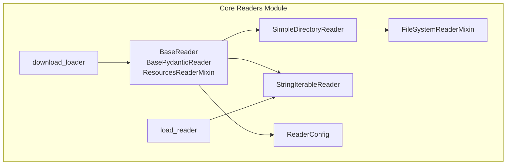
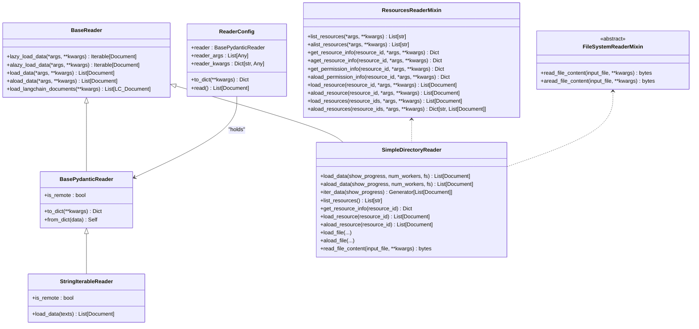
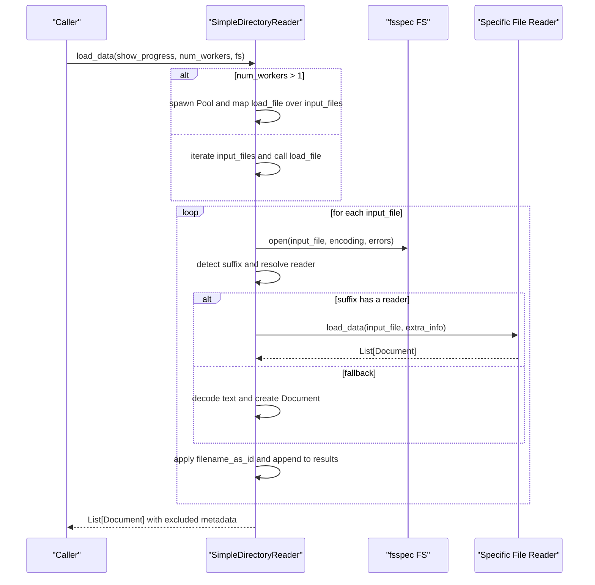
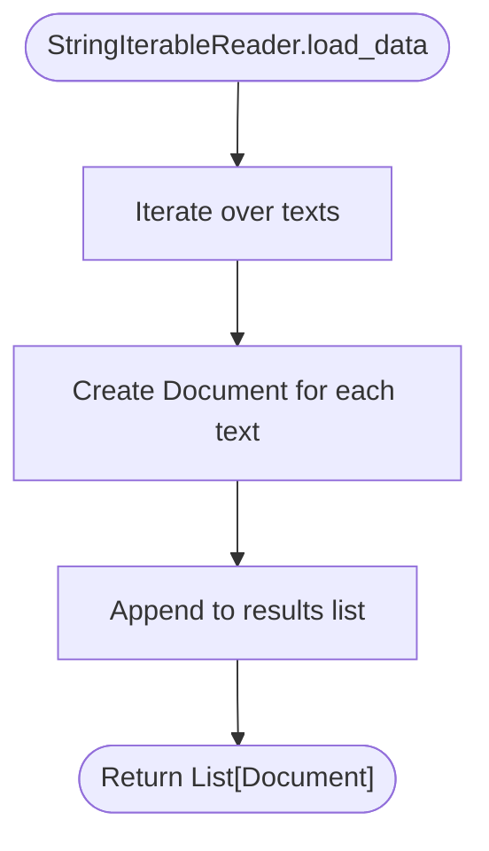
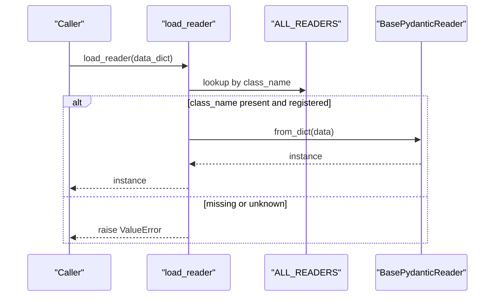
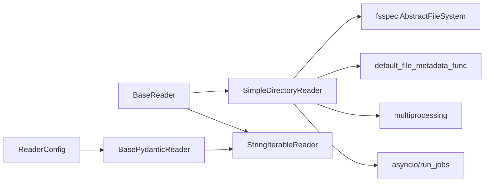

# Reader Interface

<cite>
**Referenced Files in This Document**
- [base.py](file://llama-index-core/llama_index/core/readers/base.py)
- [__init__.py](file://llama-index-core/llama_index/core/readers/__init__.py)
- [file/base.py](file://llama-index-core/llama_index/core/readers/file/base.py)
- [string_iterable.py](file://llama-index-core/llama_index/core/readers/string_iterable.py)
- [loading.py](file://llama-index-core/llama_index/core/readers/loading.py)
- [download.py](file://llama-index-core/llama_index/core/readers/download.py)
- [test_load_reader.py](file://llama-index-core/tests/readers/test_load_reader.py)
</cite>

## Table of Contents
1. [Introduction](#introduction)
2. [Project Structure](#project-structure)
3. [Core Components](#core-components)
4. [Architecture Overview](#architecture-overview)
5. [Detailed Component Analysis](#detailed-component-analysis)
6. [Dependency Analysis](#dependency-analysis)
7. [Performance Considerations](#performance-considerations)
8. [Troubleshooting Guide](#troubleshooting-guide)
9. [Conclusion](#conclusion)
10. [Appendices](#appendices)

## Introduction
This document provides comprehensive API documentation for the Reader interface system. It covers the BaseReader abstract class and its interface methods, the ReaderConfig configuration container, and built-in implementations including SimpleDirectoryReader for file system access, StringIterableReader for text processing, and FileSystemReaderMixin for file system operations. It also includes guidance on implementing custom readers by extending BaseReader, initialization parameters, data loading methods, error handling patterns, performance optimization, and memory management.

## Project Structure
The Reader interface system resides under the core readers module and exposes public APIs via the readers package init. The primary building blocks are:
- Base abstractions and configuration: BaseReader, BasePydanticReader, ResourcesReaderMixin, ReaderConfig
- Built-in readers: SimpleDirectoryReader, StringIterableReader
- Mixins and helpers: FileSystemReaderMixin, file metadata utilities, default file suffix mapping
- Loading and discovery: load_reader, download_loader

**Diagram sources**
- [base.py](file://llama-index-core/llama_index/core/readers/base.py#L19-L250)
- [file/base.py](file://llama-index-core/llama_index/core/readers/file/base.py#L208-L873)
- [string_iterable.py](file://llama-index-core/llama_index/core/readers/string_iterable.py#L9-L44)
- [loading.py](file://llama-index-core/llama_index/core/readers/loading.py#L1-L27)
- [download.py](file://llama-index-core/llama_index/core/readers/download.py#L1-L81)

**Section sources**
- [__init__.py](file://llama-index-core/llama_index/core/readers/__init__.py#L14-L32)

## Core Components
This section documents the foundational interfaces and configuration classes.

- BaseReader: Defines synchronous and asynchronous data loading APIs and optional lazy-loading support. Provides convenience methods to convert to LangChain document format.
- BasePydanticReader: Extends BaseReader and BaseComponent, adding serialization support and a flag indicating remote vs local data source.
- ResourcesReaderMixin: Adds resource-centric operations such as listing resources, fetching resource info, permission info, and loading single or multiple resources.
- ReaderConfig: Encapsulates a reader instance along with positional and keyword arguments to invoke load_data, enabling serialization/deserialization and programmatic invocation.

Key methods and responsibilities:
- BaseReader
  - load_data, aload_data: synchronous and asynchronous loading of data into Document list
  - lazy_load_data, alazy_load_data: lazy iterator of Documents
  - load_langchain_documents: converts Documents to LangChain format
- BasePydanticReader
  - Serialization via to_dict/from_dict
  - is_remote field to indicate remote data source
- ResourcesReaderMixin
  - list_resources, alist_resources
  - get_resource_info, aget_resource_info
  - get_permission_info, aget_permission_info
  - load_resource, aload_resource
  - load_resources, aload_resources
- ReaderConfig
  - to_dict: serializes reader, args, kwargs, and class name
  - read: invokes reader.load_data with stored arguments

**Section sources**
- [base.py](file://llama-index-core/llama_index/core/readers/base.py#L19-L250)

## Architecture Overview
The Reader architecture centers on BaseReader and BasePydanticReader, with ReaderConfig orchestrating reader invocations. Built-in readers extend these abstractions:
- SimpleDirectoryReader: Implements BaseReader and ResourcesReaderMixin, leveraging FileSystemReaderMixin for file content reading and a dynamic file extractor registry for different file types.
- StringIterableReader: Implements BasePydanticReader to transform an iterable of strings into Documents.

**Diagram sources**
- [base.py](file://llama-index-core/llama_index/core/readers/base.py#L19-L250)
- [file/base.py](file://llama-index-core/llama_index/core/readers/file/base.py#L208-L873)
- [string_iterable.py](file://llama-index-core/llama_index/core/readers/string_iterable.py#L9-L44)

## Detailed Component Analysis

### BaseReader and BasePydanticReader
- Purpose: Provide a unified interface for loading data into Document objects, with optional lazy iteration and LangChain compatibility.
- Asynchronous pattern: Methods like aload_data wrap synchronous counterparts using thread-execution to avoid blocking the event loop.
- Serialization: BasePydanticReader integrates with BaseComponent to support to_dict/from_dict, enabling persistence and reconstruction.

Initialization and usage patterns:
- Extend BaseReader to implement load_data and optionally lazy_load_data.
- Extend BasePydanticReader for readers that should support serialization and remote/local distinction.

Error handling:
- BaseReader raises NotImplementedError for lazy_load_data by default, signaling implementers to override.
- BasePydanticReader adds serialization-related fields and behavior.

**Section sources**
- [base.py](file://llama-index-core/llama_index/core/readers/base.py#L19-L56)

### ResourcesReaderMixin
- Purpose: Standardize resource-centric operations across readers that operate on named resources (e.g., files, channels, pages).
- Methods:
  - Listing: list_resources, alist_resources
  - Info retrieval: get_resource_info, aget_resource_info
  - Permissions: get_permission_info, aget_permission_info
  - Loading: load_resource, aload_resource; load_resources, aload_resources
- Async behavior: Methods default to threaded execution via asyncio.to_thread, encouraging subclasses to override with native async implementations.

**Section sources**
- [base.py](file://llama-index-core/llama_index/core/readers/base.py#L59-L221)

### ReaderConfig
- Purpose: Encapsulate a reader instance and its arguments to enable serialization, reconstruction, and programmatic invocation.
- Fields:
  - reader: BasePydanticReader instance
  - reader_args: positional arguments for load_data
  - reader_kwargs: keyword arguments for load_data
- Methods:
  - to_dict: serializes reader, args, kwargs, and class name
  - read: executes reader.load_data with stored arguments

Usage example paths:
- Construct ReaderConfig with a reader instance and arguments, then call read to obtain Documents.

**Section sources**
- [base.py](file://llama-index-core/llama_index/core/readers/base.py#L223-L250)

### SimpleDirectoryReader
- Purpose: Load documents from a directory or explicit file list, automatically selecting appropriate file readers based on suffixes or a provided file_extractor mapping.
- Key capabilities:
  - File discovery with filtering (hidden, empty, required extensions, exclusion globs, recursion)
  - Metadata extraction via default or custom callable
  - Per-file or fallback text loading
  - Resource-centric operations (list_resources, get_resource_info, load_resource)
  - Parallel loading with configurable workers and progress indication
  - Iterative loading via iter_data
- Initialization parameters:
  - input_dir, input_files, exclude, exclude_hidden, exclude_empty, encoding, errors, recursive, filename_as_id, required_exts, file_extractor, num_files_limit, file_metadata, raise_on_error, fs
- File system abstraction:
  - Uses fsspec AbstractFileSystem; defaults to LocalFileSystem
  - FileSystemReaderMixin provides read_file_content for raw bytes
- Error handling:
  - For unsupported file types with missing dependencies, raises ImportError explicitly
  - For other exceptions, either raises or skips depending on raise_on_error, printing a message
- Performance:
  - Multiprocessing-based parallelism when num_workers > 1
  - Async loading via asyncio.gather and run_jobs
  - Metadata exclusion for embedding and LLM prompts to reduce overhead

**Diagram sources**
- [file/base.py](file://llama-index-core/llama_index/core/readers/file/base.py#L718-L834)

**Section sources**
- [file/base.py](file://llama-index-core/llama_index/core/readers/file/base.py#L208-L873)

### FileSystemReaderMixin
- Purpose: Provide a consistent interface for reading raw file bytes, enabling readers to handle both local and remote file systems uniformly.
- Methods:
  - read_file_content: abstract method to read bytes from a Path
  - aread_file_content: default wrapper; subclasses can override for native async

**Section sources**
- [file/base.py](file://llama-index-core/llama_index/core/readers/file/base.py#L38-L66)

### StringIterableReader
- Purpose: Convert an iterable of strings into a list of Documents.
- Initialization:
  - is_remote defaults to False for local text processing
- Method:
  - load_data(texts): creates a Document per string

**Diagram sources**
- [string_iterable.py](file://llama-index-core/llama_index/core/readers/string_iterable.py#L37-L44)

**Section sources**
- [string_iterable.py](file://llama-index-core/llama_index/core/readers/string_iterable.py#L9-L44)

### Reader Loading and Discovery
- load_reader: Deserializes a reader from a dictionary using class_name and reconstructs it via from_dict. Supports only registered readers (currently StringIterableReader).
- download_loader: Deprecated function to fetch loaders from external sources; encourages installing packages directly.

**Diagram sources**
- [loading.py](file://llama-index-core/llama_index/core/readers/loading.py#L11-L27)

**Section sources**
- [loading.py](file://llama-index-core/llama_index/core/readers/loading.py#L1-L27)
- [download.py](file://llama-index-core/llama_index/core/readers/download.py#L19-L81)
- [test_load_reader.py](file://llama-index-core/tests/readers/test_load_reader.py#L8-L27)

## Dependency Analysis
- BaseReader and BasePydanticReader define the core contract for all readers.
- SimpleDirectoryReader depends on:
  - fsspec for filesystem abstraction
  - dynamic file reader selection via _try_loading_included_file_formats
  - default metadata extraction via default_file_metadata_func
  - multiprocessing and asyncio for parallel and async loading
- StringIterableReader depends on BasePydanticReader and Document.
- ReaderConfig depends on BasePydanticReader for serialization and invocation.

**Diagram sources**
- [base.py](file://llama-index-core/llama_index/core/readers/base.py#L19-L250)
- [file/base.py](file://llama-index-core/llama_index/core/readers/file/base.py#L208-L873)
- [string_iterable.py](file://llama-index-core/llama_index/core/readers/string_iterable.py#L9-L44)
- [loading.py](file://llama-index-core/llama_index/core/readers/loading.py#L1-L27)

**Section sources**
- [file/base.py](file://llama-index-core/llama_index/core/readers/file/base.py#L208-L873)
- [base.py](file://llama-index-core/llama_index/core/readers/base.py#L19-L250)
- [string_iterable.py](file://llama-index-core/llama_index/core/readers/string_iterable.py#L9-L44)
- [loading.py](file://llama-index-core/llama_index/core/readers/loading.py#L1-L27)

## Performance Considerations
- Parallel loading:
  - SimpleDirectoryReader supports multiprocessing-based parallelism when num_workers > 1. The implementation caps workers to CPU count and warns if exceeded.
  - Async loading uses asyncio.gather or run_jobs to process files concurrently.
- Memory management:
  - Use iter_data to stream batches of Documents instead of loading all at once.
  - Exclude non-essential metadata from embedding and LLM prompts via _exclude_metadata to reduce memory footprint.
- I/O efficiency:
  - Prefer fsspec-compatible filesystems for remote storage to leverage optimized I/O.
  - Use file_metadata functions judiciously; avoid heavy computation per file.
- Error handling impact:
  - With raise_on_error=False, failures are logged and skipped; consider enabling raise_on_error in production to fail fast on critical errors.

[No sources needed since this section provides general guidance]

## Troubleshooting Guide
Common issues and resolutions:
- No files found in directory:
  - Ensure input_dir exists and contains files matching filters (required_exts, exclude patterns, recursive setting).
- Unsupported file type or missing dependencies:
  - ImportError is raised for missing file reader dependencies; install the corresponding package or provide a compatible reader via file_extractor.
- Encoding/decoding errors:
  - Adjust encoding and errors parameters; use errors="ignore" or "strict" based on tolerance.
- Excessive workers:
  - num_workers exceeding CPU count triggers a warning; cap workers to CPU count for stability.
- Remote filesystem connectivity:
  - Verify fs configuration and credentials for non-local filesystems.

**Section sources**
- [file/base.py](file://llama-index-core/llama_index/core/readers/file/base.py#L270-L295)
- [file/base.py](file://llama-index-core/llama_index/core/readers/file/base.py#L614-L626)
- [file/base.py](file://llama-index-core/llama_index/core/readers/file/base.py#L754-L758)

## Conclusion
The Reader interface system provides a robust, extensible foundation for ingesting diverse data sources into Document objects. BaseReader and BasePydanticReader define a consistent contract, while SimpleDirectoryReader and StringIterableReader offer practical implementations. ReaderConfig enables serialization and programmatic invocation. By following the patterns documented here—implementing required methods, leveraging mixins, handling errors gracefully, and optimizing for performance—you can build custom readers tailored to your data pipeline needs.

[No sources needed since this section summarizes without analyzing specific files]

## Appendices

### Implementing a Custom Reader
Steps to implement a custom reader:
1. Choose a base:
   - Extend BaseReader for minimal interface compliance
   - Extend BasePydanticReader for serialization support
2. Implement required methods:
   - load_data (and optionally lazy_load_data)
   - For async support, implement aload_data and alazy_load_data
3. Integrate with existing patterns:
   - Use ResourcesReaderMixin for resource-centric readers
   - Use FileSystemReaderMixin for file-based readers
4. Configure and test:
   - Provide sensible defaults for parameters
   - Validate error handling and edge cases
   - Test both sync and async loading paths

Example reference paths:
- Minimal BaseReader implementation: [base.py](file://llama-index-core/llama_index/core/readers/base.py#L19-L56)
- Resource-centric mixin usage: [base.py](file://llama-index-core/llama_index/core/readers/base.py#L59-L221)
- File system operations: [file/base.py](file://llama-index-core/llama_index/core/readers/file/base.py#L38-L66)
- StringIterableReader as a simple example: [string_iterable.py](file://llama-index-core/llama_index/core/readers/string_iterable.py#L9-L44)

**Section sources**
- [base.py](file://llama-index-core/llama_index/core/readers/base.py#L19-L221)
- [file/base.py](file://llama-index-core/llama_index/core/readers/file/base.py#L38-L66)
- [string_iterable.py](file://llama-index-core/llama_index/core/readers/string_iterable.py#L9-L44)