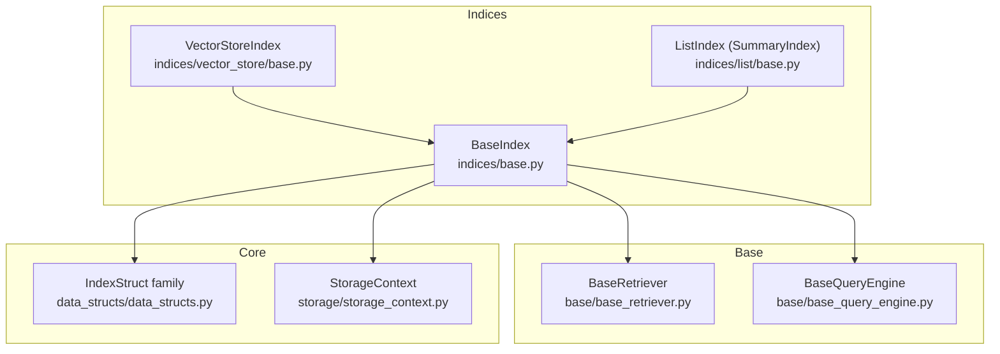
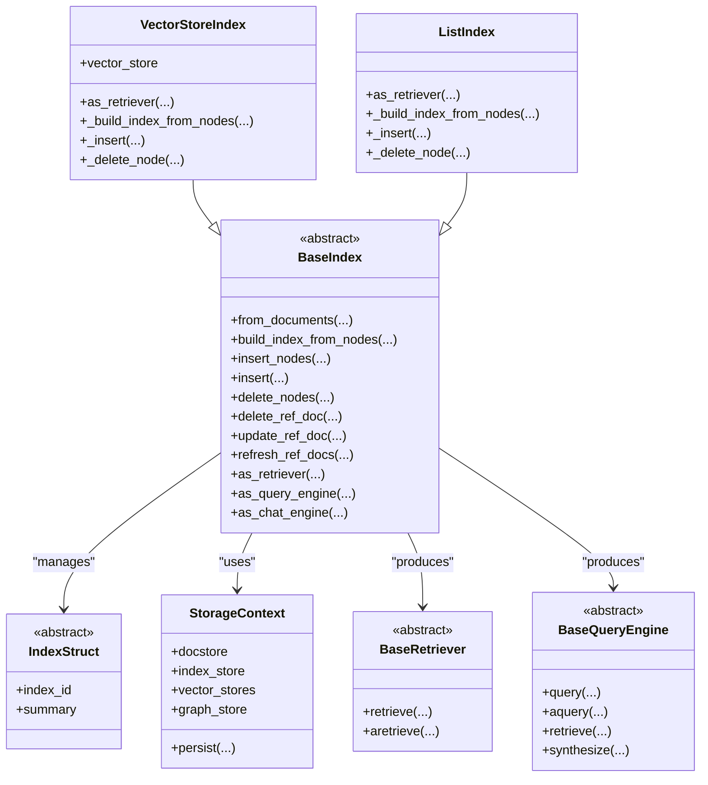
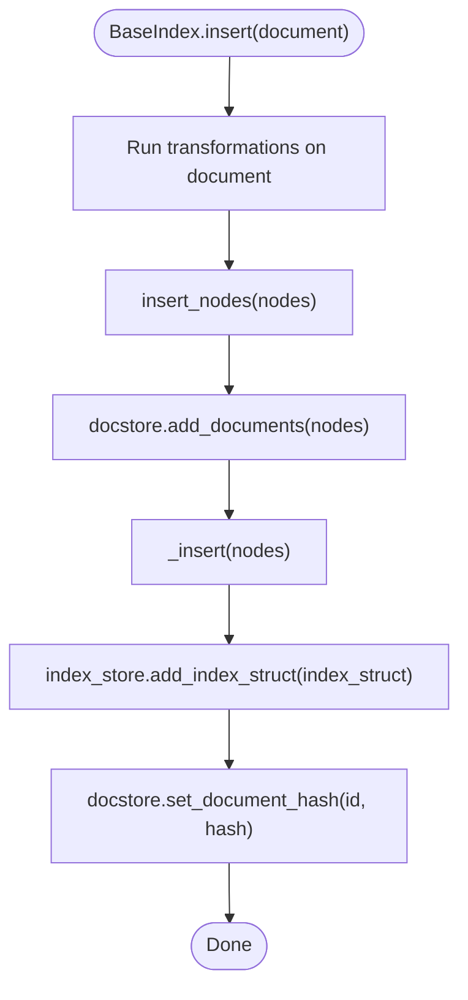
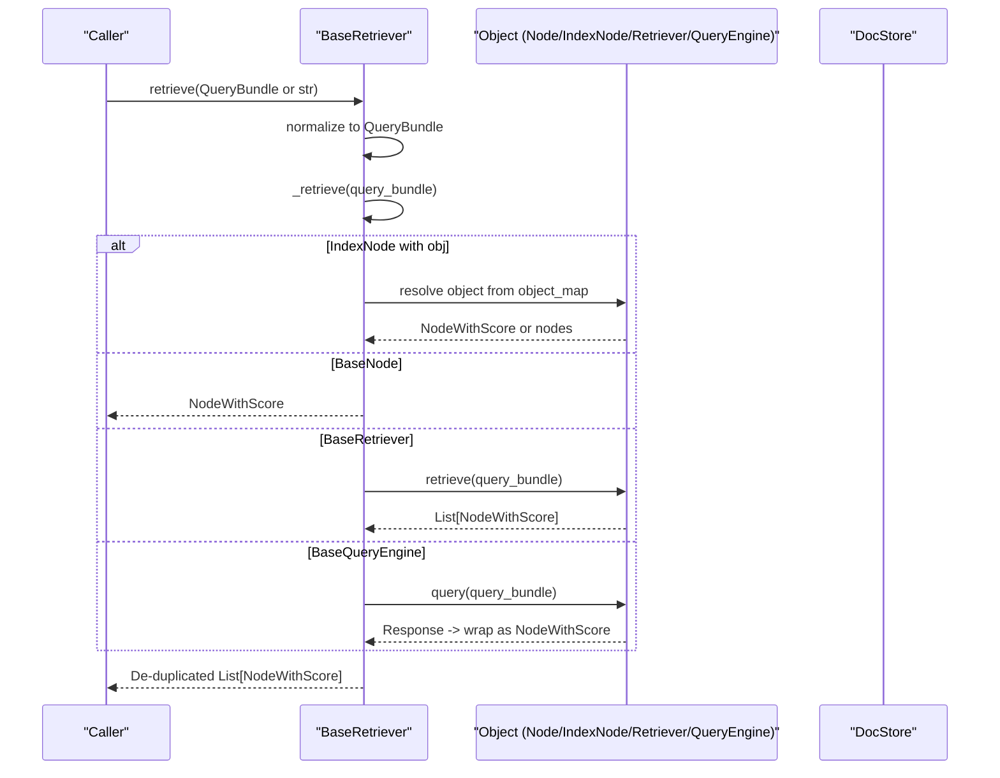
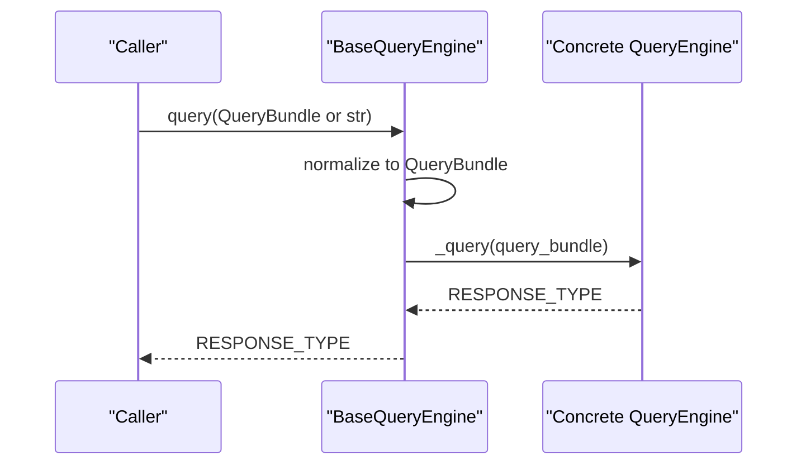
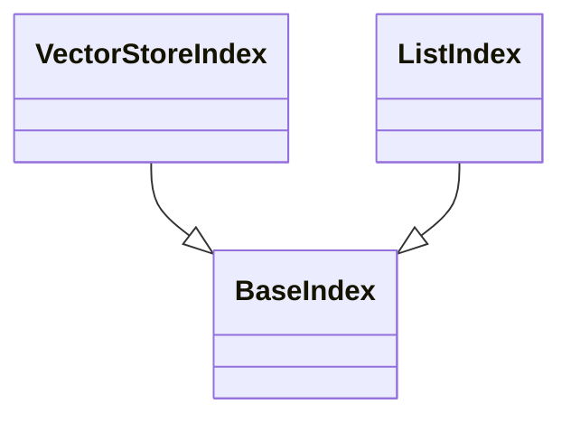
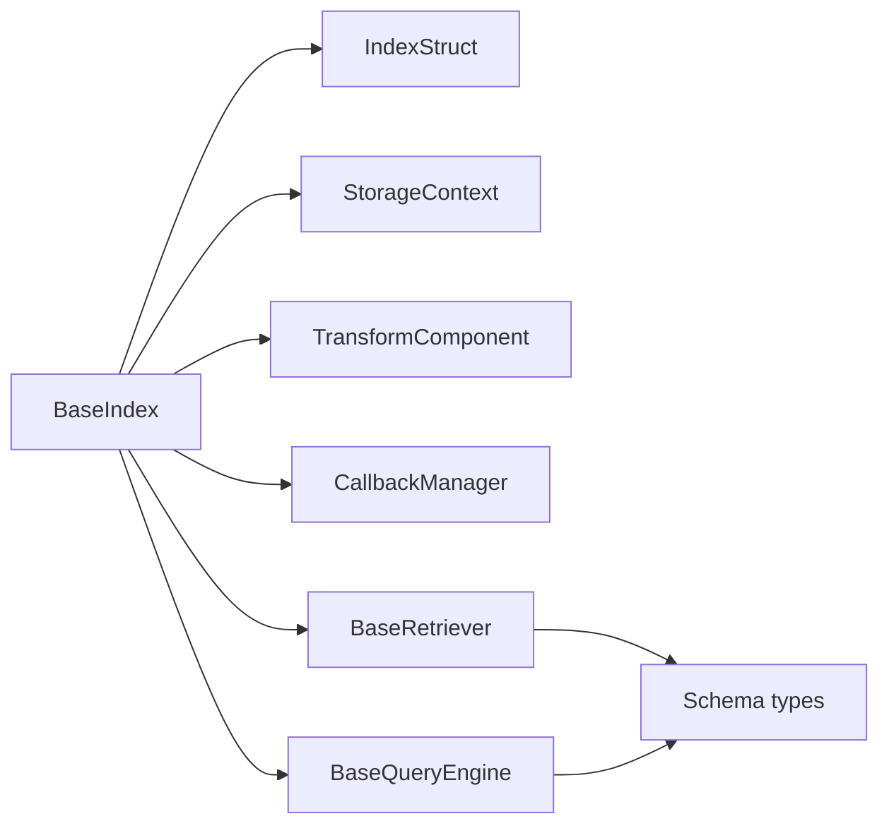

# Base Index Classes

<cite>
**Referenced Files in This Document**
- [base.py](file://llama-index-core/llama_index/core/indices/base.py)
- [base_retriever.py](file://llama-index-core/llama_index/core/base/base_retriever.py)
- [base_query_engine.py](file://llama-index-core/llama_index/core/base/base_query_engine.py)
- [data_structs.py](file://llama-index-core/llama_index/core/data_structs/data_structs.py)
- [storage_context.py](file://llama-index-core/llama_index/core/storage/storage_context.py)
- [base.py](file://llama-index-core/llama_index/core/indices/vector_store/base.py)
- [base.py](file://llama-index-core/llama_index/core/indices/list/base.py)
</cite>

## Table of Contents
1. [Introduction](#introduction)
2. [Project Structure](#project-structure)
3. [Core Components](#core-components)
4. [Architecture Overview](#architecture-overview)
5. [Detailed Component Analysis](#detailed-component-analysis)
6. [Dependency Analysis](#dependency-analysis)
7. [Performance Considerations](#performance-considerations)
8. [Troubleshooting Guide](#troubleshooting-guide)
9. [Conclusion](#conclusion)

## Introduction
This document provides comprehensive API documentation for the Base Index Classes that form the foundation of the indexing subsystem in the LlamaIndex framework. It focuses on the fundamental interfaces BaseIndex, BaseRetriever, and BaseQueryEngine, detailing their roles, common methods for index initialization, node insertion, querying, and persistence. It also explains the inheritance hierarchy, how different index types extend these base classes, and outlines the standard patterns for index lifecycle management. Practical guidance is included for implementing custom index types by extending the base classes.

## Project Structure
The Base Index Classes live primarily under the indices and base packages:
- BaseIndex and index data structures are defined under indices.
- BaseRetriever and BaseQueryEngine are defined under base.
- Persistence and storage abstractions are defined under storage and data_structs.

**Diagram sources**
- [base.py](file://llama-index-core/llama_index/core/indices/base.py#L25-L596)
- [base.py](file://llama-index-core/llama_index/core/indices/vector_store/base.py#L36-L490)
- [base.py](file://llama-index-core/llama_index/core/indices/list/base.py#L29-L157)
- [base_retriever.py](file://llama-index-core/llama_index/core/base/base_retriever.py#L34-L275)
- [base_query_engine.py](file://llama-index-core/llama_index/core/base/base_query_engine.py#L22-L94)
- [data_structs.py](file://llama-index-core/llama_index/core/data_structs/data_structs.py#L21-L200)
- [storage_context.py](file://llama-index-core/llama_index/core/storage/storage_context.py#L52-L200)

**Section sources**
- [base.py](file://llama-index-core/llama_index/core/indices/base.py#L1-L596)
- [base_retriever.py](file://llama-index-core/llama_index/core/base/base_retriever.py#L1-L275)
- [base_query_engine.py](file://llama-index-core/llama_index/core/base/base_query_engine.py#L1-L94)
- [data_structs.py](file://llama-index-core/llama_index/core/data_structs/data_structs.py#L1-L200)
- [storage_context.py](file://llama-index-core/llama_index/core/storage/storage_context.py#L1-L200)

## Core Components
This section summarizes the primary base classes and their responsibilities.

- BaseIndex
  - Purpose: The foundational index abstraction that manages index construction, node insertion/deletion/update, and conversion to retriever/query/chat engines.
  - Key capabilities:
    - Initialization from nodes, documents, or an existing index_struct.
    - Building index from nodes and persisting index_struct to index_store.
    - Insert/update/delete nodes and documents with optional docstore updates.
    - Async variants for insert/update/delete and refresh operations.
    - Expose ref_doc_info mapping and provide as_retriever/as_query_engine/as_chat_engine.
  - Abstract methods to implement in subclasses:
    - _build_index_from_nodes(nodes, **build_kwargs) -> IndexStruct
    - _insert(nodes, **insert_kwargs) -> None
    - _delete_node(node_id, **delete_kwargs) -> None
    - ref_doc_info property
    - as_retriever(**kwargs) -> BaseRetriever

- BaseRetriever
  - Purpose: Retrieves nodes given a query, supporting recursive retrieval across nested objects and async retrieval.
  - Key capabilities:
    - retrieve(str_or_query_bundle) -> List[NodeWithScore]
    - aretrieve(str_or_query_bundle) -> List[NodeWithScore]
    - Internal helpers handle recursive retrieval across IndexNode.object_map and typed objects (BaseNode, BaseRetriever, BaseQueryEngine).
  - Abstract method to implement:
    - _retrieve(query_bundle) -> List[NodeWithScore]
    - Optionally override _aretrieve for async behavior.

- BaseQueryEngine
  - Purpose: Executes queries and returns a response type, with optional synthesis and retrieval support.
  - Key capabilities:
    - query(str_or_query_bundle) -> RESPONSE_TYPE
    - aquery(str_or_query_bundle) -> RESPONSE_TYPE
    - retrieve(...) and synthesize(...) raise NotImplementedError by default unless overridden.
  - Abstract methods to implement:
    - _query(query_bundle) -> RESPONSE_TYPE
    - _aquery(query_bundle) -> RESPONSE_TYPE

- IndexStruct family
  - Purpose: Lightweight, serializable index metadata containers used by BaseIndex subclasses.
  - Examples:
    - IndexList: ordered list of node IDs.
    - IndexDict: mapping of vector-store IDs to node IDs.
    - IndexGraph: tree/graph structure with parent-child relationships.
    - KeywordTable: keyword-to-node-id mapping.

- StorageContext
  - Purpose: Aggregates storage backends (docstore, index_store, vector_store(s), graph_store, property graph store) and supports persistence to disk or remote filesystems.

**Section sources**
- [base.py](file://llama-index-core/llama_index/core/indices/base.py#L25-L596)
- [base_retriever.py](file://llama-index-core/llama_index/core/base/base_retriever.py#L34-L275)
- [base_query_engine.py](file://llama-index-core/llama_index/core/base/base_query_engine.py#L22-L94)
- [data_structs.py](file://llama-index-core/llama_index/core/data_structs/data_structs.py#L21-L200)
- [storage_context.py](file://llama-index-core/llama_index/core/storage/storage_context.py#L52-L200)

## Architecture Overview
The Base Index Classes define a layered architecture:
- BaseIndex orchestrates index lifecycle and integrates with storage backends.
- Subclasses implement concrete index behaviors (e.g., VectorStoreIndex, ListIndex).
- BaseRetriever and BaseQueryEngine provide retrieval and querying interfaces used by higher-level engines.
- IndexStruct encapsulates index metadata/state.
- StorageContext provides unified access to persistent stores.

**Diagram sources**
- [base.py](file://llama-index-core/llama_index/core/indices/base.py#L25-L596)
- [base.py](file://llama-index-core/llama_index/core/indices/vector_store/base.py#L36-L490)
- [base.py](file://llama-index-core/llama_index/core/indices/list/base.py#L29-L157)
- [base_retriever.py](file://llama-index-core/llama_index/core/base/base_retriever.py#L34-L275)
- [base_query_engine.py](file://llama-index-core/llama_index/core/base/base_query_engine.py#L22-L94)
- [data_structs.py](file://llama-index-core/llama_index/core/data_structs/data_structs.py#L21-L200)
- [storage_context.py](file://llama-index-core/llama_index/core/storage/storage_context.py#L52-L200)

## Detailed Component Analysis

### BaseIndex
BaseIndex is the central abstraction for all index types. It handles:
- Construction from nodes, documents, or an existing index_struct.
- Index building and persistence of index_struct to index_store.
- Node lifecycle operations: insert, delete, update, refresh.
- Conversion to retriever/query/chat engines.

Key methods and patterns:
- Initialization and validation:
  - Validates that either nodes, objects, or index_struct is provided.
  - Rejects legacy Document lists passed as nodes.
  - Initializes storage_context and object_map.
- Building index from nodes:
  - Adds nodes to docstore and delegates to subclass’s _build_index_from_nodes.
- Node operations:
  - insert_nodes: adds to docstore, performs subclass-specific insert, persists index_struct.
  - delete_nodes: deletes from index and optionally docstore, persists index_struct.
  - update_ref_doc: delete then insert for a document.
  - refresh_ref_docs: conditionally insert/update based on document hash.
- Async operations:
  - ainsert_nodes, adelete_nodes, aupdate_ref_doc, arefresh_ref_docs.
- Engine conversions:
  - as_retriever: returns a BaseRetriever.
  - as_query_engine: returns a BaseQueryEngine wrapping the retriever.
  - as_chat_engine: returns a chat engine variant based on mode.

Abstract methods to implement in subclasses:
- _build_index_from_nodes(nodes, **build_kwargs) -> IndexStruct
- _insert(nodes, **insert_kwargs) -> None
- _delete_node(node_id, **delete_kwargs) -> None
- ref_doc_info property
- as_retriever(**kwargs) -> BaseRetriever

**Diagram sources**
- [base.py](file://llama-index-core/llama_index/core/indices/base.py#L229-L241)

**Section sources**
- [base.py](file://llama-index-core/llama_index/core/indices/base.py#L25-L596)

### BaseRetriever
BaseRetriever defines the retrieval interface:
- retrieve/aretrieve accept a string or QueryBundle and return a list of NodeWithScore.
- Handles recursive retrieval across IndexNode.object_map and typed objects (BaseNode, BaseRetriever, BaseQueryEngine).
- Provides internal helpers to deduplicate nodes and manage verbosity.

Abstract method to implement:
- _retrieve(query_bundle) -> List[NodeWithScore]
- Optionally override _aretrieve for async behavior.

**Diagram sources**
- [base_retriever.py](file://llama-index-core/llama_index/core/base/base_retriever.py#L185-L254)
- [base_retriever.py](file://llama-index-core/llama_index/core/base/base_retriever.py#L68-L184)

**Section sources**
- [base_retriever.py](file://llama-index-core/llama_index/core/base/base_retriever.py#L34-L275)

### BaseQueryEngine
BaseQueryEngine defines the query interface:
- query/aquery accept a string or QueryBundle and return a response of type RESPONSE_TYPE.
- retrieve and synthesize raise NotImplementedError by default unless overridden.

Abstract methods to implement:
- _query(query_bundle) -> RESPONSE_TYPE
- _aquery(query_bundle) -> RESPONSE_TYPE

**Diagram sources**
- [base_query_engine.py](file://llama-index-core/llama_index/core/base/base_query_engine.py#L38-L94)

**Section sources**
- [base_query_engine.py](file://llama-index-core/llama_index/core/base/base_query_engine.py#L22-L94)

### Concrete Index Types and Inheritance
- VectorStoreIndex extends BaseIndex and uses an underlying vector store:
  - Integrates embedding model resolution and batched embedding computation.
  - Provides as_retriever returning a VectorIndexRetriever.
  - Implements _build_index_from_nodes and _insert for vector store-backed indices.
- ListIndex (SummaryIndex) extends BaseIndex:
  - Stores nodes in a sequential list.
  - Provides multiple retriever modes (default, embedding, LLM).
  - Implements _build_index_from_nodes and _delete_node for list semantics.

**Diagram sources**
- [base.py](file://llama-index-core/llama_index/core/indices/vector_store/base.py#L36-L490)
- [base.py](file://llama-index-core/llama_index/core/indices/list/base.py#L29-L157)

**Section sources**
- [base.py](file://llama-index-core/llama_index/core/indices/vector_store/base.py#L36-L490)
- [base.py](file://llama-index-core/llama_index/core/indices/list/base.py#L29-L157)

### Implementing Custom Index Types
To implement a custom index type:
1. Choose an appropriate IndexStruct subtype (e.g., IndexList, IndexDict, or define a new one).
2. Subclass BaseIndex[YourIndexStructType].
3. Implement the abstract methods:
   - _build_index_from_nodes(nodes, **build_kwargs) -> YourIndexStructType
   - _insert(nodes, **insert_kwargs) -> None
   - _delete_node(node_id, **delete_kwargs) -> None
   - ref_doc_info property
   - as_retriever(**kwargs) -> BaseRetriever
4. Optionally override lifecycle methods (insert_nodes, delete_nodes, update_ref_doc, refresh_ref_docs) if you need specialized behavior.
5. Integrate with StorageContext and docstore/index_store as needed.

Patterns to follow:
- Always add nodes to docstore before delegating to _build_index_from_nodes or _insert.
- Persist index_struct after modifications by calling index_store.add_index_struct.
- Respect object_map for IndexNode objects to avoid serialization overhead.
- Provide meaningful as_retriever implementation tailored to your index semantics.

**Section sources**
- [base.py](file://llama-index-core/llama_index/core/indices/base.py#L178-L490)
- [data_structs.py](file://llama-index-core/llama_index/core/data_structs/data_structs.py#L21-L200)

## Dependency Analysis
The Base Index Classes depend on several core modules:
- IndexStruct family for index metadata/state.
- StorageContext for unified access to docstore, index_store, vector_store(s), graph_store.
- TransformComponent for document-to-node transformations during index construction.
- CallbackManager for instrumentation and tracing.
- Schema types (NodeWithScore, QueryBundle, etc.) for query and node representation.

**Diagram sources**
- [base.py](file://llama-index-core/llama_index/core/indices/base.py#L1-L596)
- [data_structs.py](file://llama-index-core/llama_index/core/data_structs/data_structs.py#L1-L200)
- [storage_context.py](file://llama-index-core/llama_index/core/storage/storage_context.py#L1-L200)
- [base_retriever.py](file://llama-index-core/llama_index/core/base/base_retriever.py#L1-L275)
- [base_query_engine.py](file://llama-index-core/llama_index/core/base/base_query_engine.py#L1-L94)

**Section sources**
- [base.py](file://llama-index-core/llama_index/core/indices/base.py#L1-L596)
- [data_structs.py](file://llama-index-core/llama_index/core/data_structs/data_structs.py#L1-L200)
- [storage_context.py](file://llama-index-core/llama_index/core/storage/storage_context.py#L1-L200)

## Performance Considerations
- Batch operations: VectorStoreIndex supports batched embedding computation and insertion to reduce overhead.
- Async operations: Prefer async variants (ainsert_nodes, arefresh_ref_docs, aretrieve) for I/O-bound workloads.
- Deduplication: BaseRetriever removes duplicate nodes based on hash and ref_doc_id to avoid redundant processing.
- Transformations: Use transformations judiciously; heavy transformations can increase index construction time.
- Storage backends: Choose appropriate vector stores and graph stores for scale and latency requirements.

[No sources needed since this section provides general guidance]

## Troubleshooting Guide
Common issues and resolutions:
- Invalid constructor arguments:
  - Ensure exactly one of nodes, objects, or index_struct is provided.
  - Do not pass Document objects as nodes; use from_documents instead.
- Missing or incompatible storage backends:
  - Verify StorageContext is configured with compatible stores.
  - Persist storage context to disk if using default in-memory stores.
- Retrieval failures:
  - Confirm as_retriever is implemented by the index and returns a compatible retriever.
  - Check object_map for IndexNode entries if recursive retrieval is expected.
- Query engine limitations:
  - If retrieve or synthesize are called on a BaseQueryEngine that does not support them, NotImplementedError will be raised; implement _query/_aquery and override retrieve/synthesize as needed.

**Section sources**
- [base.py](file://llama-index-core/llama_index/core/indices/base.py#L49-L62)
- [base_retriever.py](file://llama-index-core/llama_index/core/base/base_retriever.py#L185-L254)
- [base_query_engine.py](file://llama-index-core/llama_index/core/base/base_query_engine.py#L62-L85)

## Conclusion
The Base Index Classes provide a robust, extensible foundation for building diverse index types in LlamaIndex. By adhering to the documented interfaces and lifecycle patterns—initialization, node operations, retrieval, querying, and persistence—you can implement custom indices that integrate seamlessly with the broader ecosystem. Use the provided abstractions to focus on index-specific logic while leveraging shared infrastructure for storage, transformations, and instrumentation.