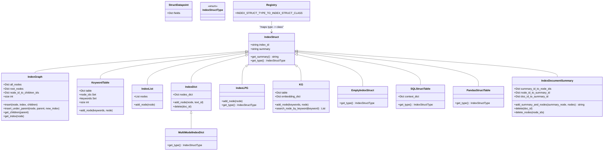

# Data Structures

<cite>
**Referenced Files in This Document**
- [data_structs.py](file://llama-index-core/llama_index/core/data_structs/data_structs.py)
- [table.py](file://llama-index-core/llama_index/core/data_structs/table.py)
- [document_summary.py](file://llama-index-core/llama_index/core/data_structs/document_summary.py)
- [struct_type.py](file://llama-index-core/llama_index/core/data_structs/struct_type.py)
- [registry.py](file://llama-index-core/llama_index/core/data_structs/registry.py)
- [__init__.py](file://llama-index-core/llama_index/core/data_structs/__init__.py)
- [keyval_index_store.py](file://llama-index-core/llama_index/core/storage/index_store/keyval_index_store.py)
- [simple_index_store.py](file://llama-index-core/llama_index/core/storage/index_store/simple_index_store.py)
- [schema.py](file://llama-index-core/llama_index/core/schema.py)
</cite>

## Table of Contents
1. [Introduction](#introduction)
2. [Project Structure](#project-structure)
3. [Core Components](#core-components)
4. [Architecture Overview](#architecture-overview)
5. [Detailed Component Analysis](#detailed-component-analysis)
6. [Dependency Analysis](#dependency-analysis)
7. [Performance Considerations](#performance-considerations)
8. [Troubleshooting Guide](#troubleshooting-guide)
9. [Conclusion](#conclusion)

## Introduction
This document describes the internal data structures used for indexing in the LlamaIndex core. It focuses on the data representation classes such as IndexStruct, Table variants, DocumentSummary, and related structural components. It explains how these structures map to different index types, how they are persisted, and how serialization/deserialization works. It also covers validation rules, structural relationships, and practical examples for working with raw data structures and converting between formats.

## Project Structure
The indexing data structures live under the data_structs module and are integrated with the index store subsystem for persistence. The module exports the primary index struct classes and table-related structures, while a registry maps index struct types to concrete classes.

**Diagram sources**
- [data_structs.py](file://llama-index-core/llama_index/core/data_structs/data_structs.py#L1-L280)
- [table.py](file://llama-index-core/llama_index/core/data_structs/table.py#L1-L45)
- [document_summary.py](file://llama-index-core/llama_index/core/data_structs/document_summary.py#L1-L75)
- [struct_type.py](file://llama-index-core/llama_index/core/data_structs/struct_type.py#L1-L117)
- [registry.py](file://llama-index-core/llama_index/core/data_structs/registry.py#L1-L33)
- [__init__.py](file://llama-index-core/llama_index/core/data_structs/__init__.py#L1-L22)
- [keyval_index_store.py](file://llama-index-core/llama_index/core/storage/index_store/keyval_index_store.py#L1-L143)
- [simple_index_store.py](file://llama-index-core/llama_index/core/storage/index_store/simple_index_store.py#L1-L77)
- [schema.py](file://llama-index-core/llama_index/core/schema.py#L1-L200)

**Section sources**
- [__init__.py](file://llama-index-core/llama_index/core/data_structs/__init__.py#L1-L22)
- [struct_type.py](file://llama-index-core/llama_index/core/data_structs/struct_type.py#L1-L117)

## Core Components
This section introduces the principal data structures and their roles.

- IndexStruct: Base class for all index structures. Provides a unique identifier and optional summary, plus a type method to identify the index type.
- IndexGraph: Tree/graph structure for hierarchical indices. Maintains mappings from node indices to node IDs, root nodes, and parent-child relationships.
- KeywordTable: Keyword-to-node-id mapping for keyword-based indices.
- IndexList: Ordered list of node IDs for list-style indices.
- IndexDict: Dictionary mapping vector-store IDs to node IDs for vector indices.
- MultiModelIndexDict: Variant for multimodal vector stores.
- IndexLPG: Placeholder for Linked Property Graph indices.
- KG: Knowledge Graph structure with keyword table and optional embedding storage.
- EmptyIndexStruct: Sentinel for empty indices.
- SQLStructTable and PandasStructTable: Structured table variants for SQL and pandas-backed structured stores.
- StructDatapoint: Container for structured outputs with field mappings.
- IndexDocumentSummary: Mapping between summary nodes and document nodes for document-summary indices.

These structures are registered to their corresponding IndexStructType values via a registry, enabling dynamic reconstruction during persistence.

**Section sources**
- [data_structs.py](file://llama-index-core/llama_index/core/data_structs/data_structs.py#L21-L280)
- [table.py](file://llama-index-core/llama_index/core/data_structs/table.py#L11-L45)
- [document_summary.py](file://llama-index-core/llama_index/core/data_structs/document_summary.py#L11-L75)
- [struct_type.py](file://llama-index-core/llama_index/core/data_structs/struct_type.py#L6-L117)
- [registry.py](file://llama-index-core/llama_index/core/data_structs/registry.py#L20-L32)

## Architecture Overview
The index structures are persisted using a key-value index store. The store serializes index structs to JSON using helper functions and stores them under a namespaced collection. Deserialization reconstructs the appropriate struct type using the registry.

**Diagram sources**
- [keyval_index_store.py](file://llama-index-core/llama_index/core/storage/index_store/keyval_index_store.py#L38-L89)
- [simple_index_store.py](file://llama-index-core/llama_index/core/storage/index_store/simple_index_store.py#L19-L77)

## Detailed Component Analysis

### IndexStruct and Derived Types
IndexStruct is the foundational data structure with:
- index_id: Unique identifier generated per instance.
- summary: Optional textual summary.
- get_summary(): Raises if summary is not set.
- get_type(): Abstract method implemented by subclasses to return the IndexStructType.

Derived types include:
- IndexGraph: Hierarchical tree/graph representation with mappings for nodes, roots, and children.
- KeywordTable: Keyword-to-node-id sets for keyword indices.
- IndexList: Ordered list of node IDs.
- IndexDict: Vector-store ID to node ID mapping.
- MultiModelIndexDict: Multimodal variant of the dictionary index.
- IndexLPG: Placeholder for linked property graph indices.
- KG: Keyword table plus optional embedding storage for knowledge graphs.
- EmptyIndexStruct: Empty sentinel.

Validation and behavior:
- IndexGraph.insert and insert_under_parent enforce parent-child relationships and maintain indices.
- KeywordTable.add_node ensures uniqueness of node IDs per keyword.
- IndexList.add_node appends node IDs in order.
- IndexDict.add_node returns a vector ID and supports deletion.
- MultiModelIndexDict extends IndexDict semantics for multimodal stores.
- KG.search_node_by_keyword returns node IDs for a given keyword.

Serialization and persistence:
- IndexStruct inherits from a JSON-mixin enabling serialization to/from JSON.
- The registry maps IndexStructType to concrete classes for reconstruction.

**Section sources**
- [data_structs.py](file://llama-index-core/llama_index/core/data_structs/data_structs.py#L21-L280)
- [struct_type.py](file://llama-index-core/llama_index/core/data_structs/struct_type.py#L6-L117)
- [registry.py](file://llama-index-core/llama_index/core/data_structs/registry.py#L20-L32)

### Structured Stores: SQLStructTable and PandasStructTable
Structured stores encapsulate structured outputs:
- StructDatapoint: Holds a field map for structured outputs.
- SQLStructTable: Adds a context dictionary for SQL-backed structured stores.
- PandasStructTable: Pandas-backed structured store.

These are registered under IndexStructType.SQL and IndexStructType.PANDAS respectively.

**Section sources**
- [table.py](file://llama-index-core/llama_index/core/data_structs/table.py#L11-L45)
- [struct_type.py](file://llama-index-core/llama_index/core/data_structs/struct_type.py#L57-L110)
- [registry.py](file://llama-index-core/llama_index/core/data_structs/registry.py#L25-L32)

### Document Summary Index: IndexDocumentSummary
IndexDocumentSummary maintains bidirectional mappings:
- summary_id_to_node_ids: Maps a summary node ID to a list of document node IDs.
- node_id_to_summary_id: Maps each document node ID back to its summary node ID.
- doc_id_to_summary_id: Maps a document ID to its summary node ID.

Behavior:
- add_summary_and_nodes validates that nodes reference a document ID and populates mappings.
- delete removes a document’s summary and associated nodes.
- delete_nodes removes specific nodes from their summary mapping.

Validation:
- Raises an error if a node lacks a document reference when building the summary index.

**Section sources**
- [document_summary.py](file://llama-index-core/llama_index/core/data_structs/document_summary.py#L11-L75)

### Persistence and Serialization
Persistence relies on a key-value index store:
- KVIndexStore stores index structs by their index_id and uses JSON serialization helpers.
- SimpleIndexStore provides convenience constructors for filesystem-based persistence and dictionary-based serialization.

Serialization pipeline:
- index_struct_to_json converts an IndexStruct to JSON.
- json_to_index_struct reconstructs the struct from JSON using the registered type.

**Diagram sources**
- [keyval_index_store.py](file://llama-index-core/llama_index/core/storage/index_store/keyval_index_store.py#L38-L89)
- [simple_index_store.py](file://llama-index-core/llama_index/core/storage/index_store/simple_index_store.py#L36-L77)

**Section sources**
- [keyval_index_store.py](file://llama-index-core/llama_index/core/storage/index_store/keyval_index_store.py#L15-L143)
- [simple_index_store.py](file://llama-index-core/llama_index/core/storage/index_store/simple_index_store.py#L19-L77)

## Dependency Analysis
The following diagram shows how data structures relate to types, registry, and persistence:

**Diagram sources**
- [data_structs.py](file://llama-index-core/llama_index/core/data_structs/data_structs.py#L21-L280)
- [table.py](file://llama-index-core/llama_index/core/data_structs/table.py#L11-L45)
- [document_summary.py](file://llama-index-core/llama_index/core/data_structs/document_summary.py#L11-L75)
- [struct_type.py](file://llama-index-core/llama_index/core/data_structs/struct_type.py#L6-L117)
- [registry.py](file://llama-index-core/llama_index/core/data_structs/registry.py#L20-L32)

**Section sources**
- [registry.py](file://llama-index-core/llama_index/core/data_structs/registry.py#L20-L32)
- [struct_type.py](file://llama-index-core/llama_index/core/data_structs/struct_type.py#L6-L117)

## Performance Considerations
- IndexGraph: Insertions and lookups depend on dictionary sizes; maintaining node_id_to_index avoids repeated scans.
- KeywordTable: Keyword-to-node-id sets ensure O(1) average-time membership checks; union operations across sets scale with total node IDs.
- IndexList: Appending to a list is O(1); ordering is maintained implicitly by insertion order.
- IndexDict/MultiModelIndexDict: Dictionary lookups are O(1) average-case; deletion removes a single mapping.
- KG: Keyword table operations mirror KeywordTable; embedding_dict is optional and adds constant overhead per entry.
- Structured stores: SQLStructTable and PandasStructTable add minimal overhead; performance depends on underlying store efficiency.
- Persistence: JSON serialization/deserialization is efficient for moderate-sized index structs; batch operations can reduce overhead.

[No sources needed since this section provides general guidance]

## Troubleshooting Guide
Common issues and resolutions:
- Missing summary: Calling get_summary() on an IndexStruct without a summary raises an error. Ensure summary is set before retrieval.
- Keyword lookup failure: Searching for a keyword in KG or KeywordTable that does not exist returns an empty result; verify preprocessing and indexing steps.
- Document reference missing: Adding summaries to IndexDocumentSummary requires nodes to have a document reference; otherwise, a ValueError is raised.
- Persistence failures: Ensure the KV store is initialized and writable; verify the collection namespace and path when using SimpleIndexStore.
- Type mismatches: Confirm the correct IndexStructType is used; the registry maps types to classes, so mismatched types can cause reconstruction errors.

**Section sources**
- [data_structs.py](file://llama-index-core/llama_index/core/data_structs/data_structs.py#L28-L32)
- [document_summary.py](file://llama-index-core/llama_index/core/data_structs/document_summary.py#L34-L38)
- [keyval_index_store.py](file://llama-index-core/llama_index/core/storage/index_store/keyval_index_store.py#L60-L78)

## Conclusion
The indexing data structures provide a cohesive foundation for representing diverse index types. They are strongly typed via IndexStructType, persistable through a key-value store with JSON serialization, and validated at runtime to ensure correctness. Understanding these structures enables effective development, debugging, and extension of indexing capabilities.