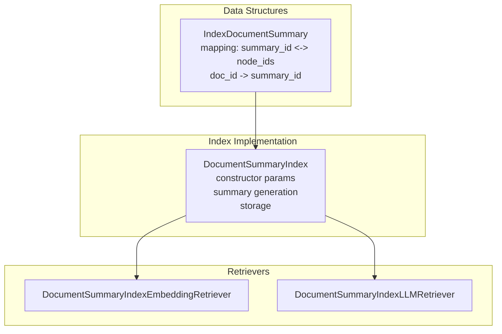
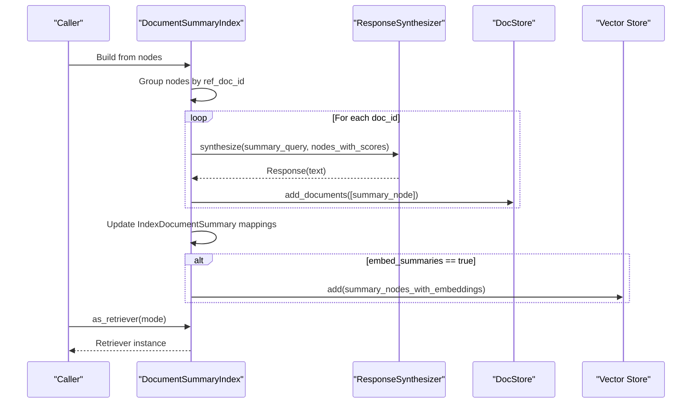
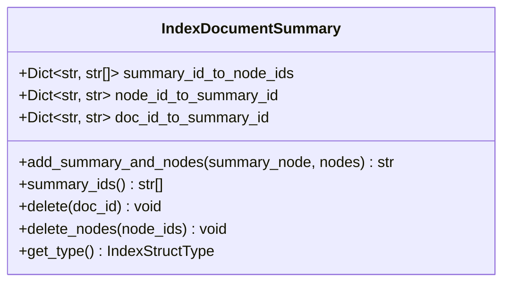
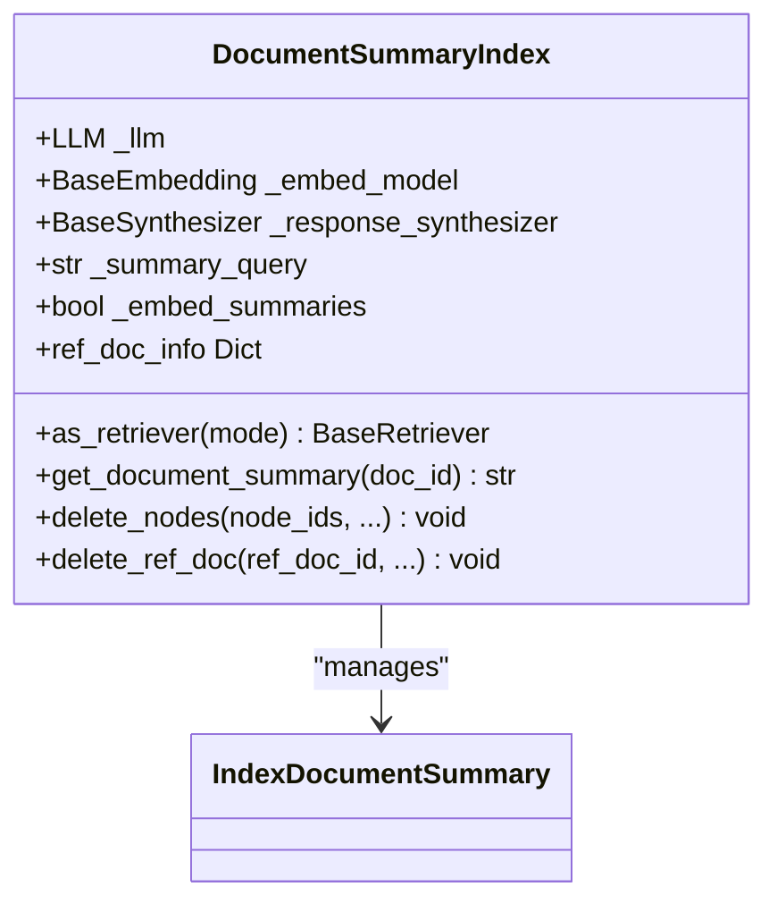
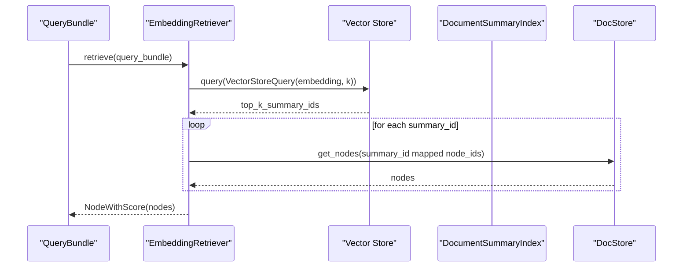
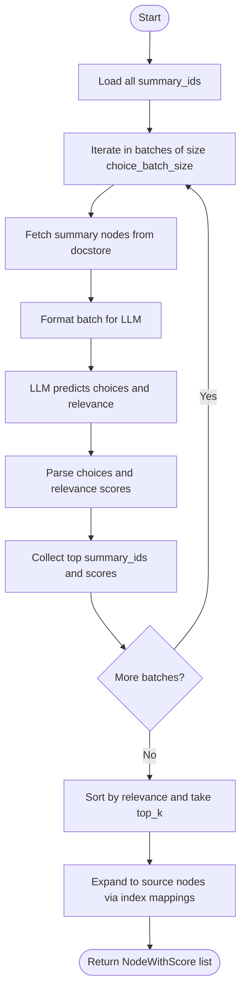
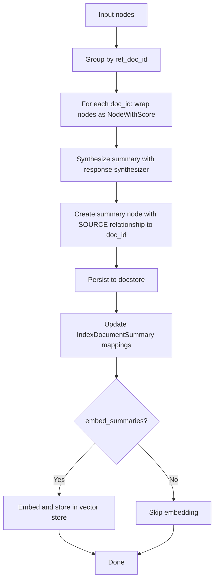
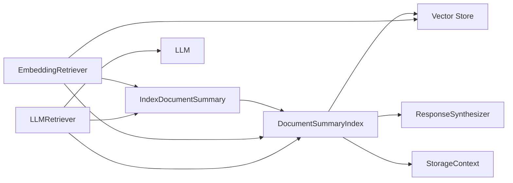

# Document Summary Index

<cite>
**Referenced Files in This Document**
- [document_summary.py](file://llama-index-core/llama_index/core/data_structs/document_summary.py)
- [base.py](file://llama-index-core/llama_index/core/indices/document_summary/base.py)
- [retrievers.py](file://llama-index-core/llama_index/core/indices/document_summary/retrievers.py)
- [__init__.py](file://llama-index-core/llama_index/core/indices/document_summary/__init__.py)
- [data_structs.py](file://llama-index-core/llama_index/core/data_structs/data_structs.py)
- [struct_type.py](file://llama-index-core/llama_index/core/data_structs/struct_type.py)
- [schema.py](file://llama-index-core/llama_index/core/schema.py)
- [base.py](file://llama-index-core/llama_index/core/base/base_retriever.py)
- [types.py](file://llama-index-core/llama_index/core/vector_stores/types.py)
- [base.py](file://llama-index-core/llama_index/core/storage/storage_context.py)
- [base.py](file://llama-index-core/llama_index/core/response_synthesizers/base.py)
- [base.py](file://llama-index-core/llama_index/core/indices/base.py)
</cite>

## Table of Contents
1. [Introduction](#introduction)
2. [Project Structure](#project-structure)
3. [Core Components](#core-components)
4. [Architecture Overview](#architecture-overview)
5. [Detailed Component Analysis](#detailed-component-analysis)
6. [Dependency Analysis](#dependency-analysis)
7. [Performance Considerations](#performance-considerations)
8. [Troubleshooting Guide](#troubleshooting-guide)
9. [Conclusion](#conclusion)
10. [Appendices](#appendices)

## Introduction
Document Summary Index is a specialized index that builds a concise summary per source document and maintains a mapping from each summary node to the underlying document chunks (nodes). This enables efficient retrieval by first selecting relevant summaries and then expanding to the relevant source nodes. It supports two retrieval modes:
- Embedding-based retrieval: Uses embedded document summaries to find semantically similar summaries.
- LLM-based retrieval: Presents batches of summary texts to an LLM to select the most relevant summaries.

The index also exposes APIs to programmatically retrieve a document’s summary by its document ID, and to manage deletions at both the summary and node level.

## Project Structure
The Document Summary Index spans three primary areas:
- Data structure definition for the index internals
- Index implementation that generates summaries and manages mappings
- Retrievers that implement the two retrieval modes

**Diagram sources**
- [document_summary.py](file://llama-index-core/llama_index/core/data_structs/document_summary.py#L11-L75)
- [base.py](file://llama-index-core/llama_index/core/indices/document_summary/base.py#L58-L318)
- [retrievers.py](file://llama-index-core/llama_index/core/indices/document_summary/retrievers.py#L29-L196)

**Section sources**
- [document_summary.py](file://llama-index-core/llama_index/core/data_structs/document_summary.py#L1-L75)
- [base.py](file://llama-index-core/llama_index/core/indices/document_summary/base.py#L1-L318)
- [retrievers.py](file://llama-index-core/llama_index/core/indices/document_summary/retrievers.py#L1-L196)

## Core Components
- IndexDocumentSummary: Stores mappings between summary nodes and source nodes, and between document IDs and summary nodes.
- DocumentSummaryIndex: Builds summaries per document, persists them, and supports retrieval via embedding or LLM selection.
- Retrievers:
  - DocumentSummaryIndexEmbeddingRetriever: Finds top-k summaries by vector similarity and expands to source nodes.
  - DocumentSummaryIndexLLMRetriever: Batches summaries to an LLM for relevance selection and expansion to source nodes.

Key capabilities:
- Constructor parameters for configuring LLM, embedding model, response synthesizer, summary query, progress display, and whether to embed summaries.
- Summary generation via a response synthesizer configured for tree-summarization.
- Storage of summary nodes in the docstore and optional embedding storage in a vector store.
- Retrieval APIs to fetch a document’s summary by document ID.
- Deletion support for removing entire documents or specific nodes while maintaining index consistency.

**Section sources**
- [document_summary.py](file://llama-index-core/llama_index/core/data_structs/document_summary.py#L11-L75)
- [base.py](file://llama-index-core/llama_index/core/indices/document_summary/base.py#L58-L318)
- [retrievers.py](file://llama-index-core/llama_index/core/indices/document_summary/retrievers.py#L29-L196)

## Architecture Overview
High-level flow:
- Build phase: Group nodes by document ID, synthesize a summary per document, persist summary nodes, update index mappings, optionally embed summaries and store vectors.
- Retrieve phase: Choose retriever mode, select top summaries, expand to source nodes, and return results.

**Diagram sources**
- [base.py](file://llama-index-core/llama_index/core/indices/document_summary/base.py#L165-L237)
- [base.py](file://llama-index-core/llama_index/core/response_synthesizers/base.py)
- [base.py](file://llama-index-core/llama_index/core/storage/storage_context.py)

## Detailed Component Analysis

### IndexDocumentSummary
Represents the internal index structure:
- summary_id_to_node_ids: maps each summary node ID to a list of source node IDs.
- node_id_to_summary_id: reverse mapping from source node ID to summary node ID.
- doc_id_to_summary_id: maps each document ID to its summary node ID.

Operations:
- add_summary_and_nodes: registers a summary node and its associated source nodes; validates ref_doc_id presence.
- summary_ids: returns all summary node IDs.
- delete: removes a document’s summary and all mapped source nodes.
- delete_nodes: removes specific source nodes from their summary mapping.

**Diagram sources**
- [document_summary.py](file://llama-index-core/llama_index/core/data_structs/document_summary.py#L11-L75)

**Section sources**
- [document_summary.py](file://llama-index-core/llama_index/core/data_structs/document_summary.py#L11-L75)

### DocumentSummaryIndex
Constructor parameters:
- nodes: initial nodes to index
- objects: index objects
- index_struct: prebuilt index struct
- llm: LLM for summarization and optional LLM-based retrieval
- embed_model: embedding model for optional embedding-based retrieval
- storage_context: persistence context
- response_synthesizer: synthesizer used to generate summaries
- summary_query: prompt/query used to generate summaries
- show_progress: enable progress bars
- embed_summaries: whether to embed summaries for vector retrieval

Summary generation configuration:
- Uses a response synthesizer configured for tree-summarization mode.
- For each document ID, synthesizes a single summary node and persists it to the docstore.
- Updates IndexDocumentSummary mappings accordingly.

Summary storage mechanisms:
- Summary nodes are stored in the docstore.
- If embedding summaries is enabled, summary nodes are embedded and stored in the vector store.

Retrieval APIs:
- as_retriever(mode): returns either embedding or LLM retriever depending on mode.
- get_document_summary(doc_id): retrieves the textual content of a document’s summary node.

Deletion:
- delete_nodes: removes specific source nodes and prunes empty summary entries.
- delete_ref_doc: removes a document’s summary and its vector entries; optionally removes from docstore.

**Diagram sources**
- [base.py](file://llama-index-core/llama_index/core/indices/document_summary/base.py#L58-L318)
- [base.py](file://llama-index-core/llama_index/core/indices/base.py)
- [base.py](file://llama-index-core/llama_index/core/response_synthesizers/base.py)

**Section sources**
- [base.py](file://llama-index-core/llama_index/core/indices/document_summary/base.py#L58-L318)

### Retrievers

#### DocumentSummaryIndexEmbeddingRetriever
Behavior:
- Embeds the query if needed.
- Issues a vector store query to retrieve top-k summary nodes by similarity.
- Expands selected summaries to their source nodes and returns them.

Key parameters:
- similarity_top_k: number of top summaries to retrieve.

**Diagram sources**
- [retrievers.py](file://llama-index-core/llama_index/core/indices/document_summary/retrievers.py#L124-L196)
- [types.py](file://llama-index-core/llama_index/core/vector_stores/types.py)

**Section sources**
- [retrievers.py](file://llama-index-core/llama_index/core/indices/document_summary/retrievers.py#L124-L196)

#### DocumentSummaryIndexLLMRetriever
Behavior:
- Batches summary nodes and prompts an LLM to choose the most relevant ones.
- Parses LLM responses to determine chosen summaries and their relevance scores.
- Expands top-k summaries to source nodes.

Key parameters:
- choice_select_prompt: prompt for choosing relevant summaries
- choice_batch_size: number of summaries to present per LLM call
- choice_top_k: number of summaries to select
- format_node_batch_fn: formats a batch of summary nodes for the LLM
- parse_choice_select_answer_fn: parses the LLM’s choice and relevance

**Diagram sources**
- [retrievers.py](file://llama-index-core/llama_index/core/indices/document_summary/retrievers.py#L29-L122)

**Section sources**
- [retrievers.py](file://llama-index-core/llama_index/core/indices/document_summary/retrievers.py#L29-L122)

### Container Builder and Summary Construction Algorithms
- Container builder: The index groups nodes by ref_doc_id and synthesizes a single summary per document. It then updates IndexDocumentSummary mappings and optionally embeds and stores summaries.
- Summary construction algorithm:
  - For each document, wrap nodes into NodeWithScore.
  - Synthesize a single summary response using the configured response synthesizer.
  - Create a summary node with SOURCE relationship to the original document ID and copy metadata/embed keys from the first node.
  - Persist summary node to docstore.
  - Update mappings in IndexDocumentSummary.
  - Optionally embed and store summaries in vector store.

**Diagram sources**
- [base.py](file://llama-index-core/llama_index/core/indices/document_summary/base.py#L165-L237)

**Section sources**
- [base.py](file://llama-index-core/llama_index/core/indices/document_summary/base.py#L165-L237)

## Dependency Analysis
- IndexDocumentSummary depends on BaseNode and IndexStructType.
- DocumentSummaryIndex depends on:
  - BaseIndex for index lifecycle
  - ResponseSynthesizer for summary generation
  - DocStore for persistence
  - Vector store for embedding-based retrieval
  - Schema types for node relationships and metadata
- Retrievers depend on:
  - BaseRetriever for the retrieval interface
  - DocStore for retrieving summary/source nodes
  - Vector store for embedding-based retrieval
  - LLM for LLM-based retrieval

**Diagram sources**
- [document_summary.py](file://llama-index-core/llama_index/core/data_structs/document_summary.py#L11-L75)
- [base.py](file://llama-index-core/llama_index/core/indices/document_summary/base.py#L58-L318)
- [retrievers.py](file://llama-index-core/llama_index/core/indices/document_summary/retrievers.py#L29-L196)
- [base.py](file://llama-index-core/llama_index/core/base/base_retriever.py)
- [types.py](file://llama-index-core/llama_index/core/vector_stores/types.py)

**Section sources**
- [document_summary.py](file://llama-index-core/llama_index/core/data_structs/document_summary.py#L11-L75)
- [base.py](file://llama-index-core/llama_index/core/indices/document_summary/base.py#L58-L318)
- [retrievers.py](file://llama-index-core/llama_index/core/indices/document_summary/retrievers.py#L29-L196)

## Performance Considerations
- Embedding-based retrieval:
  - Requires enabling embedding of summaries during index creation.
  - Benefits from vector store acceleration for similarity search.
  - Suitable for large corpora where semantic recall is preferred.
- LLM-based retrieval:
  - Uses LLM calls to select summaries; batch size and top-k impact latency and cost.
  - Useful when embedding quality is poor or when nuanced selection is needed.
- Progress display:
  - Enable show_progress to monitor long-running summarization tasks.
- Deletions:
  - Deleting nodes prunes empty summaries and removes associated documents to keep the index compact.

[No sources needed since this section provides general guidance]

## Troubleshooting Guide
Common issues and resolutions:
- Using embedding retriever without embedding summaries:
  - Symptom: ValueError indicating embedding retriever cannot be used when embed_summaries is disabled.
  - Resolution: Set embed_summaries=True during index initialization.
- Missing ref_doc_id:
  - Symptom: ValueError when building the index or adding nodes if ref_doc_id is None.
  - Resolution: Ensure nodes have a valid ref_doc_id before indexing.
- Unknown retriever mode:
  - Symptom: ValueError for unsupported retriever mode.
  - Resolution: Use supported modes (embedding or llm).
- Deleting non-existent nodes:
  - Behavior: Warning logged and node skipped.
  - Resolution: Verify node IDs before deletion.

**Section sources**
- [base.py](file://llama-index-core/llama_index/core/indices/document_summary/base.py#L133-L150)
- [base.py](file://llama-index-core/llama_index/core/indices/document_summary/base.py#L172-L179)
- [base.py](file://llama-index-core/llama_index/core/indices/document_summary/base.py#L259-L264)

## Conclusion
Document Summary Index offers a practical middle ground between full-text retrieval and pure LLM routing by summarizing documents and indexing those summaries. It supports efficient retrieval via embeddings or LLM selection, provides straightforward APIs for getting and deleting summaries, and integrates cleanly with the broader LlamaIndex ecosystem for storage and synthesis.

[No sources needed since this section summarizes without analyzing specific files]

## Appendices

### API Reference: DocumentSummaryIndex
- Constructor parameters:
  - nodes, objects, index_struct, llm, embed_model, storage_context, response_synthesizer, summary_query, show_progress, embed_summaries
- Methods:
  - as_retriever(mode): returns retriever instance
  - get_document_summary(doc_id): returns summary text
  - delete_nodes(node_ids, ...): deletes nodes and prunes empty summaries
  - delete_ref_doc(ref_doc_id, ...): deletes a document’s summary and vectors; optionally docstore entries
  - ref_doc_info: returns info for ingested documents

**Section sources**
- [base.py](file://llama-index-core/llama_index/core/indices/document_summary/base.py#L76-L106)
- [base.py](file://llama-index-core/llama_index/core/indices/document_summary/base.py#L112-L151)
- [base.py](file://llama-index-core/llama_index/core/indices/document_summary/base.py#L152-L164)
- [base.py](file://llama-index-core/llama_index/core/indices/document_summary/base.py#L246-L299)
- [base.py](file://llama-index-core/llama_index/core/indices/document_summary/base.py#L301-L314)

### Retrievers Reference
- DocumentSummaryIndexEmbeddingRetriever:
  - similarity_top_k controls number of summaries retrieved
- DocumentSummaryIndexLLMRetriever:
  - choice_select_prompt, choice_batch_size, choice_top_k, format_node_batch_fn, parse_choice_select_answer_fn, llm

**Section sources**
- [retrievers.py](file://llama-index-core/llama_index/core/indices/document_summary/retrievers.py#L124-L196)
- [retrievers.py](file://llama-index-core/llama_index/core/indices/document_summary/retrievers.py#L29-L122)

### Example Use Cases and Efficiency Benefits
- Efficient retrieval in large document sets:
  - Embedding-based retrieval scales well with vector similarity search.
- Cost-effective summarization:
  - Summaries reduce token usage compared to full-text retrieval.
- Flexible selection:
  - LLM-based retrieval allows nuanced relevance selection when embeddings are insufficient.
- Scenarios for optimal performance:
  - Large corpora with diverse topics benefit from embedding-based retrieval.
  - Domain-specific queries with ambiguous phrasing benefit from LLM-based retrieval.

[No sources needed since this section provides general guidance]