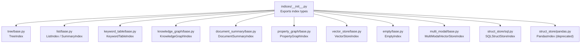
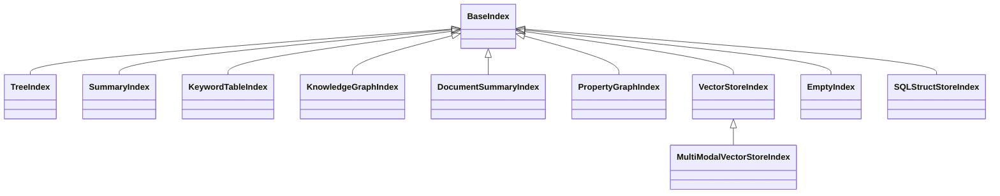
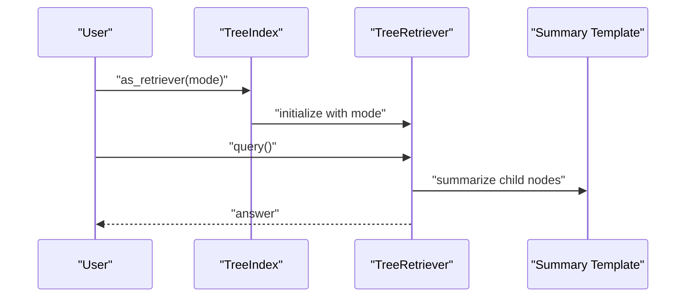
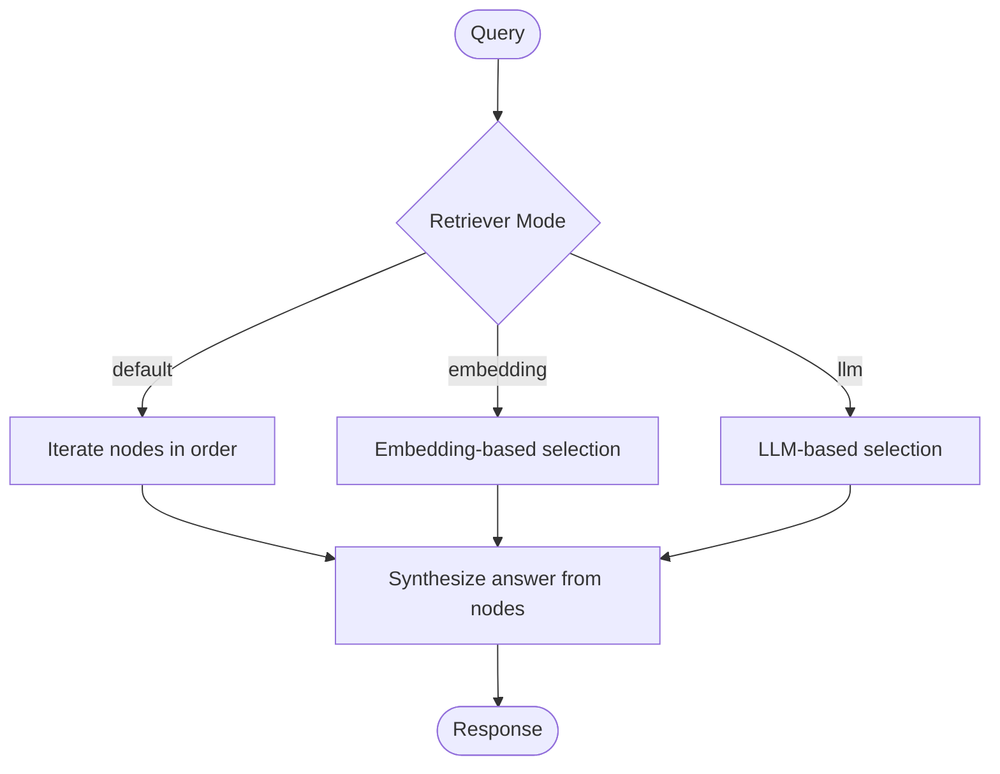
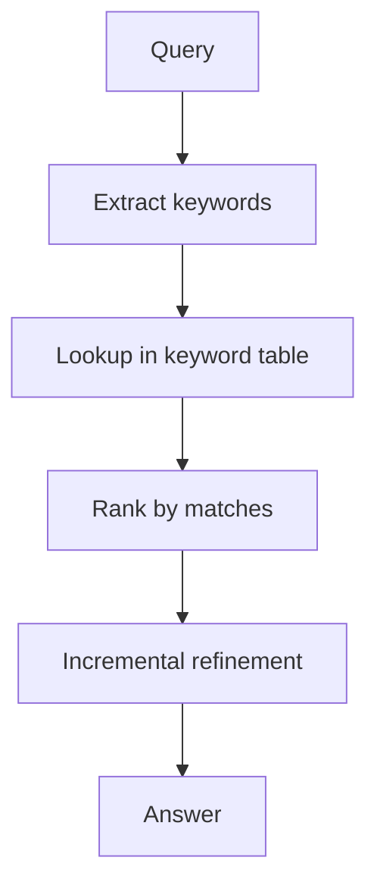
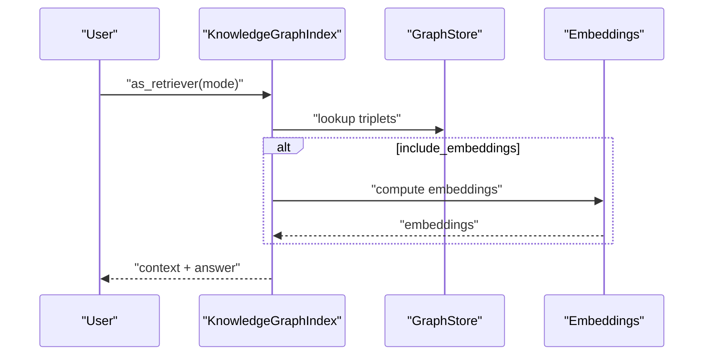
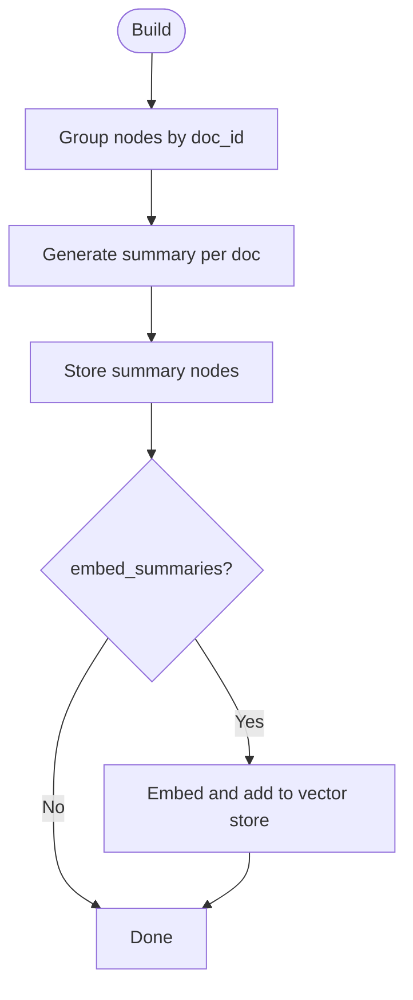
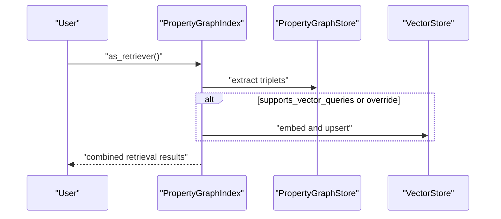
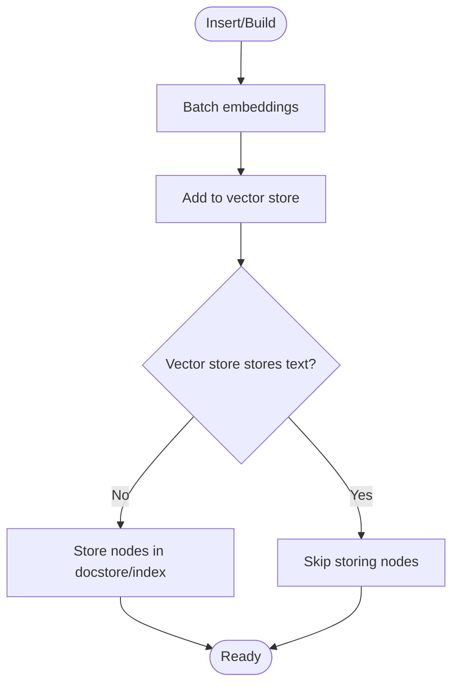
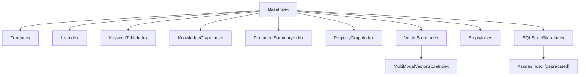

# Index Types

<cite>
**Referenced Files in This Document**
- [indices/__init__.py](file://llama-index-core/llama_index/core/indices/__init__.py)
- [tree/base.py](file://llama-index-core/llama_index/core/indices/tree/base.py)
- [tree/README.md](file://llama-index-core/llama_index/core/indices/tree/README.md)
- [list/base.py](file://llama-index-core/llama_index/core/indices/list/base.py)
- [keyword_table/base.py](file://llama-index-core/llama_index/core/indices/keyword_table/base.py)
- [keyword_table/README.md](file://llama-index-core/llama_index/core/indices/keyword_table/README.md)
- [knowledge_graph/base.py](file://llama-index-core/llama_index/core/indices/knowledge_graph/base.py)
- [document_summary/base.py](file://llama-index-core/llama_index/core/indices/document_summary/base.py)
- [property_graph/base.py](file://llama-index-core/llama_index/core/indices/property_graph/base.py)
- [vector_store/base.py](file://llama-index-core/llama_index/core/indices/vector_store/base.py)
- [empty/base.py](file://llama-index-core/llama_index/core/indices/empty/base.py)
- [multi_modal/base.py](file://llama-index-core/llama_index/core/indices/multi_modal/base.py)
- [struct_store/sql.py](file://llama-index-core/llama_index/core/indices/struct_store/sql.py)
- [struct_store/pandas.py](file://llama-index-core/llama_index/core/indices/struct_store/pandas.py)
</cite>

## Table of Contents
1. [Introduction](#introduction)
2. [Project Structure](#project-structure)
3. [Core Components](#core-components)
4. [Architecture Overview](#architecture-overview)
5. [Detailed Component Analysis](#detailed-component-analysis)
6. [Dependency Analysis](#dependency-analysis)
7. [Performance Considerations](#performance-considerations)
8. [Troubleshooting Guide](#troubleshooting-guide)
9. [Conclusion](#conclusion)

## Introduction
This document provides comprehensive API documentation for all Index Types in the LlamaIndex codebase. It covers constructor parameters, configuration options, query/retrieval methods, performance characteristics, and practical usage guidance for each index. The goal is to help users choose the right index for their use case, understand retrieval and synthesis behaviors, and optimize performance.

## Project Structure
The index types are organized under the indices module. The primary index classes are exposed via the indices package init file, which aggregates imports for all supported index types.

**Diagram sources**
- [indices/__init__.py](file://llama-index-core/llama_index/core/indices/__init__.py#L1-L88)
- [tree/base.py](file://llama-index-core/llama_index/core/indices/tree/base.py#L39-L191)
- [list/base.py](file://llama-index-core/llama_index/core/indices/list/base.py#L29-L157)
- [keyword_table/base.py](file://llama-index-core/llama_index/core/indices/keyword_table/base.py#L43-L256)
- [knowledge_graph/base.py](file://llama-index-core/llama_index/core/indices/knowledge_graph/base.py#L42-L389)
- [document_summary/base.py](file://llama-index-core/llama_index/core/indices/document_summary/base.py#L58-L318)
- [property_graph/base.py](file://llama-index-core/llama_index/core/indices/property_graph/base.py#L43-L410)
- [vector_store/base.py](file://llama-index-core/llama_index/core/indices/vector_store/base.py#L36-L490)
- [empty/base.py](file://llama-index-core/llama_index/core/indices/empty/base.py#L20-L96)
- [multi_modal/base.py](file://llama-index-core/llama_index/core/indices/multi_modal/base.py#L45-L482)
- [struct_store/sql.py](file://llama-index-core/llama_index/core/indices/struct_store/sql.py#L30-L169)
- [struct_store/pandas.py](file://llama-index-core/llama_index/core/indices/struct_store/pandas.py#L10-L27)

**Section sources**
- [indices/__init__.py](file://llama-index-core/llama_index/core/indices/__init__.py#L1-L88)

## Core Components
Below is a concise overview of each index type’s purpose, constructor parameters, and retrieval/synthesis behavior.

- TreeIndex
  - Purpose: Hierarchical summarization index built bottom-up; supports recursive traversal and root-based synthesis.
  - Key constructor parameters: nodes, objects, index_struct, llm, summary_template, insert_prompt, num_children, build_tree, use_async, show_progress.
  - Retrieval: as_retriever(retriever_mode) with modes select_leaf, select_leaf_embedding, all_leaf, root.
  - Synthesis: Uses summarization prompts during construction and traversal; query-time synthesis via traversal or root nodes.
  - Performance: Bottom-up build cost proportional to O(N log N); query cost O(log N) with summarization overhead.

- ListIndex (SummaryIndex)
  - Purpose: Stores nodes in sequence; iterates nodes for answer synthesis.
  - Key constructor parameters: nodes, objects, index_struct, show_progress.
  - Retrieval: as_retriever(retriever_mode) with modes default, embedding, llm.
  - Synthesis: Iterative processing with optional filters; answer synthesized from selected nodes.
  - Performance: Linear iteration over nodes; efficient for small to medium datasets.

- KeywordTableIndex
  - Purpose: Keyword-based hash-like table; retrieves nodes by matching extracted keywords.
  - Key constructor parameters: nodes, objects, index_struct, llm, keyword_extract_template, max_keywords_per_chunk, use_async, show_progress.
  - Retrieval: as_retriever(retriever_mode) with modes default, simple, rake.
  - Synthesis: Extracts query keywords and orders candidates by matches; refines answers incrementally.
  - Performance: Query cost O(k*c) worst-case; number of LLM calls bounded by d.

- KnowledgeGraphIndex
  - Purpose: Builds and leverages a knowledge graph; integrates triplets and embeddings.
  - Key constructor parameters: nodes, objects, index_struct, llm, embed_model, storage_context, kg_triplet_extract_template, max_triplets_per_chunk, include_embeddings, show_progress, max_object_length, kg_triplet_extract_fn.
  - Retrieval: as_retriever(retriever_mode) with hybrid/keyword modes; supports embeddings.
  - Synthesis: Triplets extracted via LLM or custom function; answer synthesis uses graph context.
  - Performance: Build and insert involve triplet extraction and embedding computation; retrieval depends on graph store capabilities.

- DocumentSummaryIndex
  - Purpose: Per-document summaries mapped to underlying nodes; supports embedding-based retrieval.
  - Key constructor parameters: nodes, objects, index_struct, llm, embed_model, storage_context, response_synthesizer, summary_query, show_progress, embed_summaries.
  - Retrieval: as_retriever(retriever_mode) with embedding and llm modes.
  - Synthesis: Generates document-level summaries using a response synthesizer; optional vector store for embeddings.
  - Performance: Embedding generation and vector store operations add overhead; retrieval efficient via embeddings.

- PropertyGraphIndex
  - Purpose: Property graph index with labeled nodes and relations; supports LLM-based and vector-based retrieval.
  - Key constructor parameters: nodes, llm, kg_extractors, property_graph_store, vector_store, use_async, embed_model, embed_kg_nodes, callback_manager, transformations, storage_context, show_progress.
  - Retrieval: as_retriever(sub_retrievers, include_text) with default sub-retrievers including synonym and vector retrievers.
  - Synthesis: Triplets extracted via transformations; retrieval combines graph and vector contexts.
  - Performance: Embedding and vector store operations; graph store capabilities affect retrieval speed.

- VectorStoreIndex
  - Purpose: Index built on top of a vector store; stores embeddings and optionally nodes.
  - Key constructor parameters: use_async, show_progress, store_nodes_override, embed_model, insert_batch_size, objects, index_struct, storage_context, callback_manager, transformations.
  - Retrieval: as_retriever() returns a vector retriever over indexed nodes.
  - Synthesis: Embeddings computed in batches; retrieval via vector similarity.
  - Performance: Batched embedding computation; vector store operations dominate cost.

- EmptyIndex
  - Purpose: Index without documents; supports pure LLM calls.
  - Key constructor parameters: index_struct.
  - Retrieval: as_retriever() returns an empty retriever; as_query_engine() enforces response_mode=generation.
  - Synthesis: No retrieval; relies solely on LLM generation.
  - Performance: Minimal overhead; suitable for lightweight LLM-only workflows.

- MultiModalVectorStoreIndex
  - Purpose: Extends VectorStoreIndex for multi-modal content (text and images).
  - Key constructor parameters: use_async, show_progress, store_nodes_override, embed_model, index_struct, storage_context, image_vector_store, image_embed_model, is_image_to_text, is_image_vector_store_empty, is_text_vector_store_empty.
  - Retrieval: as_retriever() returns a multi-modal retriever; as_query_engine() requires a multi-modal LLM.
  - Synthesis: Supports both text and image embeddings; optional fusion of text embeddings for images.
  - Performance: Separate vector stores for text and images; batched embedding computation for both modalities.

- SQLStructStoreIndex
  - Purpose: Deprecated structured store index backed by SQL; supports SQL and NL query engines.
  - Key constructor parameters: nodes, index_struct, sql_database, table_name, table, ref_doc_id_column, sql_context_container.
  - Retrieval: Not supported; as_retriever() raises NotImplementedError.
  - Synthesis: Query engines translate NL to SQL or accept raw SQL.
  - Performance: Deprecated; not recommended for new projects.

- PandasIndex
  - Purpose: Deprecated pandas-backed structured store; superseded by experimental PandasQueryEngine.
  - Behavior: Raises DeprecationWarning on instantiation.
  - Performance: Deprecated; not recommended for new projects.

**Section sources**
- [tree/base.py](file://llama-index-core/llama_index/core/indices/tree/base.py#L39-L191)
- [list/base.py](file://llama-index-core/llama_index/core/indices/list/base.py#L29-L157)
- [keyword_table/base.py](file://llama-index-core/llama_index/core/indices/keyword_table/base.py#L43-L256)
- [knowledge_graph/base.py](file://llama-index-core/llama_index/core/indices/knowledge_graph/base.py#L42-L389)
- [document_summary/base.py](file://llama-index-core/llama_index/core/indices/document_summary/base.py#L58-L318)
- [property_graph/base.py](file://llama-index-core/llama_index/core/indices/property_graph/base.py#L43-L410)
- [vector_store/base.py](file://llama-index-core/llama_index/core/indices/vector_store/base.py#L36-L490)
- [empty/base.py](file://llama-index-core/llama_index/core/indices/empty/base.py#L20-L96)
- [multi_modal/base.py](file://llama-index-core/llama_index/core/indices/multi_modal/base.py#L45-L482)
- [struct_store/sql.py](file://llama-index-core/llama_index/core/indices/struct_store/sql.py#L30-L169)
- [struct_store/pandas.py](file://llama-index-core/llama_index/core/indices/struct_store/pandas.py#L10-L27)

## Architecture Overview
The index types share a common base class pattern and rely on storage contexts, embedding models, and retrievers. Vector-based indices integrate with vector stores; graph-based indices integrate with graph stores; and specialized indices (e.g., document summary) integrate with response synthesizers and optional vector stores.

**Diagram sources**
- [tree/base.py](file://llama-index-core/llama_index/core/indices/tree/base.py#L39-L191)
- [list/base.py](file://llama-index-core/llama_index/core/indices/list/base.py#L29-L157)
- [keyword_table/base.py](file://llama-index-core/llama_index/core/indices/keyword_table/base.py#L43-L256)
- [knowledge_graph/base.py](file://llama-index-core/llama_index/core/indices/knowledge_graph/base.py#L42-L389)
- [document_summary/base.py](file://llama-index-core/llama_index/core/indices/document_summary/base.py#L58-L318)
- [property_graph/base.py](file://llama-index-core/llama_index/core/indices/property_graph/base.py#L43-L410)
- [vector_store/base.py](file://llama-index-core/llama_index/core/indices/vector_store/base.py#L36-L490)
- [empty/base.py](file://llama-index-core/llama_index/core/indices/empty/base.py#L20-L96)
- [multi_modal/base.py](file://llama-index-core/llama_index/core/indices/multi_modal/base.py#L45-L482)
- [struct_store/sql.py](file://llama-index-core/llama_index/core/indices/struct_store/sql.py#L30-L169)

## Detailed Component Analysis

### TreeIndex
- Constructor parameters
  - nodes, objects, index_struct, llm, summary_template, insert_prompt, num_children, build_tree, use_async, show_progress.
- Retrieval modes
  - select_leaf, select_leaf_embedding, all_leaf, root.
- Synthesis
  - Bottom-up summarization during build; traversal or root-based synthesis during query.
- Performance
  - Build cost O(N log N); query cost O(log N) plus summarization.

**Diagram sources**
- [tree/base.py](file://llama-index-core/llama_index/core/indices/tree/base.py#L94-L129)
- [tree/README.md](file://llama-index-core/llama_index/core/indices/tree/README.md#L1-L51)

**Section sources**
- [tree/base.py](file://llama-index-core/llama_index/core/indices/tree/base.py#L39-L191)
- [tree/README.md](file://llama-index-core/llama_index/core/indices/tree/README.md#L1-L51)

### ListIndex (SummaryIndex)
- Constructor parameters
  - nodes, objects, index_struct, show_progress.
- Retrieval modes
  - default, embedding, llm.
- Synthesis
  - Sequential iteration with optional filters; answer synthesized from selected nodes.

**Diagram sources**
- [list/base.py](file://llama-index-core/llama_index/core/indices/list/base.py#L68-L95)

**Section sources**
- [list/base.py](file://llama-index-core/llama_index/core/indices/list/base.py#L29-L157)

### KeywordTableIndex
- Constructor parameters
  - nodes, objects, index_struct, llm, keyword_extract_template, max_keywords_per_chunk, use_async, show_progress.
- Retrieval modes
  - default (GPT), simple (regex), rake.
- Synthesis
  - Extract query keywords; rank candidates by keyword matches; refine answer incrementally.

**Diagram sources**
- [keyword_table/base.py](file://llama-index-core/llama_index/core/indices/keyword_table/base.py#L100-L128)
- [keyword_table/README.md](file://llama-index-core/llama_index/core/indices/keyword_table/README.md#L1-L50)

**Section sources**
- [keyword_table/base.py](file://llama-index-core/llama_index/core/indices/keyword_table/base.py#L43-L256)
- [keyword_table/README.md](file://llama-index-core/llama_index/core/indices/keyword_table/README.md#L1-L50)

### KnowledgeGraphIndex
- Constructor parameters
  - nodes, objects, index_struct, llm, embed_model, storage_context, kg_triplet_extract_template, max_triplets_per_chunk, include_embeddings, show_progress, max_object_length, kg_triplet_extract_fn.
- Retrieval modes
  - Hybrid vs keyword depending on embeddings availability.
- Synthesis
  - Triplets extracted via LLM or custom function; answer synthesis uses graph context.

**Diagram sources**
- [knowledge_graph/base.py](file://llama-index-core/llama_index/core/indices/knowledge_graph/base.py#L123-L150)

**Section sources**
- [knowledge_graph/base.py](file://llama-index-core/llama_index/core/indices/knowledge_graph/base.py#L42-L389)

### DocumentSummaryIndex
- Constructor parameters
  - nodes, objects, index_struct, llm, embed_model, storage_context, response_synthesizer, summary_query, show_progress, embed_summaries.
- Retrieval modes
  - embedding, llm.
- Synthesis
  - Generates document-level summaries; optional vector store for embeddings.

**Diagram sources**
- [document_summary/base.py](file://llama-index-core/llama_index/core/indices/document_summary/base.py#L165-L226)

**Section sources**
- [document_summary/base.py](file://llama-index-core/llama_index/core/indices/document_summary/base.py#L58-L318)

### PropertyGraphIndex
- Constructor parameters
  - nodes, llm, kg_extractors, property_graph_store, vector_store, use_async, embed_model, embed_kg_nodes, callback_manager, transformations, storage_context, show_progress.
- Retrieval modes
  - Default sub-retrievers include synonym and vector retrievers.
- Synthesis
  - Triplets extracted via transformations; retrieval combines graph and vector contexts.

**Diagram sources**
- [property_graph/base.py](file://llama-index-core/llama_index/core/indices/property_graph/base.py#L341-L393)

**Section sources**
- [property_graph/base.py](file://llama-index-core/llama_index/core/indices/property_graph/base.py#L43-L410)

### VectorStoreIndex
- Constructor parameters
  - use_async, show_progress, store_nodes_override, embed_model, insert_batch_size, objects, index_struct, storage_context, callback_manager, transformations.
- Retrieval
  - as_retriever() returns a vector retriever.
- Synthesis
  - Embeddings computed in batches; retrieval via vector similarity.

**Diagram sources**
- [vector_store/base.py](file://llama-index-core/llama_index/core/indices/vector_store/base.py#L260-L284)

**Section sources**
- [vector_store/base.py](file://llama-index-core/llama_index/core/indices/vector_store/base.py#L36-L490)

### EmptyIndex
- Constructor parameters
  - index_struct.
- Retrieval
  - as_retriever() returns an empty retriever; as_query_engine() enforces response_mode=generation.
- Synthesis
  - Pure LLM generation without retrieval.

**Section sources**
- [empty/base.py](file://llama-index-core/llama_index/core/indices/empty/base.py#L20-L96)

### MultiModalVectorStoreIndex
- Constructor parameters
  - use_async, show_progress, store_nodes_override, embed_model, index_struct, storage_context, image_vector_store, image_embed_model, is_image_to_text, is_image_vector_store_empty, is_text_vector_store_empty.
- Retrieval
  - as_retriever() returns a multi-modal retriever; as_query_engine() requires a multi-modal LLM.
- Synthesis
  - Supports both text and image embeddings; optional fusion of text embeddings for images.

**Section sources**
- [multi_modal/base.py](file://llama-index-core/llama_index/core/indices/multi_modal/base.py#L45-L482)

### SQLStructStoreIndex
- Constructor parameters
  - nodes, index_struct, sql_database, table_name, table, ref_doc_id_column, sql_context_container.
- Retrieval
  - as_retriever() raises NotImplementedError.
- Synthesis
  - as_query_engine(query_mode) supports NL and SQL modes.

**Section sources**
- [struct_store/sql.py](file://llama-index-core/llama_index/core/indices/struct_store/sql.py#L30-L169)

### PandasIndex
- Behavior
  - Raises DeprecationWarning on instantiation.

**Section sources**
- [struct_store/pandas.py](file://llama-index-core/llama_index/core/indices/struct_store/pandas.py#L10-L27)

## Dependency Analysis
Index types depend on shared components: BaseIndex, storage contexts, embedding models, and retrievers. Vector-based indices depend on vector stores; graph-based indices depend on graph stores; document summary integrates with response synthesizers.

**Diagram sources**
- [indices/__init__.py](file://llama-index-core/llama_index/core/indices/__init__.py#L1-L88)
- [tree/base.py](file://llama-index-core/llama_index/core/indices/tree/base.py#L39-L191)
- [list/base.py](file://llama-index-core/llama_index/core/indices/list/base.py#L29-L157)
- [keyword_table/base.py](file://llama-index-core/llama_index/core/indices/keyword_table/base.py#L43-L256)
- [knowledge_graph/base.py](file://llama-index-core/llama_index/core/indices/knowledge_graph/base.py#L42-L389)
- [document_summary/base.py](file://llama-index-core/llama_index/core/indices/document_summary/base.py#L58-L318)
- [property_graph/base.py](file://llama-index-core/llama_index/core/indices/property_graph/base.py#L43-L410)
- [vector_store/base.py](file://llama-index-core/llama_index/core/indices/vector_store/base.py#L36-L490)
- [empty/base.py](file://llama-index-core/llama_index/core/indices/empty/base.py#L20-L96)
- [struct_store/sql.py](file://llama-index-core/llama_index/core/indices/struct_store/sql.py#L30-L169)
- [struct_store/pandas.py](file://llama-index-core/llama_index/core/indices/struct_store/pandas.py#L10-L27)

**Section sources**
- [indices/__init__.py](file://llama-index-core/llama_index/core/indices/__init__.py#L1-L88)

## Performance Considerations
- TreeIndex
  - Build cost O(N log N); query cost O(log N) plus summarization overhead.
- ListIndex
  - Linear iteration over nodes; efficient for small to medium datasets.
- KeywordTableIndex
  - Query cost O(k*c) worst-case; number of LLM calls bounded by d.
- KnowledgeGraphIndex
  - Build and insert involve triplet extraction and embedding computation; retrieval depends on graph store capabilities.
- DocumentSummaryIndex
  - Embedding generation and vector store operations add overhead; retrieval efficient via embeddings.
- PropertyGraphIndex
  - Embedding and vector store operations; graph store capabilities affect retrieval speed.
- VectorStoreIndex
  - Batched embedding computation; vector store operations dominate cost.
- MultiModalVectorStoreIndex
  - Separate vector stores for text and images; batched embedding computation for both modalities.
- SQLStructStoreIndex
  - Deprecated; not recommended for new projects.
- PandasIndex
  - Deprecated; not recommended for new projects.

[No sources needed since this section provides general guidance]

## Troubleshooting Guide
- KnowledgeGraphIndex deprecation
  - The KnowledgeGraphIndex class is deprecated; use PropertyGraphIndex instead.
- SQLStructStoreIndex deprecation
  - SQLStructStoreIndex is deprecated; not recommended for new projects.
- PandasIndex deprecation
  - PandasIndex is deprecated; use experimental PandasQueryEngine instead.
- EmptyIndex limitations
  - Cannot insert or delete nodes; only supports response_mode=generation in query engine.
- VectorStoreIndex text storage
  - If vector store does not store text, nodes are stored in docstore/index store; otherwise only image and index nodes are stored.

**Section sources**
- [knowledge_graph/base.py](file://llama-index-core/llama_index/core/indices/knowledge_graph/base.py#L33-L41)
- [struct_store/sql.py](file://llama-index-core/llama_index/core/indices/struct_store/sql.py#L30-L42)
- [struct_store/pandas.py](file://llama-index-core/llama_index/core/indices/struct_store/pandas.py#L10-L22)
- [empty/base.py](file://llama-index-core/llama_index/core/indices/empty/base.py#L52-L61)
- [vector_store/base.py](file://llama-index-core/llama_index/core/indices/vector_store/base.py#L463-L486)

## Conclusion
Each index type offers distinct strengths and trade-offs:
- TreeIndex excels in hierarchical summarization and controlled traversal.
- ListIndex suits straightforward sequential processing.
- KeywordTableIndex balances keyword matching with incremental refinement.
- KnowledgeGraphIndex provides relational reasoning but is deprecated in favor of PropertyGraphIndex.
- DocumentSummaryIndex enables efficient retrieval via document-level summaries.
- PropertyGraphIndex integrates labeled graphs with vector retrieval.
- VectorStoreIndex offers scalable vector similarity search.
- EmptyIndex supports pure LLM workflows.
- MultiModalVectorStoreIndex extends vector search to multi-modal content.
Choose the index aligned with your data characteristics, retrieval needs, and performance constraints.

[No sources needed since this section summarizes without analyzing specific files]