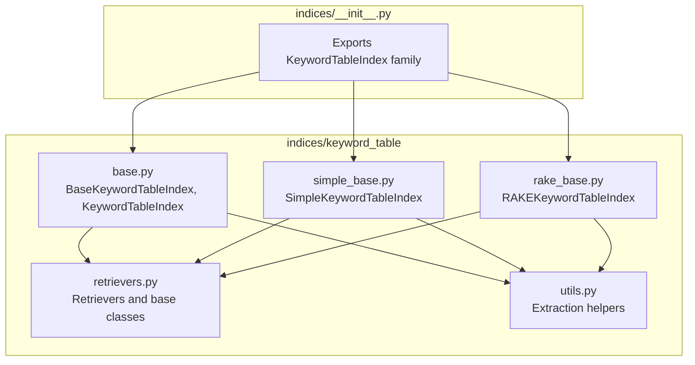
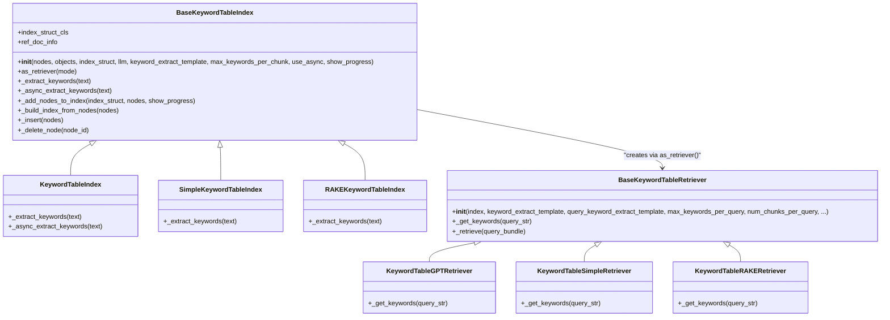
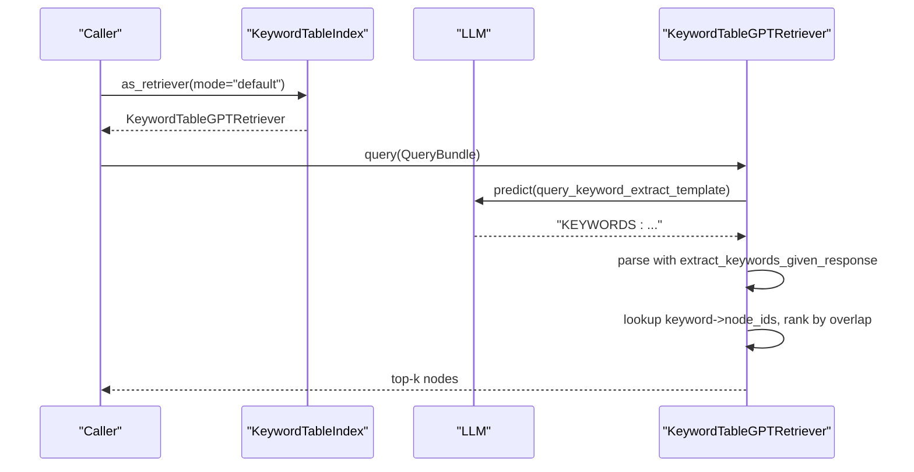
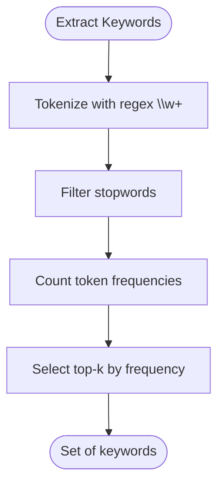
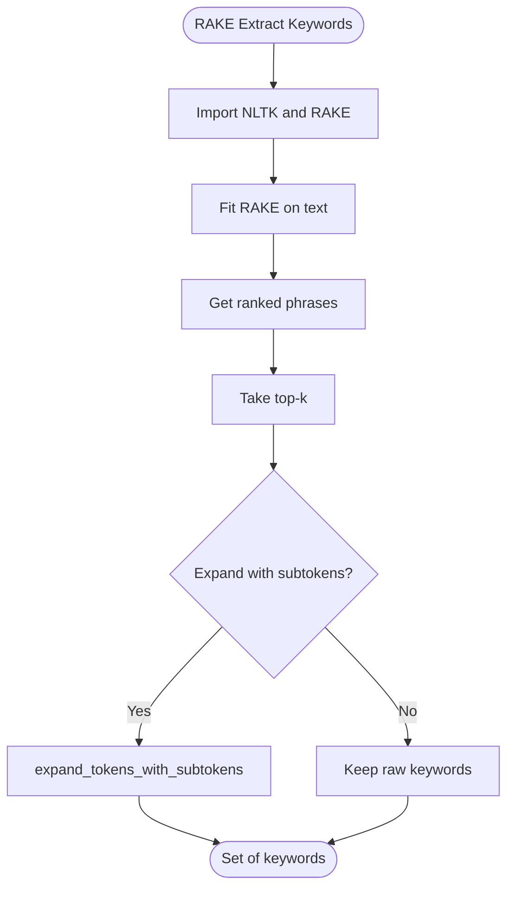
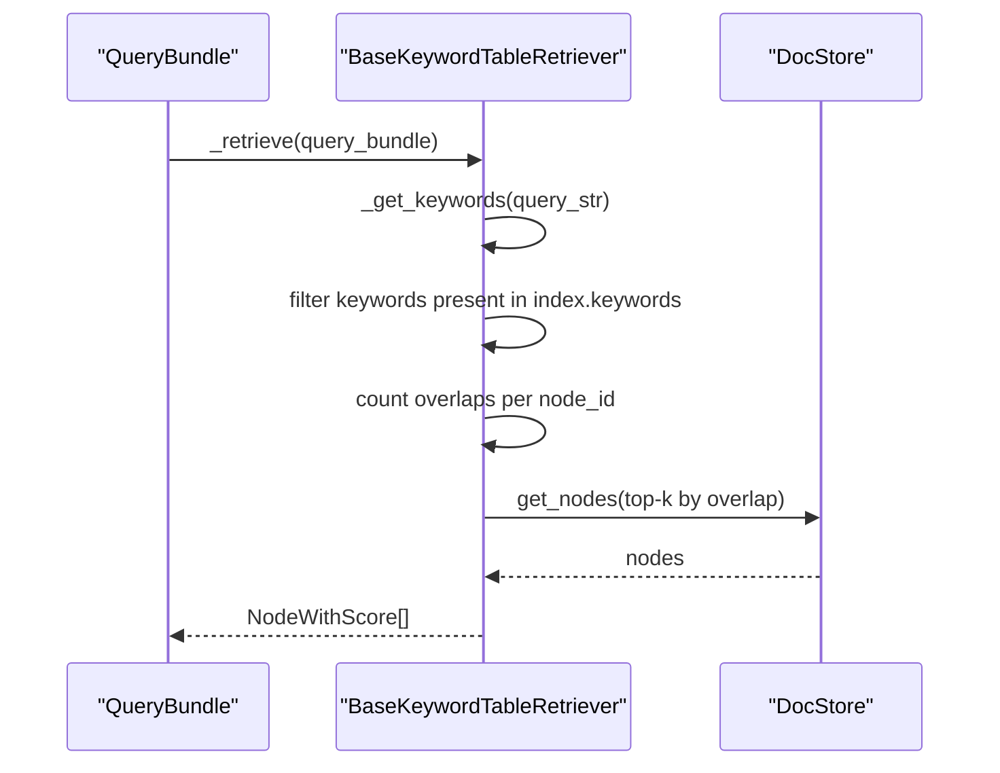
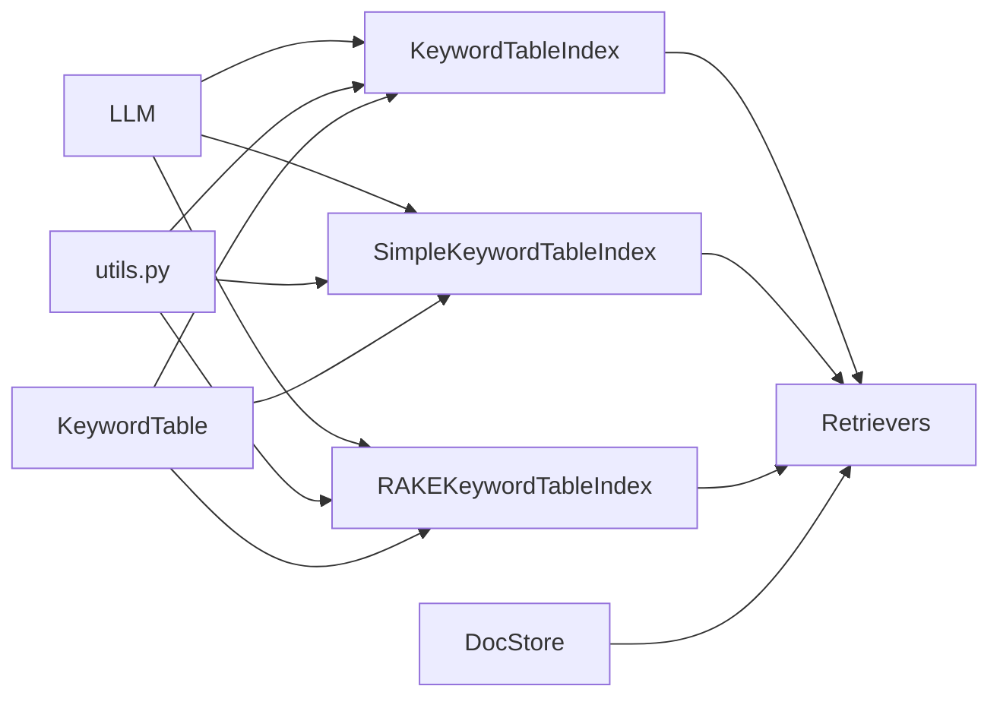

# Keyword Table Index

<cite>
**Referenced Files in This Document**
- [base.py](file://llama-index-core/llama_index/core/indices/keyword_table/base.py)
- [simple_base.py](file://llama-index-core/llama_index/core/indices/keyword_table/simple_base.py)
- [rake_base.py](file://llama-index-core/llama_index/core/indices/keyword_table/rake_base.py)
- [retrievers.py](file://llama-index-core/llama_index/core/indices/keyword_table/retrievers.py)
- [utils.py](file://llama-index-core/llama_index/core/indices/keyword_table/utils.py)
- [__init__.py](file://llama-index-core/llama_index/core/indices/__init__.py)
- [README.md](file://llama-index-core/llama_index/core/indices/keyword_table/README.md)
- [table.py](file://llama-index-core/llama_index/core/data_structs/table.py)
</cite>

## Table of Contents
1. [Introduction](#introduction)
2. [Project Structure](#project-structure)
3. [Core Components](#core-components)
4. [Architecture Overview](#architecture-overview)
5. [Detailed Component Analysis](#detailed-component-analysis)
6. [Dependency Analysis](#dependency-analysis)
7. [Performance Considerations](#performance-considerations)
8. [Troubleshooting Guide](#troubleshooting-guide)
9. [Conclusion](#conclusion)
10. [Appendices](#appendices)

## Introduction
This document provides comprehensive API documentation for the Keyword Table Index family in LlamaIndex. It explains how keyword extraction is configured and executed, how documents are indexed into keyword tables, and how retrieval works. It also covers the different keyword extraction strategies (GPT-based, simple regex, and RAKE), the table structure, and the relationship with retrievers and postprocessors. Finally, it outlines advantages and performance characteristics of keyword-based retrieval and scenarios where it excels compared to vector-based approaches.

## Project Structure
The Keyword Table Index implementation resides under the indices/keyword_table package. It includes:
- A base index class that defines the common behavior for keyword-table-based indices
- Specializations for GPT-based extraction, simple regex extraction, and RAKE extraction
- Retrievers that implement query-time keyword extraction and node selection
- Utility functions for keyword extraction and parsing
- Export declarations in the indices package’s public API

**Diagram sources**
- [base.py](file://llama-index-core/llama_index/core/indices/keyword_table/base.py#L43-L256)
- [simple_base.py](file://llama-index-core/llama_index/core/indices/keyword_table/simple_base.py#L24-L48)
- [rake_base.py](file://llama-index-core/llama_index/core/indices/keyword_table/rake_base.py#L18-L42)
- [retrievers.py](file://llama-index-core/llama_index/core/indices/keyword_table/retrievers.py#L31-L201)
- [utils.py](file://llama-index-core/llama_index/core/indices/keyword_table/utils.py#L11-L77)
- [__init__.py](file://llama-index-core/llama_index/core/indices/__init__.py#L11-L22)

**Section sources**
- [base.py](file://llama-index-core/llama_index/core/indices/keyword_table/base.py#L1-L256)
- [simple_base.py](file://llama-index-core/llama_index/core/indices/keyword_table/simple_base.py#L1-L48)
- [rake_base.py](file://llama-index-core/llama_index/core/indices/keyword_table/rake_base.py#L1-L42)
- [retrievers.py](file://llama-index-core/llama_index/core/indices/keyword_table/retrievers.py#L1-L201)
- [utils.py](file://llama-index-core/llama_index/core/indices/keyword_table/utils.py#L1-L77)
- [__init__.py](file://llama-index-core/llama_index/core/indices/__init__.py#L11-L22)

## Core Components
- BaseKeywordTableIndex: Defines the shared index behavior, including keyword extraction hooks, node insertion, deletion, and index construction.
- KeywordTableIndex: GPT-based keyword extraction during indexing and querying.
- SimpleKeywordTableIndex: Regex-based keyword extraction during indexing and querying.
- RAKEKeywordTableIndex: RAKE-based keyword extraction during indexing and querying.
- KeywordTable*Retriever classes: Implement query-time keyword extraction and node selection strategies.
- KeywordTable data structure: Stores keyword-to-node-id mappings.

Key constructor parameters and configuration:
- KeywordTableIndex and SimpleKeywordTableIndex constructors accept:
  - nodes, objects, index_struct
  - llm
  - keyword_extract_template
  - max_keywords_per_chunk
  - use_async
  - show_progress
- Retrievers accept:
  - keyword_extract_template
  - query_keyword_extract_template
  - max_keywords_per_query
  - num_chunks_per_query
  - llm (for GPT retriever)
  - callback_manager, object_map, verbose

Keyword extraction configuration:
- Index-time templates: DEFAULT_KEYWORD_EXTRACT_TEMPLATE, formatted with max_keywords_per_chunk
- Query-time templates: DEFAULT_QUERY_KEYWORD_EXTRACT_TEMPLATE, used by retrievers
- Parsing: extract_keywords_given_response parses LLM outputs and expands tokens with subtokens

Table structure:
- KeywordTable stores a dictionary mapping keywords to sets of node IDs. Nodes are inserted via add_node and removed via delete_node.

**Section sources**
- [base.py](file://llama-index-core/llama_index/core/indices/keyword_table/base.py#L67-L98)
- [base.py](file://llama-index-core/llama_index/core/indices/keyword_table/base.py#L138-L184)
- [base.py](file://llama-index-core/llama_index/core/indices/keyword_table/base.py#L186-L207)
- [retrievers.py](file://llama-index-core/llama_index/core/indices/keyword_table/retrievers.py#L53-L81)
- [utils.py](file://llama-index-core/llama_index/core/indices/keyword_table/utils.py#L51-L77)
- [table.py](file://llama-index-core/llama_index/core/data_structs/table.py#L1-L45)

## Architecture Overview
The Keyword Table Index architecture centers around a keyword-to-node mapping built during index construction. At query time, the retriever extracts keywords from the query and retrieves candidate nodes by intersecting keyword mappings, then truncates to a fixed number of top candidates.

**Diagram sources**
- [base.py](file://llama-index-core/llama_index/core/indices/keyword_table/base.py#L43-L256)
- [simple_base.py](file://llama-index-core/llama_index/core/indices/keyword_table/simple_base.py#L24-L48)
- [rake_base.py](file://llama-index-core/llama_index/core/indices/keyword_table/rake_base.py#L18-L42)
- [retrievers.py](file://llama-index-core/llama_index/core/indices/keyword_table/retrievers.py#L31-L201)

## Detailed Component Analysis

### KeywordTableIndex
- Purpose: Uses an LLM to extract keywords during both index construction and query-time retrieval.
- Constructor parameters:
  - nodes, objects, index_struct
  - llm
  - keyword_extract_template (defaults to a built-in template)
  - max_keywords_per_chunk (controls formatting of the extraction prompt)
  - use_async, show_progress
- Keyword extraction:
  - Index-time: Calls LLM with the formatted keyword extraction template and parses the response using extract_keywords_given_response.
  - Query-time: Implemented by KeywordTableGPTRetriever using a query-specific template.
- Retrieval:
  - as_retriever(mode="default") returns a KeywordTableGPTRetriever.

**Diagram sources**
- [base.py](file://llama-index-core/llama_index/core/indices/keyword_table/base.py#L100-L128)
- [retrievers.py](file://llama-index-core/llama_index/core/indices/keyword_table/retrievers.py#L119-L165)
- [utils.py](file://llama-index-core/llama_index/core/indices/keyword_table/utils.py#L51-L77)

**Section sources**
- [base.py](file://llama-index-core/llama_index/core/indices/keyword_table/base.py#L229-L256)
- [retrievers.py](file://llama-index-core/llama_index/core/indices/keyword_table/retrievers.py#L119-L165)

### SimpleKeywordTableIndex
- Purpose: Uses a simple regex-based keyword extractor during both index construction and query-time retrieval.
- Constructor parameters: Same as the base class; defaults to regex extraction.
- Keyword extraction:
  - Index-time and query-time: simple_extract_keywords(tokenize, filter stopwords, frequency-based selection).
- Retrieval:
  - as_retriever(mode="simple") returns a KeywordTableSimpleRetriever.

**Diagram sources**
- [simple_base.py](file://llama-index-core/llama_index/core/indices/keyword_table/simple_base.py#L24-L48)
- [utils.py](file://llama-index-core/llama_index/core/indices/keyword_table/utils.py#L11-L22)

**Section sources**
- [simple_base.py](file://llama-index-core/llama_index/core/indices/keyword_table/simple_base.py#L24-L48)
- [utils.py](file://llama-index-core/llama_index/core/indices/keyword_table/utils.py#L11-L22)

### RAKEKeywordTableIndex
- Purpose: Uses the RAKE algorithm for keyword extraction during both index construction and query-time retrieval.
- Constructor parameters: Same as the base class; requires NLTK and rake_nltk installed.
- Keyword extraction:
  - Index-time and query-time: rake_extract_keywords with optional subtoken expansion.
- Retrieval:
  - as_retriever(mode="rake") returns a KeywordTableRAKERetriever.

**Diagram sources**
- [rake_base.py](file://llama-index-core/llama_index/core/indices/keyword_table/rake_base.py#L18-L42)
- [utils.py](file://llama-index-core/llama_index/core/indices/keyword_table/utils.py#L24-L49)

**Section sources**
- [rake_base.py](file://llama-index-core/llama_index/core/indices/keyword_table/rake_base.py#L18-L42)
- [utils.py](file://llama-index-core/llama_index/core/indices/keyword_table/utils.py#L24-L49)

### Retrievers and Query Flow
- BaseKeywordTableRetriever:
  - Accepts keyword_extract_template and query_keyword_extract_template
  - max_keywords_per_query controls query-time extraction
  - num_chunks_per_query truncates the final candidate set
  - _retrieve computes overlap counts and returns top-k nodes
- KeywordTableGPTRetriever: Uses LLM-based extraction for queries.
- KeywordTableSimpleRetriever: Uses regex-based extraction for queries.
- KeywordTableRAKERetriever: Uses RAKE-based extraction for queries.

**Diagram sources**
- [retrievers.py](file://llama-index-core/llama_index/core/indices/keyword_table/retrievers.py#L86-L117)

**Section sources**
- [retrievers.py](file://llama-index-core/llama_index/core/indices/keyword_table/retrievers.py#L31-L117)

### Keyword Extraction Utilities
- simple_extract_keywords: regex-based tokenization, optional stopword filtering, frequency-based selection.
- rake_extract_keywords: NLTK + RAKE phrase ranking with optional subtoken expansion.
- extract_keywords_given_response: parses LLM KEYWORDS: lists and normalizes tokens.

**Section sources**
- [utils.py](file://llama-index-core/llama_index/core/indices/keyword_table/utils.py#L11-L77)

### Table Structure and Storage
- KeywordTable is the index structure storing keyword-to-node-id mappings.
- BaseKeywordTableIndex manages adding/removing nodes and deleting keywords when no nodes reference them.

**Section sources**
- [base.py](file://llama-index-core/llama_index/core/indices/keyword_table/base.py#L138-L207)
- [table.py](file://llama-index-core/llama_index/core/data_structs/table.py#L1-L45)

## Dependency Analysis
- Index classes depend on:
  - LLM for GPT-based extraction
  - Keyword extraction utilities (regex, RAKE, response parsing)
  - DocStore for retrieving nodes
  - KeywordTable for the underlying mapping
- Retrievers depend on:
  - Index instances and docstore
  - Prompt templates for extraction
  - LLM for GPT retriever variant

**Diagram sources**
- [base.py](file://llama-index-core/llama_index/core/indices/keyword_table/base.py#L16-L32)
- [retrievers.py](file://llama-index-core/llama_index/core/indices/keyword_table/retrievers.py#L16-L24)
- [utils.py](file://llama-index-core/llama_index/core/indices/keyword_table/utils.py#L11-L77)

**Section sources**
- [base.py](file://llama-index-core/llama_index/core/indices/keyword_table/base.py#L16-L32)
- [retrievers.py](file://llama-index-core/llama_index/core/indices/keyword_table/retrievers.py#L16-L24)
- [utils.py](file://llama-index-core/llama_index/core/indices/keyword_table/utils.py#L11-L77)

## Performance Considerations
- Runtime complexity:
  - Query-time: O(k * c), where k is extracted keywords and c is candidate chunks per query.
  - Number of LLM calls bounded by num_chunks_per_query.
- Cost characteristics:
  - Cost scales with number of LLM calls for keyword extraction and answer synthesis.
- Advantages of keyword-based retrieval:
  - Fast query-time lookup via hash-like keyword mapping
  - Interpretable keyword overlap scoring
  - Lower compute for retrieval compared to dense vector similarity
- Scenarios where keyword-based retrieval excels:
  - Documents with strong, discrete keywords
  - Applications requiring fast retrieval with moderate accuracy
  - Environments where LLM inference costs must be minimized

**Section sources**
- [README.md](file://llama-index-core/llama_index/core/indices/keyword_table/README.md#L40-L50)

## Troubleshooting Guide
Common issues and resolutions:
- Missing NLTK or rake_nltk:
  - RAKEKeywordTableIndex requires NLTK and rake_nltk. Install the packages if import errors occur.
- Stopwords and tokenization:
  - Ensure stopwords are initialized; regex-based extraction filters stopwords by default.
- LLM keyword parsing:
  - extract_keywords_given_response expects the LLM response to start with a specific token; mismatched formatting will cause parsing errors.
- Async usage:
  - use_async toggles async keyword extraction; ensure proper event loop handling if integrating externally.

**Section sources**
- [utils.py](file://llama-index-core/llama_index/core/indices/keyword_table/utils.py#L30-L49)
- [utils.py](file://llama-index-core/llama_index/core/indices/keyword_table/utils.py#L51-L77)
- [base.py](file://llama-index-core/llama_index/core/indices/keyword_table/base.py#L75-L98)

## Conclusion
The Keyword Table Index provides a flexible, keyword-centric retrieval mechanism with three extraction strategies. It offers predictable performance, interpretable keyword overlap scoring, and reduced LLM usage compared to vector-based methods. Choose the GPT-based index for richer keyword semantics, the simple regex index for speed and cost, or the RAKE index for robust, rule-based keyword extraction.

## Appendices

### API Reference: KeywordTableIndex Constructors and Parameters
- KeywordTableIndex constructor parameters:
  - nodes, objects, index_struct
  - llm
  - keyword_extract_template
  - max_keywords_per_chunk
  - use_async
  - show_progress
- SimpleKeywordTableIndex constructor parameters:
  - Same as base class; extraction defaults to regex
- RAKEKeywordTableIndex constructor parameters:
  - Same as base class; extraction defaults to RAKE
- Retriever parameters:
  - keyword_extract_template
  - query_keyword_extract_template
  - max_keywords_per_query
  - num_chunks_per_query
  - llm (for GPT retriever)
  - callback_manager, object_map, verbose

**Section sources**
- [base.py](file://llama-index-core/llama_index/core/indices/keyword_table/base.py#L67-L98)
- [simple_base.py](file://llama-index-core/llama_index/core/indices/keyword_table/simple_base.py#L24-L48)
- [rake_base.py](file://llama-index-core/llama_index/core/indices/keyword_table/rake_base.py#L18-L42)
- [retrievers.py](file://llama-index-core/llama_index/core/indices/keyword_table/retrievers.py#L53-L81)

### Example Workflows
- Build a GPT-based keyword table index from documents and query it:
  - Instantiate KeywordTableIndex from documents
  - Obtain a query engine via as_query_engine
  - Execute a query
- Configure retrieval modes:
  - as_retriever(mode="default") for GPT extraction
  - as_retriever(mode="simple") for regex extraction
  - as_retriever(mode="rake") for RAKE extraction

**Section sources**
- [README.md](file://llama-index-core/llama_index/core/indices/keyword_table/README.md#L25-L36)
- [base.py](file://llama-index-core/llama_index/core/indices/keyword_table/base.py#L100-L128)