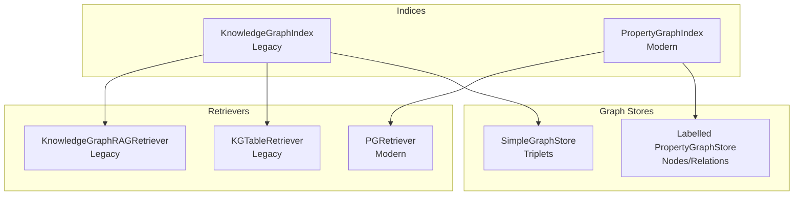
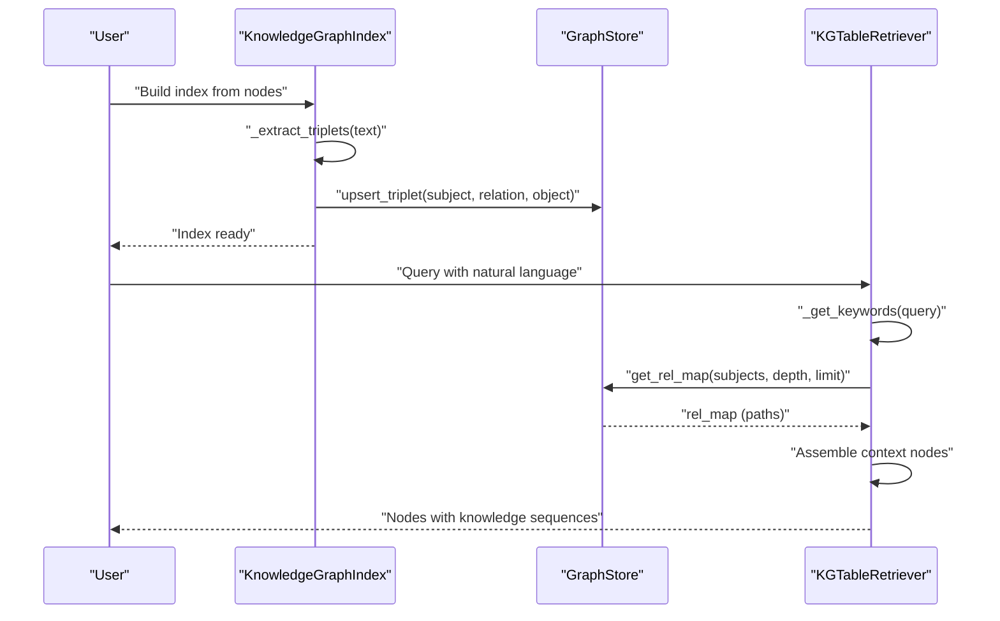
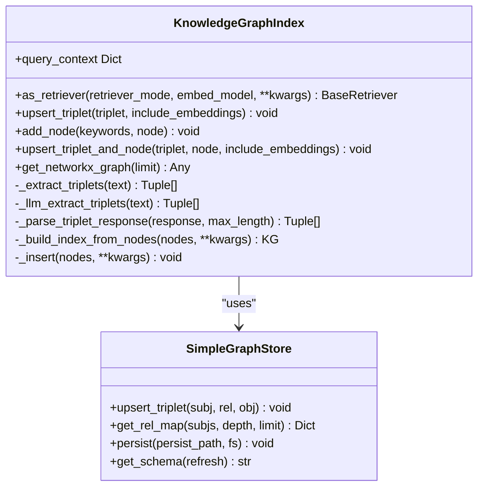
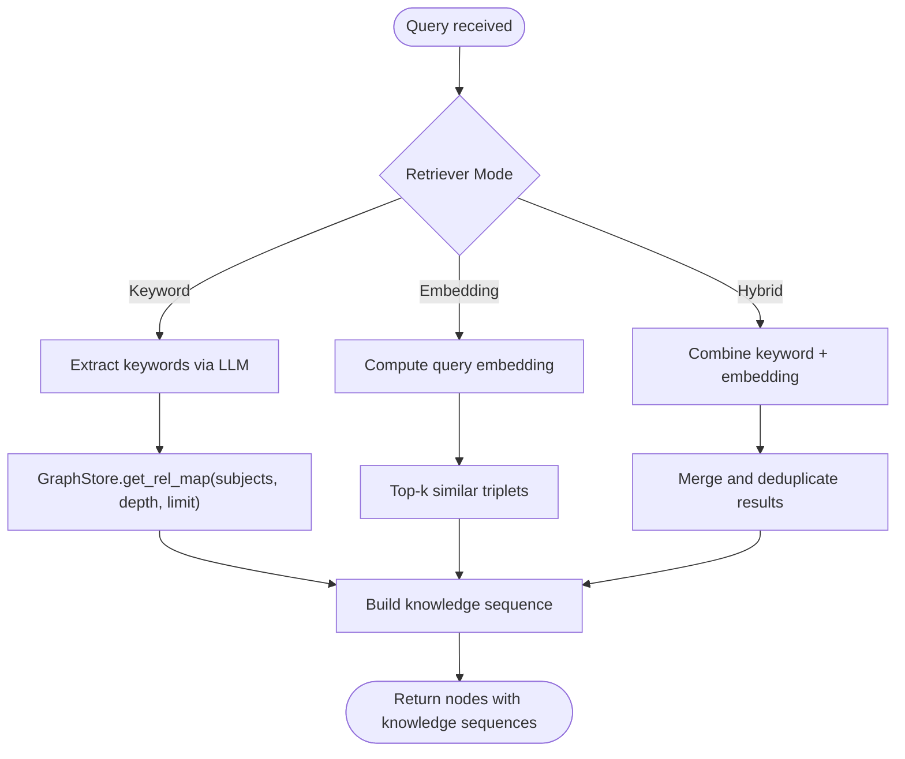
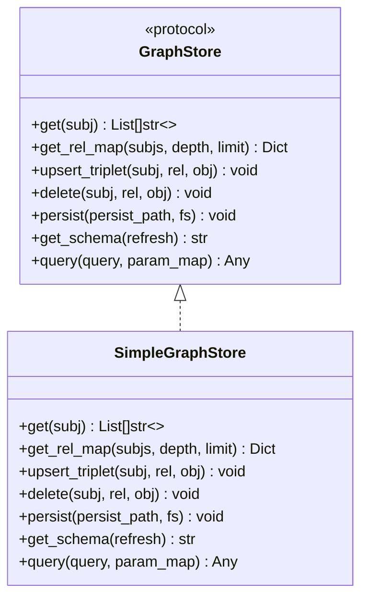
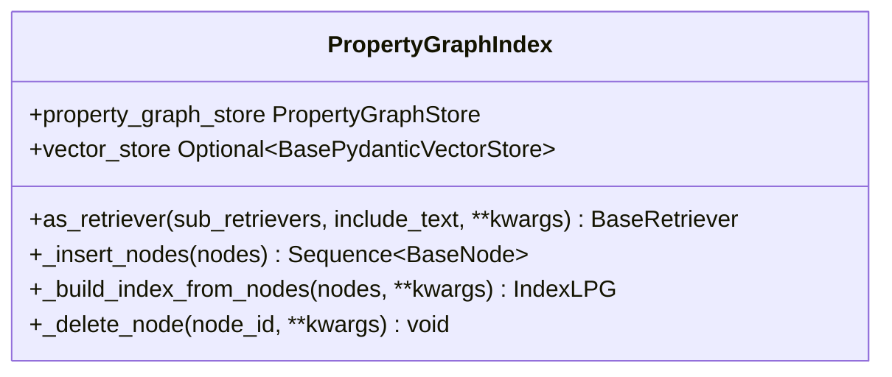
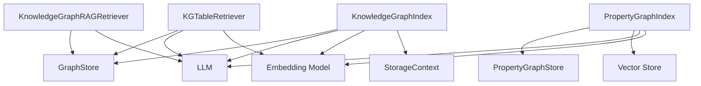

# Knowledge Graph Index

<cite>
**Referenced Files in This Document**
- [base.py](file://llama-index-core/llama_index/core/indices/knowledge_graph/base.py)
- [retrievers.py](file://llama-index-core/llama_index/core/indices/knowledge_graph/retrievers.py)
- [simple.py](file://llama-index-core/llama_index/core/graph_stores/simple.py)
- [types.py](file://llama-index-core/llama_index/core/graph_stores/types.py)
- [__init__.py](file://llama-index-core/llama_index/core/indices/knowledge_graph/__init__.py)
- [base.py](file://llama-index-core/llama_index/core/indices/property_graph/base.py)
- [__init__.py](file://llama-index-core/llama_index/core/indices/property_graph/__init__.py)
</cite>

## Table of Contents
1. [Introduction](#introduction)
2. [Project Structure](#project-structure)
3. [Core Components](#core-components)
4. [Architecture Overview](#architecture-overview)
5. [Detailed Component Analysis](#detailed-component-analysis)
6. [Dependency Analysis](#dependency-analysis)
7. [Performance Considerations](#performance-considerations)
8. [Troubleshooting Guide](#troubleshooting-guide)
9. [Conclusion](#conclusion)
10. [Appendices](#appendices)

## Introduction
This document provides comprehensive API documentation for the Knowledge Graph Index, focusing on the KnowledgeGraphIndex class, its constructor parameters, graph schema configuration, and entity extraction settings. It explains how entities and relationships are extracted from text, stored in the knowledge graph, and queried. It also covers the relationship with reasoning engines and graph traversal algorithms, highlights advantages for complex reasoning tasks, and provides practical guidance on configuration, entity extraction pipelines, and graph-based queries. Finally, it outlines performance considerations and use cases where graph indexes excel.

## Project Structure
The Knowledge Graph Index is part of the indices subsystem and integrates with graph stores and retrieval mechanisms. The primary components are:
- KnowledgeGraphIndex: The legacy knowledge graph index that extracts triplets and leverages them at query time.
- KGTableRetriever and KnowledgeGraphRAGRetriever: Legacy retrievers for keyword, embedding, and hybrid retrieval modes.
- SimpleGraphStore: A simple in-memory graph store for triplets.
- PropertyGraphIndex: The modern replacement for KnowledgeGraphIndex, offering richer graph schema and retrievers.

**Diagram sources**
- [base.py](file://llama-index-core/llama_index/core/indices/knowledge_graph/base.py#L42-L389)
- [retrievers.py](file://llama-index-core/llama_index/core/indices/knowledge_graph/retrievers.py#L68-L860)
- [simple.py](file://llama-index-core/llama_index/core/graph_stores/simple.py#L72-L187)
- [base.py](file://llama-index-core/llama_index/core/indices/property_graph/base.py#L43-L410)

**Section sources**
- [__init__.py](file://llama-index-core/llama_index/core/indices/knowledge_graph/__init__.py#L1-L16)
- [__init__.py](file://llama-index-core/llama_index/core/indices/property_graph/__init__.py#L1-L54)

## Core Components
- KnowledgeGraphIndex: Builds a knowledge graph by extracting triplets from text and storing them in a graph store. It supports keyword-based retrieval and hybrid retrieval when embeddings are enabled.
- KGTableRetriever: Retrieves relevant triplets using keyword extraction and optionally embedding similarity, then constructs context nodes for downstream synthesis.
- KnowledgeGraphRAGRetriever: Performs subgraph traversal to build a knowledge sequence and supports entity extraction and synonym expansion policies.
- SimpleGraphStore: Stores triplets in a simple in-memory dictionary and supports depth-aware traversal and upsert operations.
- PropertyGraphIndex: Modern property graph index supporting labelled nodes, relations, and structured/vector queries via retrievers.

**Section sources**
- [base.py](file://llama-index-core/llama_index/core/indices/knowledge_graph/base.py#L42-L389)
- [retrievers.py](file://llama-index-core/llama_index/core/indices/knowledge_graph/retrievers.py#L68-L860)
- [simple.py](file://llama-index-core/llama_index/core/graph_stores/simple.py#L72-L187)
- [base.py](file://llama-index-core/llama_index/core/indices/property_graph/base.py#L43-L410)

## Architecture Overview
The Knowledge Graph Index architecture centers around triplet extraction, graph storage, and retrieval. At indexing time, triplets are extracted from node content and inserted into the graph store. At query time, retrievers extract keywords or entities, traverse the graph store, and assemble context nodes for downstream synthesis.

**Diagram sources**
- [base.py](file://llama-index-core/llama_index/core/indices/knowledge_graph/base.py#L152-L232)
- [simple.py](file://llama-index-core/llama_index/core/graph_stores/simple.py#L117-L130)
- [retrievers.py](file://llama-index-core/llama_index/core/indices/knowledge_graph/retrievers.py#L190-L381)

## Detailed Component Analysis

### KnowledgeGraphIndex
- Purpose: Extract triplets from text and store them in a graph store; leverage the graph during query-time.
- Constructor parameters:
  - nodes: Optional sequence of nodes to index.
  - objects: Optional sequence of index nodes.
  - index_struct: Optional prebuilt index structure.
  - llm: Optional LLM for triplet extraction and keyword extraction.
  - embed_model: Optional embedding model for triplet embeddings.
  - storage_context: Optional storage context.
  - kg_triplet_extract_template: Optional prompt template for triplet extraction.
  - max_triplets_per_chunk: Maximum triplets to extract per chunk.
  - include_embeddings: Whether to compute and store embeddings for triplets.
  - show_progress: Whether to display progress bars.
  - max_object_length: Maximum allowed length for triplet object tokens.
  - kg_triplet_extract_fn: Optional custom function for triplet extraction.
- Key behaviors:
  - Triplets are extracted via LLM or a custom function and normalized.
  - Triplets are upserted into the graph store and linked to source nodes.
  - Retrieval modes: keyword, embedding, hybrid (auto-selected based on embeddings availability).
  - Utility methods: upsert_triplet, add_node, upsert_triplet_and_node, get_networkx_graph, query_context.

**Diagram sources**
- [base.py](file://llama-index-core/llama_index/core/indices/knowledge_graph/base.py#L42-L389)
- [simple.py](file://llama-index-core/llama_index/core/graph_stores/simple.py#L72-L187)

**Section sources**
- [base.py](file://llama-index-core/llama_index/core/indices/knowledge_graph/base.py#L66-L108)
- [base.py](file://llama-index-core/llama_index/core/indices/knowledge_graph/base.py#L152-L232)
- [base.py](file://llama-index-core/llama_index/core/indices/knowledge_graph/base.py#L256-L318)

### Retrievers
- KGTableRetriever:
  - Modes: keyword, embedding, hybrid.
  - Keyword extraction uses an LLM template; embeddings are optional.
  - Traverses the graph store with configurable depth and limits.
  - Assembles context nodes containing knowledge sequences for downstream synthesis.
- KnowledgeGraphRAGRetriever:
  - Extracts entities from queries using a function or LLM template.
  - Supports union/intersection policies for entity extraction.
  - Expands synonyms and builds knowledge sequences via graph store traversal.
  - Optionally synthesizes graph queries and answers.

**Diagram sources**
- [retrievers.py](file://llama-index-core/llama_index/core/indices/knowledge_graph/retrievers.py#L190-L381)
- [retrievers.py](file://llama-index-core/llama_index/core/indices/knowledge_graph/retrievers.py#L417-L800)

**Section sources**
- [retrievers.py](file://llama-index-core/llama_index/core/indices/knowledge_graph/retrievers.py#L68-L156)
- [retrievers.py](file://llama-index-core/llama_index/core/indices/knowledge_graph/retrievers.py#L190-L381)
- [retrievers.py](file://llama-index-core/llama_index/core/indices/knowledge_graph/retrievers.py#L417-L800)

### Graph Store Types and SimpleGraphStore
- GraphStore protocol defines the interface for getting triplets, traversals, upserting/deleting triplets, persistence, schema retrieval, and structured queries.
- SimpleGraphStore implements an in-memory dictionary mapping subjects to relations and objects, with depth-aware traversal and persistence to JSON.

**Diagram sources**
- [types.py](file://llama-index-core/llama_index/core/graph_stores/types.py#L216-L274)
- [simple.py](file://llama-index-core/llama_index/core/graph_stores/simple.py#L72-L187)

**Section sources**
- [types.py](file://llama-index-core/llama_index/core/graph_stores/types.py#L216-L274)
- [simple.py](file://llama-index-core/llama_index/core/graph_stores/simple.py#L72-L187)

### PropertyGraphIndex (Modern Alternative)
- PropertyGraphIndex is the recommended successor to KnowledgeGraphIndex, supporting labelled nodes, relations, and richer retrieval strategies.
- Constructor parameters include:
  - nodes: Nodes to insert.
  - llm: LLM for triplet extraction.
  - kg_extractors: Transformations for extracting triplets (e.g., SimpleLLMPathExtractor, ImplicitPathExtractor).
  - property_graph_store: Property graph store (e.g., SimplePropertyGraphStore).
  - vector_store: Optional vector store for embedding nodes.
  - use_async: Whether to use async transformations.
  - embed_model: Embedding model for nodes and triplets.
  - embed_kg_nodes: Whether to embed KG nodes.
  - storage_context: Storage context.
  - show_progress: Progress display flag.
- Retrieval:
  - PGRetriever composes sub-retrievers (e.g., LLMSynonymRetriever, VectorContextRetriever) depending on capabilities of the property graph store.

**Diagram sources**
- [base.py](file://llama-index-core/llama_index/core/indices/property_graph/base.py#L43-L410)

**Section sources**
- [base.py](file://llama-index-core/llama_index/core/indices/property_graph/base.py#L80-L143)
- [base.py](file://llama-index-core/llama_index/core/indices/property_graph/base.py#L341-L393)

## Dependency Analysis
- KnowledgeGraphIndex depends on:
  - GraphStore for triplets and traversal.
  - LLM for triplet extraction and keyword extraction.
  - Embedding model for optional triplet embeddings.
  - StorageContext for persistence and index struct storage.
- Retrievers depend on:
  - GraphStore traversal APIs.
  - LLM for keyword/entity extraction and optional synonym expansion.
  - Embedding model for similarity search (when enabled).
- PropertyGraphIndex depends on:
  - PropertyGraphStore for labelled nodes/relations.
  - Vector store for embedding nodes when the graph store lacks vector query support.

**Diagram sources**
- [base.py](file://llama-index-core/llama_index/core/indices/knowledge_graph/base.py#L42-L108)
- [retrievers.py](file://llama-index-core/llama_index/core/indices/knowledge_graph/retrievers.py#L68-L156)
- [base.py](file://llama-index-core/llama_index/core/indices/property_graph/base.py#L43-L143)

**Section sources**
- [base.py](file://llama-index-core/llama_index/core/indices/knowledge_graph/base.py#L42-L108)
- [retrievers.py](file://llama-index-core/llama_index/core/indices/knowledge_graph/retrievers.py#L68-L156)
- [base.py](file://llama-index-core/llama_index/core/indices/property_graph/base.py#L43-L143)

## Performance Considerations
- Triplets extraction cost: Controlled by max_triplets_per_chunk and max_object_length to prevent oversized or malformed triplets.
- Embedding computation: Enabling include_embeddings increases memory and compute costs; consider batching and async execution.
- Graph traversal: Depth and limit parameters in get_rel_map control traversal breadth and performance trade-offs.
- Retrieval modes: Hybrid mode combines keyword and embedding retrieval; tune similarity_top_k and max_knowledge_sequence to balance quality and latency.
- Persistence: SimpleGraphStore persists to JSON; for large graphs, consider integrating a production graph store with native traversal and indexing.

[No sources needed since this section provides general guidance]

## Troubleshooting Guide
- Triplets not appearing in the graph:
  - Verify that kg_triplet_extract_fn is configured or that the LLM returns properly formatted triplets.
  - Check max_object_length and parsing logic for malformed triplets.
- Retrieval returns no results:
  - Ensure keywords are being extracted; confirm retriever_mode selection and graph store traversal depth.
  - For embedding mode, verify embeddings were computed during indexing.
- NetworkX visualization errors:
  - Install networkx and ensure get_networkx_graph is called with appropriate limit.

**Section sources**
- [base.py](file://llama-index-core/llama_index/core/indices/knowledge_graph/base.py#L168-L202)
- [retrievers.py](file://llama-index-core/llama_index/core/indices/knowledge_graph/retrievers.py#L247-L275)
- [base.py](file://llama-index-core/llama_index/core/indices/knowledge_graph/base.py#L343-L384)

## Conclusion
KnowledgeGraphIndex offers a straightforward approach to building and querying knowledge graphs from text by extracting triplets and traversing a graph store. While it remains functional, PropertyGraphIndex provides a more robust, schema-rich foundation with advanced retrievers and vector integration. Choose KnowledgeGraphIndex for quick prototypes or simple triplets; opt for PropertyGraphIndex for complex reasoning, structured queries, and scalable deployments.

[No sources needed since this section summarizes without analyzing specific files]

## Appendices

### API Reference Highlights
- KnowledgeGraphIndex
  - Constructor parameters: nodes, objects, index_struct, llm, embed_model, storage_context, kg_triplet_extract_template, max_triplets_per_chunk, include_embeddings, show_progress, max_object_length, kg_triplet_extract_fn.
  - Methods: as_retriever, upsert_triplet, add_node, upsert_triplet_and_node, get_networkx_graph, query_context.
- KGTableRetriever
  - Constructor parameters: index, llm, embed_model, query_keyword_extract_template, max_keywords_per_query, num_chunks_per_query, include_text, retriever_mode, similarity_top_k, graph_store_query_depth, use_global_node_triplets, max_knowledge_sequence.
  - Methods: _get_keywords, _retrieve, _get_metadata_for_response.
- KnowledgeGraphRAGRetriever
  - Constructor parameters: storage_context, llm, entity_extract_fn, entity_extract_template, entity_extract_policy, synonym_expand_fn, synonym_expand_template, synonym_expand_policy, max_entities, max_synonyms, retriever_mode, with_nl2graphquery, graph_traversal_depth, max_knowledge_sequence, verbose.
  - Methods: _get_entities, _get_knowledge_sequence, _build_nodes, _retrieve_keyword.
- SimpleGraphStore
  - Methods: get, get_rel_map, upsert_triplet, delete, persist, get_schema, query.
- PropertyGraphIndex
  - Constructor parameters: nodes, llm, kg_extractors, property_graph_store, vector_store, use_async, embed_model, embed_kg_nodes, storage_context, show_progress.
  - Methods: as_retriever, _insert_nodes, _build_index_from_nodes, _delete_node.

**Section sources**
- [base.py](file://llama-index-core/llama_index/core/indices/knowledge_graph/base.py#L66-L108)
- [retrievers.py](file://llama-index-core/llama_index/core/indices/knowledge_graph/retrievers.py#L100-L156)
- [retrievers.py](file://llama-index-core/llama_index/core/indices/knowledge_graph/retrievers.py#L454-L540)
- [simple.py](file://llama-index-core/llama_index/core/graph_stores/simple.py#L85-L187)
- [base.py](file://llama-index-core/llama_index/core/indices/property_graph/base.py#L80-L143)