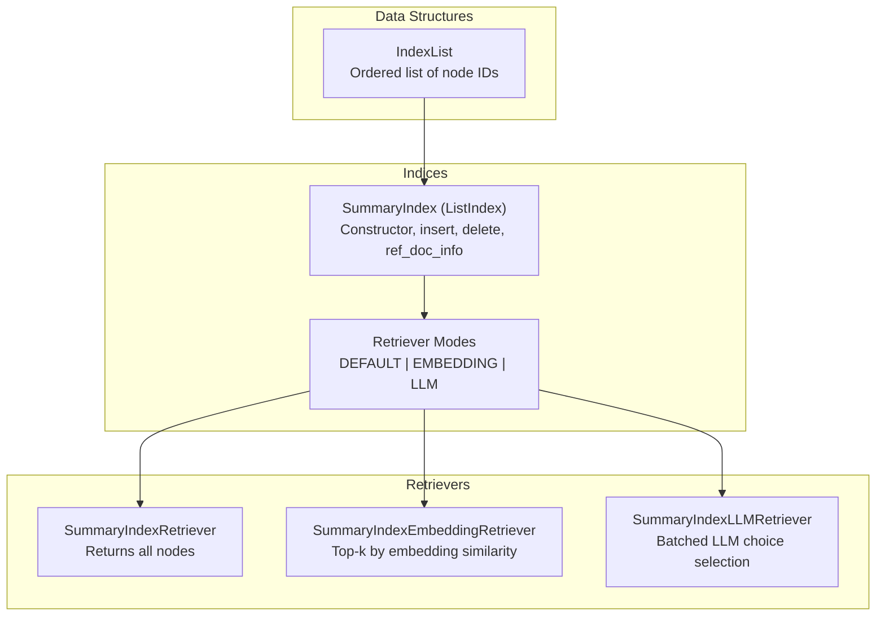
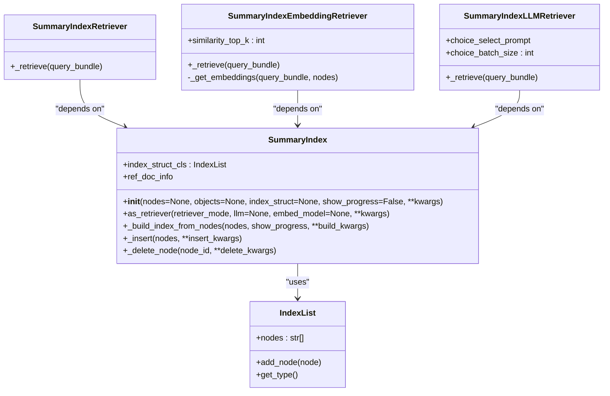
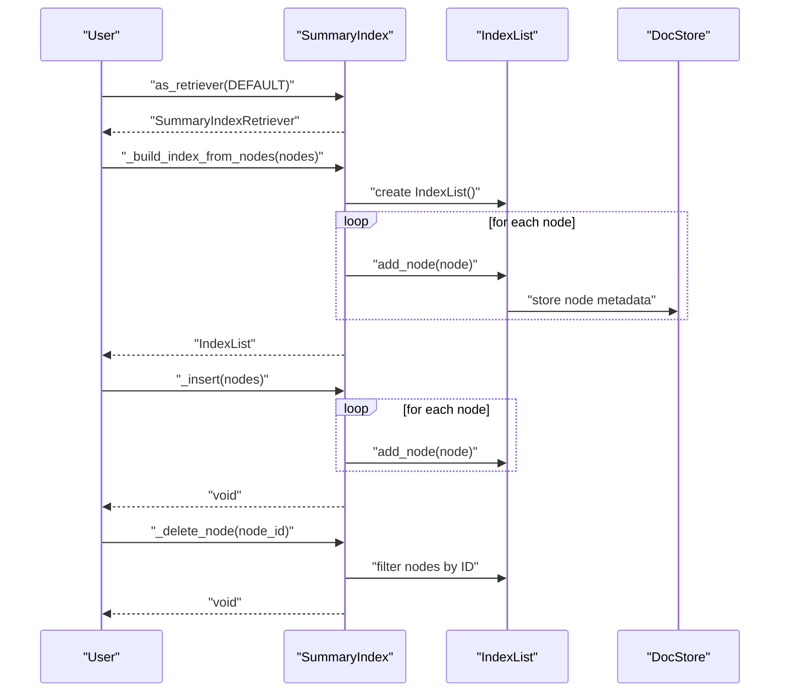
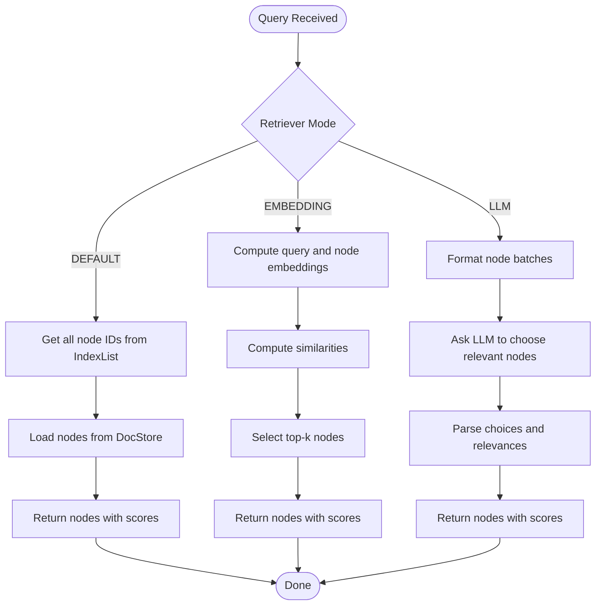
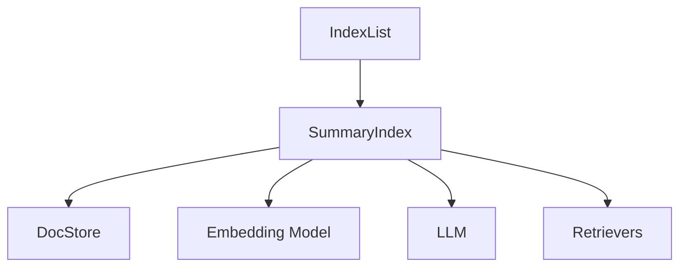

# List Index

<cite>
**Referenced Files in This Document**
- [data_structs.py](file://llama-index-core/llama_index/core/data_structs/data_structs.py)
- [__init__.py](file://llama-index-core/llama_index/core/data_structs/__init__.py)
- [base.py](file://llama-index-core/llama_index/core/indices/list/base.py)
- [retrievers.py](file://llama-index-core/llama_index/core/indices/list/retrievers.py)
- [README.md](file://llama-index-core/llama_index/core/indices/list/README.md)
- [__init__.py](file://llama-index-core/llama_index/core/indices/list/__init__.py)
</cite>

## Table of Contents
1. [Introduction](#introduction)
2. [Project Structure](#project-structure)
3. [Core Components](#core-components)
4. [Architecture Overview](#architecture-overview)
5. [Detailed Component Analysis](#detailed-component-analysis)
6. [Dependency Analysis](#dependency-analysis)
7. [Performance Considerations](#performance-considerations)
8. [Troubleshooting Guide](#troubleshooting-guide)
9. [Conclusion](#conclusion)

## Introduction
This document provides comprehensive API documentation for List Index (also known as SummaryIndex/ListIndex). It explains the constructor parameters, list-based storage configuration, sequential access patterns, and how documents are stored in ordered lists, accessed sequentially, and queried. It also covers retriever modes, container builder functionality, and practical examples for creating and configuring list indexes. Finally, it outlines when List Index is appropriate, its simplicity advantages, and its limitations compared to more complex index types.

## Project Structure
The List Index implementation spans several modules:
- Data structures: defines the IndexList storage model used by List Index
- Indices: contains the List Index class and its retrievers
- Retrievers: provide retrieval strategies for List Index

**Diagram sources**
- [data_structs.py](file://llama-index-core/llama_index/core/data_structs/data_structs.py#L150-L164)
- [base.py](file://llama-index-core/llama_index/core/indices/list/base.py#L29-L157)
- [retrievers.py](file://llama-index-core/llama_index/core/indices/list/retrievers.py#L31-L229)

**Section sources**
- [data_structs.py](file://llama-index-core/llama_index/core/data_structs/data_structs.py#L1-L280)
- [base.py](file://llama-index-core/llama_index/core/indices/list/base.py#L1-L157)
- [retrievers.py](file://llama-index-core/llama_index/core/indices/list/retrievers.py#L1-L229)
- [README.md](file://llama-index-core/llama_index/core/indices/list/README.md#L1-L23)

## Core Components
- IndexList: Ordered list storing node IDs in insertion order
- SummaryIndex (ListIndex): Index built from nodes and supporting sequential access and retrieval
- Retriever modes: DEFAULT (all nodes), EMBEDDING (top-k by similarity), LLM (batched LLM choice selection)

Key capabilities:
- Construction from nodes or objects
- Sequential iteration over nodes
- Insert/delete operations
- Retrieval via different strategies

**Section sources**
- [data_structs.py](file://llama-index-core/llama_index/core/data_structs/data_structs.py#L150-L164)
- [base.py](file://llama-index-core/llama_index/core/indices/list/base.py#L29-L157)
- [retrievers.py](file://llama-index-core/llama_index/core/indices/list/retrievers.py#L31-L229)

## Architecture Overview
The List Index architecture centers around IndexList for storage and SummaryIndex for orchestration. Retrievers implement different strategies for accessing nodes sequentially.

**Diagram sources**
- [data_structs.py](file://llama-index-core/llama_index/core/data_structs/data_structs.py#L150-L164)
- [base.py](file://llama-index-core/llama_index/core/indices/list/base.py#L29-L157)
- [retrievers.py](file://llama-index-core/llama_index/core/indices/list/retrievers.py#L31-L229)

## Detailed Component Analysis

### IndexList Storage Model
IndexList stores node IDs in a simple ordered list. It supports adding nodes and reporting its type.

- Fields
  - nodes: list of node IDs in insertion order
- Methods
  - add_node(node): appends node ID to the list
  - get_type(): returns the index struct type for LIST

Sequential access pattern:
- Iterating over nodes follows the order of insertion
- Deletion removes a node by ID and rebuilds the internal list

**Section sources**
- [data_structs.py](file://llama-index-core/llama_index/core/data_structs/data_structs.py#L150-L164)

### SummaryIndex (ListIndex) API
SummaryIndex is the primary class for List Index. It orchestrates building, inserting, deleting, and retrieving nodes.

- Constructor parameters
  - nodes: optional sequence of BaseNode
  - objects: optional sequence of IndexNode
  - index_struct: optional prebuilt IndexList
  - show_progress: bool to enable progress bar during processing
  - **kwargs: forwarded to base initialization

- Methods
  - as_retriever(mode, llm=None, embed_model=None, **kwargs): returns a retriever based on mode
  - _build_index_from_nodes(nodes, show_progress, **build_kwargs): creates IndexList by iterating nodes
  - _insert(nodes, **insert_kwargs): appends nodes to existing IndexList
  - _delete_node(node_id, **delete_kwargs): removes a node by ID and rebuilds node list
  - ref_doc_info: returns mapping of reference documents to their info

- Retriever modes
  - DEFAULT: returns all nodes in order
  - EMBEDDING: computes embeddings lazily and returns top-k similar nodes
  - LLM: batches nodes and asks LLM to choose relevant ones

**Diagram sources**
- [base.py](file://llama-index-core/llama_index/core/indices/list/base.py#L29-L157)
- [data_structs.py](file://llama-index-core/llama_index/core/data_structs/data_structs.py#L150-L164)

**Section sources**
- [base.py](file://llama-index-core/llama_index/core/indices/list/base.py#L29-L157)

### Retrievers: Sequential Access Patterns
Retrievers implement different strategies for sequential access over nodes.

- SummaryIndexRetriever
  - Retrieves all nodes in the order stored by IndexList
  - No filtering or ranking applied

- SummaryIndexEmbeddingRetriever
  - Computes embeddings lazily for nodes on demand
  - Uses similarity_top_k to select top-k nodes
  - Returns nodes with similarity scores

- SummaryIndexLLMRetriever
  - Batches nodes and prompts LLM to select relevant ones
  - Uses a choice-select prompt and configurable batch size
  - Returns nodes with relevance scores

**Diagram sources**
- [retrievers.py](file://llama-index-core/llama_index/core/indices/list/retrievers.py#L31-L229)
- [base.py](file://llama-index-core/llama_index/core/indices/list/base.py#L68-L95)

**Section sources**
- [retrievers.py](file://llama-index-core/llama_index/core/indices/list/retrievers.py#L31-L229)

### Container Builder Functionality
List Index does not expose a dedicated container builder. Instead, it builds its IndexList internally during construction and uses the docstore to resolve node IDs to node objects at query time. The build process iterates over nodes and appends their IDs to IndexList.

- Building from nodes
  - Creates an IndexList
  - Iterates nodes with optional progress display
  - Calls add_node for each node

- Building from objects
  - Uses the base index mechanism to convert objects to nodes and then applies the same process

- Insert and delete
  - Insert appends nodes to the existing IndexList
  - Delete filters out a node by ID and rebuilds the node list

**Section sources**
- [base.py](file://llama-index-core/llama_index/core/indices/list/base.py#L96-L131)
- [data_structs.py](file://llama-index-core/llama_index/core/data_structs/data_structs.py#L150-L164)

### Examples and Usage
- Creating a List Index from documents
  - Build index from documents
  - Convert to a query engine for answering questions

- Configuring list parameters
  - show_progress toggles progress display during index construction
  - retriever_mode selects DEFAULT, EMBEDDING, or LLM behavior

- Performing list-based operations
  - Insert additional nodes after creation
  - Delete nodes by ID
  - Retrieve nodes using the appropriate retriever

Note: See the official README example for basic usage patterns.

**Section sources**
- [README.md](file://llama-index-core/llama_index/core/indices/list/README.md#L11-L22)
- [base.py](file://llama-index-core/llama_index/core/indices/list/base.py#L49-L95)

## Dependency Analysis
The List Index depends on:
- IndexList for ordered storage of node IDs
- DocStore for resolving node IDs to node objects
- Embedding and LLM models for embedding and LLM retrievers
- Base index infrastructure for common behaviors

**Diagram sources**
- [data_structs.py](file://llama-index-core/llama_index/core/data_structs/data_structs.py#L150-L164)
- [base.py](file://llama-index-core/llama_index/core/indices/list/base.py#L29-L157)
- [retrievers.py](file://llama-index-core/llama_index/core/indices/list/retrievers.py#L31-L229)

**Section sources**
- [data_structs.py](file://llama-index-core/llama_index/core/data_structs/data_structs.py#L1-L280)
- [base.py](file://llama-index-core/llama_index/core/indices/list/base.py#L1-L157)
- [retrievers.py](file://llama-index-core/llama_index/core/indices/list/retrievers.py#L1-L229)

## Performance Considerations
- Sequential access cost
  - DEFAULT mode retrieves all nodes; cost scales linearly with number of nodes
- Embedding retriever cost
  - Embedding computation cost scales with number of nodes traversed
  - similarity_top_k reduces downstream processing
- LLM retriever cost
  - Batch size controls number of LLM calls
  - Larger batches reduce overhead but increase per-call cost
- Memory footprint
  - IndexList stores only node IDs; memory usage is proportional to number of nodes
- Lazy embedding
  - Embeddings are computed on-demand, reducing upfront compute cost

[No sources needed since this section provides general guidance]

## Troubleshooting Guide
- Missing embeddings
  - If embeddings are missing, embedding retriever will compute them on the fly
  - Ensure embed_model is configured appropriately
- LLM retriever batching
  - Adjust choice_batch_size to balance accuracy and cost
- Progress display
  - Enable show_progress to monitor long-running index builds
- Deleting nodes
  - After deletion, the internal node list is rebuilt; ensure node IDs match stored IDs

**Section sources**
- [retrievers.py](file://llama-index-core/llama_index/core/indices/list/retrievers.py#L78-L144)
- [base.py](file://llama-index-core/llama_index/core/indices/list/base.py#L56-L66)
- [base.py](file://llama-index-core/llama_index/core/indices/list/base.py#L125-L131)

## Conclusion
List Index (SummaryIndex/ListIndex) offers a simple, efficient way to store and retrieve nodes sequentially. Its strengths lie in straightforward construction, minimal overhead, and flexible retrieval modes. However, it lacks advanced indexing structures for large-scale or high-performance scenarios. Choose List Index for small to medium datasets, rapid prototyping, or when simplicity and interpretability are prioritized over complex retrieval optimizations.