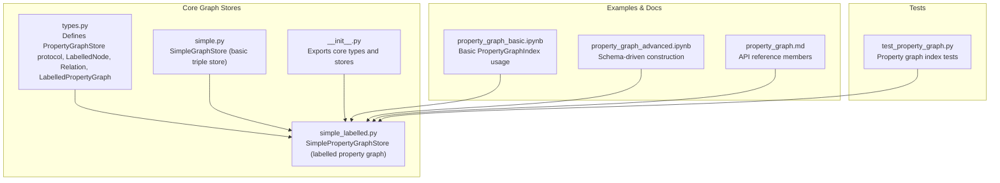
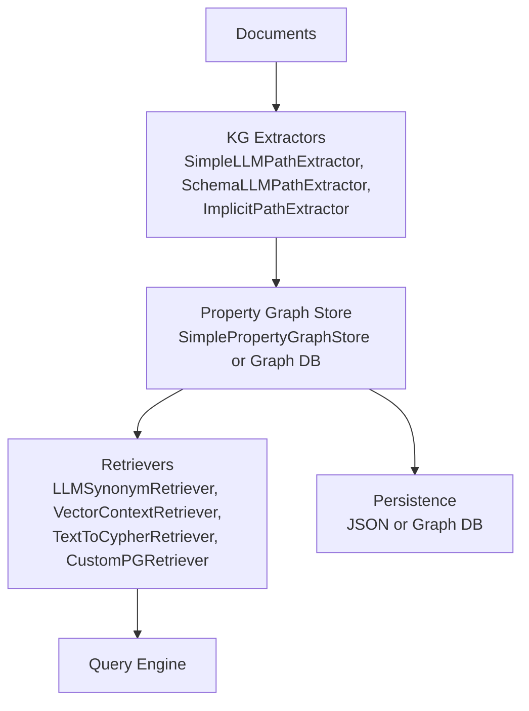
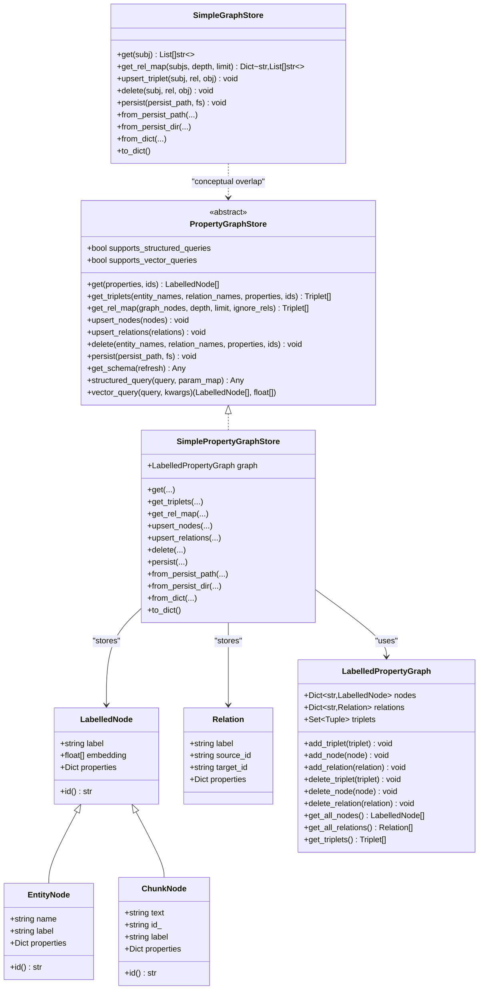
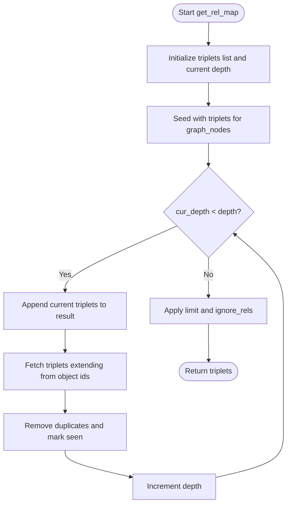
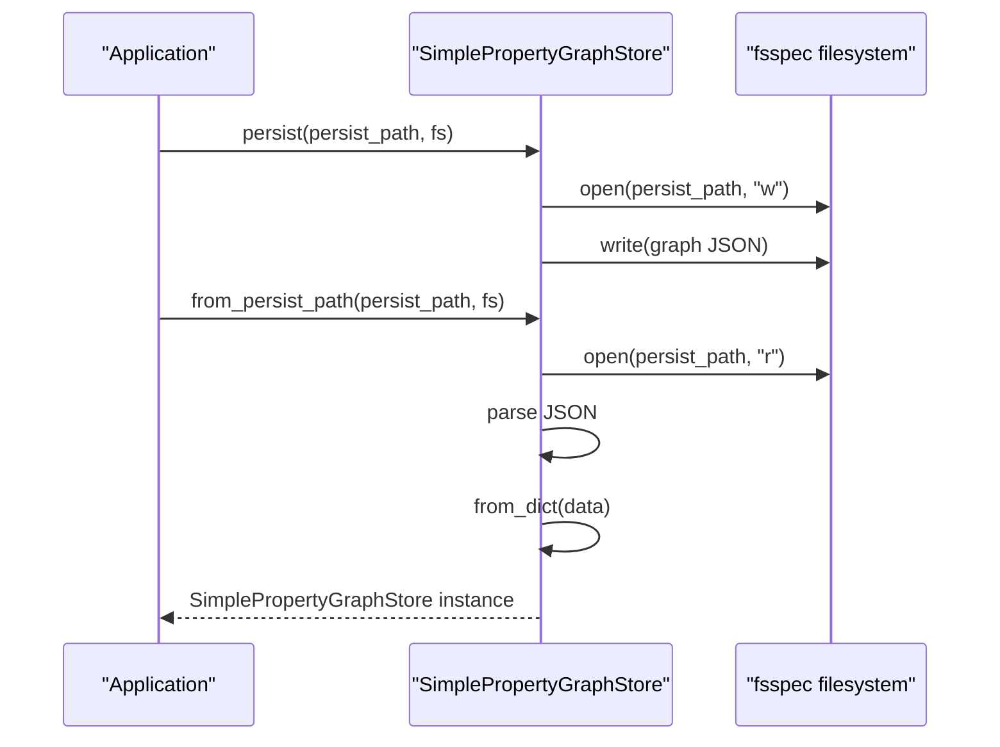
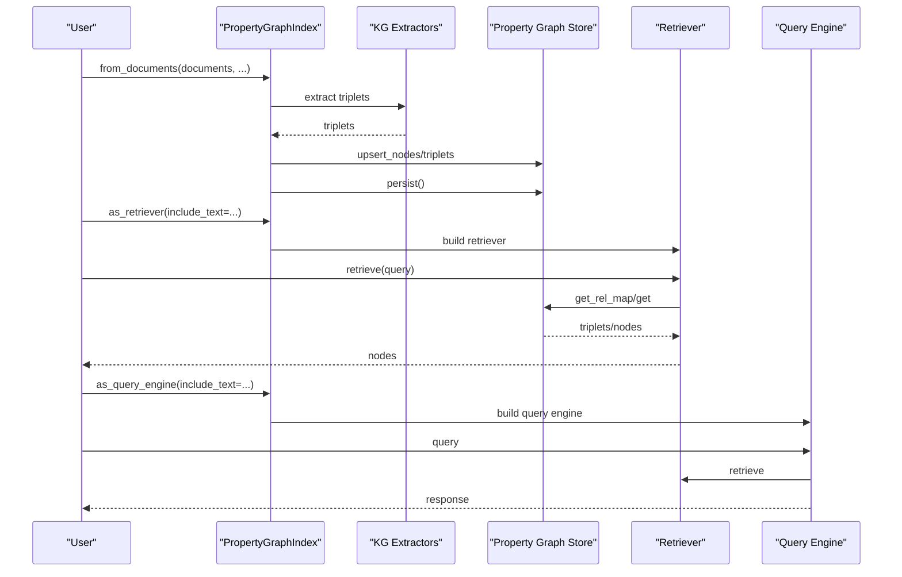
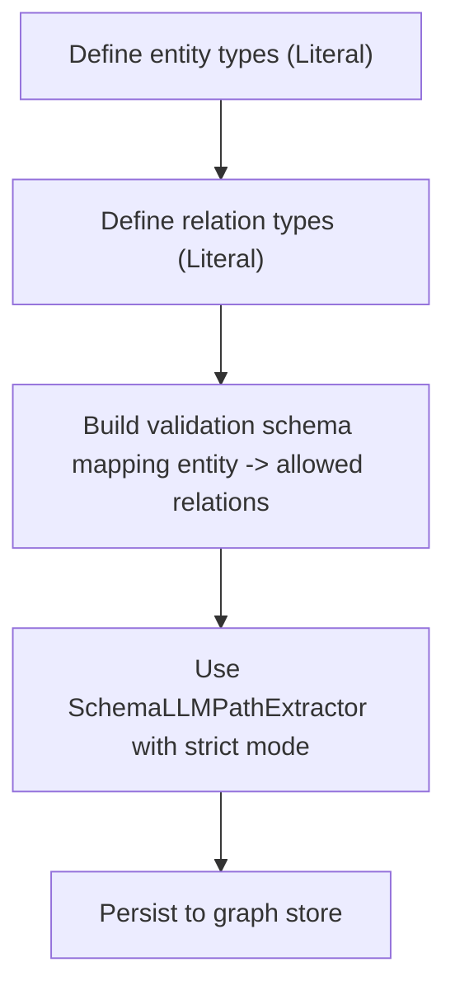
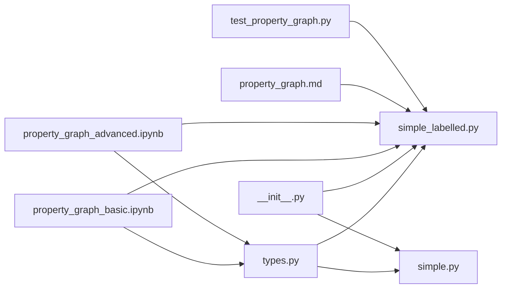

# Property Graph Index

<cite>
**Referenced Files in This Document**
- [types.py](file://llama-index-core/llama_index/core/graph_stores/types.py)
- [simple.py](file://llama-index-core/llama_index/core/graph_stores/simple.py)
- [simple_labelled.py](file://llama-index-core/llama_index/core/graph_stores/simple_labelled.py)
- [__init__.py](file://llama-index-core/llama_index/core/graph_stores/__init__.py)
- [property_graph.md](file://docs/api_reference/api_reference/indices/property_graph.md)
- [property_graph_basic.ipynb](file://docs/examples/property_graph/property_graph_basic.ipynb)
- [property_graph_advanced.ipynb](file://docs/examples/property_graph/property_graph_advanced.ipynb)
- [test_property_graph.py](file://llama-index-core/tests/indices/property_graph/test_property_graph.py)
</cite>

## Table of Contents
1. [Introduction](#introduction)
2. [Project Structure](#project-structure)
3. [Core Components](#core-components)
4. [Architecture Overview](#architecture-overview)
5. [Detailed Component Analysis](#detailed-component-analysis)
6. [Dependency Analysis](#dependency-analysis)
7. [Performance Considerations](#performance-considerations)
8. [Troubleshooting Guide](#troubleshooting-guide)
9. [Conclusion](#conclusion)
10. [Appendices](#appendices)

## Introduction
This document provides comprehensive API documentation for the Property Graph Index and its underlying property graph store. It explains the PropertyGraphIndex class constructor parameters, graph schema definition, and property storage configuration. It also details how nodes, edges, and properties are stored in property graphs, how graph traversals are performed, and how to configure property graph indexes, define schemas, and execute queries. Finally, it outlines the property graph store implementation, retriever functionality, advantages of property graphs for complex data relationships, performance characteristics, and use cases.

## Project Structure
The property graph functionality spans several modules:
- Core graph store abstractions and in-memory implementations
- Examples and API reference documentation for PropertyGraphIndex usage
- Tests validating property graph index behavior

**Diagram sources**
- [types.py](file://llama-index-core/llama_index/core/graph_stores/types.py#L276-L528)
- [simple.py](file://llama-index-core/llama_index/core/graph_stores/simple.py#L72-L187)
- [simple_labelled.py](file://llama-index-core/llama_index/core/graph_stores/simple_labelled.py#L20-L311)
- [__init__.py](file://llama-index-core/llama_index/core/graph_stores/__init__.py#L1-L22)
- [property_graph_basic.ipynb](file://docs/examples/property_graph/property_graph_basic.ipynb#L103-L113)
- [property_graph_advanced.ipynb](file://docs/examples/property_graph/property_graph_advanced.ipynb#L282-L293)
- [property_graph.md](file://docs/api_reference/api_reference/indices/property_graph.md#L1-L4)
- [test_property_graph.py](file://llama-index-core/tests/indices/property_graph/test_property_graph.py)

**Section sources**
- [types.py](file://llama-index-core/llama_index/core/graph_stores/types.py#L1-L528)
- [simple.py](file://llama-index-core/llama_index/core/graph_stores/simple.py#L1-L187)
- [simple_labelled.py](file://llama-index-core/llama_index/core/graph_stores/simple_labelled.py#L1-L311)
- [__init__.py](file://llama-index-core/llama_index/core/graph_stores/__init__.py#L1-L22)
- [property_graph.md](file://docs/api_reference/api_reference/indices/property_graph.md#L1-L4)
- [property_graph_basic.ipynb](file://docs/examples/property_graph/property_graph_basic.ipynb#L1-L419)
- [property_graph_advanced.ipynb](file://docs/examples/property_graph/property_graph_advanced.ipynb#L1-L490)
- [test_property_graph.py](file://llama-index-core/tests/indices/property_graph/test_property_graph.py)

## Core Components
This section focuses on the core abstractions and in-memory implementations used by PropertyGraphIndex.

- PropertyGraphStore protocol
  - Defines the contract for property graph storage and retrieval, including methods for getting nodes and triplets, traversals, upserts/deletes, persistence, schema retrieval, and structured/vector queries.
  - Provides synchronous and asynchronous variants for all major operations.
  - Includes conversion helpers to/from LlamaIndex BaseNode types.

- LabelledNode hierarchy
  - Base LabelledNode with label, optional embedding, and arbitrary properties.
  - EntityNode: labeled as "entity" with a name and properties.
  - ChunkNode: labeled as "text_chunk" with text content, optional id, and properties.

- Relation
  - Represents a directed relationship with label, source_id, target_id, and properties.

- LabelledPropertyGraph
  - In-memory graph composed of nodes and relations, with triplets represented as sets of (subject, relation, object) tuples.
  - Supports adding/removing triplets and nodes, and converting to/from triplets.

- SimplePropertyGraphStore
  - Implements PropertyGraphStore using LabelledPropertyGraph.
  - Provides filtering by properties and ids, traversal via get_rel_map, and persistence to JSON.
  - Does not implement structured_query or vector_query in this in-memory variant.

- SimpleGraphStore
  - Basic triple store backed by a dictionary mapping subjects to lists of (relation, object) pairs.
  - Supports get, upsert, delete, and persistence; lacks schema and query capabilities.

Key constructor parameters and configuration highlights:
- PropertyGraphStore subclasses expose supports_structured_queries and supports_vector_queries flags.
- SimplePropertyGraphStore accepts an initial LabelledPropertyGraph instance.
- Persistence defaults and filenames are defined in types.py.

**Section sources**
- [types.py](file://llama-index-core/llama_index/core/graph_stores/types.py#L276-L528)
- [types.py](file://llama-index-core/llama_index/core/graph_stores/types.py#L36-L116)
- [types.py](file://llama-index-core/llama_index/core/graph_stores/types.py#L119-L214)
- [simple_labelled.py](file://llama-index-core/llama_index/core/graph_stores/simple_labelled.py#L20-L311)
- [simple.py](file://llama-index-core/llama_index/core/graph_stores/simple.py#L72-L187)

## Architecture Overview
The PropertyGraphIndex integrates extraction, storage, and retrieval to form a property graph over unstructured text. At a high level:
- Extraction: Path extractors produce entity/relation triplets from documents.
- Storage: Triplets and nodes are persisted in a property graph store (default in-memory, optionally external graph databases).
- Retrieval: Sub-retrievers (synonym/keyword, vector, and others) traverse the graph to select relevant nodes and return paths or source text.

**Diagram sources**
- [property_graph_basic.ipynb](file://docs/examples/property_graph/property_graph_basic.ipynb#L107-L113)
- [property_graph_advanced.ipynb](file://docs/examples/property_graph/property_graph_advanced.ipynb#L282-L293)
- [property_graph.md](file://docs/api_reference/api_reference/indices/property_graph.md#L1-L4)

## Detailed Component Analysis

### PropertyGraphStore Protocol and Implementations
This section analyzes the core protocol and in-memory implementations.

**Diagram sources**
- [types.py](file://llama-index-core/llama_index/core/graph_stores/types.py#L276-L528)
- [types.py](file://llama-index-core/llama_index/core/graph_stores/types.py#L36-L116)
- [types.py](file://llama-index-core/llama_index/core/graph_stores/types.py#L119-L214)
- [simple_labelled.py](file://llama-index-core/llama_index/core/graph_stores/simple_labelled.py#L20-L311)
- [simple.py](file://llama-index-core/llama_index/core/graph_stores/simple.py#L72-L187)

**Section sources**
- [types.py](file://llama-index-core/llama_index/core/graph_stores/types.py#L276-L528)
- [simple_labelled.py](file://llama-index-core/llama_index/core/graph_stores/simple_labelled.py#L20-L311)
- [simple.py](file://llama-index-core/llama_index/core/graph_stores/simple.py#L72-L187)

### Property Graph Traversal and Retrieval
Traversal is implemented via get_rel_map, which performs depth-aware expansion from seed nodes. It accumulates triplets up to a configurable limit and can ignore specific relation types.

**Diagram sources**
- [simple_labelled.py](file://llama-index-core/llama_index/core/graph_stores/simple_labelled.py#L103-L131)

**Section sources**
- [simple_labelled.py](file://llama-index-core/llama_index/core/graph_stores/simple_labelled.py#L103-L131)

### Property Graph Store Persistence and Loading
SimplePropertyGraphStore persists and loads the entire graph as JSON. It supports loading from a directory using a default filename and reconstructs nodes by inferring their type from serialized data.

**Diagram sources**
- [simple_labelled.py](file://llama-index-core/llama_index/core/graph_stores/simple_labelled.py#L164-L196)
- [simple_labelled.py](file://llama-index-core/llama_index/core/graph_stores/simple_labelled.py#L198-L225)

**Section sources**
- [simple_labelled.py](file://llama-index-core/llama_index/core/graph_stores/simple_labelled.py#L164-L225)

### Property Graph Index Construction and Queries
PropertyGraphIndex integrates extraction, storage, and retrieval. Typical construction involves:
- Loading documents
- Extracting paths (implicit and LLM-based)
- Generating embeddings
- Storing triplets and nodes in a property graph store
- Persisting to disk

Retrieval combines multiple sub-retrievers (synonym expansion, vector context) to select nodes and return either paths or paths plus source text.

**Diagram sources**
- [property_graph_basic.ipynb](file://docs/examples/property_graph/property_graph_basic.ipynb#L107-L113)
- [property_graph_basic.ipynb](file://docs/examples/property_graph/property_graph_basic.ipynb#L260-L268)
- [property_graph_basic.ipynb](file://docs/examples/property_graph/property_graph_basic.ipynb#L284-L291)
- [property_graph_advanced.ipynb](file://docs/examples/property_graph/property_graph_advanced.ipynb#L359-L380)
- [property_graph_advanced.ipynb](file://docs/examples/property_graph/property_graph_advanced.ipynb#L388-L394)

**Section sources**
- [property_graph_basic.ipynb](file://docs/examples/property_graph/property_graph_basic.ipynb#L103-L113)
- [property_graph_basic.ipynb](file://docs/examples/property_graph/property_graph_basic.ipynb#L260-L291)
- [property_graph_advanced.ipynb](file://docs/examples/property_graph/property_graph_advanced.ipynb#L359-L394)

### Defining Graph Schemas and Validation
Schema-driven extraction constrains entity and relation types and their allowed connections, ensuring consistent graph construction.

**Diagram sources**
- [property_graph_advanced.ipynb](file://docs/examples/property_graph/property_graph_advanced.ipynb#L118-L142)

**Section sources**
- [property_graph_advanced.ipynb](file://docs/examples/property_graph/property_graph_advanced.ipynb#L118-L142)

## Dependency Analysis
The core graph store module exports key types and stores, while PropertyGraphIndex relies on these abstractions and the examples demonstrate usage patterns.

**Diagram sources**
- [__init__.py](file://llama-index-core/llama_index/core/graph_stores/__init__.py#L1-L22)
- [types.py](file://llama-index-core/llama_index/core/graph_stores/types.py#L1-L528)
- [simple_labelled.py](file://llama-index-core/llama_index/core/graph_stores/simple_labelled.py#L1-L311)
- [simple.py](file://llama-index-core/llama_index/core/graph_stores/simple.py#L1-L187)
- [property_graph_basic.ipynb](file://docs/examples/property_graph/property_graph_basic.ipynb#L1-L419)
- [property_graph_advanced.ipynb](file://docs/examples/property_graph/property_graph_advanced.ipynb#L1-L490)
- [property_graph.md](file://docs/api_reference/api_reference/indices/property_graph.md#L1-L4)
- [test_property_graph.py](file://llama-index-core/tests/indices/property_graph/test_property_graph.py)

**Section sources**
- [__init__.py](file://llama-index-core/llama_index/core/graph_stores/__init__.py#L1-L22)
- [types.py](file://llama-index-core/llama_index/core/graph_stores/types.py#L1-L528)
- [simple_labelled.py](file://llama-index-core/llama_index/core/graph_stores/simple_labelled.py#L1-L311)
- [simple.py](file://llama-index-core/llama_index/core/graph_stores/simple.py#L1-L187)
- [property_graph.md](file://docs/api_reference/api_reference/indices/property_graph.md#L1-L4)
- [test_property_graph.py](file://llama-index-core/tests/indices/property_graph/test_property_graph.py)

## Performance Considerations
- In-memory stores
  - SimplePropertyGraphStore and SimpleGraphStore are optimized for simplicity and speed in small-scale scenarios. They do not implement vector or structured queries in the in-memory variant.
- Traversal limits
  - get_rel_map applies a depth limit and a total limit on returned triplets to avoid combinatorial explosion.
- Embedding generation
  - Embeddings are generated for both text chunks and graph nodes during ingestion; consider batching and resource constraints when scaling.
- Persistence
  - JSON persistence is straightforward but may not scale to very large graphs. Consider external graph databases for production deployments.

[No sources needed since this section provides general guidance]

## Troubleshooting Guide
Common issues and resolutions:
- Missing client or schema support
  - Some stores (e.g., SimplePropertyGraphStore) do not implement client access or schema retrieval; use graph database-backed stores if these features are required.
- Vector and structured query not implemented
  - The in-memory SimplePropertyGraphStore raises NotImplementedError for vector_query and structured_query; switch to a graph store that supports these features (e.g., Neo4j, NebulaGraph integrations).
- Persistence errors
  - Ensure the persist directory exists and is writable; use from_persist_dir or from_persist_path with appropriate filesystems.
- Retrieval yields unexpected results
  - Adjust depth and limit parameters in get_rel_map; filter out unwanted relations via ignore_rels.

**Section sources**
- [simple_labelled.py](file://llama-index-core/llama_index/core/graph_stores/simple_labelled.py#L233-L253)
- [simple_labelled.py](file://llama-index-core/llama_index/core/graph_stores/simple_labelled.py#L164-L196)

## Conclusion
PropertyGraphIndex leverages a property graph abstraction to represent entities and relationships extracted from unstructured text. The PropertyGraphStore protocol and in-memory implementations provide a flexible foundation for storage, traversal, and retrieval. By combining schema-driven extraction, graph traversal, and hybrid retrieval strategies (synonym expansion and vector context), PropertyGraphIndex enables powerful querying over complex relationships. For production workloads requiring advanced graph features, consider integrating with external graph databases through compatible property graph stores.

[No sources needed since this section summarizes without analyzing specific files]

## Appendices

### API Reference Highlights
- PropertyGraphIndex members include PropertyGraphIndex, PGRetriever, BasePGRetriever, CustomPGRetriever, CypherTemplateRetriever, LLMSynonymRetriever, TextToCypherRetriever, VectorContextRetriever, ImplicitPathExtractor, SchemaLLMPathExtractor, SimpleLLMPathExtractor.

**Section sources**
- [property_graph.md](file://docs/api_reference/api_reference/indices/property_graph.md#L1-L4)