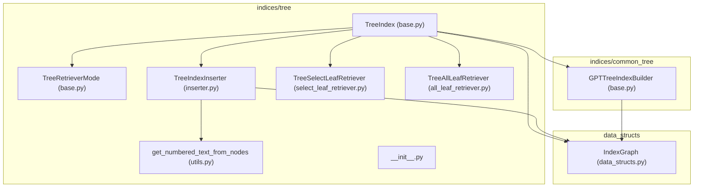
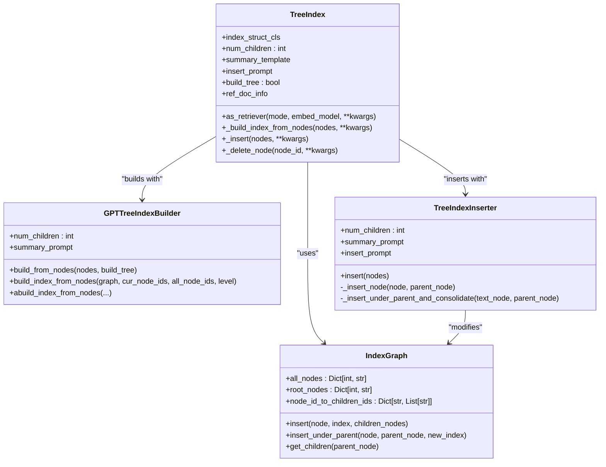
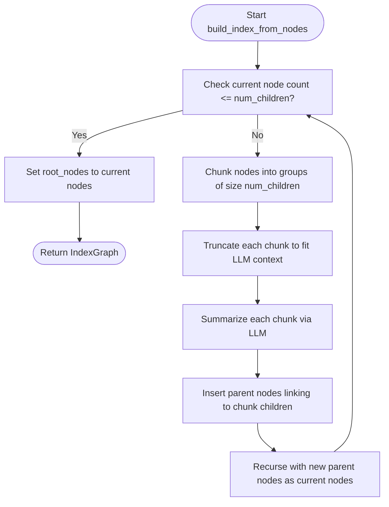
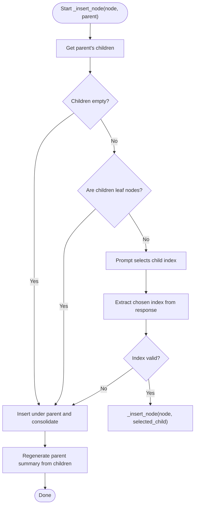
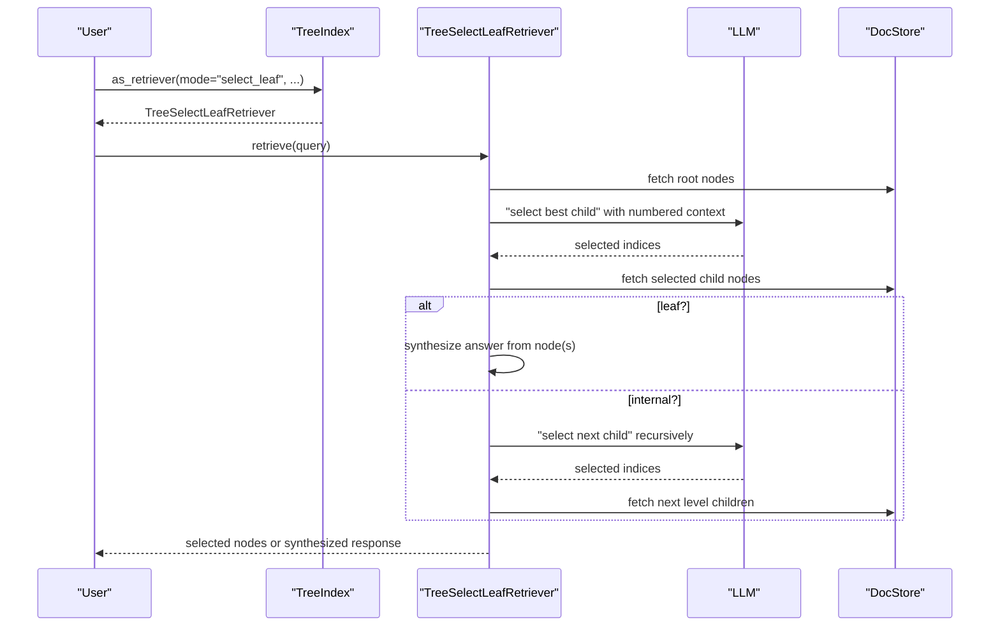
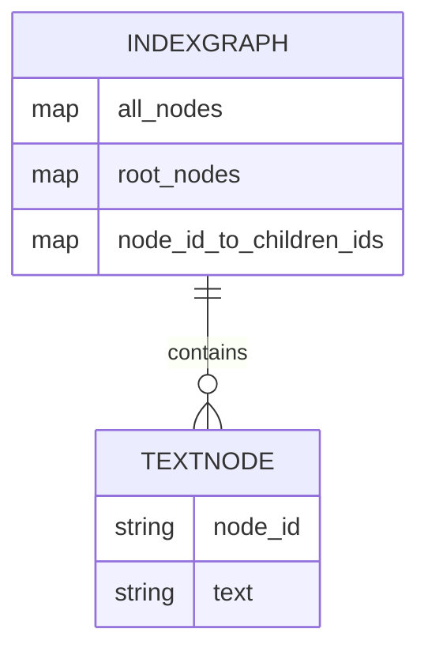
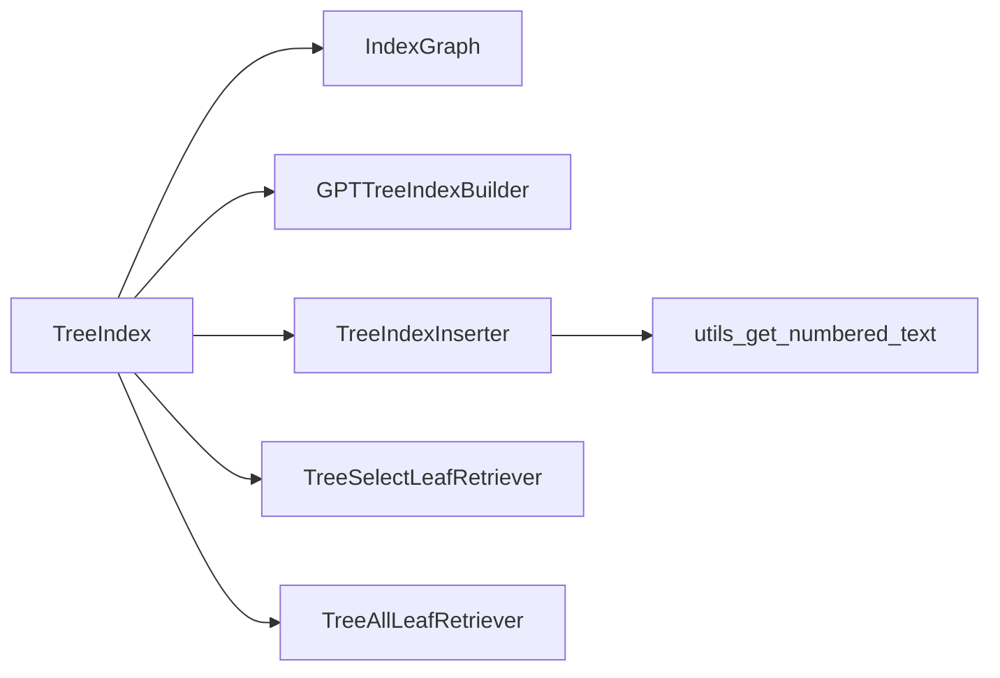

# Tree Index

<cite>
**Referenced Files in This Document**
- [base.py](file://llama-index-core/llama_index/core/indices/tree/base.py)
- [inserter.py](file://llama-index-core/llama_index/core/indices/tree/inserter.py)
- [utils.py](file://llama-index-core/llama_index/core/indices/tree/utils.py)
- [__init__.py](file://llama-index-core/llama_index/core/indices/tree/__init__.py)
- [data_structs.py](file://llama-index-core/llama_index/core/data_structs/data_structs.py)
- [base.py](file://llama-index-core/llama_index/core/indices/common_tree/base.py)
- [select_leaf_retriever.py](file://llama-index-core/llama_index/core/indices/tree/select_leaf_retriever.py)
- [all_leaf_retriever.py](file://llama-index-core/llama_index/core/indices/tree/all_leaf_retriever.py)
- [test_index.py](file://llama-index-core/tests/indices/tree/test_index.py)
- [base.py](file://llama-index-core/llama_index/core/indices/base.py)
</cite>

## Table of Contents
1. [Introduction](#introduction)
2. [Project Structure](#project-structure)
3. [Core Components](#core-components)
4. [Architecture Overview](#architecture-overview)
5. [Detailed Component Analysis](#detailed-component-analysis)
6. [Dependency Analysis](#dependency-analysis)
7. [Performance Considerations](#performance-considerations)
8. [Troubleshooting Guide](#troubleshooting-guide)
9. [Conclusion](#conclusion)

## Introduction
This document provides comprehensive API documentation for the Tree Index, focusing on the TreeIndex class, its constructor parameters, tree structure configuration, node operations, hierarchical indexing, insertion algorithms, and traversal methods. It also explains how TreeIndex integrates with tree inserters and extractors, how to configure parameters like num_children, and how to perform tree-based queries. Guidance is included on when to use Tree Index versus other index types, along with memory efficiency and performance characteristics for different query patterns.

## Project Structure
The Tree Index implementation resides in the indices/tree module and leverages shared data structures and common tree-building utilities.

**Diagram sources**
- [base.py](file://llama-index-core/llama_index/core/indices/tree/base.py#L39-L191)
- [inserter.py](file://llama-index-core/llama_index/core/indices/tree/inserter.py#L24-L181)
- [utils.py](file://llama-index-core/llama_index/core/indices/tree/utils.py#L8-L28)
- [__init__.py](file://llama-index-core/llama_index/core/indices/tree/__init__.py#L1-L23)
- [data_structs.py](file://llama-index-core/llama_index/core/data_structs/data_structs.py#L41-L113)
- [base.py](file://llama-index-core/llama_index/core/indices/common_tree/base.py#L23-L242)
- [select_leaf_retriever.py](file://llama-index-core/llama_index/core/indices/tree/select_leaf_retriever.py#L56-L429)
- [all_leaf_retriever.py](file://llama-index-core/llama_index/core/indices/tree/all_leaf_retriever.py#L18-L57)

**Section sources**
- [base.py](file://llama-index-core/llama_index/core/indices/tree/base.py#L1-L191)
- [__init__.py](file://llama-index-core/llama_index/core/indices/tree/__init__.py#L1-L23)

## Core Components
- TreeIndex: The primary index class implementing a bottom-up tree-structured index. It supports configurable parameters such as num_children, build_tree, and use_async. It exposes as_retriever to obtain different retrieval modes and _insert for incremental updates.
- IndexGraph: The underlying data structure representing the tree with all_nodes, root_nodes, and node_id_to_children_ids mappings.
- GPTTreeIndexBuilder: Builds the tree bottom-up by grouping nodes into chunks sized by num_children and summarizing each group.
- TreeIndexInserter: Inserts new nodes into the tree, consolidating when a parent exceeds num_children and bubbling up summaries.
- Retrievers: TreeSelectLeafRetriever (select-and-traverse), TreeAllLeafRetriever (leaf-level retrieval), and others for different query modes.

Key constructor parameters of TreeIndex:
- nodes: Optional sequence of BaseNode objects to index.
- objects: Optional sequence of IndexNode objects.
- index_struct: Optional prebuilt IndexGraph.
- llm: Optional LLM override; defaults to Settings.llm.
- summary_template: Optional BasePromptTemplate for summarization; defaults to a built-in template.
- insert_prompt: Optional BasePromptTemplate for insertion decisions; defaults to a built-in template.
- num_children: Integer controlling fan-out per internal node; must be ≥ 2.
- build_tree: Boolean indicating whether to build the tree during construction.
- use_async: Boolean enabling asynchronous summarization during tree building.
- show_progress: Boolean enabling progress bars during operations.

Tree structure configuration:
- num_children controls the branching factor for consolidation.
- build_tree determines whether to construct the full tree or keep leaves only for on-demand query-time reconstruction.

Node operations:
- Insertion via TreeIndexInserter with automatic consolidation and summary propagation.
- Retrieval via as_retriever returning specialized retrievers for different modes.

**Section sources**
- [base.py](file://llama-index-core/llama_index/core/indices/tree/base.py#L64-L92)
- [data_structs.py](file://llama-index-core/llama_index/core/data_structs/data_structs.py#L41-L113)
- [base.py](file://llama-index-core/llama_index/core/indices/common_tree/base.py#L32-L54)
- [inserter.py](file://llama-index-core/llama_index/core/indices/tree/inserter.py#L27-L48)

## Architecture Overview
The Tree Index architecture centers around IndexGraph and two complementary builders:
- Bottom-up construction via GPTTreeIndexBuilder for initial indexing.
- Incremental insertion via TreeIndexInserter for adding new nodes.

**Diagram sources**
- [base.py](file://llama-index-core/llama_index/core/indices/tree/base.py#L39-L191)
- [base.py](file://llama-index-core/llama_index/core/indices/common_tree/base.py#L23-L242)
- [inserter.py](file://llama-index-core/llama_index/core/indices/tree/inserter.py#L24-L181)
- [data_structs.py](file://llama-index-core/llama_index/core/data_structs/data_structs.py#L41-L113)

## Detailed Component Analysis

### TreeIndex Constructor and Configuration
- Purpose: Creates a tree-structured index with configurable parameters and optional prebuilt index_struct.
- Key parameters:
  - num_children: Controls the maximum number of children per internal node; affects tree depth and consolidation granularity.
  - build_tree: When True, constructs the full tree bottom-up; when False, keeps leaves only for on-demand query-time reconstruction.
  - use_async: Enables asynchronous summarization for improved throughput during build.
  - summary_template and insert_prompt: Customize prompts for summarization and insertion decisions.
  - llm: Overrides default LLM for building and querying.
- Validation: num_children must be ≥ 2; otherwise, a ValueError is raised.

Usage patterns:
- From documents: TreeIndex.from_documents(documents, num_children=10, build_tree=True, use_async=False)
- From nodes: TreeIndex(nodes=nodes, index_struct=IndexGraph(...), ...)
- From storage: Load persisted index and continue querying or incremental insertion.

**Section sources**
- [base.py](file://llama-index-core/llama_index/core/indices/tree/base.py#L64-L92)
- [base.py](file://llama-index-core/llama_index/core/indices/base.py#L88-L129)

### Tree Construction Algorithm (Bottom-Up)
- Initial nodes are inserted into IndexGraph.
- If build_tree is True, GPTTreeIndexBuilder groups nodes into chunks sized by num_children and summarizes each chunk.
- The builder recursively repeats this process until reaching root nodes, forming a balanced tree.
- Asynchronous mode uses apredict for concurrent summarization.

**Diagram sources**
- [base.py](file://llama-index-core/llama_index/core/indices/common_tree/base.py#L140-L195)
- [base.py](file://llama-index-core/llama_index/core/indices/common_tree/base.py#L197-L241)

**Section sources**
- [base.py](file://llama-index-core/llama_index/core/indices/common_tree/base.py#L60-L81)
- [base.py](file://llama-index-core/llama_index/core/indices/common_tree/base.py#L140-L195)

### Tree Insertion Algorithm
- TreeIndexInserter inserts a new node under a parent, consolidating when the parent’s child count exceeds num_children.
- Consolidation splits children into halves, summarizes each half, and creates new intermediate nodes.
- After insertion, summaries are bubbled up by regenerating the parent’s summary from updated children.

**Diagram sources**
- [inserter.py](file://llama-index-core/llama_index/core/indices/tree/inserter.py#L116-L180)

**Section sources**
- [inserter.py](file://llama-index-core/llama_index/core/indices/tree/inserter.py#L49-L180)

### Retrievers and Query Modes
TreeIndex exposes as_retriever to obtain different retrieval strategies:
- SELECT_LEAF: Traverses the tree selecting promising leaf nodes based on LLM decisions.
- SELECT_LEAF_EMBEDDING: Similar selection but can leverage embeddings for candidate scoring.
- ALL_LEAF: Returns all leaf nodes for broad coverage.
- ROOT: Uses only root-level summaries for synthesis.

TreeSelectLeafRetriever:
- At each level, it prepares a numbered list of candidate nodes and asks the LLM to select one or more candidates.
- child_branch_factor controls how many children are considered at each step (default 1).
- On leaf nodes, it synthesizes answers using a response synthesizer.

TreeAllLeafRetriever:
- Retrieves all leaf nodes without building a temporary query-time tree.

**Diagram sources**
- [base.py](file://llama-index-core/llama_index/core/indices/tree/base.py#L94-L128)
- [select_leaf_retriever.py](file://llama-index-core/llama_index/core/indices/tree/select_leaf_retriever.py#L161-L271)

**Section sources**
- [base.py](file://llama-index-core/llama_index/core/indices/tree/base.py#L94-L128)
- [select_leaf_retriever.py](file://llama-index-core/llama_index/core/indices/tree/select_leaf_retriever.py#L56-L429)
- [all_leaf_retriever.py](file://llama-index-core/llama_index/core/indices/tree/all_leaf_retriever.py#L18-L57)

### Data Structures and Relationships
IndexGraph encapsulates the tree structure:
- all_nodes: Mapping from integer index to node_id.
- root_nodes: Mapping from index to root node_id.
- node_id_to_children_ids: Mapping from node_id to list of child node_ids.

Operations:
- insert: Adds a node and optionally links children.
- insert_under_parent: Inserts a node under a parent and maintains mappings.
- get_children: Retrieves children of a parent node.

**Diagram sources**
- [data_structs.py](file://llama-index-core/llama_index/core/data_structs/data_structs.py#L41-L113)

**Section sources**
- [data_structs.py](file://llama-index-core/llama_index/core/data_structs/data_structs.py#L41-L113)

### Examples and Usage Patterns
- Building a tree from documents:
  - TreeIndex.from_documents(documents, num_children=10, build_tree=True)
- Building a tree asynchronously:
  - TreeIndex.from_documents(documents, use_async=True, num_children=10)
- Inserting new nodes:
  - tree.insert(new_document)
- Performing tree-based queries:
  - retriever = tree.as_retriever(mode="select_leaf", child_branch_factor=2)
  - retriever.retrieve(QueryBundle("your query"))
- Configuring prompts and LLM:
  - Pass summary_template and insert_prompt to TreeIndex constructor.

These patterns are validated by tests covering build, insert, and async behavior.

**Section sources**
- [test_index.py](file://llama-index-core/tests/indices/tree/test_index.py#L26-L108)
- [test_index.py](file://llama-index-core/tests/indices/tree/test_index.py#L131-L184)

## Dependency Analysis
TreeIndex depends on:
- IndexGraph for tree representation.
- GPTTreeIndexBuilder for bottom-up construction.
- TreeIndexInserter for incremental insertion.
- Retriever implementations for query-time traversal and selection.
- Utilities for preparing numbered node lists.

**Diagram sources**
- [base.py](file://llama-index-core/llama_index/core/indices/tree/base.py#L39-L191)
- [inserter.py](file://llama-index-core/llama_index/core/indices/tree/inserter.py#L24-L181)
- [utils.py](file://llama-index-core/llama_index/core/indices/tree/utils.py#L8-L28)
- [select_leaf_retriever.py](file://llama-index-core/llama_index/core/indices/tree/select_leaf_retriever.py#L56-L429)
- [all_leaf_retriever.py](file://llama-index-core/llama_index/core/indices/tree/all_leaf_retriever.py#L18-L57)

**Section sources**
- [base.py](file://llama-index-core/llama_index/core/indices/tree/base.py#L1-L191)
- [inserter.py](file://llama-index-core/llama_index/core/indices/tree/inserter.py#L1-L181)
- [utils.py](file://llama-index-core/llama_index/core/indices/tree/utils.py#L1-L28)
- [select_leaf_retriever.py](file://llama-index-core/llama_index/core/indices/tree/select_leaf_retriever.py#L1-L429)
- [all_leaf_retriever.py](file://llama-index-core/llama_index/core/indices/tree/all_leaf_retriever.py#L1-L57)

## Performance Considerations
- num_children trade-offs:
  - Larger num_children reduce tree depth and consolidation steps, decreasing LLM calls but increasing context size per summary.
  - Smaller num_children increase depth and LLM calls but reduce per-summary context.
- use_async:
  - Improves throughput during bottom-up construction by running summarizations concurrently.
- Retrieval modes:
  - SELECT_LEAF with child_branch_factor > 1 reduces the number of LLM selections but increases branching at each step.
  - ALL_LEAF retrieves all leaves, which can be expensive for large corpora.
- Memory efficiency:
  - TreeIndex stores summaries at internal nodes; memory usage scales with the number of internal nodes and leaf nodes.
  - For very large datasets, consider build_tree=False to defer tree construction and rely on leaf-level retrieval.

[No sources needed since this section provides general guidance]

## Troubleshooting Guide
- Invalid num_children:
  - A ValueError is raised if num_children < 2 during initialization or tree building.
- Retrieval mode without tree:
  - Using retriever modes requiring trees (SELECT_LEAF, SELECT_LEAF_EMBEDDING, ROOT) while build_tree=False raises a ValueError.
- Insertion failures:
  - If LLM cannot extract a valid child index, insertion falls back to consolidating under the parent.
- Asynchronous build issues:
  - Ensure use_async is enabled only when the underlying LLM supports asynchronous prediction.

**Section sources**
- [base.py](file://llama-index-core/llama_index/core/indices/tree/base.py#L130-L136)
- [base.py](file://llama-index-core/llama_index/core/indices/common_tree/base.py#L42-L44)
- [inserter.py](file://llama-index-core/llama_index/core/indices/tree/inserter.py#L37-L38)
- [inserter.py](file://llama-index-core/llama_index/core/indices/tree/inserter.py#L146-L155)

## Conclusion
Tree Index offers a flexible, hierarchical indexing approach suitable for summarization-heavy workloads and scenarios requiring structured traversal. Its configuration parameters—particularly num_children—allow tuning for different corpus sizes and query patterns. While it incurs overhead from summarization and tree maintenance, it excels in interpretability and controlled context usage compared to flat indices. For large-scale or purely similarity-driven retrieval, vector-based indices may be preferable; for hierarchical reasoning and explainability, Tree Index is a strong choice.