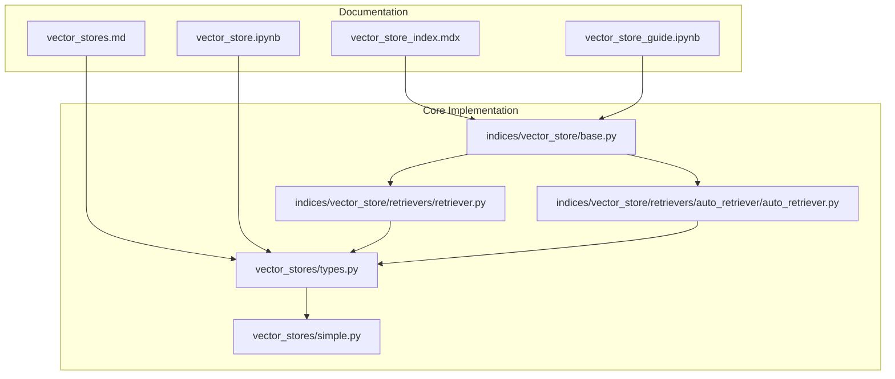
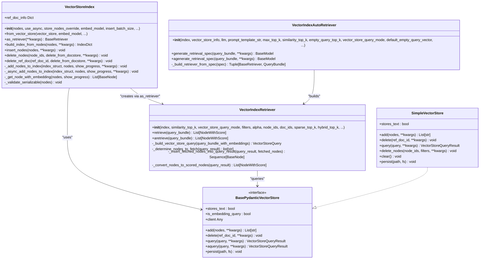
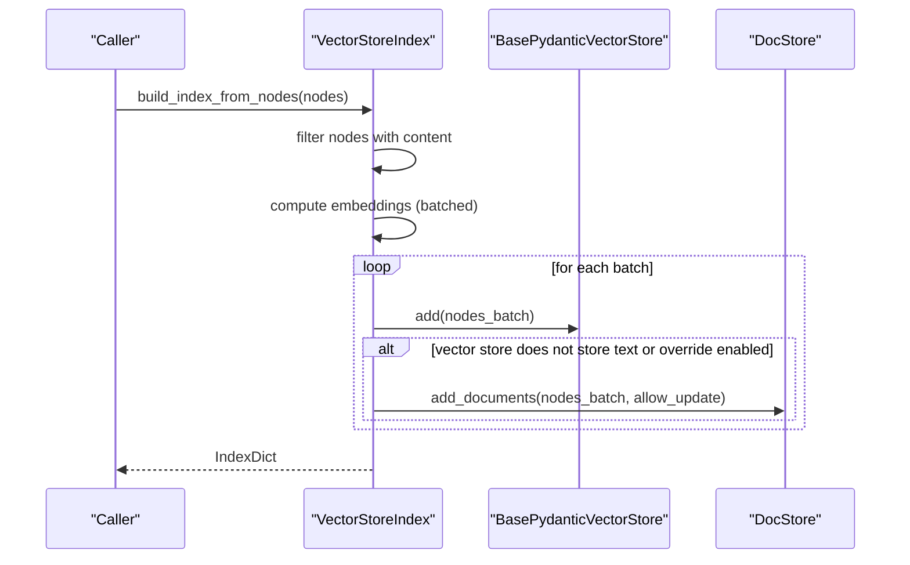
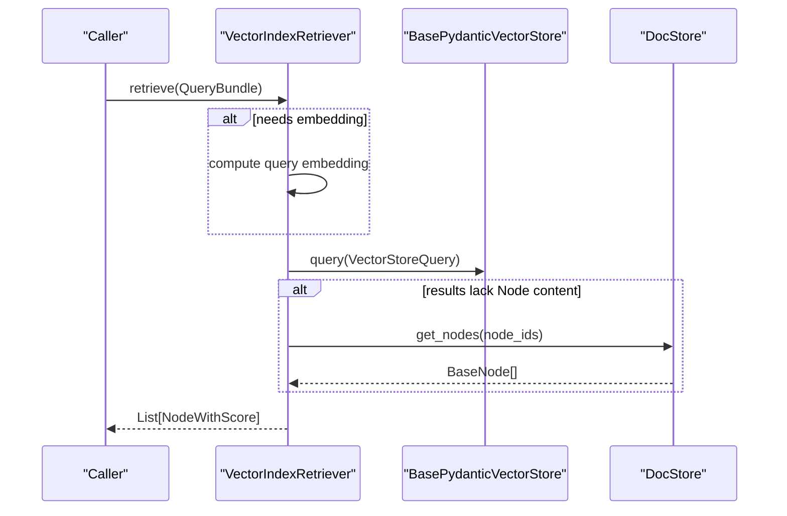
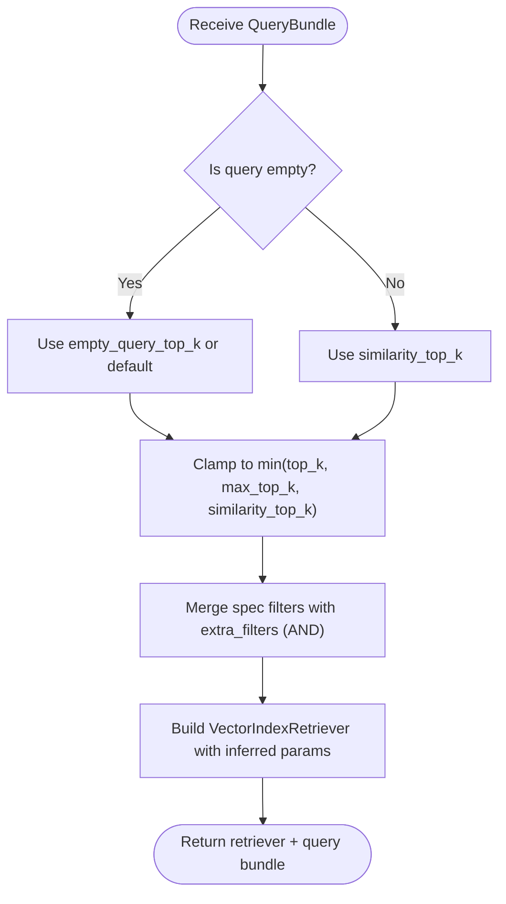
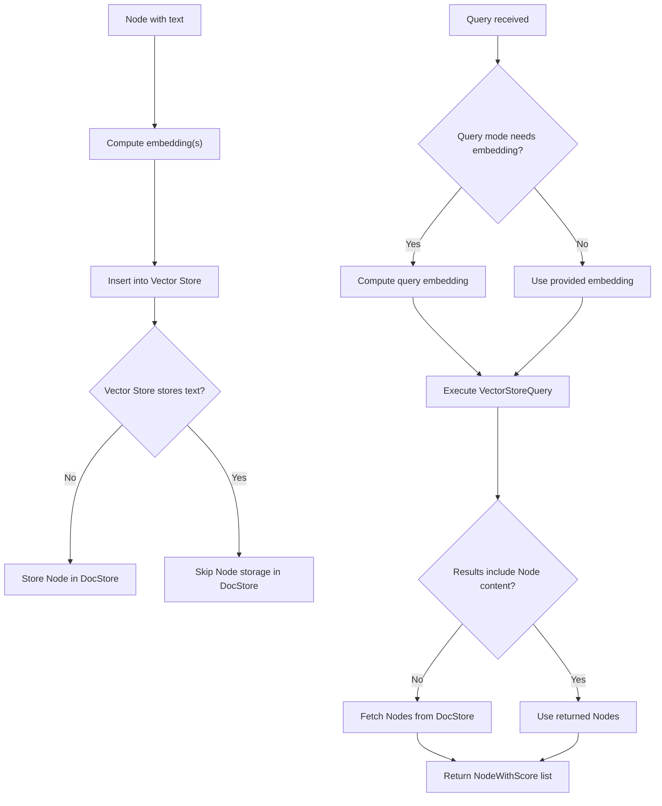
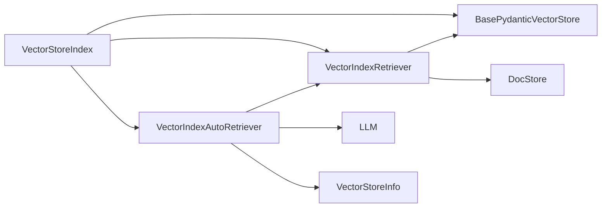

# Vector Store Index

<cite>
**Referenced Files in This Document**
- [vector_store_index.mdx](file://docs/src/content/docs/framework/module_guides/indexing/vector_store_index.mdx)
- [vector_store_guide.ipynb](file://docs/src/content/docs/framework/module_guides/indexing/vector_store_guide.ipynb)
- [vector_stores.md](file://docs/src/content/docs/framework/module_guides/storing/vector_stores.md)
- [vector_store.ipynb](file://docs/examples/low_level/vector_store.ipynb)
- [base.py](file://llama-index-core/llama_index/core/indices/vector_store/base.py)
- [retriever.py](file://llama-index-core/llama_index/core/indices/vector_store/retrievers/retriever.py)
- [auto_retriever.py](file://llama-index-core/llama_index/core/indices/vector_store/retrievers/auto_retriever/auto_retriever.py)
- [types.py](file://llama-index-core/llama_index/core/vector_stores/types.py)
- [simple.py](file://llama-index-core/llama_index/core/vector_stores/simple.py)
</cite>

## Table of Contents
1. [Introduction](#introduction)
2. [Project Structure](#project-structure)
3. [Core Components](#core-components)
4. [Architecture Overview](#architecture-overview)
5. [Detailed Component Analysis](#detailed-component-analysis)
6. [Dependency Analysis](#dependency-analysis)
7. [Performance Considerations](#performance-considerations)
8. [Troubleshooting Guide](#troubleshooting-guide)
9. [Conclusion](#conclusion)
10. [Appendices](#appendices)

## Introduction
Vector Store Index is a foundational component for retrieval-augmented generation (RAG) systems. It builds an index over document chunks (Nodes) and integrates with pluggable Vector Stores to support efficient similarity search, metadata filtering, and hybrid retrieval strategies. This document explains the VectorStoreIndex class, its constructor parameters and initialization methods, its relationship with Vector Store backends, and how embeddings are stored and retrieved. It also covers the VectorIndexRetriever and VectorIndexAutoRetriever classes, their methods and use cases, and provides guidance on performance, indexing strategies, and optimization techniques.

## Project Structure
This documentation focuses on the core implementation and examples within the repository’s documentation and core modules:
- Module Guides: usage patterns, examples, and configuration options for VectorStoreIndex and Vector Stores
- Core Implementation: VectorStoreIndex, retrievers, and vector store abstractions
- Examples: low-level tutorials and notebooks demonstrating indexing and querying

**Diagram sources**
- [vector_store_index.mdx](file://docs/src/content/docs/framework/module_guides/indexing/vector_store_index.mdx#L1-L161)
- [vector_store_guide.ipynb](file://docs/src/content/docs/framework/module_guides/indexing/vector_store_guide.ipynb#L1-L916)
- [vector_stores.md](file://docs/src/content/docs/framework/module_guides/storing/vector_stores.md#L1-L135)
- [vector_store.ipynb](file://docs/examples/low_level/vector_store.ipynb#L1-L916)
- [base.py](file://llama-index-core/llama_index/core/indices/vector_store/base.py#L1-L490)
- [retriever.py](file://llama-index-core/llama_index/core/indices/vector_store/retrievers/retriever.py#L1-L268)
- [auto_retriever.py](file://llama-index-core/llama_index/core/indices/vector_store/retrievers/auto_retriever/auto_retriever.py#L1-L245)
- [types.py](file://llama-index-core/llama_index/core/vector_stores/types.py#L1-L439)
- [simple.py](file://llama-index-core/llama_index/core/vector_stores/simple.py#L1-L355)

**Section sources**
- [vector_store_index.mdx](file://docs/src/content/docs/framework/module_guides/indexing/vector_store_index.mdx#L1-L161)
- [vector_stores.md](file://docs/src/content/docs/framework/module_guides/storing/vector_stores.md#L1-L135)

## Core Components
This section outlines the primary classes and their roles in vector-based retrieval.

- VectorStoreIndex: Builds and manages an index over Nodes, integrates with a Vector Store backend, and handles insertion, deletion, and retrieval operations.
- VectorIndexRetriever: Performs retrieval against a Vector Store backend given a query, supporting multiple query modes and metadata filters.
- VectorIndexAutoRetriever: Automatically infers retrieval parameters (query, filters, top_k) using an LLM and a structured schema.
- Vector Store Abstractions: Define the contract for storing and querying embeddings, including query modes, filters, and result formats.
- SimpleVectorStore: An in-memory vector store used for experimentation and persistence.

Key responsibilities:
- Embedding lifecycle: VectorStoreIndex computes and attaches embeddings to Nodes during indexing and retrieval.
- Backend integration: VectorStoreIndex delegates storage and querying to the configured BasePydanticVectorStore implementation.
- Retrieval orchestration: VectorIndexRetriever translates queries into VectorStoreQuery, executes them, and enriches results with Node content from the docstore when needed.

**Section sources**
- [base.py](file://llama-index-core/llama_index/core/indices/vector_store/base.py#L36-L490)
- [retriever.py](file://llama-index-core/llama_index/core/indices/vector_store/retrievers/retriever.py#L24-L268)
- [auto_retriever.py](file://llama-index-core/llama_index/core/indices/vector_store/retrievers/auto_retriever/auto_retriever.py#L37-L245)
- [types.py](file://llama-index-core/llama_index/core/vector_stores/types.py#L268-L439)
- [simple.py](file://llama-index-core/llama_index/core/vector_stores/simple.py#L64-L355)

## Architecture Overview
The Vector Store Index architecture connects the index layer with a pluggable vector store backend and a document store. Retrieval flows through a retriever that translates queries into backend-specific requests.

**Diagram sources**
- [base.py](file://llama-index-core/llama_index/core/indices/vector_store/base.py#L36-L490)
- [retriever.py](file://llama-index-core/llama_index/core/indices/vector_store/retrievers/retriever.py#L24-L268)
- [auto_retriever.py](file://llama-index-core/llama_index/core/indices/vector_store/retrievers/auto_retriever/auto_retriever.py#L37-L245)
- [types.py](file://llama-index-core/llama_index/core/vector_stores/types.py#L268-L439)
- [simple.py](file://llama-index-core/llama_index/core/vector_stores/simple.py#L64-L355)

## Detailed Component Analysis

### VectorStoreIndex
VectorStoreIndex is the central class for building and managing a vector-backed index. It supports:
- Construction from raw Nodes, from Documents (via ingestion), or from an existing Vector Store
- Asynchronous and synchronous embedding computation and insertion
- Batched insertion to optimize throughput
- Deletion and refresh operations for document lifecycle management
- Retrieval via VectorIndexRetriever

Constructor parameters and initialization:
- nodes: optional sequence of BaseNode to index
- use_async: enables asynchronous operations
- store_nodes_override: forces storing Node objects in the docstore even if the vector store keeps text
- embed_model: embedding model used for computing embeddings
- insert_batch_size: controls batching for insertions
- objects: optional list of IndexNode objects
- index_struct: optional prebuilt IndexDict
- storage_context: defines the vector store and persistence
- callback_manager: callback manager for tracing and metrics
- transformations: optional transformations applied to nodes
- show_progress: toggles progress reporting

Initialization methods:
- from_vector_store(vector_store, embed_model, **kwargs): initializes from an existing vector store backend
- as_retriever(**kwargs): creates a VectorIndexRetriever bound to this index

Indexing and retrieval internals:
- build_index_from_nodes(nodes, **kwargs): filters nodes with content, computes embeddings, and inserts into the vector store
- insert_nodes(nodes, **kwargs): adds new nodes to an existing index
- delete_nodes(node_ids, delete_from_docstore, **kwargs): removes nodes from the vector store and optionally the docstore
- delete_ref_doc(ref_doc_id, delete_from_docstore, **kwargs): deletes all nodes for a given document
- ref_doc_info: retrieves per-document node metadata (supported when the vector store does not store text or override is enabled)

**Diagram sources**
- [base.py](file://llama-index-core/llama_index/core/indices/vector_store/base.py#L260-L310)
- [base.py](file://llama-index-core/llama_index/core/indices/vector_store/base.py#L311-L409)

**Section sources**
- [base.py](file://llama-index-core/llama_index/core/indices/vector_store/base.py#L36-L490)

### VectorIndexRetriever
VectorIndexRetriever performs retrieval against a Vector Store backend. It:
- Determines whether embeddings are needed based on query mode and backend capability
- Builds a VectorStoreQuery from the incoming QueryBundle
- Executes the query against the vector store
- Fetches missing Node content from the docstore when needed
- Converts results into NodeWithScore objects with similarity scores

Key parameters:
- index: VectorStoreIndex instance
- similarity_top_k: number of top results to return
- vector_store_query_mode: query mode (e.g., DEFAULT, SPARSE, HYBRID, TEXT_SEARCH, MMR)
- filters: metadata filters applied to retrieval
- alpha: hybrid search weight
- node_ids: restrict search to specific node IDs
- doc_ids: restrict search to specific document IDs
- sparse_top_k/hybrid_top_k: specialized parameters for hybrid modes
- embed_model: embedding model used for query embeddings
- verbose: toggles verbose logging

**Diagram sources**
- [retriever.py](file://llama-index-core/llama_index/core/indices/vector_store/retrievers/retriever.py#L104-L128)
- [retriever.py](file://llama-index-core/llama_index/core/indices/vector_store/retrievers/retriever.py#L227-L267)

**Section sources**
- [retriever.py](file://llama-index-core/llama_index/core/indices/vector_store/retrievers/retriever.py#L24-L268)

### VectorIndexAutoRetriever
VectorIndexAutoRetriever automates retrieval configuration using an LLM and a structured schema:
- Generates a retrieval specification (query, filters, top_k) from a natural language query
- Validates and clamps top_k against configured bounds
- Constructs a VectorIndexRetriever with the inferred parameters
- Supports extra metadata filters and empty-query fallback vectors

Key parameters:
- index: VectorStoreIndex instance
- vector_store_info: metadata about supported filters and content
- llm: LLM used to infer retrieval parameters
- prompt_template_str: custom prompt template
- max_top_k: maximum allowed top_k
- similarity_top_k: default top_k for non-empty queries
- empty_query_top_k: top_k for empty queries (metadata-only)
- vector_store_query_mode: default query mode
- default_empty_query_vector: fallback vector for empty queries
- extra_filters: additional metadata filters (AND condition)
- object_map, objects: for composable retrieval

**Diagram sources**
- [auto_retriever.py](file://llama-index-core/llama_index/core/indices/vector_store/retrievers/auto_retriever/auto_retriever.py#L158-L244)

**Section sources**
- [auto_retriever.py](file://llama-index-core/llama_index/core/indices/vector_store/retrievers/auto_retriever/auto_retriever.py#L37-L245)

### Vector Store Backends and Embedding Lifecycle
Vector stores define the contract for storing and querying embeddings:
- VectorStoreQuery: encapsulates query parameters (embedding, top_k, filters, mode, etc.)
- VectorStoreQueryResult: encapsulates results (nodes, similarities, ids)
- BasePydanticVectorStore: interface for add, delete, query, and persistence
- SimpleVectorStore: in-memory implementation for experimentation and persistence

Embedding lifecycle:
- During indexing, VectorStoreIndex computes embeddings for nodes and inserts them into the vector store
- During retrieval, VectorIndexRetriever may compute query embeddings and executes the backend query
- If the vector store does not store text, the retriever fetches Node content from the docstore

**Diagram sources**
- [base.py](file://llama-index-core/llama_index/core/indices/vector_store/base.py#L126-L174)
- [retriever.py](file://llama-index-core/llama_index/core/indices/vector_store/retrievers/retriever.py#L130-L246)
- [types.py](file://llama-index-core/llama_index/core/vector_stores/types.py#L240-L326)
- [simple.py](file://llama-index-core/llama_index/core/vector_stores/simple.py#L174-L315)

**Section sources**
- [types.py](file://llama-index-core/llama_index/core/vector_stores/types.py#L268-L439)
- [simple.py](file://llama-index-core/llama_index/core/vector_stores/simple.py#L64-L355)

## Dependency Analysis
VectorStoreIndex depends on:
- Vector Store backend via BasePydanticVectorStore
- Embedding model resolution and computation
- DocStore for Node persistence when the vector store does not store text
- Retrievers for query execution

VectorIndexRetriever depends on:
- VectorStoreIndex for access to vector store and docstore
- Vector Store backend for query execution
- Embedding model for query embeddings when needed

VectorIndexAutoRetriever depends on:
- LLM for generating retrieval specs
- VectorStoreInfo for schema and metadata guidance

**Diagram sources**
- [base.py](file://llama-index-core/llama_index/core/indices/vector_store/base.py#L112-L124)
- [retriever.py](file://llama-index-core/llama_index/core/indices/vector_store/retrievers/retriever.py#L60-L80)
- [auto_retriever.py](file://llama-index-core/llama_index/core/indices/vector_store/retrievers/auto_retriever/auto_retriever.py#L88-L116)

**Section sources**
- [base.py](file://llama-index-core/llama_index/core/indices/vector_store/base.py#L108-L124)
- [retriever.py](file://llama-index-core/llama_index/core/indices/vector_store/retrievers/retriever.py#L24-L81)
- [auto_retriever.py](file://llama-index-core/llama_index/core/indices/vector_store/retrievers/auto_retriever/auto_retriever.py#L70-L116)

## Performance Considerations
- Batched insertion: VectorStoreIndex uses insert_batch_size to reduce overhead when inserting into remote vector databases. Adjust this parameter based on memory and network constraints.
- Embedding computation: Embeddings are computed in batches during indexing and retrieval. Asynchronous embedding computation is supported via use_async and async variants.
- Query modes: Choose appropriate VectorStoreQueryMode (DEFAULT, SPARSE, HYBRID, MMR) to balance accuracy and latency.
- Metadata filtering: Apply filters to reduce candidate sets and improve retrieval speed.
- Vector store selection: Select a vector store backend that supports the required features (metadata filtering, hybrid search, async) and scales to your workload.

[No sources needed since this section provides general guidance]

## Troubleshooting Guide
Common issues and resolutions:
- Vector store does not store text: When using a vector store that does not store text, VectorStoreIndex stores Nodes in the docstore and fetches them during retrieval. Ensure delete_from_docstore is set appropriately when deleting nodes.
- Missing content in results: If the vector store does not store text, the retriever fetches Node content from the docstore. Verify that nodes are present and accessible.
- Unsupported ref_doc_info: ref_doc_info is not supported when the vector store stores text and no override is enabled.
- Metadata filters: Some vector stores only support exact-match filters. Use MetadataFilters with FilterOperator.EQ for compatibility.

**Section sources**
- [base.py](file://llama-index-core/llama_index/core/indices/vector_store/base.py#L463-L486)
- [retriever.py](file://llama-index-core/llama_index/core/indices/vector_store/retrievers/retriever.py#L146-L210)

## Conclusion
Vector Store Index provides a flexible and extensible foundation for vector-based retrieval. By integrating with pluggable vector store backends and leveraging specialized retrievers—manual and automatic—you can tailor RAG systems to diverse data and performance requirements. Proper configuration of embedding computation, batch sizes, query modes, and metadata filters ensures efficient and accurate retrieval.

[No sources needed since this section summarizes without analyzing specific files]

## Appendices

### Examples and Usage Patterns
- Basic usage with documents and nodes: see module guides for constructing VectorStoreIndex from Documents or Nodes.
- Persistent vector stores: configure a StorageContext with a specific vector store backend and persist/restore as needed.
- Low-level vector store tutorial: demonstrates building a simple in-memory vector store with semantic search and metadata filtering.

**Section sources**
- [vector_store_index.mdx](file://docs/src/content/docs/framework/module_guides/indexing/vector_store_index.mdx#L11-L161)
- [vector_store_guide.ipynb](file://docs/src/content/docs/framework/module_guides/indexing/vector_store_guide.ipynb#L1-L916)
- [vector_stores.md](file://docs/src/content/docs/framework/module_guides/storing/vector_stores.md#L1-L135)
- [vector_store.ipynb](file://docs/examples/low_level/vector_store.ipynb#L1-L916)