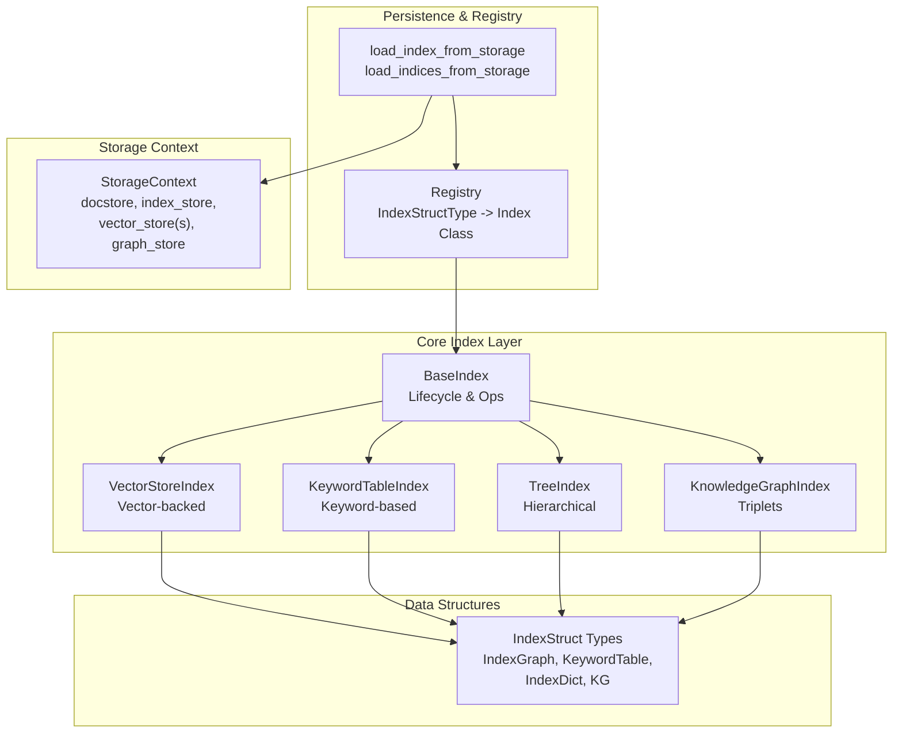
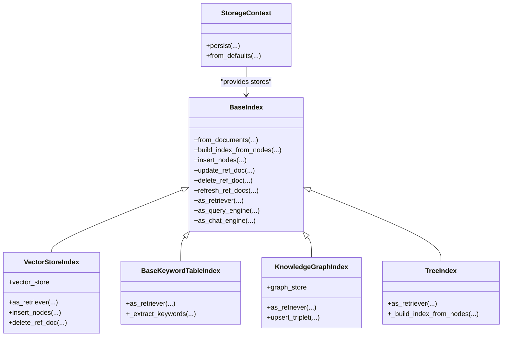
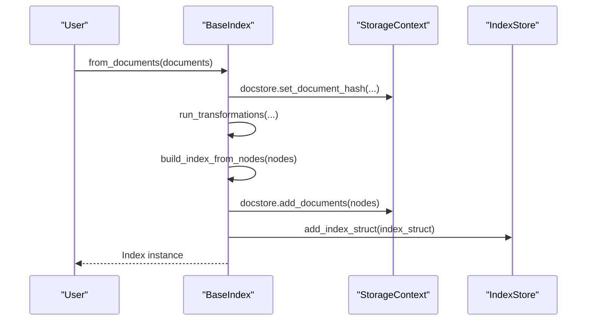
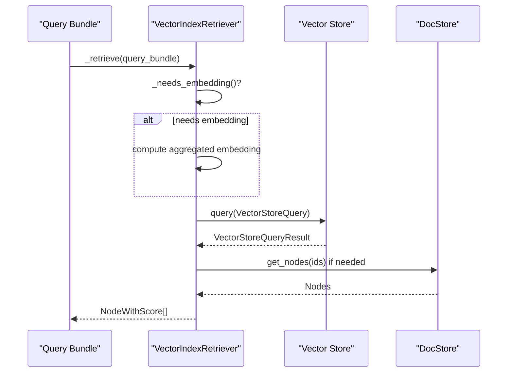
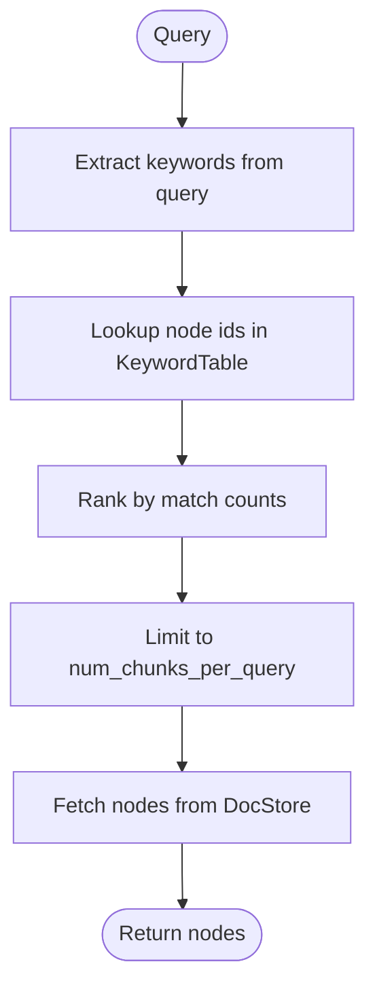
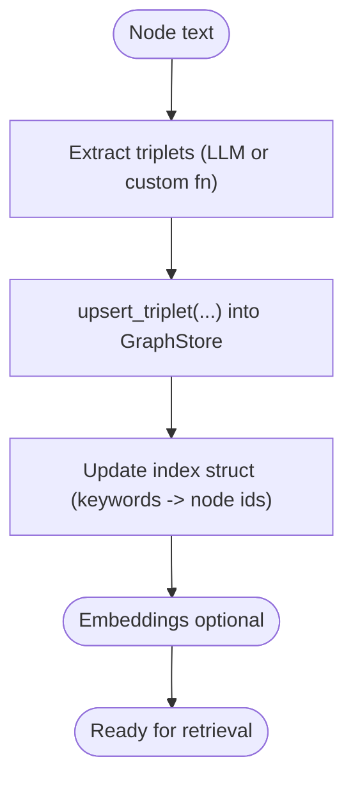
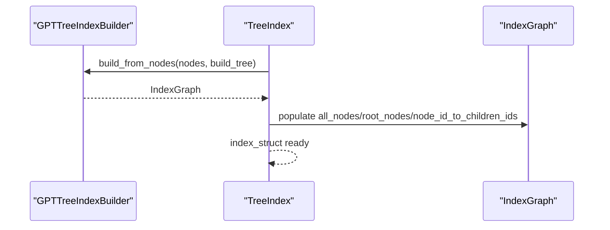
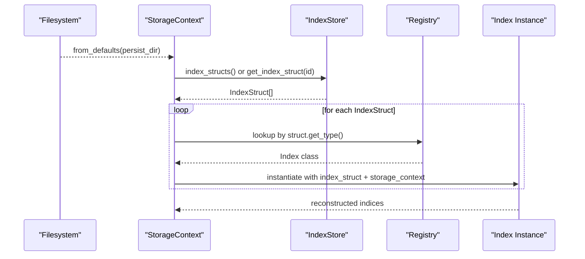
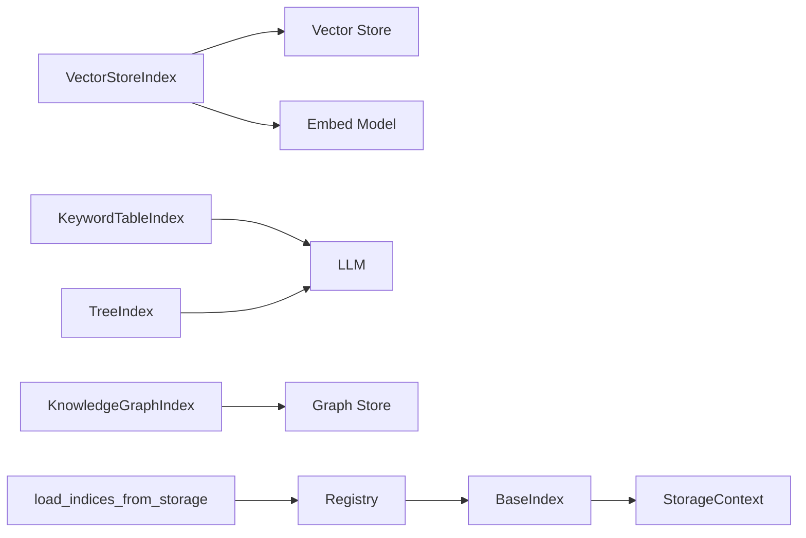

# Indexing API

<cite>
**Referenced Files in This Document**
- [__init__.py](file://llama-index-core/llama_index/core/__init__.py)
- [base.py](file://llama-index-core/llama_index/core/indices/base.py)
- [loading.py](file://llama-index-core/llama_index/core/indices/loading.py)
- [registry.py](file://llama-index-core/llama_index/core/indices/registry.py)
- [data_structs.py](file://llama-index-core/llama_index/core/data_structs/data_structs.py)
- [storage_context.py](file://llama-index-core/llama_index/core/storage/storage_context.py)
- [vector_store/base.py](file://llama-index-core/llama_index/core/indices/vector_store/base.py)
- [vector_store/retrievers/retriever.py](file://llama-index-core/llama_index/core/indices/vector_store/retrievers/retriever.py)
- [keyword_table/base.py](file://llama-index-core/llama_index/core/indices/keyword_table/base.py)
- [keyword_table/retrievers.py](file://llama-index-core/llama_index/core/indices/keyword_table/retrievers.py)
- [knowledge_graph/base.py](file://llama-index-core/llama_index/core/indices/knowledge_graph/base.py)
- [tree/base.py](file://llama-index-core/llama_index/core/indices/tree/base.py)
</cite>

## Table of Contents
1. [Introduction](#introduction)
2. [Project Structure](#project-structure)
3. [Core Components](#core-components)
4. [Architecture Overview](#architecture-overview)
5. [Detailed Component Analysis](#detailed-component-analysis)
6. [Dependency Analysis](#dependency-analysis)
7. [Performance Considerations](#performance-considerations)
8. [Troubleshooting Guide](#troubleshooting-guide)
9. [Conclusion](#conclusion)
10. [Appendices](#appendices)

## Introduction
This document provides comprehensive API documentation for the Indexing system in LlamaIndex. It covers the base Index classes, core data structures, and index creation APIs across major index types: vector, keyword, knowledge graph, and tree. It also documents index loading, saving, and persistence mechanisms, the relationship between indices and underlying storage backends, and guidance for creating custom index types, configuring parameters, and optimizing performance. Finally, it outlines querying, updating, and maintenance operations.

## Project Structure
The Indexing system is organized around:
- A generic BaseIndex that defines common lifecycle and operations for all indices
- Specialized index implementations (vector-store-backed, keyword-table, knowledge graph, tree)
- Data structures that represent index internals
- Loading and persistence utilities
- A registry mapping index struct types to index classes
- A storage context that wires together document, index, vector, and graph stores

**Diagram sources**
- [base.py](file://llama-index-core/llama_index/core/indices/base.py#L25-L596)
- [vector_store/base.py](file://llama-index-core/llama_index/core/indices/vector_store/base.py#L36-L490)
- [keyword_table/base.py](file://llama-index-core/llama_index/core/indices/keyword_table/base.py#L43-L256)
- [knowledge_graph/base.py](file://llama-index-core/llama_index/core/indices/knowledge_graph/base.py#L42-L389)
- [tree/base.py](file://llama-index-core/llama_index/core/indices/tree/base.py#L39-L191)
- [data_structs.py](file://llama-index-core/llama_index/core/data_structs/data_structs.py#L21-L280)
- [loading.py](file://llama-index-core/llama_index/core/indices/loading.py#L12-L107)
- [registry.py](file://llama-index-core/llama_index/core/indices/registry.py#L19-L31)
- [storage_context.py](file://llama-index-core/llama_index/core/storage/storage_context.py#L52-L278)

**Section sources**
- [__init__.py](file://llama-index-core/llama_index/core/__init__.py#L24-L48)
- [base.py](file://llama-index-core/llama_index/core/indices/base.py#L25-L596)
- [data_structs.py](file://llama-index-core/llama_index/core/data_structs/data_structs.py#L21-L280)
- [loading.py](file://llama-index-core/llama_index/core/indices/loading.py#L12-L107)
- [registry.py](file://llama-index-core/llama_index/core/indices/registry.py#L19-L31)
- [storage_context.py](file://llama-index-core/llama_index/core/storage/storage_context.py#L52-L278)

## Core Components
- BaseIndex: Defines the common index lifecycle, including construction from nodes/documents, insertion/update/delete, and conversion to retriever/query engine/chat engine. It manages storage via a StorageContext and interacts with docstore, index store, and vector/graph stores.
- Index data structures: IndexGraph (tree), KeywordTable (keyword-to-node mapping), IndexDict (vector-store-backed mapping), KG (keyword-to-node plus triplets and embeddings).
- StorageContext: Aggregates and persists the docstore, index store, vector stores (including named namespaces), and graph stores.
- Loading utilities: Functions to load single or multiple indices and reconstruct a composable graph from persisted stores.

Key capabilities:
- Creation: from_nodes, from_documents, and specialized constructors
- Persistence: StorageContext.persist and index store updates
- Retrieval: as_retriever and as_query_engine
- Maintenance: insert/update/delete/refresh, with async variants

**Section sources**
- [base.py](file://llama-index-core/llama_index/core/indices/base.py#L25-L596)
- [data_structs.py](file://llama-index-core/llama_index/core/data_structs/data_structs.py#L40-L280)
- [storage_context.py](file://llama-index-core/llama_index/core/storage/storage_context.py#L52-L278)
- [loading.py](file://llama-index-core/llama_index/core/indices/loading.py#L12-L107)

## Architecture Overview
The indexing architecture separates concerns across index types, data structures, and storage backends. Indices encapsulate domain-specific logic (e.g., embedding computation for vectors, keyword extraction for keywords, triplet extraction for knowledge graphs, hierarchical summarization for trees). The StorageContext centralizes persistence and retrieval of index internals and associated stores.

**Diagram sources**
- [base.py](file://llama-index-core/llama_index/core/indices/base.py#L25-L596)
- [vector_store/base.py](file://llama-index-core/llama_index/core/indices/vector_store/base.py#L36-L490)
- [keyword_table/base.py](file://llama-index-core/llama_index/core/indices/keyword_table/base.py#L43-L256)
- [knowledge_graph/base.py](file://llama-index-core/llama_index/core/indices/knowledge_graph/base.py#L42-L389)
- [tree/base.py](file://llama-index-core/llama_index/core/indices/tree/base.py#L39-L191)
- [storage_context.py](file://llama-index-core/llama_index/core/storage/storage_context.py#L52-L278)

## Detailed Component Analysis

### Base Index Lifecycle and Operations
- Construction: from_documents applies transformations and builds the index; from_nodes bypasses transformations; index_struct can be provided to reuse an existing structure.
- Insertion: insert and insert_nodes add nodes, with special handling for IndexNode objects; async variants exist.
- Updates and deletes: update_ref_doc deletes and re-inserts; delete_ref_doc removes nodes by reference; refresh_ref_docs conditionally inserts or updates based on hash comparisons.
- Retrieval engines: as_retriever converts to a retriever; as_query_engine wraps a retriever with an LLM; as_chat_engine selects a chat mode.

**Diagram sources**
- [base.py](file://llama-index-core/llama_index/core/indices/base.py#L88-L130)

**Section sources**
- [base.py](file://llama-index-core/llama_index/core/indices/base.py#L25-L596)

### Vector Index (VectorStoreIndex)
- Purpose: Builds and queries vector-backed indices using a vector store backend.
- Key parameters: embed_model, use_async, store_nodes_override, insert_batch_size.
- Retrieval: VectorIndexRetriever supports multiple query modes, filtering, and hybrid retrieval; handles fetching missing nodes from docstore when the vector store does not store text.
- Persistence: Delegates to vector store and docstore; index struct maintained in index store.

**Diagram sources**
- [vector_store/retrievers/retriever.py](file://llama-index-core/llama_index/core/indices/vector_store/retrievers/retriever.py#L104-L268)
- [vector_store/base.py](file://llama-index-core/llama_index/core/indices/vector_store/base.py#L108-L490)

**Section sources**
- [vector_store/base.py](file://llama-index-core/llama_index/core/indices/vector_store/base.py#L36-L490)
- [vector_store/retrievers/retriever.py](file://llama-index-core/llama_index/core/indices/vector_store/retrievers/retriever.py#L24-L268)
- [data_structs.py](file://llama-index-core/llama_index/core/data_structs/data_structs.py#L179-L215)

### Keyword Table Index (KeywordTableIndex)
- Purpose: Extracts keywords from nodes and queries to retrieve relevant chunks.
- Retrievers: GPT-based, simple regex-based, and RAKE-based extractors; selection via as_retriever with retriever_mode.
- Parameters: keyword_extract_template, max_keywords_per_chunk, use_async.

**Diagram sources**
- [keyword_table/retrievers.py](file://llama-index-core/llama_index/core/indices/keyword_table/retrievers.py#L86-L117)
- [keyword_table/base.py](file://llama-index-core/llama_index/core/indices/keyword_table/base.py#L100-L128)

**Section sources**
- [keyword_table/base.py](file://llama-index-core/llama_index/core/indices/keyword_table/base.py#L43-L256)
- [keyword_table/retrievers.py](file://llama-index-core/llama_index/core/indices/keyword_table/retrievers.py#L31-L201)

### Knowledge Graph Index (KnowledgeGraphIndex)
- Purpose: Extracts triplets and leverages a graph store for retrieval; supports hybrid retrieval modes depending on embeddings.
- Parameters: kg_triplet_extract_template, max_triplets_per_chunk, include_embeddings, max_object_length, kg_triplet_extract_fn.
- Operations: upsert_triplet, upsert_triplet_and_node, add_node; retrieval via retrievers.

**Diagram sources**
- [knowledge_graph/base.py](file://llama-index-core/llama_index/core/indices/knowledge_graph/base.py#L152-L276)

**Section sources**
- [knowledge_graph/base.py](file://llama-index-core/llama_index/core/indices/knowledge_graph/base.py#L42-L389)
- [data_structs.py](file://llama-index-core/llama_index/core/data_structs/data_structs.py#L228-L270)

### Tree Index (TreeIndex)
- Purpose: Builds a hierarchical, summary-driven tree; supports multiple retriever modes (select leaf, select leaf with embedding, root, all leaves).
- Parameters: summary_template, insert_prompt, num_children, build_tree, use_async.
- Retrievers: Mode-specific retrievers selected via as_retriever.

**Diagram sources**
- [tree/base.py](file://llama-index-core/llama_index/core/indices/tree/base.py#L138-L150)

**Section sources**
- [tree/base.py](file://llama-index-core/llama_index/core/indices/tree/base.py#L39-L191)
- [data_structs.py](file://llama-index-core/llama_index/core/data_structs/data_structs.py#L40-L113)

### Index Data Structures
- IndexGraph: Hierarchical mapping for tree indices
- KeywordTable: Keyword-to-node-id sets
- IndexDict: Vector store id to node id mapping
- KG: Keyword-to-node-id mapping plus triplets and optional embeddings

These structures are serialized/deserialized via the index store and used by indices to drive retrieval.

**Section sources**
- [data_structs.py](file://llama-index-core/llama_index/core/data_structs/data_structs.py#L40-L280)

### Loading, Saving, and Persistence
- Loading: load_index_from_storage and load_indices_from_storage reconstruct indices from persisted index structs using the registry mapping.
- Persistence: StorageContext.from_defaults constructs stores (or loads from persist_dir); StorageContext.persist writes docstore, index store, graph store, property graph store, and each named vector store.
- Registry: INDEX_STRUCT_TYPE_TO_INDEX_CLASS maps struct types to index classes.

**Diagram sources**
- [loading.py](file://llama-index-core/llama_index/core/indices/loading.py#L50-L86)
- [registry.py](file://llama-index-core/llama_index/core/indices/registry.py#L19-L31)
- [storage_context.py](file://llama-index-core/llama_index/core/storage/storage_context.py#L73-L149)

**Section sources**
- [loading.py](file://llama-index-core/llama_index/core/indices/loading.py#L12-L107)
- [registry.py](file://llama-index-core/llama_index/core/indices/registry.py#L19-L31)
- [storage_context.py](file://llama-index-core/llama_index/core/storage/storage_context.py#L52-L278)

## Dependency Analysis
- BaseIndex depends on StorageContext for docstore, index store, vector store, and graph store access.
- VectorStoreIndex depends on a vector store backend and embedder; retrieval depends on VectorIndexRetriever.
- KeywordTableIndex depends on an LLM for keyword extraction (or simple/Rake extractors).
- KnowledgeGraphIndex depends on a graph store and optional embeddings.
- TreeIndex depends on a builder/inserter pipeline and an LLM for summaries.
- Loading relies on the registry to map struct types to index classes.

**Diagram sources**
- [base.py](file://llama-index-core/llama_index/core/indices/base.py#L64-L84)
- [vector_store/base.py](file://llama-index-core/llama_index/core/indices/vector_store/base.py#L68-L84)
- [keyword_table/base.py](file://llama-index-core/llama_index/core/indices/keyword_table/base.py#L80-L98)
- [knowledge_graph/base.py](file://llama-index-core/llama_index/core/indices/knowledge_graph/base.py#L98-L108)
- [tree/base.py](file://llama-index-core/llama_index/core/indices/tree/base.py#L84-L92)
- [loading.py](file://llama-index-core/llama_index/core/indices/loading.py#L78-L85)
- [registry.py](file://llama-index-core/llama_index/core/indices/registry.py#L19-L31)

**Section sources**
- [base.py](file://llama-index-core/llama_index/core/indices/base.py#L25-L596)
- [vector_store/base.py](file://llama-index-core/llama_index/core/indices/vector_store/base.py#L36-L490)
- [keyword_table/base.py](file://llama-index-core/llama_index/core/indices/keyword_table/base.py#L43-L256)
- [knowledge_graph/base.py](file://llama-index-core/llama_index/core/indices/knowledge_graph/base.py#L42-L389)
- [tree/base.py](file://llama-index-core/llama_index/core/indices/tree/base.py#L39-L191)
- [loading.py](file://llama-index-core/llama_index/core/indices/loading.py#L12-L107)
- [registry.py](file://llama-index-core/llama_index/core/indices/registry.py#L19-L31)

## Performance Considerations
- Vector index batching: insert_batch_size controls batch size for embedding and insertion to balance throughput and memory.
- Async operations: use_async enables asynchronous embedding and insertion for I/O-bound workloads.
- Retrieval modes: choose appropriate VectorStoreQueryMode and filters to reduce result sets; leverage sparse/dense hybrid modes thoughtfully.
- Keyword extraction: adjust max_keywords_per_chunk and retriever mode (GPT vs simple vs RAKE) to trade accuracy and cost.
- Tree index: tune num_children and build_tree to control hierarchy depth and traversal cost.
- Storage: ensure vector stores and docstores are tuned for your workload; consider named vector stores for multi-modal scenarios.

[No sources needed since this section provides general guidance]

## Troubleshooting Guide
- Missing content nodes during vector index build: content nodes with empty content are filtered out; ensure nodes have valid content for embedding.
- Deleting nodes from vector store: deletion behavior depends on whether the vector store stores text; when it does not, docstore and index struct are updated accordingly.
- KnowledgeGraphIndex delete: deletion is not supported; use upsert and add_node operations to manage triplets.
- TreeIndex delete: deletion is not implemented; rebuild or use alternative indices if deletions are required.
- Loading mismatch: if multiple indices are present, specify index_id; if none are found, verify persist_dir and index store contents.

**Section sources**
- [vector_store/base.py](file://llama-index-core/llama_index/core/indices/vector_store/base.py#L286-L310)
- [vector_store/base.py](file://llama-index-core/llama_index/core/indices/vector_store/base.py#L385-L409)
- [knowledge_graph/base.py](file://llama-index-core/llama_index/core/indices/knowledge_graph/base.py#L319-L322)
- [tree/base.py](file://llama-index-core/llama_index/core/indices/tree/base.py#L165-L168)
- [loading.py](file://llama-index-core/llama_index/core/indices/loading.py#L37-L47)

## Conclusion
The LlamaIndex Indexing system offers a flexible, extensible framework for building and operating indices across multiple paradigms. BaseIndex unifies lifecycle operations, while specialized indices encapsulate domain logic. Data structures and the StorageContext enable robust persistence and retrieval. The registry and loading utilities simplify reconstruction from disk. By tuning parameters and choosing appropriate retrieval modes, users can optimize performance for diverse workloads.

[No sources needed since this section summarizes without analyzing specific files]

## Appendices

### Creating Custom Index Types
- Subclass BaseIndex and implement:
  - index_struct_cls
  - _build_index_from_nodes(nodes)
  - _insert(nodes)
  - _delete_node(node_id)
  - as_retriever(**kwargs) returning a BaseRetriever
- Register the index struct type with the registry mapping to enable loading from storage.

**Section sources**
- [base.py](file://llama-index-core/llama_index/core/indices/base.py#L178-L194)
- [registry.py](file://llama-index-core/llama_index/core/indices/registry.py#L19-L31)
- [data_structs.py](file://llama-index-core/llama_index/core/data_structs/data_structs.py#L21-L38)

### Index Querying APIs
- Vector: VectorIndexRetriever supports similarity_top_k, vector_store_query_mode, filters, alpha, node_ids, doc_ids, sparse_top_k, hybrid_top_k.
- Keyword: Choose retriever_mode ("default" via LLM, "simple" via regex, "rake").
- Knowledge Graph: Select retriever mode based on embeddings availability.
- Tree: Choose retriever mode among select_leaf, select_leaf_embedding, root, all_leaf.

**Section sources**
- [vector_store/retrievers/retriever.py](file://llama-index-core/llama_index/core/indices/vector_store/retrievers/retriever.py#L42-L81)
- [keyword_table/retrievers.py](file://llama-index-core/llama_index/core/indices/keyword_table/retrievers.py#L100-L128)
- [knowledge_graph/base.py](file://llama-index-core/llama_index/core/indices/knowledge_graph/base.py#L123-L150)
- [tree/base.py](file://llama-index-core/llama_index/core/indices/tree/base.py#L94-L128)

### Index Updating and Maintenance
- Insert/update/delete: Use insert, insert_nodes, update_ref_doc, delete_ref_doc, refresh_ref_docs, and their async counterparts.
- Relationship to stores: All operations update the docstore and index store; vector store deletions are handled separately for vector-backed indices.

**Section sources**
- [base.py](file://llama-index-core/llama_index/core/indices/base.py#L195-L481)