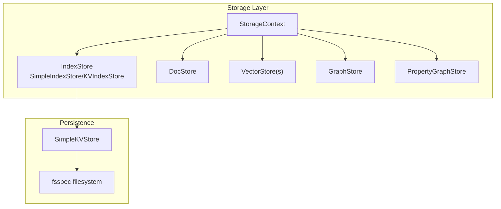
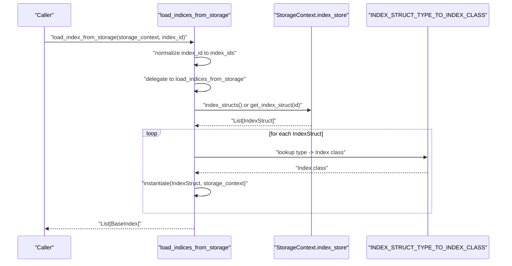
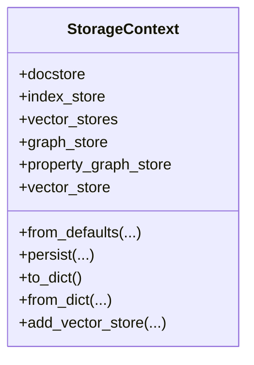
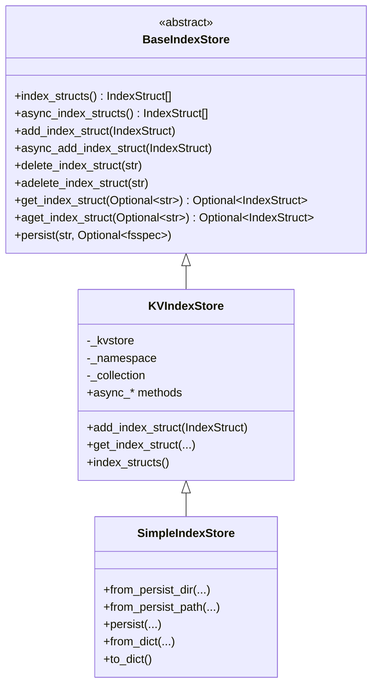
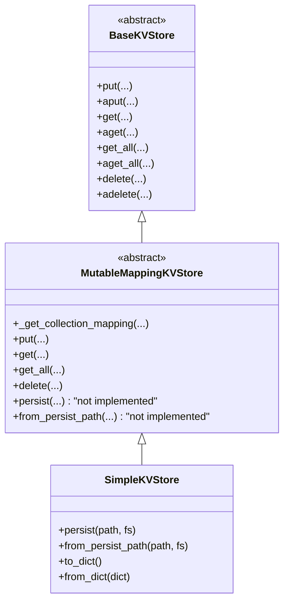
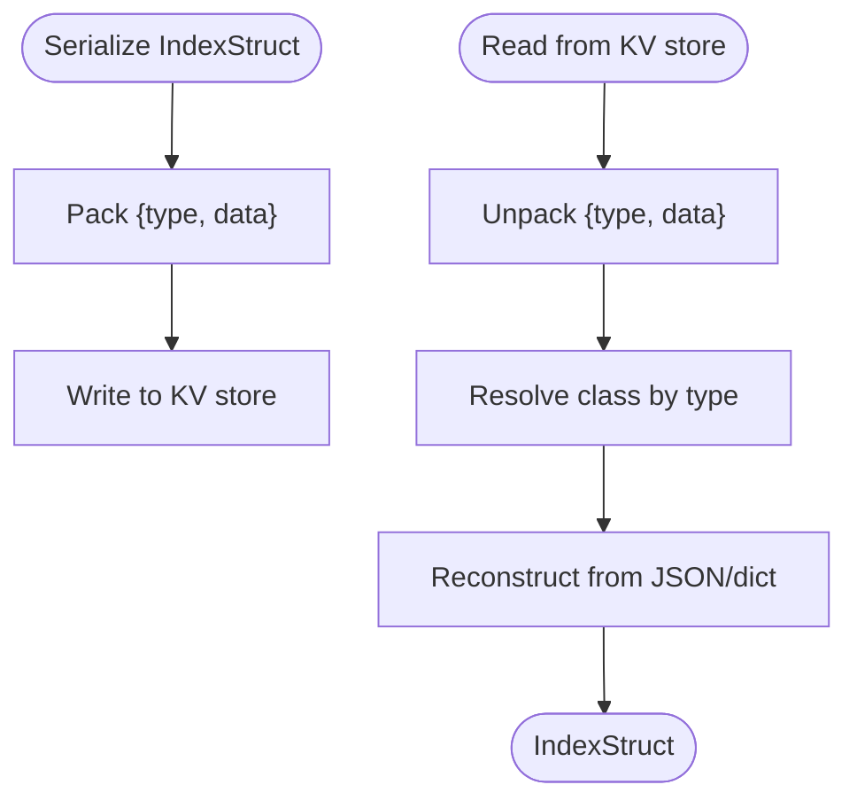
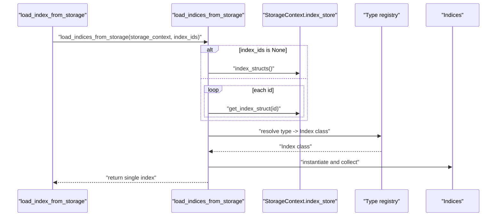
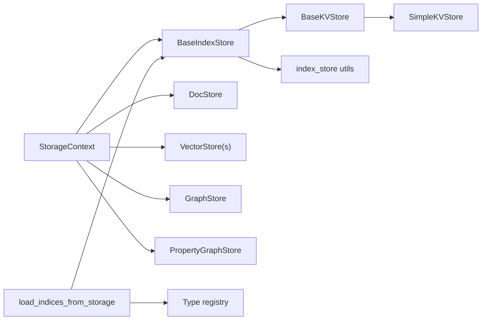

# Storage Integration

<cite>
**Referenced Files in This Document**
- [storage_context.py](file://llama-index-core/llama_index/core/storage/storage_context.py)
- [loading.py](file://llama-index-core/llama_index/core/indices/loading.py)
- [types.py](file://llama-index-core/llama_index/core/storage/index_store/types.py)
- [utils.py](file://llama-index-core/llama_index/core/storage/index_store/utils.py)
- [keyval_index_store.py](file://llama-index-core/llama_index/core/storage/index_store/keyval_index_store.py)
- [simple_index_store.py](file://llama-index-core/llama_index/core/storage/index_store/simple_index_store.py)
- [simple_kvstore.py](file://llama-index-core/llama_index/core/storage/kvstore/simple_kvstore.py)
- [types.py](file://llama-index-core/llama_index/core/storage/kvstore/types.py)
</cite>

## Table of Contents
1. [Introduction](#introduction)
2. [Project Structure](#project-structure)
3. [Core Components](#core-components)
4. [Architecture Overview](#architecture-overview)
5. [Detailed Component Analysis](#detailed-component-analysis)
6. [Dependency Analysis](#dependency-analysis)
7. [Performance Considerations](#performance-considerations)
8. [Troubleshooting Guide](#troubleshooting-guide)
9. [Conclusion](#conclusion)
10. [Appendices](#appendices)

## Introduction
This document describes the Index Storage and Loading Integration in the LlamaIndex core. It focuses on the APIs for loading and saving indices, the storage context configuration, index serialization formats, and the relationships among index stores, document stores, and vector stores. It also covers migration strategies, custom storage implementations, and backup/restore procedures.

## Project Structure
The storage integration spans several modules:
- Storage context: orchestrates persistence of documents, indices, vectors, and graphs.
- Index store: persists index metadata (IndexStruct) via a key-value abstraction.
- KV store: provides a generic key-value interface and a simple JSON-backed implementation.
- Index loading utilities: load one or multiple indices from storage.

**Diagram sources**
- [storage_context.py](file://llama-index-core/llama_index/core/storage/storage_context.py#L52-L149)
- [simple_index_store.py](file://llama-index-core/llama_index/core/storage/index_store/simple_index_store.py#L19-L77)
- [keyval_index_store.py](file://llama-index-core/llama_index/core/storage/index_store/keyval_index_store.py#L15-L143)
- [simple_kvstore.py](file://llama-index-core/llama_index/core/storage/kvstore/simple_kvstore.py#L16-L66)

**Section sources**
- [storage_context.py](file://llama-index-core/llama_index/core/storage/storage_context.py#L52-L149)
- [simple_index_store.py](file://llama-index-core/llama_index/core/storage/index_store/simple_index_store.py#L19-L77)
- [keyval_index_store.py](file://llama-index-core/llama_index/core/storage/index_store/keyval_index_store.py#L15-L143)
- [simple_kvstore.py](file://llama-index-core/llama_index/core/storage/kvstore/simple_kvstore.py#L16-L66)

## Core Components
- StorageContext: central container holding docstore, index_store, vector_stores (including an image vector store), graph_store, and property_graph_store. Provides creation from defaults or persisted directories, and a unified persist routine.
- IndexStore abstractions: BaseIndexStore defines the contract for index metadata persistence; SimpleIndexStore and KVIndexStore provide concrete implementations backed by a key-value store.
- KVStore abstractions: BaseKVStore and MutableMappingKVStore define the key-value interface; SimpleKVStore implements JSON persistence to a file path or fsspec filesystem.
- Index loading utilities: load_index_from_storage and load_indices_from_storage fetch index metadata from the index store and reconstruct index instances.

Key APIs and responsibilities:
- StorageContext.from_defaults: builds stores from defaults or from a persisted directory using from_persist_dir variants.
- StorageContext.persist: writes docstore, index_store, graph_store, optional property graph store, and each named vector store to disk or a remote filesystem.
- SimpleIndexStore.from_persist_dir/from_persist_path: restores index metadata from a JSON file.
- SimpleIndexStore.persist: persists index metadata to a JSON file when backed by an in-memory KV store.
- load_index_from_storage/load_indices_from_storage: read index metadata and instantiate indices.

**Section sources**
- [storage_context.py](file://llama-index-core/llama_index/core/storage/storage_context.py#L73-L203)
- [types.py](file://llama-index-core/llama_index/core/storage/index_store/types.py#L13-L58)
- [simple_index_store.py](file://llama-index-core/llama_index/core/storage/index_store/simple_index_store.py#L36-L77)
- [keyval_index_store.py](file://llama-index-core/llama_index/core/storage/index_store/keyval_index_store.py#L38-L89)
- [simple_kvstore.py](file://llama-index-core/llama_index/core/storage/kvstore/simple_kvstore.py#L35-L66)
- [loading.py](file://llama-index-core/llama_index/core/indices/loading.py#L12-L86)

## Architecture Overview
The index loading pipeline reads serialized index metadata from the index store and reconstructs index objects using a registry mapping index struct types to index classes.

**Diagram sources**
- [loading.py](file://llama-index-core/llama_index/core/indices/loading.py#L12-L86)
- [types.py](file://llama-index-core/llama_index/core/storage/index_store/types.py#L13-L58)
- [utils.py](file://llama-index-core/llama_index/core/storage/index_store/utils.py#L8-L23)

## Detailed Component Analysis

### StorageContext: Persistence and Configuration
- Construction:
  - from_defaults: creates default stores or loads them from a persisted directory using from_persist_dir variants. Supports optional fsspec filesystem for remote storage.
  - Vector stores are keyed by namespace; an image vector store can be appended under a dedicated namespace.
- Persistence:
  - persist writes docstore, index_store, graph_store, and optionally property graph store to separate files. Each vector store is written under its namespace.
  - Uses fsspec for filesystem-agnostic persistence.
- Serialization helpers:
  - to_dict/from_dict: supported only when using simple stores; aggregates vector stores, docstore, index store, graph store, and property graph store into a dictionary representation.

**Diagram sources**
- [storage_context.py](file://llama-index-core/llama_index/core/storage/storage_context.py#L52-L278)

**Section sources**
- [storage_context.py](file://llama-index-core/llama_index/core/storage/storage_context.py#L73-L203)

### IndexStore Abstractions and Implementations
- BaseIndexStore: defines CRUD and enumeration operations for IndexStruct, plus a default persist method.
- KVIndexStore: implements IndexStore using a BaseKVStore with a configurable namespace and collection suffix. Serializes IndexStruct to JSON and back.
- SimpleIndexStore: concrete implementation backed by SimpleKVStore; supports restoration from persisted path and selective persistence when the underlying KV store is in-memory.

**Diagram sources**
- [types.py](file://llama-index-core/llama_index/core/storage/index_store/types.py#L13-L58)
- [keyval_index_store.py](file://llama-index-core/llama_index/core/storage/index_store/keyval_index_store.py#L15-L143)
- [simple_index_store.py](file://llama-index-core/llama_index/core/storage/index_store/simple_index_store.py#L19-L77)

**Section sources**
- [types.py](file://llama-index-core/llama_index/core/storage/index_store/types.py#L13-L58)
- [keyval_index_store.py](file://llama-index-core/llama_index/core/storage/index_store/keyval_index_store.py#L15-L143)
- [simple_index_store.py](file://llama-index-core/llama_index/core/storage/index_store/simple_index_store.py#L19-L77)

### KVStore Abstractions and Simple Implementation
- BaseKVStore/MutableMappingKVStore: define the key-value interface with collections and synchronous/asynchronous operations.
- SimpleKVStore: concrete implementation that persists a nested mapping structure to a JSON file. Supports from_persist_path and to_dict/from_dict.

**Diagram sources**
- [types.py](file://llama-index-core/llama_index/core/storage/kvstore/types.py#L11-L184)
- [simple_kvstore.py](file://llama-index-core/llama_index/core/storage/kvstore/simple_kvstore.py#L16-L66)

**Section sources**
- [types.py](file://llama-index-core/llama_index/core/storage/kvstore/types.py#L11-L184)
- [simple_kvstore.py](file://llama-index-core/llama_index/core/storage/kvstore/simple_kvstore.py#L16-L66)

### Index Serialization and Deserialization
Index metadata is serialized as a JSON object containing:
- A type discriminator indicating the IndexStruct subclass.
- A data payload produced by IndexStruct.to_json.

Deserialization resolves the IndexStruct subclass via a registry and reconstructs the object from either JSON or dict depending on the backend.

**Diagram sources**
- [utils.py](file://llama-index-core/llama_index/core/storage/index_store/utils.py#L8-L23)

**Section sources**
- [utils.py](file://llama-index-core/llama_index/core/storage/index_store/utils.py#L8-L23)

### Index Loading APIs
- load_index_from_storage:
  - Accepts a StorageContext and optional index_id.
  - Delegates to load_indices_from_storage and enforces single-index semantics.
- load_indices_from_storage:
  - Loads all index structs if index_ids is None, otherwise loads specific ones.
  - Instantiates index classes using a registry mapping index struct types to index classes.
- load_graph_from_storage:
  - Loads all indices and constructs a ComposableGraph from them using a root index id.

**Diagram sources**
- [loading.py](file://llama-index-core/llama_index/core/indices/loading.py#L12-L86)

**Section sources**
- [loading.py](file://llama-index-core/llama_index/core/indices/loading.py#L12-L86)

## Dependency Analysis
- StorageContext depends on:
  - IndexStore (via BaseIndexStore), DocStore, GraphStore, PropertyGraphStore, and a dict of named vector stores.
  - Uses fsspec for filesystem-agnostic persistence.
- IndexStore implementations depend on KVStore abstractions; SimpleIndexStore depends on SimpleKVStore.
- Index loading depends on:
  - IndexStore for metadata retrieval.
  - A registry mapping index struct types to index classes.
  - IndexStruct serialization utilities.

**Diagram sources**
- [storage_context.py](file://llama-index-core/llama_index/core/storage/storage_context.py#L52-L149)
- [types.py](file://llama-index-core/llama_index/core/storage/index_store/types.py#L13-L58)
- [simple_kvstore.py](file://llama-index-core/llama_index/core/storage/kvstore/simple_kvstore.py#L16-L66)
- [loading.py](file://llama-index-core/llama_index/core/indices/loading.py#L12-L86)
- [utils.py](file://llama-index-core/llama_index/core/storage/index_store/utils.py#L8-L23)

**Section sources**
- [storage_context.py](file://llama-index-core/llama_index/core/storage/storage_context.py#L52-L149)
- [types.py](file://llama-index-core/llama_index/core/storage/index_store/types.py#L13-L58)
- [simple_kvstore.py](file://llama-index-core/llama_index/core/storage/kvstore/simple_kvstore.py#L16-L66)
- [loading.py](file://llama-index-core/llama_index/core/indices/loading.py#L12-L86)
- [utils.py](file://llama-index-core/llama_index/core/storage/index_store/utils.py#L8-L23)

## Performance Considerations
- Batch operations: KVStore’s batch methods default to a batch size of 1; higher batch sizes are not supported by default and will raise an error. Prefer implementing batched operations in custom KV stores if needed.
- Persistence granularity: StorageContext persists each store independently, enabling targeted restore and minimizing IO overhead.
- Async operations: KVIndexStore exposes async methods; leverage them in async contexts to avoid blocking.
- Namespace usage: Vector stores are namespaced; ensure appropriate namespaces to avoid collisions and enable selective persistence.

[No sources needed since this section provides general guidance]

## Troubleshooting Guide
Common issues and resolutions:
- No index found:
  - Symptom: load_index_from_storage raises an error indicating no index in storage.
  - Cause: index_id not specified when multiple indices exist or persist_dir is incorrect.
  - Resolution: specify index_id explicitly or verify persist_dir and index metadata presence.
- Multiple indices loaded unexpectedly:
  - Symptom: load_index_from_storage expects a single index but multiple were found.
  - Cause: index_id not specified when multiple indices exist.
  - Resolution: pass index_id to select a specific index.
- Missing property graph store:
  - Symptom: property graph store initialization fails.
  - Cause: missing persisted file or incompatible version.
  - Resolution: ensure property graph store file exists in the persist directory or omit property_graph_store from the StorageContext.
- Unsupported batch size:
  - Symptom: NotImplementedError when using batched KV operations.
  - Cause: default KV store implementation does not support batching.
  - Resolution: implement a custom KV store supporting batching or reduce batch size to 1.

**Section sources**
- [loading.py](file://llama-index-core/llama_index/core/indices/loading.py#L37-L45)
- [storage_context.py](file://llama-index-core/llama_index/core/storage/storage_context.py#L123-L129)
- [types.py](file://llama-index-core/llama_index/core/storage/kvstore/types.py#L24-L48)

## Conclusion
The Index Storage and Loading Integration centers around a robust storage context that coordinates persistence of documents, indices, vectors, and graphs. Index metadata is serialized using a simple JSON envelope and restored via a type registry. The design supports both local and remote filesystems via fsspec, offers async operations, and enables custom storage backends through KV store abstractions. Proper configuration of persist directories, index IDs, and namespaces ensures reliable backup and restore workflows.

[No sources needed since this section summarizes without analyzing specific files]

## Appendices

### API Reference: Index Loading and Saving
- load_index_from_storage
  - Purpose: Load a single index by ID or infer the only index in storage.
  - Parameters: storage_context, index_id (optional), kwargs for index constructor.
  - Behavior: Validates single index; raises errors if none or multiple are found.
  - Related: load_indices_from_storage, load_graph_from_storage.
- load_indices_from_storage
  - Purpose: Load multiple indices by ID or all indices.
  - Parameters: storage_context, index_ids (optional), kwargs for index constructor.
  - Behavior: Fetches IndexStruct entries and instantiates indices via registry.
- StorageContext.persist
  - Purpose: Persist all stores to a directory or remote filesystem.
  - Parameters: persist_dir, filenames for each store, optional fsspec filesystem.
  - Behavior: Writes docstore, index_store, graph_store, property graph store, and each named vector store.

**Section sources**
- [loading.py](file://llama-index-core/llama_index/core/indices/loading.py#L12-L107)
- [storage_context.py](file://llama-index-core/llama_index/core/storage/storage_context.py#L151-L203)

### Storage Context Configuration
- from_defaults
  - Creates default stores or loads them from a persisted directory.
  - Supports optional fsspec filesystem for remote storage.
  - Builds vector_stores map with a default namespace and optional image namespace.
- to_dict/from_dict
  - Supported only with simple stores; aggregates all stores into a dictionary for serialization.

**Section sources**
- [storage_context.py](file://llama-index-core/llama_index/core/storage/storage_context.py#L73-L149)
- [storage_context.py](file://llama-index-core/llama_index/core/storage/storage_context.py#L204-L266)

### Index Serialization Formats
- IndexStruct serialization:
  - JSON envelope with type and data keys.
  - Deserialization resolves the IndexStruct class via a registry and reconstructs from JSON or dict.
- KV store persistence:
  - SimpleKVStore persists a nested mapping structure to a JSON file.
  - Supports from_persist_path and to_dict/from_dict for in-memory store conversion.

**Section sources**
- [utils.py](file://llama-index-core/llama_index/core/storage/index_store/utils.py#L8-L23)
- [simple_kvstore.py](file://llama-index-core/llama_index/core/storage/kvstore/simple_kvstore.py#L35-L66)

### Migration Strategies
- Versioned filenames:
  - Use distinct filenames per store to enable side-by-side migration.
- Incremental migration:
  - Persist current stores, switch to new store implementations, and rehydrate from old files.
- Registry-driven reconstruction:
  - Rely on type-based deserialization to handle structural changes in IndexStruct subclasses.
- Namespace separation:
  - Use separate namespaces for vector stores to isolate migrations.

[No sources needed since this section provides general guidance]

### Custom Storage Implementations
- Implement BaseKVStore:
  - Provide synchronous and asynchronous put/get/delete operations and collection support.
  - Optionally implement batch operations if needed.
- Implement BaseIndexStore:
  - Implement CRUD and enumeration methods; integrate with a custom KV store.
- Implement BaseInMemoryKVStore:
  - Provide persist and from_persist_path for in-memory stores that support persistence.
- Integration with StorageContext:
  - Supply custom stores to StorageContext.from_defaults or replace default stores after construction.

**Section sources**
- [types.py](file://llama-index-core/llama_index/core/storage/kvstore/types.py#L11-L184)
- [types.py](file://llama-index-core/llama_index/core/storage/index_store/types.py#L13-L58)

### Backup and Restore Procedures
- Backup:
  - Run StorageContext.persist to write all stores to a directory or remote filesystem.
  - Ensure index_store, docstore, graph_store, property graph store, and vector stores are included.
- Restore:
  - Create a StorageContext from defaults with the same persist_dir and fsspec filesystem.
  - Load indices using load_indices_from_storage; optionally load a specific index by ID.
- Incremental updates:
  - For partial restores, selectively load indices by specifying index_ids.

**Section sources**
- [storage_context.py](file://llama-index-core/llama_index/core/storage/storage_context.py#L151-L203)
- [loading.py](file://llama-index-core/llama_index/core/indices/loading.py#L50-L86)