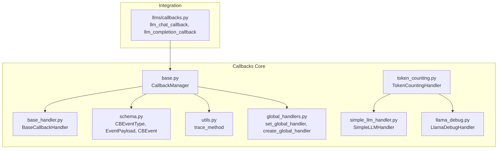
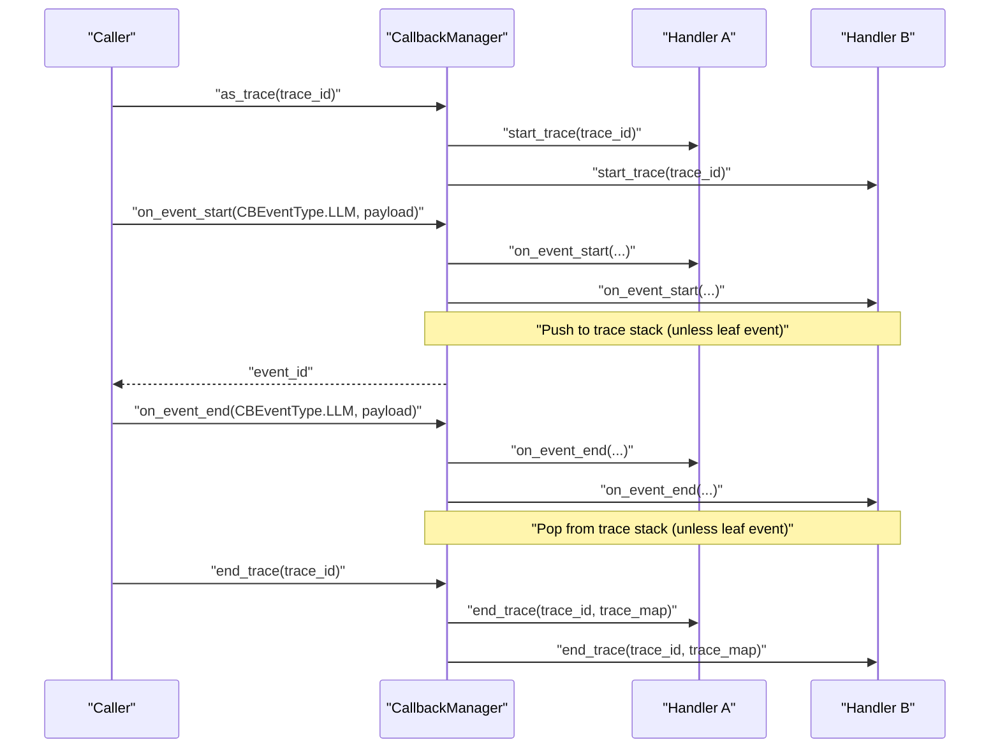
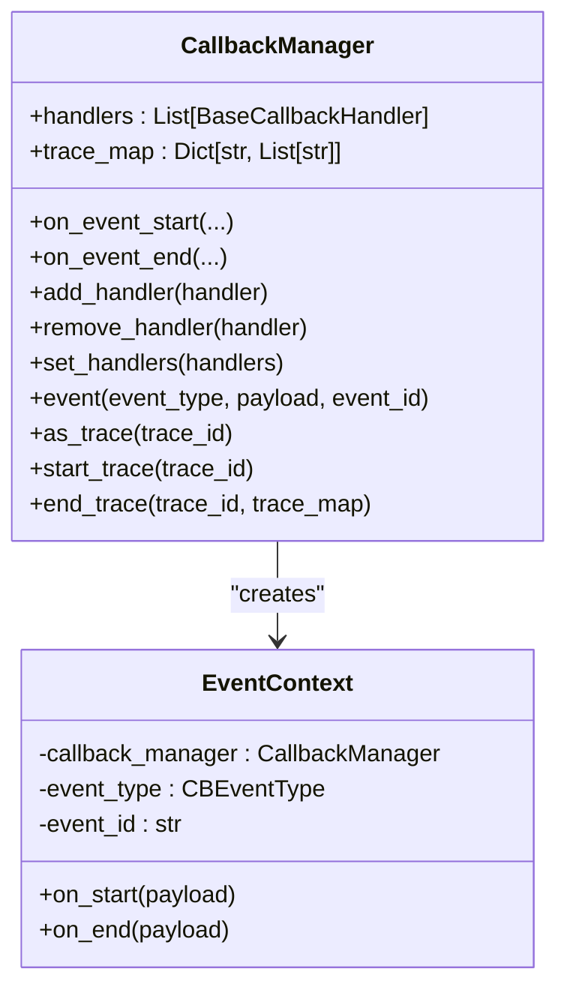
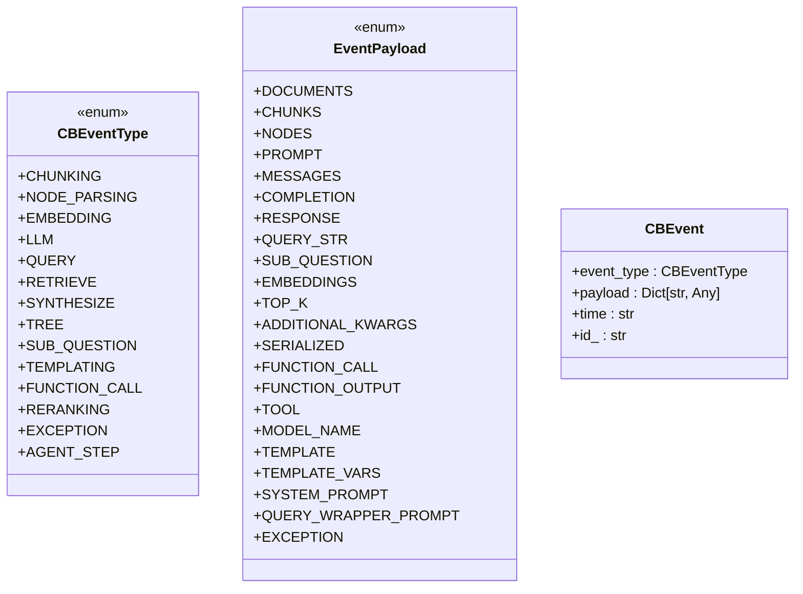
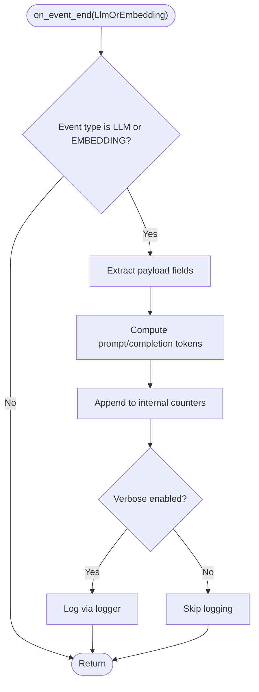
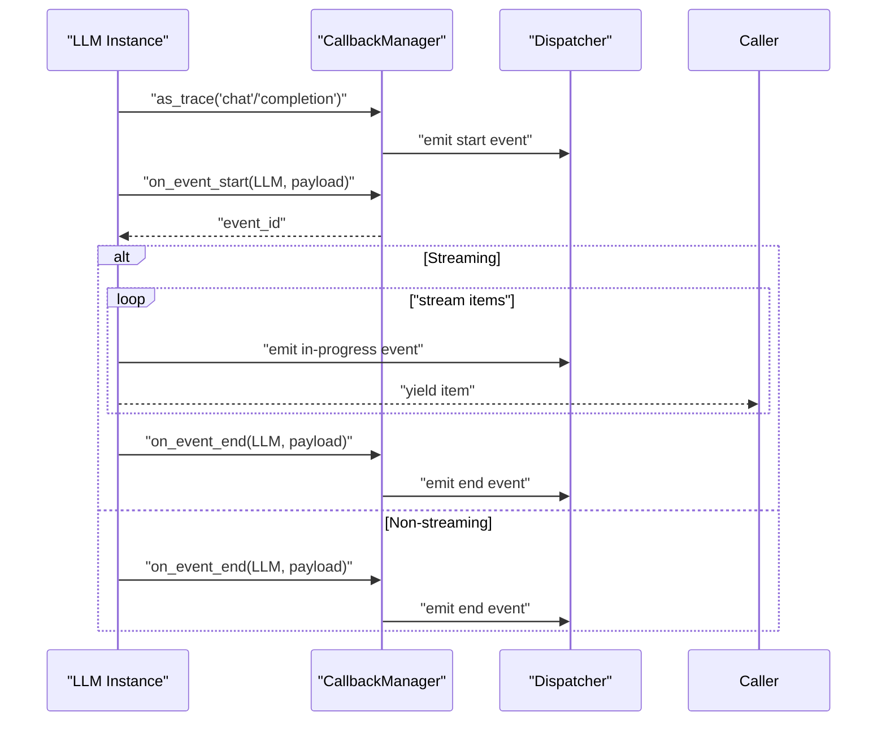
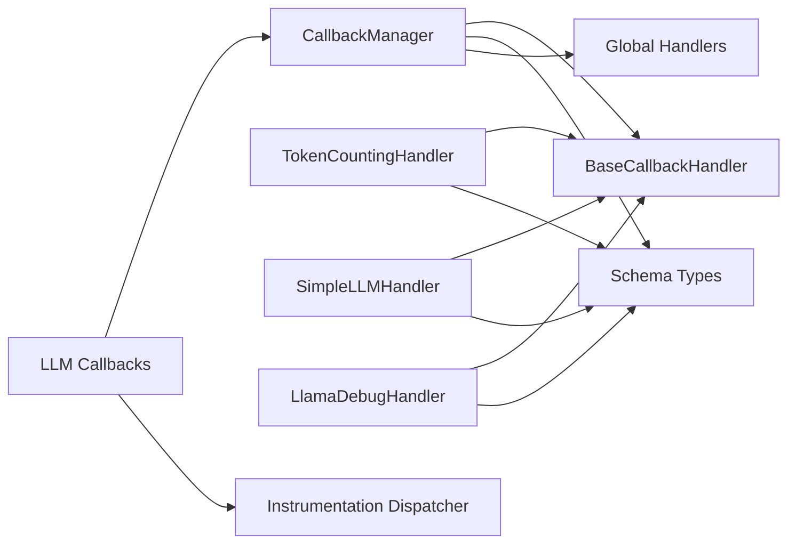

# Callback System Overview

<cite>
**Referenced Files in This Document**
- [base.py](file://llama-index-core/llama_index/core/callbacks/base.py)
- [base_handler.py](file://llama-index-core/llama_index/core/callbacks/base_handler.py)
- [schema.py](file://llama-index-core/llama_index/core/callbacks/schema.py)
- [global_handlers.py](file://llama-index-core/llama_index/core/callbacks/global_handlers.py)
- [utils.py](file://llama-index-core/llama_index/core/callbacks/utils.py)
- [token_counting.py](file://llama-index-core/llama_index/core/callbacks/token_counting.py)
- [simple_llm_handler.py](file://llama-index-core/llama_index/core/callbacks/simple_llm_handler.py)
- [llama_debug.py](file://llama-index-core/llama_index/core/callbacks/llama_debug.py)
- [callbacks.py](file://llama-index-core/llama_index/core/llms/callbacks.py)
- [__init__.py](file://llama-index-core/llama_index/core/callbacks/__init__.py)
</cite>

## Table of Contents
1. [Introduction](#introduction)
2. [Project Structure](#project-structure)
3. [Core Components](#core-components)
4. [Architecture Overview](#architecture-overview)
5. [Detailed Component Analysis](#detailed-component-analysis)
6. [Dependency Analysis](#dependency-analysis)
7. [Performance Considerations](#performance-considerations)
8. [Troubleshooting Guide](#troubleshooting-guide)
9. [Conclusion](#conclusion)

## Introduction
This document explains the LlamaIndex callback system architecture with a focus on the CallbackManager, event lifecycle, and handler registration patterns. It documents the CBEventType enumeration, EventPayload structure, and CBEvent data model. It also details the observer pattern implementation, event propagation, and tracing mechanisms. Practical guidance is provided for basic setup, handler chaining, event filtering, global handlers, thread-safe management, and performance/memory considerations.

## Project Structure
The callback system lives primarily under the core callbacks module and integrates with LLM wrappers and instrumentation dispatchers. Key files include the manager, handler base, schema, and several built-in handlers.

**Diagram sources**
- [base.py](file://llama-index-core/llama_index/core/callbacks/base.py#L28-L303)
- [base_handler.py](file://llama-index-core/llama_index/core/callbacks/base_handler.py#L12-L56)
- [schema.py](file://llama-index-core/llama_index/core/callbacks/schema.py#L16-L102)
- [utils.py](file://llama-index-core/llama_index/core/callbacks/utils.py#L11-L62)
- [global_handlers.py](file://llama-index-core/llama_index/core/callbacks/global_handlers.py#L6-L150)
- [token_counting.py](file://llama-index-core/llama_index/core/callbacks/token_counting.py#L143-L270)
- [simple_llm_handler.py](file://llama-index-core/llama_index/core/callbacks/simple_llm_handler.py#L10-L71)
- [llama_debug.py](file://llama-index-core/llama_index/core/callbacks/llama_debug.py#L17-L211)
- [callbacks.py](file://llama-index-core/llama_index/core/llms/callbacks.py#L39-L546)

**Section sources**
- [__init__.py](file://llama-index-core/llama_index/core/callbacks/__init__.py#L1-L18)
- [base.py](file://llama-index-core/llama_index/core/callbacks/base.py#L28-L303)
- [base_handler.py](file://llama-index-core/llama_index/core/callbacks/base_handler.py#L12-L56)
- [schema.py](file://llama-index-core/llama_index/core/callbacks/schema.py#L16-L102)
- [utils.py](file://llama-index-core/llama_index/core/callbacks/utils.py#L11-L62)
- [global_handlers.py](file://llama-index-core/llama_index/core/callbacks/global_handlers.py#L6-L150)
- [token_counting.py](file://llama-index-core/llama_index/core/callbacks/token_counting.py#L143-L270)
- [simple_llm_handler.py](file://llama-index-core/llama_index/core/callbacks/simple_llm_handler.py#L10-L71)
- [llama_debug.py](file://llama-index-core/llama_index/core/callbacks/llama_debug.py#L17-L211)
- [callbacks.py](file://llama-index-core/llama_index/core/llms/callbacks.py#L39-L546)

## Core Components
- CallbackManager: Central orchestrator for event lifecycle, trace management, and handler invocation. Supports context-managed event and trace lifecycles, and maintains a per-thread trace stack and trace map.
- BaseCallbackHandler: Abstract base defining the observer contract for event start/end and trace start/end.
- Schema: Defines CBEventType, EventPayload, CBEvent, and leaf-event semantics.
- Built-in Handlers: TokenCountingHandler, SimpleLLMHandler, LlamaDebugHandler.
- Global Handlers: Factory to configure global default handlers.
- Utilities: trace_method decorator for automatic tracing around methods.

Key responsibilities:
- Event lifecycle: on_event_start/on_event_end with parent-child relationships and leaf-event handling.
- Trace lifecycle: start_trace/end_trace with nested trace stacks and trace maps.
- Handler chaining: ordered invocation across registered handlers.
- Thread safety: per-task trace stacks via context variables.

**Section sources**
- [base.py](file://llama-index-core/llama_index/core/callbacks/base.py#L28-L303)
- [base_handler.py](file://llama-index-core/llama_index/core/callbacks/base_handler.py#L12-L56)
- [schema.py](file://llama-index-core/llama_index/core/callbacks/schema.py#L16-L102)
- [token_counting.py](file://llama-index-core/llama_index/core/callbacks/token_counting.py#L143-L270)
- [simple_llm_handler.py](file://llama-index-core/llama_index/core/callbacks/simple_llm_handler.py#L10-L71)
- [llama_debug.py](file://llama-index-core/llama_index/core/callbacks/llama_debug.py#L17-L211)
- [global_handlers.py](file://llama-index-core/llama_index/core/callbacks/global_handlers.py#L6-L150)
- [utils.py](file://llama-index-core/llama_index/core/callbacks/utils.py#L11-L62)

## Architecture Overview
The callback system implements an observer pattern. Components emit events (start/end) and optionally streams of progress. CallbackManager coordinates:
- Event propagation to all registered handlers.
- Parent-child relationship tracking via a per-thread trace stack.
- Trace boundaries with nested trace stacks and a trace map.
- Optional integration with instrumentation dispatchers for richer telemetry.

**Diagram sources**
- [base.py](file://llama-index-core/llama_index/core/callbacks/base.py#L88-L143)
- [base.py](file://llama-index-core/llama_index/core/callbacks/base.py#L213-L243)
- [base_handler.py](file://llama-index-core/llama_index/core/callbacks/base_handler.py#L24-L55)

## Detailed Component Analysis

### CallbackManager
- Responsibilities:
  - Manage a list of BaseCallbackHandler instances.
  - Emit on_event_start/on_event_end to all handlers.
  - Maintain per-thread trace stack and trace map.
  - Provide context managers for event and trace lifecycles.
- Thread-safety:
  - Uses context variables for trace stacks and trace IDs to isolate per-task state.
- Event propagation:
  - Skips ignored event types via handler-specific ignore lists.
  - Leaf events do not push/pop the trace stack.
- Trace management:
  - Nested traces tracked via a stack of trace IDs.
  - Trace map records parent-child relationships for downstream analysis.

**Diagram sources**
- [base.py](file://llama-index-core/llama_index/core/callbacks/base.py#L28-L303)

**Section sources**
- [base.py](file://llama-index-core/llama_index/core/callbacks/base.py#L28-L303)

### BaseCallbackHandler
- Contract:
  - on_event_start(event_type, payload, event_id, parent_id, **kwargs) -> str
  - on_event_end(event_type, payload, event_id, **kwargs) -> None
  - start_trace(trace_id) -> None
  - end_trace(trace_id, trace_map) -> None
- Ignore lists:
  - event_starts_to_ignore and event_ends_to_ignore allow selective filtering.

**Section sources**
- [base_handler.py](file://llama-index-core/llama_index/core/callbacks/base_handler.py#L12-L56)

### Schema: CBEventType, EventPayload, CBEvent
- CBEventType: Enumerates major event categories (e.g., LLM, QUERY, RETRIEVE, EMBEDDING, CHUNKING, TREE, SUB_QUESTION, TEMPLATING, FUNCTION_CALL, RERANKING, EXCEPTION, AGENT_STEP).
- EventPayload: Enumerates standardized payload keys (e.g., PROMPT, MESSAGES, COMPLETION, RESPONSE, QUERY_STR, EMBEDDINGS, TOP_K, ADDITIONAL_KWARGS, SERIALIZED, FUNCTION_CALL, TOOL, MODEL_NAME, TEMPLATE, TEMPLATE_VARS, SYSTEM_PROMPT, QUERY_WRAPPER_PROMPT, EXCEPTION).
- CBEvent: Data structure capturing event_type, payload, time, and id_.
- LEAF_EVENTS: Events that never have children (e.g., CHUNKING, LLM, EMBEDDING).

**Diagram sources**
- [schema.py](file://llama-index-core/llama_index/core/callbacks/schema.py#L16-L102)

**Section sources**
- [schema.py](file://llama-index-core/llama_index/core/callbacks/schema.py#L16-L102)

### Built-in Handlers

#### TokenCountingHandler
- Purpose: Count tokens for LLM and EMBEDDING events using a TokenCounter and optional tokenizer.
- Behavior:
  - on_event_end inspects payload and computes prompt/completion token counts.
  - Aggregates counts per event and exposes totals and resets.
- Integration: Inherits from PythonicallyPrintingBaseHandler for logging.

**Diagram sources**
- [token_counting.py](file://llama-index-core/llama_index/core/callbacks/token_counting.py#L197-L244)

**Section sources**
- [token_counting.py](file://llama-index-core/llama_index/core/callbacks/token_counting.py#L143-L270)

#### SimpleLLMHandler
- Purpose: Print LLM prompts and completions in a structured way.
- Behavior:
  - on_event_end prints formatted prompt/response for both single-prompt and chat-message modes.

**Section sources**
- [simple_llm_handler.py](file://llama-index-core/llama_index/core/callbacks/simple_llm_handler.py#L10-L71)

#### LlamaDebugHandler
- Purpose: Debug and analyze event sequences and timing.
- Behavior:
  - Stores CBEvent entries for start/end pairs.
  - Provides utilities to retrieve events, compute time statistics, and print trace maps.

**Section sources**
- [llama_debug.py](file://llama-index-core/llama_index/core/callbacks/llama_debug.py#L17-L211)

### Global Handlers
- set_global_handler(eval_mode, **eval_params): Sets a global default handler based on eval_mode.
- create_global_handler(eval_mode, **eval_params): Factory that returns a handler instance for supported integrations (e.g., wandb, openinference, arize_phoenix, honeyhive, promptlayer, deepeval, simple, argilla, langfuse, agentops, literalai, opik).
- Integration with CallbackManager: CallbackManager auto-includes a global handler if present and not duplicated by type.

**Section sources**
- [global_handlers.py](file://llama-index-core/llama_index/core/callbacks/global_handlers.py#L6-L150)
- [base.py](file://llama-index-core/llama_index/core/callbacks/base.py#L57-L85)

### Utilities: trace_method
- Purpose: Decorator to automatically trace method calls using a CallbackManager attribute.
- Behavior:
  - Wraps both sync and async methods.
  - Retrieves the manager from an attribute (default "callback_manager") and uses as_trace(trace_id) around the call.

**Section sources**
- [utils.py](file://llama-index-core/llama_index/core/callbacks/utils.py#L11-L62)

### LLM Integration: llm_chat_callback and llm_completion_callback
- Purpose: Wrap LLM chat and completion methods to emit structured LLM events.
- Behavior:
  - Ensures a CallbackManager exists on the LLM instance.
  - Emits start/end events with standardized payloads (MESSAGES/PROMPT, RESPONSE/COMPLETION, ADDITIONAL_KWARGS, SERIALIZED).
  - Intercepts streaming generators to emit in-progress events and propagate exceptions.
  - Integrates with instrumentation dispatchers for richer telemetry.

**Diagram sources**
- [callbacks.py](file://llama-index-core/llama_index/core/llms/callbacks.py#L39-L285)
- [callbacks.py](file://llama-index-core/llama_index/core/llms/callbacks.py#L288-L546)

**Section sources**
- [callbacks.py](file://llama-index-core/llama_index/core/llms/callbacks.py#L39-L546)

## Dependency Analysis
- CallbackManager depends on:
  - BaseCallbackHandler (contract)
  - Schema (types and constants)
  - ContextVars for thread/task isolation
  - Global handler injection
- Handlers depend on:
  - BaseCallbackHandler (contract)
  - Schema (types)
  - TokenCounter and tokenizer (TokenCountingHandler)
  - Logging (PythonicallyPrintingBaseHandler)
- LLM callbacks depend on:
  - CallbackManager
  - Instrumentation dispatcher for richer telemetry

**Diagram sources**
- [base.py](file://llama-index-core/llama_index/core/callbacks/base.py#L28-L303)
- [base_handler.py](file://llama-index-core/llama_index/core/callbacks/base_handler.py#L12-L56)
- [schema.py](file://llama-index-core/llama_index/core/callbacks/schema.py#L16-L102)
- [global_handlers.py](file://llama-index-core/llama_index/core/callbacks/global_handlers.py#L6-L150)
- [token_counting.py](file://llama-index-core/llama_index/core/callbacks/token_counting.py#L143-L270)
- [simple_llm_handler.py](file://llama-index-core/llama_index/core/callbacks/simple_llm_handler.py#L10-L71)
- [llama_debug.py](file://llama-index-core/llama_index/core/callbacks/llama_debug.py#L17-L211)
- [callbacks.py](file://llama-index-core/llama_index/core/llms/callbacks.py#L39-L546)

**Section sources**
- [base.py](file://llama-index-core/llama_index/core/callbacks/base.py#L28-L303)
- [base_handler.py](file://llama-index-core/llama_index/core/callbacks/base_handler.py#L12-L56)
- [schema.py](file://llama-index-core/llama_index/core/callbacks/schema.py#L16-L102)
- [global_handlers.py](file://llama-index-core/llama_index/core/callbacks/global_handlers.py#L6-L150)
- [token_counting.py](file://llama-index-core/llama_index/core/callbacks/token_counting.py#L143-L270)
- [simple_llm_handler.py](file://llama-index-core/llama_index/core/callbacks/simple_llm_handler.py#L10-L71)
- [llama_debug.py](file://llama-index-core/llama_index/core/callbacks/llama_debug.py#L17-L211)
- [callbacks.py](file://llama-index-core/llama_index/core/llms/callbacks.py#L39-L546)

## Performance Considerations
- Handler ordering: Each handler runs sequentially on each event. Keep handlers efficient and avoid heavy work in hot paths.
- Payload size: Large payloads (e.g., long prompts/messages) increase memory and serialization overhead. Consider trimming or sampling.
- Streaming: LLM streaming handlers emit in-progress events; ensure handlers handle frequent updates efficiently.
- Token counting: TokenCountingHandler performs tokenization per event; cache or reuse tokenizers when possible.
- Trace depth: Deep nested traces increase trace_map size and traversal cost. Limit nesting where feasible.
- Memory footprint: LlamaDebugHandler stores all events; disable or flush periodically in production.

[No sources needed since this section provides general guidance]

## Troubleshooting Guide
- Duplicate global handler type:
  - Symptom: Error when adding a handler of the same type as the global handler.
  - Cause: CallbackManager prevents duplicate handler types.
  - Fix: Remove the conflicting handler or adjust global handler configuration.
- Missing CallbackManager on LLM:
  - Symptom: LLM wrappers fail to trace.
  - Cause: LLM instance lacks a CallbackManager attribute.
  - Fix: Ensure wrappers initialize a CallbackManager on the instance.
- Ignored events:
  - Symptom: Handler not invoked for certain events.
  - Cause: Handler’s ignore lists exclude specific event types.
  - Fix: Adjust event_starts_to_ignore/event_ends_to_ignore.
- Streaming exceptions:
  - Symptom: Exceptions during streaming not recorded.
  - Fix: LLM wrappers ensure on_event_end is called with EXCEPTION payload; verify wrapper logic.
- Trace mismatch:
  - Symptom: Trace map or stack imbalance.
  - Fix: Ensure every on_event_start has a matching on_event_end and leaf events do not alter the stack.

**Section sources**
- [base.py](file://llama-index-core/llama_index/core/callbacks/base.py#L64-L74)
- [callbacks.py](file://llama-index-core/llama_index/core/llms/callbacks.py#L42-L47)
- [base_handler.py](file://llama-index-core/llama_index/core/callbacks/base_handler.py#L15-L22)

## Conclusion
The LlamaIndex callback system provides a robust, extensible observer-based architecture for instrumenting workflows. CallbackManager centralizes event and trace lifecycle management while enabling flexible handler composition. With standardized event types and payloads, developers can implement handlers for logging, metrics, debugging, and observability. Proper use of ignore lists, global handlers, and thread-safe trace management ensures maintainable and performant instrumentation.