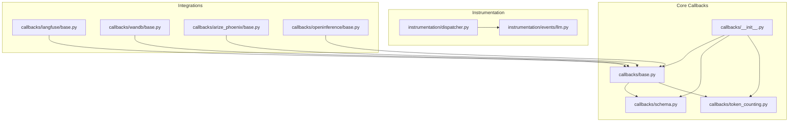
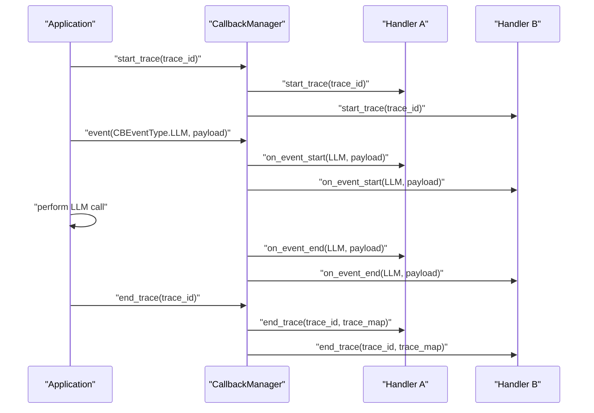
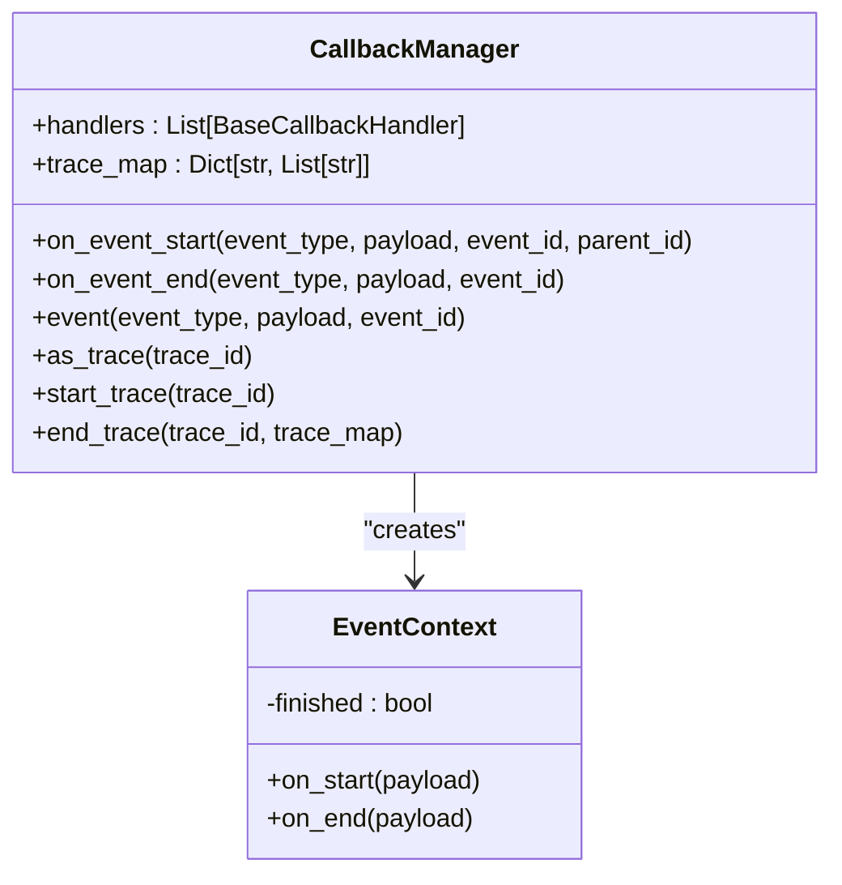
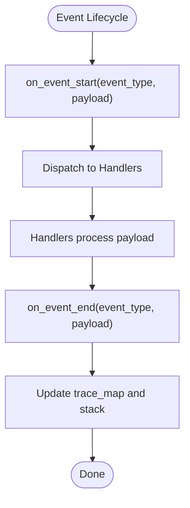
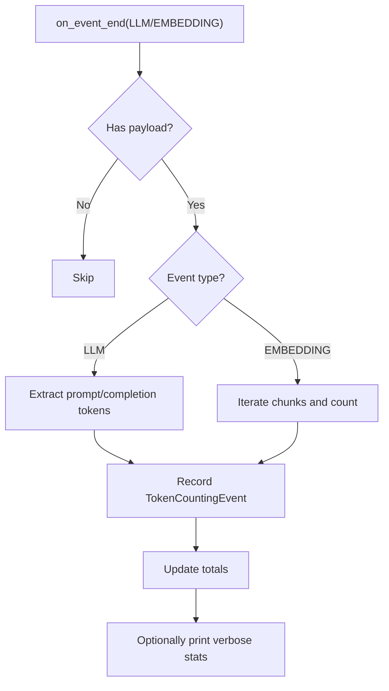
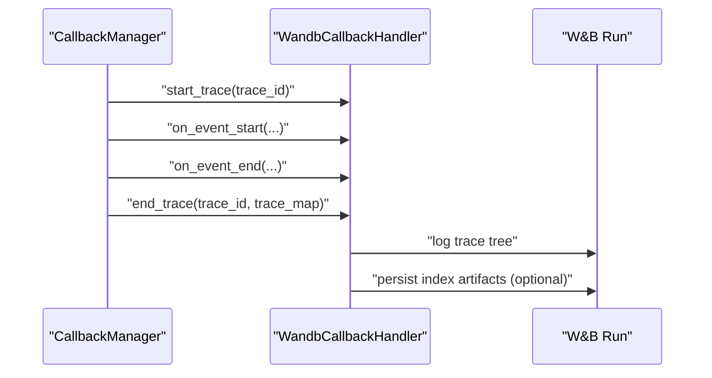
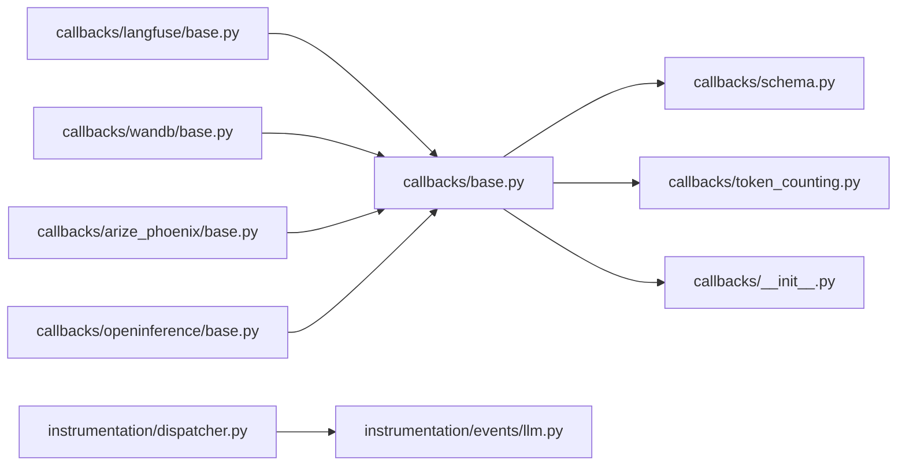

# Callback and Observability APIs

<cite>
**Referenced Files in This Document**
- [callbacks/__init__.py](file://llama-index-core/llama_index/core/callbacks/__init__.py)
- [callbacks/base.py](file://llama-index-core/llama_index/core/callbacks/base.py)
- [callbacks/schema.py](file://llama-index-core/llama_index/core/callbacks/schema.py)
- [callbacks/token_counting.py](file://llama-index-core/llama_index/core/callbacks/token_counting.py)
- [instrumentation/dispatcher.py](file://llama-index-core/llama_index/core/instrumentation/dispatcher.py)
- [instrumentation/events/llm.py](file://llama-index-core/llama_index/core/instrumentation/events/llm.py)
- [callbacks/langfuse/base.py](file://llama-index-integrations/callbacks/llama-index-callbacks-langfuse/llama_index/callbacks/langfuse/base.py)
- [callbacks/wandb/base.py](file://llama-index-integrations/callbacks/llama-index-callbacks-wandb/llama_index/callbacks/wandb/base.py)
- [callbacks/arize_phoenix/base.py](file://llama-index-integrations/callbacks/llama-index-callbacks-arize-phoenix/llama_index/callbacks/arize_phoenix/base.py)
- [callbacks/openinference/base.py](file://llama-index-integrations/callbacks/llama-index-callbacks-openinference/llama_index/callbacks/openinference/base.py)
</cite>

## Table of Contents
1. [Introduction](#introduction)
2. [Project Structure](#project-structure)
3. [Core Components](#core-components)
4. [Architecture Overview](#architecture-overview)
5. [Detailed Component Analysis](#detailed-component-analysis)
6. [Dependency Analysis](#dependency-analysis)
7. [Performance Considerations](#performance-considerations)
8. [Troubleshooting Guide](#troubleshooting-guide)
9. [Conclusion](#conclusion)
10. [Appendices](#appendices)

## Introduction
This document describes the Callback and Observability APIs in the LlamaIndex ecosystem. It covers the core callback system, event types, token counting, latency tracking, and integration with observability platforms such as Langfuse, Weights & Biases, Arize Phoenix, and OpenInference. It also provides guidance on building custom callbacks, filtering events, exporting data, and optimizing observability overhead for production deployments.

## Project Structure
The callback and observability surface spans the core library and multiple integration packages:
- Core callback manager and schema live under the core module.
- Instrumentation provides event classes for richer telemetry.
- Integration packages expose platform-specific callback handlers.

**Diagram sources**
- [callbacks/base.py](file://llama-index-core/llama_index/core/callbacks/base.py#L1-L303)
- [callbacks/schema.py](file://llama-index-core/llama_index/core/callbacks/schema.py#L1-L102)
- [callbacks/token_counting.py](file://llama-index-core/llama_index/core/callbacks/token_counting.py#L1-L270)
- [callbacks/__init__.py](file://llama-index-core/llama_index/core/callbacks/__init__.py#L1-L18)
- [instrumentation/dispatcher.py](file://llama-index-core/llama_index/core/instrumentation/dispatcher.py#L1-L9)
- [instrumentation/events/llm.py](file://llama-index-core/llama_index/core/instrumentation/events/llm.py#L1-L247)
- [callbacks/langfuse/base.py](file://llama-index-integrations/callbacks/llama-index-callbacks-langfuse/llama_index/callbacks/langfuse/base.py#L1-L12)
- [callbacks/wandb/base.py](file://llama-index-integrations/callbacks/llama-index-callbacks-wandb/llama_index/callbacks/wandb/base.py#L1-L579)
- [callbacks/arize_phoenix/base.py](file://llama-index-integrations/callbacks/llama-index-callbacks-arize-phoenix/llama_index/callbacks/arize_phoenix/base.py#L1-L40)
- [callbacks/openinference/base.py](file://llama-index-integrations/callbacks/llama-index-callbacks-openinference/llama_index/callbacks/openinference/base.py#L1-L200)

**Section sources**
- [callbacks/__init__.py](file://llama-index-core/llama_index/core/callbacks/__init__.py#L1-L18)
- [callbacks/base.py](file://llama-index-core/llama_index/core/callbacks/base.py#L1-L303)
- [callbacks/schema.py](file://llama-index-core/llama_index/core/callbacks/schema.py#L1-L102)
- [callbacks/token_counting.py](file://llama-index-core/llama_index/core/callbacks/token_counting.py#L1-L270)
- [instrumentation/dispatcher.py](file://llama-index-core/llama_index/core/instrumentation/dispatcher.py#L1-L9)
- [instrumentation/events/llm.py](file://llama-index-core/llama_index/core/instrumentation/events/llm.py#L1-L247)
- [callbacks/langfuse/base.py](file://llama-index-integrations/callbacks/llama-index-callbacks-langfuse/llama_index/callbacks/langfuse/base.py#L1-L12)
- [callbacks/wandb/base.py](file://llama-index-integrations/callbacks/llama-index-callbacks-wandb/llama_index/callbacks/wandb/base.py#L1-L579)
- [callbacks/arize_phoenix/base.py](file://llama-index-integrations/callbacks/llama-index-callbacks-arize-phoenix/llama_index/callbacks/arize_phoenix/base.py#L1-L40)
- [callbacks/openinference/base.py](file://llama-index-integrations/callbacks/llama-index-callbacks-openinference/llama_index/callbacks/openinference/base.py#L1-L200)

## Core Components
- CallbackManager: Central orchestrator for event lifecycle, trace management, and handler dispatch.
- Event types and payloads: Standardized enumerations for common LlamaIndex operations.
- TokenCountingHandler: Aggregates token usage for LLM and embedding events.
- Instrumentation events: Rich telemetry events for LLM operations.

Key responsibilities:
- Event lifecycle: Start/end events with payloads and timestamps.
- Trace management: Hierarchical tracing with parent-child relationships.
- Handler dispatch: Pluggable handlers for logging, metrics, and external observability platforms.
- Token accounting: Prompt/completion token counts and totals.

**Section sources**
- [callbacks/base.py](file://llama-index-core/llama_index/core/callbacks/base.py#L28-L303)
- [callbacks/schema.py](file://llama-index-core/llama_index/core/callbacks/schema.py#L16-L102)
- [callbacks/token_counting.py](file://llama-index-core/llama_index/core/callbacks/token_counting.py#L143-L270)
- [instrumentation/events/llm.py](file://llama-index-core/llama_index/core/instrumentation/events/llm.py#L12-L247)

## Architecture Overview
The callback system is event-driven and trace-aware. Handlers receive notifications on event start/end and can optionally participate in trace construction. Token counting integrates with LLM and embedding events. Instrumentation augments the system with richer event classes for advanced telemetry.

**Diagram sources**
- [callbacks/base.py](file://llama-index-core/llama_index/core/callbacks/base.py#L88-L243)
- [callbacks/schema.py](file://llama-index-core/llama_index/core/callbacks/schema.py#L16-L76)

## Detailed Component Analysis

### CallbackManager
- Manages a list of BaseCallbackHandler instances.
- Tracks trace stacks and builds a parent-child trace map.
- Provides context managers for event and trace lifecycles.
- Supports ignoring specific event types at start/end to reduce noise.

**Diagram sources**
- [callbacks/base.py](file://llama-index-core/llama_index/core/callbacks/base.py#L28-L303)

**Section sources**
- [callbacks/base.py](file://llama-index-core/llama_index/core/callbacks/base.py#L28-L303)

### Event Types and Payloads
Standardized enumerations define the domain of observable activities and the keys used to carry event-specific data.

- Event types include chunking, node parsing, embedding, LLM, query, retrieve, synthesize, tree, sub_question, templating, function_call, reranking, exception, and agent_step.
- Payload keys capture prompts, messages, completions, responses, query strings, embeddings, top_k, serialized objects, function calls, model names, templates, and exceptions.

**Diagram sources**
- [callbacks/schema.py](file://llama-index-core/llama_index/core/callbacks/schema.py#L16-L76)
- [callbacks/base.py](file://llama-index-core/llama_index/core/callbacks/base.py#L88-L143)

**Section sources**
- [callbacks/schema.py](file://llama-index-core/llama_index/core/callbacks/schema.py#L16-L76)

### Token Counting
TokenCountingHandler aggregates token usage for LLM and embedding events:
- Extracts token counts from response usage metadata or falls back to tokenizer-based estimates.
- Supports verbose logging and exposes totals for prompt, completion, and combined token usage.
- Integrates with the shared token counter utility.

**Diagram sources**
- [callbacks/token_counting.py](file://llama-index-core/llama_index/core/callbacks/token_counting.py#L197-L245)

**Section sources**
- [callbacks/token_counting.py](file://llama-index-core/llama_index/core/callbacks/token_counting.py#L143-L270)

### Instrumentation Events
Instrumentation adds richer event classes for LLM operations, enabling more detailed telemetry and tracing.

- LLMPredictStartEvent, LLMPredictEndEvent
- LLMStructuredPredict* events
- LLMCompletion* events
- LLMChat* events

These classes encapsulate templates, messages, and response objects for downstream handlers.

**Section sources**
- [instrumentation/events/llm.py](file://llama-index-core/llama_index/core/instrumentation/events/llm.py#L12-L247)

### Observability Integrations

#### Langfuse
- Exposes a factory function returning a LlamaIndexCallbackHandler from the Langfuse SDK.
- Integrates seamlessly with the core callback system.

**Section sources**
- [callbacks/langfuse/base.py](file://llama-index-integrations/callbacks/llama-index-callbacks-langfuse/llama_index/callbacks/langfuse/base.py#L1-L12)

#### Weights & Biases (W&B)
- WandbCallbackHandler logs trace trees, payloads, and token usage to W&B runs.
- Provides helpers to persist and load indices as artifacts.
- Maps event types to span kinds for trace visualization.

**Diagram sources**
- [callbacks/wandb/base.py](file://llama-index-integrations/callbacks/llama-index-callbacks-wandb/llama_index/callbacks/wandb/base.py#L220-L265)

**Section sources**
- [callbacks/wandb/base.py](file://llama-index-integrations/callbacks/llama-index-callbacks-wandb/llama_index/callbacks/wandb/base.py#L87-L579)

#### Arize Phoenix
- Supports both newer and legacy versions of Arize Phoenix.
- Uses OpenInference instrumentation or Phoenix’s callback handler depending on version.
- Configurable endpoint and tracer provider.

**Section sources**
- [callbacks/arize_phoenix/base.py](file://llama-index-integrations/callbacks/llama-index-callbacks-arize-phoenix/llama_index/callbacks/arize_phoenix/base.py#L1-L40)

#### OpenInference
- Integration via OpenInference instrumentation for LlamaIndex.
- Enables standardized tracing and attribute extraction.

**Section sources**
- [callbacks/openinference/base.py](file://llama-index-integrations/callbacks/llama-index-callbacks-openinference/llama_index/callbacks/openinference/base.py#L1-L200)

### Custom Callback Development
To implement a custom callback:
- Subclass BaseCallbackHandler and override lifecycle hooks:
  - on_event_start(event_type, payload, event_id, parent_id)
  - on_event_end(event_type, payload, event_id)
  - start_trace(trace_id)
  - end_trace(trace_id, trace_map)
- Optionally filter event types via event_starts_to_ignore and event_ends_to_ignore.
- Register the handler with a CallbackManager and attach it to the global settings or per-component context.

Best practices:
- Keep handlers lightweight; avoid heavy synchronous I/O in hot paths.
- Use ignore lists to reduce noise for frequent leaf events.
- Normalize payloads for downstream systems.

**Section sources**
- [callbacks/base.py](file://llama-index-core/llama_index/core/callbacks/base.py#L57-L85)
- [callbacks/schema.py](file://llama-index-core/llama_index/core/callbacks/schema.py#L74-L76)

### Event Filtering and Data Export Formats
- Filtering: Use event_starts_to_ignore and event_ends_to_ignore to skip noisy events (e.g., leaf events).
- Data export formats:
  - W&B: Trace trees with named inputs/outputs and span kinds; artifacts for indices.
  - Langfuse: Structured spans via LlamaIndexCallbackHandler.
  - Arize Phoenix/OpenInference: OTLP-based spans exported to configured endpoints.

**Section sources**
- [callbacks/base.py](file://llama-index-core/llama_index/core/callbacks/base.py#L107-L142)
- [callbacks/wandb/base.py](file://llama-index-integrations/callbacks/llama-index-callbacks-wandb/llama_index/callbacks/wandb/base.py#L385-L438)
- [callbacks/arize_phoenix/base.py](file://llama-index-integrations/callbacks/llama-index-callbacks-arize-phoenix/llama_index/callbacks/arize_phoenix/base.py#L16-L27)

### Performance Monitoring, Debugging, and Production Setups
- Performance monitoring:
  - Use TokenCountingHandler to track token usage trends and costs.
  - Combine with latency tracking via trace_map and handler timing.
- Debugging workflows:
  - Enable verbose token counting and W&B trace trees for end-to-end visibility.
  - Persist indices as artifacts for reproducibility.
- Production observability:
  - Choose exporters aligned with your backend (Langfuse, Arize Phoenix, OpenInference).
  - Configure ignore lists to minimize overhead.
  - Use context managers for deterministic trace boundaries.

**Section sources**
- [callbacks/token_counting.py](file://llama-index-core/llama_index/core/callbacks/token_counting.py#L177-L185)
- [callbacks/wandb/base.py](file://llama-index-integrations/callbacks/llama-index-callbacks-wandb/llama_index/callbacks/wandb/base.py#L220-L265)

## Dependency Analysis
The callback system composes core components with instrumentation and integrations.

**Diagram sources**
- [callbacks/base.py](file://llama-index-core/llama_index/core/callbacks/base.py#L1-L303)
- [callbacks/schema.py](file://llama-index-core/llama_index/core/callbacks/schema.py#L1-L102)
- [callbacks/token_counting.py](file://llama-index-core/llama_index/core/callbacks/token_counting.py#L1-L270)
- [callbacks/__init__.py](file://llama-index-core/llama_index/core/callbacks/__init__.py#L1-L18)
- [instrumentation/dispatcher.py](file://llama-index-core/llama_index/core/instrumentation/dispatcher.py#L1-L9)
- [instrumentation/events/llm.py](file://llama-index-core/llama_index/core/instrumentation/events/llm.py#L1-L247)
- [callbacks/langfuse/base.py](file://llama-index-integrations/callbacks/llama-index-callbacks-langfuse/llama_index/callbacks/langfuse/base.py#L1-L12)
- [callbacks/wandb/base.py](file://llama-index-integrations/callbacks/llama-index-callbacks-wandb/llama_index/callbacks/wandb/base.py#L1-L579)
- [callbacks/arize_phoenix/base.py](file://llama-index-integrations/callbacks/llama-index-callbacks-arize-phoenix/llama_index/callbacks/arize_phoenix/base.py#L1-L40)
- [callbacks/openinference/base.py](file://llama-index-integrations/callbacks/llama-index-callbacks-openinference/llama_index/callbacks/openinference/base.py#L1-L200)

**Section sources**
- [callbacks/base.py](file://llama-index-core/llama_index/core/callbacks/base.py#L1-L303)
- [callbacks/schema.py](file://llama-index-core/llama_index/core/callbacks/schema.py#L1-L102)
- [callbacks/token_counting.py](file://llama-index-core/llama_index/core/callbacks/token_counting.py#L1-L270)
- [callbacks/__init__.py](file://llama-index-core/llama_index/core/callbacks/__init__.py#L1-L18)
- [instrumentation/dispatcher.py](file://llama-index-core/llama_index/core/instrumentation/dispatcher.py#L1-L9)
- [instrumentation/events/llm.py](file://llama-index-core/llama_index/core/instrumentation/events/llm.py#L1-L247)
- [callbacks/langfuse/base.py](file://llama-index-integrations/callbacks/llama-index-callbacks-langfuse/llama_index/callbacks/langfuse/base.py#L1-L12)
- [callbacks/wandb/base.py](file://llama-index-integrations/callbacks/llama-index-callbacks-wandb/llama_index/callbacks/wandb/base.py#L1-L579)
- [callbacks/arize_phoenix/base.py](file://llama-index-integrations/callbacks/llama-index-callbacks-arize-phoenix/llama_index/callbacks/arize_phoenix/base.py#L1-L40)
- [callbacks/openinference/base.py](file://llama-index-integrations/callbacks/llama-index-callbacks-openinference/llama_index/callbacks/openinference/base.py#L1-L200)

## Performance Considerations
- Overhead reduction:
  - Filter leaf events (e.g., LLM, embedding) using ignore lists.
  - Avoid heavy I/O in handlers; batch or defer expensive operations.
- Token accounting:
  - Prefer extracting usage from response metadata to avoid extra tokenization.
  - Use verbose logging sparingly in production.
- Tracing:
  - Limit trace depth and scope in high-throughput environments.
  - Use context managers to bound trace lifetimes.

[No sources needed since this section provides general guidance]

## Troubleshooting Guide
Common issues and resolutions:
- Missing handler registration:
  - Ensure a handler type is not duplicated in the manager; a ValueError is raised if detected.
- Import failures for integrations:
  - Some handlers require optional dependencies; install the relevant packages and retry.
- W&B artifacts upload failures:
  - Errors during index persistence are caught and logged; verify artifact URLs and permissions.
- Token counting discrepancies:
  - When usage metadata is unavailable, fallback tokenization may differ from actual usage; rely on platform-provided usage when present.

**Section sources**
- [callbacks/base.py](file://llama-index-core/llama_index/core/callbacks/base.py#L64-L74)
- [callbacks/wandb/base.py](file://llama-index-integrations/callbacks/llama-index-callbacks-wandb/llama_index/callbacks/wandb/base.py#L299-L301)
- [callbacks/token_counting.py](file://llama-index-core/llama_index/core/callbacks/token_counting.py#L39-L76)

## Conclusion
The Callback and Observability APIs provide a robust, extensible foundation for capturing, aggregating, and exporting telemetry across LlamaIndex applications. By leveraging standardized event types, trace-aware managers, and platform-specific integrations, teams can implement comprehensive monitoring, debugging, and cost tracking with minimal friction.

[No sources needed since this section summarizes without analyzing specific files]

## Appendices

### Appendix A: Event Types Reference
- Chunking, Node Parsing, Embedding, LLM, Query, Retrieve, Synthesize, Tree, Sub Question, Templating, Function Call, Reranking, Exception, Agent Step.

**Section sources**
- [callbacks/schema.py](file://llama-index-core/llama_index/core/callbacks/schema.py#L16-L47)

### Appendix B: Payload Keys Reference
- Documents, Chunks, Nodes, Formatted Prompt, Messages, Completion, Response, Query String, Sub Question, Embeddings, Top K, Additional Kwargs, Serialized, Function Call, Function Output, Tool, Model Name, Template, Template Vars, System Prompt, Query Wrapper Prompt, Exception.

**Section sources**
- [callbacks/schema.py](file://llama-index-core/llama_index/core/callbacks/schema.py#L49-L72)