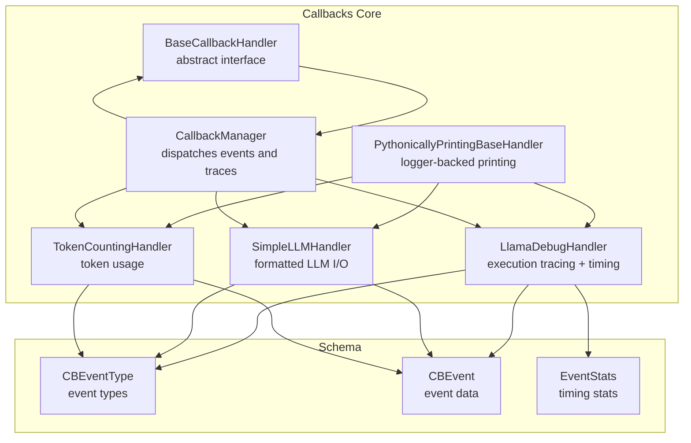
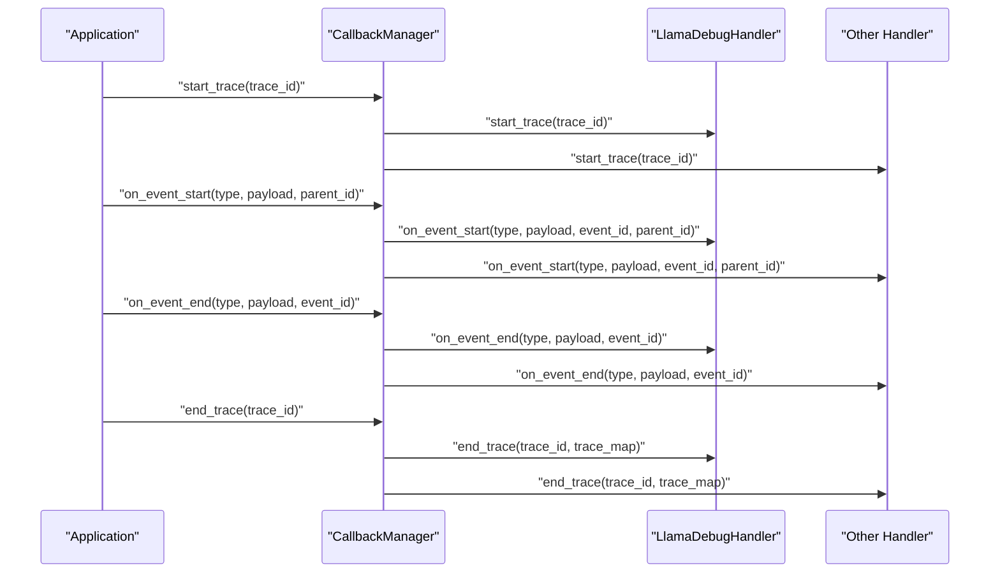
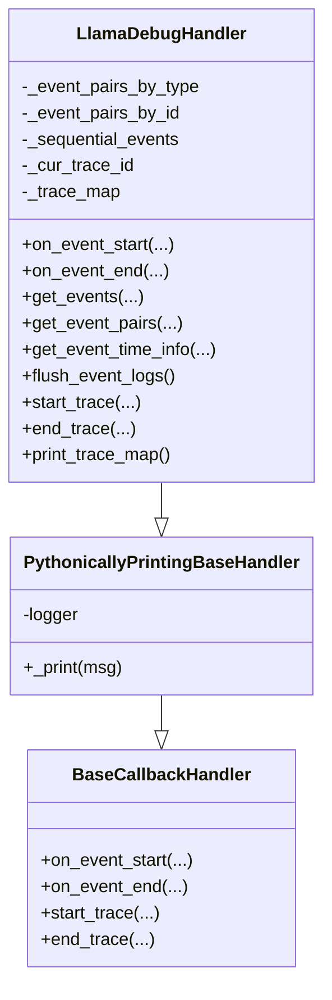
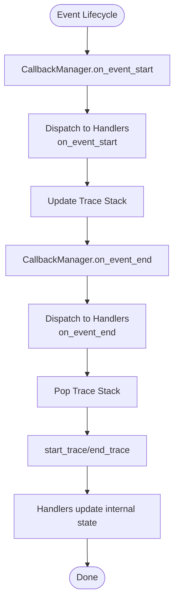
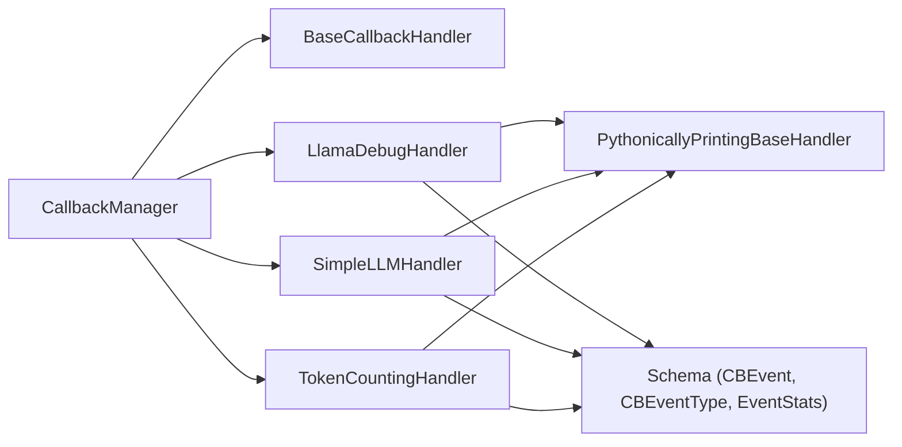

# Debugging and Profiling Tools

<cite>
**Referenced Files in This Document**
- [llama_debug.py](file://llama-index-core/llama_index/core/callbacks/llama_debug.py)
- [pythonically_printing_base_handler.py](file://llama-index-core/llama_index/core/callbacks/pythonically_printing_base_handler.py)
- [base_handler.py](file://llama-index-core/llama_index/core/callbacks/base_handler.py)
- [schema.py](file://llama-index-core/llama_index/core/callbacks/schema.py)
- [base.py](file://llama-index-core/llama_index/core/callbacks/base.py)
- [simple_llm_handler.py](file://llama-index-core/llama_index/core/callbacks/simple_llm_handler.py)
- [token_counting.py](file://llama-index-core/llama_index/core/callbacks/token_counting.py)
- [test_llama_debug.py](file://llama-index-core/tests/callbacks/test_llama_debug.py)
</cite>

## Table of Contents
1. [Introduction](#introduction)
2. [Project Structure](#project-structure)
3. [Core Components](#core-components)
4. [Architecture Overview](#architecture-overview)
5. [Detailed Component Analysis](#detailed-component-analysis)
6. [Dependency Analysis](#dependency-analysis)
7. [Performance Considerations](#performance-considerations)
8. [Troubleshooting Guide](#troubleshooting-guide)
9. [Conclusion](#conclusion)
10. [Appendices](#appendices)

## Introduction
This document explains the debugging and profiling callback infrastructure in the repository, focusing on:
- LlamaDebugHandler for detailed execution tracing and timing statistics
- PythonicallyPrintingBaseHandler for formatted, logger-backed output
- Debug event types, timing measurements, and performance bottleneck identification
- Practical guidance on enabling debug mode, interpreting logs, and profiling query execution times
- Integration tips for development workflows, IDE debugging, and production troubleshooting
- Strategies to optimize debug overhead and enable selective debugging

## Project Structure
The debugging and profiling tools live under the callbacks module. The core pieces are:
- LlamaDebugHandler: tracks event lifecycles, pairs start/end events, computes timing, and prints trace maps
- PythonicallyPrintingBaseHandler: a base class that routes printed output to a logger for better integration with Python logging ecosystem
- BaseCallbackHandler and CallbackManager: the foundational callback framework that dispatches events and manages traces
- Schema: event types, payloads, and statistics data structures
- Supporting handlers: SimpleLLMHandler and TokenCountingHandler demonstrate practical uses of the base printing handler

**Diagram sources**
- [base_handler.py](file://llama-index-core/llama_index/core/callbacks/base_handler.py#L12-L56)
- [base.py](file://llama-index-core/llama_index/core/callbacks/base.py#L28-L303)
- [pythonically_printing_base_handler.py](file://llama-index-core/llama_index/core/callbacks/pythonically_printing_base_handler.py#L10-L39)
- [llama_debug.py](file://llama-index-core/llama_index/core/callbacks/llama_debug.py#L17-L211)
- [simple_llm_handler.py](file://llama-index-core/llama_index/core/callbacks/simple_llm_handler.py#L10-L71)
- [token_counting.py](file://llama-index-core/llama_index/core/callbacks/token_counting.py#L143-L270)
- [schema.py](file://llama-index-core/llama_index/core/callbacks/schema.py#L16-L102)

**Section sources**
- [base.py](file://llama-index-core/llama_index/core/callbacks/base.py#L28-L303)
- [schema.py](file://llama-index-core/llama_index/core/callbacks/schema.py#L16-L102)

## Core Components
- LlamaDebugHandler
  - Tracks event starts/ends per type and by event ID
  - Pairs events to compute durations and aggregates timing statistics
  - Supports printing hierarchical trace maps for the most recent trace
  - Provides APIs to fetch raw events, event pairs, and time stats
- PythonicallyPrintingBaseHandler
  - Ensures formatted output uses logging instead of print
  - Enables integration with Python logging handlers (e.g., rich logging handler)
- BaseCallbackHandler and CallbackManager
  - Define the callback contract and orchestrate event dispatching
  - Manage trace stacks, trace maps, and global context variables for concurrent safety
- Schema
  - Defines CBEventType, CBEvent, EventStats, and timestamps
  - Supplies leaf event types that do not spawn children

Key capabilities:
- Event lifecycle capture: on_event_start/on_event_end
- Trace lifecycle: start_trace/end_trace
- Timing computation: total and average durations per event type
- Selective ignoring of event types at start/end
- Trace visualization via hierarchical trace map

**Section sources**
- [llama_debug.py](file://llama-index-core/llama_index/core/callbacks/llama_debug.py#L17-L211)
- [pythonically_printing_base_handler.py](file://llama-index-core/llama_index/core/callbacks/pythonically_printing_base_handler.py#L10-L39)
- [base_handler.py](file://llama-index-core/llama_index/core/callbacks/base_handler.py#L12-L56)
- [base.py](file://llama-index-core/llama_index/core/callbacks/base.py#L28-L303)
- [schema.py](file://llama-index-core/llama_index/core/callbacks/schema.py#L16-L102)

## Architecture Overview
The callback system is event-driven and trace-aware. CallbackManager coordinates:
- Dispatching on_event_start/on_event_end to registered handlers
- Maintaining a trace stack and trace map
- Managing trace lifecycles via start_trace/end_trace

Handlers like LlamaDebugHandler rely on these hooks to record and analyze execution.

**Diagram sources**
- [base.py](file://llama-index-core/llama_index/core/callbacks/base.py#L88-L243)
- [base_handler.py](file://llama-index-core/llama_index/core/callbacks/base_handler.py#L24-L55)
- [llama_debug.py](file://llama-index-core/llama_index/core/callbacks/llama_debug.py#L164-L178)

## Detailed Component Analysis

### LlamaDebugHandler
Responsibilities:
- Store and pair events by type and by ID
- Compute total and average durations per event type
- Maintain a sequential event log
- Print trace maps for the current trace
- Provide APIs to fetch events, pairs, and timing stats

Key methods and behaviors:
- on_event_start/on_event_end append CBEvent entries with timestamps and IDs
- get_event_pairs groups events by ID to form start/end pairs
- get_event_time_info calculates total_secs, average_secs, and total_count
- start_trace/end_trace manage trace context and optionally print trace maps
- print_trace_map renders a hierarchical view of the most recent trace

**Diagram sources**
- [base_handler.py](file://llama-index-core/llama_index/core/callbacks/base_handler.py#L12-L56)
- [pythonically_printing_base_handler.py](file://llama-index-core/llama_index/core/callbacks/pythonically_printing_base_handler.py#L10-L39)
- [llama_debug.py](file://llama-index-core/llama_index/core/callbacks/llama_debug.py#L17-L211)

**Section sources**
- [llama_debug.py](file://llama-index-core/llama_index/core/callbacks/llama_debug.py#L17-L211)
- [schema.py](file://llama-index-core/llama_index/core/callbacks/schema.py#L78-L102)

### PythonicallyPrintingBaseHandler
Purpose:
- Centralize formatted output to a logger for compatibility with Python logging ecosystem
- Allow handlers to avoid direct print statements and integrate with handlers like rich

Behavior:
- Uses logger.debug when a logger is provided
- Falls back to print when no logger is configured

Integration:
- Subclassed by LlamaDebugHandler, SimpleLLMHandler, and TokenCountingHandler

**Section sources**
- [pythonically_printing_base_handler.py](file://llama-index-core/llama_index/core/callbacks/pythonically_printing_base_handler.py#L10-L39)

### BaseCallbackHandler and CallbackManager
- BaseCallbackHandler defines the abstract interface for handlers
- CallbackManager implements the dispatch logic, trace stack, and trace map
- Manages global context variables for thread-safe trace stacks
- Supports selective ignoring of event types at start/end

**Diagram sources**
- [base.py](file://llama-index-core/llama_index/core/callbacks/base.py#L88-L143)
- [base_handler.py](file://llama-index-core/llama_index/core/callbacks/base_handler.py#L24-L55)

**Section sources**
- [base_handler.py](file://llama-index-core/llama_index/core/callbacks/base_handler.py#L12-L56)
- [base.py](file://llama-index-core/llama_index/core/callbacks/base.py#L28-L303)

### Supporting Handlers
- SimpleLLMHandler
  - Prints LLM inputs and outputs using the base printing handler
  - Focuses on readable formatting of prompts/completions or messages/response
- TokenCountingHandler
  - Counts tokens for LLM and embedding events
  - Integrates with a token counter utility and optionally prints verbose usage

These handlers demonstrate how to build on PythonicallyPrintingBaseHandler for specialized debugging and profiling needs.

**Section sources**
- [simple_llm_handler.py](file://llama-index-core/llama_index/core/callbacks/simple_llm_handler.py#L10-L71)
- [token_counting.py](file://llama-index-core/llama_index/core/callbacks/token_counting.py#L143-L270)

## Dependency Analysis
- LlamaDebugHandler depends on:
  - PythonicallyPrintingBaseHandler for logging-based output
  - Schema types for event types, payloads, CBEvent, and EventStats
- CallbackManager orchestrates dispatch to handlers and maintains trace context
- Handlers can be composed; CallbackManager ensures lifecycle consistency

**Diagram sources**
- [base.py](file://llama-index-core/llama_index/core/callbacks/base.py#L28-L303)
- [llama_debug.py](file://llama-index-core/llama_index/core/callbacks/llama_debug.py#L17-L211)
- [simple_llm_handler.py](file://llama-index-core/llama_index/core/callbacks/simple_llm_handler.py#L10-L71)
- [token_counting.py](file://llama-index-core/llama_index/core/callbacks/token_counting.py#L143-L270)
- [schema.py](file://llama-index-core/llama_index/core/callbacks/schema.py#L16-L102)

**Section sources**
- [base.py](file://llama-index-core/llama_index/core/callbacks/base.py#L28-L303)
- [schema.py](file://llama-index-core/llama_index/core/callbacks/schema.py#L16-L102)

## Performance Considerations
- Overhead characteristics
  - Event recording stores timestamps and payloads; memory footprint scales with number of events
  - Pairing and timing computations are linear in the number of event pairs
  - Printing trace maps adds CPU overhead; disable or reduce frequency in hot paths
- Controlling overhead
  - Use selective ignoring of event types at start/end to filter noisy events
  - Disable automatic trace printing in end_trace for production runs
  - Periodically flush event logs to free memory during long-running sessions
- Timing accuracy
  - Timestamps are recorded per event; pairing relies on consistent ordering and IDs
  - For precise profiling, focus on specific event types (e.g., LLM, RETRIEVE, SYNTHESIZE)

[No sources needed since this section provides general guidance]

## Troubleshooting Guide
Common scenarios and resolutions:
- No debug output
  - Ensure a logger is configured for PythonicallyPrintingBaseHandler; otherwise fallback to print
  - Verify handlers are attached to CallbackManager and not filtered out by ignore lists
- Missing timings
  - Confirm that on_event_start and on_event_end occur in pairs for the same event ID
  - Check that the event type is not in event_starts_to_ignore or event_ends_to_ignore
- Excessive noise
  - Filter out low-value event types (e.g., CHUNKING) using ignore lists
  - Temporarily disable automatic trace printing and print selectively
- Production troubleshooting
  - Keep debug handlers enabled but minimize output verbosity
  - Use trace maps to quickly locate bottlenecks; focus on longest-running event types
  - Flush event logs periodically to bound memory usage

Interpretation tips:
- Event pairs: each pair corresponds to a single logical operation (e.g., one LLM call)
- Total seconds: cumulative duration for a group of operations
- Average seconds: typical duration per operation; useful for identifying outliers

**Section sources**
- [llama_debug.py](file://llama-index-core/llama_index/core/callbacks/llama_debug.py#L164-L198)
- [test_llama_debug.py](file://llama-index-core/tests/callbacks/test_llama_debug.py#L76-L95)

## Conclusion
The callback debugging and profiling toolkit centers on LlamaDebugHandler and PythonicallyPrintingBaseHandler, with robust support from the underlying CallbackManager and schema. Together, they enable:
- Detailed execution tracing with hierarchical trace maps
- Accurate timing measurements per event type
- Selective filtering and reduced overhead for production
- Seamless integration with Python logging ecosystems

Adopting these tools systematically will improve visibility into query execution, accelerate bottleneck identification, and streamline both development and production troubleshooting.

[No sources needed since this section summarizes without analyzing specific files]

## Appendices

### Debug Event Types and Payloads
- Event types include CHUNKING, NODE_PARSING, EMBEDDING, LLM, QUERY, RETRIEVE, SYNTHESIZE, TREE, SUB_QUESTION, TEMPLATING, FUNCTION_CALL, RERANKING, EXCEPTION, AGENT_STEP
- Typical payloads include documents, chunks, nodes, formatted prompt/messages, completion/response, query string, embeddings, top_k, serialized objects, function call info, model name, template, template variables, system prompt, query wrapper prompt, exception

**Section sources**
- [schema.py](file://llama-index-core/llama_index/core/callbacks/schema.py#L16-L72)

### Enabling Debug Mode and Interpreting Logs
- Attach LlamaDebugHandler to CallbackManager
- Optionally configure a logger for PythonicallyPrintingBaseHandler
- Use start_trace/end_trace around workloads of interest
- Inspect trace maps and timing stats to identify bottlenecks

**Section sources**
- [base.py](file://llama-index-core/llama_index/core/callbacks/base.py#L213-L243)
- [llama_debug.py](file://llama-index-core/llama_index/core/callbacks/llama_debug.py#L164-L198)

### Profiling Query Execution Times
- Wrap queries with a trace and collect event pairs for QUERY and downstream steps (RETRIEVE, SYNTHESIZE)
- Use get_event_time_info to compare total and average durations across iterations
- Compare distributions to detect regressions or anomalies

**Section sources**
- [llama_debug.py](file://llama-index-core/llama_index/core/callbacks/llama_debug.py#L123-L156)

### Integration with Development Workflows and IDE Debugging
- Configure a logging handler (e.g., rich) to render formatted debug logs in the console or IDE logs panel
- Use selective ignoring to reduce noise during interactive development
- For IDE debugging, attach breakpoints in handler methods to inspect payloads and event IDs

**Section sources**
- [pythonically_printing_base_handler.py](file://llama-index-core/llama_index/core/callbacks/pythonically_printing_base_handler.py#L10-L39)

### Optimizing Debug Overhead and Selective Debugging
- Prefer ignoring non-essential event types at start/end
- Disable automatic trace printing in end_trace for production
- Periodically flush event logs to cap memory usage
- Use targeted traces around suspected bottlenecks rather than global tracing

**Section sources**
- [llama_debug.py](file://llama-index-core/llama_index/core/callbacks/llama_debug.py#L35-L57)
- [llama_debug.py](file://llama-index-core/llama_index/core/callbacks/llama_debug.py#L158-L163)