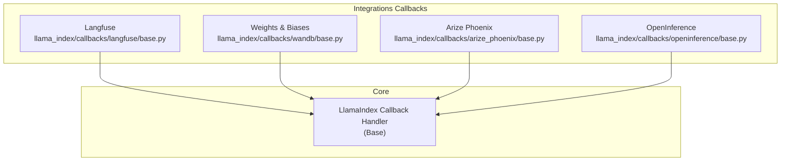
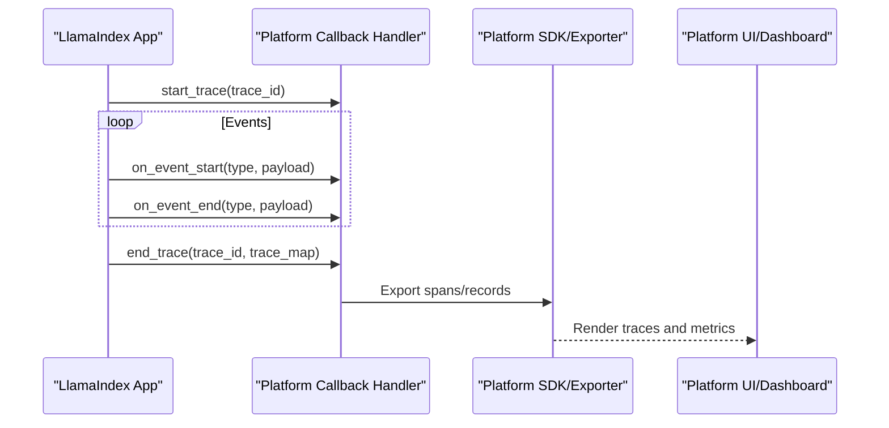
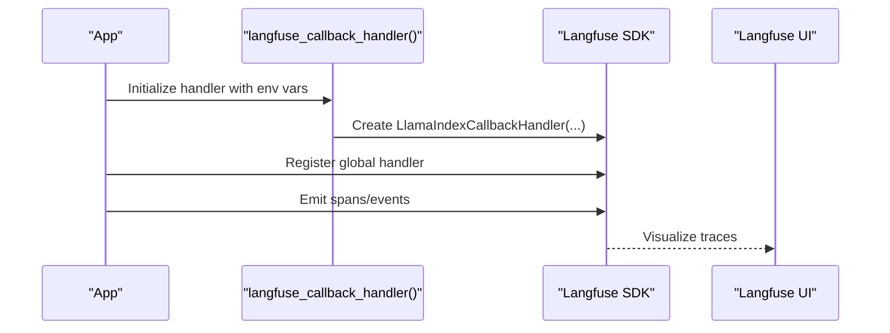
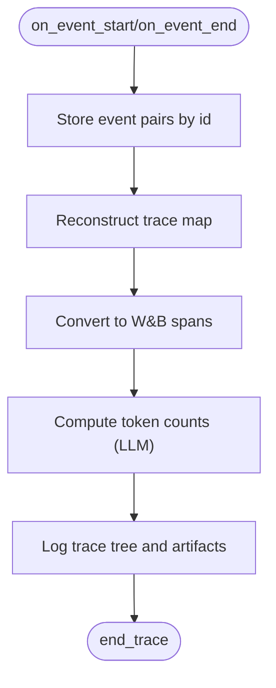
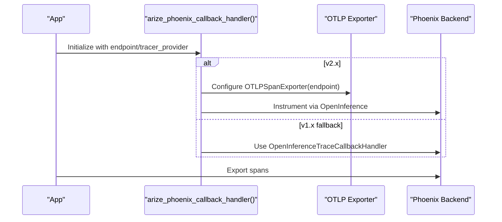
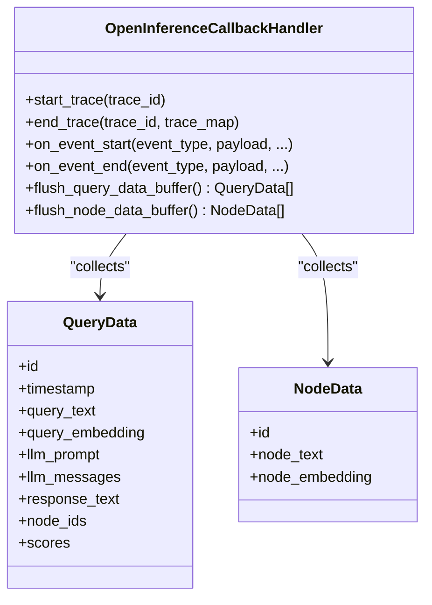
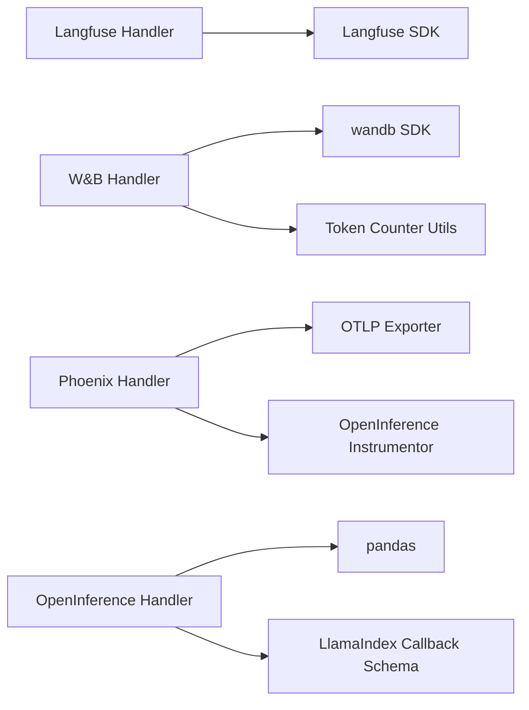

# Observability Platform Integrations

<cite>
**Referenced Files in This Document**
- [base.py](file://llama-index-integrations/callbacks/llama-index-callbacks-langfuse/llama_index/callbacks/langfuse/base.py)
- [README.md](file://llama-index-integrations/callbacks/llama-index-callbacks-langfuse/README.md)
- [base.py](file://llama-index-integrations/callbacks/llama-index-callbacks-wandb/llama_index/callbacks/wandb/base.py)
- [test_wandb_callback.py](file://llama-index-integrations/callbacks/llama-index-callbacks-wandb/tests/test_wandb_callback.py)
- [base.py](file://llama-index-integrations/callbacks/llama-index-callbacks-arize-phoenix/llama_index/callbacks/arize_phoenix/base.py)
- [base.py](file://llama-index-integrations/callbacks/llama-index-callbacks-openinference/llama_index/callbacks/openinference/base.py)
- [test_openinference_callback.py](file://llama-index-integrations/callbacks/llama-index-callbacks-openinference/tests/test_openinference_callback.py)
- [langfuse.md](file://docs/api_reference/api_reference/callbacks/langfuse.md)
- [wandb.md](file://docs/api_reference/api_reference/callbacks/wandb.md)
- [openinference.md](file://docs/api_reference/api_reference/callbacks/openinference.md)
</cite>

## Table of Contents
1. [Introduction](#introduction)
2. [Project Structure](#project-structure)
3. [Core Components](#core-components)
4. [Architecture Overview](#architecture-overview)
5. [Detailed Component Analysis](#detailed-component-analysis)
6. [Dependency Analysis](#dependency-analysis)
7. [Performance Considerations](#performance-considerations)
8. [Troubleshooting Guide](#troubleshooting-guide)
9. [Conclusion](#conclusion)
10. [Appendices](#appendices)

## Introduction
This document explains how to integrate LlamaIndex applications with multiple observability platforms, focusing on:
- Langfuse for LLM observability and tracing
- Weights & Biases (W&B) for experiment tracking and trace visualization
- Arize Phoenix for model performance monitoring and OpenTelemetry export
- OpenInference for standardized observability data capture

It covers platform-specific event mapping, data export formats, visualization capabilities, setup examples, configuration options, and data privacy considerations. It also provides guidance on building custom observability handlers and selecting the right platform for different use cases and deployment environments.

## Project Structure
The relevant integrations live under the callbacks directory of the integrations package. Each integration exposes a factory or handler that wraps LlamaIndex’s callback infrastructure to emit telemetry to the target platform.

**Diagram sources**
- [base.py](file://llama-index-integrations/callbacks/llama-index-callbacks-langfuse/llama_index/callbacks/langfuse/base.py#L1-L12)
- [base.py](file://llama-index-integrations/callbacks/llama-index-callbacks-wandb/llama_index/callbacks/wandb/base.py#L87-L177)
- [base.py](file://llama-index-integrations/callbacks/llama-index-callbacks-arize-phoenix/llama_index/callbacks/arize_phoenix/base.py#L6-L39)
- [base.py](file://llama-index-integrations/callbacks/llama-index-callbacks-openinference/llama_index/callbacks/openinference/base.py#L165-L194)

**Section sources**
- [base.py](file://llama-index-integrations/callbacks/llama-index-callbacks-langfuse/llama_index/callbacks/langfuse/base.py#L1-L12)
- [base.py](file://llama-index-integrations/callbacks/llama-index-callbacks-wandb/llama_index/callbacks/wandb/base.py#L87-L177)
- [base.py](file://llama-index-integrations/callbacks/llama-index-callbacks-arize-phoenix/llama_index/callbacks/arize_phoenix/base.py#L6-L39)
- [base.py](file://llama-index-integrations/callbacks/llama-index-callbacks-openinference/llama_index/callbacks/openinference/base.py#L165-L194)

## Core Components
- Langfuse integration: Provides a global handler factory that delegates to the Langfuse SDK’s LlamaIndex callback handler.
- Weights & Biases integration: Implements a dedicated callback handler that logs trace spans, token usage, and index artifacts to W&B runs.
- Arize Phoenix integration: Supports both legacy Phoenix callback and modern OpenInference instrumentation via OpenTelemetry exporters.
- OpenInference integration: Captures standardized inference data (queries, prompts, responses, retrieved nodes) and exposes it as structured records for downstream systems.

Key responsibilities:
- Event mapping: Translate LlamaIndex callback events into platform-specific spans or records.
- Data export: Serialize payloads and metadata into platform-native formats.
- Visualization: Enable dashboards and trace views in each platform UI.

**Section sources**
- [base.py](file://llama-index-integrations/callbacks/llama-index-callbacks-langfuse/llama_index/callbacks/langfuse/base.py#L8-L11)
- [base.py](file://llama-index-integrations/callbacks/llama-index-callbacks-wandb/llama_index/callbacks/wandb/base.py#L178-L242)
- [base.py](file://llama-index-integrations/callbacks/llama-index-callbacks-arize-phoenix/llama_index/callbacks/arize_phoenix/base.py#L6-L39)
- [base.py](file://llama-index-integrations/callbacks/llama-index-callbacks-openinference/llama_index/callbacks/openinference/base.py#L213-L277)

## Architecture Overview
The integrations plug into LlamaIndex’s callback system. Handlers receive start/end events, reconstruct spans, enrich payloads, and export telemetry to the target platform.

**Diagram sources**
- [base.py](file://llama-index-integrations/callbacks/llama-index-callbacks-wandb/llama_index/callbacks/wandb/base.py#L220-L242)
- [base.py](file://llama-index-integrations/callbacks/llama-index-callbacks-openinference/llama_index/callbacks/openinference/base.py#L195-L212)

## Detailed Component Analysis

### Langfuse Integration
- Purpose: Capture end-to-end LlamaIndex traces and metrics in Langfuse.
- Factory: A convenience function returns the Langfuse SDK’s LlamaIndex callback handler and sets a special integration flag.
- Environment configuration: Requires Langfuse credentials and host URL.
- Setup pattern: Use the global handler registration to enable tracing across the app.

**Diagram sources**
- [base.py](file://llama-index-integrations/callbacks/llama-index-callbacks-langfuse/llama_index/callbacks/langfuse/base.py#L8-L11)
- [README.md](file://llama-index-integrations/callbacks/llama-index-callbacks-langfuse/README.md#L10-L16)

**Section sources**
- [base.py](file://llama-index-integrations/callbacks/llama-index-callbacks-langfuse/llama_index/callbacks/langfuse/base.py#L8-L11)
- [README.md](file://llama-index-integrations/callbacks/llama-index-callbacks-langfuse/README.md#L1-L19)
- [langfuse.md](file://docs/api_reference/api_reference/callbacks/langfuse.md#L1-L4)

### Weights & Biases Integration
- Handler: WandbCallbackHandler extends the base callback handler and logs trace trees, token usage, and index artifacts to W&B.
- Event mapping:
  - LLM: Maps prompt and response, computes token counts, and attaches attributes to spans.
  - QUERY: Extracts query text and response.
  - NODE_PARSING: Summarizes document/node counts.
  - EMBEDDING: Reports number of chunks processed.
- Artifact persistence: Can persist indices and load them back via W&B artifacts.
- Run lifecycle: Ensures a W&B run is initialized and prints the run URL.

**Diagram sources**
- [base.py](file://llama-index-integrations/callbacks/llama-index-callbacks-wandb/llama_index/callbacks/wandb/base.py#L178-L242)
- [base.py](file://llama-index-integrations/callbacks/llama-index-callbacks-wandb/llama_index/callbacks/wandb/base.py#L457-L487)

**Section sources**
- [base.py](file://llama-index-integrations/callbacks/llama-index-callbacks-wandb/llama_index/callbacks/wandb/base.py#L87-L177)
- [base.py](file://llama-index-integrations/callbacks/llama-index-callbacks-wandb/llama_index/callbacks/wandb/base.py#L178-L242)
- [base.py](file://llama-index-integrations/callbacks/llama-index-callbacks-wandb/llama_index/callbacks/wandb/base.py#L266-L330)
- [base.py](file://llama-index-integrations/callbacks/llama-index-callbacks-wandb/llama_index/callbacks/wandb/base.py#L457-L487)
- [test_wandb_callback.py](file://llama-index-integrations/callbacks/llama-index-callbacks-wandb/tests/test_wandb_callback.py#L1-L8)
- [wandb.md](file://docs/api_reference/api_reference/callbacks/wandb.md#L1-L4)

### Arize Phoenix Integration
- Dual support:
  - Newer Phoenix (v2.x): Uses OpenInference instrumentation with OpenTelemetry exporter to send spans via OTLP HTTP.
  - Legacy Phoenix (v1.x): Uses a dedicated callback handler for trace collection.
- Configuration: Endpoint defaults to a local Phoenix server; supports passing a tracer provider and runtime separation options.

**Diagram sources**
- [base.py](file://llama-index-integrations/callbacks/llama-index-callbacks-arize-phoenix/llama_index/callbacks/arize_phoenix/base.py#L6-L39)

**Section sources**
- [base.py](file://llama-index-integrations/callbacks/llama-index-callbacks-arize-phoenix/llama_index/callbacks/arize_phoenix/base.py#L6-L39)

### OpenInference Integration
- Purpose: Standardized capture of inference data aligned with the OpenInference specification.
- Data model:
  - QueryData: Includes identifiers, timestamps, prompt/response, LLM messages, retrieved node IDs and scores, and embeddings.
  - NodeData: Retrieved node metadata.
  - TraceData: Aggregates per-query data and node lists.
- Event mapping:
  - QUERY: Captures query text.
  - LLM: Captures prompt, messages, and response (handling ChatResponse and completion).
  - RETRIEVE: Captures node hashes and scores.
  - EMBEDDING: Captures query embedding.
- Output: Exposes buffers for query and node data and can flush them for downstream processing.

**Diagram sources**
- [base.py](file://llama-index-integrations/callbacks/llama-index-callbacks-openinference/llama_index/callbacks/openinference/base.py#L165-L301)

**Section sources**
- [base.py](file://llama-index-integrations/callbacks/llama-index-callbacks-openinference/llama_index/callbacks/openinference/base.py#L51-L108)
- [base.py](file://llama-index-integrations/callbacks/llama-index-callbacks-openinference/llama_index/callbacks/openinference/base.py#L136-L142)
- [base.py](file://llama-index-integrations/callbacks/llama-index-callbacks-openinference/llama_index/callbacks/openinference/base.py#L213-L277)
- [test_openinference_callback.py](file://llama-index-integrations/callbacks/llama-index-callbacks-openinference/tests/test_openinference_callback.py#L1-L8)
- [openinference.md](file://docs/api_reference/api_reference/callbacks/openinference.md#L1-L4)

## Dependency Analysis
- Langfuse: Depends on the external Langfuse SDK’s LlamaIndex callback handler.
- Weights & Biases: Depends on the wandb SDK and uses trace_tree for span visualization; integrates with token counting utilities.
- Arize Phoenix: Depends on OpenInference instrumentation and OpenTelemetry exporters for v2.x; falls back to Phoenix v1.x callback handler.
- OpenInference: Depends on pandas for converting collected records to DataFrames and on LlamaIndex callback schema.

**Diagram sources**
- [base.py](file://llama-index-integrations/callbacks/llama-index-callbacks-langfuse/llama_index/callbacks/langfuse/base.py#L5-L11)
- [base.py](file://llama-index-integrations/callbacks/llama-index-callbacks-wandb/llama_index/callbacks/wandb/base.py#L18-L27)
- [base.py](file://llama-index-integrations/callbacks/llama-index-callbacks-arize-phoenix/llama_index/callbacks/arize_phoenix/base.py#L9-L27)
- [base.py](file://llama-index-integrations/callbacks/llama-index-callbacks-openinference/llama_index/callbacks/openinference/base.py#L122-L162)

**Section sources**
- [base.py](file://llama-index-integrations/callbacks/llama-index-callbacks-langfuse/llama_index/callbacks/langfuse/base.py#L5-L11)
- [base.py](file://llama-index-integrations/callbacks/llama-index-callbacks-wandb/llama_index/callbacks/wandb/base.py#L18-L27)
- [base.py](file://llama-index-integrations/callbacks/llama-index-callbacks-arize-phoenix/llama_index/callbacks/arize_phoenix/base.py#L9-L27)
- [base.py](file://llama-index-integrations/callbacks/llama-index-callbacks-openinference/llama_index/callbacks/openinference/base.py#L122-L162)

## Performance Considerations
- Event aggregation: Handlers batch events per trace and log at end_trace to minimize overhead.
- Payload trimming: Some handlers avoid logging large payloads (e.g., disabling full inputs/outputs in certain events) to reduce UI lag and bandwidth.
- Token counting: LLM token usage is computed efficiently and attached as span attributes.
- Artifact persistence: Index persistence and loading use temporary directories and cleanup to avoid disk bloat.

Recommendations:
- Disable verbose payload logging for high-throughput runs.
- Persist indices periodically and manage artifact retention policies.
- Use lightweight token counters and avoid repeated computations.

**Section sources**
- [base.py](file://llama-index-integrations/callbacks/llama-index-callbacks-wandb/llama_index/callbacks/wandb/base.py#L428-L455)
- [base.py](file://llama-index-integrations/callbacks/llama-index-callbacks-wandb/llama_index/callbacks/wandb/base.py#L476-L487)
- [base.py](file://llama-index-integrations/callbacks/llama-index-callbacks-wandb/llama_index/callbacks/wandb/base.py#L303-L305)

## Troubleshooting Guide
- Missing dependencies:
  - WandbCallbackHandler raises an import error if wandb is not installed.
  - Phoenix handler raises an import error if Phoenix is not installed.
  - OpenInference handler requires pandas for DataFrame conversion.
- Initialization:
  - WandbCallbackHandler ensures a run is initialized and prints the run URL when none exists.
  - Phoenix handler defaults to a local endpoint; verify connectivity if spans do not appear.
- Validation:
  - Tests confirm handlers inherit from the base callback handler, ensuring compatibility with LlamaIndex’s callback system.

Actions:
- Install required packages for the chosen platform.
- Verify environment variables and credentials.
- Confirm network access to the platform endpoint (Phoenix, Langfuse).
- Review logs for initialization and upload failures.

**Section sources**
- [base.py](file://llama-index-integrations/callbacks/llama-index-callbacks-wandb/llama_index/callbacks/wandb/base.py#L128-L132)
- [base.py](file://llama-index-integrations/callbacks/llama-index-callbacks-arize-phoenix/llama_index/callbacks/arize_phoenix/base.py#L33-L38)
- [base.py](file://llama-index-integrations/callbacks/llama-index-callbacks-openinference/llama_index/callbacks/openinference/base.py#L158-L162)
- [test_wandb_callback.py](file://llama-index-integrations/callbacks/llama-index-callbacks-wandb/tests/test_wandb_callback.py#L5-L8)
- [test_openinference_callback.py](file://llama-index-integrations/callbacks/llama-index-callbacks-openinference/tests/test_openinference_callback.py#L5-L8)

## Conclusion
These integrations enable robust observability across LlamaIndex applications:
- Langfuse offers seamless tracing and metrics for debugging and collaboration.
- W&B provides experiment tracking, trace trees, and artifact management for indices.
- Phoenix supports both legacy and modern instrumentation via OpenInference and OpenTelemetry.
- OpenInference standardizes data capture for interoperability with multiple observability backends.

Choose a platform based on your needs: Langfuse for LLM-centric tracing, W&B for ML experiment lifecycle, Phoenix for model performance monitoring, and OpenInference for portable, spec-aligned observability.

## Appendices

### Setup Examples and Configuration Options
- Langfuse
  - Use the global handler factory and configure environment variables for credentials and host.
  - Reference: [README.md](file://llama-index-integrations/callbacks/llama-index-callbacks-langfuse/README.md#L10-L16)
- Weights & Biases
  - Instantiate the WandbCallbackHandler with optional run arguments and tokenizer.
  - Reference: [base.py](file://llama-index-integrations/callbacks/llama-index-callbacks-wandb/llama_index/callbacks/wandb/base.py#L115-L177)
- Arize Phoenix
  - For v2.x, pass an endpoint and optional tracer provider; for v1.x, rely on the fallback callback handler.
  - Reference: [base.py](file://llama-index-integrations/callbacks/llama-index-callbacks-arize-phoenix/llama_index/callbacks/arize_phoenix/base.py#L6-L39)
- OpenInference
  - Initialize the handler and optionally provide a callback to process buffered query and node data.
  - Reference: [base.py](file://llama-index-integrations/callbacks/llama-index-callbacks-openinference/llama_index/callbacks/openinference/base.py#L176-L194)

### Platform-Specific Event Mapping and Data Export Formats
- Langfuse
  - Delegates to the Langfuse SDK’s LlamaIndex callback handler; refer to Langfuse documentation for export formats.
  - Reference: [base.py](file://llama-index-integrations/callbacks/llama-index-callbacks-langfuse/llama_index/callbacks/langfuse/base.py#L5-L11)
- Weights & Biases
  - Trace tree spans with mapped span kinds; token counts attached; artifacts exported for indices.
  - References: [base.py](file://llama-index-integrations/callbacks/llama-index-callbacks-wandb/llama_index/callbacks/wandb/base.py#L385-L417), [base.py](file://llama-index-integrations/callbacks/llama-index-callbacks-wandb/llama_index/callbacks/wandb/base.py#L457-L487), [base.py](file://llama-index-integrations/callbacks/llama-index-callbacks-wandb/llama_index/callbacks/wandb/base.py#L266-L330)
- Arize Phoenix
  - v2.x: OTLP HTTP exporter; v1.x: OpenInference trace callback handler.
  - Reference: [base.py](file://llama-index-integrations/callbacks/llama-index-callbacks-arize-phoenix/llama_index/callbacks/arize_phoenix/base.py#L9-L27)
- OpenInference
  - Structured records (QueryData, NodeData) with standardized column names; can be converted to pandas DataFrame.
  - Reference: [base.py](file://llama-index-integrations/callbacks/llama-index-callbacks-openinference/llama_index/callbacks/openinference/base.py#L51-L108), [base.py](file://llama-index-integrations/callbacks/llama-index-callbacks-openinference/llama_index/callbacks/openinference/base.py#L111-L134)

### Visualization Capabilities
- Langfuse: Traces and metrics in the Langfuse UI.
- Weights & Biases: Trace trees and artifacts in the W&B UI.
- Arize Phoenix: Model performance dashboards and traces via Phoenix UI.
- OpenInference: Standardized records suitable for downstream visualization and analytics.

### Data Privacy Considerations
- Tokenize sensitive prompts/responses before logging when required by policy.
- Limit payload logging for high-volume runs to reduce risk exposure.
- Use private endpoints and secure credentials for platform exports.
- Retain artifacts and traces according to compliance requirements.

### Custom Observability Handler Development
- Extend the base callback handler and override lifecycle methods:
  - start_trace, end_trace, on_event_start, on_event_end.
- Map LlamaIndex event types to your platform’s span or record model.
- Attach metadata and compute derived metrics (e.g., tokens) during event processing.
- Export to your backend and provide a way to flush or persist buffered data.

**Section sources**
- [base.py](file://llama-index-integrations/callbacks/llama-index-callbacks-openinference/llama_index/callbacks/openinference/base.py#L195-L212)
- [base.py](file://llama-index-integrations/callbacks/llama-index-callbacks-wandb/llama_index/callbacks/wandb/base.py#L178-L242)