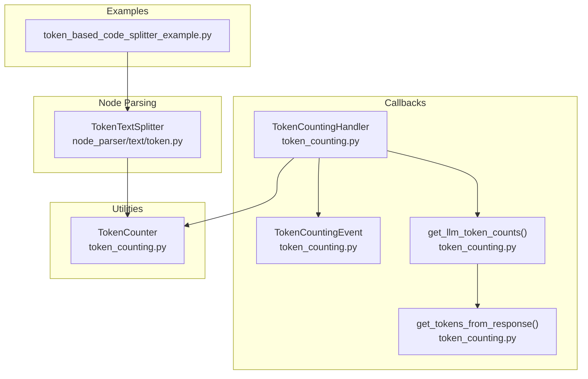
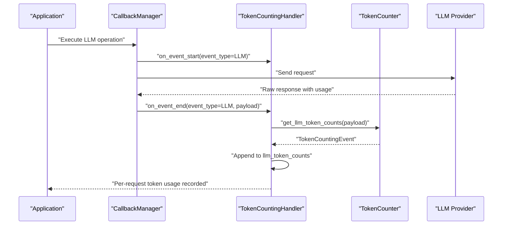
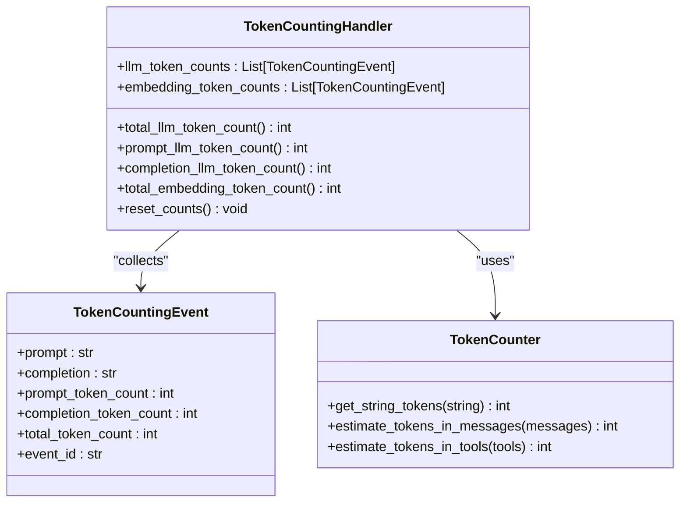
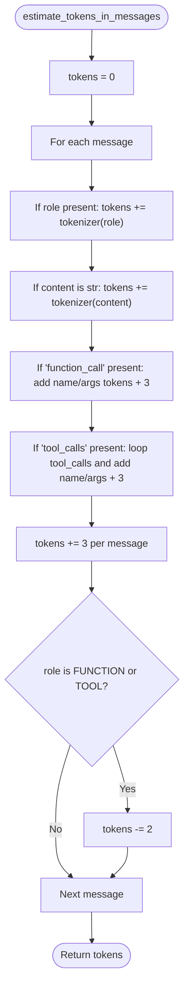
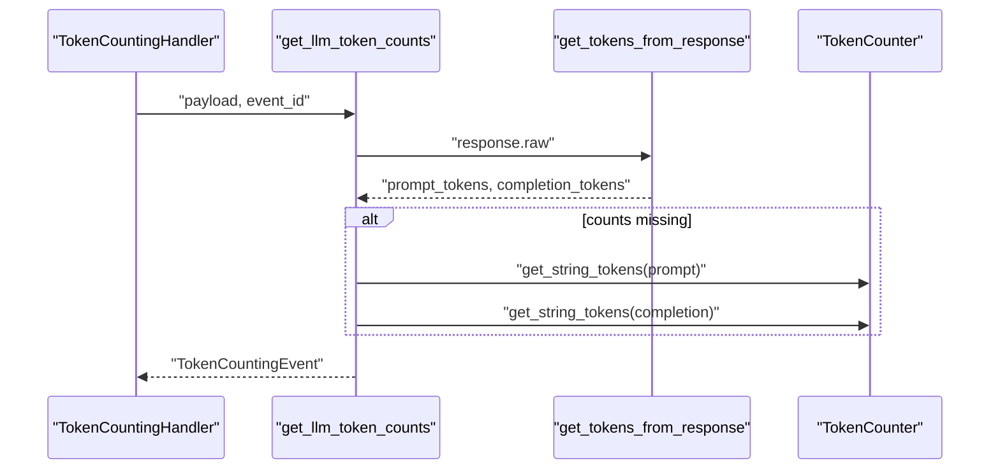
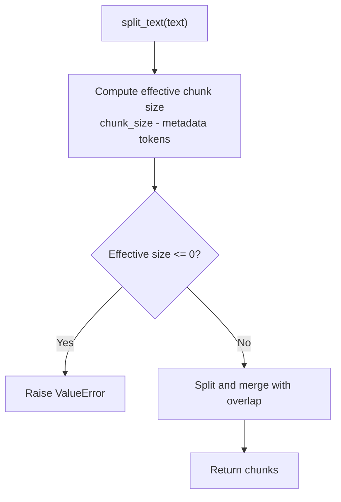
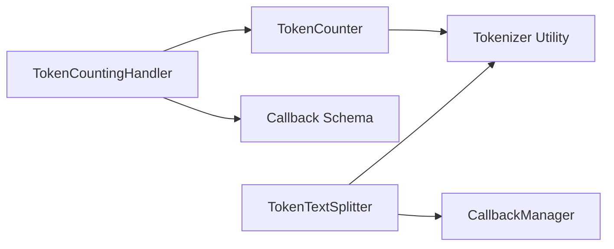

# Token Counting and Cost Monitoring

<cite>
**Referenced Files in This Document**
- [token_counting.py](file://llama-index-core/llama_index/core/callbacks/token_counting.py)
- [token_counting.py](file://llama-index-core/llama_index/core/utilities/token_counting.py)
- [__init__.py](file://llama-index-core/llama_index/core/callbacks/__init__.py)
- [test_token_counter.py](file://llama-index-core/tests/callbacks/test_token_counter.py)
- [token.py](file://llama-index-core/llama_index/core/node_parser/text/token.py)
- [token_based_code_splitter_example.py](file://examples/token_based_code_splitter_example.py)
</cite>

## Table of Contents
1. [Introduction](#introduction)
2. [Project Structure](#project-structure)
3. [Core Components](#core-components)
4. [Architecture Overview](#architecture-overview)
5. [Detailed Component Analysis](#detailed-component-analysis)
6. [Dependency Analysis](#dependency-analysis)
7. [Performance Considerations](#performance-considerations)
8. [Troubleshooting Guide](#troubleshooting-guide)
9. [Conclusion](#conclusion)
10. [Appendices](#appendices)

## Introduction
This document explains the token counting and cost monitoring capabilities in the repository, focusing on:
- The TokenCountingHandler class and its integration with the callback system
- Token calculation algorithms implemented by TokenCounter
- How per-request token usage is tracked for LLM and embedding operations
- Practical examples of tracking input/output tokens, session totals, and per-request costs
- Custom token counting strategies, provider-specific optimizations, and batch processing considerations
- Guidance on budget management, cost alerts, and reporting mechanisms

It is designed to be accessible to users with limited technical knowledge while providing deep insights for advanced users.

## Project Structure
The token counting and cost monitoring features are primarily implemented in the core callbacks and utilities modules, with supporting integrations in node parsing and examples.

**Diagram sources**
- [token_counting.py](file://llama-index-core/llama_index/core/callbacks/token_counting.py#L26-L141)
- [token_counting.py](file://llama-index-core/llama_index/core/utilities/token_counting.py#L10-L104)
- [token.py](file://llama-index-core/llama_index/core/node_parser/text/token.py#L22-L242)
- [token_based_code_splitter_example.py](file://examples/token_based_code_splitter_example.py#L1-L264)

**Section sources**
- [token_counting.py](file://llama-index-core/llama_index/core/callbacks/token_counting.py#L1-L270)
- [token_counting.py](file://llama-index-core/llama_index/core/utilities/token_counting.py#L1-L104)
- [token.py](file://llama-index-core/llama_index/core/node_parser/text/token.py#L1-L242)
- [token_based_code_splitter_example.py](file://examples/token_based_code_splitter_example.py#L1-L264)

## Core Components
- TokenCountingHandler: A callback handler that listens to LLM and EMBEDDING events, computes token counts, and maintains running totals.
- TokenCounter: Provides token counting primitives for strings and OpenAI-style message lists, including estimates for roles, function/tool calls, and tools.
- TokenCountingEvent: A dataclass capturing prompt tokens, completion tokens, and total tokens for a single event.
- get_tokens_from_response: Extracts token counts from provider raw responses.
- get_llm_token_counts: Computes token counts for LLM requests and responses, falling back to tokenizer-based estimates when provider-provided counts are unavailable.
- TokenTextSplitter: A text splitter that operates on token budgets, integrating with the same tokenizer used by TokenCounter.

Key responsibilities:
- Track per-request token usage for LLM prompts and completions
- Aggregate embedding token usage across chunks
- Provide properties for total, prompt-only, and completion-only token totals
- Support custom tokenizers for specialized counting strategies

**Section sources**
- [token_counting.py](file://llama-index-core/llama_index/core/callbacks/token_counting.py#L26-L141)
- [token_counting.py](file://llama-index-core/llama_index/core/callbacks/token_counting.py#L143-L270)
- [token_counting.py](file://llama-index-core/llama_index/core/utilities/token_counting.py#L10-L104)
- [token.py](file://llama-index-core/llama_index/core/node_parser/text/token.py#L22-L242)

## Architecture Overview
The token counting pipeline integrates with the callback system to capture LLM and embedding events, compute token usage, and maintain session totals.

**Diagram sources**
- [token_counting.py](file://llama-index-core/llama_index/core/callbacks/token_counting.py#L143-L245)
- [token_counting.py](file://llama-index-core/llama_index/core/utilities/token_counting.py#L10-L104)

## Detailed Component Analysis

### TokenCountingHandler
TokenCountingHandler is the primary integration point for token counting. It:
- Subscribes to LLM and EMBEDDING events
- Computes token counts per event using TokenCounter
- Maintains lists of TokenCountingEvent instances
- Exposes properties for total, prompt-only, and completion-only token totals
- Supports verbose logging and custom tokenizers

Behavior highlights:
- For LLM events, it extracts usage from provider responses when available; otherwise, it falls back to tokenizer-based estimates
- For EMBEDDING events, it iterates over chunks and accumulates token totals
- Provides reset_counts to clear session totals

**Diagram sources**
- [token_counting.py](file://llama-index-core/llama_index/core/callbacks/token_counting.py#L26-L141)
- [token_counting.py](file://llama-index-core/llama_index/core/callbacks/token_counting.py#L143-L270)
- [token_counting.py](file://llama-index-core/llama_index/core/utilities/token_counting.py#L10-L104)

**Section sources**
- [token_counting.py](file://llama-index-core/llama_index/core/callbacks/token_counting.py#L143-L270)

### TokenCounter
TokenCounter implements the core token counting algorithms:
- get_string_tokens: Counts tokens in a string using the provided tokenizer
- estimate_tokens_in_messages: Estimates tokens for a list of messages, accounting for role tokens, function/tool calls, and per-message overhead
- estimate_tokens_in_tools: Estimates tokens for tool definitions

Provider-specific optimizations:
- Handles function_call and tool_calls fields commonly returned by OpenAI-compatible APIs
- Adds per-message overhead and subtracts tokens for function/tool roles to align with typical API tokenization behavior

**Diagram sources**
- [token_counting.py](file://llama-index-core/llama_index/core/utilities/token_counting.py#L35-L85)

**Section sources**
- [token_counting.py](file://llama-index-core/llama_index/core/utilities/token_counting.py#L10-L104)

### get_tokens_from_response and get_llm_token_counts
These functions implement provider-agnostic extraction of token counts from raw LLM responses:
- get_tokens_from_response: Scans for common keys across providers to extract prompt and completion token counts
- get_llm_token_counts: Computes counts for both PROMPT and MESSAGES payloads, falling back to TokenCounter when provider counts are missing

**Diagram sources**
- [token_counting.py](file://llama-index-core/llama_index/core/callbacks/token_counting.py#L39-L141)

**Section sources**
- [token_counting.py](file://llama-index-core/llama_index/core/callbacks/token_counting.py#L39-L141)

### TokenTextSplitter and Token-Based Chunking
TokenTextSplitter demonstrates token-aware chunking:
- Uses the same tokenizer as TokenCounter
- Splits text into chunks respecting token budgets
- Reserves space for metadata formatting and warns when chunk sizes become small

**Diagram sources**
- [token.py](file://llama-index-core/llama_index/core/node_parser/text/token.py#L117-L157)

**Section sources**
- [token.py](file://llama-index-core/llama_index/core/node_parser/text/token.py#L22-L242)

### Examples and Usage Patterns
- Token-based code splitting: Demonstrates token-based chunking with custom tokenizers and comparison to character-based splitting
- Token-aware text splitting: Shows how TokenTextSplitter reserves metadata tokens and manages overlaps

**Section sources**
- [token_based_code_splitter_example.py](file://examples/token_based_code_splitter_example.py#L1-L264)
- [token.py](file://llama-index-core/llama_index/core/node_parser/text/token.py#L22-L242)

## Dependency Analysis
TokenCountingHandler depends on TokenCounter and the callback schema. TokenCounter depends on a tokenizer function. TokenTextSplitter also depends on a tokenizer and integrates with the callback manager.

**Diagram sources**
- [token_counting.py](file://llama-index-core/llama_index/core/callbacks/token_counting.py#L14-L23)
- [token_counting.py](file://llama-index-core/llama_index/core/utilities/token_counting.py#L19-L20)
- [token.py](file://llama-index-core/llama_index/core/node_parser/text/token.py#L14-L16)

**Section sources**
- [__init__.py](file://llama-index-core/llama_index/core/callbacks/__init__.py#L1-L18)
- [token_counting.py](file://llama-index-core/llama_index/core/callbacks/token_counting.py#L14-L23)
- [token_counting.py](file://llama-index-core/llama_index/core/utilities/token_counting.py#L19-L20)
- [token.py](file://llama-index-core/llama_index/core/node_parser/text/token.py#L14-L16)

## Performance Considerations
- Tokenization cost: TokenCounter’s get_string_tokens is O(n) in the number of tokens; estimate_tokens_in_messages scales linearly with the number of messages and fields
- Provider fallback: When provider usage is missing, TokenCountingHandler falls back to tokenizer-based estimates; this ensures correctness but adds computational overhead
- Batch processing: For embeddings, TokenCountingHandler iterates over chunks; consider batching at the embedding provider level to reduce overhead
- Overlap and merging: TokenTextSplitter merges splits with overlap; tune chunk_size and chunk_overlap to balance precision and performance

[No sources needed since this section provides general guidance]

## Troubleshooting Guide
Common issues and resolutions:
- Missing provider usage fields: get_tokens_from_response handles multiple key variants; if still missing, TokenCountingHandler falls back to TokenCounter
- Unexpected zero counts: Verify tokenizer availability and payload contents; ensure payloads include PROMPT/COMPLETION or MESSAGES/RESPONSE
- Embedding token mismatch: Confirm chunk iteration and total aggregation; check that each chunk is tokenized consistently
- Validation errors in TokenTextSplitter: Ensure chunk_overlap does not exceed chunk_size; adjust metadata length or chunk size if metadata dominates

**Section sources**
- [token_counting.py](file://llama-index-core/llama_index/core/callbacks/token_counting.py#L39-L141)
- [token_counting.py](file://llama-index-core/llama_index/core/utilities/token_counting.py#L10-L104)
- [token.py](file://llama-index-core/llama_index/core/node_parser/text/token.py#L64-L68)
- [test_token_counter.py](file://llama-index-core/tests/callbacks/test_token_counter.py#L1-L51)

## Conclusion
The token counting and cost monitoring stack provides robust, provider-agnostic token tracking for LLM and embedding operations. TokenCountingHandler integrates seamlessly with the callback system, while TokenCounter offers accurate estimates for messages and tools. Together with token-aware splitters and practical examples, developers can monitor usage, manage budgets, and optimize performance across diverse LLM providers and workflows.

[No sources needed since this section summarizes without analyzing specific files]

## Appendices

### Tracking Inputs/Outputs, Session Totals, and Per-Request Costs
- Per-request tracking: Use TokenCountingHandler to capture TokenCountingEvent instances for each LLM/EMBEDDING event
- Session totals: Access total_llm_token_count, prompt_llm_token_count, completion_llm_token_count, and total_embedding_token_count
- Resetting: Call reset_counts to clear session totals between runs
- Cost estimation: Multiply token totals by provider pricing per token; integrate with external budgeting systems to enforce limits and send alerts

**Section sources**
- [token_counting.py](file://llama-index-core/llama_index/core/callbacks/token_counting.py#L246-L270)

### Custom Token Counting Strategies and Provider Optimizations
- Custom tokenizer: Pass a tokenizer function to TokenCountingHandler and TokenCounter for domain-specific tokenization
- Provider-specific optimizations: TokenCounter accounts for function/tool calls and per-message overhead; adjust estimates if your provider uses different conventions
- Batch processing: For embeddings, iterate over chunks and aggregate totals; consider provider-side batching to reduce overhead

**Section sources**
- [token_counting.py](file://llama-index-core/llama_index/core/utilities/token_counting.py#L35-L85)
- [token_counting.py](file://llama-index-core/llama_index/core/callbacks/token_counting.py#L156-L168)

### Budget Management, Alerts, and Reporting
- Budget management: Maintain a budget threshold and compare against total_llm_token_count and total_embedding_token_count
- Alerts: Emit warnings or notifications when approaching thresholds; integrate with external alerting systems
- Reporting: Export session totals and per-event logs for cost allocation and auditing

[No sources needed since this section provides general guidance]