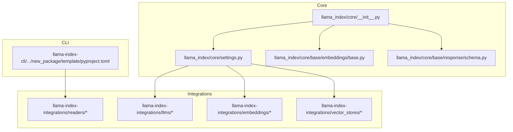
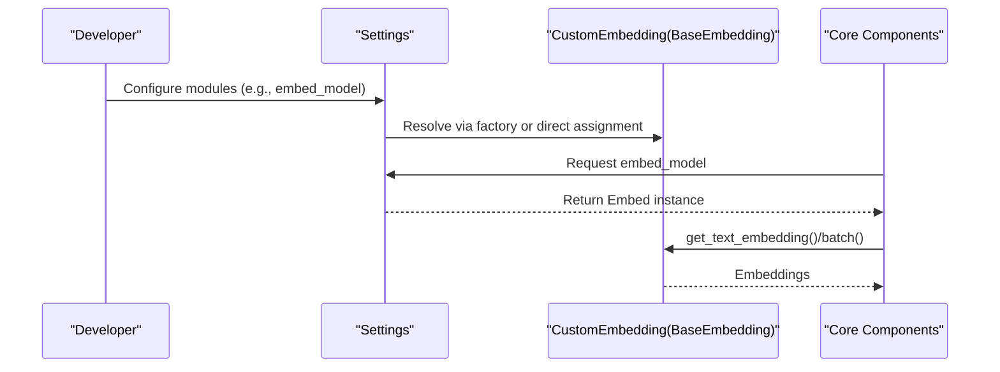
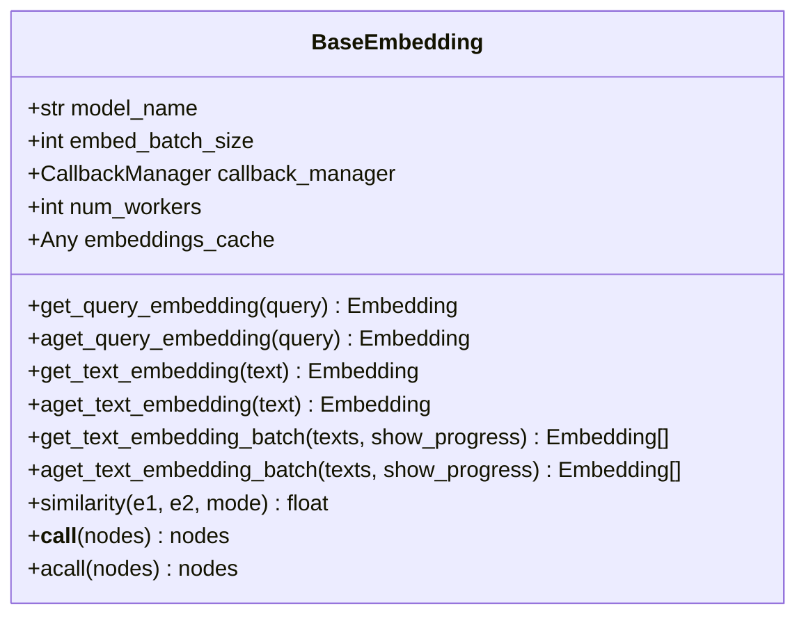
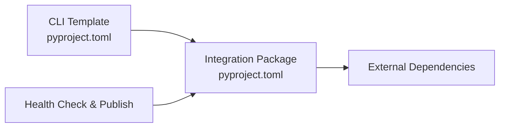
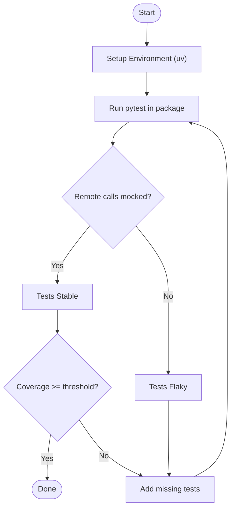
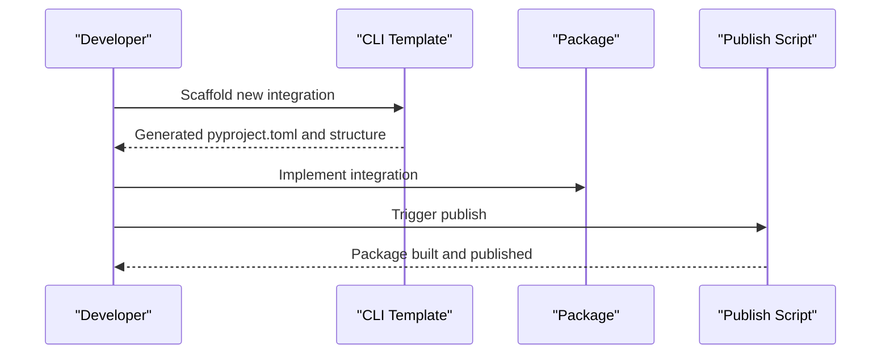

# Custom Integration Development

<cite>
**Referenced Files in This Document**
- [llama_index\core\__init__.py](file://llama-index-core/llama_index/core/__init__.py)
- [CONTRIBUTING.md](file://CONTRIBUTING.md)
- [llama-index-core\llama_index\core\base\embeddings\base.py](file://llama-index-core/llama_index/core/base/embeddings/base.py)
- [llama-index-core\llama_index\core\settings.py](file://llama-index-core/llama_index/core/settings.py)
- [llama-index-core\llama_index\core\service_context.py](file://llama-index-core/llama_index/core/service_context.py)
- [llama-index-core\llama_index\core\base\response\schema.py](file://llama-index-core/llama_index/core/base/response/schema.py)
- [llama-index-integrations\README.md](file://llama-index-integrations/README.md)
- [scripts\integration_health_check.py](file://scripts/integration_health_check.py)
- [scripts\publish_packages.sh](file://scripts/publish_packages.sh)
- [llama-index-cli\pyproject.toml](file://llama-index-cli/pyproject.toml)
- [llama-index-cli\llama_index\cli\new_package\template\pyproject.toml](file://llama-index-cli/llama_index/cli/new_package/template/pyproject.toml)
</cite>

## Table of Contents
1. [Introduction](#introduction)
2. [Project Structure](#project-structure)
3. [Core Components](#core-components)
4. [Architecture Overview](#architecture-overview)
5. [Detailed Component Analysis](#detailed-component-analysis)
6. [Dependency Analysis](#dependency-analysis)
7. [Performance Considerations](#performance-considerations)
8. [Testing Strategies](#testing-strategies)
9. [Packaging and Distribution](#packaging-and-distribution)
10. [Maintaining Backward Compatibility](#maintaining-backward-compatibility)
11. [Troubleshooting Guide](#troubleshooting-guide)
12. [Conclusion](#conclusion)
13. [Appendices](#appendices)

## Introduction
This document explains how to develop custom integrations and extend LlamaIndex functionality. It focuses on the base interfaces, plugin architecture, and extension patterns for:
- Custom LLM providers
- Custom embedding models
- Data connectors (readers/loaders)
- Vector stores

It also covers configuration, dependency management, compatibility, testing, packaging, distribution, and contribution guidelines.

## Project Structure
LlamaIndex is a monorepo with:
- Core framework under llama-index-core
- Official integrations under llama-index-integrations
- CLI scaffolding and templates under llama-index-cli
- Scripts for health checks and publishing under scripts

Key areas for integration development:
- Core abstractions and configuration live in llama-index-core
- Integrations are organized by domain (llms, embeddings, readers, vector_stores, etc.) under llama-index-integrations
- CLI provides a template to scaffold new integration packages

**Diagram sources**
- [llama_index\core\__init__.py](file://llama-index-core/llama_index/core/__init__.py#L1-L162)
- [llama-index-core\llama_index\core\settings.py](file://llama-index-core/llama_index/core/settings.py#L1-L249)
- [llama-index-core\llama_index\core\base\embeddings\base.py](file://llama-index-core/llama_index/core/base/embeddings/base.py#L1-L619)
- [llama-index-core\llama_index\core\base\response\schema.py](file://llama-index-core/llama_index/core/base/response/schema.py#L1-L242)
- [llama-index-integrations\README.md](file://llama-index-integrations/README.md)
- [llama-index-cli\llama_index\cli\new_package\template\pyproject.toml](file://llama-index-cli/llama_index/cli/new_package/template/pyproject.toml)

**Section sources**
- [llama-index-core\llama_index\core\__init__.py](file://llama-index-core/llama_index/core/__init__.py#L1-L162)
- [CONTRIBUTING.md](file://CONTRIBUTING.md#L195-L231)

## Core Components
- Settings: Centralized configuration container that lazily resolves LLMs, embeddings, tokenizers, node parsers, and prompt helpers. It supports injection of modules and callback managers.
- BaseEmbedding: Abstract base class for embedding models with synchronous/asynchronous APIs, batching, caching, and similarity utilities.
- Response schema: Standardized response types for streaming and non-streaming outputs, including source nodes and metadata.

These components define the extension surface for custom integrations.

**Section sources**
- [llama-index-core\llama_index\core\settings.py](file://llama-index-core/llama_index/core/settings.py#L1-L249)
- [llama-index-core\llama_index\core\base\embeddings\base.py](file://llama-index-core/llama_index/core/base/embeddings/base.py#L72-L619)
- [llama-index-core\llama_index\core\base\response\schema.py](file://llama-index-core/llama_index/core/base/response/schema.py#L14-L242)

## Architecture Overview
The integration architecture follows a layered pattern:
- Configuration layer: Settings resolves and injects modules (LLM, embeddings, node parser, tokenizer).
- Extension layer: Implementations of base interfaces (e.g., BaseEmbedding) plug into Settings.
- Consumption layer: Core components (indices, query engines, retrievers) consume configured modules.

**Diagram sources**
- [llama-index-core\llama_index\core\settings.py](file://llama-index-core/llama_index/core/settings.py#L32-L74)
- [llama-index-core\llama_index\core\base\embeddings\base.py](file://llama-index-core/llama_index/core/base/embeddings/base.py#L112-L179)

## Detailed Component Analysis

### Custom Embedding Models
Implementations should inherit from the BaseEmbedding abstract class and provide:
- Synchronous and asynchronous text/query embedding methods
- Optional batch and caching support
- Consistent metadata handling and similarity utilities

**Diagram sources**
- [llama-index-core\llama_index\core\base\embeddings\base.py](file://llama-index-core/llama_index/core/base/embeddings/base.py#L72-L619)

Implementation checklist:
- Implement required abstract methods for synchronous and asynchronous text/query embeddings
- Support batching via embed_batch_size and optional caching via embeddings_cache
- Respect callback_manager for instrumentation and progress reporting
- Integrate with Settings.embed_model to enable seamless consumption

**Section sources**
- [llama-index-core\llama_index\core\base\embeddings\base.py](file://llama-index-core/llama_index/core/base/embeddings/base.py#L112-L179)
- [llama-index-core\llama_index\core\settings.py](file://llama-index-core/llama_index/core/settings.py#L60-L74)

### Custom LLM Providers
Guidance for extending LLMs:
- Follow the LLM interface contract used by Settings.resolve_llm
- Ensure streaming and non-streaming responses are compatible with Response schema
- Provide proper callback and instrumentation support

Note: The LLM interface is resolved via Settings and is consumed by core components. Implementations should align with the expected method signatures and response types.

**Section sources**
- [llama-index-core\llama_index\core\settings.py](file://llama-index-core/llama_index/core/settings.py#L9-L10)
- [llama-index-core\llama_index\core\base\response\schema.py](file://llama-index-core/llama_index/core/base/response/schema.py#L14-L242)

### Data Connectors (Readers/Loaders)
Guidance for building readers/loaders:
- Implement load_data and/or lazy_load_data returning Document objects
- Follow the documented reader interface patterns

Examples and patterns are described in the contribution guide.

**Section sources**
- [CONTRIBUTING.md](file://CONTRIBUTING.md#L118-L129)

### Vector Stores
Guidance for vector store integrations:
- Implement CRUD and retrieval operations consistent with the vector store interface
- Ensure compatibility with index structures and similarity search semantics

Examples and patterns are described in the contribution guide.

**Section sources**
- [CONTRIBUTING.md](file://CONTRIBUTING.md#L152-L162)

## Dependency Analysis
Integration dependencies are managed through:
- pyproject.toml in each integration package
- CLI templates for scaffolding new packages
- Health check and publish scripts for CI/CD

**Diagram sources**
- [llama-index-cli\pyproject.toml](file://llama-index-cli/pyproject.toml)
- [llama-index-cli\llama_index\cli\new_package\template\pyproject.toml](file://llama-index-cli/llama_index/cli/new_package/template/pyproject.toml)
- [scripts\integration_health_check.py](file://scripts/integration_health_check.py)
- [scripts\publish_packages.sh](file://scripts/publish_packages.sh)

**Section sources**
- [llama-index-integrations\README.md](file://llama-index-integrations/README.md)
- [llama-index-cli\llama_index\cli\new_package\template\pyproject.toml](file://llama-index-cli/llama_index/cli/new_package/template/pyproject.toml)

## Performance Considerations
- Batch embeddings: Use embed_batch_size to reduce overhead
- Asynchronous execution: Leverage num_workers and async APIs for throughput
- Caching: Enable embeddings_cache to avoid recomputation
- Progress reporting: Use show_progress in batch operations for visibility

**Section sources**
- [llama-index-core\llama_index\core\base\embeddings\base.py](file://llama-index-core/llama_index/core/base/embeddings/base.py#L80-L98)
- [llama-index-core\llama_index\core\base\embeddings\base.py](file://llama-index-core/llama_index/core/base/embeddings/base.py#L446-L494)
- [llama-index-core\llama_index\core\base\embeddings\base.py](file://llama-index-core/llama_index/core/base/embeddings/base.py#L497-L585)

## Testing Strategies
- Unit tests per package using pytest
- Mock remote systems to avoid flaky tests
- Coverage targets enforced by CI
- Integration health checks for published packages

**Diagram sources**
- [CONTRIBUTING.md](file://CONTRIBUTING.md#L204-L214)
- [scripts\integration_health_check.py](file://scripts/integration_health_check.py)

**Section sources**
- [CONTRIBUTING.md](file://CONTRIBUTING.md#L204-L214)

## Packaging and Distribution
- Use CLI templates to scaffold new integration packages
- Define dependencies and entry points in pyproject.toml
- Publish via scripts and CI pipelines

**Diagram sources**
- [llama-index-cli\pyproject.toml](file://llama-index-cli/pyproject.toml)
- [llama-index-cli\llama_index\cli\new_package\template\pyproject.toml](file://llama-index-cli/llama_index/cli/new_package/template/pyproject.toml)
- [scripts\publish_packages.sh](file://scripts/publish_packages.sh)

**Section sources**
- [llama-index-integrations\README.md](file://llama-index-integrations/README.md)

## Maintaining Backward Compatibility
- Follow established base interfaces and Settings patterns
- Avoid breaking changes to public APIs
- Provide migration guidance when changes are necessary
- Use deprecation warnings for removed features

**Section sources**
- [llama-index-core\llama_index\core\service_context.py](file://llama-index-core/llama_index/core/service_context.py#L4-L19)

## Troubleshooting Guide
Common issues and resolutions:
- Deprecated ServiceContext usage: Migrate to Settings
- Missing or incompatible dependencies: Verify pyproject.toml and install with uv
- Remote system failures: Mock external calls in tests
- Performance bottlenecks: Tune embed_batch_size, enable caching, and use async APIs

**Section sources**
- [llama-index-core\llama_index\core\service_context.py](file://llama-index-core/llama_index/core/service_context.py#L4-L19)
- [CONTRIBUTING.md](file://CONTRIBUTING.md#L204-L214)

## Conclusion
To build robust custom integrations:
- Implement base interfaces consistently
- Configure via Settings for seamless consumption
- Test thoroughly with mocks and coverage
- Package and distribute using CLI templates and scripts
- Prioritize backward compatibility and clear migration paths

## Appendices
- Contribution workflow and examples are documented in the contribution guide
- Integration README provides an overview of available integrations

**Section sources**
- [CONTRIBUTING.md](file://CONTRIBUTING.md#L172-L191)
- [llama-index-integrations\README.md](file://llama-index-integrations/README.md)