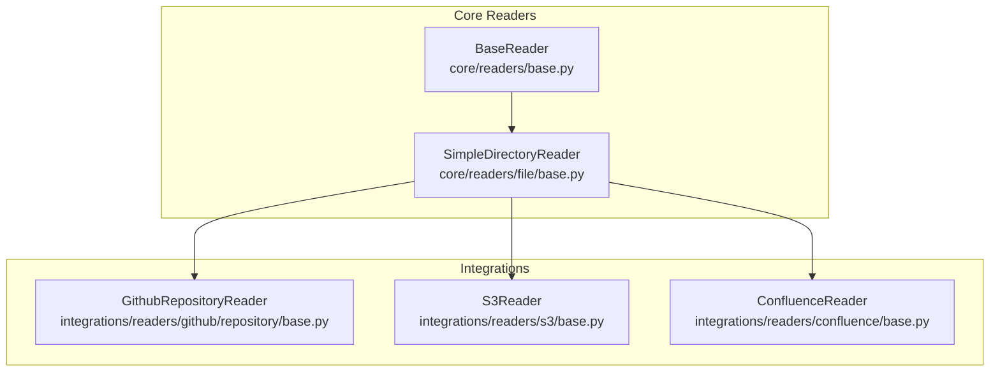
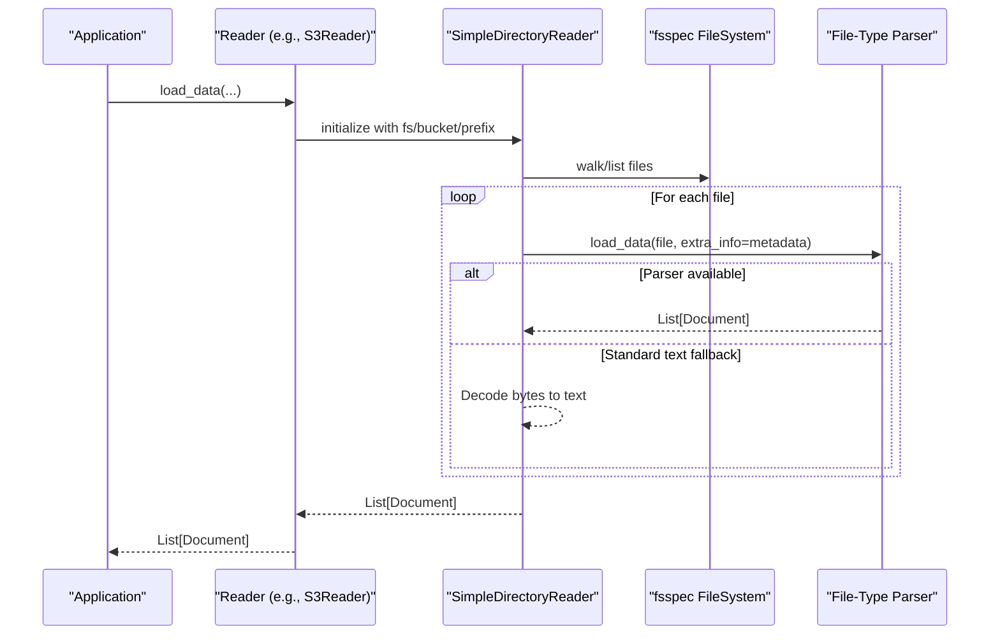
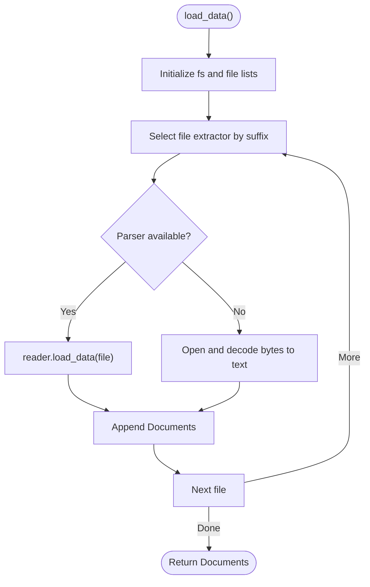
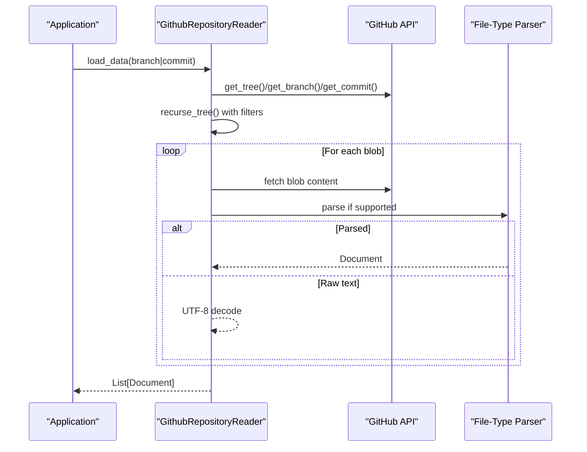
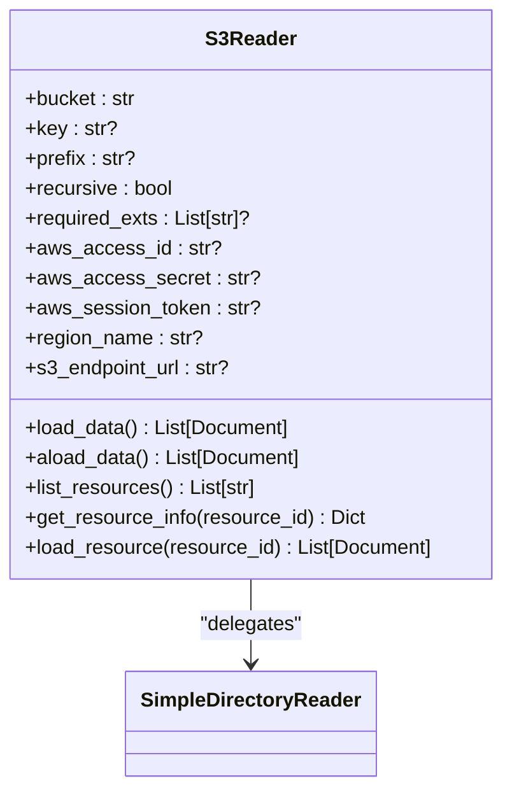
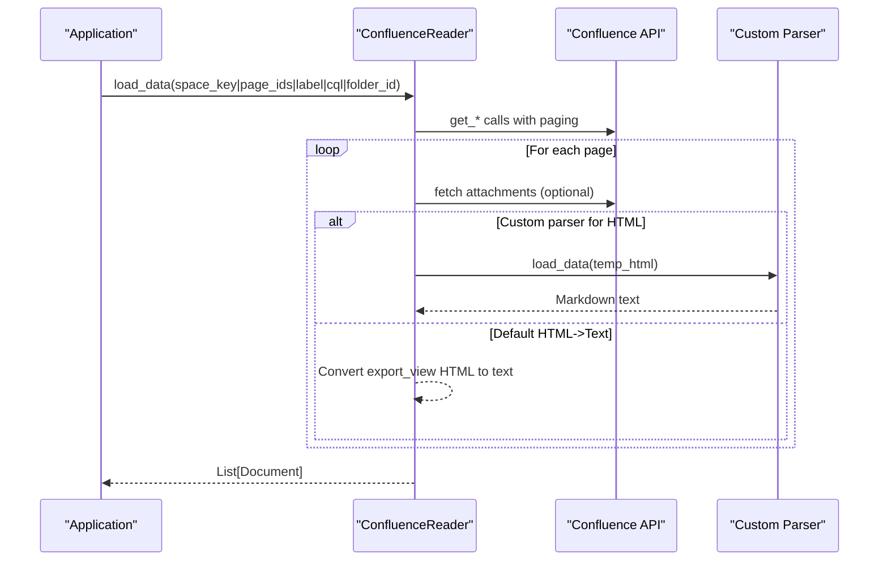
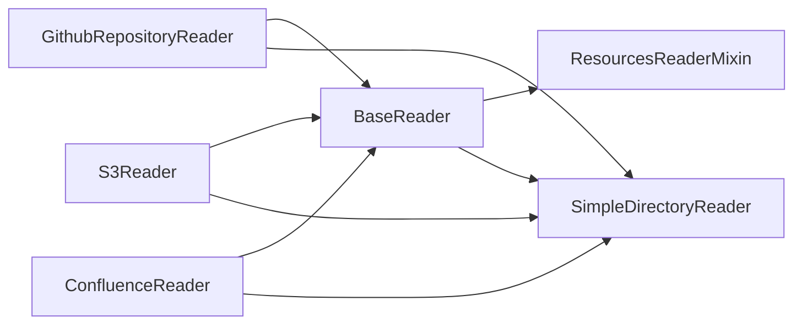

# Data Connector Integrations

<cite>
**Referenced Files in This Document**
- [base.py](file://llama-index-core/llama_index/core/readers/base.py)
- [base.py](file://llama-index-core/llama_index/core/readers/file/base.py)
- [base.py](file://llama-index-integrations/readers/llama-index-readers-github/llama_index/readers/github/repository/base.py)
- [base.py](file://llama-index-integrations/readers/llama-index-readers-s3/llama_index/readers/s3/base.py)
- [base.py](file://llama-index-integrations/readers/llama-index-readers-confluence/llama_index/readers/confluence/base.py)
</cite>

## Table of Contents
1. [Introduction](#introduction)
2. [Project Structure](#project-structure)
3. [Core Components](#core-components)
4. [Architecture Overview](#architecture-overview)
5. [Detailed Component Analysis](#detailed-component-analysis)
6. [Dependency Analysis](#dependency-analysis)
7. [Performance Considerations](#performance-considerations)
8. [Troubleshooting Guide](#troubleshooting-guide)
9. [Conclusion](#conclusion)
10. [Appendices](#appendices)

## Introduction
This document describes the data connector integrations across file system readers, database connectors, web scrapers, and API integrations in the LlamaIndex ecosystem. It focuses on the Reader interface, connector-specific implementations, and data transformation patterns. It also provides complete API specifications for GitHub repositories, S3 buckets, Google Docs, Confluence, databases, web APIs, and other supported connectors. Topics include authentication methods, pagination handling, incremental updates, data filtering, examples of implementing custom readers, handling different file formats, and optimizing data ingestion pipelines with error handling and retry strategies.

## Project Structure
The data ingestion pipeline centers on a unified Reader interface and a set of specialized readers for different sources. The core Reader abstractions live under the core package, while integrations for external systems live under the integrations package. The file system reader leverages a generic directory loader with pluggable file-type parsers.

**Diagram sources**
- [base.py](file://llama-index-core/llama_index/core/readers/base.py#L19-L50)
- [base.py](file://llama-index-core/llama_index/core/readers/file/base.py#L208-L246)
- [base.py](file://llama-index-integrations/readers/llama-index-readers-github/llama_index/readers/github/repository/base.py#L52-L123)
- [base.py](file://llama-index-integrations/readers/llama-index-readers-s3/llama_index/readers/s3/base.py#L30-L82)
- [base.py](file://llama-index-integrations/readers/llama-index-readers-confluence/llama_index/readers/confluence/base.py#L75-L149)

**Section sources**
- [base.py](file://llama-index-core/llama_index/core/readers/base.py#L19-L50)
- [base.py](file://llama-index-core/llama_index/core/readers/file/base.py#L208-L246)
- [base.py](file://llama-index-integrations/readers/llama-index-readers-github/llama_index/readers/github/repository/base.py#L52-L123)
- [base.py](file://llama-index-integrations/readers/llama-index-readers-s3/llama_index/readers/s3/base.py#L30-L82)
- [base.py](file://llama-index-integrations/readers/llama-index-readers-confluence/llama_index/readers/confluence/base.py#L75-L149)

## Core Components
- BaseReader: Defines the contract for synchronous and asynchronous data loading, plus conversion to LangChain-compatible documents.
- BasePydanticReader: Extends BaseReader with serialization support and a flag indicating remote vs local data sources.
- ResourcesReaderMixin: Adds capability to list and introspect resources (files, channels, pages) and load subsets by resource identifiers.
- SimpleDirectoryReader: A generic directory/file loader supporting pluggable file-type parsers and fsspec-compatible filesystems.

Key capabilities:
- Lazy loading and async variants
- Resource listing and per-resource loading
- File metadata extraction and optional exclusion from embeddings/LM prompts
- Parallel loading with configurable workers
- fsspec filesystem abstraction enabling local and remote storage

**Section sources**
- [base.py](file://llama-index-core/llama_index/core/readers/base.py#L19-L50)
- [base.py](file://llama-index-core/llama_index/core/readers/base.py#L49-L134)
- [base.py](file://llama-index-core/llama_index/core/readers/base.py#L223-L250)
- [base.py](file://llama-index-core/llama_index/core/readers/file/base.py#L208-L246)
- [base.py](file://llama-index-core/llama_index/core/readers/file/base.py#L470-L546)

## Architecture Overview
The ingestion pipeline follows a layered pattern:
- Reader interface defines the contract for data sources.
- Specialized readers implement the contract for specific systems (GitHub, S3, Confluence).
- File-based readers leverage a shared directory loader with dynamic file-type parser selection.
- Event instrumentation enables observability and progress reporting.

**Diagram sources**
- [base.py](file://llama-index-integrations/readers/llama-index-readers-s3/llama_index/readers/s3/base.py#L106-L138)
- [base.py](file://llama-index-core/llama_index/core/readers/file/base.py#L554-L646)

## Detailed Component Analysis

### Reader Interface and Mixins
- BaseReader: Provides load_data, aload_data, lazy_load_data, alazy_load_data, and LangChain conversion helpers.
- BasePydanticReader: Adds serialization-friendly configuration and a flag for remote data sources.
- ResourcesReaderMixin: Adds list_resources, get_resource_info, load_resource, and async variants; supports permission info and bulk resource loading.

Implementation highlights:
- Async wrappers delegate to sync methods using thread pools for non-native async readers.
- Resource introspection enables targeted ingestion and permission-aware access patterns.
- Serialization support allows readers to be persisted and reconstructed.

**Section sources**
- [base.py](file://llama-index-core/llama_index/core/readers/base.py#L19-L50)
- [base.py](file://llama-index-core/llama_index/core/readers/base.py#L49-L134)
- [base.py](file://llama-index-core/llama_index/core/readers/base.py#L223-L250)

### File System Reader: SimpleDirectoryReader
- Purpose: Load files from local or remote filesystems via fsspec.
- Features:
  - Glob/exclude/include filters, recursion, encoding, error handling modes.
  - Pluggable file extractor mapping file suffixes to reader classes.
  - Metadata extraction and optional embedding/LM metadata exclusion.
  - Parallel processing with configurable workers.
  - Support for custom filesystems (e.g., S3 via s3fs).

**Diagram sources**
- [base.py](file://llama-index-core/llama_index/core/readers/file/base.py#L554-L646)

**Section sources**
- [base.py](file://llama-index-core/llama_index/core/readers/file/base.py#L208-L246)
- [base.py](file://llama-index-core/llama_index/core/readers/file/base.py#L470-L546)
- [base.py](file://llama-index-core/llama_index/core/readers/file/base.py#L554-L646)

### GitHub Repository Reader
- Purpose: Retrieve repository contents from GitHub branches or commits and produce Documents.
- Authentication: Supports token-based clients and instrumentation events for observability.
- Filtering: Directory inclusion/exclusion, file extension inclusion/exclusion, and path-based filters.
- Parsing: Uses file-type parsers for supported extensions; falls back to UTF-8 decoding.
- Pagination and concurrency: Tree traversal with configurable concurrency and retries.
- Incremental updates: Supports branch or commit-based loads; instrumentation events track progress and failures.

**Diagram sources**
- [base.py](file://llama-index-integrations/readers/llama-index-readers-github/llama_index/readers/github/repository/base.py#L504-L534)
- [base.py](file://llama-index-integrations/readers/llama-index-readers-github/llama_index/readers/github/repository/base.py#L535-L617)
- [base.py](file://llama-index-integrations/readers/llama-index-readers-github/llama_index/readers/github/repository/base.py#L626-L772)

**Section sources**
- [base.py](file://llama-index-integrations/readers/llama-index-readers-github/llama_index/readers/github/repository/base.py#L52-L123)
- [base.py](file://llama-index-integrations/readers/llama-index-readers-github/llama_index/readers/github/repository/base.py#L504-L534)
- [base.py](file://llama-index-integrations/readers/llama-index-readers-github/llama_index/readers/github/repository/base.py#L535-L617)
- [base.py](file://llama-index-integrations/readers/llama-index-readers-github/llama_index/readers/github/repository/base.py#L626-L772)

### S3 Reader
- Purpose: Load files from S3 buckets or prefixes using s3fs via SimpleDirectoryReader.
- Authentication: Supports explicit credentials, session tokens, region configuration, and endpoint URLs.
- Filtering: Prefix, recursive scanning, required extensions, and file limits.
- Resource introspection: Lists resources and retrieves metadata (size, last modified, ETag).
- Document ID normalization: Adjusts IDs to incorporate endpoint or S3 scheme.

**Diagram sources**
- [base.py](file://llama-index-integrations/readers/llama-index-readers-s3/llama_index/readers/s3/base.py#L30-L82)
- [base.py](file://llama-index-integrations/readers/llama-index-readers-s3/llama_index/readers/s3/base.py#L106-L138)

**Section sources**
- [base.py](file://llama-index-integrations/readers/llama-index-readers-s3/llama_index/readers/s3/base.py#L30-L82)
- [base.py](file://llama-index-integrations/readers/llama-index-readers-s3/llama_index/readers/s3/base.py#L106-L138)
- [base.py](file://llama-index-integrations/readers/llama-index-readers-s3/llama_index/readers/s3/base.py#L188-L227)

### Confluence Reader
- Purpose: Ingest pages and attachments from Confluence spaces, labels, CQL queries, or page hierarchies.
- Authentication: Supports OAuth2, API token, cookies, and basic auth; environment variables as fallbacks.
- Pagination: Implements paging for space queries and CQL searches; exposes next cursor for continuation.
- Filtering: Optional callbacks to decide whether to process pages or attachments.
- Parsing: Converts export-view HTML to text; supports custom parsers for specific file types via temporary files.
- Observability: Emits instrumentation events for page and attachment lifecycle.

**Diagram sources**
- [base.py](file://llama-index-integrations/readers/llama-index-readers-confluence/llama_index/readers/confluence/base.py#L240-L421)
- [base.py](file://llama-index-integrations/readers/llama-index-readers-confluence/llama_index/readers/confluence/base.py#L549-L615)

**Section sources**
- [base.py](file://llama-index-integrations/readers/llama-index-readers-confluence/llama_index/readers/confluence/base.py#L75-L149)
- [base.py](file://llama-index-integrations/readers/llama-index-readers-confluence/llama_index/readers/confluence/base.py#L240-L421)
- [base.py](file://llama-index-integrations/readers/llama-index-readers-confluence/llama_index/readers/confluence/base.py#L549-L615)

## Dependency Analysis
- Core abstractions (BaseReader, ResourcesReaderMixin) are extended by all specialized readers.
- File-based readers depend on SimpleDirectoryReader and fsspec filesystems.
- GitHub and Confluence readers rely on third-party SDKs (requests/atlassian) and optional OCR/PDF libraries for attachments.
- S3Reader depends on s3fs and delegates to SimpleDirectoryReader.

**Diagram sources**
- [base.py](file://llama-index-core/llama_index/core/readers/base.py#L19-L50)
- [base.py](file://llama-index-core/llama_index/core/readers/file/base.py#L208-L246)
- [base.py](file://llama-index-integrations/readers/llama-index-readers-github/llama_index/readers/github/repository/base.py#L52-L123)
- [base.py](file://llama-index-integrations/readers/llama-index-readers-s3/llama_index/readers/s3/base.py#L30-L82)
- [base.py](file://llama-index-integrations/readers/llama-index-readers-confluence/llama_index/readers/confluence/base.py#L75-L149)

**Section sources**
- [base.py](file://llama-index-core/llama_index/core/readers/base.py#L19-L50)
- [base.py](file://llama-index-core/llama_index/core/readers/file/base.py#L208-L246)
- [base.py](file://llama-index-integrations/readers/llama-index-readers-github/llama_index/readers/github/repository/base.py#L52-L123)
- [base.py](file://llama-index-integrations/readers/llama-index-readers-s3/llama_index/readers/s3/base.py#L30-L82)
- [base.py](file://llama-index-integrations/readers/llama-index-readers-confluence/llama_index/readers/confluence/base.py#L75-L149)

## Performance Considerations
- Parallelism: SimpleDirectoryReader supports multiprocessing-based parallel loading; cap workers to CPU count to avoid oversubscription.
- Concurrency and retries: GitHub reader supports configurable concurrency and retries per request; tune for rate limits.
- Pagination: Confluence reader paginates results and supports cursors; use cursors to resume long-running queries.
- Memory and temp files: Confluence custom parsers write temporary files; ensure adequate disk space and cleanup.
- Metadata overhead: Excluding non-essential metadata reduces embedding/LM prompt sizes.

[No sources needed since this section provides general guidance]

## Troubleshooting Guide
Common issues and remedies:
- Missing optional dependencies: Some file readers require additional packages; ImportError is raised to surface missing dependencies.
- Encoding errors: SimpleDirectoryReader supports error handling modes; adjust encoding and error policies.
- Rate limiting and timeouts: Configure retries and timeouts in GitHub reader; respect provider limits.
- Authentication failures: Verify credentials and environment variables for Confluence and GitHub; ensure OAuth scopes and tokens are valid.
- Unsupported attachment types: Confluence skips unsupported media types; provide custom parsers for specialized formats.

**Section sources**
- [base.py](file://llama-index-core/llama_index/core/readers/file/base.py#L614-L626)
- [base.py](file://llama-index-integrations/readers/llama-index-readers-github/llama_index/readers/github/repository/base.py#L134-L138)
- [base.py](file://llama-index-integrations/readers/llama-index-readers-confluence/llama_index/readers/confluence/base.py#L174-L178)

## Conclusion
The LlamaIndex reader framework provides a consistent, extensible foundation for ingesting data from diverse sources. By leveraging BaseReader abstractions, fsspec filesystems, and specialized readers for GitHub, S3, and Confluence, teams can implement robust, observable, and efficient data pipelines. The design supports filtering, pagination, incremental updates, and custom parsing, enabling scalable ingestion across heterogeneous environments.

[No sources needed since this section summarizes without analyzing specific files]

## Appendices

### API Specifications

- GitHub Repository Reader
  - Constructor parameters:
    - github_client: BaseGithubClient
    - owner: str
    - repo: str
    - use_parser: bool
    - verbose: bool
    - concurrent_requests: int
    - timeout: int?
    - retries: int
    - filter_directories: Tuple[List[str], FilterType]?
    - filter_file_extensions: Tuple[List[str], FilterType]?
    - filter_file_paths: Tuple[List[str], FilterType]?
    - custom_parsers: Dict[str, BaseReader]?
    - process_file_callback: Callable[[str, int], tuple[bool, str]]?
    - custom_folder: str?
    - logger: logging.Logger?
    - fail_on_error: bool
  - Methods:
    - load_data(commit_sha: str?, branch: str?, file_path: str?) -> List[Document]
    - list_resources() -> List[str]
    - get_resource_info(resource_id: str) -> Dict
    - load_resource(resource_id: str) -> List[Document]
  - Notes:
    - Mutually exclusive commit_sha vs branch.
    - Supports instrumentation events for observability.

  **Section sources**
  - [base.py](file://llama-index-integrations/readers/llama-index-readers-github/llama_index/readers/github/repository/base.py#L105-L123)
  - [base.py](file://llama-index-integrations/readers/llama-index-readers-github/llama_index/readers/github/repository/base.py#L504-L534)

- S3 Reader
  - Constructor parameters:
    - bucket: str
    - key: str? (specific file)
    - prefix: str? (bucket prefix)
    - recursive: bool
    - file_extractor: Dict[str, BaseReader]? (extension to parser)
    - required_exts: List[str]?
    - filename_as_id: bool
    - num_files_limit: int?
    - file_metadata: Callable[[str], Dict]?
    - aws_access_id: str?
    - aws_access_secret: str?
    - aws_session_token: str?
    - region_name: str?
    - s3_endpoint_url: str?
    - custom_reader_path: str?
    - invalidate_s3fs_cache: bool
  - Methods:
    - load_data(custom_temp_subdir: str? = None) -> List[Document]
    - aload_data(custom_temp_subdir: str? = None) -> List[Document]
    - list_resources() -> List[str]
    - get_resource_info(resource_id: str) -> Dict
    - load_resource(resource_id: str) -> List[Document]
    - read_file_content(input_file: Path) -> bytes
  - Notes:
    - Delegates to SimpleDirectoryReader with s3fs.
    - Document IDs adjusted to incorporate endpoint or S3 scheme.

  **Section sources**
  - [base.py](file://llama-index-integrations/readers/llama-index-readers-s3/llama_index/readers/s3/base.py#L64-L82)
  - [base.py](file://llama-index-integrations/readers/llama-index-readers-s3/llama_index/readers/s3/base.py#L148-L186)
  - [base.py](file://llama-index-integrations/readers/llama-index-readers-s3/llama_index/readers/s3/base.py#L188-L227)

- Confluence Reader
  - Constructor parameters:
    - base_url: str
    - oauth2: Dict? (client_id, token with access_token/token_type)
    - cloud: bool
    - api_token: str?
    - cookies: dict?
    - user_name: str?
    - password: str?
    - client_args: dict?
    - custom_parsers: Dict[FileType, BaseReader]?
    - process_attachment_callback: Callable[[str, int], tuple[bool, str]]?
    - process_document_callback: Callable[[str], bool]?
    - custom_folder: str? (required if custom_parsers)
    - logger: logging.Logger?
    - fail_on_error: bool
  - Methods:
    - load_data(space_key: str?, page_ids: List[str]?, folder_id: str?, page_status: str?, label: str?, cql: str?, include_attachments: bool, include_children: bool, start: int?, cursor: str?, limit: int?, max_num_results: int?) -> List[Document]
    - list_resources() -> List[str]
    - get_resource_info(resource_id: str) -> Dict
    - load_resource(resource_id: str) -> List[Document]
  - Pagination:
    - Supports paging for space and CQL queries; returns next cursor after search.
  - Notes:
    - Mutually exclusive selection among space_key, page_ids, label, cql, folder_id.
    - Emits instrumentation events for page and attachment processing.

  **Section sources**
  - [base.py](file://llama-index-integrations/readers/llama-index-readers-confluence/llama_index/readers/confluence/base.py#L131-L149)
  - [base.py](file://llama-index-integrations/readers/llama-index-readers-confluence/llama_index/readers/confluence/base.py#L240-L421)
  - [base.py](file://llama-index-integrations/readers/llama-index-readers-confluence/llama_index/readers/confluence/base.py#L496-L537)

### Authentication Methods
- GitHub:
  - Token-based client initialization.
  - Verbose mode and instrumentation events for progress tracking.
- S3:
  - Explicit credentials, session token, region, and endpoint URL.
  - Environment-driven defaults if not provided.
- Confluence:
  - OAuth2, API token, cookies, or basic auth; environment variable fallbacks.

**Section sources**
- [base.py](file://llama-index-integrations/readers/llama-index-readers-github/llama_index/readers/github/repository/base.py#L74-L82)
- [base.py](file://llama-index-integrations/readers/llama-index-readers-s3/llama_index/readers/s3/base.py#L87-L104)
- [base.py](file://llama-index-integrations/readers/llama-index-readers-confluence/llama_index/readers/confluence/base.py#L182-L225)

### Pagination Handling
- GitHub:
  - Tree traversal with depth control and concurrency tuning.
- Confluence:
  - Paging via start/limit and cursor-based continuation for CQL searches.
  - DFS traversal for page hierarchies when include_children is enabled.

**Section sources**
- [base.py](file://llama-index-integrations/readers/llama-index-readers-github/llama_index/readers/github/repository/base.py#L535-L617)
- [base.py](file://llama-index-integrations/readers/llama-index-readers-confluence/llama_index/readers/confluence/base.py#L474-L494)
- [base.py](file://llama-index-integrations/readers/llama-index-readers-confluence/llama_index/readers/confluence/base.py#L496-L537)
- [base.py](file://llama-index-integrations/readers/llama-index-readers-confluence/llama_index/readers/confluence/base.py#L423-L472)

### Incremental Updates and Filtering
- GitHub:
  - Branch or commit-based loads; directory/file extension/path filters; callback-driven file gating.
- S3:
  - Prefix-based filtering; recursive scanning; required extensions; file limits.
- Confluence:
  - CQL and label-based selection; optional DFS traversal; callbacks to skip pages/attachments.

**Section sources**
- [base.py](file://llama-index-integrations/readers/llama-index-readers-github/llama_index/readers/github/repository/base.py#L105-L123)
- [base.py](file://llama-index-integrations/readers/llama-index-readers-s3/llama_index/readers/s3/base.py#L64-L82)
- [base.py](file://llama-index-integrations/readers/llama-index-readers-confluence/llama_index/readers/confluence/base.py#L254-L314)

### Implementing Custom Readers
- Extend BaseReader or BasePydanticReader.
- Implement load_data and/or lazy_load_data; provide async variants if feasible.
- Integrate with fsspec filesystems for remote access.
- Use ResourcesReaderMixin to expose resource listing and per-resource loading.
- Emit instrumentation events for observability.

**Section sources**
- [base.py](file://llama-index-core/llama_index/core/readers/base.py#L19-L50)
- [base.py](file://llama-index-core/llama_index/core/readers/base.py#L223-L250)
- [base.py](file://llama-index-core/llama_index/core/readers/file/base.py#L208-L246)

### Handling Different File Formats
- Use file_extractor mapping in SimpleDirectoryReader to associate file suffixes with parser classes.
- Supported formats include PDF, DOCX, PPTX, images, CSV, Excel, EPUB, MBOX, Jupyter notebooks, and more via optional packages.
- For unsupported formats, fall back to decoding bytes to text with configured encoding and error policy.

**Section sources**
- [base.py](file://llama-index-core/llama_index/core/readers/file/base.py#L68-L113)
- [base.py](file://llama-index-core/llama_index/core/readers/file/base.py#L614-L626)

### Optimizing Data Ingestion Pipelines
- Tune num_workers in SimpleDirectoryReader to match CPU capacity.
- Apply filters early (extensions, directories, paths) to reduce I/O.
- Use cursors and paging to process large datasets incrementally.
- Employ retries and timeouts for external APIs.
- Minimize metadata footprint by excluding non-essential keys for embeddings and prompts.

**Section sources**
- [base.py](file://llama-index-core/llama_index/core/readers/file/base.py#L751-L758)
- [base.py](file://llama-index-integrations/readers/llama-index-readers-github/llama_index/readers/github/repository/base.py#L134-L138)
- [base.py](file://llama-index-integrations/readers/llama-index-readers-confluence/llama_index/readers/confluence/base.py#L545-L547)