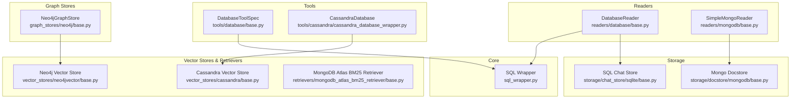
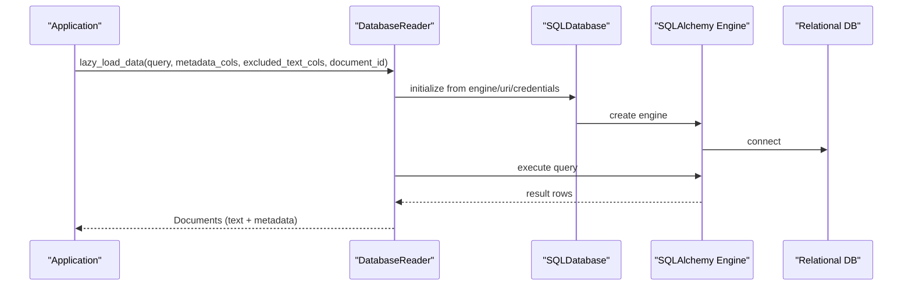
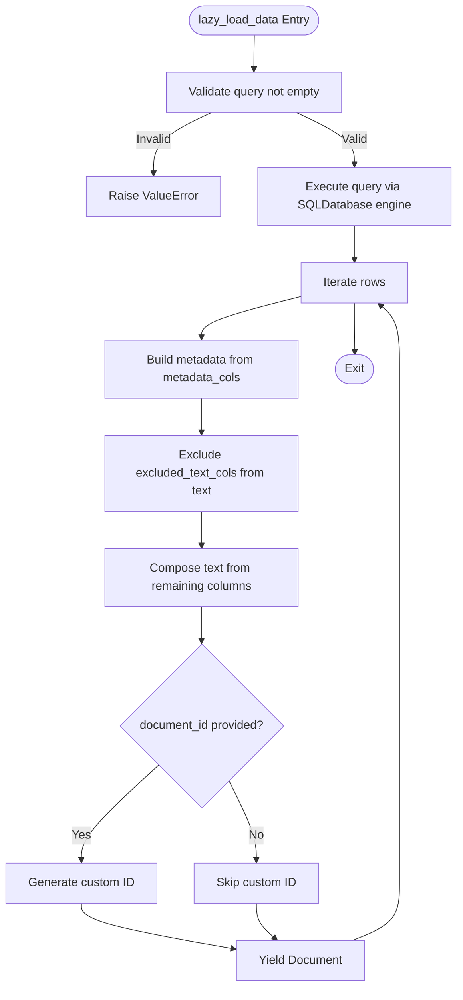
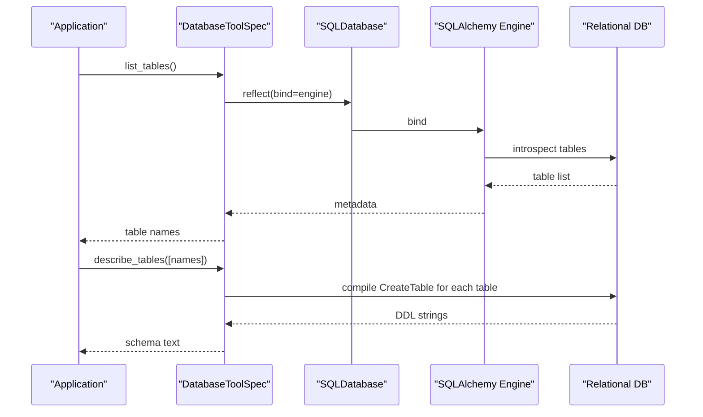
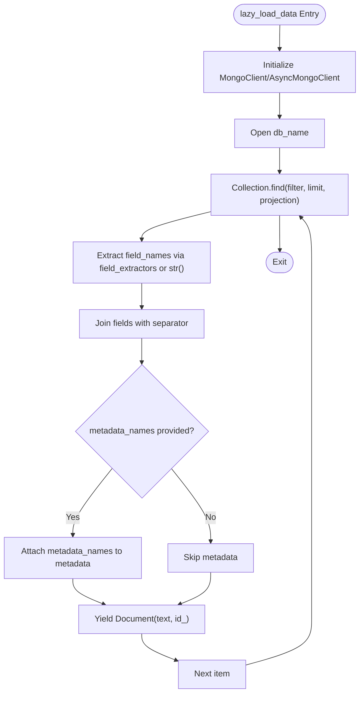
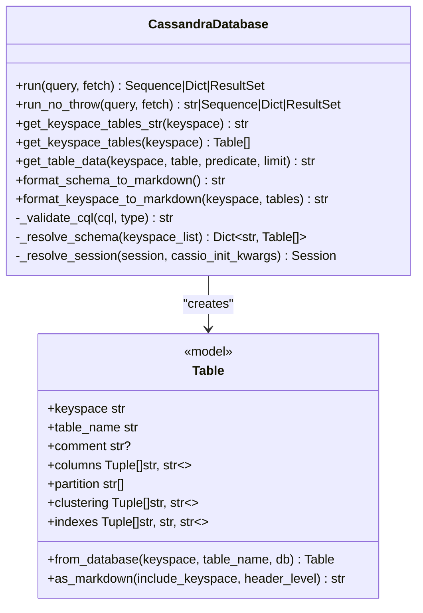
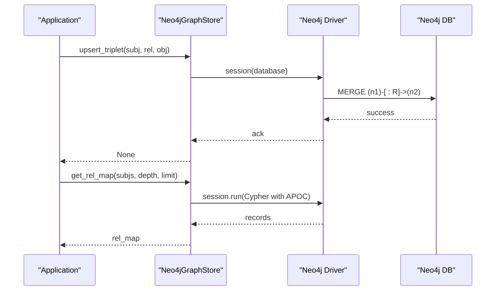
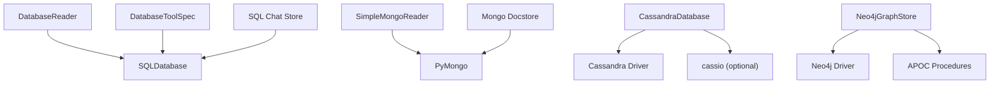

# Database Connectors

<cite>
**Referenced Files in This Document**
- [base.py](file://llama-index-integrations/readers/llama-index-readers-database/llama_index/readers/database/base.py)
- [__init__.py](file://llama-index-integrations/readers/llama-index-readers-database/llama_index/readers/database/__init__.py)
- [base.py](file://llama-index-integrations/tools/llama-index-tools-database/llama_index/tools/database/base.py)
- [__init__.py](file://llama-index-integrations/tools/llama-index-tools-database/llama_index/tools/database/__init__.py)
- [base.py](file://llama-index-integrations/readers/llama-index-readers-mongodb/llama_index/readers/mongodb/base.py)
- [__init__.py](file://llama-index-integrations/readers/llama-index-readers-mongodb/llama_index/readers/mongodb/__init__.py)
- [cassandra_database_wrapper.py](file://llama-index-integrations/tools/llama-index-tools-cassandra/llama_index/tools/cassandra/cassandra_database_wrapper.py)
- [base.py](file://llama-index-integrations/graph_stores/llama-index-graph-stores-neo4j/llama_index/graph_stores/neo4j/base.py)
- [sql_wrapper.py](file://llama-index-core/llama_index/core/utilities/sql_wrapper.py)
- [sql.py](file://llama-index-core/llama_index/core/storage/chat_store/sql.py)
- [sql.py](file://llama-index-core/llama_index/core/indices/common/struct_store/sql.py)
- [sql.py](file://llama-index-core/llama_index/core/indices/struct_store/sql.py)
- [sql_query.py](file://llama-index-core/llama_index/core/indices/struct_store/sql_query.py)
- [sql_retriever.py](file://llama-index-core/llama_index/core/indices/struct_store/sql_retriever.py)
- [sql_join_query_engine.py](file://llama-index-core/llama_index/core/query_engine/sql_join_query_engine.py)
- [sql_vector_query_engine.py](file://llama-index-core/llama_index/core/query_engine/sql_vector_query_engine.py)
- [base.py](file://llama-index-integrations/storage/chat_store/llama-index-storage-chat-store-sqlite/llama_index/storage/chat_store/sqlite/base.py)
- [base.py](file://llama-index-integrations/storage/chat_store/llama-index-storage-chat-store-azurecosmosnosql/llama_index/storage/chat_store/azurecosmosnosql/base.py)
- [base.py](file://llama-index-integrations/storage/docstore/llama-index-storage-docstore-mongodb/llama_index/storage/docstore/mongodb/base.py)
- [base.py](file://llama-index-integrations/vector_stores/llama-index-vector-stores-cassandra/llama_index/vector_stores/cassandra/base.py)
- [base.py](file://llama-index-integrations/vector_stores/llama-index-vector-stores-neo4jvector/llama_index/vector_stores/neo4jvector/base.py)
- [base.py](file://llama-index-integrations/retrievers/llama-index-retrievers-mongodb-atlas-bm25-retriever/llama_index/retrievers/mongodb_atlas_bm25_retriever/base.py)
</cite>

## Table of Contents
1. [Introduction](#introduction)
2. [Project Structure](#project-structure)
3. [Core Components](#core-components)
4. [Architecture Overview](#architecture-overview)
5. [Detailed Component Analysis](#detailed-component-analysis)
6. [Dependency Analysis](#dependency-analysis)
7. [Performance Considerations](#performance-considerations)
8. [Troubleshooting Guide](#troubleshooting-guide)
9. [Conclusion](#conclusion)
10. [Appendices](#appendices)

## Introduction
This document provides comprehensive API documentation for database connectors across SQL, NoSQL, and specialized graph data stores. It covers connection management, query execution, pagination, data transformation, authentication, SSL configuration, and performance optimization. It also includes API specifications for:
- Relational databases (via SQL wrappers and readers)
- Document stores (MongoDB)
- Wide-column stores (Apache Cassandra)
- Graph databases (Neo4j)

Where applicable, the document references the exact source files and line ranges to help you locate the implementation details.

## Project Structure
The repository organizes database connectors primarily under:
- Core utilities for SQL wrappers
- Reader integrations for SQL and MongoDB
- Tool integrations for SQL and Cassandra
- Graph store integrations for Neo4j
- Storage integrations for SQL-based chat stores and MongoDB docstore
- Vector store and retriever integrations for Cassandra and Neo4j

**Diagram sources**
- [sql_wrapper.py](file://llama-index-core/llama_index/core/utilities/sql_wrapper.py)
- [base.py](file://llama-index-integrations/readers/llama-index-readers-database/llama_index/readers/database/base.py)
- [base.py](file://llama-index-integrations/tools/llama-index-tools-database/llama_index/tools/database/base.py)
- [base.py](file://llama-index-integrations/readers/llama-index-readers-mongodb/llama_index/readers/mongodb/base.py)
- [base.py](file://llama-index-integrations/graph_stores/llama-index-graph-stores-neo4j/llama_index/graph_stores/neo4j/base.py)
- [base.py](file://llama-index-integrations/storage/chat_store/llama-index-storage-chat-store-sqlite/llama_index/storage/chat_store/sqlite/base.py)
- [base.py](file://llama-index-integrations/storage/docstore/llama-index-storage-docstore-mongodb/llama_index/storage/docstore/mongodb/base.py)
- [base.py](file://llama-index-integrations/vector_stores/llama-index-vector-stores-cassandra/llama_index/vector_stores/cassandra/base.py)
- [base.py](file://llama-index-integrations/vector_stores/llama-index-vector-stores-neo4jvector/llama_index/vector_stores/neo4jvector/base.py)
- [base.py](file://llama-index-integrations/retrievers/llama-index-retrievers-mongodb-atlas-bm25-retriever/llama_index/retrievers/mongodb_atlas_bm25_retriever/base.py)

**Section sources**
- [base.py](file://llama-index-integrations/readers/llama-index-readers-database/llama_index/readers/database/base.py#L26-L246)
- [base.py](file://llama-index-integrations/tools/llama-index-tools-database/llama_index/tools/database/base.py#L15-L140)
- [base.py](file://llama-index-integrations/readers/llama-index-readers-mongodb/llama_index/readers/mongodb/base.py#L11-L193)
- [cassandra_database_wrapper.py](file://llama-index-integrations/tools/llama-index-tools-cassandra/llama_index/tools/cassandra/cassandra_database_wrapper.py#L24-L687)
- [base.py](file://llama-index-integrations/graph_stores/llama-index-graph-stores-neo4j/llama_index/graph_stores/neo4j/base.py#L39-L374)

## Core Components
This section outlines the primary connector APIs and their capabilities.

- SQL Database Reader
  - Purpose: Execute SQL queries and materialize results into LlamaIndex Documents with flexible metadata and text composition.
  - Connection modes: Accepts an existing SQLDatabase wrapper, SQLAlchemy Engine, connection URI, or individual credentials.
  - Key methods: lazy_load_data(query, metadata_cols, excluded_text_cols, document_id).
  - Pagination: Implemented via cursor iteration; no built-in page size parameter.
  - Data transformation: Builds text from selected columns and attaches metadata; supports custom document_id generation.

- SQL Database Tool
  - Purpose: Provides tool-style operations for querying, listing tables, and describing schemas.
  - Connection modes: Same as the reader.
  - Methods: load_data(query), list_tables(), describe_tables(tables).
  - Data transformation: Concatenates row values into a single text per row.

- MongoDB Reader
  - Purpose: Streamlines reading from MongoDB collections with flexible field extraction and metadata attachment.
  - Connection modes: Accepts host/port or URI; initializes both sync and async clients.
  - Methods: lazy_load_data(db_name, collection_name, field_names, separator, query_dict, max_docs, metadata_names, field_extractors).
  - Pagination: Uses cursor with optional limit.
  - Data transformation: Concatenates configured fields; optionally extracts metadata fields.

- Cassandra Tool
  - Purpose: Executes CQL queries against Apache Cassandra, with schema introspection and safe query validation helpers.
  - Classes: CassandraDatabase (wrapper), Table (schema model).
  - Methods: run(query, fetch), run_no_throw(query, fetch), get_keyspace_tables_str(keyspace), get_table_data(keyspace, table, predicate, limit), format_schema_to_markdown().
  - Safety: Validates CQL and sanitizes for basic injection concerns.

- Neo4j Graph Store
  - Purpose: Manages graph schema, triplets, and Cypher queries with APOC-based schema discovery.
  - Methods: get(subj), get_rel_map(subjs, depth, limit), upsert_triplet(subj, rel, obj), delete(subj, rel, obj), refresh_schema(), get_schema(refresh), query(query, param_map), close(), context manager support.
  - Authentication: Username/password via driver initialization.

**Section sources**
- [base.py](file://llama-index-integrations/readers/llama-index-readers-database/llama_index/readers/database/base.py#L26-L246)
- [base.py](file://llama-index-integrations/tools/llama-index-tools-database/llama_index/tools/database/base.py#L15-L140)
- [base.py](file://llama-index-integrations/readers/llama-index-readers-mongodb/llama_index/readers/mongodb/base.py#L11-L193)
- [cassandra_database_wrapper.py](file://llama-index-integrations/tools/llama-index-tools-cassandra/llama_index/tools/cassandra/cassandra_database_wrapper.py#L24-L687)
- [base.py](file://llama-index-integrations/graph_stores/llama-index-graph-stores-neo4j/llama_index/graph_stores/neo4j/base.py#L39-L374)

## Architecture Overview
The connectors follow a layered pattern:
- Application code invokes readers/tools/graph stores.
- Readers/tools construct or reuse SQLDatabase wrappers for SQL connectivity.
- Graph stores encapsulate native drivers (e.g., Neo4j driver).
- Storage integrations provide persistence backends (SQL chat store, MongoDB docstore).

**Diagram sources**
- [base.py](file://llama-index-integrations/readers/llama-index-readers-database/llama_index/readers/database/base.py#L91-L131)
- [sql_wrapper.py](file://llama-index-core/llama_index/core/utilities/sql_wrapper.py)

## Detailed Component Analysis

### SQL Database Reader API
- Initialization
  - Accepts: SQLDatabase, SQLAlchemy Engine, connection URI, or individual credentials (scheme, host, port, user, password, dbname).
  - Optional schema parameter honored only when constructing a new SQLDatabase internally.
- Query Execution
  - lazy_load_data(query, metadata_cols, excluded_text_cols, document_id)
  - Validates non-empty query.
  - Iterates over rows and yields Documents.
- Metadata and Text Composition
  - metadata_cols supports:
    - Column name as string
    - Tuple of (db_column, metadata_key)
  - excluded_text_cols excludes columns from text content.
  - document_id(row_dict) allows custom Document ID generation.
- Pagination
  - Implemented via iterator; no explicit page size parameter.
- Error Handling
  - Logs warnings for invalid metadata items and missing columns.
  - Raises ValueError for empty query.

**Diagram sources**
- [base.py](file://llama-index-integrations/readers/llama-index-readers-database/llama_index/readers/database/base.py#L132-L246)

**Section sources**
- [base.py](file://llama-index-integrations/readers/llama-index-readers-database/llama_index/readers/database/base.py#L26-L246)
- [__init__.py](file://llama-index-integrations/readers/llama-index-readers-database/llama_index/readers/database/__init__.py#L1-L4)

### SQL Database Tool API
- Initialization
  - Accepts: SQLDatabase, SQLAlchemy Engine, connection URI, or individual credentials.
  - Reflects metadata to list and describe tables.
- Methods
  - load_data(query): Executes query and returns a list of Documents.
  - list_tables(): Returns available table names.
  - describe_tables(tables): Returns DDL-like schema strings for specified tables.
- Error Handling
  - Raises NoSuchTableError for unknown tables.

**Diagram sources**
- [base.py](file://llama-index-integrations/tools/llama-index-tools-database/llama_index/tools/database/base.py#L47-L140)

**Section sources**
- [base.py](file://llama-index-integrations/tools/llama-index-tools-database/llama_index/tools/database/base.py#L15-L140)
- [__init__.py](file://llama-index-integrations/tools/llama-index-tools-database/llama_index/tools/database/__init__.py#L1-L7)

### MongoDB Reader API
- Initialization
  - Accepts: host/port or URI; creates both sync and async clients.
  - Appends driver metadata for observability.
- Query Execution
  - lazy_load_data(db_name, collection_name, field_names, separator, query_dict, max_docs, metadata_names, field_extractors)
  - Uses find with projection to limit fetched fields.
- Pagination
  - limit=max_docs; 0 means no limit.
- Data Transformation
  - Concatenates field_names with separator.
  - Attaches metadata_names to Document metadata; adds collection name to metadata.

**Diagram sources**
- [base.py](file://llama-index-integrations/readers/llama-index-readers-mongodb/llama_index/readers/mongodb/base.py#L58-L193)

**Section sources**
- [base.py](file://llama-index-integrations/readers/llama-index-readers-mongodb/llama_index/readers/mongodb/base.py#L11-L193)
- [__init__.py](file://llama-index-integrations/readers/llama-index-readers-mongodb/llama_index/readers/mongodb/__init__.py#L1-L4)

### Cassandra Tool API
- Class: CassandraDatabase
  - run(query, fetch): Executes CQL; fetch modes: "all", "one", "cursor".
  - run_no_throw(query, fetch): Executes and returns error as string on failure.
  - get_keyspace_tables_str(keyspace), get_keyspace_tables(keyspace), get_table_data(keyspace, table, predicate, limit).
  - format_schema_to_markdown(), format_keyspace_to_markdown(keyspace, tables).
  - _validate_cql(cql, type): Validates CQL basics and safety.
  - _resolve_schema(keyspace_list), _resolve_session(session, cassio_init_kwargs).
- Class: Table (Pydantic model)
  - Fields: keyspace, table_name, comment, columns, partition, clustering, indexes.
  - Methods: from_database, as_markdown, static resolvers for comment/columns/indexes.

**Diagram sources**
- [cassandra_database_wrapper.py](file://llama-index-integrations/tools/llama-index-tools-cassandra/llama_index/tools/cassandra/cassandra_database_wrapper.py#L24-L687)

**Section sources**
- [cassandra_database_wrapper.py](file://llama-index-integrations/tools/llama-index-tools-cassandra/llama_index/tools/cassandra/cassandra_database_wrapper.py#L24-L687)

### Neo4j Graph Store API
- Class: Neo4jGraphStore
  - Constructor: username, password, url, database, node_label, refresh_schema, timeout.
  - Methods:
    - get(subj): Retrieve outgoing triplets for a subject.
    - get_rel_map(subjs, depth, limit): Flatten multi-hop relations.
    - upsert_triplet(subj, rel, obj): Merge nodes and relationship.
    - delete(subj, rel, obj): Delete relationship and orphan nodes.
    - refresh_schema(): Discover schema via APOC.
    - get_schema(refresh): Return formatted schema string.
    - query(query, param_map): Execute Cypher with timeout.
    - close(): Close driver.
    - Context manager: __enter__/__exit__/__del__.
- Authentication and Connectivity
  - Uses Neo4j driver with auth(username, password).
  - Validates connectivity and handles APOC availability.

**Diagram sources**
- [base.py](file://llama-index-integrations/graph_stores/llama-index-graph-stores-neo4j/llama_index/graph_stores/neo4j/base.py#L103-L170)

**Section sources**
- [base.py](file://llama-index-integrations/graph_stores/llama-index-graph-stores-neo4j/llama_index/graph_stores/neo4j/base.py#L39-L374)

## Dependency Analysis
- SQL Reader and Tool depend on SQLDatabase wrapper and SQLAlchemy engine.
- MongoDB Reader depends on PyMongo for sync and async clients.
- Cassandra Tool depends on Cassandra driver and optionally cassio for session resolution.
- Neo4j Graph Store depends on the Neo4j driver and APOC for schema introspection.
- Storage integrations (SQL chat store, MongoDB docstore) provide persistence backends for chat and document storage respectively.

**Diagram sources**
- [base.py](file://llama-index-integrations/readers/llama-index-readers-database/llama_index/readers/database/base.py#L17-L21)
- [base.py](file://llama-index-integrations/tools/llama-index-tools-database/llama_index/tools/database/base.py#L8-L12)
- [base.py](file://llama-index-integrations/readers/llama-index-readers-mongodb/llama_index/readers/mongodb/base.py#L30-L46)
- [cassandra_database_wrapper.py](file://llama-index-integrations/tools/llama-index-tools-cassandra/llama_index/tools/cassandra/cassandra_database_wrapper.py#L455-L476)
- [base.py](file://llama-index-integrations/graph_stores/llama-index-graph-stores-neo4j/llama_index/graph_stores/neo4j/base.py#L52-L82)

**Section sources**
- [base.py](file://llama-index-integrations/readers/llama-index-readers-database/llama_index/readers/database/base.py#L17-L21)
- [base.py](file://llama-index-integrations/tools/llama-index-tools-database/llama_index/tools/database/base.py#L8-L12)
- [base.py](file://llama-index-integrations/readers/llama-index-readers-mongodb/llama_index/readers/mongodb/base.py#L30-L46)
- [cassandra_database_wrapper.py](file://llama-index-integrations/tools/llama-index-tools-cassandra/llama_index/tools/cassandra/cassandra_database_wrapper.py#L455-L476)
- [base.py](file://llama-index-integrations/graph_stores/llama-index-graph-stores-neo4j/llama_index/graph_stores/neo4j/base.py#L52-L82)

## Performance Considerations
- SQL
  - Use lazy loading for large datasets to stream results.
  - Limit columns in metadata_cols and excluded_text_cols to reduce text size.
  - Prefer indexed columns in WHERE clauses for faster filtering.
- MongoDB
  - Use projection to limit fields and metadata_names to reduce payload.
  - Apply query_dict filters to minimize cursor traversal.
  - Consider max_docs to cap results for testing or rate-limiting.
- Cassandra
  - Use _validate_cql to enforce safe queries and avoid injection.
  - Leverage get_table_data with predicate and limit for targeted reads.
  - Use format_schema_to_markdown to guide query planning.
- Neo4j
  - Use APOC procedures judiciously; ensure permissions are granted.
  - Optimize Cypher with indexes and constraints; leverage refresh_schema for accurate stats.
  - Control timeouts via constructor parameters.

[No sources needed since this section provides general guidance]

## Troubleshooting Guide
- SQL Reader
  - Empty query raises ValueError; ensure query is provided.
  - Missing columns in metadata_cols produce warnings; verify column names.
  - document_id must return a string; otherwise a warning is logged.
- SQL Tool
  - NoSuchTableError indicates table does not exist; confirm table names.
- MongoDB Reader
  - Missing fields in query results raise ValueError; ensure field_names exist.
  - Either host/port or URI must be provided; otherwise ValueError is raised.
- Cassandra Tool
  - DatabaseError raised for unsafe CQL; ensure query starts with SELECT and no unexpected semicolons outside quotes.
  - cassio not installed raises ValueError; install cassio or provide a session.
- Neo4j Graph Store
  - ServiceUnavailable or AuthError indicate connectivity/authentication issues; verify URL, credentials, and APOC availability.

**Section sources**
- [base.py](file://llama-index-integrations/readers/llama-index-readers-database/llama_index/readers/database/base.py#L175-L245)
- [base.py](file://llama-index-integrations/tools/llama-index-tools-database/llama_index/tools/database/base.py#L94-L104)
- [base.py](file://llama-index-integrations/readers/llama-index-readers-mongodb/llama_index/readers/mongodb/base.py#L111-L114)
- [cassandra_database_wrapper.py](file://llama-index-integrations/tools/llama-index-tools-cassandra/llama_index/tools/cassandra/cassandra_database_wrapper.py#L233-L236)
- [base.py](file://llama-index-integrations/graph_stores/llama-index-graph-stores-neo4j/llama_index/graph_stores/neo4j/base.py#L61-L70)

## Conclusion
The repository provides robust, modular connectors for SQL, MongoDB, Cassandra, and Neo4j. SQL connectors offer flexible metadata/text composition and streaming, while MongoDB and Cassandra connectors emphasize field extraction and schema-aware operations. Neo4j integration leverages APOC for schema discovery and efficient triplet management. By following the API specifications and performance guidelines, you can build scalable data ingestion pipelines tailored to your target data store.

[No sources needed since this section summarizes without analyzing specific files]

## Appendices

### API Specifications

- SQL Database Reader
  - Class: DatabaseReader
  - Constructor parameters: sql_database, engine, uri, scheme, host, port, user, password, dbname, schema
  - Method: lazy_load_data(query, metadata_cols=None, excluded_text_cols=None, document_id=None)
  - Returns: Generator of Documents

- SQL Database Tool
  - Class: DatabaseToolSpec
  - Constructor parameters: sql_database, engine, uri, scheme, host, port, user, password, dbname
  - Methods:
    - load_data(query) -> List[Document]
    - list_tables() -> List[str]
    - describe_tables(tables=None) -> str

- MongoDB Reader
  - Class: SimpleMongoReader
  - Constructor parameters: host, port, uri
  - Methods:
    - lazy_load_data(db_name, collection_name, field_names=["text"], separator="", query_dict=None, max_docs=0, metadata_names=None, field_extractors=None)
    - alazy_load_data(db_name, collection_name, field_names=["text"], separator="", query_dict=None, max_docs=0, metadata_names=None, field_extractors=None)

- Cassandra Tool
  - Class: CassandraDatabase
  - Constructor parameters: session=None, exclude_tables=None, include_tables=None, cassio_init_kwargs=None
  - Methods:
    - run(query, fetch="all")
    - run_no_throw(query, fetch="all")
    - get_keyspace_tables_str(keyspace)
    - get_keyspace_tables(keyspace)
    - get_table_data(keyspace, table, predicate, limit)
    - format_schema_to_markdown()
    - format_keyspace_to_markdown(keyspace, tables=None)

- Neo4j Graph Store
  - Class: Neo4jGraphStore
  - Constructor parameters: username, password, url, database="neo4j", node_label="Entity", refresh_schema=True, timeout=None
  - Methods:
    - get(subj) -> List[List[str]]
    - get_rel_map(subjs=None, depth=2, limit=30) -> Dict[str, List[List[str]]]
    - upsert_triplet(subj, rel, obj) -> None
    - delete(subj, rel, obj) -> None
    - refresh_schema() -> None
    - get_schema(refresh=False) -> str
    - query(query, param_map=None) -> Any
    - close() -> None

**Section sources**
- [base.py](file://llama-index-integrations/readers/llama-index-readers-database/llama_index/readers/database/base.py#L26-L246)
- [base.py](file://llama-index-integrations/tools/llama-index-tools-database/llama_index/tools/database/base.py#L15-L140)
- [base.py](file://llama-index-integrations/readers/llama-index-readers-mongodb/llama_index/readers/mongodb/base.py#L11-L193)
- [cassandra_database_wrapper.py](file://llama-index-integrations/tools/llama-index-tools-cassandra/llama_index/tools/cassandra/cassandra_database_wrapper.py#L24-L687)
- [base.py](file://llama-index-integrations/graph_stores/llama-index-graph-stores-neo4j/llama_index/graph_stores/neo4j/base.py#L39-L374)