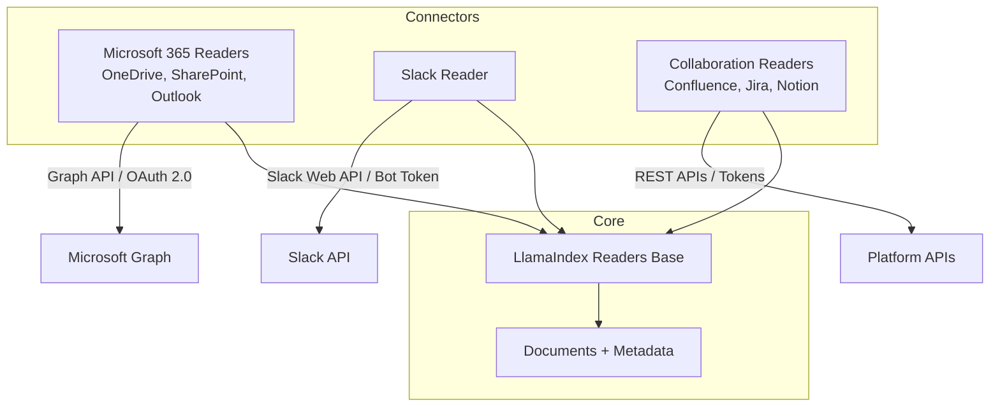
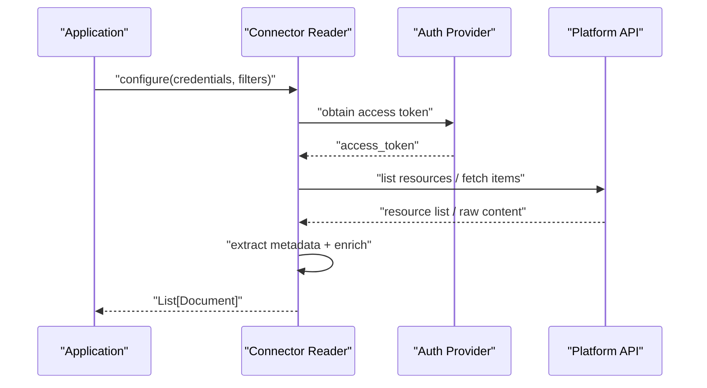
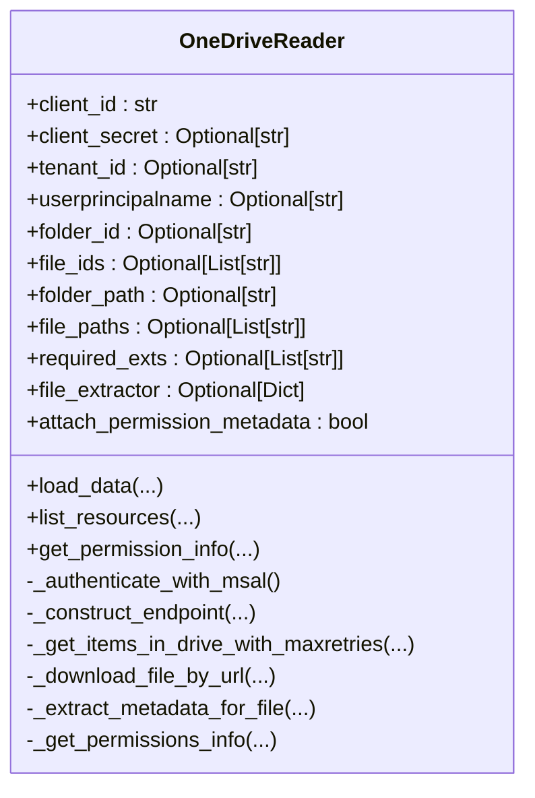
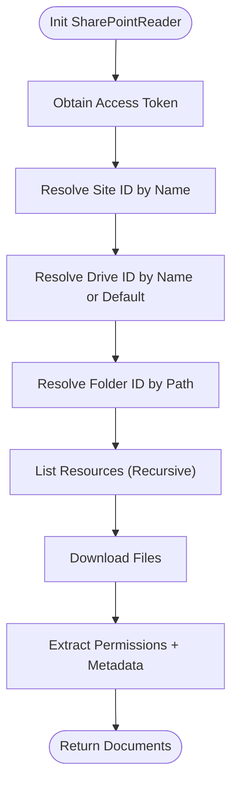
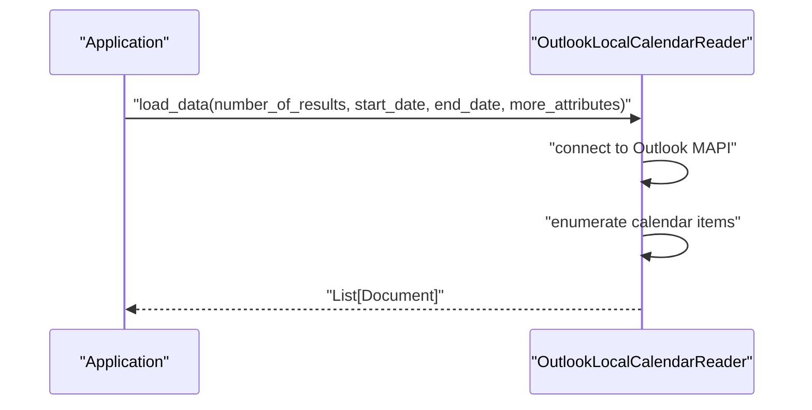
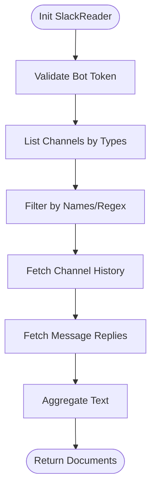
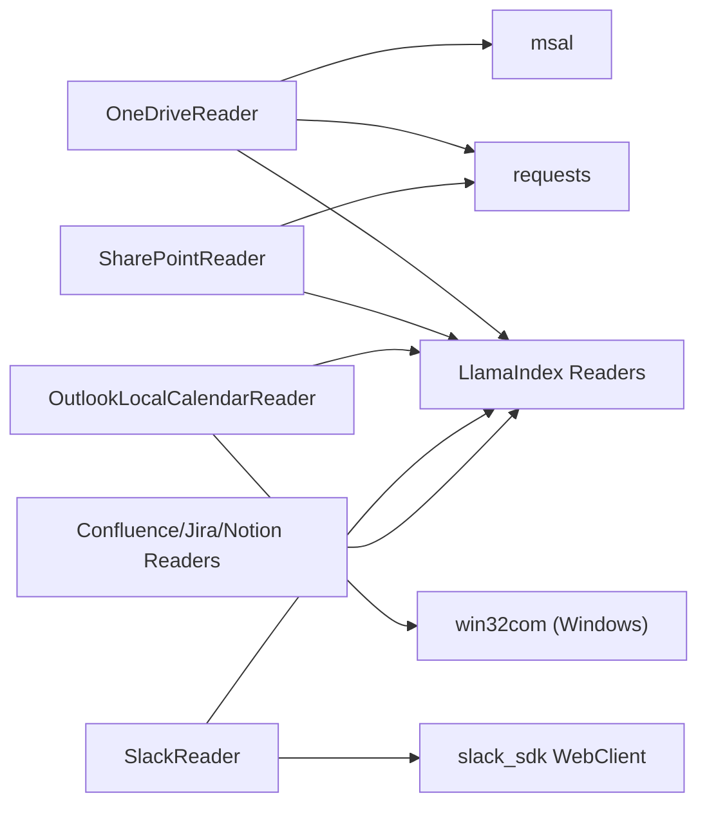

# Enterprise Connectors

<cite>
**Referenced Files in This Document**
- [base.py](file://llama-index-integrations/readers/llama-index-readers-microsoft-onedrive/llama_index/readers/microsoft_onedrive/base.py)
- [base.py](file://llama-index-integrations/readers/llama-index-readers-microsoft-outlook/llama_index/readers/microsoft_outlook/base.py)
- [base.py](file://llama-index-integrations/readers/llama-index-readers-microsoft-sharepoint/llama_index/readers/microsoft_sharepoint/base.py)
- [base.py](file://llama-index-integrations/readers/llama-index-readers-slack/llama_index/readers/slack/base.py)
- [base.py](file://llama-index-integrations/readers/llama-index-readers-confluence/llama_index/readers/confluence/base.py)
- [base.py](file://llama-index-integrations/readers/llama-index-readers-jira/llama_index/readers/jira/base.py)
- [base.py](file://llama-index-integrations/readers/llama-index-readers-notion/llama_index/readers/notion/base.py)
</cite>

## Table of Contents
1. [Introduction](#introduction)
2. [Project Structure](#project-structure)
3. [Core Components](#core-components)
4. [Architecture Overview](#architecture-overview)
5. [Detailed Component Analysis](#detailed-component-analysis)
6. [Dependency Analysis](#dependency-analysis)
7. [Performance Considerations](#performance-considerations)
8. [Troubleshooting Guide](#troubleshooting-guide)
9. [Conclusion](#conclusion)
10. [Appendices](#appendices)

## Introduction
This document provides comprehensive API documentation for enterprise connectors within the LlamaIndex ecosystem. It focuses on connectors for Google Workspace, Microsoft 365, collaboration platforms (Confluence, Jira, Notion), and communication tools (Slack). The documentation covers OAuth authentication flows, permission scopes, API rate-limit handling, data access patterns, and practical examples for enterprise-grade integrations. It also outlines error handling, retry strategies, and compliance considerations for secure, scalable deployments.

## Project Structure
The enterprise connectors are implemented as reader integrations under the llama-index-integrations package. Each connector encapsulates authentication, resource discovery, data extraction, and metadata attachment tailored to the target platform.

**Diagram sources**
- [base.py](file://llama-index-integrations/readers/llama-index-readers-microsoft-onedrive/llama_index/readers/microsoft_onedrive/base.py#L34-L110)
- [base.py](file://llama-index-integrations/readers/llama-index-readers-microsoft-sharepoint/llama_index/readers/microsoft_sharepoint/base.py#L23-L98)
- [base.py](file://llama-index-integrations/readers/llama-index-readers-slack/llama_index/readers/slack/base.py#L19-L98)
- [base.py](file://llama-index-integrations/readers/llama-index-readers-confluence/llama_index/readers/confluence/base.py)
- [base.py](file://llama-index-integrations/readers/llama-index-readers-jira/llama_index/readers/jira/base.py)
- [base.py](file://llama-index-integrations/readers/llama-index-readers-notion/llama_index/readers/notion/base.py)

**Section sources**
- [base.py](file://llama-index-integrations/readers/llama-index-readers-microsoft-onedrive/llama_index/readers/microsoft_onedrive/base.py#L34-L110)
- [base.py](file://llama-index-integrations/readers/llama-index-readers-microsoft-sharepoint/llama_index/readers/microsoft_sharepoint/base.py#L23-L98)
- [base.py](file://llama-index-integrations/readers/llama-index-readers-slack/llama_index/readers/slack/base.py#L19-L98)
- [base.py](file://llama-index-integrations/readers/llama-index-readers-confluence/llama_index/readers/confluence/base.py)
- [base.py](file://llama-index-integrations/readers/llama-index-readers-jira/llama_index/readers/jira/base.py)
- [base.py](file://llama-index-integrations/readers/llama-index-readers-notion/llama_index/readers/notion/base.py)

## Core Components
- Microsoft OneDrive Reader: OAuth 2.0 with MSAL (interactive or confidential client), Graph API endpoints, recursive folder traversal, MIME-type filtering, permission metadata extraction, and robust retry/backoff for rate limits.
- Microsoft SharePoint Reader: Client credentials OAuth, Graph API site/drive resolution, folder traversal, file download, permission metadata, and 401 refresh logic.
- Microsoft Outlook Local Calendar Reader: Windows-only local Outlook calendar access via COM automation for event retrieval.
- Slack Reader: Slack SDK WebClient with bot token, pagination, rate-limit handling, channel filtering by name or regex, and message history retrieval.
- Confluence Reader: Platform-specific reader for Atlassian Confluence (implementation present in repository).
- Jira Reader: Platform-specific reader for Atlassian Jira (implementation present in repository).
- Notion Reader: Platform-specific reader for Notion (implementation present in repository).

Key shared capabilities:
- Authentication abstraction per platform.
- Resource discovery and listing.
- Data extraction and metadata enrichment.
- Error handling and retry strategies.

**Section sources**
- [base.py](file://llama-index-integrations/readers/llama-index-readers-microsoft-onedrive/llama_index/readers/microsoft_onedrive/base.py#L34-L110)
- [base.py](file://llama-index-integrations/readers/llama-index-readers-microsoft-sharepoint/llama_index/readers/microsoft_sharepoint/base.py#L23-L98)
- [base.py](file://llama-index-integrations/readers/llama-index-readers-microsoft-outlook/llama_index/readers/microsoft_outlook/base.py#L32-L103)
- [base.py](file://llama-index-integrations/readers/llama-index-readers-slack/llama_index/readers/slack/base.py#L19-L98)
- [base.py](file://llama-index-integrations/readers/llama-index-readers-confluence/llama_index/readers/confluence/base.py)
- [base.py](file://llama-index-integrations/readers/llama-index-readers-jira/llama_index/readers/jira/base.py)
- [base.py](file://llama-index-integrations/readers/llama-index-readers-notion/llama_index/readers/notion/base.py)

## Architecture Overview
The connectors follow a consistent pattern:
- Initialize with platform-specific credentials and configuration.
- Authenticate (OAuth 2.0, client credentials, or tokens).
- Discover resources (folders, channels, sites).
- Download or fetch content.
- Extract metadata and enrich documents.
- Return LlamaIndex Documents for downstream RAG pipelines.

**Diagram sources**
- [base.py](file://llama-index-integrations/readers/llama-index-readers-microsoft-onedrive/llama_index/readers/microsoft_onedrive/base.py#L112-L151)
- [base.py](file://llama-index-integrations/readers/llama-index-readers-microsoft-sharepoint/llama_index/readers/microsoft_sharepoint/base.py#L100-L136)
- [base.py](file://llama-index-integrations/readers/llama-index-readers-slack/llama_index/readers/slack/base.py#L48-L98)

## Detailed Component Analysis

### Microsoft OneDrive Reader
- Authentication
  - Interactive OAuth via MSAL PublicClientApplication for user consent.
  - Confidential client OAuth via MSAL ConfidentialClientApplication using client credentials.
  - Scopes: Files.Read.All for app-level access; default interactive scope for personal accounts.
- Endpoints
  - Uses Microsoft Graph endpoints for user or tenant-specific drive access.
  - Supports relative path and item ID queries.
- Data Access
  - Recursive traversal of folders and selective MIME-type downloads.
  - Permission metadata extraction for access control visibility.
- Rate Limits and Retries
  - Implements exponential backoff on 429 and 5xx responses.
- Error Handling
  - Comprehensive logging and exception propagation with detailed error context.

**Diagram sources**
- [base.py](file://llama-index-integrations/readers/llama-index-readers-microsoft-onedrive/llama_index/readers/microsoft_onedrive/base.py#L34-L110)
- [base.py](file://llama-index-integrations/readers/llama-index-readers-microsoft-onedrive/llama_index/readers/microsoft_onedrive/base.py#L112-L151)
- [base.py](file://llama-index-integrations/readers/llama-index-readers-microsoft-onedrive/llama_index/readers/microsoft_onedrive/base.py#L152-L198)
- [base.py](file://llama-index-integrations/readers/llama-index-readers-microsoft-onedrive/llama_index/readers/microsoft_onedrive/base.py#L200-L252)
- [base.py](file://llama-index-integrations/readers/llama-index-readers-microsoft-onedrive/llama_index/readers/microsoft_onedrive/base.py#L254-L280)
- [base.py](file://llama-index-integrations/readers/llama-index-readers-microsoft-onedrive/llama_index/readers/microsoft_onedrive/base.py#L282-L328)
- [base.py](file://llama-index-integrations/readers/llama-index-readers-microsoft-onedrive/llama_index/readers/microsoft_onedrive/base.py#L330-L376)
- [base.py](file://llama-index-integrations/readers/llama-index-readers-microsoft-onedrive/llama_index/readers/microsoft_onedrive/base.py#L378-L553)
- [base.py](file://llama-index-integrations/readers/llama-index-readers-microsoft-onedrive/llama_index/readers/microsoft_onedrive/base.py#L555-L628)
- [base.py](file://llama-index-integrations/readers/llama-index-readers-microsoft-onedrive/llama_index/readers/microsoft_onedrive/base.py#L630-L677)
- [base.py](file://llama-index-integrations/readers/llama-index-readers-microsoft-onedrive/llama_index/readers/microsoft_onedrive/base.py#L678-L756)
- [base.py](file://llama-index-integrations/readers/llama-index-readers-microsoft-onedrive/llama_index/readers/microsoft_onedrive/base.py#L758-L799)

**Section sources**
- [base.py](file://llama-index-integrations/readers/llama-index-readers-microsoft-onedrive/llama_index/readers/microsoft_onedrive/base.py#L24-L26)
- [base.py](file://llama-index-integrations/readers/llama-index-readers-microsoft-onedrive/llama_index/readers/microsoft_onedrive/base.py#L112-L151)
- [base.py](file://llama-index-integrations/readers/llama-index-readers-microsoft-onedrive/llama_index/readers/microsoft_onedrive/base.py#L200-L252)
- [base.py](file://llama-index-integrations/readers/llama-index-readers-microsoft-onedrive/llama_index/readers/microsoft_onedrive/base.py#L630-L677)
- [base.py](file://llama-index-integrations/readers/llama-index-readers-microsoft-onedrive/llama_index/readers/microsoft_onedrive/base.py#L678-L756)

### Microsoft SharePoint Reader
- Authentication
  - Client credentials OAuth against Microsoft identity with Graph resource.
- Endpoints
  - Resolves site ID by name, drive ID by name or default, and folder IDs by path.
- Data Access
  - Lists and downloads files from a folder or entire drive with optional recursion.
  - Attaches permission metadata and supports excluding nested metadata for downstream systems.
- Error Handling
  - 401 Unauthorized triggers token refresh and retry.
  - Robust error logging and exception raising with detailed messages.

**Diagram sources**
- [base.py](file://llama-index-integrations/readers/llama-index-readers-microsoft-sharepoint/llama_index/readers/microsoft_sharepoint/base.py#L100-L136)
- [base.py](file://llama-index-integrations/readers/llama-index-readers-microsoft-sharepoint/llama_index/readers/microsoft_sharepoint/base.py#L172-L233)
- [base.py](file://llama-index-integrations/readers/llama-index-readers-microsoft-sharepoint/llama_index/readers/microsoft_sharepoint/base.py#L235-L275)
- [base.py](file://llama-index-integrations/readers/llama-index-readers-microsoft-sharepoint/llama_index/readers/microsoft_sharepoint/base.py#L277-L299)
- [base.py](file://llama-index-integrations/readers/llama-index-readers-microsoft-sharepoint/llama_index/readers/microsoft_sharepoint/base.py#L301-L334)
- [base.py](file://llama-index-integrations/readers/llama-index-readers-microsoft-sharepoint/llama_index/readers/microsoft_sharepoint/base.py#L386-L443)
- [base.py](file://llama-index-integrations/readers/llama-index-readers-microsoft-sharepoint/llama_index/readers/microsoft_sharepoint/base.py#L584-L637)
- [base.py](file://llama-index-integrations/readers/llama-index-readers-microsoft-sharepoint/llama_index/readers/microsoft_sharepoint/base.py#L702-L769)

**Section sources**
- [base.py](file://llama-index-integrations/readers/llama-index-readers-microsoft-sharepoint/llama_index/readers/microsoft_sharepoint/base.py#L100-L136)
- [base.py](file://llama-index-integrations/readers/llama-index-readers-microsoft-sharepoint/llama_index/readers/microsoft_sharepoint/base.py#L172-L233)
- [base.py](file://llama-index-integrations/readers/llama-index-readers-microsoft-sharepoint/llama_index/readers/microsoft_sharepoint/base.py#L235-L275)
- [base.py](file://llama-index-integrations/readers/llama-index-readers-microsoft-sharepoint/llama_index/readers/microsoft_sharepoint/base.py#L386-L443)
- [base.py](file://llama-index-integrations/readers/llama-index-readers-microsoft-sharepoint/llama_index/readers/microsoft_sharepoint/base.py#L584-L637)
- [base.py](file://llama-index-integrations/readers/llama-index-readers-microsoft-sharepoint/llama_index/readers/microsoft_sharepoint/base.py#L702-L769)

### Microsoft Outlook Local Calendar Reader
- Platform: Windows-only.
- Mechanism: Uses win32com to connect to Outlook MAPI namespace and enumerate calendar items.
- Filtering: Supports date range and additional attributes selection.

**Diagram sources**
- [base.py](file://llama-index-integrations/readers/llama-index-readers-microsoft-outlook/llama_index/readers/microsoft_outlook/base.py#L32-L103)

**Section sources**
- [base.py](file://llama-index-integrations/readers/llama-index-readers-microsoft-outlook/llama_index/readers/microsoft_outlook/base.py#L32-L103)

### Slack Reader
- Authentication
  - Slack bot token via WebClient; validates connectivity via api_test.
- Endpoints
  - conversations.history and conversations.replies for message retrieval.
- Data Access
  - Pagination via cursors; optional oldest/latest timestamps; regex and exact-name channel filtering.
- Rate Limits and Retries
  - Detects ratelimited errors and sleeps for retry-after seconds.
  - Handles not_in_channel gracefully by skipping channels.

**Diagram sources**
- [base.py](file://llama-index-integrations/readers/llama-index-readers-slack/llama_index/readers/slack/base.py#L48-L98)
- [base.py](file://llama-index-integrations/readers/llama-index-readers-slack/llama_index/readers/slack/base.py#L104-L158)
- [base.py](file://llama-index-integrations/readers/llama-index-readers-slack/llama_index/readers/slack/base.py#L160-L221)
- [base.py](file://llama-index-integrations/readers/llama-index-readers-slack/llama_index/readers/slack/base.py#L223-L248)
- [base.py](file://llama-index-integrations/readers/llama-index-readers-slack/llama_index/readers/slack/base.py#L258-L322)

**Section sources**
- [base.py](file://llama-index-integrations/readers/llama-index-readers-slack/llama_index/readers/slack/base.py#L19-L98)
- [base.py](file://llama-index-integrations/readers/llama-index-readers-slack/llama_index/readers/slack/base.py#L104-L158)
- [base.py](file://llama-index-integrations/readers/llama-index-readers-slack/llama_index/readers/slack/base.py#L160-L221)
- [base.py](file://llama-index-integrations/readers/llama-index-readers-slack/llama_index/readers/slack/base.py#L223-L248)
- [base.py](file://llama-index-integrations/readers/llama-index-readers-slack/llama_index/readers/slack/base.py#L258-L322)

### Collaboration Readers (Confluence, Jira, Notion)
- Implementation presence indicates platform-specific readers are available under the readers module.
- Typical patterns include authentication via tokens or API keys, resource discovery, and content extraction.

**Section sources**
- [base.py](file://llama-index-integrations/readers/llama-index-readers-confluence/llama_index/readers/confluence/base.py)
- [base.py](file://llama-index-integrations/readers/llama-index-readers-jira/llama_index/readers/jira/base.py)
- [base.py](file://llama-index-integrations/readers/llama-index-readers-notion/llama_index/readers/notion/base.py)

## Dependency Analysis
- External libraries:
  - Microsoft Graph: requests, msal.
  - Slack: slack_sdk WebClient.
  - Local Outlook: win32com (Windows).
- Internal dependencies:
  - LlamaIndex core readers and schema abstractions.
  - Temporary directory usage for downloads and subsequent SimpleDirectoryReader ingestion.

**Diagram sources**
- [base.py](file://llama-index-integrations/readers/llama-index-readers-microsoft-onedrive/llama_index/readers/microsoft_onedrive/base.py#L11-L15)
- [base.py](file://llama-index-integrations/readers/llama-index-readers-microsoft-sharepoint/llama_index/readers/microsoft_sharepoint/base.py#L10-L11)
- [base.py](file://llama-index-integrations/readers/llama-index-readers-microsoft-outlook/llama_index/readers/microsoft_outlook/base.py#L10-L12)
- [base.py](file://llama-index-integrations/readers/llama-index-readers-slack/llama_index/readers/slack/base.py#L59-L71)
- [base.py](file://llama-index-integrations/readers/llama-index-readers-confluence/llama_index/readers/confluence/base.py)
- [base.py](file://llama-index-integrations/readers/llama-index-readers-jira/llama_index/readers/jira/base.py)
- [base.py](file://llama-index-integrations/readers/llama-index-readers-notion/llama_index/readers/notion/base.py)

**Section sources**
- [base.py](file://llama-index-integrations/readers/llama-index-readers-microsoft-onedrive/llama_index/readers/microsoft_onedrive/base.py#L11-L15)
- [base.py](file://llama-index-integrations/readers/llama-index-readers-microsoft-sharepoint/llama_index/readers/microsoft_sharepoint/base.py#L10-L11)
- [base.py](file://llama-index-integrations/readers/llama-index-readers-microsoft-outlook/llama_index/readers/microsoft_outlook/base.py#L10-L12)
- [base.py](file://llama-index-integrations/readers/llama-index-readers-slack/llama_index/readers/slack/base.py#L59-L71)
- [base.py](file://llama-index-integrations/readers/llama-index-readers-confluence/llama_index/readers/confluence/base.py)
- [base.py](file://llama-index-integrations/readers/llama-index-readers-jira/llama_index/readers/jira/base.py)
- [base.py](file://llama-index-integrations/readers/llama-index-readers-notion/llama_index/readers/notion/base.py)

## Performance Considerations
- OneDrive
  - Recursive traversal can trigger rate limits; leverage exponential backoff and consider limiting concurrency.
  - MIME-type filtering reduces unnecessary downloads.
- SharePoint
  - Token refresh on 401 avoids repeated failures; cache resolved site/drive IDs when possible.
  - Prefer folder ID over path-based lookups for performance.
- Slack
  - Respect retry-after headers; batch channel reads to minimize API calls.
  - Use channel filtering to reduce scope.
- General
  - Use temporary directories for downloads and SimpleDirectoryReader for efficient ingestion.
  - Attach minimal metadata to reduce downstream storage overhead.

[No sources needed since this section provides general guidance]

## Troubleshooting Guide
- OneDrive
  - Authentication failures: verify client_id, client_secret, tenant_id, and userprincipalname; ensure redirect URIs for interactive flows.
  - Rate limit errors: implement exponential backoff; reduce concurrent requests.
  - Permission metadata: enable attach_permission_metadata only when supported by the downstream vector store.
- SharePoint
  - 401 Unauthorized: ensure client credentials grant access to Graph resource; refresh token and retry once.
  - Site/drive resolution: confirm site name/id and drive name/id; check permissions.
- Slack
  - Rate limit errors: honor retry-after; consider reducing polling frequency.
  - not_in_channel: invite bot to channels or filter out inaccessible channels.
- Outlook
  - Windows-only limitation: ensure execution environment is Windows.
- Collaboration Readers
  - Validate tokens/API keys; confirm platform availability and network access.

**Section sources**
- [base.py](file://llama-index-integrations/readers/llama-index-readers-microsoft-onedrive/llama_index/readers/microsoft_onedrive/base.py#L112-L151)
- [base.py](file://llama-index-integrations/readers/llama-index-readers-microsoft-onedrive/llama_index/readers/microsoft_onedrive/base.py#L200-L252)
- [base.py](file://llama-index-integrations/readers/llama-index-readers-microsoft-sharepoint/llama_index/readers/microsoft_sharepoint/base.py#L100-L136)
- [base.py](file://llama-index-integrations/readers/llama-index-readers-microsoft-sharepoint/llama_index/readers/microsoft_sharepoint/base.py#L137-L163)
- [base.py](file://llama-index-integrations/readers/llama-index-readers-slack/llama_index/readers/slack/base.py#L104-L158)
- [base.py](file://llama-index-integrations/readers/llama-index-readers-slack/llama_index/readers/slack/base.py#L160-L221)
- [base.py](file://llama-index-integrations/readers/llama-index-readers-microsoft-outlook/llama_index/readers/microsoft_outlook/base.py#L58-L59)

## Conclusion
These enterprise connectors provide robust, authenticated access to cloud documents and collaboration data with strong error handling and retry strategies. By adhering to platform-specific scopes and permissions, leveraging metadata enrichment, and applying performance best practices, organizations can reliably integrate diverse enterprise data sources into RAG pipelines.

[No sources needed since this section summarizes without analyzing specific files]

## Appendices

### OAuth and Permission Scopes
- OneDrive
  - Interactive: default scopes for personal accounts.
  - App: Files.Read.All for tenant access.
- SharePoint
  - Client credentials for Graph resource; ensure appropriate admin-consented permissions.
- Slack
  - Bot token with appropriate scopes for reading channels and threads.
- Outlook
  - Local calendar access via Windows COM; no external OAuth required.
- Collaboration Platforms
  - Tokens or API keys; platform-specific scopes and permissions apply.

**Section sources**
- [base.py](file://llama-index-integrations/readers/llama-index-readers-microsoft-onedrive/llama_index/readers/microsoft_onedrive/base.py#L24-L26)
- [base.py](file://llama-index-integrations/readers/llama-index-readers-microsoft-sharepoint/llama_index/readers/microsoft_sharepoint/base.py#L30-L44)
- [base.py](file://llama-index-integrations/readers/llama-index-readers-slack/llama_index/readers/slack/base.py#L27-L36)
- [base.py](file://llama-index-integrations/readers/llama-index-readers-microsoft-outlook/llama_index/readers/microsoft_outlook/base.py#L32-L36)

### API Rate Limits and Retry Policies
- OneDrive
  - 429 and 5xx handled with exponential backoff.
- SharePoint
  - 401 triggers token refresh and single retry.
- Slack
  - ratelimited errors trigger sleep for retry-after seconds.

**Section sources**
- [base.py](file://llama-index-integrations/readers/llama-index-readers-microsoft-onedrive/llama_index/readers/microsoft_onedrive/base.py#L234-L252)
- [base.py](file://llama-index-integrations/readers/llama-index-readers-microsoft-sharepoint/llama_index/readers/microsoft_sharepoint/base.py#L137-L163)
- [base.py](file://llama-index-integrations/readers/llama-index-readers-slack/llama_index/readers/slack/base.py#L140-L156)

### Data Access Patterns and Examples
- Access cloud documents
  - OneDrive: specify folder_id, file_ids, folder_path, file_paths; optionally filter by MIME types.
  - SharePoint: specify site name/id and folder path/id; recursive download supported.
- Extract team collaboration data
  - Slack: list channels by regex/name; fetch message histories with oldest/latest windows.
- Integrate with communication platforms
  - Slack: use bot token; handle rate limits and channel membership constraints.
- Enterprise security requirements
  - Attach permission metadata selectively; exclude nested metadata when unsupported; enforce least-privilege scopes.

**Section sources**
- [base.py](file://llama-index-integrations/readers/llama-index-readers-microsoft-onedrive/llama_index/readers/microsoft_onedrive/base.py#L630-L677)
- [base.py](file://llama-index-integrations/readers/llama-index-readers-microsoft-sharepoint/llama_index/readers/microsoft_sharepoint/base.py#L584-L637)
- [base.py](file://llama-index-integrations/readers/llama-index-readers-slack/llama_index/readers/slack/base.py#L223-L248)
- [base.py](file://llama-index-integrations/readers/llama-index-readers-slack/llama_index/readers/slack/base.py#L288-L322)