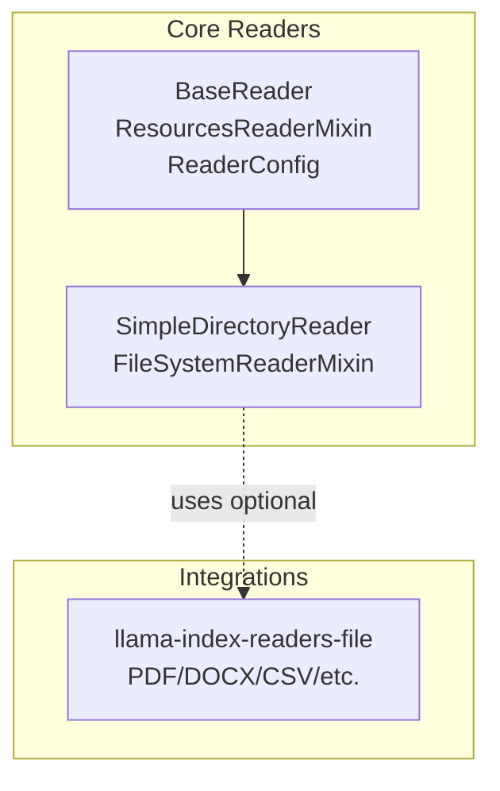
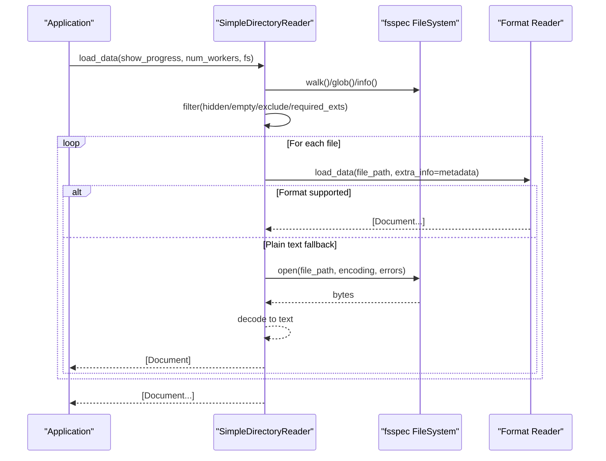
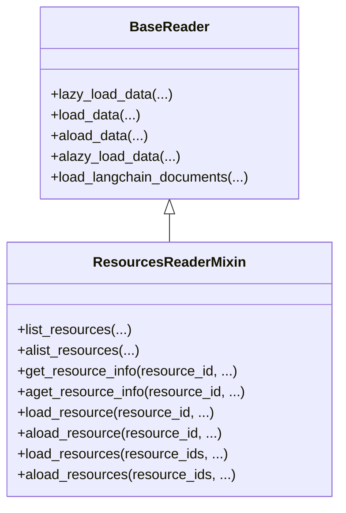
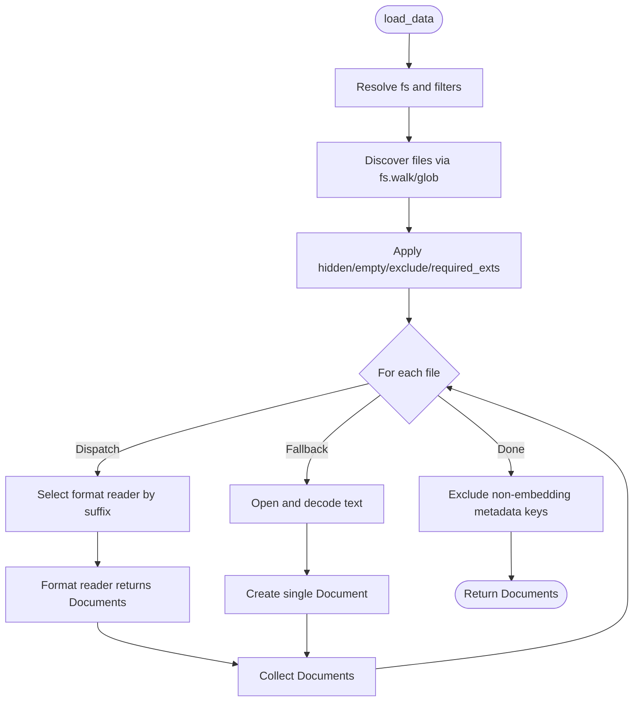
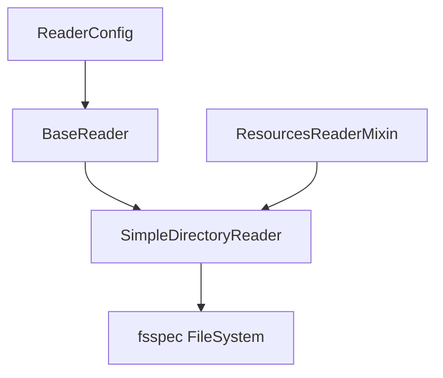

# File System Connectors

<cite>
**Referenced Files in This Document**
- [__init__.py](file://llama-index-core/llama_index/core/readers/__init__.py)
- [base.py](file://llama-index-core/llama_index/core/readers/base.py)
- [base.py](file://llama-index-core/llama_index/core/readers/file/base.py)
- [__init__.py](file://llama-index-integrations/readers/llama-index-readers-file/llama_index/readers/file/__init__.py)
- [test_base.py](file://llama-index-core/tests/readers/file/test_base.py)
</cite>

## Table of Contents
1. [Introduction](#introduction)
2. [Project Structure](#project-structure)
3. [Core Components](#core-components)
4. [Architecture Overview](#architecture-overview)
5. [Detailed Component Analysis](#detailed-component-analysis)
6. [Dependency Analysis](#dependency-analysis)
7. [Performance Considerations](#performance-considerations)
8. [Troubleshooting Guide](#troubleshooting-guide)
9. [Conclusion](#conclusion)
10. [Appendices](#appendices)

## Introduction
This document describes the file system connectors in the LlamaIndex ecosystem with a focus on:
- Local file readers and directory traversal
- Cloud and distributed storage integration via the fsspec abstraction
- Reader interface implementations and configuration
- Authentication and backend selection
- File format handling and data transformation
- API specifications for file operations, pagination, incremental updates, and bulk processing
- Error handling and performance optimization techniques
- Examples of reading various formats (PDF, DOCX, CSV, JSON) and handling large files
- Guidance for implementing custom file system readers

## Project Structure
The file system connectors are primarily implemented in the core readers module and extended by optional integrations for richer file format support.

Key areas:
- Core readers API and base abstractions
- Local directory reader with format-specific extraction
- Optional integrations for additional file formats (PDF, DOCX, CSV, etc.)

**Diagram sources**
- [base.py](file://llama-index-core/llama_index/core/readers/base.py#L19-L250)
- [base.py](file://llama-index-core/llama_index/core/readers/file/base.py#L208-L800)
- [__init__.py](file://llama-index-integrations/readers/llama-index-readers-file/llama_index/readers/file/__init__.py#L1-L50)

**Section sources**
- [__init__.py](file://llama-index-core/llama_index/core/readers/__init__.py#L14-L32)
- [base.py](file://llama-index-core/llama_index/core/readers/base.py#L19-L250)
- [base.py](file://llama-index-core/llama_index/core/readers/file/base.py#L208-L800)
- [__init__.py](file://llama-index-integrations/readers/llama-index-readers-file/llama_index/readers/file/__init__.py#L1-L50)

## Core Components
- BaseReader: Defines synchronous and asynchronous loading APIs, plus LangChain interoperability helpers.
- ResourcesReaderMixin: Adds resource listing, metadata retrieval, and per-resource loading.
- ReaderConfig: Encapsulates a reader instance and its arguments for serialization and reuse.
- SimpleDirectoryReader: A directory-based reader that discovers files, filters them, and delegates to format-specific readers or falls back to plain text.
- FileSystemReaderMixin: Provides a hook to read raw file bytes from any fsspec-compatible filesystem.

These components form the backbone of file ingestion across local and remote storage systems.

**Section sources**
- [base.py](file://llama-index-core/llama_index/core/readers/base.py#L19-L250)
- [base.py](file://llama-index-core/llama_index/core/readers/file/base.py#L38-L66)
- [base.py](file://llama-index-core/llama_index/core/readers/file/base.py#L208-L800)

## Architecture Overview
The connector architecture separates concerns:
- Abstraction: BaseReader and ResourcesReaderMixin define the contract for data loaders.
- Discovery: SimpleDirectoryReader enumerates files via fsspec and applies filters.
- Dispatch: Format-specific readers are selected by file suffix; otherwise, a fallback plain text loader is used.
- Storage: fsspec enables pluggable filesystems (local, S3, GCS, Azure Blob, etc.) behind a unified API.

**Diagram sources**
- [base.py](file://llama-index-core/llama_index/core/readers/file/base.py#L718-L800)
- [base.py](file://llama-index-core/llama_index/core/readers/file/base.py#L554-L716)

## Detailed Component Analysis

### BaseReader and ResourcesReaderMixin
- BaseReader provides:
  - lazy_load_data, load_data, aload_data, alazy_load_data
  - load_langchain_documents for interoperability
- ResourcesReaderMixin adds:
  - list_resources, alist_resources
  - get_resource_info, aget_resource_info
  - load_resource, aload_resource
  - load_resources, aload_resources

These methods enable:
- Resource-centric operations (listing and fetching specific files)
- Async-friendly patterns
- Metadata enrichment per resource

**Diagram sources**
- [base.py](file://llama-index-core/llama_index/core/readers/base.py#L19-L250)

**Section sources**
- [base.py](file://llama-index-core/llama_index/core/readers/base.py#L19-L250)

### ReaderConfig
- Encapsulates a reader instance and its arguments
- Provides to_dict and read for serialization and execution

Usage pattern:
- Build ReaderConfig(reader=SomeReader(...), reader_args=[...], reader_kwargs={...})
- Call read() to execute

**Section sources**
- [base.py](file://llama-index-core/llama_index/core/readers/base.py#L223-L250)

### FileSystemReaderMixin and SimpleDirectoryReader
- FileSystemReaderMixin defines read_file_content for raw byte retrieval
- SimpleDirectoryReader integrates:
  - Directory discovery via fsspec
  - Filtering (hidden, empty, excluded globs, required extensions)
  - Format dispatch via file suffix
  - Fallback plain text loader
  - Metadata extraction (file_path, file_name, file_type, file_size, timestamps)
  - Async and parallel loading
  - Resource listing and per-resource info

Key capabilities:
- Pagination: controlled by num_files_limit and iteration over discovered files
- Incremental updates: list_resources and get_resource_info enable targeted reloads
- Bulk processing: parallel worker support via multiprocessing Pool
- Distributed storage: fs parameter accepts any fsspec filesystem (e.g., S3, GCS, Azure Blob)

**Diagram sources**
- [base.py](file://llama-index-core/llama_index/core/readers/file/base.py#L718-L800)
- [base.py](file://llama-index-core/llama_index/core/readers/file/base.py#L434-L468)

**Section sources**
- [base.py](file://llama-index-core/llama_index/core/readers/file/base.py#L38-L66)
- [base.py](file://llama-index-core/llama_index/core/readers/file/base.py#L208-L800)

### File Format Readers Integration
The optional integration package provides a broad set of format readers:
- PDF, DOCX, EPUB, PPTX, images, notebooks, CSV/Excel, video/audio, XML, Markdown, HTML, mbox, RTF, and more

Selection logic:
- SimpleDirectoryReader attempts to load via a format reader based on file suffix
- If unavailable, it falls back to plain text decoding

**Section sources**
- [__init__.py](file://llama-index-integrations/readers/llama-index-readers-file/llama_index/readers/file/__init__.py#L1-L50)
- [base.py](file://llama-index-core/llama_index/core/readers/file/base.py#L68-L114)
- [base.py](file://llama-index-core/llama_index/core/readers/file/base.py#L590-L646)

## Dependency Analysis
- SimpleDirectoryReader depends on:
  - fsspec for filesystem abstraction
  - Optional format readers from the integration package
  - Core Document schema and async utilities
- BaseReader and ResourcesReaderMixin are foundational and used by all readers
- ReaderConfig composes a reader instance and its arguments

**Diagram sources**
- [base.py](file://llama-index-core/llama_index/core/readers/base.py#L19-L250)
- [base.py](file://llama-index-core/llama_index/core/readers/file/base.py#L208-L800)

**Section sources**
- [base.py](file://llama-index-core/llama_index/core/readers/base.py#L19-L250)
- [base.py](file://llama-index-core/llama_index/core/readers/file/base.py#L208-L800)

## Performance Considerations
- Parallel loading: Use num_workers > 1 to process files concurrently; the implementation bounds it to CPU count and warns if exceeded.
- Progress reporting: show_progress toggles tqdm output during load_data.
- Metadata filtering: _exclude_metadata reduces metadata footprint for embedding and LLM prompts.
- Large files: Prefer format readers optimized for the format (e.g., PDF) to avoid full-text parsing overhead; leverage chunking strategies at the parser level.
- Remote filesystems: Choose appropriate fsspec implementations (e.g., s3fs, gcsfs, adlfs) and tune connection/session settings externally.

[No sources needed since this section provides general guidance]

## Troubleshooting Guide
Common issues and resolutions:
- Missing optional format readers: If the integration package is not installed, certain formats will not be available; the loader logs a warning and falls back to plain text.
- File not found or invalid path: Validation raises errors when input_dir/input_files do not exist.
- Empty or hidden files: By default, empty and hidden files are skipped; adjust flags if needed.
- Encoding errors: Configure encoding and errors behavior; errors="ignore" skips problematic sequences while raise_on_error=True propagates exceptions.
- Remote filesystems: Ensure the fs parameter is set to a compatible fsspec filesystem and credentials are configured appropriately for the backend.

**Section sources**
- [base.py](file://llama-index-core/llama_index/core/readers/file/base.py#L270-L272)
- [base.py](file://llama-index-core/llama_index/core/readers/file/base.py#L293-L296)
- [base.py](file://llama-index-core/llama_index/core/readers/file/base.py#L614-L626)
- [base.py](file://llama-index-core/llama_index/core/readers/file/base.py#L688-L696)

## Conclusion
The file system connectors provide a robust, extensible framework for ingesting diverse file formats from local and remote storage systems. By leveraging fsspec, BaseReader abstractions, and optional format readers, applications can implement efficient, scalable ingestion pipelines with strong defaults and flexible configuration.

[No sources needed since this section summarizes without analyzing specific files]

## Appendices

### API Specifications

- BaseReader
  - Methods: lazy_load_data, load_data, aload_data, alazy_load_data, load_langchain_documents
  - Async pattern: Methods are provided in both sync and async variants; async variants default to threaded execution unless overridden

- ResourcesReaderMixin
  - list_resources, alist_resources
  - get_resource_info, aget_resource_info
  - load_resource, aload_resource
  - load_resources, aload_resources

- ReaderConfig
  - Attributes: reader, reader_args, reader_kwargs
  - Methods: to_dict, read

- SimpleDirectoryReader
  - Constructor parameters:
    - input_dir, input_files, exclude, exclude_hidden, exclude_empty, encoding, errors, recursive, filename_as_id, required_exts, file_extractor, num_files_limit, file_metadata, raise_on_error, fs
  - Methods:
    - load_data(show_progress=False, num_workers=None, fs=None)
    - aload_data(show_progress=False, num_workers=None, fs=None)
    - list_resources, get_resource_info, load_resource, aload_resource
    - read_file_content(input_file, fs=None)
  - Behavior:
    - Discovers files via fsspec
    - Filters hidden/empty/excluded/unsupported extensions
    - Dispatches to format readers by suffix or falls back to plain text
    - Supports parallel loading and progress reporting

- FileSystemReaderMixin
  - read_file_content(input_file, **kwargs) -> bytes
  - aread_file_content(input_file, **kwargs) -> bytes

- Optional Integration Readers (selected)
  - PDF/DOCX/EPUB/PPTX/CSV/Excel/Images/Notebooks/Video/Audio/XML/Markdown/HTML/mbox/RTF and more

**Section sources**
- [base.py](file://llama-index-core/llama_index/core/readers/base.py#L19-L250)
- [base.py](file://llama-index-core/llama_index/core/readers/file/base.py#L208-L800)
- [__init__.py](file://llama-index-integrations/readers/llama-index-readers-file/llama_index/readers/file/__init__.py#L1-L50)

### Configuration Options by Backend

- Local filesystem
  - fs: fsspec AbstractFileSystem (default: LocalFileSystem)
  - encoding, errors: Text decoding behavior
  - filename_as_id: Use filename as document id

- Cloud/Distributed storage (via fsspec)
  - fs: s3fs.S3FileSystem, gcsfs.GCSFileSystem, adl.AzureBlobFileSystem, etc.
  - Credentials: Provided via environment variables, IAM roles, service accounts, or explicit credentials depending on backend
  - Example backends:
    - S3: s3fs
    - Google Cloud Storage: gcsfs
    - Azure Blob: adlfs

- Format-specific readers
  - file_extractor: Dict[str, BaseReader] to override or extend format dispatch
  - file_metadata: Callable to enrich Document metadata

**Section sources**
- [base.py](file://llama-index-core/llama_index/core/readers/file/base.py#L249-L302)
- [base.py](file://llama-index-core/llama_index/core/readers/file/base.py#L547-L553)

### Examples and Patterns

- Reading various formats
  - PDF, DOCX, EPUB, PPTX, CSV, Excel, Images, Notebooks, Video/Audio, XML, Markdown, HTML, mbox, RTF
  - Selection is automatic by file suffix; custom readers can be injected via file_extractor

- Handling large files
  - Use format readers optimized for large inputs
  - Enable parallel loading with num_workers
  - Consider chunking at the node parser stage

- Implementing custom file system readers
  - Implement BaseReader or extend SimpleDirectoryReader
  - Provide read_file_content for raw bytes if needed
  - Register format readers in file_extractor keyed by suffix

**Section sources**
- [base.py](file://llama-index-core/llama_index/core/readers/file/base.py#L68-L114)
- [base.py](file://llama-index-core/llama_index/core/readers/file/base.py#L718-L800)
- [base.py](file://llama-index-core/llama_index/core/readers/file/base.py#L547-L553)

### Tests and Validation
- Core tests validate directory discovery, filtering, and resource listing
- Integration tests ensure format readers are available when the optional package is present

**Section sources**
- [test_base.py](file://llama-index-core/tests/readers/file/test_base.py#L1-L200)