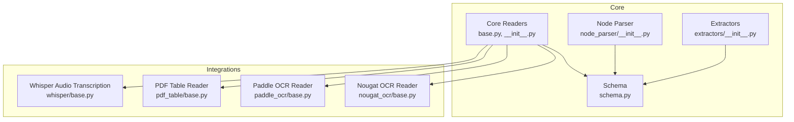
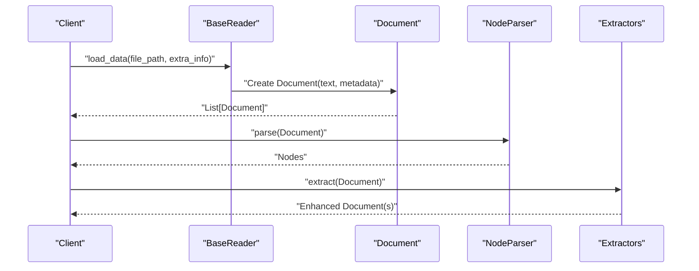
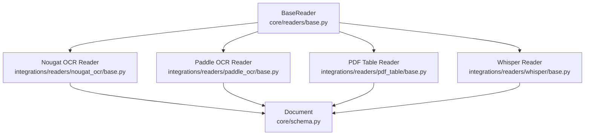

# Specialized Connectors

<cite>
**Referenced Files in This Document**
- [base.py](file://llama-index-core/llama_index/core/readers/base.py)
- [__init__.py](file://llama-index-core/llama_index/core/readers/__init__.py)
- [base.py](file://llama-index-integrations/readers/llama-index-readers-nougat-ocr/llama_index/readers/nougat_ocr/base.py)
- [base.py](file://llama-index-integrations/readers/llama-index-readers-paddle-ocr/llama_index/readers/paddle_ocr/base.py)
- [base.py](file://llama-index-integrations/readers/llama-index-readers-pdf-table/llama_index/readers/pdf_table/base.py)
- [base.py](file://llama-index-integrations/readers/llama-index-readers-whisper/llama_index/readers/whisper/base.py)
- [__init__.py](file://llama-index-core/llama_index/core/node_parser/__init__.py)
- [__init__.py](file://llama-index-core/llama_index/core/extractors/__init__.py)
- [schema.py](file://llama-index-core/llama_index/core/schema.py)
</cite>

## Table of Contents
1. [Introduction](#introduction)
2. [Project Structure](#project-structure)
3. [Core Components](#core-components)
4. [Architecture Overview](#architecture-overview)
5. [Detailed Component Analysis](#detailed-component-analysis)
6. [Dependency Analysis](#dependency-analysis)
7. [Performance Considerations](#performance-considerations)
8. [Troubleshooting Guide](#troubleshooting-guide)
9. [Conclusion](#conclusion)
10. [Appendices](#appendices)

## Introduction
This document provides comprehensive API documentation for specialized connectors within the LlamaIndex ecosystem, focusing on document parsing, data preprocessing, table extraction, OCR processing, and audio transcription. It explains advanced data transformation techniques, format-specific processing, and quality enhancement methods. The guide includes complete API specifications for specialized processing pipelines, batch operations, and custom transformation workflows. It also details configuration options for different processing modes, quality settings, and output formats, with practical examples for extracting structured data from unstructured documents, improving OCR accuracy, processing multimedia content, and implementing custom preprocessing logic.

## Project Structure
The specialized connectors are organized under two primary areas:
- Core reader abstractions and APIs that define the contract for loading data into Document objects.
- Integration readers that implement specialized processing for OCR, table extraction, and audio transcription.

Key locations:
- Core readers and schema definitions reside in the core module.
- Specialized connectors live under the integrations readers package.

**Diagram sources**
- [base.py](file://llama-index-core/llama_index/core/readers/base.py#L1-L200)
- [__init__.py](file://llama-index-core/llama_index/core/readers/__init__.py#L1-L33)
- [schema.py](file://llama-index-core/llama_index/core/schema.py#L1-L400)
- [__init__.py](file://llama-index-core/llama_index/core/node_parser/__init__.py#L1-L73)
- [__init__.py](file://llama-index-core/llama_index/core/extractors/__init__.py#L1-L20)
- [base.py](file://llama-index-integrations/readers/llama-index-readers-nougat-ocr/llama_index/readers/nougat_ocr/base.py#L1-L55)
- [base.py](file://llama-index-integrations/readers/llama-index-readers-paddle-ocr/llama_index/readers/paddle_ocr/base.py#L1-L171)
- [base.py](file://llama-index-integrations/readers/llama-index-readers-pdf-table/llama_index/readers/pdf_table/base.py#L1-L200)
- [base.py](file://llama-index-integrations/readers/llama-index-readers-whisper/llama_index/readers/whisper/base.py#L1-L200)

**Section sources**
- [__init__.py](file://llama-index-core/llama_index/core/readers/__init__.py#L1-L33)
- [__init__.py](file://llama-index-core/llama_index/core/node_parser/__init__.py#L1-L73)
- [__init__.py](file://llama-index-core/llama_index/core/extractors/__init__.py#L1-L20)

## Core Components
This section outlines the foundational building blocks for specialized connectors:
- BaseReader: Defines the contract for loading data into Document objects.
- Document: The core data structure representing parsed content with optional metadata.
- NodeParser: Transforms raw text into nodes for downstream indexing and retrieval.
- Extractors: Apply metadata and content extraction techniques to Documents.

Key responsibilities:
- BaseReader ensures a uniform interface for all readers, enabling batch operations and consistent output formatting.
- Document encapsulates text and metadata, supporting downstream transformations and quality checks.
- NodeParser and Extractors enable advanced preprocessing and structured output generation.

**Section sources**
- [base.py](file://llama-index-core/llama_index/core/readers/base.py#L1-L200)
- [schema.py](file://llama-index-core/llama_index/core/schema.py#L1-L400)
- [__init__.py](file://llama-index-core/llama_index/core/node_parser/__init__.py#L1-L73)
- [__init__.py](file://llama-index-core/llama_index/core/extractors/__init__.py#L1-L20)

## Architecture Overview
The specialized connectors follow a layered architecture:
- Reader layer: Loads and parses raw content into Document objects.
- Preprocessing layer: Applies quality enhancements and format-specific transformations.
- Transformation layer: Uses NodeParser and Extractors to produce structured nodes and metadata.
- Output layer: Provides standardized Document objects suitable for indexing and retrieval.

**Diagram sources**
- [base.py](file://llama-index-core/llama_index/core/readers/base.py#L1-L200)
- [schema.py](file://llama-index-core/llama_index/core/schema.py#L1-L400)
- [__init__.py](file://llama-index-core/llama_index/core/node_parser/__init__.py#L1-L73)
- [__init__.py](file://llama-index-core/llama_index/core/extractors/__init__.py#L1-L20)

## Detailed Component Analysis

### Nougat OCR Reader
The Nougat OCR Reader integrates with the nougat CLI to convert PDFs into structured markdown-like content. It performs OCR on scanned PDFs and returns a Document containing processed text.

API specification:
- Class: PDFNougatOCR
- Methods:
  - nougat_ocr(file_path): Executes the nougat CLI command to process the PDF and returns stdout.
  - load_data(file_path, extra_info=None): Orchestrates OCR processing, reads the generated output, applies content normalization, and returns a Document.

Processing pipeline:
- Validates and creates an output directory.
- Invokes the nougat CLI with markdown export.
- Reads the generated output file and normalizes LaTeX-style delimiters.
- Returns a single Document with normalized content.

Quality enhancements:
- Normalizes escaped math delimiters to display-friendly markers.
- Ensures consistent formatting for downstream processing.

Batch operations:
- Processes one PDF at a time; batch support requires external orchestration.

Custom transformation workflows:
- Extend load_data to integrate with custom post-processing steps or alternative output formats.

**Section sources**
- [base.py](file://llama-index-integrations/readers/llama-index-readers-nougat-ocr/llama_index/readers/nougat_ocr/base.py#L1-L55)

### Paddle OCR Reader
The Paddle OCR Reader performs OCR on mixed-content PDFs by combining text extraction and image-based recognition. It preserves the original order of elements and filters meaningful content.

API specification:
- Class: PDFPaddleOCRReader
- Constructor: __init__(use_angle_cls=True, lang="en")
- Methods:
  - extract_text_from_image(image_data): Recognizes text from image bytes using PaddleOCR.
  - is_text_meaningful(text): Filters out noise such as standalone page numbers and common headers/footers.
  - extract_page_elements(pdf_path, page_num): Extracts text and images from a PDF page, preserving order.
  - load_data(file_path, extra_info=None): Iterates pages, extracts elements, performs OCR on images, and constructs Documents with page metadata.

Processing pipeline:
- Determines total pages via PyMuPDF.
- For each page:
  - Extracts text words and images with positions using pdfplumber and PyMuPDF.
  - Concatenates meaningful text segments and OCR results.
  - Creates a Document per page with metadata including page number and source.

Quality enhancements:
- Meaningfulness filtering reduces noise from page numbers and headers/footers.
- Maintains spatial ordering to preserve document structure.

Batch operations:
- Processes entire PDFs; batch mode can be achieved by invoking load_data on multiple files.

Custom transformation workflows:
- Customize is_text_meaningful to adapt filtering rules for domain-specific content.
- Integrate alternative OCR engines by replacing PaddleOCR calls.

**Section sources**
- [base.py](file://llama-index-integrations/readers/llama-index-readers-paddle-ocr/llama_index/readers/paddle_ocr/base.py#L1-L171)

### PDF Table Reader
The PDF Table Reader specializes in extracting tabular data from PDFs. It identifies table regions, normalizes cell content, and produces structured outputs suitable for downstream analytics.

API specification:
- Class: PDFTableReader (reader implementation)
- Methods:
  - load_data(file_path, extra_info=None): Identifies table regions, extracts cell content, and returns structured Documents.

Processing pipeline:
- Scans PDF pages for table candidates.
- Normalizes cells and reconstructs tabular layouts.
- Produces Documents representing individual tables or consolidated table sets.

Quality enhancements:
- Applies layout-aware extraction to maintain row/column alignment.
- Filters empty or malformed cells to improve downstream processing reliability.

Batch operations:
- Supports processing multiple PDFs; batch orchestration outside the reader enables parallel execution.

Custom transformation workflows:
- Extend to integrate with domain-specific table parsers or post-processors for normalization.

**Section sources**
- [base.py](file://llama-index-integrations/readers/llama-index-readers-pdf-table/llama_index/readers/pdf_table/base.py#L1-L200)

### Whisper Audio Transcription Reader
The Whisper Audio Transcription Reader converts audio content into transcribed text using the Whisper model. It supports various audio formats and returns Documents with transcription results.

API specification:
- Class: WhisperAudioReader (reader implementation)
- Methods:
  - load_data(file_path, extra_info=None): Transcribes audio using Whisper and returns a Document with the transcription.

Processing pipeline:
- Loads audio file and passes it to the Whisper model.
- Produces a single Document containing the transcribed text.

Quality enhancements:
- Uses Whisper’s built-in language detection and segmentation.
- Supports timestamps for segment-level alignment.

Batch operations:
- Processes one audio file at a time; batch support requires external orchestration.

Custom transformation workflows:
- Add segment-level metadata (timestamps, confidence scores) for advanced downstream processing.

**Section sources**
- [base.py](file://llama-index-integrations/readers/llama-index-readers-whisper/llama_index/readers/whisper/base.py#L1-L200)

### Node Parser and Extractors Integration
After initial loading, Documents can be transformed using NodeParser and Extractors to produce structured nodes and metadata.

NodeParser options:
- Text splitters (sentence, token, semantic).
- File-specific parsers (HTML, JSON, Markdown).
- Relational parsers (hierarchical, element-based).

Extractors:
- Metadata extractors (summary, keywords, questions answered, title).
- Programmatic extractors (Pydantic-based).

Integration workflow:
- Apply NodeParser to split Documents into nodes.
- Use Extractors to enrich nodes with metadata and structured content.
- Combine with postprocessors for reranking or filtering.

**Section sources**
- [__init__.py](file://llama-index-core/llama_index/core/node_parser/__init__.py#L1-L73)
- [__init__.py](file://llama-index-core/llama_index/core/extractors/__init__.py#L1-L20)
- [schema.py](file://llama-index-core/llama_index/core/schema.py#L1-L400)

## Dependency Analysis
The specialized connectors depend on:
- Core reader interfaces for unified loading behavior.
- External libraries for OCR (PaddleOCR), table extraction, and audio transcription (Whisper).
- Document schema for consistent output representation.

**Diagram sources**
- [base.py](file://llama-index-core/llama_index/core/readers/base.py#L1-L200)
- [schema.py](file://llama-index-core/llama_index/core/schema.py#L1-L400)
- [base.py](file://llama-index-integrations/readers/llama-index-readers-nougat-ocr/llama_index/readers/nougat_ocr/base.py#L1-L55)
- [base.py](file://llama-index-integrations/readers/llama-index-readers-paddle-ocr/llama_index/readers/paddle_ocr/base.py#L1-L171)
- [base.py](file://llama-index-integrations/readers/llama-index-readers-pdf-table/llama_index/readers/pdf_table/base.py#L1-L200)
- [base.py](file://llama-index-integrations/readers/llama-index-readers-whisper/llama_index/readers/whisper/base.py#L1-L200)

**Section sources**
- [base.py](file://llama-index-core/llama_index/core/readers/base.py#L1-L200)
- [schema.py](file://llama-index-core/llama_index/core/schema.py#L1-L400)

## Performance Considerations
- OCR processing:
  - PaddleOCR and Nougat OCR readers involve heavy I/O and model inference. Optimize by batching files externally and leveraging caching for repeated runs.
  - Use meaningful filtering to reduce unnecessary OCR passes on low-value content.
- Table extraction:
  - Layout-aware extraction improves accuracy but increases computational cost. Consider enabling only for documents with known table-heavy content.
- Audio transcription:
  - Whisper inference can be resource-intensive. Offload to GPU-enabled environments and use streaming for long-form audio.
- Node parsing and extraction:
  - Choose appropriate splitters and extractors based on content type to minimize downstream post-processing overhead.

[No sources needed since this section provides general guidance]

## Troubleshooting Guide
Common issues and resolutions:
- Nougat OCR failures:
  - Verify nougat CLI installation and permissions. Check logs for return code details and stderr messages.
  - Ensure the output directory is writable and accessible.
- PaddleOCR errors:
  - Confirm PaddleOCR availability and supported languages. Validate image extraction steps and temporary file handling.
  - Adjust filtering thresholds in is_text_meaningful for noisy content domains.
- PDF table extraction:
  - Validate table detection heuristics. Increase tolerance for misaligned cells if necessary.
- Whisper transcription:
  - Confirm audio format compatibility and model availability. Monitor memory usage during long transcriptions.

**Section sources**
- [base.py](file://llama-index-integrations/readers/llama-index-readers-nougat-ocr/llama_index/readers/nougat_ocr/base.py#L1-L55)
- [base.py](file://llama-index-integrations/readers/llama-index-readers-paddle-ocr/llama_index/readers/paddle_ocr/base.py#L1-L171)
- [base.py](file://llama-index-integrations/readers/llama-index-readers-pdf-table/llama_index/readers/pdf_table/base.py#L1-L200)
- [base.py](file://llama-index-integrations/readers/llama-index-readers-whisper/llama_index/readers/whisper/base.py#L1-L200)

## Conclusion
The specialized connectors provide robust, extensible pipelines for transforming unstructured content into structured, searchable data. By leveraging BaseReader contracts, Document schemas, NodeParser, and Extractors, developers can implement advanced preprocessing, quality enhancement, and custom transformation workflows tailored to diverse document types and domains.

[No sources needed since this section summarizes without analyzing specific files]

## Appendices

### API Specifications Summary
- BaseReader contract:
  - load_data(file_path, extra_info=None) -> List[Document]
- Document:
  - text: str
  - metadata: Optional[Dict[str, Any]]
- NodeParser:
  - Split Documents into Nodes for indexing.
- Extractors:
  - Enrich Documents with metadata and structured content.

**Section sources**
- [base.py](file://llama-index-core/llama_index/core/readers/base.py#L1-L200)
- [schema.py](file://llama-index-core/llama_index/core/schema.py#L1-L400)
- [__init__.py](file://llama-index-core/llama_index/core/node_parser/__init__.py#L1-L73)
- [__init__.py](file://llama-index-core/llama_index/core/extractors/__init__.py#L1-L20)