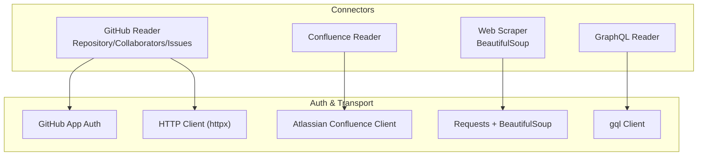
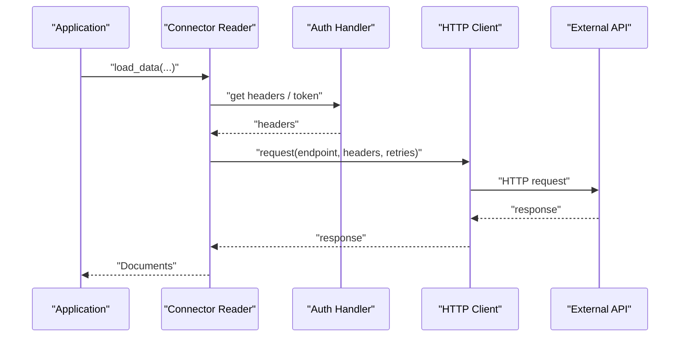
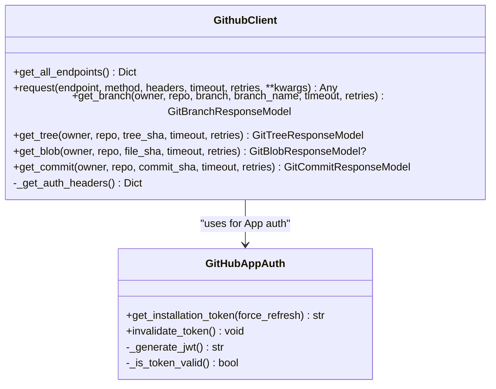
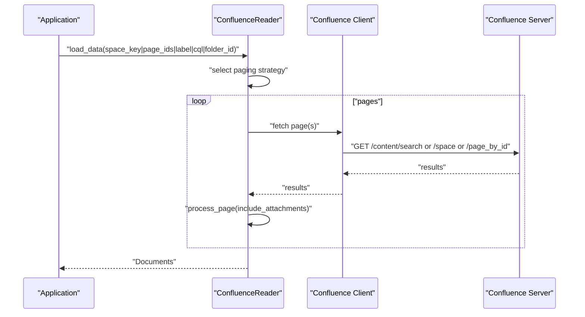
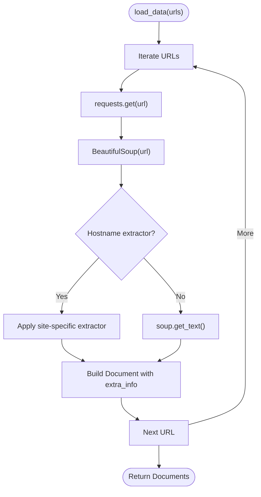
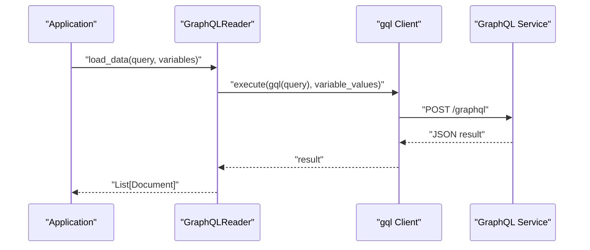
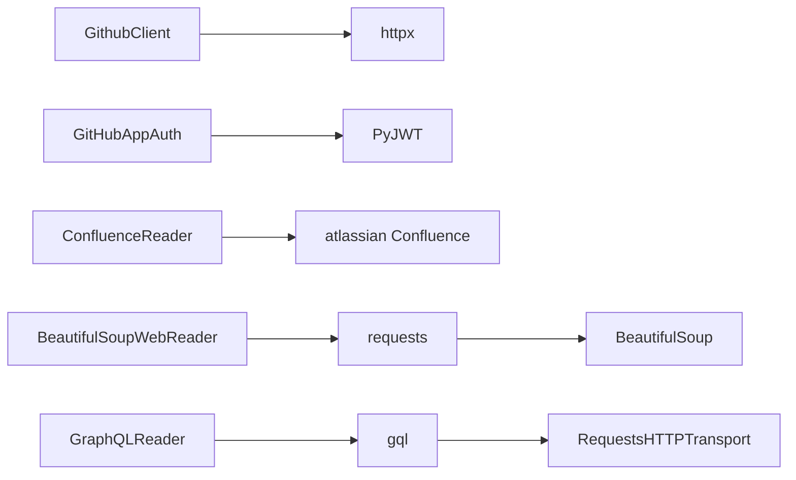

# Web and API Connectors

<cite>
**Referenced Files in This Document**
- [github/__init__.py](file://llama-index-integrations/readers/llama-index-readers-github/llama_index/readers/github/__init__.py)
- [github_app_auth.py](file://llama-index-integrations/readers/llama-index-readers-github/llama_index/readers/github/github_app_auth.py)
- [github_client.py](file://llama-index-integrations/readers/llama-index-readers-github/llama_index/readers/github/repository/github_client.py)
- [confluence/base.py](file://llama-index-integrations/readers/llama-index-readers-confluence/llama_index/readers/confluence/base.py)
- [beautiful_soup_web/base.py](file://llama-index-integrations/readers/llama-index-readers-web/llama_index/readers/web/beautiful_soup_web/base.py)
- [graphql/base.py](file://llama-index-integrations/readers/llama-index-readers-graphql/llama_index/readers/graphql/base.py)
</cite>

## Table of Contents
1. [Introduction](#introduction)
2. [Project Structure](#project-structure)
3. [Core Components](#core-components)
4. [Architecture Overview](#architecture-overview)
5. [Detailed Component Analysis](#detailed-component-analysis)
6. [Dependency Analysis](#dependency-analysis)
7. [Performance Considerations](#performance-considerations)
8. [Troubleshooting Guide](#troubleshooting-guide)
9. [Conclusion](#conclusion)

## Introduction
This document provides comprehensive API documentation for web and API connectors in the LlamaIndex ecosystem. It focuses on:
- GitHub repositories: repository data retrieval, collaborators, issues, and GitHub App authentication
- Confluence: OAuth, API tokens, cookies, and basic auth; pagination and filtering
- Web scraping: BeautifulSoup-based extraction with site-specific helpers
- GraphQL APIs: query execution and response handling
- Search engines: connector patterns and best practices

It covers authentication methods (OAuth, API keys, tokens), rate limiting, pagination handling, data filtering, error handling, retry strategies, and performance optimization for API integrations.

## Project Structure
The connectors are organized by domain and technology:
- GitHub: readers for repository, collaborators, issues, and GitHub App authentication
- Confluence: a single reader supporting multiple auth modes and robust pagination
- Web: BeautifulSoup-based web reader with site-specific extractors
- GraphQL: a lightweight GraphQL reader leveraging gql
- Search engines: connector patterns are covered conceptually

**Diagram sources**
- [github_client.py](file://llama-index-integrations/readers/llama-index-readers-github/llama_index/readers/github/repository/github_client.py#L206-L320)
- [github_app_auth.py](file://llama-index-integrations/readers/llama-index-readers-github/llama_index/readers/github/github_app_auth.py#L22-L102)
- [confluence/base.py](file://llama-index-integrations/readers/llama-index-readers-confluence/llama_index/readers/confluence/base.py#L173-L226)
- [beautiful_soup_web/base.py](file://llama-index-integrations/readers/llama-index-readers-web/llama_index/readers/web/beautiful_soup_web/base.py#L136-L161)
- [graphql/base.py](file://llama-index-integrations/readers/llama-index-readers-graphql/llama_index/readers/graphql/base.py#L10-L41)

**Section sources**
- [github/__init__.py](file://llama-index-integrations/readers/llama-index-readers-github/llama_index/readers/github/__init__.py#L1-L40)
- [github_client.py](file://llama-index-integrations/readers/llama-index-readers-github/llama_index/readers/github/repository/github_client.py#L206-L320)
- [confluence/base.py](file://llama-index-integrations/readers/llama-index-readers-confluence/llama_index/readers/confluence/base.py#L75-L129)
- [beautiful_soup_web/base.py](file://llama-index-integrations/readers/llama-index-readers-web/llama_index/readers/web/beautiful_soup_web/base.py#L136-L161)
- [graphql/base.py](file://llama-index-integrations/readers/llama-index-readers-graphql/llama_index/readers/graphql/base.py#L10-L41)

## Core Components
- GitHub Reader and Client
  - Supports Personal Access Token (PAT) and GitHub App authentication
  - Provides endpoints for branches, trees, blobs, and commits
  - Handles token caching and refresh with automatic expiry buffer
- Confluence Reader
  - Supports OAuth 2.0, API token, cookies, and basic auth
  - Robust pagination via cursors and batched requests
  - Rich filtering by space, labels, CQL, and page IDs
- Web Scraper (BeautifulSoup)
  - Generic page extraction plus site-specific helpers (Substack, ReadTheDocs, ReadMe, GitBook)
  - Configurable hostname mapping and URL inclusion in text
- GraphQL Reader
  - Executes queries with optional variables and converts results to Documents

**Section sources**
- [github_client.py](file://llama-index-integrations/readers/llama-index-readers-github/llama_index/readers/github/repository/github_client.py#L206-L320)
- [github_app_auth.py](file://llama-index-integrations/readers/llama-index-readers-github/llama_index/readers/github/github_app_auth.py#L22-L102)
- [confluence/base.py](file://llama-index-integrations/readers/llama-index-readers-confluence/llama_index/readers/confluence/base.py#L75-L129)
- [beautiful_soup_web/base.py](file://llama-index-integrations/readers/llama-index-readers-web/llama_index/readers/web/beautiful_soup_web/base.py#L136-L161)
- [graphql/base.py](file://llama-index-integrations/readers/llama-index-readers-graphql/llama_index/readers/graphql/base.py#L10-L41)

## Architecture Overview
The connectors follow a layered pattern:
- Reader layer: public APIs for loading data
- Authentication layer: token management and headers
- Transport layer: HTTP clients and SDKs
- Parsing/Extraction layer: response parsing and content extraction

**Diagram sources**
- [github_client.py](file://llama-index-integrations/readers/llama-index-readers-github/llama_index/readers/github/repository/github_client.py#L347-L410)
- [github_app_auth.py](file://llama-index-integrations/readers/llama-index-readers-github/llama_index/readers/github/github_app_auth.py#L129-L191)
- [confluence/base.py](file://llama-index-integrations/readers/llama-index-readers-confluence/llama_index/readers/confluence/base.py#L545-L547)
- [graphql/base.py](file://llama-index-integrations/readers/llama-index-readers-graphql/llama_index/readers/graphql/base.py#L42-L73)

## Detailed Component Analysis

### GitHub Connector
- Authentication
  - PAT: passed via constructor or environment variable
  - GitHub App: uses JWT to obtain installation access tokens with caching and expiry buffer
- Endpoints
  - Branch, Tree, Blob, Commit with typed response models
- Pagination and Rate Limiting
  - No explicit pagination loop in client methods; rely on caller batching
  - Token refresh mitigates rate-limit impacts for App auth
- Error Handling and Retries
  - HTTP exceptions raised by default; configurable fail flag
  - Retry transport configured via httpx.AsyncClient
- Performance
  - Async HTTP client; token caching reduces overhead

**Diagram sources**
- [github_client.py](file://llama-index-integrations/readers/llama-index-readers-github/llama_index/readers/github/repository/github_client.py#L206-L320)
- [github_client.py](file://llama-index-integrations/readers/llama-index-readers-github/llama_index/readers/github/repository/github_client.py#L347-L410)
- [github_app_auth.py](file://llama-index-integrations/readers/llama-index-readers-github/llama_index/readers/github/github_app_auth.py#L22-L102)
- [github_app_auth.py](file://llama-index-integrations/readers/llama-index-readers-github/llama_index/readers/github/github_app_auth.py#L129-L191)

**Section sources**
- [github_client.py](file://llama-index-integrations/readers/llama-index-readers-github/llama_index/readers/github/repository/github_client.py#L206-L320)
- [github_client.py](file://llama-index-integrations/readers/llama-index-readers-github/llama_index/readers/github/repository/github_client.py#L347-L410)
- [github_client.py](file://llama-index-integrations/readers/llama-index-readers-github/llama_index/readers/github/repository/github_client.py#L411-L582)
- [github_app_auth.py](file://llama-index-integrations/readers/llama-index-readers-github/llama_index/readers/github/github_app_auth.py#L22-L102)
- [github_app_auth.py](file://llama-index-integrations/readers/llama-index-readers-github/llama_index/readers/github/github_app_auth.py#L129-L191)

### Confluence Connector
- Authentication
  - OAuth 2.0 (client credentials), API token, cookies, or basic auth
  - Environment variable fallbacks supported
- Filtering and Pagination
  - Filter by space, page IDs, label, folder, or CQL
  - Cursor-based pagination for CQL; batched paging for spaces
- Error Handling and Retries
  - Per-request retry decorator for transient failures
  - Event instrumentation for page and attachment processing
- Performance
  - DFS traversal for nested pages when requested
  - Optional custom parsers for attachments

**Diagram sources**
- [confluence/base.py](file://llama-index-integrations/readers/llama-index-readers-confluence/llama_index/readers/confluence/base.py#L240-L421)
- [confluence/base.py](file://llama-index-integrations/readers/llama-index-readers-confluence/llama_index/readers/confluence/base.py#L474-L537)
- [confluence/base.py](file://llama-index-integrations/readers/llama-index-readers-confluence/llama_index/readers/confluence/base.py#L545-L547)

**Section sources**
- [confluence/base.py](file://llama-index-integrations/readers/llama-index-readers-confluence/llama_index/readers/confluence/base.py#L75-L129)
- [confluence/base.py](file://llama-index-integrations/readers/llama-index-readers-confluence/llama_index/readers/confluence/base.py#L240-L421)
- [confluence/base.py](file://llama-index-integrations/readers/llama-index-readers-confluence/llama_index/readers/confluence/base.py#L474-L537)
- [confluence/base.py](file://llama-index-integrations/readers/llama-index-readers-confluence/llama_index/readers/confluence/base.py#L545-L547)

### Web Scraper (BeautifulSoup)
- Behavior
  - Loads pages from URLs, applies site-specific extractors when available, falls back to generic text extraction
  - Supports custom hostname mapping and optional URL inclusion in extracted text
- Extensibility
  - Add new extractors via website_extractor mapping
- Performance
  - Uses requests + BeautifulSoup; consider concurrency at the caller level for bulk scraping

**Diagram sources**
- [beautiful_soup_web/base.py](file://llama-index-integrations/readers/llama-index-readers-web/llama_index/readers/web/beautiful_soup_web/base.py#L162-L212)

**Section sources**
- [beautiful_soup_web/base.py](file://llama-index-integrations/readers/llama-index-readers-web/llama_index/readers/web/beautiful_soup_web/base.py#L136-L161)
- [beautiful_soup_web/base.py](file://llama-index-integrations/readers/llama-index-readers-web/llama_index/readers/web/beautiful_soup_web/base.py#L162-L212)

### GraphQL Connector
- Behavior
  - Initializes a gql client with HTTP transport and optional headers
  - Executes a query with variables and flattens results into Documents
- Usage
  - Suitable for REST-to-GraphQL adapters or direct GraphQL endpoints

**Diagram sources**
- [graphql/base.py](file://llama-index-integrations/readers/llama-index-readers-graphql/llama_index/readers/graphql/base.py#L42-L73)

**Section sources**
- [graphql/base.py](file://llama-index-integrations/readers/llama-index-readers-graphql/llama_index/readers/graphql/base.py#L10-L41)
- [graphql/base.py](file://llama-index-integrations/readers/llama-index-readers-graphql/llama_index/readers/graphql/base.py#L42-L73)

## Dependency Analysis
- GitHub
  - Depends on httpx for async HTTP and optional PyJWT for GitHub App JWT generation
  - Token caching avoids repeated token exchanges
- Confluence
  - Depends on atlassian python API client; supports multiple auth modes
  - Uses retrying for transient failures
- Web
  - Depends on requests and BeautifulSoup; optional OCR-related packages for attachments
- GraphQL
  - Depends on gql and requests transport

**Diagram sources**
- [github_client.py](file://llama-index-integrations/readers/llama-index-readers-github/llama_index/readers/github/repository/github_client.py#L384-L409)
- [github_app_auth.py](file://llama-index-integrations/readers/llama-index-readers-github/llama_index/readers/github/github_app_auth.py#L12-L15)
- [confluence/base.py](file://llama-index-integrations/readers/llama-index-readers-confluence/llama_index/readers/confluence/base.py#L173-L178)
- [beautiful_soup_web/base.py](file://llama-index-integrations/readers/llama-index-readers-web/llama_index/readers/web/beautiful_soup_web/base.py#L183-L184)
- [graphql/base.py](file://llama-index-integrations/readers/llama-index-readers-graphql/llama_index/readers/graphql/base.py#L28-L40)

**Section sources**
- [github_client.py](file://llama-index-integrations/readers/llama-index-readers-github/llama_index/readers/github/repository/github_client.py#L384-L409)
- [github_app_auth.py](file://llama-index-integrations/readers/llama-index-readers-github/llama_index/readers/github/github_app_auth.py#L12-L15)
- [confluence/base.py](file://llama-index-integrations/readers/llama-index-readers-confluence/llama_index/readers/confluence/base.py#L173-L178)
- [beautiful_soup_web/base.py](file://llama-index-integrations/readers/llama-index-readers-web/llama_index/readers/web/beautiful_soup_web/base.py#L183-L184)
- [graphql/base.py](file://llama-index-integrations/readers/llama-index-readers-graphql/llama_index/readers/graphql/base.py#L28-L40)

## Performance Considerations
- Asynchronous HTTP
  - Use async-capable clients (httpx) to overlap I/O-bound operations
- Token caching
  - GitHub App tokens are cached and refreshed before expiry to reduce latency and avoid throttling
- Pagination
  - Batch requests and leverage cursors to minimize round trips
- Concurrency
  - Apply external concurrency at the caller level for bulk operations (e.g., multiple URLs, page IDs)
- Retry strategy
  - Configure retries via transport and use retry decorators for transient failures
- Extraction efficiency
  - Prefer targeted selectors and avoid unnecessary DOM traversals in custom scrapers

[No sources needed since this section provides general guidance]

## Troubleshooting Guide
- GitHub
  - Missing PyJWT or httpx: install required extras for GitHub App or HTTP client
  - Invalid app_id/private_key/installation_id: ensure correct values and PEM format
  - Token refresh failures: check network connectivity and API permissions
- Confluence
  - Missing atlassian package: install the required client
  - Invalid auth parameters: ensure one of OAuth, API token, cookies, or basic auth is provided
  - Paging issues: verify cursor handling and CQL correctness
- Web Scraper
  - Missing requests or BeautifulSoup: install required packages
  - Site-specific extractor not applied: confirm hostname mapping and URL structure
- GraphQL
  - Missing gql: install the GraphQL client
  - Schema fetch failures: ensure URI is reachable and headers are correct

**Section sources**
- [github_app_auth.py](file://llama-index-integrations/readers/llama-index-readers-github/llama_index/readers/github/github_app_auth.py#L81-L85)
- [github_client.py](file://llama-index-integrations/readers/llama-index-readers-github/llama_index/readers/github/repository/github_client.py#L384-L389)
- [confluence/base.py](file://llama-index-integrations/readers/llama-index-readers-confluence/llama_index/readers/confluence/base.py#L175-L178)
- [beautiful_soup_web/base.py](file://llama-index-integrations/readers/llama-index-readers-web/llama_index/readers/web/beautiful_soup_web/base.py#L183-L184)
- [graphql/base.py](file://llama-index-integrations/readers/llama-index-readers-graphql/llama_index/readers/graphql/base.py#L32-L33)

## Conclusion
These connectors provide robust, extensible integration points for GitHub, Confluence, web scraping, and GraphQL. They emphasize:
- Clear authentication options with secure token management
- Flexible pagination and filtering
- Resilient error handling and retry strategies
- Practical performance optimizations through async I/O and caching

Adopt the connector patterns outlined here to integrate diverse data sources efficiently and reliably.