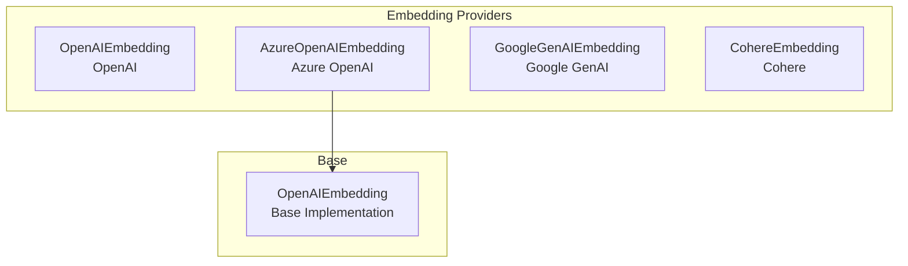
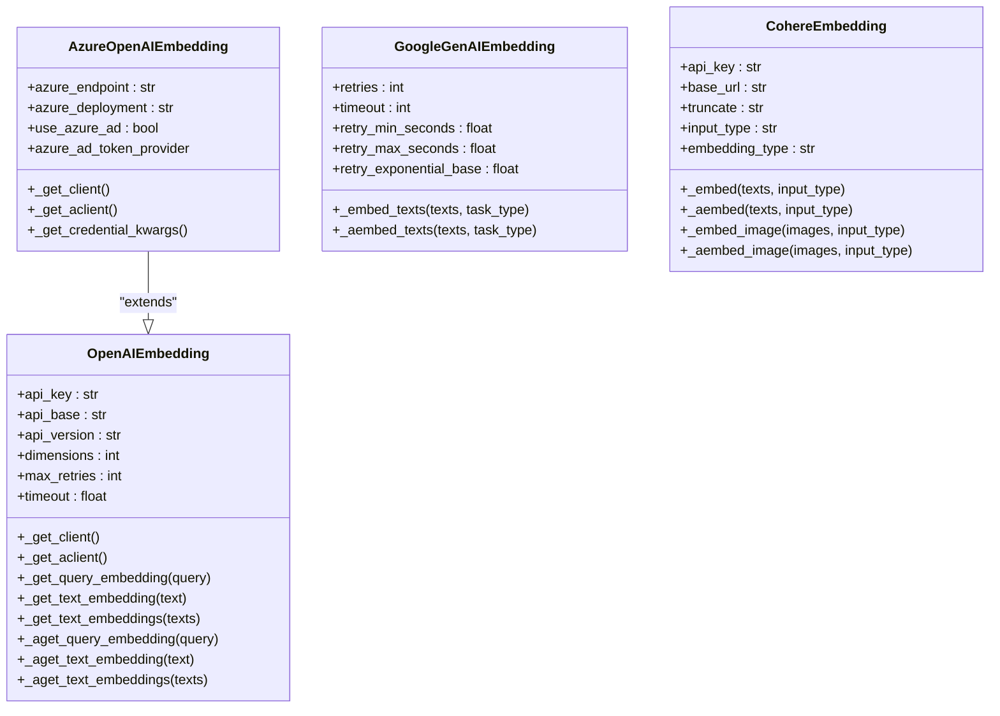
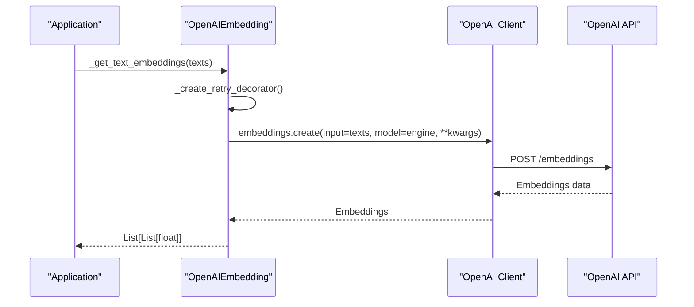
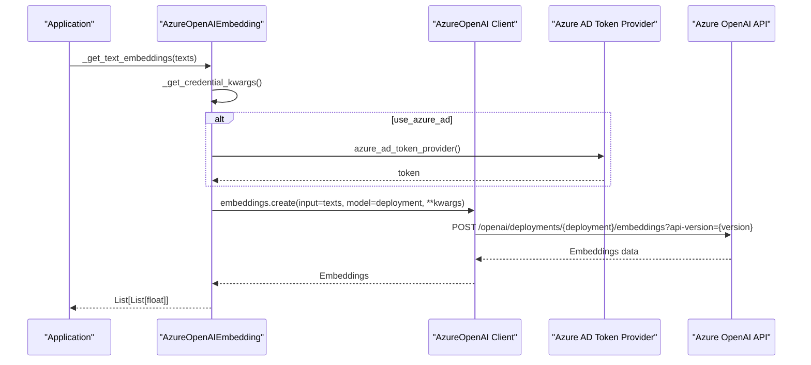
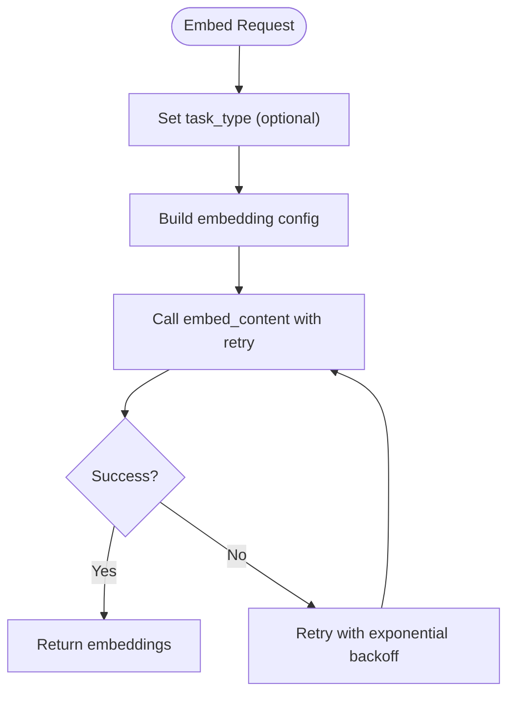
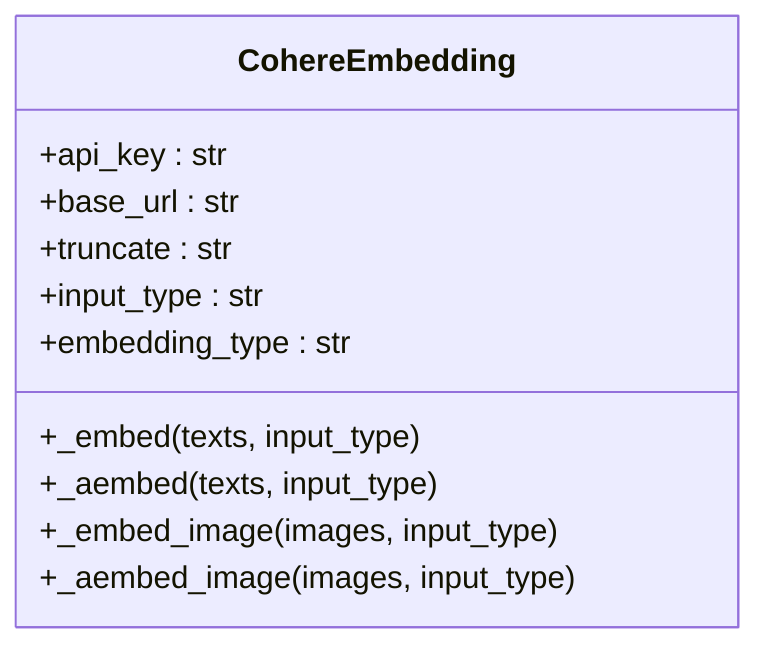
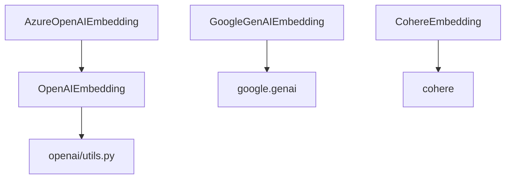

# Cloud Provider Embeddings

<cite>
**Referenced Files in This Document**
- [openai/__init__.py](file://llama-index-integrations/embeddings/llama-index-embeddings-openai/llama_index/embeddings/openai/__init__.py)
- [openai/base.py](file://llama-index-integrations/embeddings/llama-index-embeddings-openai/llama_index/embeddings/openai/base.py)
- [openai/utils.py](file://llama-index-integrations/embeddings/llama-index-embeddings-openai/llama_index/embeddings/openai/utils.py)
- [azure_openai/__init__.py](file://llama-index-integrations/embeddings/llama-index-embeddings-azure-openai/llama_index/embeddings/azure_openai/__init__.py)
- [azure_openai/base.py](file://llama-index-integrations/embeddings/llama-index-embeddings-azure-openai/llama_index/embeddings/azure_openai/base.py)
- [google_genai/__init__.py](file://llama-index-integrations/embeddings/llama-index-embeddings-google-genai/llama_index/embeddings/google_genai/__init__.py)
- [google_genai/base.py](file://llama-index-integrations/embeddings/llama-index-embeddings-google-genai/llama_index/embeddings/google_genai/base.py)
- [cohere/__init__.py](file://llama-index-integrations/embeddings/llama-index-embeddings-cohere/llama_index/embeddings/cohere/__init__.py)
- [cohere/base.py](file://llama-index-integrations/embeddings/llama-index-embeddings-cohere/llama_index/embeddings/cohere/base.py)
</cite>

## Table of Contents
1. [Introduction](#introduction)
2. [Project Structure](#project-structure)
3. [Core Components](#core-components)
4. [Architecture Overview](#architecture-overview)
5. [Detailed Component Analysis](#detailed-component-analysis)
6. [Dependency Analysis](#dependency-analysis)
7. [Performance Considerations](#performance-considerations)
8. [Troubleshooting Guide](#troubleshooting-guide)
9. [Conclusion](#conclusion)

## Introduction
This document provides detailed API documentation for cloud-based embedding providers integrated in the repository. It covers OpenAI embeddings, Azure OpenAI embeddings, Google GenAI embeddings, and Cohere embeddings. The focus areas include authentication setup, API key management, regional endpoints, pricing and rate limit considerations, quota management, model selection, dimension options, quality tiers, batch processing, error handling, retry mechanisms, troubleshooting, and performance optimization tips.

## Project Structure
The embedding providers are implemented as separate packages under the embeddings integration directory. Each provider exposes a primary embedding class and related utilities. The core OpenAI provider serves as the base for Azure OpenAI, while Google GenAI and Cohere provide their own implementations.

**Diagram sources**
- [openai/base.py](file://llama-index-integrations/embeddings/llama-index-embeddings-openai/llama_index/embeddings/openai/base.py#L214-L489)
- [azure_openai/base.py](file://llama-index-integrations/embeddings/llama-index-embeddings-azure-openai/llama_index/embeddings/azure_openai/base.py#L34-L195)
- [google_genai/base.py](file://llama-index-integrations/embeddings/llama-index-embeddings-google-genai/llama_index/embeddings/google_genai/base.py#L119-L337)
- [cohere/base.py](file://llama-index-integrations/embeddings/llama-index-embeddings-cohere/llama_index/embeddings/cohere/base.py#L125-L431)

**Section sources**
- [openai/__init__.py](file://llama-index-integrations/embeddings/llama-index-embeddings-openai/llama_index/embeddings/openai/__init__.py#L1-L14)
- [azure_openai/__init__.py](file://llama-index-integrations/embeddings/llama-index-embeddings-azure-openai/llama_index/embeddings/azure_openai/__init__.py#L1-L8)
- [google_genai/__init__.py](file://llama-index-integrations/embeddings/llama-index-embeddings-google-genai/llama_index/embeddings/google_genai/__init__.py#L1-L4)
- [cohere/__init__.py](file://llama-index-integrations/embeddings/llama-index-embeddings-cohere/llama_index/embeddings/cohere/__init__.py#L1-L4)

## Core Components
- OpenAIEmbedding: Implements OpenAI embeddings with support for multiple model families and modes, including dimensions for v3 models. Provides synchronous and asynchronous embedding retrieval and batch processing.
- AzureOpenAIEmbedding: Extends OpenAIEmbedding with Azure-specific authentication and endpoint configuration, supporting API key and Azure AD token-based authentication.
- GoogleGenAIEmbedding: Implements Google GenAI embeddings with configurable retries, timeouts, and optional Vertex AI integration via environment variables or explicit configuration.
- CohereEmbedding: Implements Cohere embeddings with model selection, input types, truncation options, and support for multimodal embeddings (images) for applicable models.

Key capabilities:
- Authentication and credential resolution
- Regional endpoints and base URLs
- Retry and timeout configurations
- Batch embedding for improved throughput
- Dimension options for supported models
- Model selection and quality tiers

**Section sources**
- [openai/base.py](file://llama-index-integrations/embeddings/llama-index-embeddings-openai/llama_index/embeddings/openai/base.py#L214-L489)
- [azure_openai/base.py](file://llama-index-integrations/embeddings/llama-index-embeddings-azure-openai/llama_index/embeddings/azure_openai/base.py#L34-L195)
- [google_genai/base.py](file://llama-index-integrations/embeddings/llama-index-embeddings-google-genai/llama_index/embeddings/google_genai/base.py#L119-L337)
- [cohere/base.py](file://llama-index-integrations/embeddings/llama-index-embeddings-cohere/llama_index/embeddings/cohere/base.py#L125-L431)

## Architecture Overview
The embedding providers follow a layered architecture:
- Provider-specific embedding classes encapsulate provider-specific logic (authentication, endpoints).
- Shared base classes handle common embedding operations (batching, retries, timeouts).
- Utility modules manage credential resolution and retry decorators.

**Diagram sources**
- [openai/base.py](file://llama-index-integrations/embeddings/llama-index-embeddings-openai/llama_index/embeddings/openai/base.py#L214-L489)
- [azure_openai/base.py](file://llama-index-integrations/embeddings/llama-index-embeddings-azure-openai/llama_index/embeddings/azure_openai/base.py#L34-L195)
- [google_genai/base.py](file://llama-index-integrations/embeddings/llama-index-embeddings-google-genai/llama_index/embeddings/google_genai/base.py#L119-L337)
- [cohere/base.py](file://llama-index-integrations/embeddings/llama-index-embeddings-cohere/llama_index/embeddings/cohere/base.py#L125-L431)

## Detailed Component Analysis

### OpenAI Embeddings
- Authentication and credentials:
  - Supports API key via constructor parameter, environment variable, or module-level configuration.
  - Resolves base URL and API version from parameters, environment, or defaults.
- Regional endpoints:
  - Uses a configurable base URL; defaults to the public OpenAI endpoint.
- Model selection and dimensions:
  - Supports legacy and modern model families with mode-specific mapping.
  - Dimensions parameter is supported for v3 models and passed via additional kwargs.
- Batch processing:
  - Batch size constrained to prevent exceeding provider limits.
  - Synchronous and asynchronous batch embedding methods.
- Error handling and retries:
  - Configurable retry decorator covering connection errors, timeouts, rate limits, and internal server errors.
  - Exponential backoff with optional randomization and delay-based stopping.
- Pricing and quotas:
  - Pricing and quotas vary by model family and region; consult provider documentation for current rates and limits.

**Diagram sources**
- [openai/base.py](file://llama-index-integrations/embeddings/llama-index-embeddings-openai/llama_index/embeddings/openai/base.py#L452-L489)
- [openai/utils.py](file://llama-index-integrations/embeddings/llama-index-embeddings-openai/llama_index/embeddings/openai/utils.py#L36-L68)

**Section sources**
- [openai/base.py](file://llama-index-integrations/embeddings/llama-index-embeddings-openai/llama_index/embeddings/openai/base.py#L214-L489)
- [openai/utils.py](file://llama-index-integrations/embeddings/llama-index-embeddings-openai/llama_index/embeddings/openai/utils.py#L1-L105)

### Azure OpenAI Embeddings
- Authentication and endpoints:
  - Supports API key or Azure AD token-based authentication.
  - Accepts Azure endpoint and deployment name; validates required configuration.
- Regional endpoints:
  - Uses Azure endpoint and deployment; base URL is mutually exclusive with Azure endpoint.
- Model selection:
  - Inherits OpenAI model families and modes; resolves appropriate deployment models.
- Batch processing:
  - Inherits batch capabilities from the base class.
- Error handling and retries:
  - Reuses OpenAI’s retry decorator and client management.

**Diagram sources**
- [azure_openai/base.py](file://llama-index-integrations/embeddings/llama-index-embeddings-azure-openai/llama_index/embeddings/azure_openai/base.py#L168-L190)

**Section sources**
- [azure_openai/base.py](file://llama-index-integrations/embeddings/llama-index-embeddings-azure-openai/llama_index/embeddings/azure_openai/base.py#L34-L195)

### Google GenAI Embeddings
- Authentication and configuration:
  - Supports API key or OAuth via environment variables.
  - Optional Vertex AI integration via environment variables or explicit configuration.
- Model selection and tasks:
  - Configurable model name; supports task types for embeddings (e.g., retrieval query/document).
- Batch processing:
  - Batch embedding with configurable batch size.
- Error handling and retries:
  - Configurable retries with exponential backoff; retryable exceptions include rate limit and gateway errors.
- Pricing and quotas:
  - Consult Google Cloud and Gemini documentation for pricing and quotas.

**Diagram sources**
- [google_genai/base.py](file://llama-index-integrations/embeddings/llama-index-embeddings-google-genai/llama_index/embeddings/google_genai/base.py#L250-L337)

**Section sources**
- [google_genai/base.py](file://llama-index-integrations/embeddings/llama-index-embeddings-google-genai/llama_index/embeddings/google_genai/base.py#L119-L337)

### Cohere Embeddings
- Authentication and endpoints:
  - API key required; optional base URL override.
- Model selection and input types:
  - Supports multiple model families with input type validation and truncation options.
  - Embedding type can be float/int8/uint8/binary/ubinary depending on model.
- Multimodal embeddings:
  - Supports image embeddings for applicable models; validates image formats and converts to base64 data URLs.
- Batch processing:
  - Batch size limited by provider constraints.
- Error handling and retries:
  - Validates inputs and raises descriptive errors for invalid combinations.

**Diagram sources**
- [cohere/base.py](file://llama-index-integrations/embeddings/llama-index-embeddings-cohere/llama_index/embeddings/cohere/base.py#L125-L431)

**Section sources**
- [cohere/base.py](file://llama-index-integrations/embeddings/llama-index-embeddings-cohere/llama_index/embeddings/cohere/base.py#L125-L431)

## Dependency Analysis
- OpenAIEmbedding depends on the OpenAI SDK and shared utility functions for credential resolution and retry decorators.
- AzureOpenAIEmbedding extends OpenAIEmbedding and adds Azure-specific credential resolution and endpoint handling.
- GoogleGenAIEmbedding depends on the Google GenAI SDK and implements its own retry logic.
- CohereEmbedding depends on the Cohere SDK and enforces model and input type compatibility.

**Diagram sources**
- [openai/base.py](file://llama-index-integrations/embeddings/llama-index-embeddings-openai/llama_index/embeddings/openai/base.py#L10-L15)
- [azure_openai/base.py](file://llama-index-integrations/embeddings/llama-index-embeddings-azure-openai/llama_index/embeddings/azure_openai/base.py#L13-L24)
- [google_genai/base.py](file://llama-index-integrations/embeddings/llama-index-embeddings-google-genai/llama_index/embeddings/google_genai/base.py#L22-L25)
- [cohere/base.py](file://llama-index-integrations/embeddings/llama-index-embeddings-cohere/llama_index/embeddings/cohere/base.py#L8-L14)

**Section sources**
- [openai/base.py](file://llama-index-integrations/embeddings/llama-index-embeddings-openai/llama_index/embeddings/openai/base.py#L1-L20)
- [azure_openai/base.py](file://llama-index-integrations/embeddings/llama-index-embeddings-azure-openai/llama_index/embeddings/azure_openai/base.py#L1-L25)
- [google_genai/base.py](file://llama-index-integrations/embeddings/llama-index-embeddings-google-genai/llama_index/embeddings/google_genai/base.py#L1-L30)
- [cohere/base.py](file://llama-index-integrations/embeddings/llama-index-embeddings-cohere/llama_index/embeddings/cohere/base.py#L1-L20)

## Performance Considerations
- Batch size tuning:
  - Adjust embed_batch_size to balance throughput and latency; adhere to provider limits (e.g., OpenAI batch size cap, Cohere batch size limit).
- Concurrency and client reuse:
  - Use reuse_client to reduce overhead; consider num_workers for parallelism where supported.
- Retries and timeouts:
  - Tune max_retries and timeout to handle transient failures without overloading the provider.
- Model selection:
  - Choose appropriate models for quality and cost; use dimensions for OpenAI v3 models when needed.
- Regional endpoints:
  - Select endpoints close to your deployment region to minimize latency.

[No sources needed since this section provides general guidance]

## Troubleshooting Guide
Common issues and resolutions:
- Missing API key:
  - Ensure API key is provided via constructor parameter, environment variable, or module configuration.
- Azure configuration errors:
  - Verify Azure endpoint, deployment name, and API version; ensure mutual exclusivity of base URL and Azure endpoint.
- Rate limits and timeouts:
  - Increase max_retries and adjust timeout; implement backoff strategies.
- Invalid model or input combinations:
  - Validate model names and input types; check supported embedding types per model.
- Image format errors (Cohere):
  - Confirm image formats and proper conversion to base64 data URLs.

**Section sources**
- [openai/utils.py](file://llama-index-integrations/embeddings/llama-index-embeddings-openai/llama_index/embeddings/openai/utils.py#L24-L30)
- [azure_openai/base.py](file://llama-index-integrations/embeddings/llama-index-embeddings-azure-openai/llama_index/embeddings/azure_openai/base.py#L133-L148)
- [cohere/base.py](file://llama-index-integrations/embeddings/llama-index-embeddings-cohere/llama_index/embeddings/cohere/base.py#L182-L201)

## Conclusion
The cloud provider embedding implementations offer robust, configurable, and extensible APIs for OpenAI, Azure OpenAI, Google GenAI, and Cohere. They provide strong support for authentication, regional endpoints, model selection, batching, retries, and error handling. For production deployments, carefully tune batch sizes, retries, and timeouts, and select models aligned with your quality and cost targets.

[No sources needed since this section summarizes without analyzing specific files]