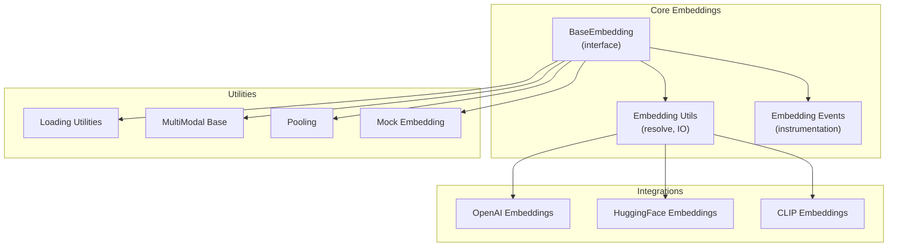
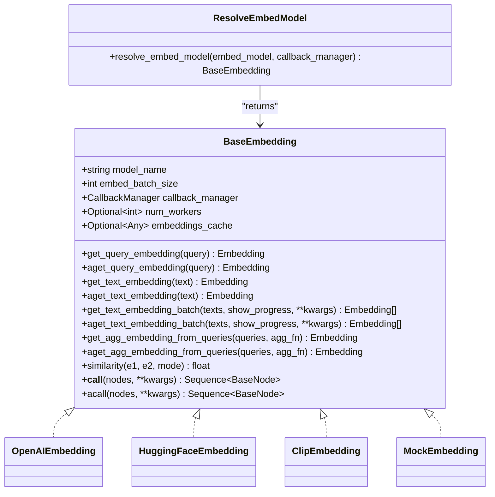
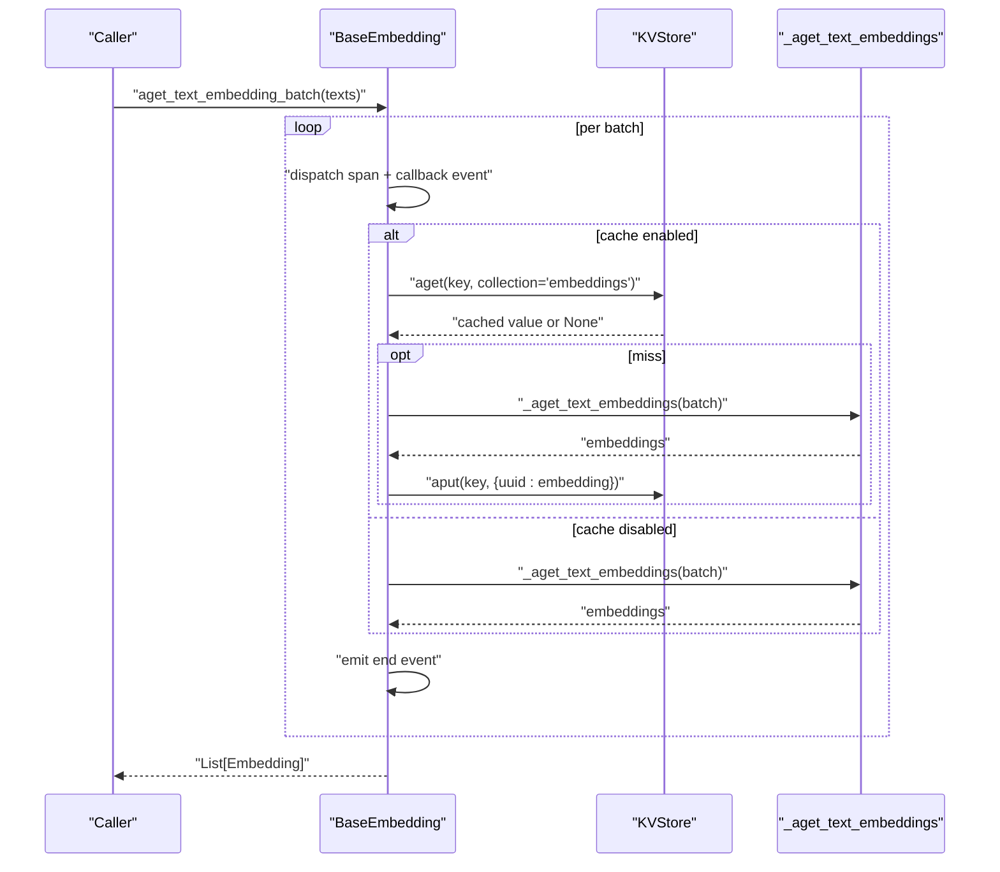
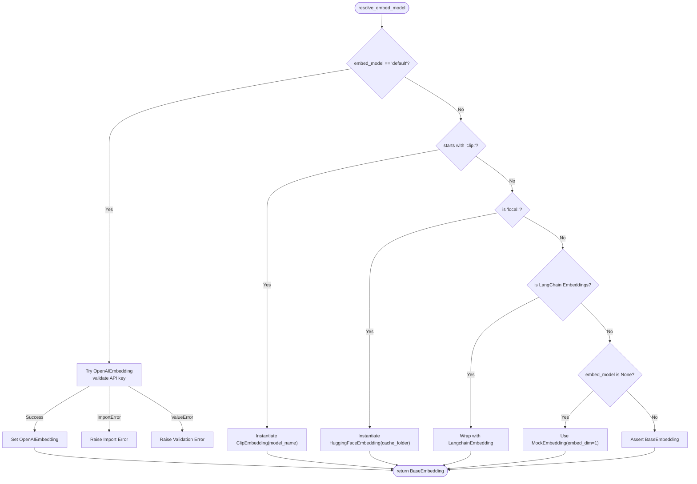
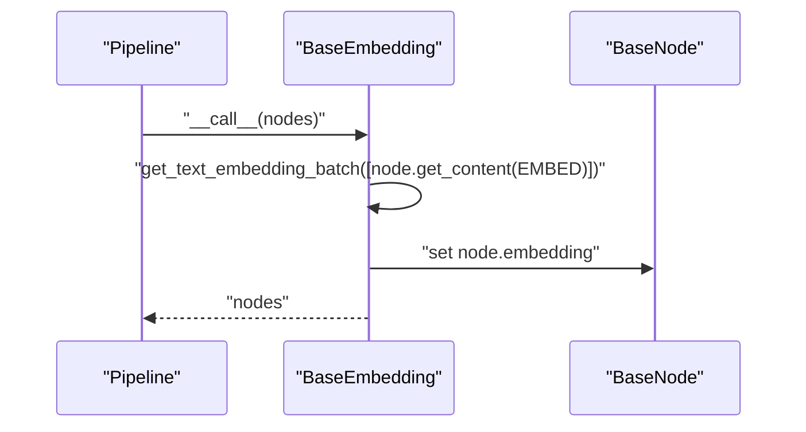
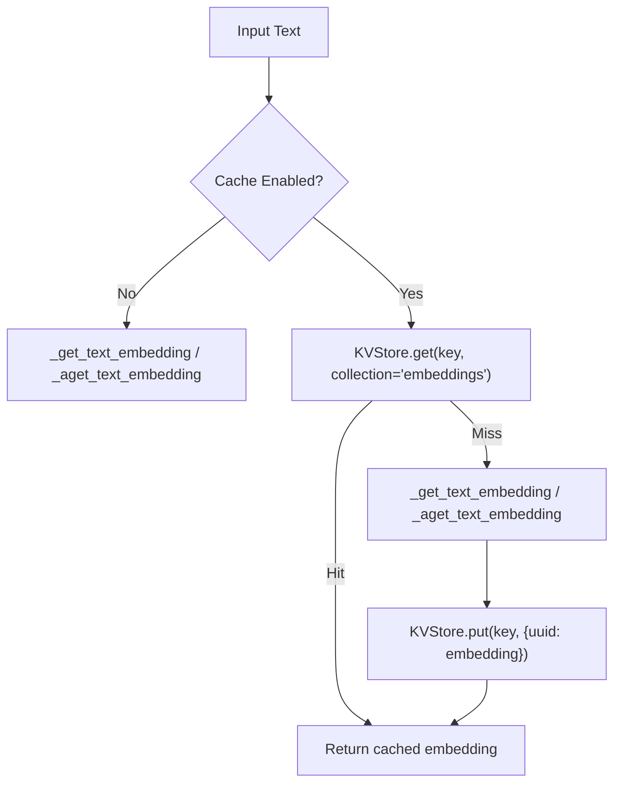
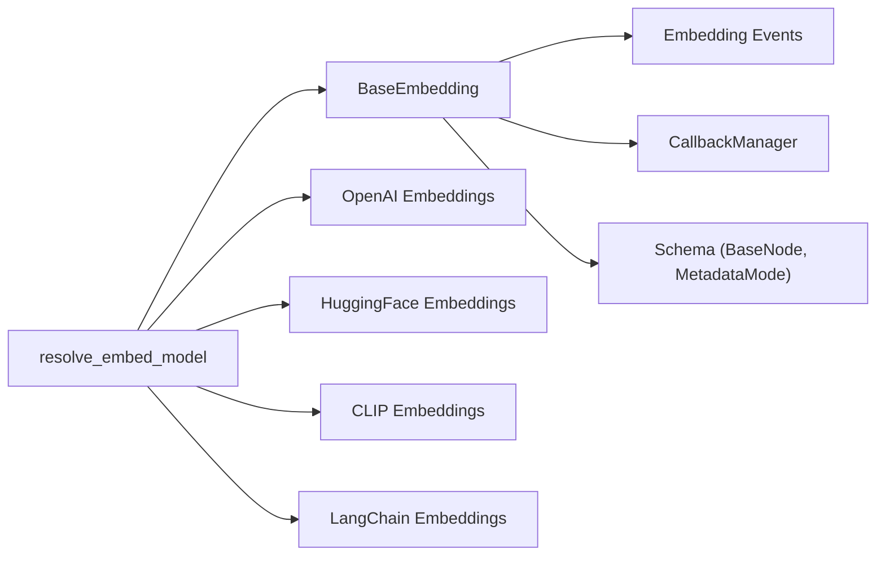

# Core Embedding Interface

<cite>
**Referenced Files in This Document**
- [base.py](file://llama-index-core/llama_index/core/base/embeddings/base.py)
- [utils.py](file://llama-index-core/llama_index/core/embeddings/utils.py)
- [__init__.py](file://llama-index-core/llama_index/core/embeddings/__init__.py)
- [openai/__init__.py](file://llama-index-integrations/embeddings/llama-index-embeddings-openai/llama_index/embeddings/openai/__init__.py)
- [loading.py](file://llama-index-core/llama_index/core/embeddings/loading.py)
- [mock_embed_model.py](file://llama-index-core/llama_index/core/embeddings/mock_embed_model.py)
- [multi_modal_base.py](file://llama-index-core/llama_index/core/embeddings/multi_modal_base.py)
- [pooling.py](file://llama-index-core/llama_index/core/embeddings/pooling.py)
- [embedding.py](file://llama-index-core/llama_index/core/instrumentation/events/embedding.py)
- [embedding_utils.py](file://llama-index-core/llama_index/core/indices/query/embedding_utils.py)
</cite>

## Table of Contents
1. [Introduction](#introduction)
2. [Project Structure](#project-structure)
3. [Core Components](#core-components)
4. [Architecture Overview](#architecture-overview)
5. [Detailed Component Analysis](#detailed-component-analysis)
6. [Dependency Analysis](#dependency-analysis)
7. [Performance Considerations](#performance-considerations)
8. [Troubleshooting Guide](#troubleshooting-guide)
9. [Conclusion](#conclusion)
10. [Appendices](#appendices)

## Introduction
This document provides comprehensive API documentation for the core BaseEmbedding interface that defines the unified embedding contract in the LlamaIndex ecosystem. It covers synchronous and asynchronous embedding methods, batch processing capabilities, metadata handling via node transformations, and the model resolution mechanism. It also explains the embedding resolution patterns, factory-style usage, and practical guidance for implementing custom embedding models, handling different input types, dimension management, error handling, timeouts, fallbacks, caching strategies, and performance optimization.

## Project Structure
The embedding subsystem is centered around a core interface and a set of utilities and integrations:
- Core interface and utilities live under the core module.
- Model resolution and selection utilities are provided in the embeddings package.
- Integrations for various providers (OpenAI, HuggingFace, CLIP, etc.) are provided in the integrations module.
- Instrumentation and event hooks support observability during embedding operations.

**Diagram sources**
- [base.py](file://llama-index-core/llama_index/core/base/embeddings/base.py#L72-L619)
- [utils.py](file://llama-index-core/llama_index/core/embeddings/utils.py#L31-L141)
- [openai/__init__.py](file://llama-index-integrations/embeddings/llama-index-embeddings-openai/llama_index/embeddings/openai/__init__.py#L1-L14)
- [loading.py](file://llama-index-core/llama_index/core/embeddings/loading.py)
- [multi_modal_base.py](file://llama-index-core/llama_index/core/embeddings/multi_modal_base.py)
- [pooling.py](file://llama-index-core/llama_index/core/embeddings/pooling.py)
- [mock_embed_model.py](file://llama-index-core/llama_index/core/embeddings/mock_embed_model.py)
- [embedding.py](file://llama-index-core/llama_index/core/instrumentation/events/embedding.py)

**Section sources**
- [base.py](file://llama-index-core/llama_index/core/base/embeddings/base.py#L1-L619)
- [utils.py](file://llama-index-core/llama_index/core/embeddings/utils.py#L1-L141)
- [__init__.py](file://llama-index-core/llama_index/core/embeddings/__init__.py#L1-L16)

## Core Components
- BaseEmbedding: The abstract interface defining the embedding contract, including sync/async methods, batch processing, aggregation helpers, similarity computation, and node transformation hooks.
- Embedding resolution utilities: Functions to resolve a model from strings, LangChain wrappers, or defaults.
- Instrumentation events: Structured start/end events emitted around embedding operations.
- Mock and multi-modal base classes: Support for testing and multimodal scenarios.

Key responsibilities:
- Unified embedding API surface for query and text embeddings.
- Batch processing with configurable batch sizes and optional progress reporting.
- Async execution with worker control and progress-aware gathering.
- Caching integration via a KVStore interface for both sync and async flows.
- Aggregation helpers and similarity metrics.
- Node transformation pipeline integration for automatic embedding assignment.

**Section sources**
- [base.py](file://llama-index-core/llama_index/core/base/embeddings/base.py#L72-L619)
- [utils.py](file://llama-index-core/llama_index/core/embeddings/utils.py#L31-L141)
- [embedding.py](file://llama-index-core/llama_index/core/instrumentation/events/embedding.py)

## Architecture Overview
The BaseEmbedding interface orchestrates embedding generation with built-in observability and caching. The model resolution utility selects concrete implementations based on configuration or environment hints.

**Diagram sources**
- [base.py](file://llama-index-core/llama_index/core/base/embeddings/base.py#L72-L619)
- [utils.py](file://llama-index-core/llama_index/core/embeddings/utils.py#L31-L141)
- [openai/__init__.py](file://llama-index-integrations/embeddings/llama-index-embeddings-openai/llama_index/embeddings/openai/__init__.py#L1-L14)

## Detailed Component Analysis

### BaseEmbedding Interface
The BaseEmbedding class defines the canonical embedding contract:
- Synchronous and asynchronous methods for query and text embeddings.
- Batch processing with configurable batch size and optional progress reporting.
- Aggregation helpers for combining multiple embeddings.
- Similarity computation with multiple modes.
- Node transformation hooks to integrate with the broader indexing pipeline.
- Caching support via a pluggable KVStore interface with both sync and async variants.

Implementation highlights:
- Internal dispatch spans and callback events wrap all embedding operations for observability.
- Cache keys are generated per input with UUID-based values to avoid collisions.
- Batch processing maintains order and supports both sync and async flows.
- Async execution can leverage worker counts and progress-aware gathering.

**Diagram sources**
- [base.py](file://llama-index-core/llama_index/core/base/embeddings/base.py#L497-L585)

**Section sources**
- [base.py](file://llama-index-core/llama_index/core/base/embeddings/base.py#L72-L619)

### Embedding Resolution Mechanism and Model Factory Patterns
The resolve_embed_model function provides a factory-style mechanism to instantiate concrete embedding models:
- Default resolution attempts to load OpenAI embeddings with validation and graceful fallbacks.
- String-based resolution supports provider-specific prefixes (e.g., CLIP, local HuggingFace).
- LangChain embedding adapters are supported when available.
- Explicit disabling yields a minimal mock embedding.

**Diagram sources**
- [utils.py](file://llama-index-core/llama_index/core/embeddings/utils.py#L31-L141)

**Section sources**
- [utils.py](file://llama-index-core/llama_index/core/embeddings/utils.py#L31-L141)
- [openai/__init__.py](file://llama-index-integrations/embeddings/llama-index-embeddings-openai/llama_index/embeddings/openai/__init__.py#L1-L14)

### Batch Processing and Worker Control
Batch processing is central to performance:
- Batch size is configurable and validated.
- Progress reporting is supported for both sync and async flows.
- Async batches can be executed concurrently with worker limits and progress-aware gathering.

Key behaviors:
- Maintains input order across batches.
- Emits structured events for each batch.
- Supports both cached and uncached batch flows.

**Section sources**
- [base.py](file://llama-index-core/llama_index/core/base/embeddings/base.py#L446-L585)

### Metadata Handling and Node Transformation
BaseEmbedding integrates with the node pipeline:
- Nodes are transformed by extracting content with a dedicated metadata mode for embeddings.
- Generated embeddings are attached to nodes for downstream use.

**Diagram sources**
- [base.py](file://llama-index-core/llama_index/core/base/embeddings/base.py#L596-L619)

**Section sources**
- [base.py](file://llama-index-core/llama_index/core/base/embeddings/base.py#L596-L619)

### Similarity and Aggregation Helpers
- Similarity supports multiple modes (cosine, dot product, Euclidean).
- Aggregation defaults to mean but can be customized.

**Section sources**
- [base.py](file://llama-index-core/llama_index/core/base/embeddings/base.py#L39-L70)
- [base.py](file://llama-index-core/llama_index/core/base/embeddings/base.py#L225-L243)

### Caching Strategies
Caching is optional and controlled via a KVStore:
- Cache keys are derived from input text/query; values are stored as UUID-keyed entries to avoid collisions.
- Both sync and async cache flows are supported.
- Cached retrieval short-circuits expensive recomputation.

**Diagram sources**
- [base.py](file://llama-index-core/llama_index/core/base/embeddings/base.py#L284-L348)

**Section sources**
- [base.py](file://llama-index-core/llama_index/core/base/embeddings/base.py#L151-L166)
- [base.py](file://llama-index-core/llama_index/core/base/embeddings/base.py#L194-L210)
- [base.py](file://llama-index-core/llama_index/core/base/embeddings/base.py#L284-L348)

### Implementing Custom Embedding Models
To implement a custom embedding model:
- Inherit from BaseEmbedding.
- Implement the abstract methods for query/text embeddings (sync and async).
- Optionally override batch-level methods if your backend supports native batching.
- Integrate caching by assigning a compatible KVStore to the embeddings_cache field.
- Leverage the provided aggregation and similarity helpers for downstream tasks.

Reference implementation patterns:
- OpenAI embeddings integration exports the primary class for instantiation.
- HuggingFace and CLIP integrations demonstrate provider-specific initialization and model selection.

**Section sources**
- [base.py](file://llama-index-core/llama_index/core/base/embeddings/base.py#L112-L130)
- [base.py](file://llama-index-core/llama_index/core/base/embeddings/base.py#L245-L282)
- [openai/__init__.py](file://llama-index-integrations/embeddings/llama-index-embeddings-openai/llama_index/embeddings/openai/__init__.py#L1-L14)

### Handling Different Input Types and Dimensions
- Inputs are strings for query and text embeddings.
- Embedding dimensions are determined by the underlying model; BaseEmbedding does not enforce a fixed dimension.
- For multimodal or specialized models, use the multi-modal base class pattern.

**Section sources**
- [base.py](file://llama-index-core/llama_index/core/base/embeddings/base.py#L27-L27)
- [multi_modal_base.py](file://llama-index-core/llama_index/core/embeddings/multi_modal_base.py)

### Error Handling, Timeouts, and Fallbacks
- Model resolution raises explicit errors when required packages are missing or credentials are invalid.
- Default resolution falls back to a mock embedding when explicitly disabled.
- Async flows rely on gather semantics; configure num_workers to balance throughput and resource usage.

Recommendations:
- Wrap external calls with timeouts at the provider level.
- Use caching to mitigate transient failures.
- Prefer deterministic batch sizes aligned with provider limits.

**Section sources**
- [utils.py](file://llama-index-core/llama_index/core/embeddings/utils.py#L60-L77)
- [utils.py](file://llama-index-core/llama_index/core/embeddings/utils.py#L132-L134)
- [base.py](file://llama-index-core/llama_index/core/base/embeddings/base.py#L504-L559)

## Dependency Analysis
The embedding subsystem exhibits clear separation of concerns:
- Core interface depends on instrumentation, callbacks, and schema abstractions.
- Resolution utilities depend on settings and optional LangChain adapters.
- Integrations depend on external providers and are decoupled from the core interface.

**Diagram sources**
- [base.py](file://llama-index-core/llama_index/core/base/embeddings/base.py#L16-L24)
- [utils.py](file://llama-index-core/llama_index/core/embeddings/utils.py#L36-L41)
- [openai/__init__.py](file://llama-index-integrations/embeddings/llama-index-embeddings-openai/llama_index/embeddings/openai/__init__.py#L1-L14)

**Section sources**
- [base.py](file://llama-index-core/llama_index/core/base/embeddings/base.py#L1-L619)
- [utils.py](file://llama-index-core/llama_index/core/embeddings/utils.py#L1-L141)

## Performance Considerations
- Tune embed_batch_size to match provider limits and memory constraints.
- Use num_workers for async batch execution to increase throughput.
- Enable caching to avoid repeated computations for identical inputs.
- Prefer batch APIs when available; otherwise rely on efficient async gathering.
- Monitor progress for long-running jobs to estimate completion time.

[No sources needed since this section provides general guidance]

## Troubleshooting Guide
Common issues and resolutions:
- Missing provider packages: Install the appropriate integration package indicated by the error message.
- Invalid credentials: Ensure environment variables are set and validated by the resolver.
- Cache misconfiguration: Verify that embeddings_cache is a proper KVStore instance.
- Unexpected dimensions: Confirm the selected model’s specification and adjust expectations accordingly.

**Section sources**
- [utils.py](file://llama-index-core/llama_index/core/embeddings/utils.py#L60-L77)
- [utils.py](file://llama-index-core/llama_index/core/embeddings/utils.py#L113-L117)
- [base.py](file://llama-index-core/llama_index/core/base/embeddings/base.py#L100-L110)

## Conclusion
BaseEmbedding provides a robust, extensible, and observable foundation for embedding generation across diverse providers and use cases. With built-in batch processing, async execution, caching, and integration hooks, it enables efficient and maintainable embedding pipelines. The model resolution utility simplifies deployment across environments, while the interface encourages consistent implementation patterns for custom models.

[No sources needed since this section summarizes without analyzing specific files]

## Appendices

### API Reference Highlights
- BaseEmbedding methods:
  - Query and text embeddings (sync and async)
  - Batch embeddings (sync and async)
  - Aggregation and similarity helpers
  - Node transformation hooks
- Embedding resolution:
  - Default, provider-specific, and LangChain adapter support
  - Graceful fallbacks and explicit disabling

**Section sources**
- [base.py](file://llama-index-core/llama_index/core/base/embeddings/base.py#L131-L223)
- [base.py](file://llama-index-core/llama_index/core/base/embeddings/base.py#L351-L443)
- [base.py](file://llama-index-core/llama_index/core/base/embeddings/base.py#L446-L585)
- [utils.py](file://llama-index-core/llama_index/core/embeddings/utils.py#L31-L141)