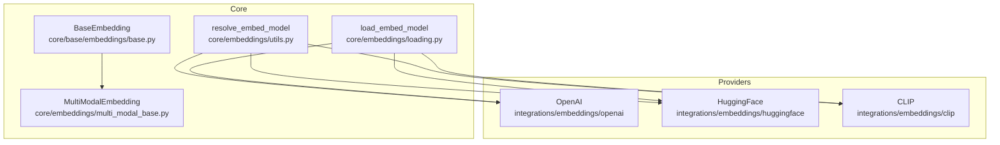
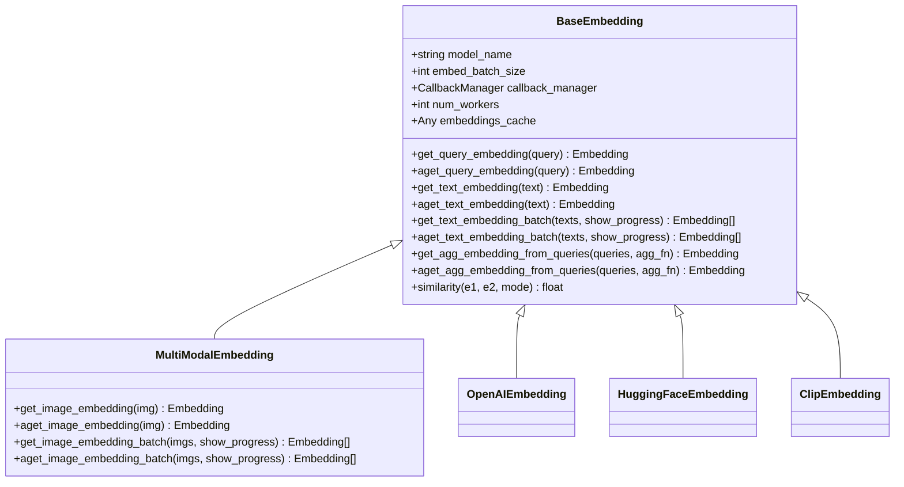
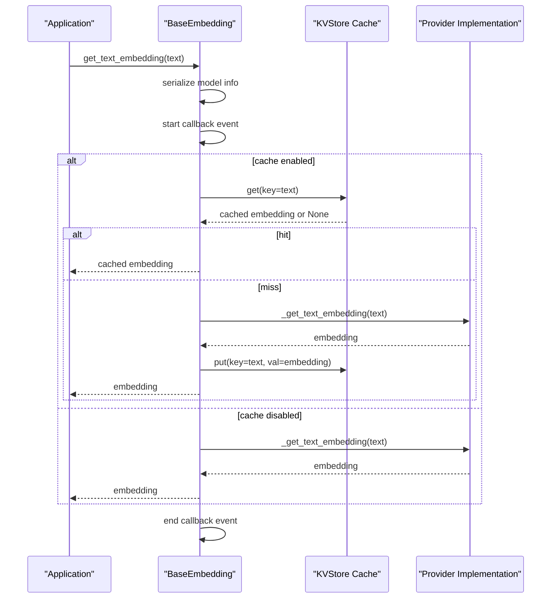
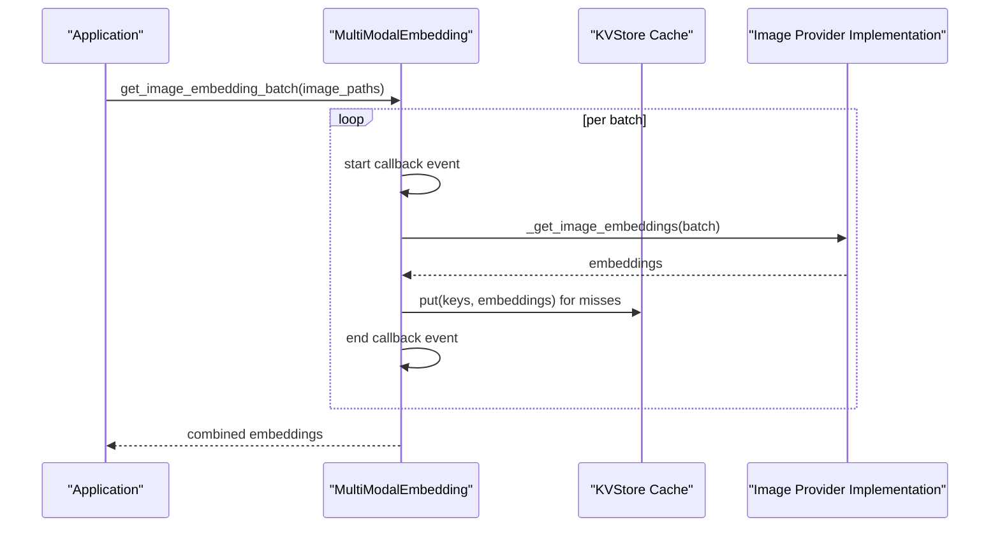
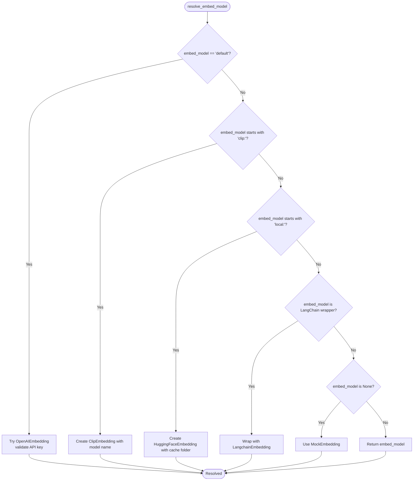
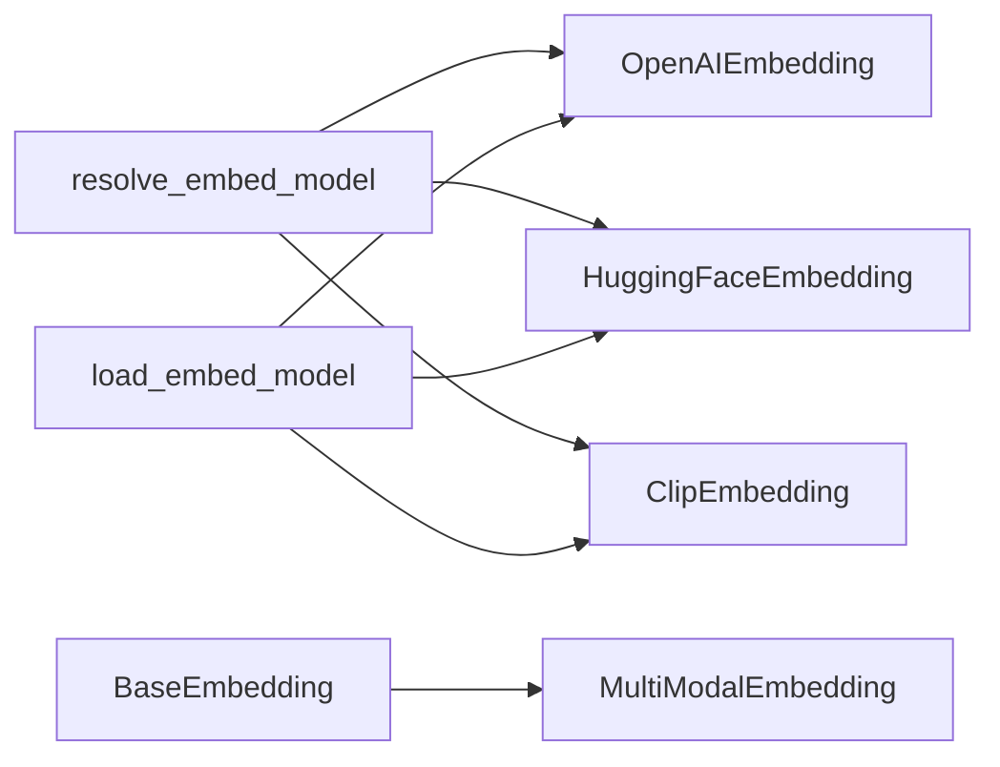

# Embedding APIs

<cite>
**Referenced Files in This Document**
- [base.py](file://llama-index-core/llama_index/core/base/embeddings/base.py)
- [multi_modal_base.py](file://llama-index-core/llama_index/core/embeddings/multi_modal_base.py)
- [utils.py](file://llama-index-core/llama_index/core/embeddings/utils.py)
- [loading.py](file://llama-index-core/llama_index/core/embeddings/loading.py)
- [__init__.py](file://llama-index-integrations/embeddings/llama-index-embeddings-openai/llama_index/embeddings/openai/__init__.py)
- [__init__.py](file://llama-index-integrations/embeddings/llama-index-embeddings-huggingface/llama_index/embeddings/huggingface/__init__.py)
- [__init__.py](file://llama-index-integrations/embeddings/llama-index-embeddings-clip/llama_index/embeddings/clip/__init__.py)
</cite>

## Table of Contents
1. [Introduction](#introduction)
2. [Project Structure](#project-structure)
3. [Core Components](#core-components)
4. [Architecture Overview](#architecture-overview)
5. [Detailed Component Analysis](#detailed-component-analysis)
6. [Dependency Analysis](#dependency-analysis)
7. [Performance Considerations](#performance-considerations)
8. [Troubleshooting Guide](#troubleshooting-guide)
9. [Conclusion](#conclusion)
10. [Appendices](#appendices)

## Introduction
This document provides comprehensive API documentation for Embedding Services in the repository. It covers the unified embedding interface, provider-specific implementations, vector dimensionality, normalization options, batch processing, authentication for cloud providers, rate limiting and quotas, sparse embeddings, multi-modal embeddings, and custom embedding models. It also includes practical guidance on embedding caching, dimension reduction, performance optimization, troubleshooting, and quality assessment techniques.

## Project Structure
The embedding system is composed of:
- A core unified interface and utilities for embedding resolution, caching, and batching
- Provider-specific embedding implementations exposed via integration packages
- Multi-modal embedding support for images and hybrid modalities

**Diagram sources**
- [base.py](file://llama-index-core/llama_index/core/base/embeddings/base.py#L72-L619)
- [multi_modal_base.py](file://llama-index-core/llama_index/core/embeddings/multi_modal_base.py#L16-L187)
- [utils.py](file://llama-index-core/llama_index/core/embeddings/utils.py#L31-L141)
- [loading.py](file://llama-index-core/llama_index/core/embeddings/loading.py#L39-L50)
- [__init__.py](file://llama-index-integrations/embeddings/llama-index-embeddings-openai/llama_index/embeddings/openai/__init__.py#L1-L14)
- [__init__.py](file://llama-index-integrations/embeddings/llama-index-embeddings-huggingface/llama_index/embeddings/huggingface/__init__.py#L1-L12)
- [__init__.py](file://llama-index-integrations/embeddings/llama-index-embeddings-clip/llama_index/embeddings/clip/__init__.py#L1-L4)

**Section sources**
- [base.py](file://llama-index-core/llama_index/core/base/embeddings/base.py#L1-L619)
- [multi_modal_base.py](file://llama-index-core/llama_index/core/embeddings/multi_modal_base.py#L1-L187)
- [utils.py](file://llama-index-core/llama_index/core/embeddings/utils.py#L1-L141)
- [loading.py](file://llama-index-core/llama_index/core/embeddings/loading.py#L1-L50)
- [__init__.py](file://llama-index-integrations/embeddings/llama-index-embeddings-openai/llama_index/embeddings/openai/__init__.py#L1-L14)
- [__init__.py](file://llama-index-integrations/embeddings/llama-index-embeddings-huggingface/llama_index/embeddings/huggingface/__init__.py#L1-L12)
- [__init__.py](file://llama-index-integrations/embeddings/llama-index-embeddings-clip/llama_index/embeddings/clip/__init__.py#L1-L4)

## Core Components
- Unified embedding interface: Defines synchronous and asynchronous embedding methods, batching, caching, aggregation, and similarity computation.
- Multi-modal embedding interface: Extends the base interface to support image embeddings with batching and async support.
- Embedding resolution utilities: Resolve provider-specific models from strings, local configurations, or LangChain wrappers.
- Embedding loader: Load persisted embedding models by class name.

Key capabilities:
- Vector dimensionality: Determined by the selected provider/model; consult provider-specific documentation for exact sizes.
- Normalization options: Similarity modes include cosine, dot product, and Euclidean distance.
- Batch processing: Built-in batching with configurable batch size and optional progress reporting.
- Caching: Optional KV-store-backed cache for text and query embeddings to reduce redundant calls.
- Aggregation: Mean aggregation of multiple embeddings is supported.

**Section sources**
- [base.py](file://llama-index-core/llama_index/core/base/embeddings/base.py#L47-L70)
- [base.py](file://llama-index-core/llama_index/core/base/embeddings/base.py#L72-L619)
- [multi_modal_base.py](file://llama-index-core/llama_index/core/embeddings/multi_modal_base.py#L16-L187)
- [utils.py](file://llama-index-core/llama_index/core/embeddings/utils.py#L31-L141)
- [loading.py](file://llama-index-core/llama_index/core/embeddings/loading.py#L39-L50)

## Architecture Overview
The embedding subsystem follows a layered architecture:
- Core interface defines the contract and shared behaviors (batching, caching, aggregation).
- Provider implementations plug into the core via the unified interface.
- Utilities resolve models and persist/load them.
- Multi-modal extensions enable image-based embeddings.

**Diagram sources**
- [base.py](file://llama-index-core/llama_index/core/base/embeddings/base.py#L72-L619)
- [multi_modal_base.py](file://llama-index-core/llama_index/core/embeddings/multi_modal_base.py#L16-L187)
- [__init__.py](file://llama-index-integrations/embeddings/llama-index-embeddings-openai/llama_index/embeddings/openai/__init__.py#L1-L14)
- [__init__.py](file://llama-index-integrations/embeddings/llama-index-embeddings-huggingface/llama_index/embeddings/huggingface/__init__.py#L1-L12)
- [__init__.py](file://llama-index-integrations/embeddings/llama-index-embeddings-clip/llama_index/embeddings/clip/__init__.py#L1-L4)

## Detailed Component Analysis

### Unified Embedding Interface
The BaseEmbedding interface defines:
- Synchronous and asynchronous methods for query and text embeddings
- Batching with configurable batch size and optional progress
- Optional KV-store-backed caching for both single and batch operations
- Aggregation helpers and similarity computation with multiple modes
- Integration with callback instrumentation and event dispatching

**Diagram sources**
- [base.py](file://llama-index-core/llama_index/core/base/embeddings/base.py#L351-L443)

**Section sources**
- [base.py](file://llama-index-core/llama_index/core/base/embeddings/base.py#L72-L619)

### Multi-Modal Embedding Interface
MultiModalEmbedding extends BaseEmbedding to support image embeddings:
- Synchronous and asynchronous image embedding methods
- Batch image embedding with configurable batch size and progress
- Integration with callback instrumentation

**Diagram sources**
- [multi_modal_base.py](file://llama-index-core/llama_index/core/embeddings/multi_modal_base.py#L95-L187)

**Section sources**
- [multi_modal_base.py](file://llama-index-core/llama_index/core/embeddings/multi_modal_base.py#L16-L187)

### Embedding Resolution and Loading
- resolve_embed_model supports:
  - Default provider selection with validation
  - Local HuggingFace models with caching
  - CLIP image models
  - LangChain embedding adapters
  - Explicit disabling via a mock embedding
- load_embed_model loads a saved model by class name

**Diagram sources**
- [utils.py](file://llama-index-core/llama_index/core/embeddings/utils.py#L31-L141)

**Section sources**
- [utils.py](file://llama-index-core/llama_index/core/embeddings/utils.py#L31-L141)
- [loading.py](file://llama-index-core/llama_index/core/embeddings/loading.py#L39-L50)

### Provider-Specific Implementations
- OpenAI: Provides text embeddings via official API; integrates with authentication and rate-limit handling at the provider level.
- HuggingFace: Supports both local models and inference API variants; resolves via the unified resolver.
- CLIP: Provides multi-modal image embeddings; resolves via the unified resolver.

Note: Provider-specific details (authentication keys, rate limits, quotas) are documented within each provider’s integration package. Consult the provider’s documentation for exact configuration and limits.

**Section sources**
- [__init__.py](file://llama-index-integrations/embeddings/llama-index-embeddings-openai/llama_index/embeddings/openai/__init__.py#L1-L14)
- [__init__.py](file://llama-index-integrations/embeddings/llama-index-embeddings-huggingface/llama_index/embeddings/huggingface/__init__.py#L1-L12)
- [__init__.py](file://llama-index-integrations/embeddings/llama-index-embeddings-clip/llama_index/embeddings/clip/__init__.py#L1-L4)

### Sparse Embeddings
Sparse embeddings are supported through dedicated integration packages. These packages expose sparse embedding models compatible with the unified embedding interface. Use the provider-specific resolver to instantiate sparse models and integrate them into your pipeline.

[No sources needed since this section describes integration availability conceptually]

### Multi-Modal Embeddings
Multi-modal embeddings enable joint text and image representations. The MultiModalEmbedding interface provides:
- Text embeddings via the base interface
- Image embeddings with batching and async support
- Seamless integration with caching and similarity computations

**Section sources**
- [multi_modal_base.py](file://llama-index-core/llama_index/core/embeddings/multi_modal_base.py#L16-L187)

### Custom Embedding Models
Custom embedding models can be integrated by implementing the BaseEmbedding interface and registering them with the loader. The loader recognizes models by class name, enabling persistence and rehydration of custom models alongside built-in providers.

**Section sources**
- [loading.py](file://llama-index-core/llama_index/core/embeddings/loading.py#L39-L50)

## Dependency Analysis
The embedding system exhibits low coupling and high cohesion:
- Core interface decouples providers from consumers
- Utilities encapsulate provider resolution and caching concerns
- Multi-modal extension composes with the base interface
- Loader centralizes model instantiation by class name

**Diagram sources**
- [utils.py](file://llama-index-core/llama_index/core/embeddings/utils.py#L31-L141)
- [loading.py](file://llama-index-core/llama_index/core/embeddings/loading.py#L39-L50)
- [base.py](file://llama-index-core/llama_index/core/base/embeddings/base.py#L72-L619)
- [multi_modal_base.py](file://llama-index-core/llama_index/core/embeddings/multi_modal_base.py#L16-L187)

**Section sources**
- [utils.py](file://llama-index-core/llama_index/core/embeddings/utils.py#L31-L141)
- [loading.py](file://llama-index-core/llama_index/core/embeddings/loading.py#L39-L50)
- [base.py](file://llama-index-core/llama_index/core/base/embeddings/base.py#L72-L619)
- [multi_modal_base.py](file://llama-index-core/llama_index/core/embeddings/multi_modal_base.py#L16-L187)

## Performance Considerations
- Batch size tuning: Adjust embed_batch_size to balance throughput and latency; larger batches improve throughput but increase per-request latency.
- Concurrency: Use num_workers for async batch processing to overlap I/O-bound operations.
- Caching: Enable embeddings_cache to avoid repeated calls for identical inputs; KVStore-backed caching reduces provider costs and latency.
- Progress reporting: Enable show_progress for long-running batch operations to monitor progress.
- Aggregation: Prefer mean aggregation for robustness; consider domain-specific aggregation strategies.

[No sources needed since this section provides general guidance]

## Troubleshooting Guide
Common issues and resolutions:
- Authentication failures for cloud providers:
  - Verify API keys and permissions for the chosen provider.
  - Use the resolver’s validation steps to catch misconfiguration early.
- Rate limits and quotas:
  - Implement backoff and retry logic around provider calls.
  - Reduce batch size or introduce delays between requests.
- Cache misses and performance:
  - Ensure embeddings_cache is configured with a suitable KVStore backend.
  - Confirm cache keys match input text precisely (including whitespace and casing).
- Dimension mismatch:
  - Validate that downstream similarity/search components align with the embedding dimension produced by the selected model.
- Async bottlenecks:
  - Increase num_workers judiciously; ensure the underlying provider supports concurrent requests.

**Section sources**
- [utils.py](file://llama-index-core/llama_index/core/embeddings/utils.py#L65-L77)
- [base.py](file://llama-index-core/llama_index/core/base/embeddings/base.py#L151-L166)
- [base.py](file://llama-index-core/llama_index/core/base/embeddings/base.py#L496-L585)

## Conclusion
The embedding subsystem offers a unified, extensible interface for diverse embedding providers and modalities. By leveraging batching, caching, and aggregation, applications can achieve efficient and scalable embeddings. Provider-specific configurations, authentication, and rate limits should be managed per integration. For advanced scenarios, sparse embeddings and custom models are supported through the same interface.

[No sources needed since this section summarizes without analyzing specific files]

## Appendices

### API Reference Summary
- BaseEmbedding
  - Methods: get_query_embedding, aget_query_embedding, get_text_embedding, aget_text_embedding, get_text_embedding_batch, aget_text_embedding_batch, get_agg_embedding_from_queries, aget_agg_embedding_from_queries, similarity
  - Fields: model_name, embed_batch_size, callback_manager, num_workers, embeddings_cache
- MultiModalEmbedding
  - Methods: get_image_embedding, aget_image_embedding, get_image_embedding_batch, aget_image_embedding_batch
- Utilities
  - Functions: resolve_embed_model, save_embedding, load_embedding
- Loader
  - Function: load_embed_model

**Section sources**
- [base.py](file://llama-index-core/llama_index/core/base/embeddings/base.py#L72-L619)
- [multi_modal_base.py](file://llama-index-core/llama_index/core/embeddings/multi_modal_base.py#L16-L187)
- [utils.py](file://llama-index-core/llama_index/core/embeddings/utils.py#L16-L28)
- [loading.py](file://llama-index-core/llama_index/core/embeddings/loading.py#L39-L50)