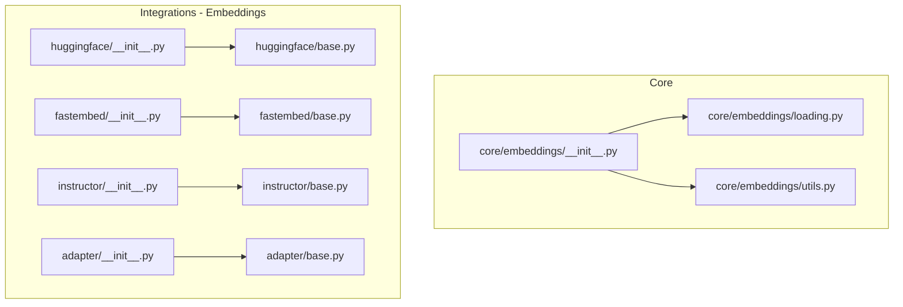
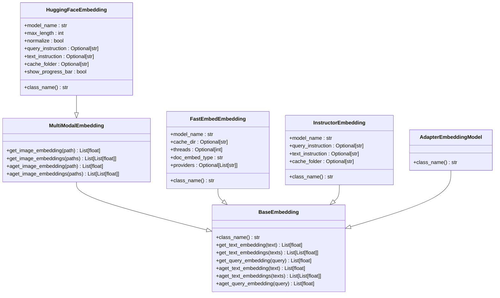
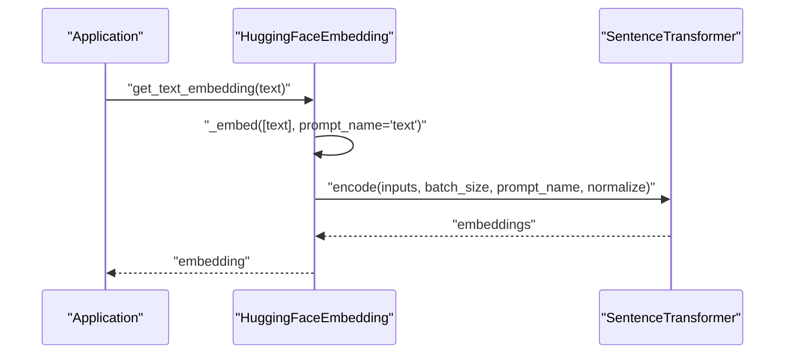
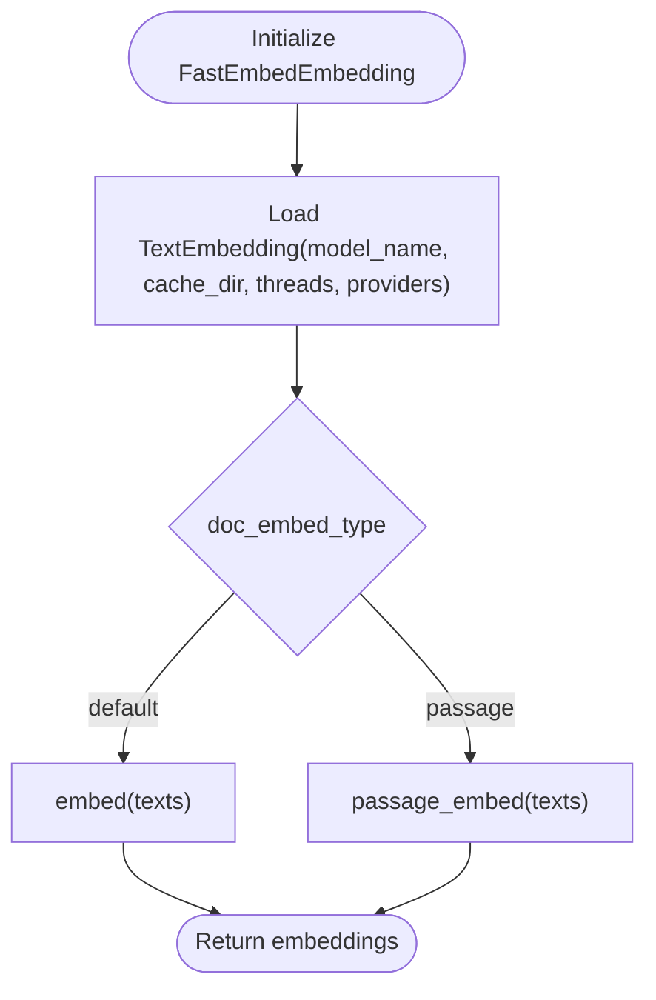
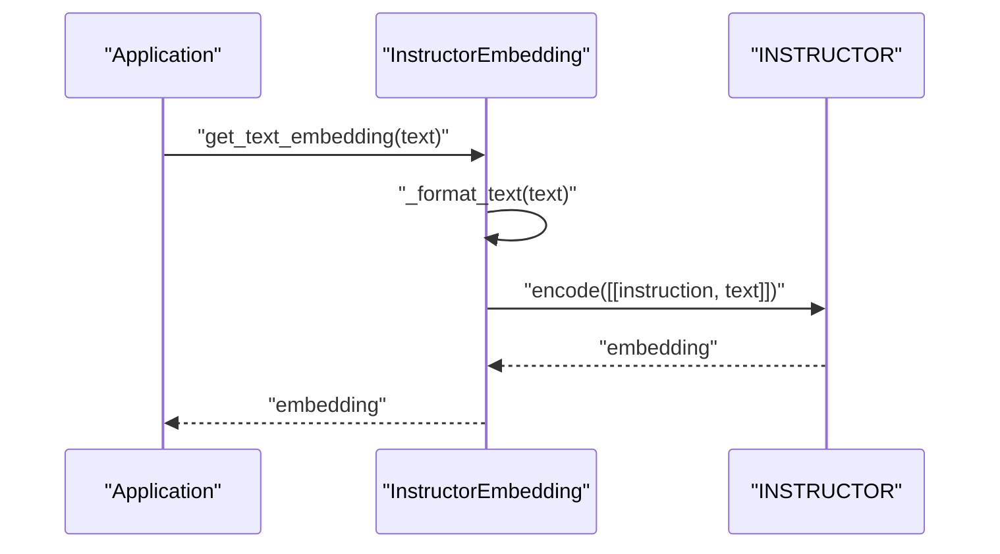
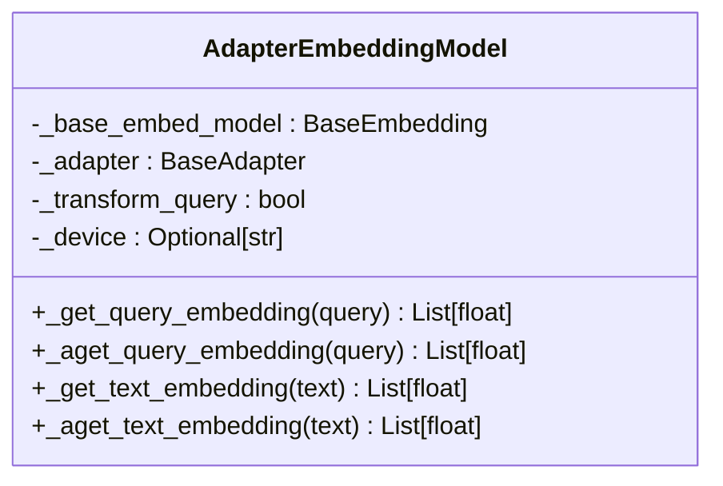
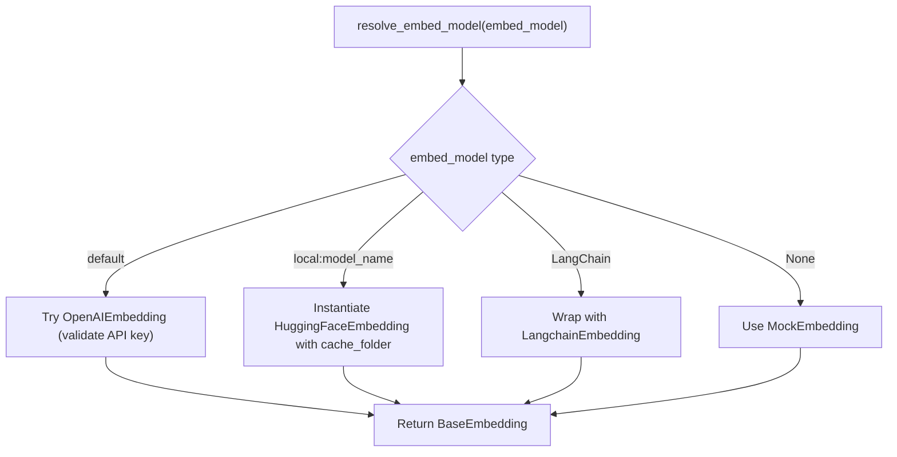
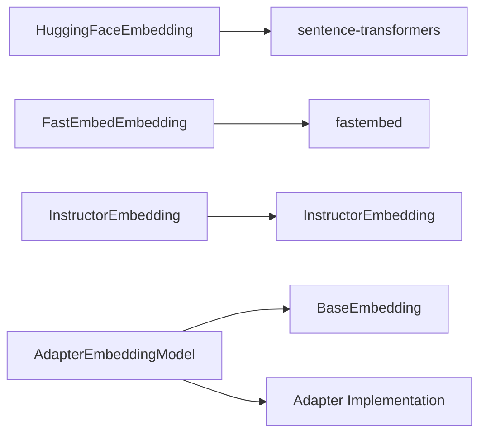

# Open Source Embeddings

<cite>
**Referenced Files in This Document**
- [__init__.py](file://llama-index-core/llama_index/core/embeddings/__init__.py)
- [loading.py](file://llama-index-core/llama_index/core/embeddings/loading.py)
- [utils.py](file://llama-index-core/llama_index/core/embeddings/utils.py)
- [base.py](file://llama-index-integrations/embeddings/llama-index-embeddings-fastembed/llama_index/embeddings/fastembed/base.py)
- [base.py](file://llama-index-integrations/embeddings/llama-index-embeddings-huggingface/llama_index/embeddings/huggingface/base.py)
- [base.py](file://llama-index-integrations/embeddings/llama-index-embeddings-instructor/llama_index/embeddings/instructor/base.py)
- [base.py](file://llama-index-integrations/embeddings/llama-index-embeddings-adapter/llama_index/embeddings/adapter/base.py)
- [__init__.py](file://llama-index-integrations/embeddings/llama-index-embeddings-fastembed/llama_index/embeddings/fastembed/__init__.py)
- [__init__.py](file://llama-index-integrations/embeddings/llama-index-embeddings-huggingface/llama_index/embeddings/huggingface/__init__.py)
- [__init__.py](file://llama-index-integrations/embeddings/llama-index-embeddings-instructor/llama_index/embeddings/instructor/__init__.py)
- [__init__.py](file://llama-index-integrations/embeddings/llama-index-embeddings-adapter/llama_index/embeddings/adapter/__init__.py)
</cite>

## Table of Contents
1. [Introduction](#introduction)
2. [Project Structure](#project-structure)
3. [Core Components](#core-components)
4. [Architecture Overview](#architecture-overview)
5. [Detailed Component Analysis](#detailed-component-analysis)
6. [Dependency Analysis](#dependency-analysis)
7. [Performance Considerations](#performance-considerations)
8. [Troubleshooting Guide](#troubleshooting-guide)
9. [Conclusion](#conclusion)
10. [Appendices](#appendices)

## Introduction
This document provides comprehensive API documentation for open-source embedding models integrated with the repository. It focuses on Hugging Face transformers, FastEmbed, Sentence Transformers, and local model embeddings. It covers model loading, GPU acceleration, memory optimization, quantization and compression strategies, inference optimization, local deployment, hardware requirements, model selection guidance, performance benchmarking, and custom model integration. It also includes troubleshooting tips for local model issues and resource management.

## Project Structure
The embedding ecosystem is organized around:
- Core embedding abstractions and utilities in the core module
- Integrations for specific embedding providers and libraries under llama-index-integrations/embeddings
- Per-provider packages exposing model classes and initialization utilities

Key areas:
- Core embeddings: base classes, loading, and resolution utilities
- HuggingFace embeddings: local SentenceTransformer-based and inference API-based embeddings
- FastEmbed: ONNX-backed, fast local embeddings
- Instructor embeddings: instruction-tuned embedding models
- Adapter embeddings: a wrapper that applies an adapter layer on top of any embedding model

**Diagram sources**
- [__init__.py](file://llama-index-core/llama_index/core/embeddings/__init__.py#L1-L16)
- [loading.py](file://llama-index-core/llama_index/core/embeddings/loading.py#L1-L50)
- [utils.py](file://llama-index-core/llama_index/core/embeddings/utils.py#L1-L141)
- [__init__.py](file://llama-index-integrations/embeddings/llama-index-embeddings-huggingface/llama_index/embeddings/huggingface/__init__.py#L1-L12)
- [base.py](file://llama-index-integrations/embeddings/llama-index-embeddings-huggingface/llama_index/embeddings/huggingface/base.py#L1-L565)
- [__init__.py](file://llama-index-integrations/embeddings/llama-index-embeddings-fastembed/llama_index/embeddings/fastembed/__init__.py#L1-L4)
- [base.py](file://llama-index-integrations/embeddings/llama-index-embeddings-fastembed/llama_index/embeddings/fastembed/base.py#L1-L126)
- [__init__.py](file://llama-index-integrations/embeddings/llama-index-embeddings-instructor/llama_index/embeddings/instructor/__init__.py#L1-L4)
- [base.py](file://llama-index-integrations/embeddings/llama-index-embeddings-instructor/llama_index/embeddings/instructor/base.py#L1-L98)
- [__init__.py](file://llama-index-integrations/embeddings/llama-index-embeddings-adapter/llama_index/embeddings/adapter/__init__.py#L1-L13)
- [base.py](file://llama-index-integrations/embeddings/llama-index-embeddings-adapter/llama_index/embeddings/adapter/base.py#L1-L118)

**Section sources**
- [__init__.py](file://llama-index-core/llama_index/core/embeddings/__init__.py#L1-L16)
- [loading.py](file://llama-index-core/llama_index/core/embeddings/loading.py#L1-L50)
- [utils.py](file://llama-index-core/llama_index/core/embeddings/utils.py#L1-L141)
- [__init__.py](file://llama-index-integrations/embeddings/llama-index-embeddings-huggingface/llama_index/embeddings/huggingface/__init__.py#L1-L12)
- [base.py](file://llama-index-integrations/embeddings/llama-index-embeddings-huggingface/llama_index/embeddings/huggingface/base.py#L1-L565)
- [__init__.py](file://llama-index-integrations/embeddings/llama-index-embeddings-fastembed/llama_index/embeddings/fastembed/__init__.py#L1-L4)
- [base.py](file://llama-index-integrations/embeddings/llama-index-embeddings-fastembed/llama_index/embeddings/fastembed/base.py#L1-L126)
- [__init__.py](file://llama-index-integrations/embeddings/llama-index-embeddings-instructor/llama_index/embeddings/instructor/__init__.py#L1-L4)
- [base.py](file://llama-index-integrations/embeddings/llama-index-embeddings-instructor/llama_index/embeddings/instructor/base.py#L1-L98)
- [__init__.py](file://llama-index-integrations/embeddings/llama-index-embeddings-adapter/llama_index/embeddings/adapter/__init__.py#L1-L13)
- [base.py](file://llama-index-integrations/embeddings/llama-index-embeddings-adapter/llama_index/embeddings/adapter/base.py#L1-L118)

## Core Components
- BaseEmbedding: The foundational interface for all embeddings in the core module.
- MultiModalEmbedding: Extends BaseEmbedding to support multimodal inputs (e.g., text and images).
- resolve_embed_model: Resolves a model specification into a concrete embedding instance, supporting defaults, local HuggingFace, and LangChain bridges.
- load_embed_model: Loads a previously serialized embedding model by class name.

These utilities enable flexible model selection and instantiation across local and remote providers.

**Section sources**
- [__init__.py](file://llama-index-core/llama_index/core/embeddings/__init__.py#L1-L16)
- [utils.py](file://llama-index-core/llama_index/core/embeddings/utils.py#L31-L141)
- [loading.py](file://llama-index-core/llama_index/core/embeddings/loading.py#L39-L50)

## Architecture Overview
The embedding subsystem follows a layered design:
- Core abstractions define the contract for embeddings and utilities for resolution and loading.
- Provider-specific implementations encapsulate model details (e.g., SentenceTransformers, FastEmbed, Instructor).
- Adapter embeddings wrap existing models to add fine-tuning or transformation capabilities.

**Diagram sources**
- [base.py](file://llama-index-integrations/embeddings/llama-index-embeddings-huggingface/llama_index/embeddings/huggingface/base.py#L38-L360)
- [base.py](file://llama-index-integrations/embeddings/llama-index-embeddings-fastembed/llama_index/embeddings/fastembed/base.py#L12-L126)
- [base.py](file://llama-index-integrations/embeddings/llama-index-embeddings-instructor/llama_index/embeddings/instructor/base.py#L17-L98)
- [base.py](file://llama-index-integrations/embeddings/llama-index-embeddings-adapter/llama_index/embeddings/adapter/base.py#L15-L118)

## Detailed Component Analysis

### Hugging Face Embeddings (Sentence Transformers)
HuggingFaceEmbedding supports:
- Local SentenceTransformer models with GPU/CPU/MPS/NPU device selection
- Prompt-based instruction tuning for queries and texts
- Parallel processing across multiple devices
- Retry and progress reporting
- Image embedding via multimodal support

Key capabilities:
- Automatic device inference and caching
- Optional normalization and max length configuration
- Batched embeddings with configurable batch sizes
- Async variants for query and text embeddings
- Parallel process mode for large-scale encoding

**Diagram sources**
- [base.py](file://llama-index-integrations/embeddings/llama-index-embeddings-huggingface/llama_index/embeddings/huggingface/base.py#L248-L268)
- [base.py](file://llama-index-integrations/embeddings/llama-index-embeddings-huggingface/llama_index/embeddings/huggingface/base.py#L322-L339)

**Section sources**
- [base.py](file://llama-index-integrations/embeddings/llama-index-embeddings-huggingface/llama_index/embeddings/huggingface/base.py#L38-L360)

### FastEmbed Embeddings
FastEmbedEmbedding provides:
- ONNX-backed embeddings with optional GPU providers
- Support for “default” and “passage” embedding modes
- Thread and provider configuration
- Async embedding APIs

**Diagram sources**
- [base.py](file://llama-index-integrations/embeddings/llama-index-embeddings-fastembed/llama_index/embeddings/fastembed/base.py#L91-L97)
- [base.py](file://llama-index-integrations/embeddings/llama-index-embeddings-fastembed/llama_index/embeddings/fastembed/base.py#L109-L118)

**Section sources**
- [base.py](file://llama-index-integrations/embeddings/llama-index-embeddings-fastembed/llama_index/embeddings/fastembed/base.py#L12-L126)

### Instructor Embeddings
InstructorEmbedding:
- Wraps INSTRUCTOR models with optional instruction prompts
- Supports batched encoding and async variants
- Caches and selects device automatically

**Diagram sources**
- [base.py](file://llama-index-integrations/embeddings/llama-index-embeddings-instructor/llama_index/embeddings/instructor/base.py#L63-L74)
- [base.py](file://llama-index-integrations/embeddings/llama-index-embeddings-instructor/llama_index/embeddings/instructor/base.py#L89-L97)

**Section sources**
- [base.py](file://llama-index-integrations/embeddings/llama-index-embeddings-instructor/llama_index/embeddings/instructor/base.py#L17-L98)

### Adapter Embeddings
AdapterEmbeddingModel wraps an existing embedding model and optionally applies an adapter (defaulting to a linear layer) to transform query embeddings. It supports device selection and integrates with the core embedding interface.

**Diagram sources**
- [base.py](file://llama-index-integrations/embeddings/llama-index-embeddings-adapter/llama_index/embeddings/adapter/base.py#L15-L118)

**Section sources**
- [base.py](file://llama-index-integrations/embeddings/llama-index-embeddings-adapter/llama_index/embeddings/adapter/base.py#L15-L118)

### Model Resolution and Loading
- resolve_embed_model supports:
  - default fallback to OpenAI embeddings when configured
  - local HuggingFace embeddings via a “local:” prefix
  - LangChain embedding bridging
  - Mock embedding for testing
- load_embed_model loads a model from a serialized dictionary using recognized class names

**Diagram sources**
- [utils.py](file://llama-index-core/llama_index/core/embeddings/utils.py#L31-L141)
- [loading.py](file://llama-index-core/llama_index/core/embeddings/loading.py#L39-L50)

**Section sources**
- [utils.py](file://llama-index-core/llama_index/core/embeddings/utils.py#L31-L141)
- [loading.py](file://llama-index-core/llama_index/core/embeddings/loading.py#L39-L50)

## Dependency Analysis
- HuggingFaceEmbedding depends on SentenceTransformer and supports device inference and multi-process encoding.
- FastEmbedEmbedding depends on fastembed TextEmbedding and supports ONNX providers and threading.
- InstructorEmbedding depends on INSTRUCTOR and supports instruction formatting.
- AdapterEmbeddingModel depends on a base embedding and an adapter implementation (default linear layer), with device handling.

**Diagram sources**
- [base.py](file://llama-index-integrations/embeddings/llama-index-embeddings-huggingface/llama_index/embeddings/huggingface/base.py#L31-L31)
- [base.py](file://llama-index-integrations/embeddings/llama-index-embeddings-fastembed/llama_index/embeddings/fastembed/base.py#L83-L83)
- [base.py](file://llama-index-integrations/embeddings/llama-index-embeddings-instructor/llama_index/embeddings/instructor/base.py#L3-L3)
- [base.py](file://llama-index-integrations/embeddings/llama-index-embeddings-adapter/llama_index/embeddings/adapter/base.py#L54-L77)

**Section sources**
- [base.py](file://llama-index-integrations/embeddings/llama-index-embeddings-huggingface/llama_index/embeddings/huggingface/base.py#L31-L31)
- [base.py](file://llama-index-integrations/embeddings/llama-index-embeddings-fastembed/llama_index/embeddings/fastembed/base.py#L83-L83)
- [base.py](file://llama-index-integrations/embeddings/llama-index-embeddings-instructor/llama_index/embeddings/instructor/base.py#L3-L3)
- [base.py](file://llama-index-integrations/embeddings/llama-index-embeddings-adapter/llama_index/embeddings/adapter/base.py#L54-L77)

## Performance Considerations
- GPU acceleration
  - HuggingFaceEmbedding: device inference and multi-process encoding across target devices
  - FastEmbedEmbedding: ONNX runtime providers and thread configuration
  - InstructorEmbedding: device selection via constructor
- Memory optimization
  - Use cache folders for model downloads and reuse
  - Adjust embed_batch_size to balance throughput and memory footprint
  - Prefer “passage” embedding mode in FastEmbed for document-centric workloads
- Quantization and compression
  - Use smaller SentenceTransformer models or quantized variants when available
  - Consider FastEmbed models optimized for speed and reduced memory footprint
- Inference optimization
  - Enable progress bars selectively
  - Use async APIs for concurrent requests
  - Parallel process mode for large batches in HuggingFaceEmbedding

[No sources needed since this section provides general guidance]

## Troubleshooting Guide
- Missing provider packages
  - Install the appropriate integration package when encountering import errors during model resolution
- OpenAI embedding configuration
  - Ensure API key validity; the resolver validates keys and raises informative errors
- HuggingFace model loading
  - Verify model_name correctness and network access for remote models
  - Use cache_folder to avoid repeated downloads
- Device allocation
  - Confirm device availability and driver support for GPU backends
- Adapter model issues
  - Ensure adapter path is valid and compatible with the underlying embedding model

**Section sources**
- [utils.py](file://llama-index-core/llama_index/core/embeddings/utils.py#L60-L77)
- [base.py](file://llama-index-integrations/embeddings/llama-index-embeddings-huggingface/llama_index/embeddings/huggingface/base.py#L144-L172)
- [base.py](file://llama-index-integrations/embeddings/llama-index-embeddings-fastembed/llama_index/embeddings/fastembed/base.py#L84-L89)
- [base.py](file://llama-index-integrations/embeddings/llama-index-embeddings-instructor/llama_index/embeddings/instructor/base.py#L38-L48)

## Conclusion
This repository provides a robust, extensible framework for open-source embeddings. It supports local and remote models, offers GPU acceleration and memory optimization, and enables adapter-based transformations. Use the core utilities for model resolution and loading, select the appropriate provider implementation for your needs, and apply the performance and troubleshooting guidance to achieve efficient and reliable embeddings in production environments.

[No sources needed since this section summarizes without analyzing specific files]

## Appendices

### Model Selection Guidance
- Choose HuggingFaceEmbedding for flexible, instruction-aware embeddings with strong multimodal support
- Choose FastEmbedEmbedding for speed and minimal memory footprint with ONNX backends
- Choose InstructorEmbedding for instruction-tuned models with explicit prompt formatting
- Use AdapterEmbeddingModel to adapt any base embedding for downstream tasks

[No sources needed since this section provides general guidance]

### Hardware Requirements
- CPU: baseline for all models
- GPU: recommended for HuggingFaceEmbedding and FastEmbedEmbedding to accelerate inference
- Disk: cache_folder for model artifacts; ensure sufficient space for model weights
- RAM: scale with batch size and model size; adjust embed_batch_size accordingly

[No sources needed since this section provides general guidance]

### Local Deployment Strategies
- Containerize applications using the respective provider packages installed
- Persist cache folders to reduce cold-start latency
- Configure device selection and threading for optimal throughput

[No sources needed since this section provides general guidance]