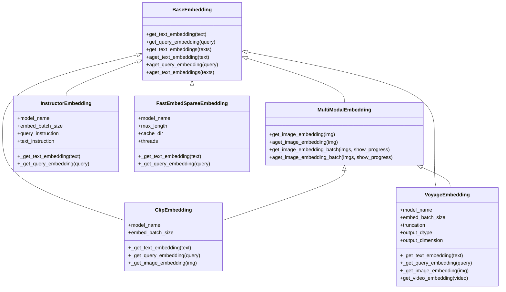

# Specialized Embeddings

<cite>
**Referenced Files in This Document**
- [__init__.py](file://llama-index-core/llama_index/core/embeddings/__init__.py)
- [multi_modal_base.py](file://llama-index-core/llama_index/core/embeddings/multi_modal_base.py)
- [mock_sparse_embedding.py](file://llama-index-core/llama_index/core/sparse_embeddings/mock_sparse_embedding.py)
- [base.py](file://llama-index-integrations/embeddings/llama-index-embeddings-clip/llama_index/embeddings/clip/base.py)
- [base.py](file://llama-index-integrations/embeddings/llama-index-embeddings-instructor/llama_index/embeddings/instructor/base.py)
- [base.py](file://llama-index-integrations/embeddings/llama-index-embeddings-voyageai/llama_index/embeddings/voyageai/base.py)
- [base.py](file://llama-index-integrations/sparse_embeddings/llama-index-sparse-embeddings-fastembed/llama_index/sparse_embeddings/fastembed/base.py)
</cite>

## Table of Contents
1. [Introduction](#introduction)
2. [Project Structure](#project-structure)
3. [Core Components](#core-components)
4. [Architecture Overview](#architecture-overview)
5. [Detailed Component Analysis](#detailed-component-analysis)
6. [Dependency Analysis](#dependency-analysis)
7. [Performance Considerations](#performance-considerations)
8. [Troubleshooting Guide](#troubleshooting-guide)
9. [Conclusion](#conclusion)

## Introduction
This document provides detailed API documentation for specialized embedding types and providers in the repository. It focuses on:
- Sparse embeddings for retrieval scenarios requiring compact, interpretable representations
- CLIP embeddings for vision-language tasks
- INSTRUCTOR embeddings for instruction-tuned, domain-specific semantic matching
- Voyage AI embeddings for multi-modal and domain-specific use cases

It explains when to choose sparse versus dense embeddings, how to leverage multi-modal embeddings for image-text matching, and how to implement hybrid search. It also covers model architectures, training data characteristics, and optimization strategies for specialized use cases.

## Project Structure
The specialized embeddings are implemented across core abstractions and provider integrations:
- Core abstractions define the embedding interfaces and multi-modal base classes
- Provider integrations implement specific embedding models (CLIP, INSTRUCTOR, Voyage AI)
- Sparse embedding provider integrates a fast sparse embedding backend

**Diagram sources**
- [multi_modal_base.py](file://llama-index-core/llama_index/core/embeddings/multi_modal_base.py#L16-L187)
- [base.py](file://llama-index-integrations/embeddings/llama-index-embeddings-clip/llama_index/embeddings/clip/base.py#L17-L132)
- [base.py](file://llama-index-integrations/embeddings/llama-index-embeddings-instructor/llama_index/embeddings/instructor/base.py#L17-L98)
- [base.py](file://llama-index-integrations/embeddings/llama-index-embeddings-voyageai/llama_index/embeddings/voyageai/base.py#L71-L496)
- [base.py](file://llama-index-integrations/sparse_embeddings/llama-index-sparse-embeddings-fastembed/llama_index/sparse_embeddings/fastembed/base.py#L15-L120)

**Section sources**
- [__init__.py](file://llama-index-core/llama_index/core/embeddings/__init__.py#L1-L16)

## Core Components
- MultiModalEmbedding: Base class for embeddings that support both text and image inputs, with synchronous and asynchronous APIs, batching, and progress reporting.
- ClipEmbedding: Implements CLIP-style text and image encoders using the OpenAI CLIP library and PyTorch, with automatic device selection.
- InstructorEmbedding: Implements instruction-tuned text embeddings using the INSTRUCTOR library, supporting configurable instructions and batched encoding.
- VoyageEmbedding: Implements multi-modal and domain-specific text/image/video embeddings via the Voyage AI client, with dynamic batching by token budget and model-specific features.
- FastEmbedSparseEmbedding: Implements sparse text embeddings using FastEmbed, returning sparse vectors suitable for exact or approximate sparse retrieval.

**Section sources**
- [multi_modal_base.py](file://llama-index-core/llama_index/core/embeddings/multi_modal_base.py#L16-L187)
- [base.py](file://llama-index-integrations/embeddings/llama-index-embeddings-clip/llama_index/embeddings/clip/base.py#L17-L132)
- [base.py](file://llama-index-integrations/embeddings/llama-index-embeddings-instructor/llama_index/embeddings/instructor/base.py#L17-L98)
- [base.py](file://llama-index-integrations/embeddings/llama-index-embeddings-voyageai/llama_index/embeddings/voyageai/base.py#L71-L496)
- [base.py](file://llama-index-integrations/sparse_embeddings/llama-index-sparse-embeddings-fastembed/llama_index/sparse_embeddings/fastembed/base.py#L15-L120)

## Architecture Overview
The embedding architecture separates concerns between:
- Abstraction: BaseEmbedding and MultiModalEmbedding define the contract for embeddings
- Providers: Each provider implements a specific model family with its own configuration and capabilities
- Sparse provider: A dedicated sparse embedding provider for retrieval-focused workloads

**Diagram sources**
- [multi_modal_base.py](file://llama-index-core/llama_index/core/embeddings/multi_modal_base.py#L16-L187)
- [base.py](file://llama-index-integrations/embeddings/llama-index-embeddings-clip/llama_index/embeddings/clip/base.py#L17-L132)
- [base.py](file://llama-index-integrations/embeddings/llama-index-embeddings-instructor/llama_index/embeddings/instructor/base.py#L17-L98)
- [base.py](file://llama-index-integrations/embeddings/llama-index-embeddings-voyageai/llama_index/embeddings/voyageai/base.py#L71-L496)
- [base.py](file://llama-index-integrations/sparse_embeddings/llama-index-sparse-embeddings-fastembed/llama_index/sparse_embeddings/fastembed/base.py#L15-L120)

## Detailed Component Analysis

### Sparse Embeddings
Sparse embeddings represent non-zero features as index-value pairs, enabling efficient sparse retrieval and interpretability. The FastEmbed-based provider wraps a sparse encoder and converts its output to the internal sparse dictionary format.

Key capabilities:
- Text and query embedding with separate encoders
- Batched text embedding
- Configurable model name, max length, cache directory, and thread count

Use cases:
- Keyword-centric retrieval
- Exact or approximate sparse vector databases
- Hybrid dense-sparse search

**Diagram sources**
- [base.py](file://llama-index-integrations/sparse_embeddings/llama-index-sparse-embeddings-fastembed/llama_index/sparse_embeddings/fastembed/base.py#L100-L102)
- [base.py](file://llama-index-integrations/sparse_embeddings/llama-index-sparse-embeddings-fastembed/llama_index/sparse_embeddings/fastembed/base.py#L86-L98)

**Section sources**
- [base.py](file://llama-index-integrations/sparse_embeddings/llama-index-sparse-embeddings-fastembed/llama_index/sparse_embeddings/fastembed/base.py#L15-L120)
- [mock_sparse_embedding.py](file://llama-index-core/llama_index/core/sparse_embeddings/mock_sparse_embedding.py#L10-L43)

### CLIP Embeddings (Vision-Language)
CLIP embeddings encode both text and images into a shared embedding space, enabling tasks like image-text retrieval and zero-shot classification.

Key capabilities:
- Text embedding via model.encode_text
- Image embedding via model.encode_image
- Automatic device selection (CUDA/CPU)
- Synchronous and asynchronous APIs
- Batching support for images

**Diagram sources**
- [multi_modal_base.py](file://llama-index-core/llama_index/core/embeddings/multi_modal_base.py#L37-L67)
- [base.py](file://llama-index-integrations/embeddings/llama-index-embeddings-clip/llama_index/embeddings/clip/base.py#L119-L131)

Use cases:
- Image-text matching and retrieval
- Cross-modal search
- Zero-shot image classification

**Section sources**
- [base.py](file://llama-index-integrations/embeddings/llama-index-embeddings-clip/llama_index/embeddings/clip/base.py#L17-L132)
- [multi_modal_base.py](file://llama-index-core/llama_index/core/embeddings/multi_modal_base.py#L16-L187)

### INSTRUCTOR Embeddings (Instruction-Tuned)
INSTRUCTOR embeddings prepend explicit instructions to inputs, improving semantic alignment for domain-specific tasks.

Key capabilities:
- Configurable instructions for queries and texts
- Automatic instruction inference for known models
- Batched encoding via the underlying INSTRUCTOR model
- Synchronous and asynchronous APIs

**Diagram sources**
- [base.py](file://llama-index-integrations/embeddings/llama-index-embeddings-instructor/llama_index/embeddings/instructor/base.py#L54-L70)
- [base.py](file://llama-index-integrations/embeddings/llama-index-embeddings-instructor/llama_index/embeddings/instructor/base.py#L72-L74)

Use cases:
- Domain-specific semantic matching
- Instruction-following retrieval
- Custom instruction tuning for enterprise domains

**Section sources**
- [base.py](file://llama-index-integrations/embeddings/llama-index-embeddings-instructor/llama_index/embeddings/instructor/base.py#L17-L98)

### Voyage AI Embeddings (Multi-Modal and Domain-Specific)
Voyage embeddings support:
- Text embeddings with dynamic batching by token budget
- Multi-modal embeddings for images and videos (model-dependent)
- Contextualized embeddings for specific use cases
- Configurable output dtype and dimension

**Diagram sources**
- [base.py](file://llama-index-integrations/embeddings/llama-index-embeddings-voyageai/llama_index/embeddings/voyageai/base.py#L387-L420)
- [base.py](file://llama-index-integrations/embeddings/llama-index-embeddings-voyageai/llama_index/embeddings/voyageai/base.py#L154-L178)

Use cases:
- Multi-modal retrieval (images, videos)
- Domain-specific models (code, finance, law)
- Large-context and contextualized embeddings

**Section sources**
- [base.py](file://llama-index-integrations/embeddings/llama-index-embeddings-voyageai/llama_index/embeddings/voyageai/base.py#L71-L496)

## Dependency Analysis
Provider integrations depend on external libraries and the core embedding abstractions. The following diagram shows the primary dependencies and relationships.

**Diagram sources**
- [base.py](file://llama-index-integrations/embeddings/llama-index-embeddings-clip/llama_index/embeddings/clip/base.py#L68-L84)
- [base.py](file://llama-index-integrations/embeddings/llama-index-embeddings-instructor/llama_index/embeddings/instructor/base.py#L3-L4)
- [base.py](file://llama-index-integrations/embeddings/llama-index-embeddings-voyageai/llama_index/embeddings/voyageai/base.py#L9-L10)
- [base.py](file://llama-index-integrations/sparse_embeddings/llama-index-sparse-embeddings-fastembed/llama_index/sparse_embeddings/fastembed/base.py#L9-L12)

**Section sources**
- [base.py](file://llama-index-integrations/embeddings/llama-index-embeddings-clip/llama_index/embeddings/clip/base.py#L68-L84)
- [base.py](file://llama-index-integrations/embeddings/llama-index-embeddings-instructor/llama_index/embeddings/instructor/base.py#L3-L4)
- [base.py](file://llama-index-integrations/embeddings/llama-index-embeddings-voyageai/llama_index/embeddings/voyageai/base.py#L9-L10)
- [base.py](file://llama-index-integrations/sparse_embeddings/llama-index-sparse-embeddings-fastembed/llama_index/sparse_embeddings/fastembed/base.py#L9-L12)

## Performance Considerations
- Device selection: CLIP automatically selects CUDA if available; otherwise falls back to CPU. Configure devices explicitly for deterministic performance.
- Batching: MultiModalEmbedding and VoyageEmbedding support batching to reduce overhead. Tune embed_batch_size for throughput and latency.
- Token-aware batching: VoyageEmbedding dynamically batches by token budget to respect model limits, improving throughput for long documents.
- Sparse retrieval: FastEmbedSparseEmbedding produces sparse vectors suitable for efficient sparse indexes; tune model_name and max_length for accuracy and speed.
- Async APIs: Prefer async methods for concurrent image or text embedding requests to improve throughput in multi-modal pipelines.

[No sources needed since this section provides general guidance]

## Troubleshooting Guide
Common issues and resolutions:
- Missing dependencies:
  - CLIP: Install the OpenAI CLIP library and PyTorch as indicated by the provider’s initialization checks.
  - Voyage AI: Ensure the voyageai client is installed and configured with a valid API key.
  - INSTRUCTOR: Ensure the InstructorEmbedding library is installed.
  - FastEmbed: Ensure the fastembed package is installed.
- Unsupported input types:
  - Voyage AI image/video validation raises errors for unsupported formats; verify file extensions and sizes.
  - CLIP expects valid image paths and supports common image formats via Pillow.
- Model limitations:
  - Voyage AI restricts certain features (e.g., video) to specific models; check model compatibility before calling video embedding methods.
  - Voyage AI contextualized embeddings require specific models; ensure model_name matches supported categories.

**Section sources**
- [base.py](file://llama-index-integrations/embeddings/llama-index-embeddings-clip/llama_index/embeddings/clip/base.py#L68-L84)
- [base.py](file://llama-index-integrations/embeddings/llama-index-embeddings-voyageai/llama_index/embeddings/voyageai/base.py#L140-L198)
- [base.py](file://llama-index-integrations/embeddings/llama-index-embeddings-voyageai/llama_index/embeddings/voyageai/base.py#L200-L232)
- [base.py](file://llama-index-integrations/embeddings/llama-index-embeddings-voyageai/llama_index/embeddings/voyageai/base.py#L240-L260)

## Conclusion
This documentation outlined specialized embedding types and providers available in the repository:
- Sparse embeddings for efficient retrieval and hybrid search
- CLIP embeddings for robust text-image matching
- INSTRUCTOR embeddings for instruction-tuned, domain-aligned semantics
- Voyage AI embeddings for multi-modal and domain-specific capabilities

By leveraging the core abstractions and provider-specific features, you can select the right embedding strategy for your use case, optimize performance with batching and async APIs, and integrate multi-modal capabilities for advanced applications.