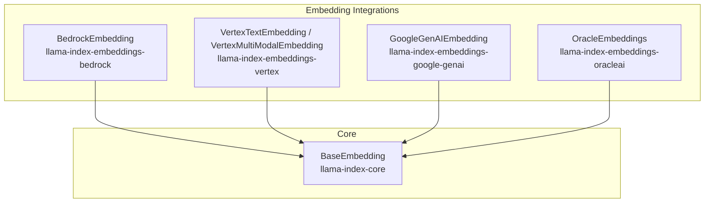
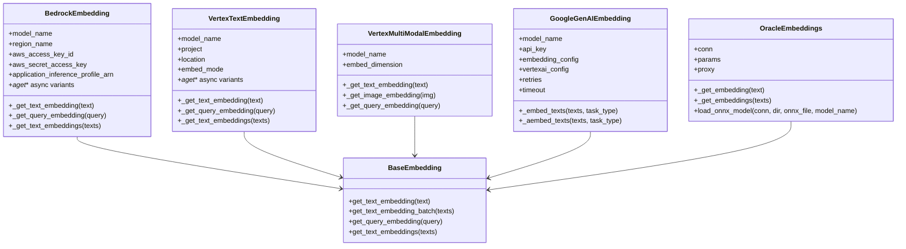
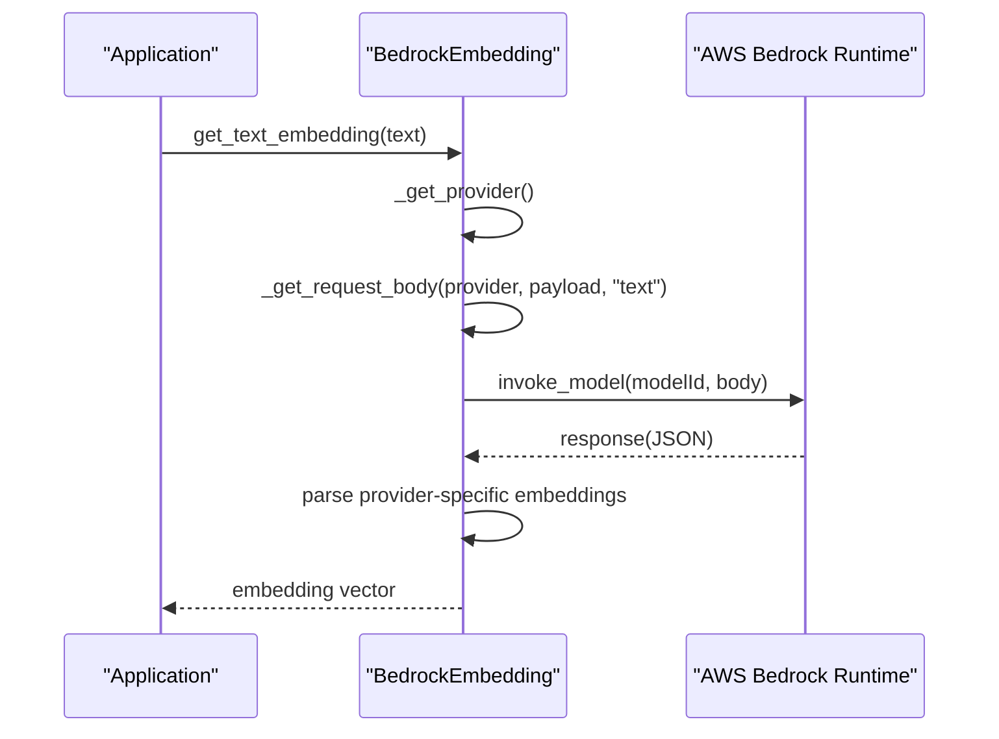
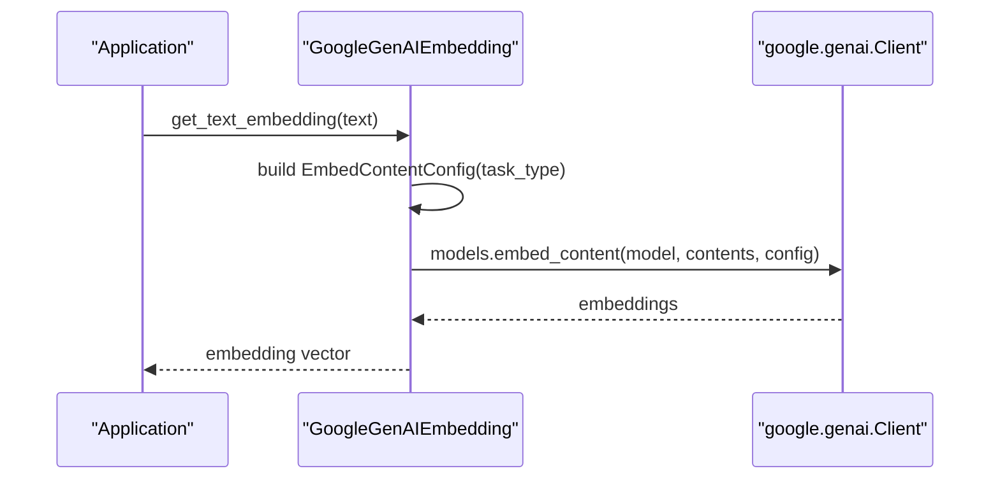
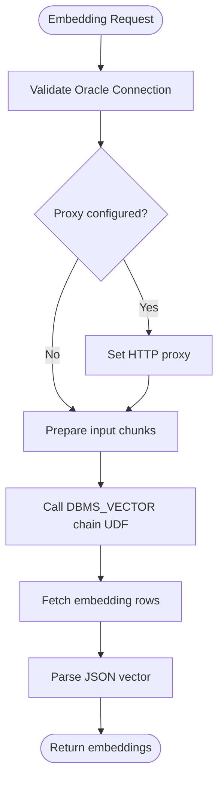
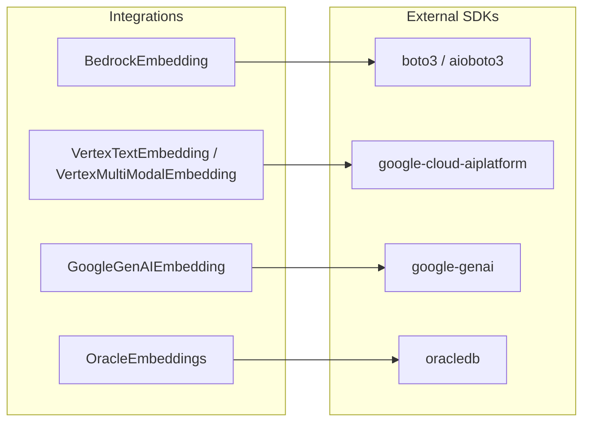

# Cloud Provider Embeddings

<cite>
**Referenced Files in This Document**
- [base.py](file://llama-index-integrations/embeddings/llama-index-embeddings-bedrock/llama_index/embeddings/bedrock/base.py)
- [README.md](file://llama-index-integrations/embeddings/llama-index-embeddings-bedrock/README.md)
- [pyproject.toml](file://llama-index-integrations/embeddings/llama-index-embeddings-bedrock/pyproject.toml)
- [base.py](file://llama-index-integrations/embeddings/llama-index-embeddings-vertex/llama_index/embeddings/vertex/base.py)
- [README.md](file://llama-index-integrations/embeddings/llama-index-embeddings-vertex/README.md)
- [pyproject.toml](file://llama-index-integrations/embeddings/llama-index-embeddings-vertex/pyproject.toml)
- [base.py](file://llama-index-integrations/embeddings/llama-index-embeddings-oracleai/llama_index/embeddings/oracleai/base.py)
- [README.md](file://llama-index-integrations/embeddings/llama-index-embeddings-oracleai/README.md)
- [pyproject.toml](file://llama-index-integrations/embeddings/llama-index-embeddings-oracleai/pyproject.toml)
- [base.py](file://llama-index-integrations/embeddings/llama-index-embeddings-google-genai/llama_index/embeddings/google_genai/base.py)
- [README.md](file://llama-index-integrations/embeddings/llama-index-embeddings-google-genai/README.md)
- [pyproject.toml](file://llama-index-integrations/embeddings/llama-index-embeddings-google-genai/pyproject.toml)
</cite>

## Table of Contents
1. [Introduction](#introduction)
2. [Project Structure](#project-structure)
3. [Core Components](#core-components)
4. [Architecture Overview](#architecture-overview)
5. [Detailed Component Analysis](#detailed-component-analysis)
6. [Dependency Analysis](#dependency-analysis)
7. [Performance Considerations](#performance-considerations)
8. [Troubleshooting Guide](#troubleshooting-guide)
9. [Conclusion](#conclusion)

## Introduction
This document provides comprehensive API documentation for cloud provider embedding integrations within the LlamaIndex ecosystem. It focuses on four major providers:
- Google Vertex AI (via Google GenAI unified SDK)
- AWS Bedrock
- Oracle AI (via Oracle Database vector capabilities)
- Other cloud platforms (conceptual coverage)

It covers authentication methods, regional endpoints, service-specific configurations, model availability, performance characteristics, and provider-specific features such as custom models and enterprise-grade security. Where applicable, it includes examples of service account setup, IAM permissions, and cross-region deployments.

## Project Structure
Each provider integration is implemented as a separate package under the embeddings namespace. The core classes inherit from LlamaIndex’s BaseEmbedding and expose synchronous and asynchronous embedding generation APIs.

**Diagram sources**
- [base.py](file://llama-index-integrations/embeddings/llama-index-embeddings-bedrock/llama_index/embeddings/bedrock/base.py#L79-L562)
- [base.py](file://llama-index-integrations/embeddings/llama-index-embeddings-vertex/llama_index/embeddings/vertex/base.py#L105-L303)
- [base.py](file://llama-index-integrations/embeddings/llama-index-embeddings-google-genai/llama_index/embeddings/google_genai/base.py#L119-L337)
- [base.py](file://llama-index-integrations/embeddings/llama-index-embeddings-oracleai/llama_index/embeddings/oracleai/base.py#L25-L209)

**Section sources**
- [base.py](file://llama-index-integrations/embeddings/llama-index-embeddings-bedrock/llama_index/embeddings/bedrock/base.py#L1-L562)
- [base.py](file://llama-index-integrations/embeddings/llama-index-embeddings-vertex/llama_index/embeddings/vertex/base.py#L1-L303)
- [base.py](file://llama-index-integrations/embeddings/llama-index-embeddings-google-genai/llama_index/embeddings/google_genai/base.py#L1-L337)
- [base.py](file://llama-index-integrations/embeddings/llama-index-embeddings-oracleai/llama_index/embeddings/oracleai/base.py#L1-L209)

## Core Components
- BedrockEmbedding
  - Provider support: Amazon Titan, Cohere
  - Models: Titan family, Cohere v3/v4, Cohere multimodal v4
  - Authentication: AWS credentials, profile, environment variables
  - Regional endpoints: AWS regions; supports Application Inference Profiles
  - Additional features: dimensions and normalize for Titan v2.0; async support
- VertexTextEmbedding / VertexMultiModalEmbedding
  - Provider: Google Vertex AI
  - Models: textembedding-gecko series, multimodalembedding
  - Authentication: service account JSON or individual credential fields
  - Regional endpoints: GCP project and location
  - Additional features: task-type-aware embeddings; multimodal support
- GoogleGenAIEmbedding
  - Provider: Google GenAI (Gemini) and Vertex AI
  - Models: text-embedding models; supports task types
  - Authentication: API key or Vertex AI credentials; environment-based detection
  - Regional endpoints: Vertex AI project/location
  - Additional features: retry/backoff policies; async support
- OracleEmbeddings
  - Provider: Oracle Database with vector capabilities
  - Models: provider/model configured via params; ONNX model loading supported
  - Authentication: Oracle DB connection; optional HTTP proxy
  - Additional features: batch embedding via DBMS_VECTOR chain

**Section sources**
- [base.py](file://llama-index-integrations/embeddings/llama-index-embeddings-bedrock/llama_index/embeddings/bedrock/base.py#L16-L28)
- [base.py](file://llama-index-integrations/embeddings/llama-index-embeddings-bedrock/llama_index/embeddings/bedrick/base.py#L217-L224)
- [README.md](file://llama-index-integrations/embeddings/llama-index-embeddings-bedrock/README.md#L29-L50)
- [base.py](file://llama-index-integrations/embeddings/llama-index-embeddings-vertex/llama_index/embeddings/vertex/base.py#L105-L180)
- [README.md](file://llama-index-integrations/embeddings/llama-index-embeddings-vertex/README.md#L5-L14)
- [base.py](file://llama-index-integrations/embeddings/llama-index-embeddings-google-genai/llama_index/embeddings/google_genai/base.py#L119-L244)
- [README.md](file://llama-index-integrations/embeddings/llama-index-embeddings-google-genai/README.md#L22-L32)
- [base.py](file://llama-index-integrations/embeddings/llama-index-embeddings-oracleai/llama_index/embeddings/oracleai/base.py#L25-L46)
- [README.md](file://llama-index-integrations/embeddings/llama-index-embeddings-oracleai/README.md#L1-L41)

## Architecture Overview
The integrations follow a consistent pattern:
- A provider-specific class extends BaseEmbedding
- Constructor accepts provider credentials and configuration
- Methods implement embedding generation for text/query and batch operations
- Async variants are provided where supported by the underlying SDK

**Diagram sources**
- [base.py](file://llama-index-integrations/embeddings/llama-index-embeddings-bedrock/llama_index/embeddings/bedrock/base.py#L79-L562)
- [base.py](file://llama-index-integrations/embeddings/llama-index-embeddings-vertex/llama_index/embeddings/vertex/base.py#L105-L303)
- [base.py](file://llama-index-integrations/embeddings/llama-index-embeddings-google-genai/llama_index/embeddings/google_genai/base.py#L119-L337)
- [base.py](file://llama-index-integrations/embeddings/llama-index-embeddings-oracleai/llama_index/embeddings/oracleai/base.py#L25-L209)

## Detailed Component Analysis

### AWS Bedrock Embeddings
- Authentication
  - AWS credentials via constructor parameters, AWS profile, or environment variables
  - Region selection via region_name
- Regional endpoints
  - Uses AWS region; supports Application Inference Profiles for cost tracking
- Models and capabilities
  - Amazon Titan family and Cohere models
  - Cohere v4 multimodal support; automatic response parsing
- Configuration
  - max_retries, timeout, additional_kwargs
  - application_inference_profile_arn for cross-region inference profiles
- Performance
  - Async variants supported via aioboto3
  - Batch support for Cohere; Titan provider rejects batch lists

**Diagram sources**
- [base.py](file://llama-index-integrations/embeddings/llama-index-embeddings-bedrock/llama_index/embeddings/bedrock/base.py#L405-L440)
- [base.py](file://llama-index-integrations/embeddings/llama-index-embeddings-bedrock/llama_index/embeddings/bedrock/base.py#L520-L562)

**Section sources**
- [base.py](file://llama-index-integrations/embeddings/llama-index-embeddings-bedrock/llama_index/embeddings/bedrock/base.py#L79-L224)
- [README.md](file://llama-index-integrations/embeddings/llama-index-embeddings-bedrock/README.md#L52-L127)
- [pyproject.toml](file://llama-index-integrations/embeddings/llama-index-embeddings-bedrock/pyproject.toml#L36-L40)

### Google Vertex AI Embeddings (via Google GenAI)
- Authentication
  - API key or Vertex AI credentials
  - Environment detection for GOOGLE_API_KEY and GOOGLE_GENAI_USE_VERTEXAI
- Regional endpoints
  - Vertex AI project and location
- Models and capabilities
  - Task-type aware embeddings (RETRIEVAL_QUERY, RETRIEVAL_DOCUMENT)
  - Retry/backoff policies configurable
- Configuration
  - embedding_config override, http_options, debug_config
- Performance
  - Async support via aio client
  - Backoff-based retry for transient errors

**Diagram sources**
- [base.py](file://llama-index-integrations/embeddings/llama-index-embeddings-google-genai/llama_index/embeddings/google_genai/base.py#L250-L324)

**Section sources**
- [base.py](file://llama-index-integrations/embeddings/llama-index-embeddings-google-genai/llama_index/embeddings/google_genai/base.py#L119-L244)
- [README.md](file://llama-index-integrations/embeddings/llama-index-embeddings-google-genai/README.md#L22-L32)
- [pyproject.toml](file://llama-index-integrations/embeddings/llama-index-embeddings-google-genai/pyproject.toml#L36-L39)

### Oracle AI Embeddings
- Authentication
  - Oracle DB connection; optional HTTP proxy
- Models and capabilities
  - Provider/model configured via params; supports ONNX model loading
  - Batch embedding via DBMS_VECTOR chain
- Configuration
  - Proxy support for environments behind HTTP proxies
- Performance
  - Synchronous embedding via SQL; batch via array types

**Diagram sources**
- [base.py](file://llama-index-integrations/embeddings/llama-index-embeddings-oracleai/llama_index/embeddings/oracleai/base.py#L85-L209)

**Section sources**
- [base.py](file://llama-index-integrations/embeddings/llama-index-embeddings-oracleai/llama_index/embeddings/oracleai/base.py#L25-L209)
- [README.md](file://llama-index-integrations/embeddings/llama-index-embeddings-oracleai/README.md#L1-L41)
- [pyproject.toml](file://llama-index-integrations/embeddings/llama-index-embeddings-oracleai/pyproject.toml#L35-L38)

### Vertex AI Embeddings (Legacy Vertex Package)
- Authentication
  - Service account JSON or individual credential fields
- Regional endpoints
  - Project and location initialization
- Models and capabilities
  - Text and multimodal embedding models
  - Task-type mapping for older models
- Performance
  - Async support for text embeddings; multimodalembedding lacks async in legacy package

**Section sources**
- [base.py](file://llama-index-integrations/embeddings/llama-index-embeddings-vertex/llama_index/embeddings/vertex/base.py#L105-L303)
- [README.md](file://llama-index-integrations/embeddings/llama-index-embeddings-vertex/README.md#L1-L60)
- [pyproject.toml](file://llama-index-integrations/embeddings/llama-index-embeddings-vertex/pyproject.toml#L35-L38)

## Dependency Analysis
- External SDKs and libraries
  - Bedrock: boto3, aioboto3
  - Vertex: google-cloud-aiplatform
  - Google GenAI: google-genai
  - Oracle: oracledb
- Internal dependencies
  - All integrations depend on llama-index-core BaseEmbedding

**Diagram sources**
- [pyproject.toml](file://llama-index-integrations/embeddings/llama-index-embeddings-bedrock/pyproject.toml#L36-L40)
- [pyproject.toml](file://llama-index-integrations/embeddings/llama-index-embeddings-vertex/pyproject.toml#L35-L38)
- [pyproject.toml](file://llama-index-integrations/embeddings/llama-index-embeddings-google-genai/pyproject.toml#L36-L39)
- [pyproject.toml](file://llama-index-integrations/embeddings/llama-index-embeddings-oracleai/pyproject.toml#L35-L38)

**Section sources**
- [pyproject.toml](file://llama-index-integrations/embeddings/llama-index-embeddings-bedrock/pyproject.toml#L1-L67)
- [pyproject.toml](file://llama-index-integrations/embeddings/llama-index-embeddings-vertex/pyproject.toml#L1-L67)
- [pyproject.toml](file://llama-index-integrations/embeddings/llama-index-embeddings-google-genai/pyproject.toml#L1-L66)
- [pyproject.toml](file://llama-index-integrations/embeddings/llama-index-embeddings-oracleai/pyproject.toml#L1-L66)

## Performance Considerations
- Retries and timeouts
  - Google GenAI integration includes configurable retries and exponential backoff for transient failures.
- Batch sizes
  - Integrations leverage DEFAULT_EMBED_BATCH_SIZE; adjust according to provider limits and latency targets.
- Async support
  - Bedrock and Google GenAI provide async methods to improve throughput under concurrent loads.
- Provider-specific constraints
  - Titan provider rejects batch lists; Cohere supports batch for v3/v4.
  - Vertex multimodalembedding lacks async in legacy package.

[No sources needed since this section provides general guidance]

## Troubleshooting Guide
- AWS Bedrock
  - Ensure region_name is set correctly; verify credentials via profile/environment variables.
  - For Application Inference Profiles, ensure model_name matches the referenced model.
- Google Vertex AI (GenAI)
  - Verify GOOGLE_API_KEY or Vertex AI credentials; confirm project/location.
  - Use embedding_config to specify task_type when needed.
- Oracle AI
  - Confirm Oracle DB connectivity and permissions for DBMS_VECTOR chain.
  - Use proxy parameter if behind an HTTP proxy.
- General
  - Increase max_retries and tune timeout for transient network errors.
  - Validate model_name against provider documentation.

**Section sources**
- [base.py](file://llama-index-integrations/embeddings/llama-index-embeddings-bedrock/llama_index/embeddings/bedrock/base.py#L24-L28)
- [base.py](file://llama-index-integrations/embeddings/llama-index-embeddings-google-genai/llama_index/embeddings/google_genai/base.py#L38-L77)
- [base.py](file://llama-index-integrations/embeddings/llama-index-embeddings-oracleai/llama_index/embeddings/oracleai/base.py#L85-L126)

## Conclusion
These integrations enable seamless embedding generation across major cloud providers with consistent APIs. Choose the appropriate integration based on your provider and deployment model, configure credentials and regions accordingly, and leverage async and retry mechanisms for robust production deployments.