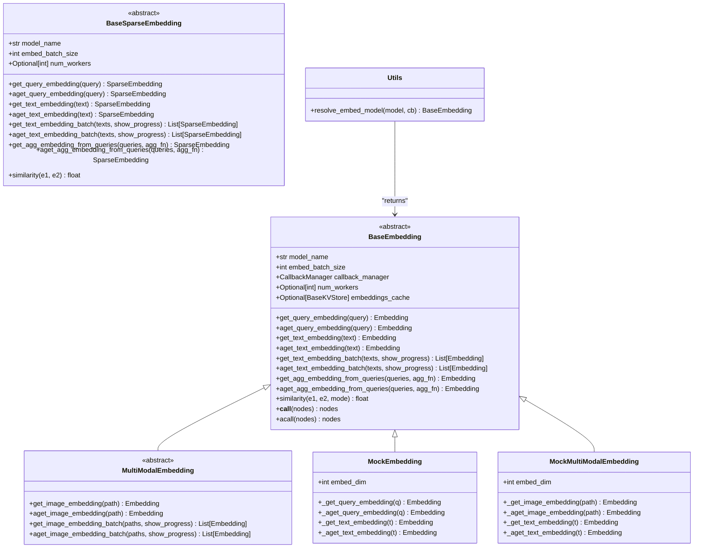
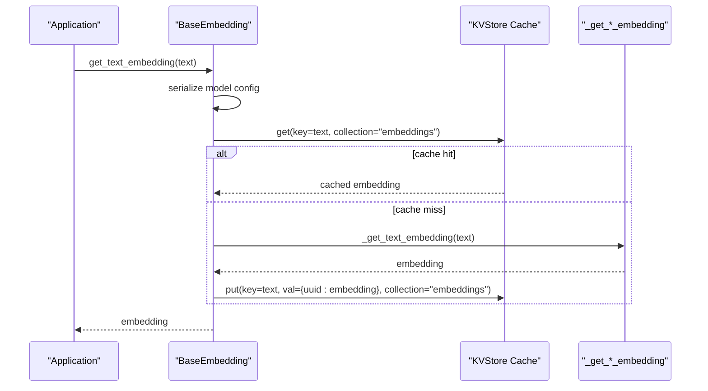
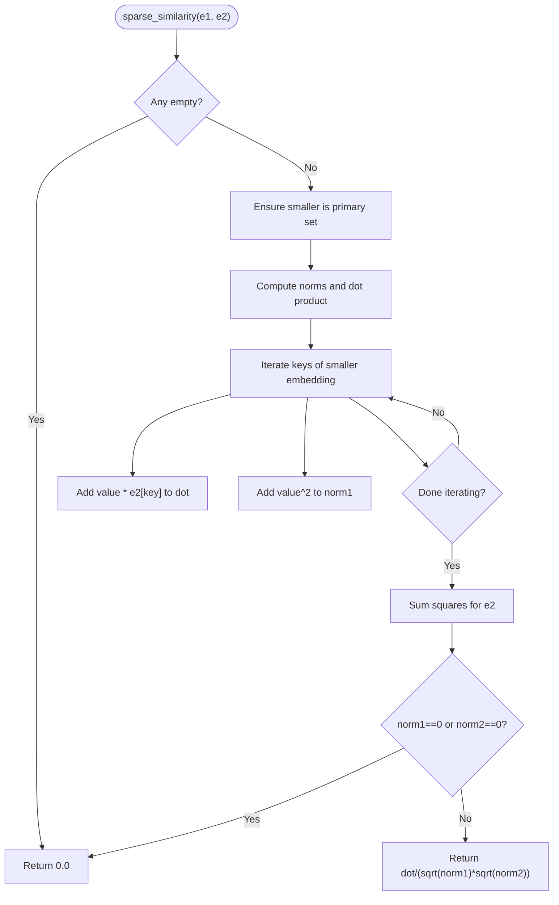
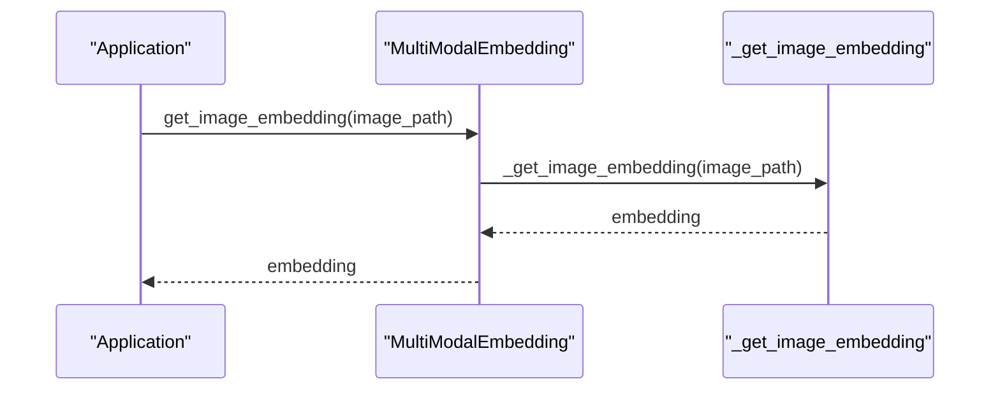
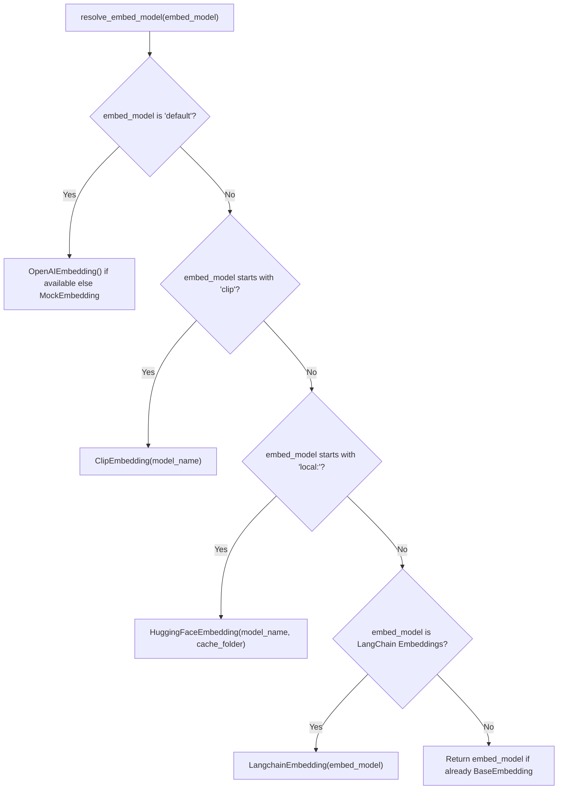
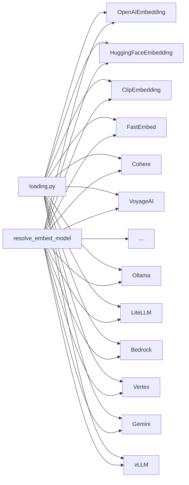

# Custom Embedding Development

<cite>
**Referenced Files in This Document**
- [base.py](file://llama-index-core/llama_index/core/base/embeddings/base.py)
- [base_sparse.py](file://llama-index-core/llama_index/core/base/embeddings/base_sparse.py)
- [multi_modal_base.py](file://llama-index-core/llama_index/core/embeddings/multi_modal_base.py)
- [__init__.py](file://llama-index-core/llama_index/core/embeddings/__init__.py)
- [utils.py](file://llama-index-core/llama_index/core/embeddings/utils.py)
- [pooling.py](file://llama-index-core/llama_index/core/embeddings/pooling.py)
- [mock_embed_model.py](file://llama-index-core/llama_index/core/embeddings/mock_embed_model.py)
- [loading.py](file://llama-index-core/llama_index/core/embeddings/loading.py)
- [embedding.py](file://llama-index-core/llama_index/core/instrumentation/events/embedding.py)
- [embedding.py](file://llama-index-core/llama_index/core/llama_dataset/legacy/embedding.py)
- [embedding.py](file://llama-index-integrations/embeddings/llama-index-embeddings-adapter/llama_index/embeddings/adapter/embedding.py)
- [embedding.py](file://llama-index-integrations/embeddings/llama-index-embeddings-openai/llama_index/embeddings/openai/embedding.py)
- [embedding.py](file://llama-index-integrations/embeddings/llama-index-embeddings-huggingface/llama_index/embeddings/huggingface/embedding.py)
- [embedding.py](file://llama-index-integrations/embeddings/llama-index-embeddings-clip/llama_index/embeddings/clip/embedding.py)
- [embedding.py](file://llama-index-integrations/embeddings/llama-index-embeddings-fastembed/llama_index/embeddings/fastembed/embedding.py)
- [embedding.py](file://llama-index-integrations/embeddings/llama-index-embeddings-cohere/llama_index/embeddings/cohere/embedding.py)
- [embedding.py](file://llama-index-integrations/embeddings/llama-index-embeddings-voyageai/llama_index/embeddings/voyageai/embedding.py)
- [embedding.py](file://llama-index-integrations/embeddings/llama-index-embeddings-ollama/llama_index/embeddings/ollama/embedding.py)
- [embedding.py](file://llama-index-integrations/embeddings/llama-index-embeddings-litellm/llama_index/embeddings/litellm/embedding.py)
- [embedding.py](file://llama-index-integrations/embeddings/llama-index-embeddings-bge-m3/llama_index/embeddings/bgem3/embedding.py)
- [embedding.py](file://llama-index-integrations/embeddings/llama-index-embeddings-instructor/llama_index/embeddings/instructor/embedding.py)
- [embedding.py](file://llama-index-integrations/embeddings/llama-index-embeddings-azure-openai/llama_index/embeddings/azure_openai/embedding.py)
- [embedding.py](file://llama-index-integrations/embeddings/llama-index-embeddings-bedrock/llama_index/embeddings/bedrock/embedding.py)
- [embedding.py](file://llama-index-integrations/embeddings/llama-index-embeddings-gemini/llama_index/embeddings/gemini/embedding.py)
- [embedding.py](file://llama-index-integrations/embeddings/llama-index-embeddings-vllm/llama_index/embeddings/vllm/embedding.py)
- [embedding.py](file://llama-index-integrations/embeddings/llama-index-embeddings-vertex/llama_index/embeddings/vertex/embedding.py)
- [embedding.py](file://llama-index-integrations/embeddings/llama-index-embeddings-llamafile/llama_index/embeddings/llamafile/embedding.py)
- [embedding.py](file://llama-index-integrations/embeddings/llama-index-embeddings-fireworks/llama_index/embeddings/fireworks/embedding.py)
- [embedding.py](file://llama-index-integrations/embeddings/llama-index-embeddings-dashscope/llama_index/embeddings/dashscope/embedding.py)
- [embedding.py](file://llama-index-integrations/embeddings/llama-index-embeddings-ibm/llama_index/embeddings/ibm/embedding.py)
- [embedding.py](file://llama-index-integrations/embeddings/llama-index-embeddings-nvidia/llama_index/embeddings/nvidia/embedding.py)
- [embedding.py](file://llama-index-integrations/embeddings/llama-index-embeddings-heroku/llama_index/embeddings/heroku/embedding.py)
- [embedding.py](file://llama-index-integrations/embeddings/llama-index-embeddings-clarifai/llama_index/embeddings/clarifai/embedding.py)
- [embedding.py](file://llama-index-integrations/embeddings/llama-index-embeddings-aws-sagemaker/llama_index/embeddings/sagemaker/embedding.py)
- [embedding.py](file://llama-index-integrations/embeddings/llama-index-embeddings-aws-sagemaker-endpoint/llama_index/embeddings/sagemaker_endpoint/embedding.py)
- [embedding.py](file://llama-index-integrations/embeddings/llama-index-embeddings-aws-sagemaker-neo/llama_index/embeddings/sagemaker_neo/embedding.py)
- [embedding.py](file://llama-index-integrations/embeddings/llama-index-embeddings-aws-sagemaker-neuron/llama_index/embeddings/sagemaker_neuron/embedding.py)
- [embedding.py](file://llama-index-integrations/embeddings/llama-index-embeddings-aws-sagemaker-triton/llama_index/embeddings/sagemaker_triton/embedding.py)
- [embedding.py](file://llama-index-integrations/embeddings/llama-index-embeddings-aws-sagemaker-openvino/llama_index/embeddings/sagemaker_openvino/embedding.py)
- [embedding.py](file://llama-index-integrations/embeddings/llama-index-embeddings-aws-sagemaker-optimum/llama_index/embeddings/sagemaker_optimum/embedding.py)
- [embedding.py](file://llama-index-integrations/embeddings/llama-index-embeddings-aws-sagemaker-optimum-intel/llama_index/embeddings/sagemaker_optimum_intel/embedding.py)
- [embedding.py](file://llama-index-integrations/embeddings/llama-index-embeddings-aws-sagemaker-llm-rails/llama_index/embeddings/sagemaker_llm_rails/embedding.py)
- [embedding.py](file://llama-index-integrations/embeddings/llama-index-embeddings-aws-sagemaker-text-embeddings-inference/llama_index/embeddings/sagemaker_tei/embedding.py)
- [embedding.py](file://llama-index-integrations/embeddings/llama-index-embeddings-aws-sagemaker-xinference/llama_index/embeddings/sagemaker_xinference/embedding.py)
- [embedding.py](file://llama-index-integrations/embeddings/llama-index-embeddings-aws-sagemaker-premai/llama_index/embeddings/sagemaker_prem_ai/embedding.py)
- [embedding.py](file://llama-index-integrations/embeddings/llama-index-embeddings-aws-sagemaker-vertex/llama_index/embeddings/sagemaker_vertex/embedding.py)
- [embedding.py](file://llama-index-integrations/embeddings/llama-index-embeddings-aws-sagemaker-vertex-endpoint/llama_index/embeddings/sagemaker_vertex_endpoint/embedding.py)
- [embedding.py](file://llama-index-integrations/embeddings/llama-index-embeddings-aws-sagemaker-oci-genai/llama_index/embeddings/sagemaker_oci_genai/embedding.py)
- [embedding.py](file://llama-index-integrations/embeddings/llama-index-embeddings-aws-sagemaker-oci-data-science/llama_index/embeddings/sagemaker_oci_data_science/embedding.py)
- [embedding.py](file://llama-index-integrations/embeddings/llama-index-embeddings-aws-sagemaker-azure-openai/llama_index/embeddings/sagemaker_azure_openai/embedding.py)
- [embedding.py](file://llama-index-integrations/embeddings/llama-index-embeddings-aws-sagemaker-azure-inference/llama_index/embeddings/sagemaker_azure_inference/embedding.py)
- [embedding.py](file://llama-index-integrations/embeddings/llama-index-embeddings-aws-sagemaker-baseten/llama_index/embeddings/sagemaker_baseten/embedding.py)
- [embedding.py](file://llama-index-integrations/embeddings/llama-index-embeddings-aws-sagemaker-heroku/llama_index/embeddings/sagemaker_heroku/embedding.py)
- [embedding.py](file://llama-index-integrations/embeddings/llama-index-embeddings-aws-sagemaker-clarifai/llama_index/embeddings/sagemaker_clarifai/embedding.py)
- [embedding.py](file://llama-index-integrations/embeddings/llama-index-embeddings-aws-sagemaker-elasticsearch/llama_index/embeddings/sagemaker_elasticsearch/embedding.py)
- [embedding.py](file://llama-index-integrations/embeddings/llama-index-embeddings-aws-sagemaker-fastembed/llama_index/embeddings/sagemaker_fastembed/embedding.py)
- [embedding.py](file://llama-index-integrations/embeddings/llama-index-embeddings-aws-sagemaker-fireworks/llama_index/embeddings/sagemaker_fireworks/embedding.py)
- [embedding.py](file://llama-index-integrations/embeddings/llama-index-embeddings-aws-sagemaker-gemini/llama_index/embeddings/sagemaker_gemini/embedding.py)
- [embedding.py](file://llama-index-integrations/embeddings/llama-index-embeddings-aws-sagemaker-gaudi/llama_index/embeddings/sagemaker_gaudi/embedding.py)
- [embedding.py](file://llama-index-integrations/embeddings/llama-index-embeddings-aws-sagemaker-google-genai/llama_index/embeddings/sagemaker_google_genai/embedding.py)
- [embedding.py](file://llama-index-integrations/embeddings/llama-index-embeddings-aws-sagemaker-huggingface/llama_index/embeddings/sagemaker_huggingface/embedding.py)
- [embedding.py](file://llama-index-integrations/embeddings/llama-index-embeddings-aws-sagemaker-huggingface-api/llama_index/embeddings/sagemaker_huggingface_api/embedding.py)
- [embedding.py](file://llama-index-integrations/embeddings/llama-index-embeddings-aws-sagemaker-huggingface-openvino/llama_index/embeddings/sagemaker_huggingface_openvino/embedding.py)
- [embedding.py](file://llama-index-integrations/embeddings/llama-index-embeddings-aws-sagemaker-huggingface-optimum/llama_index/embeddings/sagemaker_huggingface_optimum/embedding.py)
- [embedding.py](file://llama-index-integrations/embeddings/llama-index-embeddings-aws-sagemaker-huggingface-optimum-intel/llama_index/embeddings/sagemaker_huggingface_optimum_intel/embedding.py)
- [embedding.py](file://llama-index-integrations/embeddings/llama-index-embeddings-aws-sagemaker-ibm/llama_index/embeddings/sagemaker_ibm/embedding.py)
- [embedding.py](file://llama-index-integrations/embeddings/llama-index-embeddings-aws-sagemaker-instructor/llama_index/embeddings/sagemaker_instructor/embedding.py)
- [embedding.py](file://llama-index-integrations/embeddings/llama-index-embeddings-aws-sagemaker-jinaai/llama_index/embeddings/sagemaker_jinaai/embedding.py)
- [embedding.py](file://llama-index-integrations/embeddings/llama-index-embeddings-aws-sagemaker-langchain/llama_index/embeddings/sagemaker_langchain/embedding.py)
- [embedding.py](file://llama-index-integrations/embeddings/llama-index-embeddings-aws-sagemaker-litellm/llama_index/embeddings/sagemaker_litellm/embedding.py)
- [embedding.py](file://llama-index-integrations/embeddings/llama-index-embeddings-aws-sagemaker-llamafile/llama_index/embeddings/sagemaker_llamafile/embedding.py)
- [embedding.py](file://llama-index-integrations/embeddings/llama-index-embeddings-aws-sagemaker-llm-rails/llama_index/embeddings/sagemaker_llm_rails/embedding.py)
- [embedding.py](file://llama-index-integrations/embeddings/llama-index-embeddings-aws-sagemaker-mistralai/llama_index/embeddings/sagemaker_mistralai/embedding.py)
- [embedding.py](file://llama-index-integrations/embeddings/llama-index-embeddings-aws-sagemaker-mixedbreadai/llama_index/embeddings/sagemaker_mixedbreadai/embedding.py)
- [embedding.py](file://llama-index-integrations/embeddings/llama-index-embeddings-aws-sagemaker-modelscope/llama_index/embeddings/sagemaker_modelscope/embedding.py)
- [embedding.py](file://llama-index-integrations/embeddings/llama-index-embeddings-aws-sagemaker-nebius/llama_index/embeddings/sagemaker_nebius/embedding.py)
- [embedding.py](file://llama-index-integrations/embeddings/llama-index-embeddings-aws-sagemaker-netmind/llama_index/embeddings/sagemaker_netmind/embedding.py)
- [embedding.py](file://llama-index-integrations/embeddings/llama-index-embeddings-aws-sagemaker-nomic/llama_index/embeddings/sagemaker_nomic/embedding.py)
- [embedding.py](file://llama-index-integrations/embeddings/llama-index-embeddings-aws-sagemaker-nvidia/llama_index/embeddings/sagemaker_nvidia/embedding.py)
- [embedding.py](file://llama-index-integrations/embeddings/llama-index-embeddings-aws-sagemaker-oci-genai/llama_index/embeddings/sagemaker_oci_genai/embedding.py)
- [embedding.py](file://llama-index-integrations/embeddings/llama-index-embeddings-aws-sagemaker-oci-data-science/llama_index/embeddings/sagemaker_oci_data_science/embedding.py)
- [embedding.py](file://llama-index-integrations/embeddings/llama-index-embeddings-aws-sagemaker-ollama/llama_index/embeddings/sagemaker_ollama/embedding.py)
- [embedding.py](file://llama-index-integrations/embeddings/llama-index-embeddings-aws-sagemaker-opea/llama_index/embeddings/sagemaker_opea/embedding.py)
- [embedding.py](file://llama-index-integrations/embeddings/llama-index-embeddings-aws-sagemaker-openai/llama_index/embeddings/sagemaker_openai/embedding.py)
- [embedding.py](file://llama-index-integrations/embeddings/llama-index-embeddings-aws-sagemaker-openai-like/llama_index/embeddings/sagemaker_openai_like/embedding.py)
- [embedding.py](file://llama-index-integrations/embeddings/llama-index-embeddings-aws-sagemaker-openvino-genai/llama_index/embeddings/sagemaker_openvino_genai/embedding.py)
- [embedding.py](file://llama-index-integrations/embeddings/llama-index-embeddings-aws-sagemaker-oracleai/llama_index/embeddings/sagemaker_oracleai/embedding.py)
- [embedding.py](file://llama-index-integrations/embeddings/llama-index-embeddings-aws-sagemaker-premai/llama_index/embeddings/sagemaker_prem_ai/embedding.py)
- [embedding.py](file://llama-index-integrations/embeddings/llama-index-embeddings-aws-sagemaker-sagemaker-endpoint/llama_index/embeddings/sagemaker_endpoint/embedding.py)
- [embedding.py](file://llama-index-integrations/embeddings/llama-index-embeddings-aws-sagemaker-siliconflow/llama_index/embeddings/sagemaker_siliconflow/embedding.py)
- [embedding.py](file://llama-index-integrations/embeddings/llama-index-embeddings-aws-sagemaker-textembed/llama_index/embeddings/sagemaker_textembed/embedding.py)
- [embedding.py](file://llama-index-integrations/embeddings/llama-index-embeddings-aws-sagemaker-together/llama_index/embeddings/sagemaker_together/embedding.py)
- [embedding.py](file://llama-index-integrations/embeddings/llama-index-embeddings-aws-sagemaker-upstage/llama_index/embeddings/sagemaker_upstage/embedding.py)
- [embedding.py](file://llama-index-integrations/embeddings/llama-index-embeddings-aws-sagemaker-vertex/llama_index/embeddings/sagemaker_vertex/embedding.py)
- [embedding.py](file://llama-index-integrations/embeddings/llama-index-embeddings-aws-sagemaker-vertex-endpoint/llama_index/embeddings/sagemaker_vertex_endpoint/embedding.py)
- [embedding.py](file://llama-index-integrations/embeddings/llama-index-embeddings-aws-sagemaker-vllm/llama_index/embeddings/sagemaker_vllm/embedding.py)
- [embedding.py](file://llama-index-integrations/embeddings/llama-index-embeddings-aws-sagemaker-voyageai/llama_index/embeddings/sagemaker_voyageai/embedding.py)
- [embedding.py](file://llama-index-integrations/embeddings/llama-index-embeddings-aws-sagemaker-xinference/llama_index/embeddings/sagemaker_xinference/embedding.py)
- [embedding.py](file://llama-index-integrations/embeddings/llama-index-embeddings-aws-sagemaker-yandexgpt/llama_index/embeddings/sagemaker_yandexgpt/embedding.py)
- [embedding.py](file://llama-index-integrations/embeddings/llama-index-embeddings-aws-sagemaker-zhipuai/llama_index/embeddings/sagemaker_zhipuai/embedding.py)
</cite>

## Table of Contents
1. [Introduction](#introduction)
2. [Project Structure](#project-structure)
3. [Core Components](#core-components)
4. [Architecture Overview](#architecture-overview)
5. [Detailed Component Analysis](#detailed-component-analysis)
6. [Dependency Analysis](#dependency-analysis)
7. [Performance Considerations](#performance-considerations)
8. [Troubleshooting Guide](#troubleshooting-guide)
9. [Conclusion](#conclusion)
10. [Appendices](#appendices)

## Introduction
This document explains how to develop custom embedding providers and extend existing integrations in the LlamaIndex ecosystem. It focuses on the Embedding base classes, abstract method contracts, adapter patterns for third-party libraries, wrapper implementations, and multi-modal extensions. It also covers batch processing, caching strategies, testing approaches, performance profiling, and advanced topics such as normalization and dimension handling.

## Project Structure
The embedding system is organized around core base classes and a registry of provider implementations. Providers are distributed across the core and integration packages, enabling pluggable embedding backends.

```mermaid
graph TB
subgraph "Core Embeddings"
BE["BaseEmbedding<br/>(base.py)"]
BSE["BaseSparseEmbedding<br/>(base_sparse.py)"]
MME["MultiModalEmbedding<br/>(multi_modal_base.py)"]
U["utils.py"]
P["pooling.py"]
ME["mock_embed_model.py"]
L["loading.py"]
E["__init__.py"]
end
subgraph "Integrations"
OAI["OpenAI Embedding"]
HF["HuggingFace Embedding"]
CLIP["CLIP Embedding"]
FE["FastEmbed Embedding"]
CO["Cohere Embedding"]
VO["VoyageAI Embedding"]
OL["Ollama Embedding"]
LI["LiteLLM Embedding"]
BGM3["BGE M3 Embedding"]
INST["Instructor Embedding"]
AOAI["Azure OpenAI Embedding"]
BD["Bedrock Embedding"]
GM["Gemini Embedding"]
VLLM["vLLM Embedding"]
VT["Vertex Embedding"]
LF["LlamaFile Embedding"]
FW["Fireworks Embedding"]
DS["DashScope Embedding"]
IBM["IBM Embedding"]
NV["NVIDIA Embedding"]
HRK["Heroku Embedding"]
CLR["Clarifai Embedding"]
SAGE["SageMaker* Embeddings"]
end
BE --> MME
E --> BE
E --> MME
E --> U
E --> P
U --> OAI
U --> HF
U --> CLIP
U --> FE
U --> CO
U --> VO
U --> OL
U --> LI
U --> BGM3
U --> INST
U --> AOAI
U --> BD
U --> GM
U --> VLLM
U --> VT
U --> LF
U --> FW
U --> DS
U --> IBM
U --> NV
U --> HRK
U --> CLR
U --> SAGE
```

**Diagram sources**
- [base.py](file://llama-index-core/llama_index/core/base/embeddings/base.py#L72-L619)
- [base_sparse.py](file://llama-index-core/llama_index/core/base/embeddings/base_sparse.py#L74-L354)
- [multi_modal_base.py](file://llama-index-core/llama_index/core/embeddings/multi_modal_base.py#L16-L187)
- [__init__.py](file://llama-index-core/llama_index/core/embeddings/__init__.py#L1-L16)
- [utils.py](file://llama-index-core/llama_index/core/embeddings/utils.py#L31-L141)
- [pooling.py](file://llama-index-core/llama_index/core/embeddings/pooling.py#L10-L49)
- [mock_embed_model.py](file://llama-index-core/llama_index/core/embeddings/mock_embed_model.py#L10-L84)
- [loading.py](file://llama-index-core/llama_index/core/embeddings/loading.py#L6-L22)

**Section sources**
- [base.py](file://llama-index-core/llama_index/core/base/embeddings/base.py#L1-L619)
- [base_sparse.py](file://llama-index-core/llama_index/core/base/embeddings/base_sparse.py#L1-L354)
- [multi_modal_base.py](file://llama-index-core/llama_index/core/embeddings/multi_modal_base.py#L1-L187)
- [__init__.py](file://llama-index-core/llama_index/core/embeddings/__init__.py#L1-L16)
- [utils.py](file://llama-index-core/llama_index/core/embeddings/utils.py#L1-L141)
- [pooling.py](file://llama-index-core/llama_index/core/embeddings/pooling.py#L1-L49)
- [mock_embed_model.py](file://llama-index-core/llama_index/core/embeddings/mock_embed_model.py#L1-L84)
- [loading.py](file://llama-index-core/llama_index/core/embeddings/loading.py#L1-L30)

## Core Components
This section documents the foundational embedding abstractions and their responsibilities.

- BaseEmbedding
  - Purpose: Defines synchronous and asynchronous embedding APIs for queries and texts, supports batching, aggregation, similarity, and optional caching via a KVStore interface.
  - Key abstract methods:
    - _get_query_embedding(query: str) -> Embedding
    - _aget_query_embedding(query: str) -> Embedding
    - _get_text_embedding(text: str) -> Embedding
    - _aget_text_embedding(text: str) -> Embedding
  - Optional batch support:
    - _get_text_embeddings(texts: List[str]) -> List[Embedding]
    - _aget_text_embeddings(texts: List[str]) -> List[Embedding]
  - Caching:
    - Optional embeddings_cache: BaseKVStore-backed cache for both query and text embeddings.
  - Batch processing:
    - get_text_embedding_batch(..., show_progress: bool = False) -> List[Embedding]
    - aget_text_embedding_batch(..., show_progress: bool = False) -> List[Embedding]
  - Aggregation:
    - get_agg_embedding_from_queries(...)
    - aget_agg_embedding_from_queries(...)
  - Similarity:
    - similarity(embedding1, embedding2, mode: SimilarityMode = SimilarityMode.DEFAULT) -> float
  - Callable pipeline integration:
    - __call__(nodes, ...) assigns computed embeddings to nodes.

- BaseSparseEmbedding
  - Purpose: Provides the same pattern as BaseEmbedding but for sparse embeddings represented as Dict[int, float].
  - Key abstract methods:
    - _get_query_embedding(query: str) -> SparseEmbedding
    - _aget_query_embedding(query: str) -> SparseEmbedding
    - _get_text_embedding(text: str) -> SparseEmbedding
    - _aget_text_embedding(text: str) -> SparseEmbedding
  - Batch and async variants mirror BaseEmbedding’s design.
  - Similarity:
    - sparse_similarity(embedding1, embedding2) -> float

- MultiModalEmbedding
  - Purpose: Extends BaseEmbedding to support image embeddings alongside text and query embeddings.
  - Key abstract methods:
    - _get_image_embedding(img_file_path: ImageType) -> Embedding
    - _aget_image_embedding(img_file_path: ImageType) -> Embedding
  - Batch and async image embedding helpers:
    - get_image_embedding_batch(...)
    - aget_image_embedding_batch(...)

- Utilities and Resolution
  - resolve_embed_model(embed_model: Optional[EmbedType], callback_manager) -> BaseEmbedding:
    - Resolves a string alias, LangChain Embeddings, or explicit BaseEmbedding instance to a concrete provider.
    - Supports defaults, local HuggingFace models, CLIP for images, and fallbacks.
  - Pooling:
    - Pooling.CLS and Pooling.MEAN for converting token-level arrays to sentence-level vectors.

- Mock Embeddings
  - MockEmbedding and MockMultiModalEmbedding:
    - Useful for testing and environments where real embeddings are unavailable.
    - Return fixed vectors of configurable dimension.

**Section sources**
- [base.py](file://llama-index-core/llama_index/core/base/embeddings/base.py#L72-L619)
- [base_sparse.py](file://llama-index-core/llama_index/core/base/embeddings/base_sparse.py#L74-L354)
- [multi_modal_base.py](file://llama-index-core/llama_index/core/embeddings/multi_modal_base.py#L16-L187)
- [utils.py](file://llama-index-core/llama_index/core/embeddings/utils.py#L31-L141)
- [pooling.py](file://llama-index-core/llama_index/core/embeddings/pooling.py#L10-L49)
- [mock_embed_model.py](file://llama-index-core/llama_index/core/embeddings/mock_embed_model.py#L10-L84)

## Architecture Overview
The embedding subsystem follows a layered architecture:
- Base classes define the contract and shared behavior.
- Provider implementations encapsulate external library specifics behind the same interface.
- Utilities resolve providers and manage configuration.
- Instrumentation emits events for tracing and profiling.
- Optional caching integrates with a KVStore abstraction.

**Diagram sources**
- [base.py](file://llama-index-core/llama_index/core/base/embeddings/base.py#L72-L619)
- [multi_modal_base.py](file://llama-index-core/llama_index/core/embeddings/multi_modal_base.py#L16-L187)
- [base_sparse.py](file://llama-index-core/llama_index/core/base/embeddings/base_sparse.py#L74-L354)
- [mock_embed_model.py](file://llama-index-core/llama_index/core/embeddings/mock_embed_model.py#L10-L84)
- [utils.py](file://llama-index-core/llama_index/core/embeddings/utils.py#L31-L141)

## Detailed Component Analysis

### BaseEmbedding: Contract and Implementation Patterns
- Abstract methods to implement:
  - Query/text embedding sync and async
  - Optional batch variants for improved throughput
- Built-in features:
  - Batching via embed_batch_size
  - Optional KVStore-based caching for query and text embeddings
  - Aggregation helpers (mean by default)
  - Similarity computation with configurable modes
  - Callback and instrumentation hooks
- Pipeline integration:
  - Implements TransformComponent so it can be used in node processing workflows.

**Diagram sources**
- [base.py](file://llama-index-core/llama_index/core/base/embeddings/base.py#L350-L443)
- [base.py](file://llama-index-core/llama_index/core/base/embeddings/base.py#L284-L348)

**Section sources**
- [base.py](file://llama-index-core/llama_index/core/base/embeddings/base.py#L72-L619)

### BaseSparseEmbedding: Sparse Embeddings
- Designed for sparse representations (Dict[int, float]).
- Provides the same batch and async patterns as BaseEmbedding.
- Includes a dedicated similarity function optimized for sparse vectors.

**Diagram sources**
- [base_sparse.py](file://llama-index-core/llama_index/core/base/embeddings/base_sparse.py#L31-L58)

**Section sources**
- [base_sparse.py](file://llama-index-core/llama_index/core/base/embeddings/base_sparse.py#L74-L354)

### MultiModalEmbedding: Images and Text
- Adds image embedding capabilities while reusing text/query embedding infrastructure.
- Supports batch and async image embedding helpers.

**Diagram sources**
- [multi_modal_base.py](file://llama-index-core/llama_index/core/embeddings/multi_modal_base.py#L37-L67)

**Section sources**
- [multi_modal_base.py](file://llama-index-core/llama_index/core/embeddings/multi_modal_base.py#L16-L187)

### Adapter Pattern for Third-Party Libraries
- Adapter pattern:
  - Wrap external embedding clients behind BaseEmbedding or BaseSparseEmbedding.
  - Implement abstract methods to translate LlamaIndex calls into provider-specific invocations.
  - Optionally implement batch methods for throughput.
- Example adapters (conceptual):
  - OpenAIEmbeddingAdapter(BaseEmbedding)
  - HuggingFaceEmbeddingAdapter(BaseEmbedding)
  - CLIPAdapter(MultiModalEmbedding)
  - FastEmbedAdapter(BaseEmbedding)
  - CohereAdapter(BaseEmbedding)
  - VoyageAIAdapter(BaseEmbedding)
  - OllamaAdapter(BaseEmbedding)
  - LiteLLMAdapter(BaseEmbedding)
  - BedrockAdapter(BaseEmbedding)
  - VertexAdapter(BaseEmbedding)
  - GeminiAdapter(BaseEmbedding)
  - vLLMAdapter(BaseEmbedding)
  - LlamaFileAdapter(BaseEmbedding)
  - FireworksAdapter(BaseEmbedding)
  - DashScopeAdapter(BaseEmbedding)
  - IBMAdapter(BaseEmbedding)
  - NVIDIAAdapter(BaseEmbedding)
  - HerokuAdapter(BaseEmbedding)
  - ClarifaiAdapter(BaseEmbedding)
  - SageMaker*Adapters (multiple variants)

Implementation checklist:
- Implement _get_query_embedding, _aget_query_embedding, _get_text_embedding, _aget_text_embedding.
- If supported, implement batch variants.
- Handle provider-specific configuration (API keys, endpoints, model names).
- Respect embed_batch_size and num_workers for async concurrency.
- Integrate optional caching via embeddings_cache.

**Section sources**
- [base.py](file://llama-index-core/llama_index/core/base/embeddings/base.py#L112-L129)
- [base.py](file://llama-index-core/llama_index/core/base/embeddings/base.py#L245-L282)
- [base_sparse.py](file://llama-index-core/llama_index/core/base/embeddings/base_sparse.py#L107-L113)
- [base_sparse.py](file://llama-index-core/llama_index/core/base/embeddings/base_sparse.py#L175-L181)
- [multi_modal_base.py](file://llama-index-core/llama_index/core/embeddings/multi_modal_base.py#L19-L35)

### Wrapper Implementations for Existing Embeddings
- LangChain wrapper:
  - Resolve a LangChain Embeddings instance to a BaseEmbedding-compatible wrapper via resolve_embed_model.
- Local HuggingFace:
  - Use resolve_embed_model with a "local:" prefix to load a cached model.
- CLIP for images:
  - Use resolve_embed_model with a "clip:" prefix to select a CLIP model variant.

**Diagram sources**
- [utils.py](file://llama-index-core/llama_index/core/embeddings/utils.py#L31-L141)

**Section sources**
- [utils.py](file://llama-index-core/llama_index/core/embeddings/utils.py#L31-L141)

### Multi-Modal Embedding Extensions
- Extend MultiModalEmbedding to support images alongside text.
- Implement image-specific preprocessing and inference.
- Reuse text/query embedding logic for unified workflows.

**Section sources**
- [multi_modal_base.py](file://llama-index-core/llama_index/core/embeddings/multi_modal_base.py#L16-L187)

### Batch Processing Implementations
- BaseEmbedding and BaseSparseEmbedding provide:
  - get_text_embedding_batch and aget_text_embedding_batch with progress reporting.
  - Optional num_workers for parallelism.
- MultiModalEmbedding provides:
  - get_image_embedding_batch and aget_image_embedding_batch.

Best practices:
- Tune embed_batch_size according to provider limits and latency targets.
- Use show_progress for long runs to monitor progress.
- For async, leverage num_workers to overlap I/O-bound calls.

**Section sources**
- [base.py](file://llama-index-core/llama_index/core/base/embeddings/base.py#L445-L585)
- [base_sparse.py](file://llama-index-core/llama_index/core/base/embeddings/base_sparse.py#L242-L345)
- [multi_modal_base.py](file://llama-index-core/llama_index/core/embeddings/multi_modal_base.py#L95-L187)

### Caching Strategies
- Optional KVStore-backed cache:
  - Enabled via embeddings_cache field.
  - Keys: query or text content; values: per-run unique embeddings stored under randomized keys to avoid collisions.
  - Supports both sync and async cache operations.
- Cache invalidation:
  - Not implemented in base classes; providers may implement TTL or manual eviction as needed.
- Recommendations:
  - Use cache for repeated queries and static corpora.
  - Consider cache warming during initialization for predictable workloads.

**Section sources**
- [base.py](file://llama-index-core/llama_index/core/base/embeddings/base.py#L151-L166)
- [base.py](file://llama-index-core/llama_index/core/base/embeddings/base.py#L370-L385)
- [base.py](file://llama-index-core/llama_index/core/base/embeddings/base.py#L284-L314)
- [base.py](file://llama-index-core/llama_index/core/base/embeddings/base.py#L194-L209)
- [base.py](file://llama-index-core/llama_index/core/base/embeddings/base.py#L414-L429)
- [base.py](file://llama-index-core/llama_index/core/base/embeddings/base.py#L316-L348)

### Testing Approaches
- Use MockEmbedding and MockMultiModalEmbedding for deterministic tests.
- Verify:
  - Embedding dimensions match expectations.
  - Batch and async paths produce equivalent results.
  - Caching correctness for identical inputs.
  - Aggregation and similarity computations.
- Integration tests:
  - Resolve providers via resolve_embed_model and run end-to-end flows.

**Section sources**
- [mock_embed_model.py](file://llama-index-core/llama_index/core/embeddings/mock_embed_model.py#L10-L84)
- [utils.py](file://llama-index-core/llama_index/core/embeddings/utils.py#L31-L141)

### Performance Profiling
- Instrumentation:
  - EmbeddingStartEvent and EmbeddingEndEvent emitted around embedding operations.
  - SparseEmbeddingStartEvent and SparseEmbeddingEndEvent for sparse embeddings.
- CallbackManager:
  - Integrates with LlamaIndex callback system for timing and metrics.
- Tips:
  - Enable progress reporting for batch operations.
  - Monitor callback payloads for chunk sizes and embedding counts.
  - Use num_workers judiciously to balance throughput and resource usage.

**Section sources**
- [base.py](file://llama-index-core/llama_index/core/base/embeddings/base.py#L130-L179)
- [base.py](file://llama-index-core/llama_index/core/base/embeddings/base.py#L181-L223)
- [base_sparse.py](file://llama-index-core/llama_index/core/base/embeddings/base_sparse.py#L115-L153)
- [embedding.py](file://llama-index-core/llama_index/core/instrumentation/events/embedding.py#L6-L61)

### Advanced Topics
- Normalization:
  - BaseEmbedding.similarity supports cosine similarity by default; use appropriate pre/post-processing if your provider normalizes internally.
- Dimension handling:
  - Ensure consistent embed_dim across providers.
  - Use Pooling.MEAN or Pooling.CLS to convert token-level arrays to sentence-level vectors when applicable.
- Provider-specific optimizations:
  - Many integrations expose additional parameters (e.g., model variants, quantization, device placement) that can be passed through provider-specific constructors.

**Section sources**
- [base.py](file://llama-index-core/llama_index/core/base/embeddings/base.py#L55-L69)
- [pooling.py](file://llama-index-core/llama_index/core/embeddings/pooling.py#L10-L49)

## Dependency Analysis
Provider resolution and loading depend on:
- utils.resolve_embed_model to construct concrete embeddings.
- loading.py to register recognized embedding classes.
- Integration packages providing concrete implementations.

**Diagram sources**
- [utils.py](file://llama-index-core/llama_index/core/embeddings/utils.py#L31-L141)
- [loading.py](file://llama-index-core/llama_index/core/embeddings/loading.py#L6-L22)

**Section sources**
- [utils.py](file://llama-index-core/llama_index/core/embeddings/utils.py#L31-L141)
- [loading.py](file://llama-index-core/llama_index/core/embeddings/loading.py#L1-L30)

## Performance Considerations
- Batch size tuning:
  - Increase embed_batch_size up to provider limits to reduce overhead.
- Concurrency:
  - Use num_workers > 1 for async batches to overlap I/O.
- Progress reporting:
  - show_progress helps monitor throughput and detect bottlenecks.
- Caching:
  - Enable embeddings_cache for repeated queries to avoid redundant calls.
- Provider selection:
  - Choose providers optimized for your workload (CPU/GPU, quantization, streaming).

[No sources needed since this section provides general guidance]

## Troubleshooting Guide
Common issues and resolutions:
- Missing provider package:
  - resolve_embed_model raises import errors when required packages are missing. Install the corresponding integration package.
- Invalid API key or configuration:
  - resolve_embed_model validates credentials and raises descriptive errors. Check environment variables and permissions.
- Unexpected embedding dimensions:
  - Verify provider model configuration and pooling settings.
- Caching misconfiguration:
  - embeddings_cache must be a BaseKVStore; otherwise, a TypeError is raised.

**Section sources**
- [utils.py](file://llama-index-core/llama_index/core/embeddings/utils.py#L43-L77)
- [utils.py](file://llama-index-core/llama_index/core/embeddings/utils.py#L103-L117)
- [base.py](file://llama-index-core/llama_index/core/base/embeddings/base.py#L100-L110)

## Conclusion
By adhering to the BaseEmbedding and BaseSparseEmbedding contracts, developers can build robust, pluggable embedding providers that integrate seamlessly with LlamaIndex. The adapter pattern enables rapid integration of third-party libraries, while built-in batching, caching, and instrumentation support production-grade performance and observability.

## Appendices

### Provider-Specific Notes
- OpenAI, Azure OpenAI, Bedrock, Vertex, Gemini, Ollama, LiteLLM, Cohere, VoyageAI, vLLM, LlamaFile, Fireworks, DashScope, IBM, NVIDIA, Heroku, Clarifai, and many SageMaker variants are available as integrations. Consult their respective embedding modules for configuration and usage patterns.

**Section sources**
- [embedding.py](file://llama-index-integrations/embeddings/llama-index-embeddings-openai/llama_index/embeddings/openai/embedding.py#L1-L50)
- [embedding.py](file://llama-index-integrations/embeddings/llama-index-embeddings-azure-openai/llama_index/embeddings/azure_openai/embedding.py#L1-L50)
- [embedding.py](file://llama-index-integrations/embeddings/llama-index-embeddings-bedrock/llama_index/embeddings/bedrock/embedding.py#L1-L50)
- [embedding.py](file://llama-index-integrations/embeddings/llama-index-embeddings-vertex/llama_index/embeddings/vertex/embedding.py#L1-L50)
- [embedding.py](file://llama-index-integrations/embeddings/llama-index-embeddings-gemini/llama_index/embeddings/gemini/embedding.py#L1-L50)
- [embedding.py](file://llama-index-integrations/embeddings/llama-index-embeddings-ollama/llama_index/embeddings/ollama/embedding.py#L1-L50)
- [embedding.py](file://llama-index-integrations/embeddings/llama-index-embeddings-litellm/llama_index/embeddings/litellm/embedding.py#L1-L50)
- [embedding.py](file://llama-index-integrations/embeddings/llama-index-embeddings-cohere/llama_index/embeddings/cohere/embedding.py#L1-L50)
- [embedding.py](file://llama-index-integrations/embeddings/llama-index-embeddings-voyageai/llama_index/embeddings/voyageai/embedding.py#L1-L50)
- [embedding.py](file://llama-index-integrations/embeddings/llama-index-embeddings-vllm/llama_index/embeddings/vllm/embedding.py#L1-L50)
- [embedding.py](file://llama-index-integrations/embeddings/llama-index-embeddings-llamafile/llama_index/embeddings/llamafile/embedding.py#L1-L50)
- [embedding.py](file://llama-index-integrations/embeddings/llama-index-embeddings-fireworks/llama_index/embeddings/fireworks/embedding.py#L1-L50)
- [embedding.py](file://llama-index-integrations/embeddings/llama-index-embeddings-dashscope/llama_index/embeddings/dashscope/embedding.py#L1-L50)
- [embedding.py](file://llama-index-integrations/embeddings/llama-index-embeddings-ibm/llama_index/embeddings/ibm/embedding.py#L1-L50)
- [embedding.py](file://llama-index-integrations/embeddings/llama-index-embeddings-nvidia/llama_index/embeddings/nvidia/embedding.py#L1-L50)
- [embedding.py](file://llama-index-integrations/embeddings/llama-index-embeddings-heroku/llama_index/embeddings/heroku/embedding.py#L1-L50)
- [embedding.py](file://llama-index-integrations/embeddings/llama-index-embeddings-clarifai/llama_index/embeddings/clarifai/embedding.py#L1-L50)