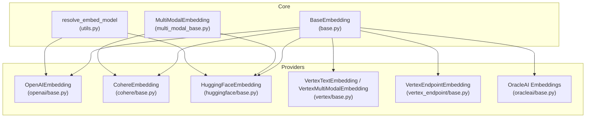
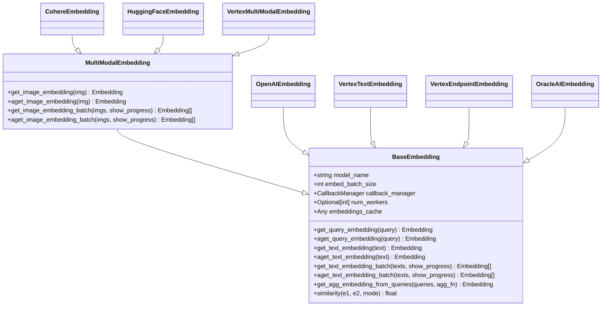
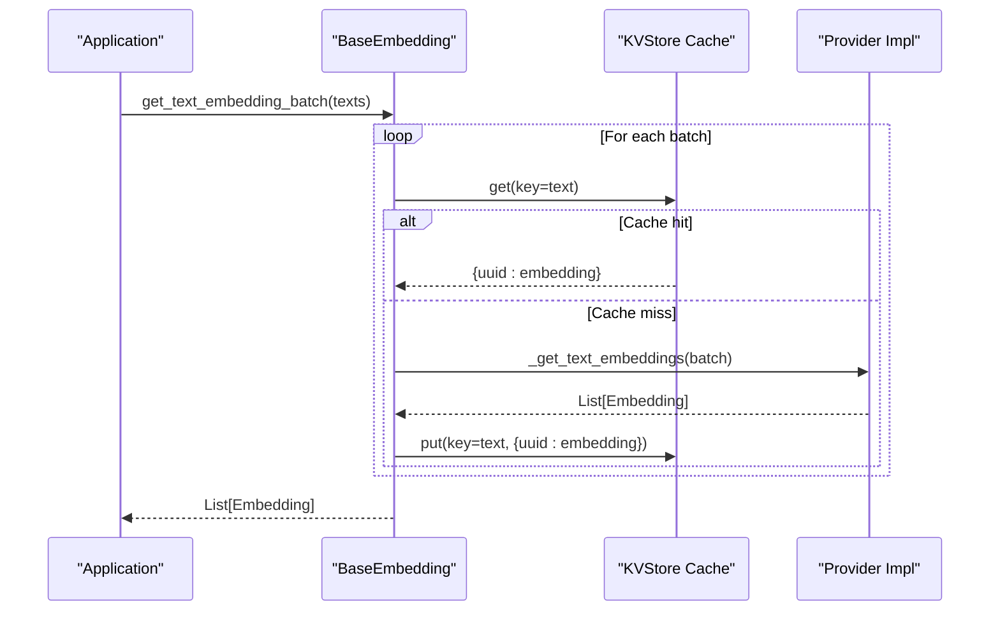
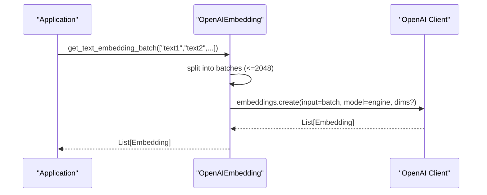
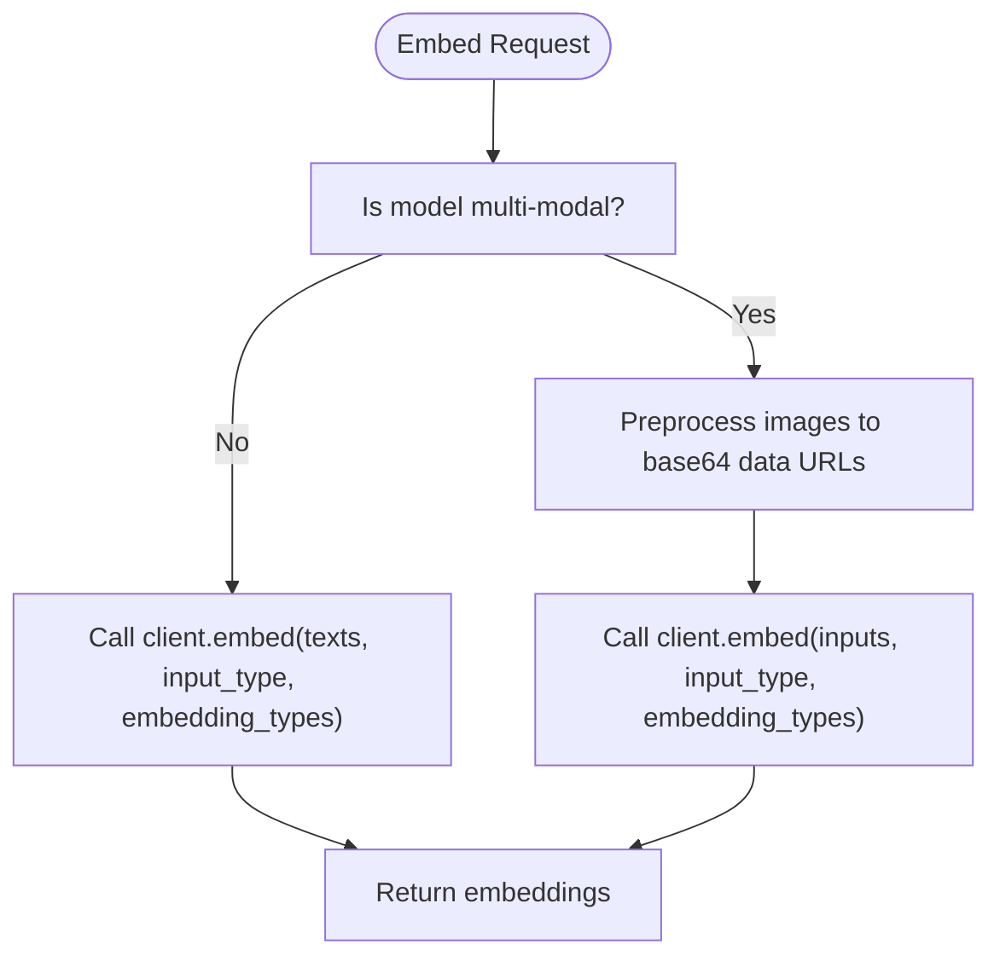
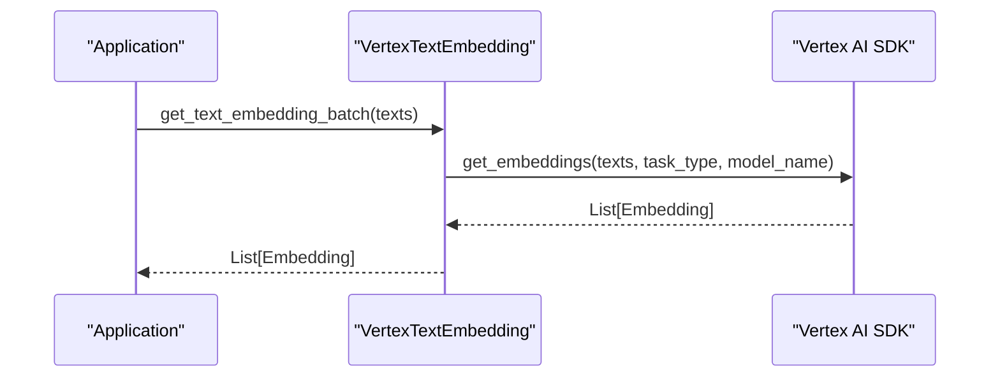
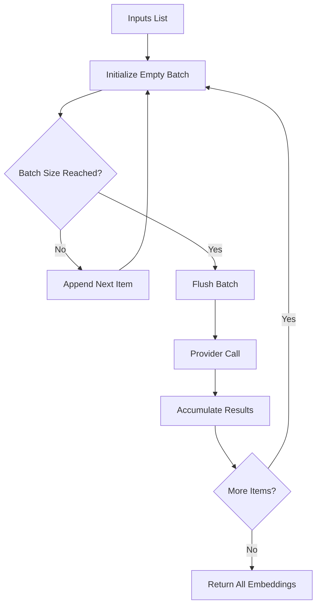
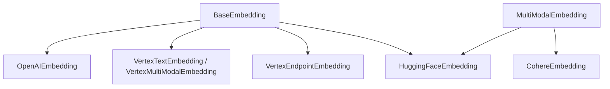

# Embedding Model Integrations

<cite>
**Referenced Files in This Document**
- [base.py](file://llama-index-core/llama_index/core/base/embeddings/base.py)
- [multi_modal_base.py](file://llama-index-core/llama_index/core/embeddings/multi_modal_base.py)
- [utils.py](file://llama-index-core/llama_index/core/embeddings/utils.py)
- [openai/__init__.py](file://llama-index-integrations/embeddings/llama-index-embeddings-openai/llama_index/embeddings/openai/__init__.py)
- [openai/base.py](file://llama-index-integrations/embeddings/llama-index-embeddings-openai/llama_index/embeddings/openai/base.py)
- [cohere/__init__.py](file://llama-index-integrations/embeddings/llama-index-embeddings-cohere/llama_index/embeddings/cohere/__init__.py)
- [cohere/base.py](file://llama-index-integrations/embeddings/llama-index-embeddings-cohere/llama_index/embeddings/cohere/base.py)
- [huggingface/__init__.py](file://llama-index-integrations/embeddings/llama-index-embeddings-huggingface/llama_index/embeddings/huggingface/__init__.py)
- [huggingface/base.py](file://llama-index-integrations/embeddings/llama-index-embeddings-huggingface/llama_index/embeddings/huggingface/base.py)
- [vertex/__init__.py](file://llama-index-integrations/embeddings/llama-index-embeddings-vertex/llama_index/embeddings/vertex/__init__.py)
- [vertex/base.py](file://llama-index-integrations/embeddings/llama-index-embeddings-vertex/llama_index/embeddings/vertex/base.py)
- [vertex_endpoint/__init__.py](file://llama-index-integrations/embeddings/llama-index-embeddings-vertex-endpoint/llama_index/embeddings/vertex_endpoint/__init__.py)
- [vertex_endpoint/base.py](file://llama-index-integrations/embeddings/llama-index-embeddings-vertex-endpoint/llama_index/embeddings/vertex_endpoint/base.py)
- [oracleai/base.py](file://llama-index-integrations/embeddings/llama-index-embeddings-oracleai/llama_index/embeddings/oracleai/base.py)
- [test_embeddings_vertex_endpoint.py](file://llama-index-integrations/embeddings/llama-index-embeddings-vertex-endpoint/tests/test_embeddings_vertex_endpoint.py)
</cite>

## Table of Contents
1. [Introduction](#introduction)
2. [Project Structure](#project-structure)
3. [Core Components](#core-components)
4. [Architecture Overview](#architecture-overview)
5. [Detailed Component Analysis](#detailed-component-analysis)
6. [Dependency Analysis](#dependency-analysis)
7. [Performance Considerations](#performance-considerations)
8. [Troubleshooting Guide](#troubleshooting-guide)
9. [Conclusion](#conclusion)
10. [Appendices](#appendices)

## Introduction
This document provides comprehensive API documentation for embedding model integrations in the LlamaIndex ecosystem. It covers the Embedding interface, provider-specific implementations, and multi-modal capabilities. It also details batch processing patterns, configuration options, dimension handling, normalization, caching strategies, and practical guidance for implementing custom providers, optimizing batch sizes, managing costs, and migrating between providers.

## Project Structure
The embedding system is organized around a core interface and multiple provider integrations:
- Core interface and utilities define the contract and shared behaviors for embeddings.
- Provider packages implement specific embedding backends (OpenAI, Cohere, Hugging Face, Google Vertex AI, Oracle AI, and others).
- Multi-modal embeddings extend the base interface to support images alongside text.

**Diagram sources**
- [base.py](file://llama-index-core/llama_index/core/base/embeddings/base.py#L72-L619)
- [multi_modal_base.py](file://llama-index-core/llama_index/core/embeddings/multi_modal_base.py#L16-L187)
- [utils.py](file://llama-index-core/llama_index/core/embeddings/utils.py#L31-L141)
- [openai/base.py](file://llama-index-integrations/embeddings/llama-index-embeddings-openai/llama_index/embeddings/openai/base.py#L214-L489)
- [cohere/base.py](file://llama-index-integrations/embeddings/llama-index-embeddings-cohere/llama_index/embeddings/cohere/base.py#L125-L431)
- [huggingface/base.py](file://llama-index-integrations/embeddings/llama-index-embeddings-huggingface/llama_index/embeddings/huggingface/base.py#L38-L565)
- [vertex/base.py](file://llama-index-integrations/embeddings/llama-index-embeddings-vertex/llama_index/embeddings/vertex/base.py#L135-L302)
- [vertex_endpoint/base.py](file://llama-index-integrations/embeddings/llama-index-embeddings-vertex-endpoint/llama_index/embeddings/vertex_endpoint/base.py#L67-L102)
- [oracleai/base.py](file://llama-index-integrations/embeddings/llama-index-embeddings-oracleai/llama_index/embeddings/oracleai/base.py#L164-L201)

**Section sources**
- [base.py](file://llama-index-core/llama_index/core/base/embeddings/base.py#L1-L619)
- [multi_modal_base.py](file://llama-index-core/llama_index/core/embeddings/multi_modal_base.py#L1-L187)
- [utils.py](file://llama-index-core/llama_index/core/embeddings/utils.py#L1-L141)

## Core Components
- BaseEmbedding: Defines the core embedding interface, synchronous and asynchronous methods, batch processing, caching, similarity metrics, and orchestration for text embeddings.
- MultiModalEmbedding: Extends BaseEmbedding to support image embeddings alongside text.
- Utilities: Provide resolution helpers to instantiate or select embedding models dynamically.

Key capabilities:
- Query and text embedding APIs with optional query/text-specific instructions.
- Batch embedding with configurable batch size and worker concurrency.
- Caching via a pluggable KVStore-backed cache.
- Aggregation of multiple embeddings (e.g., mean).
- Similarity computation modes (cosine, dot product, Euclidean).
- Async orchestration with progress reporting and callback events.

**Section sources**
- [base.py](file://llama-index-core/llama_index/core/base/embeddings/base.py#L72-L619)
- [multi_modal_base.py](file://llama-index-core/llama_index/core/embeddings/multi_modal_base.py#L16-L187)
- [utils.py](file://llama-index-core/llama_index/core/embeddings/utils.py#L31-L141)

## Architecture Overview
The embedding subsystem follows a layered design:
- Core interface defines the contract and shared behaviors.
- Provider implementations encapsulate external API clients and model-specific logic.
- Multi-modal providers extend the interface to handle images.
- Utilities resolve and configure embedding models at runtime.

**Diagram sources**
- [base.py](file://llama-index-core/llama_index/core/base/embeddings/base.py#L72-L619)
- [multi_modal_base.py](file://llama-index-core/llama_index/core/embeddings/multi_modal_base.py#L16-L187)
- [openai/base.py](file://llama-index-integrations/embeddings/llama-index-embeddings-openai/llama_index/embeddings/openai/base.py#L214-L489)
- [cohere/base.py](file://llama-index-integrations/embeddings/llama-index-embeddings-cohere/llama_index/embeddings/cohere/base.py#L125-L431)
- [huggingface/base.py](file://llama-index-integrations/embeddings/llama-index-embeddings-huggingface/llama_index/embeddings/huggingface/base.py#L38-L565)
- [vertex/base.py](file://llama-index-integrations/embeddings/llama-index-embeddings-vertex/llama_index/embeddings/vertex/base.py#L135-L302)
- [vertex_endpoint/base.py](file://llama-index-integrations/embeddings/llama-index-embeddings-vertex-endpoint/llama_index/embeddings/vertex_endpoint/base.py#L67-L102)
- [oracleai/base.py](file://llama-index-integrations/embeddings/llama-index-embeddings-oracleai/llama_index/embeddings/oracleai/base.py#L164-L201)

## Detailed Component Analysis

### BaseEmbedding API
- Purpose: Centralized interface for text embeddings with robust batching, caching, and async support.
- Key methods:
  - Synchronous: get_query_embedding, get_text_embedding
  - Asynchronous: aget_query_embedding, aget_text_embedding
  - Batch: get_text_embedding_batch, aget_text_embedding_batch
  - Aggregation: get_agg_embedding_from_queries, aget_agg_embedding_from_queries
  - Utilities: similarity, __call__ and acall for transforming nodes
- Configuration:
  - embed_batch_size: controls chunk size for batching.
  - num_workers: enables concurrent async processing.
  - embeddings_cache: KVStore-backed cache keyed by input text/query.
  - model_name: identifier for the underlying model/provider.
- Caching behavior:
  - get_* methods check cache before calling provider.
  - Cache stores per-input embeddings with randomized keys to avoid collisions.
- Batch processing:
  - Iterates over inputs, accumulates batches up to embed_batch_size, then flushes.
  - Supports progress display and callback events.
- Async orchestration:
  - Uses gather and optional worker pools for concurrency.
  - Emits structured events for instrumentation.

**Diagram sources**
- [base.py](file://llama-index-core/llama_index/core/base/embeddings/base.py#L446-L494)

**Section sources**
- [base.py](file://llama-index-core/llama_index/core/base/embeddings/base.py#L72-L619)

### MultiModalEmbedding API
- Purpose: Extends BaseEmbedding to support image embeddings.
- Key methods:
  - get_image_embedding, aget_image_embedding
  - get_image_embedding_batch, aget_image_embedding_batch
- Behavior mirrors text batching and caching patterns.

**Section sources**
- [multi_modal_base.py](file://llama-index-core/llama_index/core/embeddings/multi_modal_base.py#L16-L187)

### OpenAI Embeddings
- Implementation: OpenAIEmbedding
- Capabilities:
  - Query and text embedding with mode/model selection.
  - Dimensions support for newer models via additional_kwargs.
  - Retry decorator and configurable timeouts/retries.
  - Optional client reuse for stability under heavy async loads.
- Configuration highlights:
  - mode: SIMILARITY_MODE or TEXT_SEARCH_MODE
  - model: legacy davinci/curie/etc. or modern text-embedding-* variants
  - dimensions: optional integer for vector dimensionality (v3 models)
  - embed_batch_size: defaults to 100
  - max_retries, timeout, default_headers, reuse_client
- Batch constraints:
  - Internal utilities enforce a maximum batch size of 2048 for the underlying client.
- Multi-modal:
  - Not applicable in this provider.

**Diagram sources**
- [openai/base.py](file://llama-index-integrations/embeddings/llama-index-embeddings-openai/llama_index/embeddings/openai/base.py#L214-L489)
- [openai/base.py](file://llama-index-integrations/embeddings/llama-index-embeddings-openai/llama_index/embeddings/openai/base.py#L155-L200)

**Section sources**
- [openai/__init__.py](file://llama-index-integrations/embeddings/llama-index-embeddings-openai/llama_index/embeddings/openai/__init__.py#L1-L14)
- [openai/base.py](file://llama-index-integrations/embeddings/llama-index-embeddings-openai/llama_index/embeddings/openai/base.py#L214-L489)

### Cohere Embeddings
- Implementation: CohereEmbedding
- Capabilities:
  - Text embeddings with input_type selection (search_query/search_document/classification/clustering).
  - Multi-modal image embeddings for supported models (v3/v4).
  - Truncation control (START/END/NONE).
  - Embedding type selection (float/int8/uint8/binary/ubinary).
  - Batch size constrained to 96.
- Configuration highlights:
  - model_name: embed-english-v3.0, embed-multilingual-v3.0, embed-english-v2.0, embed-multilingual-v2.0, embed-v4.0
  - input_type: optional; auto-selected for v3/v4 if not provided
  - truncate: END by default
  - embedding_type: float by default
  - embed_batch_size: up to 96
- Multi-modal specifics:
  - Images converted to base64 data URLs for supported models.
  - Validates image formats (png, jpeg, jpg, webp, gif).

**Diagram sources**
- [cohere/base.py](file://llama-index-integrations/embeddings/llama-index-embeddings-cohere/llama_index/embeddings/cohere/base.py#L251-L387)

**Section sources**
- [cohere/__init__.py](file://llama-index-integrations/embeddings/llama-index-embeddings-cohere/llama_index/embeddings/cohere/__init__.py#L1-L4)
- [cohere/base.py](file://llama-index-integrations/embeddings/llama-index-embeddings-cohere/llama_index/embeddings/cohere/base.py#L125-L431)

### Hugging Face Embeddings
- Implementation: HuggingFaceEmbedding
- Capabilities:
  - Local and hosted model support via SentenceTransformers.
  - Multi-modal image embeddings via CLIP-like backends (when configured).
  - Query and text instructions for model-specific prompting.
  - Normalize flag to enable/disable vector normalization.
  - Parallel processing across devices when enabled.
- Configuration highlights:
  - model_name: SentenceTransformer-compatible model ID or local path
  - query_instruction, text_instruction: optional prompts
  - normalize: default True
  - max_length: sequence length override
  - cache_folder: model cache directory
  - device: inference device selection
  - parallel_process, target_devices: multi-process parallelism
  - embed_batch_size: default batching
- Multi-modal:
  - Implemented via MultiModalEmbedding; requires appropriate backend (e.g., CLIP) selected externally.

**Section sources**
- [huggingface/__init__.py](file://llama-index-integrations/embeddings/llama-index-embeddings-huggingface/llama_index/embeddings/huggingface/__init__.py#L1-L12)
- [huggingface/base.py](file://llama-index-integrations/embeddings/llama-index-embeddings-huggingface/llama_index/embeddings/huggingface/base.py#L38-L565)

### Google Vertex AI Embeddings
- Implementations:
  - VertexTextEmbedding: text-only embeddings with mode selection (classification, clustering, similarity, retrieval).
  - VertexMultiModalEmbedding: text and image embeddings with configurable output dimension.
  - VertexEndpointEmbedding: embeddings against a deployed Vertex Endpoint.
- Configuration highlights:
  - VertexTextEmbedding: model_name, embed_mode, embed_batch_size, credentials, project, location, additional_kwargs.
  - VertexMultiModalEmbedding: model_name, embed_dimension, embed_batch_size, credentials, project, location, additional_kwargs.
  - VertexEndpointEmbedding: endpoint_id, project_id, location, credentials/service account file/info, model_kwargs, endpoint_kwargs, timeout.

**Diagram sources**
- [vertex/base.py](file://llama-index-integrations/embeddings/llama-index-embeddings-vertex/llama_index/embeddings/vertex/base.py#L186-L234)

**Section sources**
- [vertex/__init__.py](file://llama-index-integrations/embeddings/llama-index-embeddings-vertex/llama_index/embeddings/vertex/__init__.py#L1-L7)
- [vertex/base.py](file://llama-index-integrations/embeddings/llama-index-embeddings-vertex/llama_index/embeddings/vertex/base.py#L135-L302)
- [vertex_endpoint/__init__.py](file://llama-index-integrations/embeddings/llama-index-embeddings-vertex-endpoint/llama_index/embeddings/vertex_endpoint/__init__.py#L1-L4)
- [vertex_endpoint/base.py](file://llama-index-integrations/embeddings/llama-index-embeddings-vertex-endpoint/llama_index/embeddings/vertex_endpoint/base.py#L67-L102)
- [test_embeddings_vertex_endpoint.py](file://llama-index-integrations/embeddings/llama-index-embeddings-vertex-endpoint/tests/test_embeddings_vertex_endpoint.py#L1-L7)

### Oracle AI Embeddings
- Implementation: Oracle AI vector embeddings via DBMS Vector chain.
- Capabilities:
  - Converts input chunks to SYS.VECTOR_ARRAY_T and invokes dbms_vector_chain.utl_to_embeddings.
  - Returns embeddings as JSON-decoded arrays.
- Configuration highlights:
  - Connection parameters and model parameters stored in internal state.
  - Handles exceptions and returns empty vectors when rows are null.

**Section sources**
- [oracleai/base.py](file://llama-index-integrations/embeddings/llama-index-embeddings-oracleai/llama_index/embeddings/oracleai/base.py#L164-L201)

### Batch Processing Patterns
- Text batching:
  - BaseEmbedding.get_text_embedding_batch splits inputs into chunks of size embed_batch_size and flushes on boundary or last item.
  - Supports progress display and callback events.
- Async batching:
  - BaseEmbedding.aget_text_embedding_batch builds coroutines per batch and optionally runs with worker limits or progress.
- Image batching (multi-modal):
  - MultiModalEmbedding.get_image_embedding_batch mirrors text batching for images.

**Diagram sources**
- [base.py](file://llama-index-core/llama_index/core/base/embeddings/base.py#L446-L494)
- [multi_modal_base.py](file://llama-index-core/llama_index/core/embeddings/multi_modal_base.py#L95-L129)

**Section sources**
- [base.py](file://llama-index-core/llama_index/core/base/embeddings/base.py#L446-L585)
- [multi_modal_base.py](file://llama-index-core/llama_index/core/embeddings/multi_modal_base.py#L95-L187)

### Configuration Options, Dimension Handling, Normalization, and Caching
- Configuration options:
  - BaseEmbedding: embed_batch_size, num_workers, embeddings_cache, model_name, callback_manager.
  - OpenAIEmbedding: mode, model, dimensions, max_retries, timeout, default_headers, reuse_client.
  - CohereEmbedding: model_name, input_type, truncate, embedding_type, embed_batch_size.
  - HuggingFaceEmbedding: model_name, query_instruction, text_instruction, normalize, max_length, cache_folder, device, parallel_process, target_devices.
  - Vertex*Embedding: model_name, embed_mode/embed_dimension, embed_batch_size, credentials, project, location, additional_kwargs.
  - VertexEndpointEmbedding: endpoint_id, project_id, location, credentials/service account, model_kwargs, endpoint_kwargs, timeout.
  - OracleAIEmbedding: internal connection and parameter handling for vector chain.
- Dimension handling:
  - OpenAI supports explicit dimensions for v3 models via additional_kwargs.
  - VertexMultiModalEmbedding exposes embed_dimension for output shape control.
- Normalization:
  - HuggingFaceEmbedding supports normalize flag.
- Caching:
  - BaseEmbedding integrates a KVStore-backed cache keyed by input text/query; cache entries include randomized UUID keys.

**Section sources**
- [base.py](file://llama-index-core/llama_index/core/base/embeddings/base.py#L72-L110)
- [openai/base.py](file://llama-index-integrations/embeddings/llama-index-embeddings-openai/llama_index/embeddings/openai/base.py#L262-L268)
- [vertex/base.py](file://llama-index-integrations/embeddings/llama-index-embeddings-vertex/llama_index/embeddings/vertex/base.py#L238-L241)
- [huggingface/base.py](file://llama-index-integrations/embeddings/llama-index-embeddings-huggingface/llama_index/embeddings/huggingface/base.py#L105-L105)

### Implementing Custom Embedding Providers
Steps to implement a custom provider:
1. Choose the appropriate base class:
   - Use BaseEmbedding for text-only.
   - Use MultiModalEmbedding for text plus images.
2. Implement required abstract methods:
   - _get_query_embedding, _aget_query_embedding
   - _get_text_embedding, _aget_text_embedding
   - For multi-modal: _get_image_embedding, _aget_image_embedding
3. Optionally implement batch methods:
   - _get_text_embeddings, _aget_text_embeddings
   - _get_image_embeddings, _aget_image_embeddings
4. Add provider-specific initialization and client creation.
5. Integrate with BaseEmbedding’s caching and batching by leveraging inherited methods or overriding as needed.
6. Register provider in resolve_embed_model if you want it selectable via string identifiers.

Reference implementations:
- OpenAIEmbedding demonstrates mode/model selection, retries, and dimension handling.
- CohereEmbedding demonstrates multi-modal image preprocessing and input_type selection.
- HuggingFaceEmbedding demonstrates local model loading, normalization, and parallel processing.

**Section sources**
- [openai/base.py](file://llama-index-integrations/embeddings/llama-index-embeddings-openai/llama_index/embeddings/openai/base.py#L214-L489)
- [cohere/base.py](file://llama-index-integrations/embeddings/llama-index-embeddings-cohere/llama_index/embeddings/cohere/base.py#L125-L431)
- [huggingface/base.py](file://llama-index-integrations/embeddings/llama-index-embeddings-huggingface/llama_index/embeddings/huggingface/base.py#L38-L565)
- [utils.py](file://llama-index-core/llama_index/core/embeddings/utils.py#L31-L141)

### Handling Different Embedding Dimensions
- OpenAI:
  - Use dimensions parameter for v3 models to control output vector length.
- Vertex AI:
  - VertexMultiModalEmbedding exposes embed_dimension to set output dimensionality.
- Cohere:
  - Output dimensionality depends on the chosen model; embedding_type affects storage format but not vector length.
- Hugging Face:
  - Output dimensionality is determined by the chosen SentenceTransformer model; normalize flag controls vector normalization.

**Section sources**
- [openai/base.py](file://llama-index-integrations/embeddings/llama-index-embeddings-openai/llama_index/embeddings/openai/base.py#L262-L268)
- [vertex/base.py](file://llama-index-integrations/embeddings/llama-index-embeddings-vertex/llama_index/embeddings/vertex/base.py#L238-L241)
- [cohere/base.py](file://llama-index-integrations/embeddings/llama-index-embeddings-cohere/llama_index/embeddings/cohere/base.py#L104-L113)
- [huggingface/base.py](file://llama-index-integrations/embeddings/llama-index-embeddings-huggingface/llama_index/embeddings/huggingface/base.py#L105-L105)

### Optimizing Batch Sizes
- Guidelines:
  - Respect provider constraints (e.g., Cohere max 96, OpenAI internal max 2048).
  - Tune embed_batch_size to balance throughput and latency; larger batches reduce overhead but increase memory usage.
  - Use num_workers for async concurrency when provider supports it.
  - Enable progress bars for long-running jobs to monitor throughput.
- References:
  - CohereEmbedding validates embed_batch_size against MAX_EMBED_BATCH_SIZE.
  - BaseEmbedding enforces bounds on embed_batch_size and orchestrates batching.

**Section sources**
- [cohere/base.py](file://llama-index-integrations/embeddings/llama-index-embeddings-cohere/llama_index/embeddings/cohere/base.py#L121-L201)
- [base.py](file://llama-index-core/llama_index/core/base/embeddings/base.py#L81-L86)

### Cost Management
- Strategies:
  - Use caching to avoid redundant calls for identical inputs.
  - Select smaller models or lower dimensions where acceptable.
  - Batch requests to reduce per-request overhead.
  - Monitor provider quotas and rate limits; adjust embed_batch_size and num_workers accordingly.
  - Prefer local models (Hugging Face) for controlled costs when cloud providers are expensive.

**Section sources**
- [base.py](file://llama-index-core/llama_index/core/base/embeddings/base.py#L151-L166)
- [openai/base.py](file://llama-index-integrations/embeddings/llama-index-embeddings-openai/llama_index/embeddings/openai/base.py#L250-L261)
- [cohere/base.py](file://llama-index-integrations/embeddings/llama-index-embeddings-cohere/llama_index/embeddings/cohere/base.py#L121-L121)

### Migration Between Providers
- Steps:
  - Identify provider constraints (batch size, dimensions, multi-modality).
  - Replace provider instantiation while keeping the same BaseEmbedding/MultiModalEmbedding interface.
  - Retain embed_batch_size and num_workers configurations.
  - Validate output dimensions and normalization behavior.
  - Re-run caching to avoid cold starts after migration.
- Example references:
  - VertexEndpointEmbedding inherits from BaseEmbedding and can replace cloud-hosted providers in managed deployments.

**Section sources**
- [vertex_endpoint/base.py](file://llama-index-integrations/embeddings/llama-index-embeddings-vertex-endpoint/llama_index/embeddings/vertex_endpoint/base.py#L67-L102)
- [test_embeddings_vertex_endpoint.py](file://llama-index-integrations/embeddings/llama-index-embeddings-vertex-endpoint/tests/test_embeddings_vertex_endpoint.py#L5-L7)

## Dependency Analysis
- CohereEmbedding depends on the Cohere client and enforces model/input_type/encoding compatibility.
- HuggingFaceEmbedding depends on SentenceTransformers and optional CLIP backends for images.
- OpenAIEmbedding depends on the OpenAI client and supports dimension overrides for v3 models.
- Vertex*Embeddings depend on the Vertex AI SDK and require credentials/project/location.
- BaseEmbedding composes CallbackManager and optional KVStore cache for instrumentation and persistence.

**Diagram sources**
- [base.py](file://llama-index-core/llama_index/core/base/embeddings/base.py#L72-L619)
- [multi_modal_base.py](file://llama-index-core/llama_index/core/embeddings/multi_modal_base.py#L16-L187)
- [openai/base.py](file://llama-index-integrations/embeddings/llama-index-embeddings-openai/llama_index/embeddings/openai/base.py#L214-L489)
- [cohere/base.py](file://llama-index-integrations/embeddings/llama-index-embeddings-cohere/llama_index/embeddings/cohere/base.py#L125-L431)
- [huggingface/base.py](file://llama-index-integrations/embeddings/llama-index-embeddings-huggingface/llama_index/embeddings/huggingface/base.py#L38-L565)
- [vertex/base.py](file://llama-index-integrations/embeddings/llama-index-embeddings-vertex/llama_index/embeddings/vertex/base.py#L135-L302)
- [vertex_endpoint/base.py](file://llama-index-integrations/embeddings/llama-index-embeddings-vertex-endpoint/llama_index/embeddings/vertex_endpoint/base.py#L67-L102)

**Section sources**
- [base.py](file://llama-index-core/llama_index/core/base/embeddings/base.py#L72-L619)
- [multi_modal_base.py](file://llama-index-core/llama_index/core/embeddings/multi_modal_base.py#L16-L187)

## Performance Considerations
- Concurrency:
  - Use num_workers for async batching to overlap I/O-bound provider calls.
- Batching:
  - Increase embed_batch_size up to provider limits to amortize overhead.
- Caching:
  - Enable embeddings_cache to avoid repeated calls for identical inputs.
- Device placement:
  - HuggingFaceEmbedding supports device selection and parallel processing for GPU/CPU acceleration.
- Network stability:
  - OpenAIEmbedding supports client reuse and retry decorators to mitigate transient failures.

[No sources needed since this section provides general guidance]

## Troubleshooting Guide
- Credential errors:
  - OpenAIEmbedding resolves credentials and raises descriptive errors if invalid.
  - Vertex*Embeddings require valid credentials and project/location.
- Batch size violations:
  - CohereEmbedding enforces a maximum batch size; adjust embed_batch_size accordingly.
  - OpenAI internal utilities enforce a maximum batch size of 2048.
- Multi-modal model mismatches:
  - CohereEmbedding validates model support for image embeddings and raises errors otherwise.
- Caching misconfiguration:
  - BaseEmbedding validates that embeddings_cache is a KVStore; ensure proper initialization.

**Section sources**
- [openai/base.py](file://llama-index-integrations/embeddings/llama-index-embeddings-openai/llama_index/embeddings/openai/base.py#L340-L346)
- [vertex_endpoint/base.py](file://llama-index-integrations/embeddings/llama-index-embeddings-vertex-endpoint/llama_index/embeddings/vertex_endpoint/base.py#L75-L93)
- [cohere/base.py](file://llama-index-integrations/embeddings/llama-index-embeddings-cohere/llama_index/embeddings/cohere/base.py#L182-L201)
- [base.py](file://llama-index-core/llama_index/core/base/embeddings/base.py#L100-L110)

## Conclusion
The embedding subsystem offers a robust, extensible foundation for integrating diverse embedding providers with consistent APIs, batching, caching, and multi-modal support. By adhering to the BaseEmbedding and MultiModalEmbedding contracts, teams can seamlessly swap providers, optimize batch sizes, manage costs, and maintain high performance across varied workloads.

[No sources needed since this section summarizes without analyzing specific files]

## Appendices

### API Specifications Summary

- BaseEmbedding
  - Methods: get_query_embedding, aget_query_embedding, get_text_embedding, aget_text_embedding, get_text_embedding_batch, aget_text_embedding_batch, get_agg_embedding_from_queries, aget_agg_embedding_from_queries, similarity, __call__, acall
  - Fields: model_name, embed_batch_size, num_workers, embeddings_cache, callback_manager
  - Caching: KVStore-backed, per-input UUID keys

- MultiModalEmbedding
  - Methods: get_image_embedding, aget_image_embedding, get_image_embedding_batch, aget_image_embedding_batch

- OpenAIEmbedding
  - Fields: api_key, api_base, api_version, max_retries, timeout, default_headers, reuse_client, dimensions, additional_kwargs
  - Constraints: embed_batch_size default 100; internal client max 2048

- CohereEmbedding
  - Fields: api_key, base_url, truncate, input_type, embedding_type
  - Constraints: embed_batch_size ≤ 96; multi-modal for v3/v4 models

- HuggingFaceEmbedding
  - Fields: model_name, query_instruction, text_instruction, normalize, max_length, cache_folder, device, parallel_process, target_devices, show_progress_bar

- VertexTextEmbedding / VertexMultiModalEmbedding
  - Fields: model_name, embed_mode/embed_dimension, embed_batch_size, credentials, project, location, additional_kwargs

- VertexEndpointEmbedding
  - Fields: endpoint_id, project_id, location, credentials/service_account, model_kwargs, endpoint_kwargs, timeout

- OracleAIEmbedding
  - Behavior: uses DBMS Vector chain to compute embeddings from input chunks

**Section sources**
- [base.py](file://llama-index-core/llama_index/core/base/embeddings/base.py#L72-L619)
- [multi_modal_base.py](file://llama-index-core/llama_index/core/embeddings/multi_modal_base.py#L16-L187)
- [openai/base.py](file://llama-index-integrations/embeddings/llama-index-embeddings-openai/llama_index/embeddings/openai/base.py#L214-L489)
- [cohere/base.py](file://llama-index-integrations/embeddings/llama-index-embeddings-cohere/llama_index/embeddings/cohere/base.py#L125-L431)
- [huggingface/base.py](file://llama-index-integrations/embeddings/llama-index-embeddings-huggingface/llama_index/embeddings/huggingface/base.py#L38-L565)
- [vertex/base.py](file://llama-index-integrations/embeddings/llama-index-embeddings-vertex/llama_index/embeddings/vertex/base.py#L135-L302)
- [vertex_endpoint/base.py](file://llama-index-integrations/embeddings/llama-index-embeddings-vertex-endpoint/llama_index/embeddings/vertex_endpoint/base.py#L67-L102)
- [oracleai/base.py](file://llama-index-integrations/embeddings/llama-index-embeddings-oracleai/llama_index/embeddings/oracleai/base.py#L164-L201)