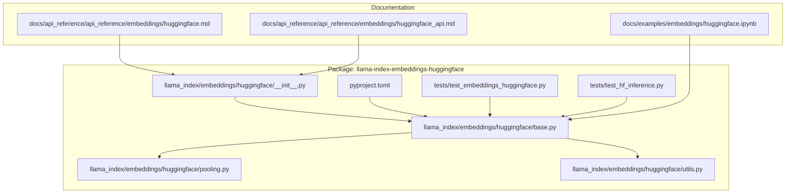
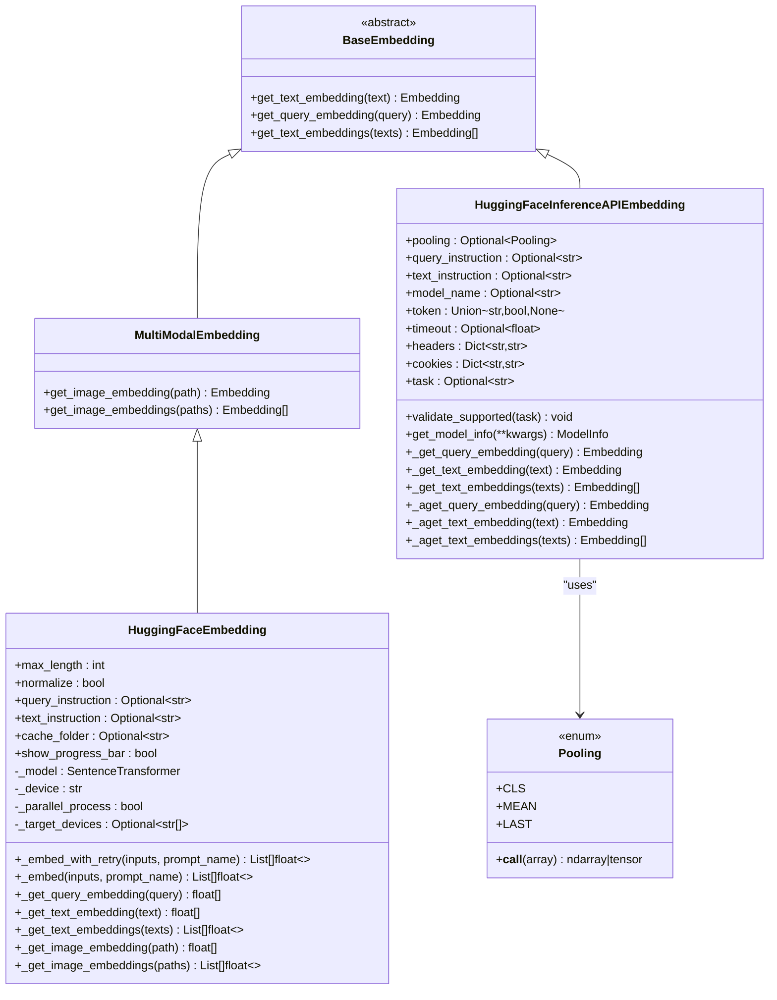
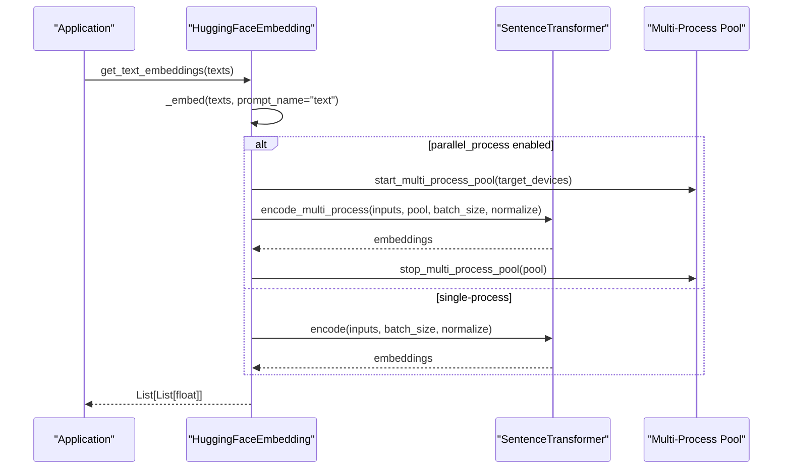
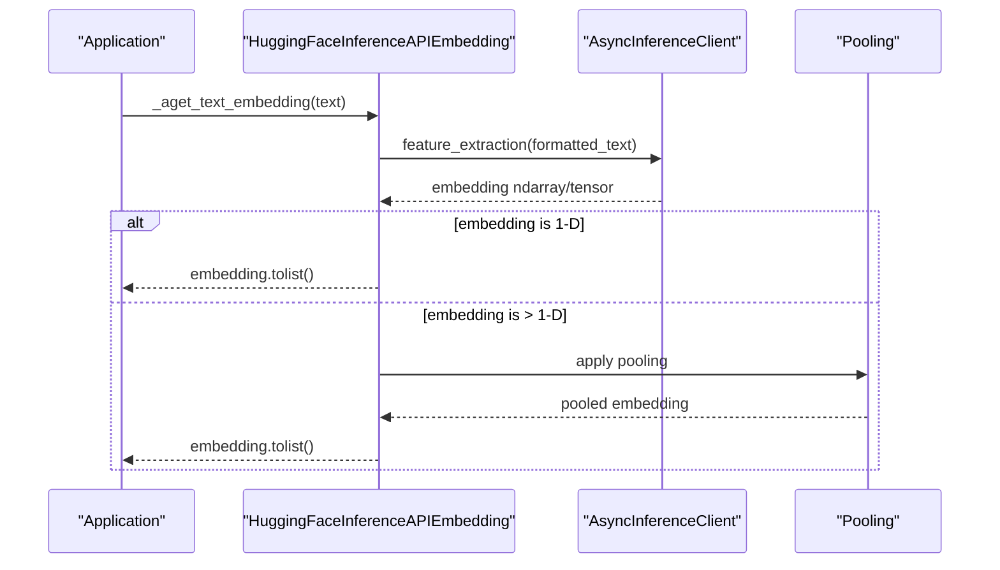
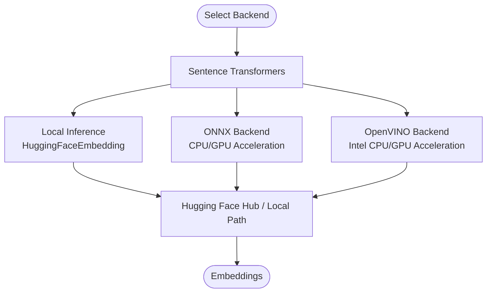
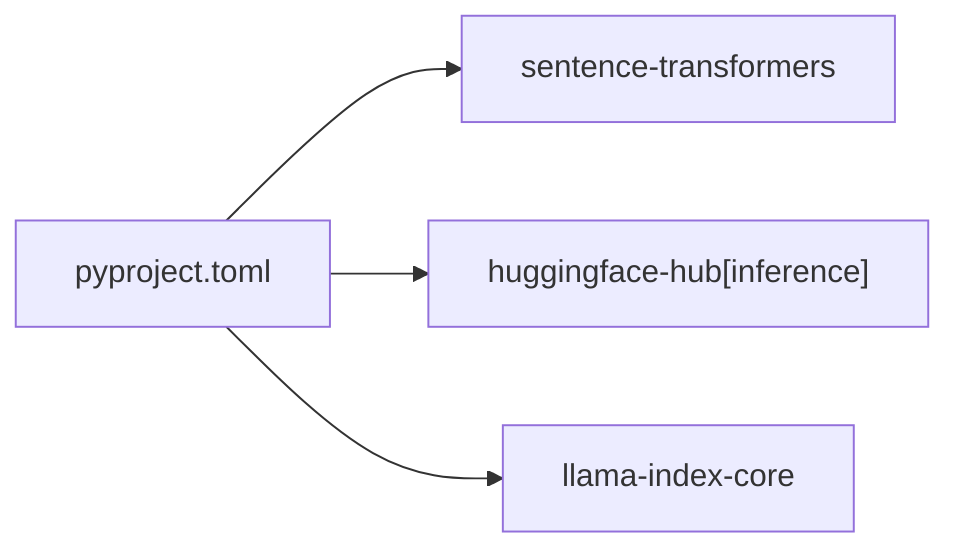

# Hugging Face Embeddings

<cite>
**Referenced Files in This Document**
- [base.py](file://llama-index-integrations/embeddings/llama-index-embeddings-huggingface/llama_index/embeddings/huggingface/base.py)
- [pooling.py](file://llama-index-integrations/embeddings/llama-index-embeddings-huggingface/llama_index/embeddings/huggingface/pooling.py)
- [utils.py](file://llama-index-integrations/embeddings/llama-index-embeddings-huggingface/llama_index/embeddings/huggingface/utils.py)
- [__init__.py](file://llama-index-integrations/embeddings/llama-index-embeddings-huggingface/llama_index/embeddings/huggingface/__init__.py)
- [pyproject.toml](file://llama-index-integrations/embeddings/llama-index-embeddings-huggingface/pyproject.toml)
- [huggingface.md](file://docs/api_reference/api_reference/embeddings/huggingface.md)
- [huggingface_api.md](file://docs/api_reference/api_reference/embeddings/huggingface_api.md)
- [huggingface.ipynb](file://docs/examples/embeddings/huggingface.ipynb)
- [test_embeddings_huggingface.py](file://llama-index-integrations/embeddings/llama-index-embeddings-huggingface/tests/test_embeddings_huggingface.py)
- [test_hf_inference.py](file://llama-index-integrations/embeddings/llama-index-embeddings-huggingface/tests/test_hf_inference.py)
</cite>

## Table of Contents
1. [Introduction](#introduction)
2. [Project Structure](#project-structure)
3. [Core Components](#core-components)
4. [Architecture Overview](#architecture-overview)
5. [Detailed Component Analysis](#detailed-component-analysis)
6. [Dependency Analysis](#dependency-analysis)
7. [Performance Considerations](#performance-considerations)
8. [Troubleshooting Guide](#troubleshooting-guide)
9. [Conclusion](#conclusion)
10. [Appendices](#appendices)

## Introduction
This document provides comprehensive API documentation for Hugging Face embedding integrations in LlamaIndex, covering:
- Local model inference via the HFEmbedding class (Sentence Transformers)
- Hosted inference via the Hugging Face Inference API
- Optimized deployments using ONNX and OpenVINO backends
- Model loading, tokenizer and prompt configuration, device management, batching, and caching
- Supported architectures and hardware acceleration options
- Offline deployment strategies and custom model loading from local directories

## Project Structure
The Hugging Face embeddings integration is implemented as a dedicated package under llama-index-integrations. The core module exposes two primary embedding classes:
- HuggingFaceEmbedding: local inference using Sentence Transformers
- HuggingFaceInferenceAPIEmbedding: hosted inference via Hugging Face Inference API

**Diagram sources**
- [__init__.py](file://llama-index-integrations/embeddings/llama-index-embeddings-huggingface/llama_index/embeddings/huggingface/__init__.py#L1-L12)
- [base.py](file://llama-index-integrations/embeddings/llama-index-embeddings-huggingface/llama_index/embeddings/huggingface/base.py#L1-L565)
- [pooling.py](file://llama-index-integrations/embeddings/llama-index-embeddings-huggingface/llama_index/embeddings/huggingface/pooling.py#L1-L73)
- [utils.py](file://llama-index-integrations/embeddings/llama-index-embeddings-huggingface/llama_index/embeddings/huggingface/utils.py#L1-L100)
- [pyproject.toml](file://llama-index-integrations/embeddings/llama-index-embeddings-huggingface/pyproject.toml#L1-L67)
- [huggingface.md](file://docs/api_reference/api_reference/embeddings/huggingface.md#L1-L4)
- [huggingface_api.md](file://docs/api_reference/api_reference/embeddings/huggingface_api.md#L1-L4)
- [huggingface.ipynb](file://docs/examples/embeddings/huggingface.ipynb#L1-L339)

**Section sources**
- [__init__.py](file://llama-index-integrations/embeddings/llama-index-embeddings-huggingface/llama_index/embeddings/huggingface/__init__.py#L1-L12)
- [base.py](file://llama-index-integrations/embeddings/llama-index-embeddings-huggingface/llama_index/embeddings/huggingface/base.py#L1-L565)
- [pyproject.toml](file://llama-index-integrations/embeddings/llama-index-embeddings-huggingface/pyproject.toml#L27-L39)

## Core Components
- HuggingFaceEmbedding
  - Purpose: Local embeddings using Sentence Transformers with support for prompt-based instructions, normalization, batching, progress reporting, and multi-process encoding.
  - Key capabilities:
    - Automatic model loading from local path, Hugging Face Hub, or SentenceTransformer registry
    - Prompt injection for queries and texts via model-specific instructions
    - Device selection and automatic inference device detection
    - Batch embedding with configurable batch size
    - Optional multi-process parallel encoding for large-scale batches
    - Progress bar support
    - Retry mechanism for robustness
- HuggingFaceInferenceAPIEmbedding
  - Purpose: Hosted inference via Hugging Face Inference API with pooling support and async/parallel embedding.
  - Key capabilities:
    - Feature extraction task via InferenceClient
    - Recommended model selection by task
    - Model info retrieval and deployment validation
    - Pooling strategies (CLS, MEAN, LAST) for multi-dimensional outputs
    - Async single and bulk embedding
    - Serialization support

**Section sources**
- [base.py](file://llama-index-integrations/embeddings/llama-index-embeddings-huggingface/llama_index/embeddings/huggingface/base.py#L38-L196)
- [base.py](file://llama-index-integrations/embeddings/llama-index-embeddings-huggingface/llama_index/embeddings/huggingface/base.py#L366-L565)

## Architecture Overview
The integration architecture separates concerns between local and hosted inference while sharing common abstractions from LlamaIndex’s embedding base class.

**Diagram sources**
- [base.py](file://llama-index-integrations/embeddings/llama-index-embeddings-huggingface/llama_index/embeddings/huggingface/base.py#L13-L32)
- [base.py](file://llama-index-integrations/embeddings/llama-index-embeddings-huggingface/llama_index/embeddings/huggingface/base.py#L38-L196)
- [base.py](file://llama-index-integrations/embeddings/llama-index-embeddings-huggingface/llama_index/embeddings/huggingface/base.py#L366-L565)
- [pooling.py](file://llama-index-integrations/embeddings/llama-index-embeddings-huggingface/llama_index/embeddings/huggingface/pooling.py#L10-L73)

## Detailed Component Analysis

### HuggingFaceEmbedding
- Model loading and configuration
  - Loads SentenceTransformer models from local path, Hugging Face Hub, or Sentence Transformers registry
  - Supports prompt injection for queries and texts via model-specific instructions
  - Configurable max sequence length and normalization
  - Caching via cache_folder and automatic inference device detection
- Tokenizer and prompt configuration
  - Uses model-specific instructions for queries and texts
  - Supports overriding instructions via constructor parameters
- Device management and batching
  - Device selection with automatic fallback to GPU/CPU/MPS/NPU
  - Batch embedding with configurable embed_batch_size
  - Optional multi-process parallel encoding with target_devices
- Offline deployment
  - Load models from local directories
  - Use cache_folder to avoid repeated downloads
- Retry and robustness
  - Built-in retry with exponential backoff for transient failures

**Diagram sources**
- [base.py](file://llama-index-integrations/embeddings/llama-index-embeddings-huggingface/llama_index/embeddings/huggingface/base.py#L222-L246)

**Section sources**
- [base.py](file://llama-index-integrations/embeddings/llama-index-embeddings-huggingface/llama_index/embeddings/huggingface/base.py#L123-L192)
- [base.py](file://llama-index-integrations/embeddings/llama-index-embeddings-huggingface/llama_index/embeddings/huggingface/base.py#L248-L360)
- [utils.py](file://llama-index-integrations/embeddings/llama-index-embeddings-huggingface/llama_index/embeddings/huggingface/utils.py#L43-L77)

### HuggingFaceInferenceAPIEmbedding
- Hosted inference via Hugging Face Inference API
  - Feature extraction task with optional model recommendation by task
  - Model info retrieval and deployment validation
  - Async single and bulk embedding with pooling for multi-dimensional outputs
- Pooling strategies
  - CLS, MEAN, LAST pooling modes
  - Automatic pooling selection when models return multi-dimensional arrays

**Diagram sources**
- [base.py](file://llama-index-integrations/embeddings/llama-index-embeddings-huggingface/llama_index/embeddings/huggingface/base.py#L489-L512)
- [base.py](file://llama-index-integrations/embeddings/llama-index-embeddings-huggingface/llama_index/embeddings/huggingface/base.py#L497-L502)
- [pooling.py](file://llama-index-integrations/embeddings/llama-index-embeddings-huggingface/llama_index/embeddings/huggingface/pooling.py#L17-L22)

**Section sources**
- [base.py](file://llama-index-integrations/embeddings/llama-index-embeddings-huggingface/llama_index/embeddings/huggingface/base.py#L366-L488)
- [base.py](file://llama-index-integrations/embeddings/llama-index-embeddings-huggingface/llama_index/embeddings/huggingface/base.py#L489-L565)
- [pooling.py](file://llama-index-integrations/embeddings/llama-index-embeddings-huggingface/llama_index/embeddings/huggingface/pooling.py#L10-L73)

### Supported Architectures and Backends
- Sentence Transformers models (e.g., BAAI BGE, Instructor series)
- Hosted inference via Hugging Face Inference API
- Optimized backends via Sentence Transformers:
  - ONNX backend for cross-platform acceleration
  - OpenVINO backend for Intel CPU/GPU acceleration

**Diagram sources**
- [huggingface.ipynb](file://docs/examples/embeddings/huggingface.ipynb#L193-L306)
- [base.py](file://llama-index-integrations/embeddings/llama-index-embeddings-huggingface/llama_index/embeddings/huggingface/base.py#L160-L172)

**Section sources**
- [huggingface.ipynb](file://docs/examples/embeddings/huggingface.ipynb#L19-L339)
- [base.py](file://llama-index-integrations/embeddings/llama-index-embeddings-huggingface/llama_index/embeddings/huggingface/base.py#L160-L172)

### Model Selection, Batch Processing, Memory Optimization, and Offline Deployment
- Model selection
  - Choose models from Hugging Face Hub or local directories
  - Use model-specific instructions for optimal retrieval quality
- Batch processing
  - Configure embed_batch_size for throughput vs. memory trade-offs
  - Enable parallel_process for multi-device scaling
- Memory optimization
  - Use smaller models or quantized variants (e.g., OpenVINO optimized)
  - Adjust max_length to limit sequence length
- Offline deployment
  - Cache models via cache_folder
  - Load models from local paths to avoid network dependencies

**Section sources**
- [base.py](file://llama-index-integrations/embeddings/llama-index-embeddings-huggingface/llama_index/embeddings/huggingface/base.py#L102-L192)
- [utils.py](file://llama-index-integrations/embeddings/llama-index-embeddings-huggingface/llama_index/embeddings/huggingface/utils.py#L43-L77)
- [huggingface.ipynb](file://docs/examples/embeddings/huggingface.ipynb#L144-L306)

### Caching Mechanisms and Model Hub Integration
- Caching
  - cache_folder parameter controls model cache location
  - Automatic cache directory resolution via LlamaIndex utilities
- Model Hub integration
  - Sentence Transformers automatically resolve model names to Hub or local paths
  - Hugging Face Hub client used for model info and hosted inference

**Section sources**
- [base.py](file://llama-index-integrations/embeddings/llama-index-embeddings-huggingface/llama_index/embeddings/huggingface/base.py#L144-L172)
- [utils.py](file://llama-index-integrations/embeddings/llama-index-embeddings-huggingface/llama_index/embeddings/huggingface/utils.py#L79-L99)

### Custom Model Loading from Local Directories
- Load models from local filesystem paths
- Use cache_folder to persist downloaded models locally
- Combine with device selection for optimal performance

**Section sources**
- [base.py](file://llama-index-integrations/embeddings/llama-index-embeddings-huggingface/llama_index/embeddings/huggingface/base.py#L160-L172)
- [huggingface.ipynb](file://docs/examples/embeddings/huggingface.ipynb#L67-L71)

## Dependency Analysis
External dependencies and their roles:
- sentence-transformers: core local embedding model loader and encoder
- huggingface-hub[inference]: hosted inference client and model metadata
- llama-index-core: embedding base classes and integration hooks

**Diagram sources**
- [pyproject.toml](file://llama-index-integrations/embeddings/llama-index-embeddings-huggingface/pyproject.toml#L35-L39)

**Section sources**
- [pyproject.toml](file://llama-index-integrations/embeddings/llama-index-embeddings-huggingface/pyproject.toml#L27-L39)

## Performance Considerations
- Choose appropriate backends:
  - ONNX for cross-platform acceleration
  - OpenVINO for Intel CPU/GPU acceleration
- Tune batch size and enable multi-process encoding for large-scale workloads
- Prefer smaller models or quantized variants for constrained environments
- Use cache_folder to avoid repeated downloads and warm-up costs

[No sources needed since this section provides general guidance]

## Troubleshooting Guide
- Deprecated parameters
  - Passing deprecated parameters raises explicit errors; remove them from constructor calls
- Model availability
  - For hosted inference, validate model deployment via validate_supported
- Embedding shape mismatches
  - For multi-dimensional outputs, specify pooling strategy explicitly
- Retries
  - Embedding failures are retried with exponential backoff; inspect logs for transient errors

**Section sources**
- [base.py](file://llama-index-integrations/embeddings/llama-index-embeddings-huggingface/llama_index/embeddings/huggingface/base.py#L152-L158)
- [base.py](file://llama-index-integrations/embeddings/llama-index-embeddings-huggingface/llama_index/embeddings/huggingface/base.py#L460-L480)
- [base.py](file://llama-index-integrations/embeddings/llama-index-embeddings-huggingface/llama_index/embeddings/huggingface/base.py#L197-L201)
- [test_embeddings_huggingface.py](file://llama-index-integrations/embeddings/llama-index-embeddings-huggingface/tests/test_embeddings_huggingface.py#L20-L29)
- [test_hf_inference.py](file://llama-index-integrations/embeddings/llama-index-embeddings-huggingface/tests/test_hf_inference.py#L42-L100)

## Conclusion
The Hugging Face embeddings integration provides a flexible, production-ready solution for local and hosted embedding generation. It supports modern architectures, optimized backends, and robust deployment strategies, enabling efficient retrieval pipelines across diverse environments.

[No sources needed since this section summarizes without analyzing specific files]

## Appendices

### API Reference Index
- HuggingFaceEmbedding: [API docs](file://docs/api_reference/api_reference/embeddings/huggingface.md#L1-L4)
- HuggingFaceInferenceAPIEmbedding: [API docs](file://docs/api_reference/api_reference/embeddings/huggingface_api.md#L1-L4)

**Section sources**
- [huggingface.md](file://docs/api_reference/api_reference/embeddings/huggingface.md#L1-L4)
- [huggingface_api.md](file://docs/api_reference/api_reference/embeddings/huggingface_api.md#L1-L4)